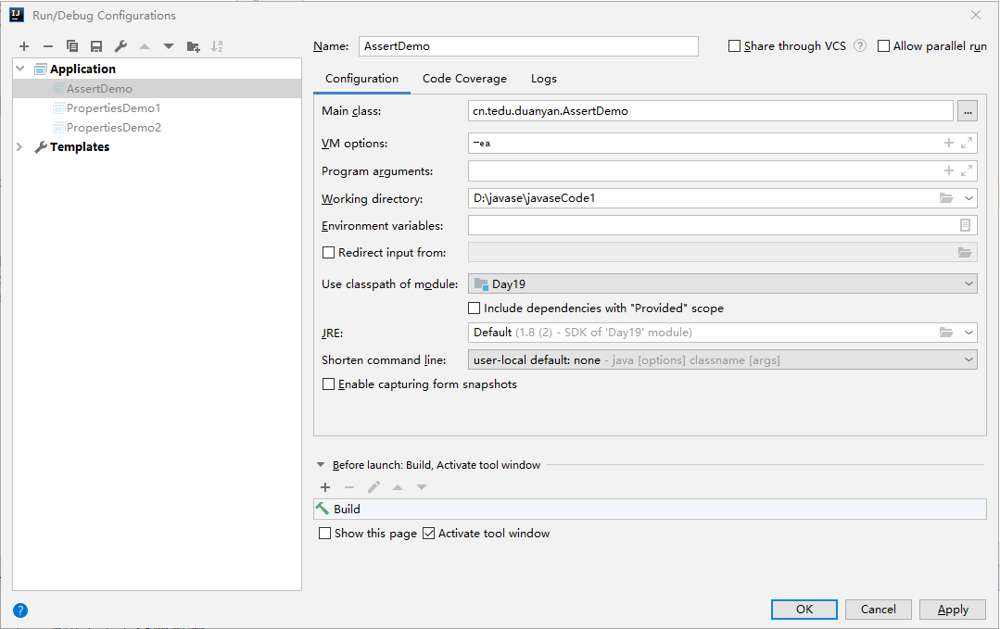

[TOC]

# Properties

> 配置文件
>
> 可以直接创建`.properties`文件并进行配置

## 特点

- 继承与Hashtable，是一个映射类

- 支持序列化、持久化
- 键和值只能是字符串(String)类型
- 可以把映射中的键和值写到一个properties文件中
- 后缀是`.properties`文件如果出现中文按`u-16`来进行编码
- 当作配置文件使用


## 方法

### 添加

> setProperty：添加键值对

```java
Properties p = new Properties();
p.setProperty("name", "zhangsan");
p.setProperty("gender", "female");
p.setProperty("age", "10");
```


### 写数据

> store：把映射里的键和值写入到其他文件中
>
> 参数：
>
> - 第一个：选择哪个输出流用来写数据
>   - 字节输出流/字符输出流
> - 第二个：说明

```java
public class PropertiesDemo1 {
    public static void main(String[] args) throws IOException {
        //创建一个映射类对象
        Properties p = new Properties();
        p.setProperty("name", "zhangsan");
        p.setProperty("gender", "female");
        p.setProperty("age", "10");
        //store
        p.store(new FileWriter("person.properties"), "xxxx");
    }
}
```

> 写出后生成的`xxx.properties`文件
>
> `.properties`文件中有中文，会按照`u-16`编码

```properties
#xxxx
#Mon Nov 25 14:52:53 CST 2019
age=10
name=zhangsan
gender=female
```


### 读数据

> `getProperty(String key)`：通过key获取值
>
> `list(System.out)`：列举所有的键值对,打印到控制台

```java
public static void main(String[] args) throws IOException {
    //创建映射
    Properties p = new Properties();
    p.load(new FileReader("person.properties"));
    //读取properties文件的内容
    String name = p.getProperty("姓名");
    String age = p.getProperty("age");
    String gender = p.getProperty("gender");
    //只根据key获取
    String gender2 = p.getProperty("gender","nv");
    
    System.out.println(name+","+age+","+gender2);
    
    //列举所有的键值对
    p.list(System.out);

}
```


# 单元测试

## 使用

- 导测试库：有网IDEA自动下载导入

  > 需要使用注解：`@Test`

  ```java
  @Test
  public void test(){
  	System.out.println(1);
  }
  ```

- `@Test`的方法不能有==参数==，因为方法不是调用，不能传参

- `@Test`不能有==返回值==，因为没有方法调用者

- `@Test`方法必须是==非静态==方法

- ==支持单元测试的方法是三无方法==


# 断言

## 概念

对结果进行预测

- 如果预测成功就执行结束
- 如果预测失败就会报错
  - `java.lang.AssertionError`

## 关键字

`assert`

## 使用

> 需要手动配置开启断言:`VM options:-ea`



```java
public class AssertDemo {
    public static void main(String[] args) {
        System.out.println("请输入小于10的整数");
        int n = new Scanner(System.in).nextInt();

        n = n >> 1;
        //断言
        //预测代码执行的结果
        assert n < 5:"失败的原因是输入的整数大于10";
        
        //如果预测成功断言结束
        System.out.println(n);
    }
}

//断言失败会报错：
//java.lang.AssertionError: 失败的原因是输入的整数大于10
```

