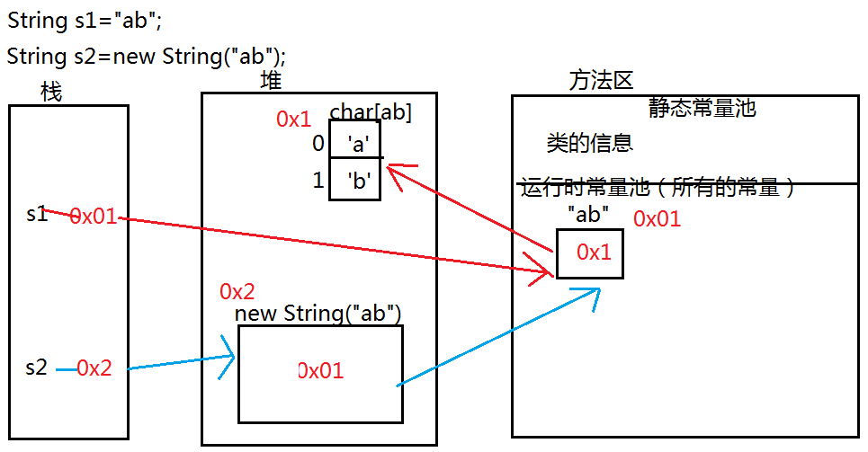

[TOC]

# String类

> String不可变的类，final修饰的类
>
> **Java中所有的字符串直接量都是String类的对象**
>
> 字符串底层都是依赖于不可改变的字符数组来实现的，创建之后不能改变
>
> - `private final char value[];`（str变量接收的值不可改变，但是引用可以改变）

## String类的初始化

### 直接赋值：`String str1 = "Hello";`

> 该hello存放在方法区中字符串常量缓冲区（ **运行时常量池** ）
>
> 如果String类的对象内容和后面的一致，就会共享同一个常量池的引用

```java
//s1指向常量池
String s1 = "ab";
String s2 = new String("ab");//s2指向堆中的String对象，该对象指向常量池

//因为String类前面对象的内容和后面一致，就会共享同一个常量池的引用
String s3 = "ab";//s3指向常量池

//byte b = 128-1; 如果等号右边参与运算的都是直接量，编译时期会进行优化，直接计算结果值，再进行赋值
String s4 = "a"+"b";//相当于s4 = "ab";
String s5 = "a";

//依赖于s5 = new StringBuilder("a").append("b").toString();来完成拼接
s5 += "b";

System.out.println(s1==s2);//false
System.out.println(s1==s3);//true
System.out.println(s1==s4);//true
System.out.println(s1==s5);//false
System.out.println(s2==s5);//false
```

> String s5 = "a";
>
> s5 += "b";
>
> 上述代码是通过`new StringBuilder("a").append("b").toString()`完成拼接并在堆中产生了一个新的String对象


### 使用构造方法

| 构造方法                                                     |                             介绍                             |
| :----------------------------------------------------------- | :----------------------------------------------------------: |
| `String str2 = new String();`                                |                     str="";不等价于null                      |
| `String str3 = new String("Hello");`                         |                                                              |
| `byte[]b = {97,98,99};`<br />`String str4 = new String(b);`  |                          结果：abc                           |
| `char[] c = {'a','b','c'};`<br />`String str5 = new String(c);` |                          结果：abc                           |
| `String str6 = new String(c,0,2);`                           |         结果：ab<br />从c数组的第0个下标开始转换2个          |
| `String s1 = new String(arr1,"GBK");`                        |                 通过指定的编码格式创建字符串                 |
| `String(byte[] bytes, int offset, int length, Charset charset)` | 构建了一种新的 String通过解码指定的字节数组使用指定的 charset。 |


## String的特殊事项

### str1和str3的区别

> String str1 = “Hello”;
>
> String str3 = new String("Hello");
>
> ------
>
> str1直接在常量池中申请一个空间，存放“Hello”
>
> str3在堆中创建一个对象，对象中的内容指向常量池的“Hello”；


### 用+连接符和StringBuilder比较

> ==综合来说拼接大量字符串时，StringBuilder效率更高==
>
> +在JDK1.5之前使用StringBuffer实现；之后使用StringBuilder实现
>
> StringBuffer线程安全：效率低
>
> StringBuilder线程不安全：效率高（>=JDK1.5）

```java
public static void test(){
    //用+号拼接
    long begin = System.currentTimeMillis();
    String str = "";
    for (int i = 0; i < 10000; i++) {
        str += "a";//每次循环创建3个对象
    }//一共创建30001个对象
    long end = System.currentTimeMillis();
    System.out.println("所用时间："+(end-begin)+"ms");

    long statr = System.currentTimeMillis();
    StringBuilder sb = new StringBuilder("");
    for (int i = 0; i < 10000; i++) {
        sb.append("a");//每次循环创建1个对象
    }
    String s = sb.toString();//一共创建10002个对象
    long end1 = System.currentTimeMillis();
    System.out.println("StringBuilder所用时间："+(end1-statr)+"ms");

}
```

### String和`(s5+="b")`StringBuilder的内存图




## 常用方法

> `String str = “abcda”;`

| 方法                                            | 案例                                                         |
| :---------------------------------------------- | ------------------------------------------------------------ |
| charAt（int index）:char                        | ==查找指定下标的字符==<br />String str = “abcda”；<br />char c = str.charAt（2）；*//c* |
| toCharArray():char[]                            | 将此字符串转换为一个新的字符数组                             |
| compareTo(String anotherString):int             | 两个字符串相减，返回差值，如果当前差值为0，就用后面的去相减直到最后一位【比较两个字符串的大小】<br />【字典】：<br />   如果返回值是==正数==，表示前面的字符串对象==大于==后面的字符串对象<br />   如果返回值是==负数==，表示前面的字符串对象==小于==后面额字符串对象<br />   如果返回值是==0==，  表示两个字符串对象==相等== |
| compareToIgnoreCase(String str)                 | 忽略大小写比较两个字符串的大小                               |
| concat(String str) :String                      | ==字符串连接==【只能拼接字符串，+可以拼接任意数据】<br />String str1 = str.concat("123");*//abcd123* |
| contains(CharSequence s)：boolean               | 如果参数包含在字符串中【连续区域内】，返回true，否则返回false<br />功能：参数是否是原字符串的字串 |
| endsWith(String suffix) :boolean                | boolean b = str.endsWith("cd");*//**如果以**cd**结尾，返回**true* |
| startsWith(String prefix) ：Boolean             | str = "abc123";<br />String str5 = str.startsWith("ab");*//true*   *==判断是否以**ab**开头==* |
| equalsIgnoreCase(String anotherString)：boolean | 忽略大小写比较两个字符串value值是否相等                      |
| getBytes()：byte[]                              | 把字符串转换成==字节==数组<br />编码Unicode编码体系最常用的编码集是UTF-8<br />==所有的完整码表默认兼容西欧码表（ISO-8859-1）==<br />==所有码表的前256位都是用西欧码表（ISO-8859-1）表示==<br />UTF-8中，汉字占3个字节，英文在255之前，所以占1个字节 |
| hashCode()：int                                 | 返回此字符串值的哈希代码。                                   |
| indexOf(int ch) ：int                           | ==查找字符下标，没有返回-1==<br />int index1 = str.indexOf("b");*//1*<br />int index2 = str.indexOf("cd");*//2* *返回第一个**c**的索引值*<br />int index3 = str.indexOf("ac");*//-1*  *查询不到字符串，返回 -1*<br />int index4 = str.indexOf("a",2);*//**从索引为**2**开始向后找**a**，没有返回**-1,**找到第一个返回索引（5）*** |
| lastIndexOf(int ch) ：int                       | ==从后往前找，返回第一次出现的位置==<br />int index5 = str.lastIndexOf('a');*//4* *从后往前找，第一次出现**a**的位置索引值* |
| intern():boolean                                | 返回字符串对象的规范表示形式。<br />`String str = "abc";String str1 = new String("abc");`<br />`str1 = str1.intern();`//*会把引用的指向由堆转向到常量池*<br />`System.out.println(str==str1);`//*true* |
| length（）：int                                 | int n = str.length();//5,**返回字符串的长度**                |
| isEmpty()：boolean                              | 判断字符串是否是空串，如果是：返回 true<br />空串：length()是 0。 |
| subString(int beginIndex) ：String              | ==截取字符串==<br />str = "helloabc123";<br />String str2 = str.subString(3);*//loabc123*<br />String str3 = str.subString(3,6);*//loa*   *范围：[3,6)* |
| trim():String                                   | str = "   a b c   ";<br />String str4 = str.trim();*//"a b c";*  *==去除字符串前后空格==* |
| toLowerCase() ：String                          | *==将所有字符串转换为 小 写==*                               |
| toUpperCase() ：String                          | ==*将所有字符串转换为 大 写*==                               |
| replace(char oldchar, char newChar):String      | 把原串中指定的所有字串替换成新的字符串并返回                 |
| replaceAll(String regex , String replacement)   | ==将符合regex的字符串转换成replacement字符串==               |
| matches（String regex）                         | ==用来判断是否符合regex 的规则==                             |
| split（String regex）                           | *//==分割字符串==，==没有==正则表达式*<br />String stu = "001&admin&22&17603393007";<br />String[] data = stu.split("&");<br />*//分割字符串，===有==正则表达式*<br />String str = "abs12344erere6662dfaf";<br />String regex = "[0-9]+";<br />String[] data = str.split(regex);<br />1、如果切割符在最前面就切成空串，后面直接切掉<br />2、如果最前面和中间出现多个切割符在一起，有几个切割符就切出几个空串（，分割） |
| valueOf(double/int..... d)：String              | 返回的 double/int/......参数的字符串表示形式。<br />可以支持所有的类型数据转成字符串对象 |

## 编码问题

- ==所有的完整码表默认兼容西欧码表（ISO 8859-1）==

- ==所有码表的前256位都是用西欧码表（ISO 8859-1）表示==

- UTF-8中，汉字占3个字节，英文在255之前，所以占1个字节

- GBK中，汉字占2个字节

  > 如果把GBK字节数字，转换到String字符串，出现乱码，说明码表不一致
  >
  > 可通过指定编码格式转换：`String s1 = new String(arr1,"GBK");`


> 案例

```java
 
public class Demo02 {
 
	public static void main(String[] args) {
		String str = "HelloWorld";
		String str1 = " Hello ";
		
		//输出字符串的长度
		System.out.println("str长度："+str.length());
		
		//输出“o”的位置
		System.out.println("o的位置："+str.indexOf('o'));
		
		//输出从下标5开始第一次出现“o”的位置
		System.out.println("从下标为5开始第一次出现o的下标："+str.indexOf('o', 5));
		
		//截取“Hello”并输出
		System.out.println("截取“Hello”："+str.substring(0,5));
		
		//截取“World”并输出
		System.out.println("截取“World”："+str.substring(5,str.length()));
		
		//将字符串“  Hello  ”两边的空白处去除后输出
		System.out.println("去除两侧空白："+str1.trim());
		
		//输出第6个字符W
		System.out.println("输出“HelloWorld”中第6个字符W："+str.charAt(5));
		
		//输出是否已h开头和ld结尾
		System.out.println("是否以h开头："+str.startsWith("h")+","+"是否以ld结尾："+str.endsWith("ld"));
		
		//将“HelloWold”分别转换为全大写和全小写输出
		System.out.println("转换为小写："+str.toLowerCase());
		System.out.println("转换为大写："+str.toUpperCase());
		
		Demo02 d = new Demo02();
		
		//域名www.orcal.com,www.tedu.co.cn
		String s3 = d.getStr("www.orcal.com");
		String s = d.getStr("www.tedu.com.cn");
		System.out.println("提取域名："+s);
		System.out.println("提取域名："+s3);
		
		String s1 = "上海自来水来自海上";
		String s2 = "abcddcba";
		System.out.println("是否是回文字符串："+d.test(s1));
 
	}
	//提取域名
	public String getStr(String str) {
		int Findex;
		int Sindex;
		Findex = str.indexOf(".",0);
		Sindex = str.indexOf(".",Findex+1);
		String newStr = str.substring(Findex+1, Sindex);
		return newStr;
	}
	//判断是否为回文字符串
	public boolean test(String str) {
		boolean b = true;
		for(int i = 0;i<(str.length()/2);i++) {
			if(str.charAt(i) != str.charAt(str.length()-i-1)){
				b = false;
				break;
			}
		}
		return b;
	}
 
}
 

```


# StringBuilder

> 相对String，提高了性能
>
> 底层是由一个可变字符数组实现的，在底层Java可以默认通过StringBuilder来把原字符串中所有的内容复制到底层这个可变字符数组中；底层是根据可变数组的扩容来实现字符串的拼接

## 常用方法

| 方法                                    | 介绍                               |
| --------------------------------------- | ---------------------------------- |
| append(boolean b)                       | 追加字符串                         |
| toString()                              | 以字符串形式输出                   |
| delete(int start, int end)              | 删除范围[start,end)范围内的字符串  |
| replace(int start, int end, String str) | 替换[start,end)范围内的字符串为str |
| insert(int offset, char c)              | 插入 在offset位置插入字符          |
| reverse()                               | 翻转，将整个字符串翻转             |


> 案例

```java
		 
public class DemoStringBuilder {

    public void testString() {
        String str = "a";
        for(int i = 0;i<10000000;i++) {
            str += "a";
            System.out.println(i);
        }
        System.out.println("执行完毕");
    }

    public void testStringBuilder() {
        StringBuilder sb = new StringBuilder("a");
        for(int i = 0;i<10000000;i++) {
            sb.append("a");
        }
        System.out.println("执行完毕");
    }

    //toString把StringBuilder转换成String
    public void test1() {
        StringBuilder builder = new StringBuilder("好好学习java");
        String str = builder.toString();
        System.out.println(str);
    }

    //追加各种数据类型
    public void test2() {
        StringBuilder builder = new StringBuilder("好好学习java,");
        builder.append("为了找到好工作");
        String str = builder.toString();
        System.out.println(str);
    }

    //删除字符
    public void test3() {
        StringBuilder builder = new StringBuilder("好好学习java,");
        builder.append("为了找到好工作");
        builder.delete(0, 8);//范围：[0,8)
        //替换
        builder.replace(1, 9, "为祖国做贡献");
        //插入
        builder.insert(0, "活着");
        String str = builder.toString();
        System.out.println(str);
    }

    //字符串翻转
    public void test4() {
        StringBuilder builder = new StringBuilder("好好学习java");
        builder.reverse();
        System.out.println(builder.toString());
    }
    public static void main(String[] args) {
        DemoStringBuilder demo = new DemoStringBuilder();
        demo.test3();
    }
}
```


# 正则表达式

> 正则表达式是一串特定字符，组成一个“规则字符串”，这个“规则字符串”是描述文件规则的工具
>
> 正则表达式是记录文本规则的代码


## 字符集

| 正则表达式       | 说明                                                   |
| ---------------- | ------------------------------------------------------ |
| **[abc]**        | a、b、c 中任意一个字符                                 |
| **[^abc]**       | 除了a、b、c 的任意字符                                 |
| **[a-z]**        | a、b、c、……、z 中的任意一个字符                        |
| **[a-zA-Z0-9]**  | a~z、A~Z、0~9中任意一个字符                            |
| **[a-z&&[ ^bc]** | a~z 中除了b和c意外的任意一个字符，其中&&表示“与”的关系 |


## 预定义字符串

| 正则表达式 | 说明                              |
| ---------- | --------------------------------- |
| .          | 任意一个字符                      |
| ==\d==     | ==任意一个数字字符，相当于[0-9]== |
| \w         | 单词字符，相当于**[a-zA-Z0-9_]**  |
| \s         | 空白字符，相当于**[\t\n\r]**      |
| \D         | 非数字字符**[^0-9]**              |
| \W         | 非单词字符                        |
| \S         | 非空白字符                        |


## 数量词

| 正则表达式 | 说明                               | 实例                    |
| ---------- | ---------------------------------- | ----------------------- |
| X?         | 表示0个或1个X                      | [0-9]?          4       |
| X*         | 表示0个或任意多个X                 | [0-9]*       343434     |
| X+         | 表示1个到任意多个X（大于等于1个X） | [0-9]+                  |
| X{n}       | 表示n个X                           | [a-z]{4}        abde    |
| X{n,}      | 表示n个到任意多个X（大于等于n个X） | [a-z]{6,}               |
| X{n,m}     | 表示n个到m个X                      | [a-z]{6,8}       abdddd |


> 案例

```java
public class TestRegex {

	//正则表达式验证电话号码
	public void test1() {
		String regex = "1[3|5|7|8][0-9]{9}";
		String phone = "13713385379";
		if(phone.matches(regex)) {
			System.out.println("电话号码正确");
		}else {
			System.out.println("电话号码错误");
		}
}

//正则表达式验证邮箱
//5-11位数字@qq.com.cn     wang_yi@tedu.cn        www@163.com.cn
	public void test2() {
		String regex = "[a-zA-Z0-9_]+@[a-z0-9]{2,}(\\.[a-z0-9]{2,})+";
		String mail = "531845606@qq.com";
		if(mail.matches(regex)) {
			System.out.println("邮箱正确");
		}else {
			System.out.println("邮箱错误");
		}
	}

	public static void main(String[] args) {
		TestRegex t = new TestRegex();
		t.test2();

	}

}
		 

```


> 1. 分组：
>    - （）圆括号表示分组，可以将一系列正则表达式看作一个整体
> 2. 边界匹配
>    - ^匹配开始，$匹配结束
> 3. String正则API
>    - matches（String regex）
>    - split（String regex）
>    - replaceAll（String regex，String replacement）
>    - 案例：对一个字符串中的所有数字进行替换；敏感字符过滤