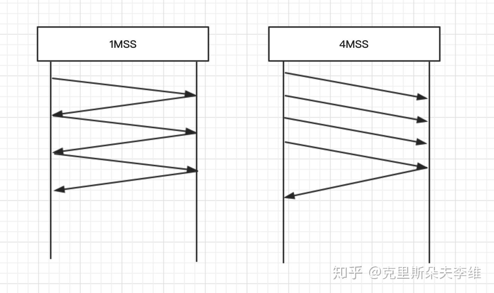
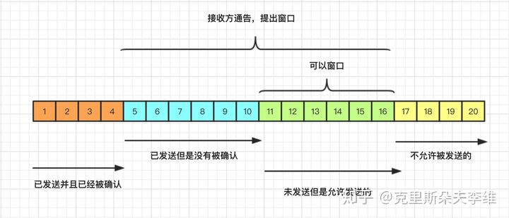

[TOC]

# 网络通信基础

> 通过IO流在网络上实现数据传输

## 网络模型

- 应用层
- 表示层
- 会话层
- 传输层（UDP、TCP）
- 网络层
- 数据链路层
- 物理层

IP地址：确定主机在网络中的位置

- IPV4：4位，0-255组成

端口：用于和计算机外界进行数据交互的媒介

- 端口号：0-65535个
- 在0-1024之间大部分被系统占用；指定转口号是尽量选1024后面的

域名：域名可以和IP地址一一映射


## 端口对象：套接字

- 客户端套接字：Socket

- 服务器套接字：SeverSocket
- Socket套接字：
		网络上具有唯一标识的IP地址和端口号组合在一起才能构成唯一能识别的标识符套接字。
- Socket原理机制：
		通信的两端都有Socket。网络通信其实就是Socket间的通信。数据在两个Socket间通过IO传输。
- 应用程序通常通过“套接字”向网络发出请求或者应答网络请求。Socket和ServerSocket类位于java.net包中。ServerSocket用于服务端，Socket是建立网络连接时使用的。在连接成功时，应用程序两端都会产生一个Socket实例，操作这个实例，完成所需的会话。

## 网络通信三要素：

- IP地址：`InetAddress`
- 端口号：用于标识进程的逻辑地址，不同进程的标识不同
- 传输协议：通讯的规则
  - 常见协议：TCP
  - FTP：常用于上传下载
  - HTTP：门户网站，大量用户访问

端口号：

​		每个网络程序都会至少有一个逻辑端口
​		用于标识进程的逻辑地址，不同进程的标识
​		有效端口：0-65535，其中0~1024系统使用或保留端口。

# 获取IP地址

## InetAddress

> 获取IP地址的相关方法：`InetAddress`类的使用

- 获取主机对象：`getLocalHost()`
- 主机名：`getHostName()`
- 主机Ip地址：`getHostAddress()`

```java
package wangluo;

import java.io.IOException;
import java.net.InetAddress;

public class InetAddressDemo {

	public static void main(String[] args) throws IOException {
		//获取本机主机对象
		InetAddress address = InetAddress.getLocalHost();
		System.out.println(address);
		
		//获取本机主机名
		String name = address.getHostName();
		System.out.println(name);
		
		//获取本机IP地址字符串表示
		String ip = address.getHostAddress();
		System.out.println(ip);
		
	}

}

```


## InetSocketAddress

> `getAddress()`：获取IP地址
>
> `getHostName()`：获取主机名
>
> `getPort()`：获取端口号

```java
package cn.tedu.net;
import java.net.InetSocketAddress;
public class InetSocketAddressDemo {
    public static void main(String[] args) {
        //创建代表IP和端口号的类的对象

        //127.0.0.1  固定IP,永远指向本地;对应域名位:localhost
        InetSocketAddress is = new InetSocketAddress("127.0.0.1",8090);
        System.out.println(is.getAddress());//获取IP地址
        System.out.println(is.getHostName());//获取主机名
        System.out.println(is.getPort());//获取端口号
    }
}
```


# 协议

> ==receive、connect、accept、write、read都会导致线程阻塞==

## UDP：

- 基于IO流

- 传输数据时不会建立连接、不可靠（数据有可能丢失）、传输速度很快
- 底层根据数据包来进行传输数据，数据包最大不能超过64KB
- 应用场景：直播、视频、语音
- 类：
  - `DatagramSocket`：UDP协议
  - `DatagramPacket`：数据包

### 发送端

> 创建数据包时：
>
> ```java
> DatagramPacket dp = new DatagramPacket
> ("hello".getBytes(), 
> "hello".getBytes().length,
> new InetSocketAddress("localhost", 9090)
> );
> ```
>
> - byte[]:要发送的数据
> - length：可以传输的数据的字节个数
> - 第三个参数：指定IP地址和端口号

```java
package cn.tedu.udp;

import java.io.IOException;
import java.net.DatagramPacket;
import java.net.DatagramSocket;
import java.net.InetSocketAddress;
import java.net.SocketException;

public class UDPSender {
    public static void main(String[] args) throws IOException {
        //创建UDP套接字对象
        DatagramSocket ds = new DatagramSocket();

        //创建一个数据包
        /*
            byte[]:要发送的数据
            length：可以传输的数据的字节个数
            指定IP地址和端口号
         */
        DatagramPacket dp = new DatagramPacket("hello".getBytes(), "hello".getBytes().length,
                new InetSocketAddress("localhost", 9090));
        //发送数据包
        ds.send(dp);
        //关流
        ds.close();
    }
}

```

### 接收端

> 创建UDP套接字对象时，要监听接口：
>
> - `DatagramSocket ds = new DatagramSocket(9090);`
>
> 接收数据包
>
> ```java
> DatagramPacket dp = new DatagramPacket
> (new byte[1024],1024);
>  ds.receive(dp);//接收数据----会发生阻塞
> ```
>
> - `byte[]`:待接收数据的字节数组
> - `length()`：指定可以接收的数据的长度
>
> 解析数据包
>
> - `getAddress()`获取IP地址
> - `new String(dp.getData(),0,dp.getLength())`
>   - `getData()`：获取数据内容   
>   - `getLength()`:获取数据长度
> - `getPort()`获取端口号

```java
package cn.tedu.udp;

import java.io.IOException;
import java.net.DatagramPacket;
import java.net.DatagramSocket;

public class UDPReceiver {
    public static void main(String[] args) throws IOException {
        //创建UDP套接字对象----监听9090端口号
        DatagramSocket ds = new DatagramSocket(9090);
        //创建接收数据的数据包
        /*
            byte[]:待接收数据的字节数组
            length：指定可以接收的数据的长度
         */
        DatagramPacket dp = new DatagramPacket(new byte[1024],1024);
        ds.receive(dp);//接收数据
        //关流
        ds.close();
        //解析数据包

        System.out.println(dp.getAddress());//获取IP地址

        //getData：获取数据内容    getLength:获取数据长度
        System.out.println(new String(dp.getData(),0,dp.getLength()));
        System.out.println(dp.getPort());
    }
}

```


## TCP通信：

- 基于IO流
- 会先建立链接(三次握手)、可靠（数据的完整）、传输速度
- 不根据数据包来传输数据，不限制数据的大小
- 使用场景：传输文件、聊天
- 客户端：Socket
- 服务器端：ServerSocket


### 客户端：

1. 创建TCP客户端对象
2. 发起连接，指定IP地址和端口号
3. 获取自带的字节输出流写出数据
4. 通知服务器端数据已经发送完毕
5. 关流

> connect、write 会发生阻塞

```Java
package cn.tedu.tcp;

import java.io.IOException;
import java.io.InputStream;
import java.io.OutputStream;
import java.net.InetSocketAddress;
import java.net.Socket;

public class TCPClient {
    public static void main(String[] args) throws IOException {
        //创建TCP客户端
        Socket s = new Socket();
        //建立链接---阻塞
        s.connect(new InetSocketAddress("127.0.0.1", 9092));

        /*向服务器端发送数据*/
        //获取自带的字节输出流，默认向服务器端发送
        OutputStream os = s.getOutputStream();

        os.write("您好".getBytes());//通过自带的输出流写出数据---阻塞
        s.shutdownOutput();//通知服务器端数据已经写完

        //接收服务器端发送的数据
        InputStream is = s.getInputStream();
        byte[] bs = new byte[10];
        int len = -1;
        while ((len = is.read(bs)) != -1) {
            System.out.println(new String(bs, 0, len));
        }

        //通知服务器端数据接收完毕
        s.shutdownInput();
        s.close();//关流

    }
}
```


### 服务器端：

1. 创建TCP服务器端对象
2. 接收链接
3. 获取自带的字节输入流读取数据
4. 通知客户端数据已经接收完毕
5. 关流

> 调用accept方法等待客户端的连接，并返回socket对象
>
> Socket socket = server.accept();
>
> accept、read会发生阻塞

```Java
package cn.tedu.tcp;

import java.io.IOException;
import java.io.InputStream;
import java.io.OutputStream;
import java.net.ServerSocket;
import java.net.Socket;

public class TCPServer {
    public static void main(String[] args) throws IOException {
        //创建服务器端对象---监听端口
        ServerSocket ss = new ServerSocket(9092);
        //接收链接---阻塞
        Socket s = ss.accept();
        //接收客户端发送的数据
        InputStream is = s.getInputStream();
        byte[] bytes = new byte[10];
        int len = -1;
        while ((len = is.read(bytes)) != -1) {//---阻塞
            System.out.print(new String(bytes,0,len));
        }

        s.shutdownInput();//通知客户端数据已经接收完毕

        //获取自带的字节输出流，给客户端发送数据
        OutputStream os = s.getOutputStream();
        os.write("你也好".getBytes());
        s.shutdownOutput();//通知客户端数据已经发送完毕

        s.close();
    }
}

```


# TCP三次握手，四次挥手


# 四次挥手TIME_WAIT问题

1. 保证最后的数据在网络中过期，防止新连接接收到脏数据
2. 保证第四次握手ACK应答没到达服务端，服务端需要重传第三次握手，所以主动方需要保持一段时间的连接

## TIME_WAIT过多怎么办

1. 让端口可以重复使用

2. 减少TIME_WAIT的等待时间

3. 增加可用端口（改配置文件）

   如发现系统存在大量TIME_WAIT状态的连接，通过调整内核参数解决：
   编辑文件/etc/sysctl.conf，加入以下内容：

   ```shell
   net.ipv4.tcp_syncookies = 1
   net.ipv4.tcp_tw_reuse = 1
   net.ipv4.tcp_tw_recycle = 1
   net.ipv4.tcp_fin_timeout = 30
   net.ipv4.ip_local_port_range = 1024 65000
   ```

   然后执行 /sbin/sysctl -p 让参数生效。

   ```shell
   net.ipv4.tcp_syncookies = 1 表示开启SYN Cookies。当出现SYN等待队列溢出时，启用cookies来处理，可防范少量SYN攻击，默认为0，表示关闭；
   net.ipv4.tcp_tw_reuse = 1 表示开启重用。允许将TIME-WAIT sockets重新用于新的TCP连接，默认为0，表示关闭；
   net.ipv4.tcp_tw_recycle = 1 表示开启TCP连接中TIME-WAIT sockets的快速回收，默认为0，表示关闭。
   net.ipv4.tcp_fin_timeout 修改系默认的 TIMEOUT 时间
   net.ipv4.ip_local_port_range = 1024 65000 表示用于向外连接的端口范围
   ```

## TIME_WAIT发起新的连接会怎么样

如果有其他可用端口，就会连接新的端口，端口不够用了报502错误


# TCP滑动窗口

如果每次传输数据都只能发送一个MSS，就需要等待接收方的ACK，这显然会极大的影响传输的速率。在发送数据的时候，最好的方式是一下将所有的数据全部发送出去，然后一起确认。



但是现实中确实会存在一些限制：

- 接收方的缓存（接收窗口）可能已经满了，无法接收数据。
- 网络的带宽也不一定足够大，一口发太多会导致丢包事故。

发送方要知道接收方的接收窗口和网络这两个限制因素中哪一个更严格，然后在其限制范围内尽可能多发包。==这个一口气能发送的数据量就是传说中的TCP发送窗口。==


首先TCP在进行数据传输的时候都是先将数据放在数据缓冲区中的，TCP维护了两个缓冲区，发送方缓冲区和接收方缓冲区。

- **发送方缓冲区**：发送方缓冲区用于存储已经准备就绪数据和发送了但是没有被确认的数据。
- **接收方缓冲区**：接收方缓冲区用于存储已经被接收但是还没有被用户进程消费的数据。

==滑动窗口机制是TCP的一种流量控制方法，该机制允许发送方在停止并等待确认前连续发送多个分组，而不必每发送一个分组就停下来等待确认，从而增加数据传输的速率提高应用的吞吐量。==

