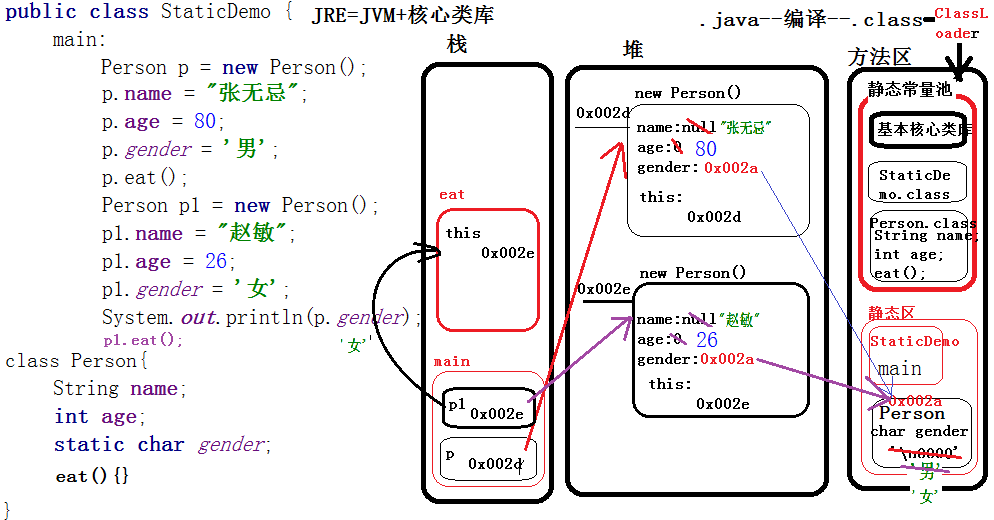

[TOC]

> Objcet类是所有类的父类，若此类未进行继承，则会自动继承Object类

# 重写toString（）

> ​	toString方法是Object类里面的方法，默认情况下会调用Object类里面的toString（）方法，
>
> ​	例如（输出的时候就会自动调用），但是toString()不能满足子类（派生类）的需求，所以我们需要重写toString方法。
>
> ​	例如我们做输出的时候，在运行期会自动调用重写的toString()方法


# package

- Java：Java源生包
  - lang包：在程序启动时就会把包下所有的信息加载到方法区，使用时不用导包
  - util包：提供了操作对象和类的功能（工具包）
  - io包：数据传输
  - math包：提供简单的数学运算
  - net包：网络
  - nio包：高并发
  - security包：安全
  - sql包：操作数据库
  - text包：格式化（4.56786 保留2位小数）
  - time包：时间和日期
- Javax：Java的扩展包
- org：第三方厂商提供的包

## 定义包

> ​	定义类，需要制定类的名称，但是如果仅仅将类名作为唯一标识，则不可避免的出现命名冲突的问题，这会给组件复用以及团队间合作产生很大麻烦。所以在Java语言中，用包（package）的概念来解决命名冲突的问题。在定义一个类时，除了定义类的名称一般还要制定一个包名，定义包名的语法是：package a;
>
> ```java
> package a;
> class login{
> 
> }
> ```

1. 作用：避免类明冲突

2. 包名可以有层次结构（a.b.c.d，这个点就是层次结构，很少单独用一个包名，基本上都是一串），包名中不能类明相同

3. 类的全称：包名.类名

4. 建议：==包名所有字母都小写==

5. 当项目非常大的时候，包名建议：域名反写.项目名.模块名.类明

   ```java
   cn.a.taobao.login.Demo1
   cn.b.taobao.login.Demo1
   cn.c.taobao.login.Demo1
   ```


## 导包

1. 访问一个类时需要使用类的全称，这书写比较繁琐，所以我们可以用import语句对类的全称进行声明。
2. import的语法为：import 包名+类名
3. 同包中的类可以直接访问，不同包中的类不可以直接访问，若想访问只能如下两种方式：
   - ==先import声明类再访问==-----建议
   - Java.util.Date d = new Java.util.Date();


# 访问修饰符

|           | 本类 | 同包类 | 子类          | 其他类 |
| --------- | ---- | ------ | ------------- | ------ |
| public    | √    | √      | √             | √      |
| protected | √    | √      | √             |        |
| 默认的    | √    | √      | 同包子类（√） |        |
| private   | √    |        |               |        |

> 1. 最大的意义：我们要将代码保护起来
>
> 2. 要求：在设计类的时候，数据私有化（private），行为公开化（public）
>
>    - private：私有的，只能在==本类==使用	
>
>    - protected：受保护的，只能在==本类，子类，同包类==使用
>
>    - 默认的：什么都不写，==本类和同包类==
>
>    - public：公开的，==任何类==都可以使用
>
>      ```java
>      public class Aoo {
>      	public int i;
>      	protected String str;
>      	double d;
>      	private int[] arr;
>      	public void run01() {}
>      	protected void run02() {}
>      	void run03() {}
>      	private void run04() {}
>      		
>      }
>      ```


## protected

1. 作用域：在本类、子类、同包类

2. 确定不是本类和同包类，那一定是子类进行调用

3. 根据继承分原则:子类能继承父类用public修饰的成员变量和方法

4. 但是由于权限问题：==我们只能通过创建对象的方式为public修饰的子类进行赋值（原因是不同包）==

5. 如果想==调用父类的protected修饰的成员变量==

   - 那我们可以用`super.成员变量`的方式进行调用

   ```java
   	package day0501;
   	
   	import day05.Aoo;
   	/**
   	 * 1.protected:作用域是在本类、子类、同包类
   	 * 2.确定不是本类和同包类，那一定是子类进行调用
   	 * 3.根据继承分原则:子类能继承父类用public修饰的成员变量和方法
   	 * 4.但是由于权限问题：我们只能通过创建对象的方式为public修饰的子类进行赋值（原因是不同包）
   	 * 5.如果想调用父类的protected修饰的成员变量
   	 * 	那我们可以用----super.成员变量----的方式进行调用
   	 * 
   	 * 
   	 * @author dell
   	 *
   	 */
   	public class Boo extends Aoo{  
   	        void show() {
   	                Aoo a = new Aoo();
   	                a.i = 1;
   	                super.str = "字符串";
   	                //a.d = 0.0;
   	                //a.arr = new int[3];
   	                a.run01();
   	                super.run02();
   	                //a.run03();
   	                //a.run04();
   	        }
   	}
   
   ```

   

## final

> 最终的，不可改变的------应用率低

1. 修饰变量：变量不可被改变

   final修饰的成员变量，只有如下两种初始化方式
   
   - 声明的同时初始化
   - 在构造方法中初始化
   
   final修饰的局部变量，只要在用之前初始化即可
   
   ```java
   class Eoo{
   	//final修饰成员变量，只有如下两种初始化方式
   	//1.声明的同时初始化
   	//2.在构造方法中初始化
   	//final修饰局部变量，只要在用之前初始化即可
   	final int a = 5;
   	final int b;
   
   	Eoo(){
   		b = 5;
   	}
   	void test() {
   		final int c;
   		//a = 55;//a是 final修饰的，不能被改写
   	}
   
   }
   ```
   

   
2. 修饰方法：方法不能被重写；可以重载；可以被继承

   ```java
   //用final修饰的方法不能被重写
   class Foo{
   	final void show() {}
   	void say() {}
   }
   class Goo extends Foo{
   	//void show() {}//编译错误，final修饰的方法不能被重写
   	void say() {}
   }
   ```

   

3. 修饰类：类不能被继承

   ```java
   public class FinalDemo {
   
   }
   
   
   final class Hoo{}
   //class Ioo extends Hoo{}//编译错误，final修饰的类不能被继承
   ```

   

# 静态



## 静态变量

1. 成员变量

   - 实例变量

     - 属于对象的，存在堆中
     - 有几个对象，就有几个实例变量
     - 使用：必须通过`对象名.`访问

   - 静态变量

     - 有static修饰，==属于类，存在方法区中==
     - 无论创建多少个对象，只有一份
     - 使用：常常通过`类名.`访问

     ```java
     class Aoo{
     	int a;//实例变量
     	static int b;//静态变量
     }
     ```

2. 由static修饰

3. ==属于类，存在方法区中，只有一份==

   - 类加载之后不在移除，直到整个程序运行结束；静态变量是随着类加载到方法区的静态区中，直到类被移除才会释放

4. 常常通过`类名.`访问（`对象.` ==也可以访问，不建议使用==）

5. 何时用：所有对象共享数据的时候（图片，视频，音频）

6. 应用场景：

   - 如果每个对象的特征值都一样，则可以使用static修饰

```java
class Loo{//演示静态变量
	int a;//成员变量-----实例变量，属于对象的
	static int b;//成员变量-----静态变量，属于类
	Loo(){
		a++;
		b++;
	}
	void show() {
		System.out.println("a="+a+",b="+b);
	}
}
```


## 静态方法

1. 由static修饰
2. ==属于类，存在方法区中，只有一份==
3. 常常通过`类名.`访问
4. ==静态方法没有隐式的this传递，静态方法中不能直接访问实例成员（变量、方法）==
5. ==静态方法中不能定义静态属性==
6. ==main方法中不能使用this、super==
7. ==子类能继承父类的静态方法==，==不能重写父类的静态方法==，==可以存在与父类同名的静态方法==
8. ==静态方法可以重载==
9. 何时用：方法的操作仅与参数相关而与对象无关

```java
class Moo{//演示静态方法
	int a;
	static int b;
	void show() {//会有一个隐式的this，来表明当前对象
		System.out.println(this.a);
		System.out.println(Moo.b);//属于类，正确
	}
    
    
    /*静态方法没有隐式this传递，没有this就意味着没有对象。而实例变量a必须通过对象.来访问
	 *结论：静态方法中不能直接访问实例成员
	 */
	static void test() {//静态方法属于类，没有隐式this，表明不了调用对象

		//静态方法不能直接访问实例变量
		//System.out.println(a);
		System.out.println(Moo.b);
	}
	
}
```


## 静态块

1. ==属于类的，在类被加载期间自动执行==，因为类只被加载一次，所以==静态块也执行一次==
   - 被执行的情况：
     - 创建类的对象
     - 调用类的静态方法
     - 调用静态属性
2. 何时用：初始化/加载静态资源的时候（图片，音频，视频等）
3. 注意：
   - ==静态块中不能定义静态变量==，但可以使用/修改

```java
class Noo{//静态块+执行顺序    结果：静态块----构造方法
	static {
		System.out.println("静态块");
	}
	Noo(){
		System.out.println("构造方法");
	}
}
```


# 常量

1. ==必须声明的同时初始化==
2. 通过`类名.`来访问，不能被改变
3. 建议：常量名==所有的字母大写，多个单词用_分隔==
4. 编译器在==编译时常量直接替换为具体的值==，效率高
5. 何时用：==数据经常使用，并且永远不变==

```java
public class StaticFinalDemo {
	public static int num = 100;//静态变量
	public static final int NUM = 100;//常量
	public static final int CONTENT_HEADER_MAPPING = 1;//常量
	public static void main(String[] args) {
		System.out.println(StaticFinalDemo.NUM);
		System.out.println(100);
	}
}
```

- final修饰的对象，地址不可改变，对象属性可以改变

  ```java
  final Person p = new Person();
  p.name = "a";//正确
  
  p = null;//错误
  ```

  


# static、final总结

## Static变量

1、属于类，存在方法区中，无论创建多少个对象，只有一份

2、通过  ==类名.== 访问

3、Static变量，在类被移除后才会被释放

## Static方法

1、属于类，存在方法区中，只有一份

2、通过 ==类名.== 访问

3、静态方法不能直接访问成员变量和普通的方法

4、静态方法中不能定义静态属性（静态属性在加载类时就会被初始化，静态方法在被调用时才会被执行）

5、main方法中不能用this、super

6、静态方法不能被重写；子类能继承静态方法，子类中可以有与父类同名的静态方法

7、静态方法可以重载

## Static块

1、属于类，在类被加载期间自动执行，只执行一次（创建类的对象时、调用类的静态方法时、调用静态属性时）

2、静态块中不能定义静态变量，但是可以使用和修改

 

## final修饰变量

1、变量不可被改变

2、在声明时同时初始化、在构造方法中初始化

3、final修饰的局部变量在使用前初始化就可以

### final修饰对象

1、引用不可变，对象的属性可以改变（地址不可变，所指的内存中的属性可以变）

## final修饰方法

1、方法不能被重写

2、方法可以重载

3、方法可以被继承

## final修饰类

1、类不能被继承

 

## Static final常量

1、必须声明的同时初始化

2、通过 ==类名.==  访问，不能被改变