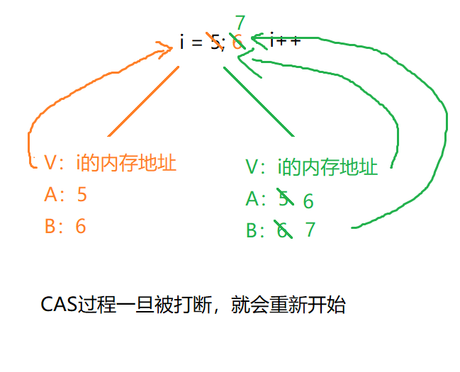
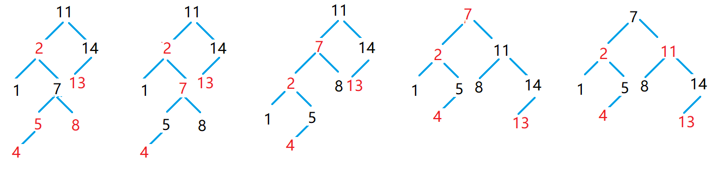

[TOC]


# ConcurrentMap - 并发映射

## 概述

1. 该映射是JDK1.5 提供的用于高并发场景下的映射接口
2. 该映射的实现类往往是异步式线程安全的


# ConcurrentHashMap

## 特征

> 并发哈希映射

- 该映射是一个异步式线程安全的映射
- 底层是依靠数组+链表结构来存储数据；默认容量是16，默认加载因子是0.75
- 使用时可以指定容量，也可以不指定
  - 如果指定容量n，如果容量介于2^n^和2^n-1^之间，实际容量经过运算应该是2^n+1^
  - 不指定容，按默认容量初始化
- 已使用桶数/总桶数 > 加载因子(0.75)，就会扩容
  - 每次扩容，都是在原有基础上增加一倍
- 添加元素
  - JDK 1.8之前：向桶中的链表添加元素采用头插法
  - JDK 1.8之后：向桶中的链表添加元素采用尾插法
- 实现
  - JDK 1.7：底层采用分段锁+读写锁
  - JDK 1.8：底层采用无锁算法CAS+红黑树

## JDK 1.7区别

### 分段锁机制

ConcurrentHashMap是由Segment数组结构和HashEntry数组结构组成。

- Segment是一种可重入锁ReentrantLock，在ConcurrentHashMap里扮演锁的角色
- HashEntry则用于存储键值对数据。

一个ConcurrentHashMap里包含

- 一个Segment数组，Segment的结构和HashMap类似，是一种数组和链表结构
- 一个Segment里包含一个HashEntry数组，每个HashEntry是一个链表结构的元素， 每个Segment守护者一个HashEntry数组里的元素,当对HashEntry数组的数据进行修改时，必须首先获得它对应的Segment锁。


### 读写锁

> 在JDK 1.7 中，ConcurrentHashMap在分段锁的基础上引入了读写锁，提高了ConcurrentHashMap的效率

- 读锁：只读数据，可以很多线程同时读，但不能写，就加读锁
- 写锁：写数据，只能有一个人写数据，且不能读取，就加写锁


## JDK 1.8区别

### CAS

> 考虑锁带来的开销（锁在CPU上实际上会非常占用资源），引入了一套无锁算法CAS(Compare And Swap - 比较和交换)
>
> CAS虽然叫算法，但实际上是结合硬件和操作系统的内核架构来实现的

CAS语义：我认为V的值应该是A，如果是，那么将V的值更新为B，否则不修改并告诉V的值实际为多少

- V：内存值
- A：旧的预期值
- B：新的预期值



> CAS特点：

- CAS的本意为Compare And Swap，是一种无锁算法
- CAS需要结合CPU指令实现，现在大多数处理器架构都支持CAS算法的
- CAS是一种乐观锁，即当多个线程尝试使用CAS同时更新一个变量的时候，只有其中一个线程能更新变量的值，而其他线程失败。失败的线程并不会被挂起，而是会被告知在本次竞争中失败，并且可以再次尝试
- CAS有三个参数：内存值V，旧的预期值A，要修改成的值B
- 当且仅当预期值A和内存值V对应的值相同，才会将值修改为B，否则什么都不做


### 链表转红黑树

> JDK 1.8 开始，引入红黑树机制

==当数组长度>=64时，如果桶中的元素超过8个的时候==，会将这个桶中的链表扭转成一个红黑树

如果这个桶中红黑树的节点<=7个，会将这颗红黑树扭转回链表


## 红黑树

> ==详细红黑树查看数据结构目录==

- 红黑树本身是一颗自平衡二叉查找树
- 二叉查找树的特点：左子树小于根，右子树大于根
- 红黑树特点：
  - 所有节点非红即黑
  - 根节点是黑色
  - 红节点的子节点一定是黑色的；黑节点的子节点可红可黑
  - 从根节点到任意一个叶子节点的路径中包含的黑色节点个数相同。即黑节点的高度是一致的
  - 新增节点一定是红色

### 修正操作

> 当添加之后：父节点为红色

1. 涂色：叔父节点为红：将父节点以及叔父节点涂黑，然后将祖父节点涂红
2. 左旋：叔父节点为黑，并且当前子节点是右节点，需要以当前节点为轴进行左旋
3. 右旋：叔父节点为黑，并且当前子节点是左节点，需要以父节点为轴右旋


> 修正案例




# ConcurrentNavigableMap

> 并发导航映射

- ConcurrentNavigableMap中提供了用于==截取子映射的方法==
- ConcurrentNavigableMap本身是一个接口，目前为止只提供了一个实现类`ConcurrentSkipListMap`
- `ConcurrentSkipListMap` ：并发跳跃表映射，底层是基于跳跃表来存储的

## ConcurrentSkipListMap

### 代码

```java
public class ConcurrentNavigableMaoDemo {

    public static void main(String[] args) {
        ConcurrentNavigableMap<String, Integer> map = new ConcurrentSkipListMap<>();

        map.put("a",3);
        map.put("r",4);
        map.put("y",5);
        map.put("b",6);
        map.put("f",7);
        map.put("q",8);
        map.put("o",1);

        //输出整个map
        System.out.println(map);

        //从头部截取到"o"位置，不包括"o"
        System.out.println(map.headMap("o"));

        //从"o"开始截取到尾部,包括"o"
        System.out.println(map.tailMap("o"));

        //截取["b","r")
        System.out.println(map.subMap("b","r"));
    }
}

//👇👇👇👇结果👇👇👇👇
{a=3, b=6, f=7, o=1, q=8, r=4, y=5}
{a=3, b=6, f=7}
{o=1, q=8, r=4, y=5}
{b=6, f=7, o=1, q=8}
```


### 跳跃表

- 跳跃表针对的有序元素
- 跳跃表适合查询多而增删少的场景
- 跳跃表可以层层提取，形成多层的跳跃表，最上层跳跃表的元素个数不少于2个
- 跳跃表本身是一个典型的“以空间换时间”的产物
- 如果在跳跃表中新增元素，那么新增的元素是否要提取到上层跳跃表中，遵循“抛硬币”原则
- 跳跃表的查询时间复杂度是O(lgn)

