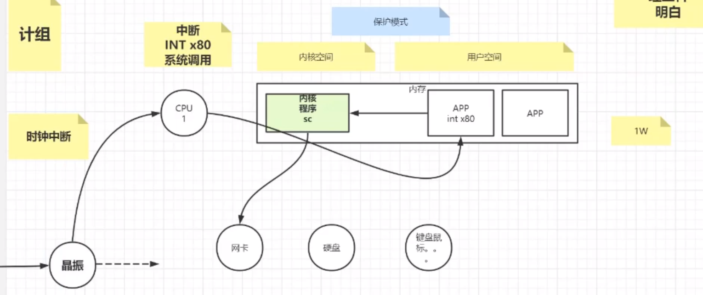
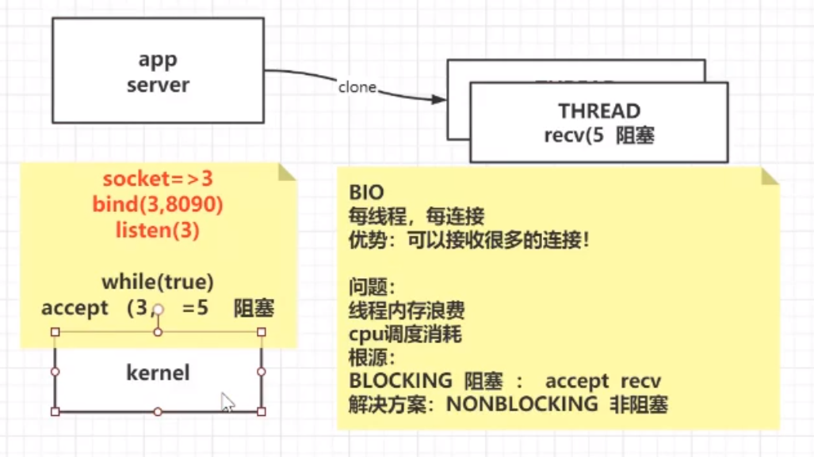
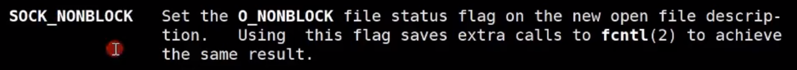
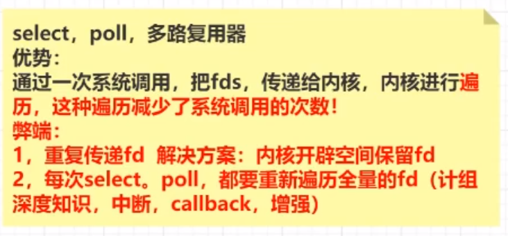
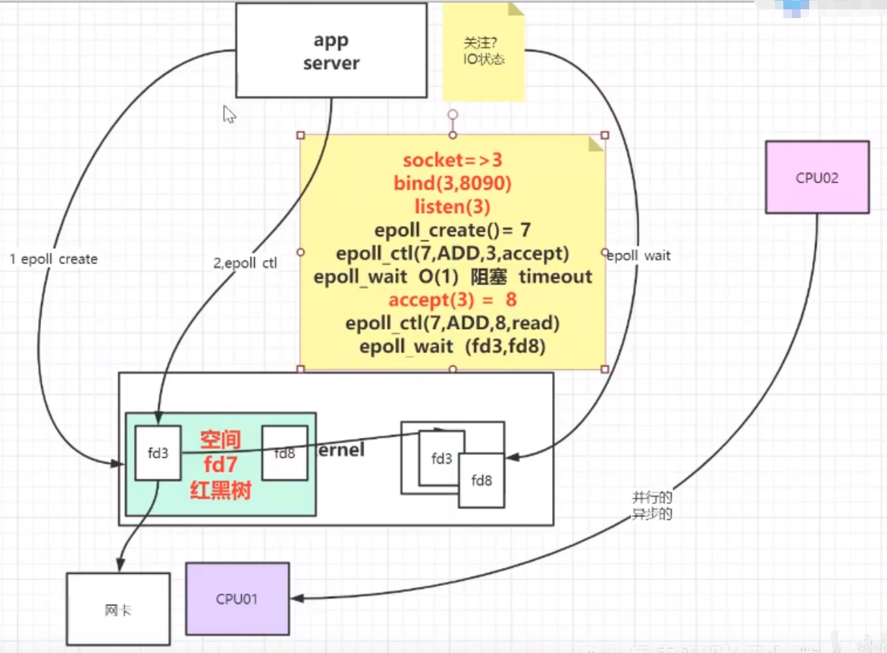

[TOC]

# IO


> 计算机组成原理通俗图解



    
   在电脑开机后，会把内核程序加载到内存中

   计算机的所有硬件操作都有内核程序来完成，这样APP就不用重复造轮子，需要使用硬件（网卡，硬盘，键鼠等），就要通过内核来完成。

   在内核加载到内存后，为了保护内核程序绝对安全，会把内存分为==内核空间==和==用户空间==，并启动保护模式。这样，内核空间可以访问整个内存，但用户空间不能直接访问内核空间

   计算机只有一个CPU，但是程序看起来是并行运行的，原因就是CPU时间片，轮流执行APP进程。但是程序里从来没写过有关时间片的东西，所以，轮询执行，是通过中断来完成的。

1. **每个线程之间的切换**

   计算机中会有一个==晶振==，直流电进入，会以一定频率输出，如图上所示。每振一次，会给CPU一个==时钟中断==（作用到一颗针脚上）。此时，CPU不再执行当前线程，会把CPU寄存器的内容，写回当前线程的内存区域（保护现场），清空缓存。

   中断有对应的回调程序，回调程序是加载内核后注册的。CPU回去内核中执行回调（比方叫：进程调度），下一次该执行哪个进程，会把要执行的进程的上次状态写回CPU寄存器（恢复现场）

   如此往复，==每次切换进程都会重复的写出写入寄存器，产生性能损耗==。如果运行的程序越来越多，那么CPU在进行线程调度的时间要比线程执行的时间占的更多，最后程序就会变慢

2. **使用软中断**

   如果程序用到了硬件，比方说网卡，他需要调用内核程序。此时也会产生一个中断：==软中断==（INT x80）

    *INT 中断单词前三个字母，x80是一个号码，在中断向量表中一共255个*

   因为有保护模式存在，程序不能直接访问内核程序，所以要产生系统调用。虽然代码里写的好像是个函数调用，但是编译后，会自动改为系统调用，即==函数名+INT x80==，当CPU读到该指令到CPU寄存器中时，CPU会保护现场，将线程状态写回内存，然后CPU加载内核程序，运行拿到结果，再恢复上次线程，写回结果

   这就是线程的==用户态和内核态的切换==，产生性能损耗

3. **IO中断**

   比方说鼠标的移动，每移动一次，都会产生一次IO中断，回调会将鼠标的坐标刷新到程序中


# 网络通信IO演变过程

## BIO



服务端serverSocket指定一个端口，做了三件事

- 调用内核socket指令，返回一个文件描述符 ： 3
- 调用内核bind指令，绑定文件描述符和端口
- 调用内核listen指令，监听返回的文件描述符

进入while(true)死循环，接收客户端请求

- 调用内核accept指令，传入socket返回的文件描述符和连接信息。此时没有客户端连接，会产生阻塞
- 当客户端连接后，accept通过，返回一个文件描述符 ：5

得到客户端的文件描述符后，调用内核clone指令，创建一个线程，在线程中执行读写，当客户端没有发送数据时，recv指令阻塞

> BIO
>
> 每个线程，是每一个连接

优势：可以接收很多的连接

劣势：线程内存浪费。CPU调度损耗

根源：阻塞（BLOCKING）。accept，recv指令阻塞

解决方案：非阻塞（NONBLOCKING）

> BIO受阻于内核，内核指令不支持非阻塞

## NIO

> 内核的发展，支持非阻塞

**优势**：避免多线程的问题  

**劣势**：假设1万个连接，只有一个发来数据，每循环一次，必须向内核发送1万次recv的系统调用（产生软中断），那么就有9999次是无意义的，浪费时间和资源。

​		用户空间向内核空间的循环遍历，复杂度在系统调用上

​		解决方案：==多路复用== - selector - 基于内核的发展

C10K问题？

在内核指令socket中有一个参数：




### Java中的NIO：new IO 

> java的nio包，提供了新的接口

Java的NIO包括Channel，Buffer，Selector（内核中的多路复用可能是select，poll，epoll，kqueue）

**代码实现**

```java
package org.example;

import java.io.IOException;
import java.net.InetSocketAddress;
import java.nio.ByteBuffer;
import java.nio.channels.*;
import java.util.Iterator;
import java.util.Set;

public class SocketNIO {

    private ServerSocketChannel server = null;
    private Selector selector = null;// 多路复用（可能是select，poll,epoll,kqueue）
    int port = 9090;

    public void initServer(){
        try {
            server = ServerSocketChannel.open();
            server.configureBlocking(false);
            server.bind(new InetSocketAddress(port));
            selector = Selector.open();//epoll下，open()相当于epoll_create  =>fd3

            // 此时server已经执行了 listen指令，文件操作符 fd4

            /*
                如果是：
                    select,poll:就在jvm中开辟一个数组，将fd4放进去
                    epoll:      执行epoll_ctl(fd3,ADD,fd4,EPOLLIN)
             */
            server.register(selector, SelectionKey.OP_ACCEPT);

        } catch (Exception e) {
            e.printStackTrace();
        }
    }

    public void start(){
        initServer();
        System.out.println("服务器启动了。。。");
        try {
            while (true) {
                Set<SelectionKey> keys = selector.selectedKeys();
                System.out.println(keys.size() + " size");

                /*
                    select()啥意思？：
                        1。select，poll：就是调用内核指令select(fd4)或者poll(fd3),将所有的文件操作符拷贝到内核进行遍历，拿到所有的有状态的文件操作符
                        2。epoll       ：就是调用内核epoll_wait(),拿到所有有状态的文件操作符
                 */
                while (selector.select(500) > 0) {
                    Set<SelectionKey> selectionKeys = selector.selectedKeys();
                    Iterator<SelectionKey> iterator = selectionKeys.iterator();
                    while (iterator.hasNext()) {
                        SelectionKey key = iterator.next();
                        if (key.isAcceptable()) {
                            acceptHandler(key);
                        } else if (key.isReadable()) {

                        } else if (key.isWritable()) {

                        }

                    }
                }
            }
        } catch (Exception e) {
            e.printStackTrace();
        }
    }

    /**
     * 创建连接
     * @param key
     */
    private void acceptHandler(SelectionKey key) throws IOException {
        ServerSocketChannel ssc = (ServerSocketChannel) key.channel();
        SocketChannel client = ssc.accept();// 接收连接
        client.configureBlocking(false);// 非阻塞
        ByteBuffer buffer = ByteBuffer.allocate(8192);

        /*
            这里将接收的连接，注册到selector中
               select，poll：就是在jvm的数组中，放入了一个 fdx 文件操作符
               epoll：执行epoll_ctl(fd3,ADD,fdx,EPOLLIN)
         */
        client.register(selector, SelectionKey.OP_READ, buffer);
        System.out.println("-----------------------------------");
        System.out.println("新客户端：" + client.getRemoteAddress());
        System.out.println("-----------------------------------");
    }


    public static void main(String[] args) {

    }
}

```


### 操作系统的NIO ： NONBLOCK


## 解决无效的软中断 - 多路复用（内核层面）

> 假设1万个连接，只有一个发来数据，每循环一次，必须向内核发送1万次recv的系统调用（产生软中断），那么就有9999次是无意义的，浪费时间和资源。
>
> ​		用户空间向内核空间的循环遍历，复杂度在系统调用上

==多路复用== - selector - 基于内核的发展，还有poll，epoll。都是同步的

多路复用器：**只是拿到了状态**

### select

select只能接受1024个客户端连接

只需要拿到可以读的 文件描述符，遍历可读的，进行读取即可




### epoll

JVM在Linux上启动默认使用epoll

> epoll的大概逻辑图
>
> 相比如poll在内核中多了两块空间，用于存放连接的文件操作符 和 有状态的文件操作符

如果计算机有多核CPU，那么有一个CPU存放所有的文件操作符

- CPU1用来处理网卡到来的连接，数据，将文件操作符添加到第一个空间
- CPU2用来处理上层应用调用拿到所有有状态的文件操作符

所以CPU1和CPU2就是并行异步的



为了解决select每次都要把所有的文件描述符dfs拷贝到内核进行循环遍历，epoll在内核中开辟了2个空间

- 一个用来存放文件描述符 ：一创建连接，就把文件描述符放到该空间中，只放一次
- 一个用来存放哪些文件描述符有状态 ：当该连接有状态变化，就会把改文件描述符拷贝到该空间中，用于返回给APP程序

如何把第一个空间的文件描述符复制到返回区，暂不了解，太底层了


> epoll指令，可以通过Linux命令`man 2 epoll`查看

有3个指令：参考上图

- epoll_create()：创建第一个空间的指令，会返回一个epoll的文件描述符，比方说7

- epoll_ctl()：当有一个连接创建，执行该指令，放入到第一个空间中`epoll_ctl(7,ADD,3,accept)`

  - 7 - epoll创建的空间的文件描述符

  - ADD - 表示新增一个连接的文件描述符

  - 3 - 表示新连接的文件描述符

  - accept - 事件（可连接，可读，可写）

  如果一个连接被创建了，连上后accept返回的文件描述符是8，那么就要监听他的可读时间，那么就要调用`epoll_ctl(7,ADD,8,read)`:在fd7对应的空间，添加一个fd8，事件是：读事件

- epoll_wait()：阻塞的，但是可以设置阻塞时间（timeout）。用于将有状态的文件操作符返给上层应用 

  O(1)复杂度

**这三个指令都是内核提供给上层应用调用的**


## 查看java线程情况


> java：执行java的指令
>
> SocketNIO：执行的Java文件


