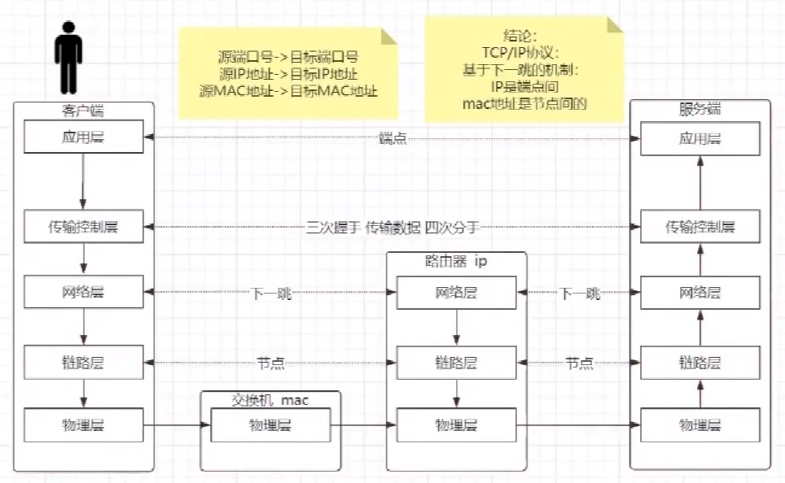
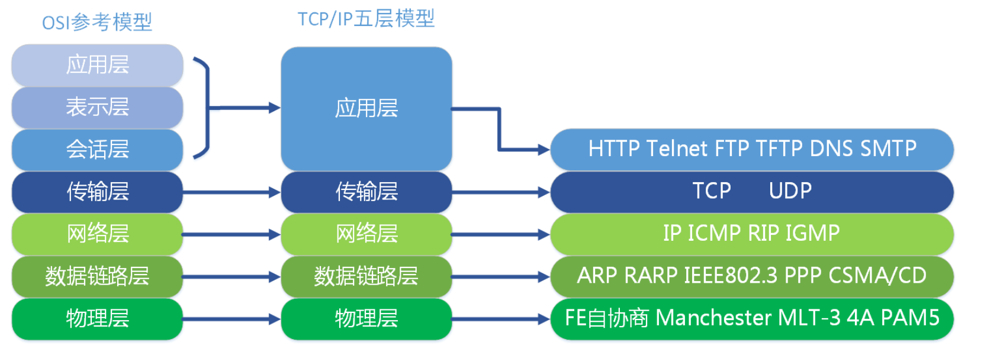
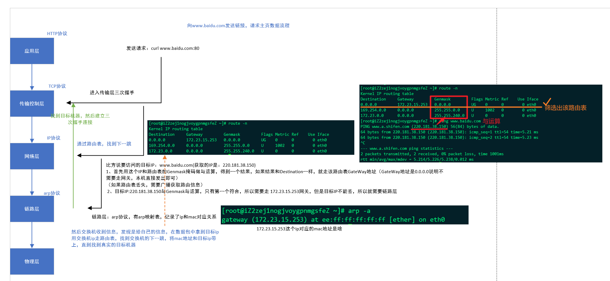
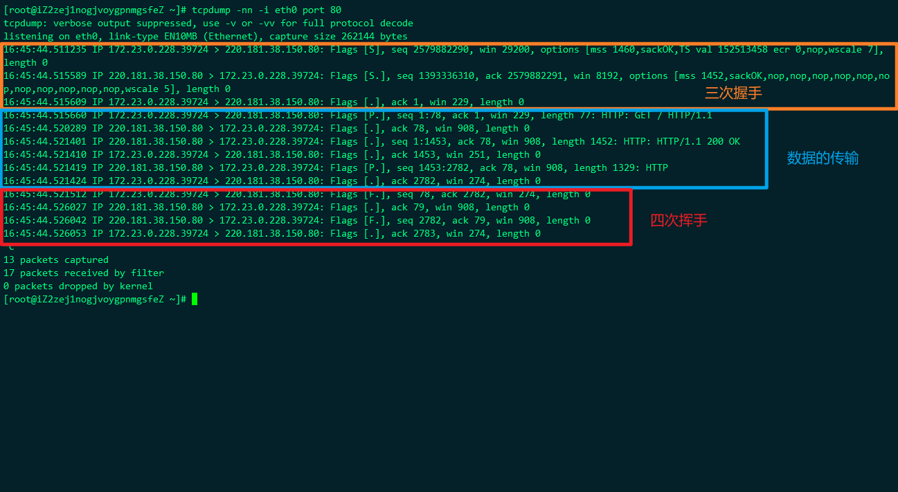
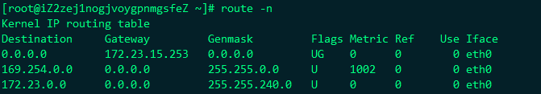
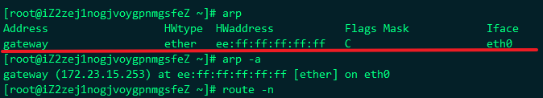
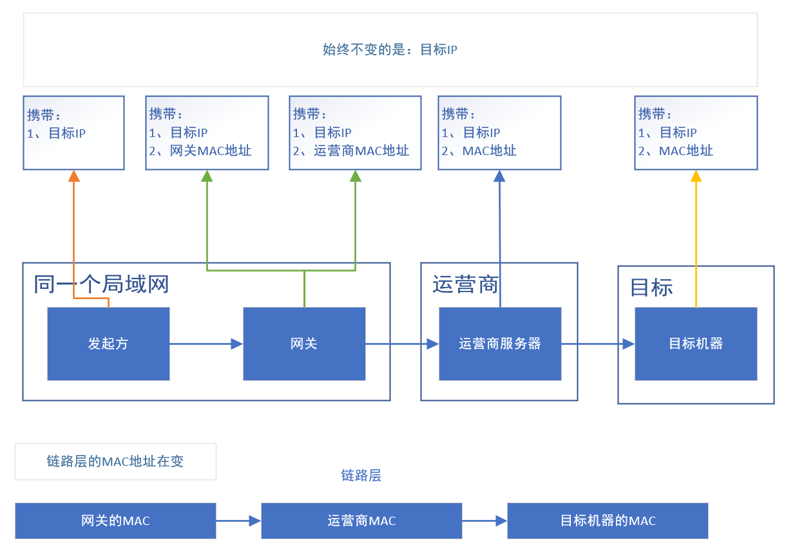
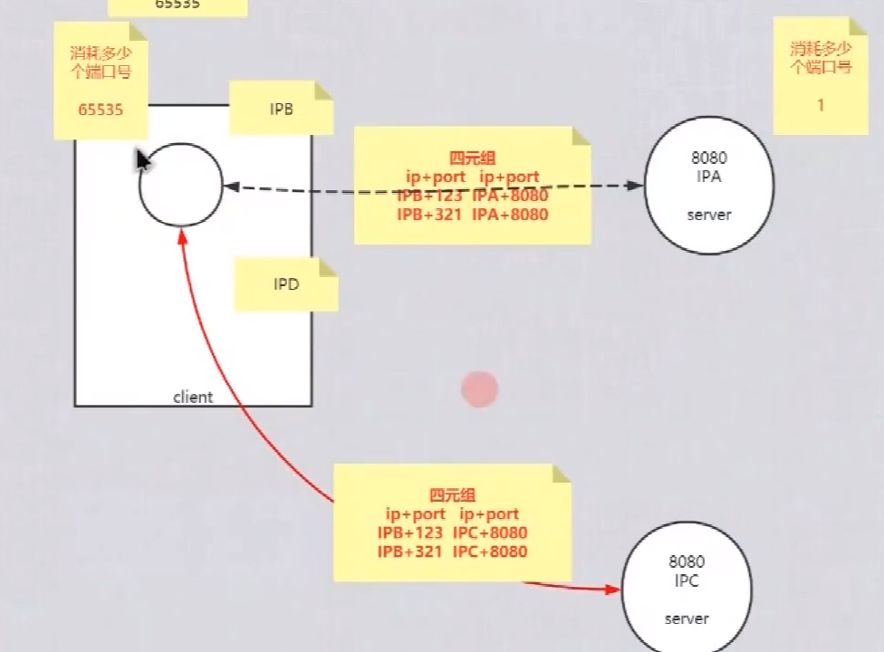

[TOC]

# 分层

## OIS 7层模型

应用层，表示层，会话层，传输控制层，网络层，链路层，物理层

## TCP/IP 5层模型

应用层，传输控制层，网络层，链路层，物理层

- 应用层：开发的程序 HTTP协议，FTP协议
- 传输层：TPC协议
- 网络层：IP协议
- 链路层：ARP协议
- 物理层：以太网协议

**5层模型下，整个流程的走向**

> 前提：需要了解几个Linux命令

`tcpdump -nn -i eth0 port 80`:抓包，可以抓取网络中TCP数据包的传输

`route -u`：查看路由表

`rap -a`：查看链路层对应表

> 找到目标机器的大体流程

1. 发起方向目标机器发起HTTP请求
2. 用目标IP与路由表中的掩码进行与运算，算出的值和Destination（目的地址）相同的，网关地址，此时会带着Mac地址（下一跳操作）
3. 因为不能丢失目标地址，所有要用Mac地址去链路层匹配，匹配到网关后，网关通过自己的IP去路由表找到下一跳，与上一步相同
4. 此时会到达运营商的网关，同样做下一跳
5. 最后通过链路层对应表和路由表，跳到目标机器，完成连接

> 如果链路层的对应表丢失，需要广播，拿到mac和ip的信息（ARP协议）

广播：

​	问谁在192.168.150.11在mac地址00:0c:29:00:a5:ca上，告诉192.168.150.11

​	得到回复：192.168.150.11在mac地址00:0c:29:00:a5:ca上

询问：

​	问谁是192.168.150.2，告诉192.168.150.11

​	得到回复：192.168.150.2在mac地址00:50:56:f7:53:2b

> ping 指令是ICMP协议

如果要观察ping的数据包，需要在`tcpdump -nn -i eth0 port 80`后面加`or icmp`

## 什么是socket

四元组：

- 发起方IP，port
- 接收方IP，port

