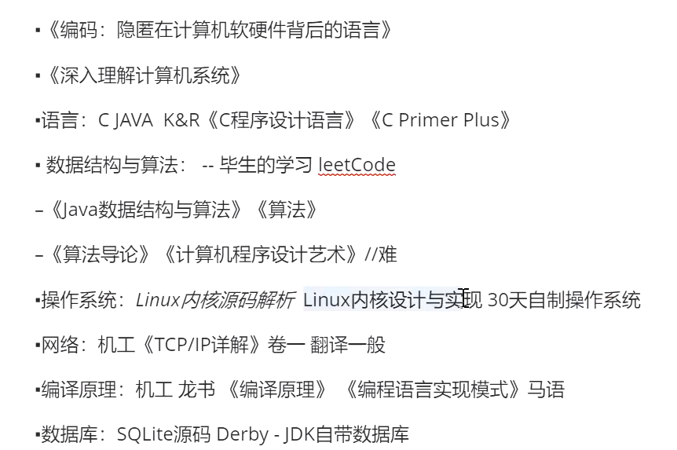

[TOC]

## JOL = Java Object Layout

> 观察java对象创建出来的内存结构的工具

```xml
    <dependencies>
        <dependency>
            <groupId>org.openjdk.jol</groupId>
            <artifactId>jol-core</artifactId>
            <version>0.9</version>
        </dependency>
    </dependencies>
```


## 书籍推荐

