[TOC]

# 前提

## 了解synchronized底层所需要的基础知识

1. CAS
2. CAS的底层实现
3. 对象的内存布局
4. markword的细节

## synchronized的底层实现

1. 锁升级的过程

   C++代码和汇编

2. 锁消除

3. 锁粗化


**参考文章：**`https://www.cnblogs.com/xiaofuge/p/13895226.html`


# 1、CAS

> compare and swap/compare and exchange


## 1.1 CAS介绍

在一个线程读取内存的一个值时

1. 拿出目前内存的值
2. 然后对值进行操作
3. 往内存中写的时候，先用拿出来的值和内存的值进行比较
   - 如果相等：说明没有别的线程去修改，直接把值更新到内存即可
   - 如果不相等：把内存的值重新拿出来，重新计算，然后重复上述逻辑

**图解：**

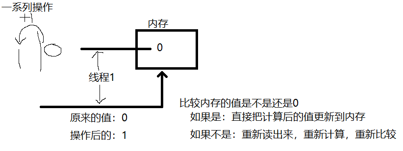


## 1.2 ABA问题

在一个线程读取内存值，然后进行操作，往回写的过程中

- 第二个线程拿到内存值，然后修改，写回（0->2）
- 第三个线程拿到内存值，然后修改，写回（2->0）

现在第一个线程才开始写回。

最后的结果都是0，最终结果一致，但是在这其中有2个线程已经把值修改过了，在特殊的业务场景下，值的更改可能会对业务逻辑造成影响

**解决：**

加版本号，不仅判断值是否和旧的值相等，也要判断版本号是否相等，来解决ABA问题


## 1.3 java中对CAS的实现

> 原子类
>
> AtomicInteger，....

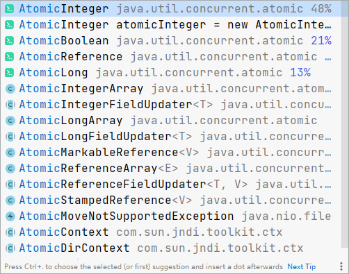

原子类的操作，保证了多线程的情况下，对值的操作能返回正确的结果

**案例**

> 创建100个线程，每个线程对m进行++操作10000次

```java
package cas;

import java.util.Arrays;
import java.util.concurrent.CountDownLatch;
import java.util.concurrent.atomic.AtomicInteger;

public class TestAtomic {

    private static AtomicInteger m = new AtomicInteger(0);

    public static void main(String[] args) throws InterruptedException {
        Thread[] threads = new Thread[100];

        CountDownLatch latch = new CountDownLatch(threads.length);

        for (int i = 0; i < threads.length; i++) {
            threads[i] = new Thread(() -> {
                for (int j = 0; j < 10000; j++) {
                    m.incrementAndGet();//m++
                }
                latch.countDown();//线程计数
            });
        }
        Arrays.stream(threads).forEach((thread) -> thread.start());

        latch.await();//线程等待
        System.out.println(m);

    }
}

// 返回结果1000000

```

`m.incrementAndGet()`方法相等于`m++`

调用栈：

> Unsafe类是jdk8中对新版锁的实现

```java
// AtomicInteger.java
public final int incrementAndGet() {
    return unsafe.getAndAddInt(this, valueOffset, 1) + 1;//Unsafe类是jdk8中对新版锁的实现
}

//Unsafe.class
public final int getAndAddInt(Object var1, long var2, int var4) {
    int var5;
    do {
        var5 = this.getIntVolatile(var1, var2);
    } while(!this.compareAndSwapInt(var1, var2, var5, var5 + var4));// 这里调用Unsafe类的方法

    return var5;
}

// Unsafe.class 类的本地方法
public final native boolean compareAndSwapInt(Object var1, long var2, int var4, int var5);
```


**compareAndSwapInt**本地方法追踪，需要看Hotspot源码（jvm虚拟机的实现）

1. unsafe.cpp类

   > 调用了cmpxchg方法：compare and exchange

   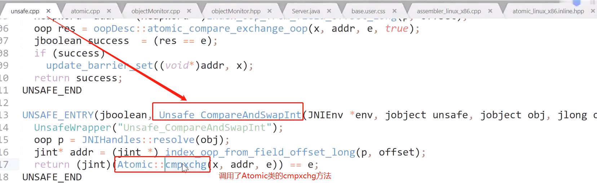

2. Atomic类：（atomic_linux_x86.inline.hpp ：atomic在linux的x86上的实现）

   > 通过汇编实现的

   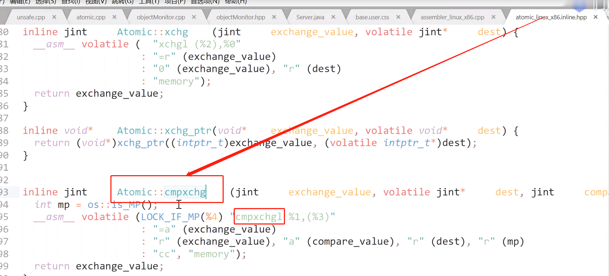

   `LOCK_IF_MP`

   

   MP：multi_processor 【多处理器/多核CPU】

   多核CPU需要LOCK，如果不是多CPU，就不需要加LOCK

   

   **CAS 最终实现：** `lock cmpxchg` 指令 

   ​	`cmpxchg`这个指令不是原子的，在拿到值，修改完，比较原来内存值和拿到的旧值后，往回写时，依然会被打断，比方被第二个线程打断，把值改成3，但是第一个线程已经比较完了，第一个线程修改的值是1，那么最终内存中的值就是1。这样就错了

   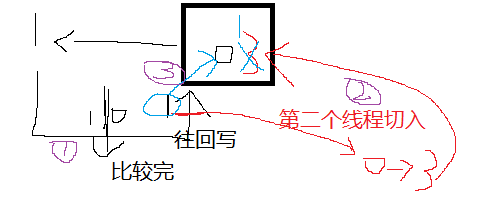

   所以指令前面加一个LOCK，在第一个线程对内存进行cmpxchg的过程中，不允许被其他线程打断

   **硬件角度：** LOCK指令就是在执行cmpxchg的时候，锁定一个北桥信号（不锁总线）

   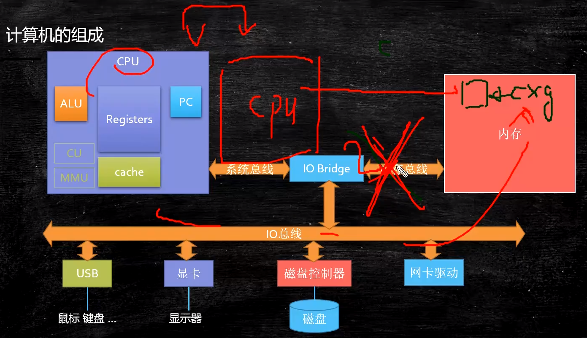

   


# 2、对象的内存布局

## 2.1 介绍对象布局

> 创建一个对象，对象在内存的布局是怎样的

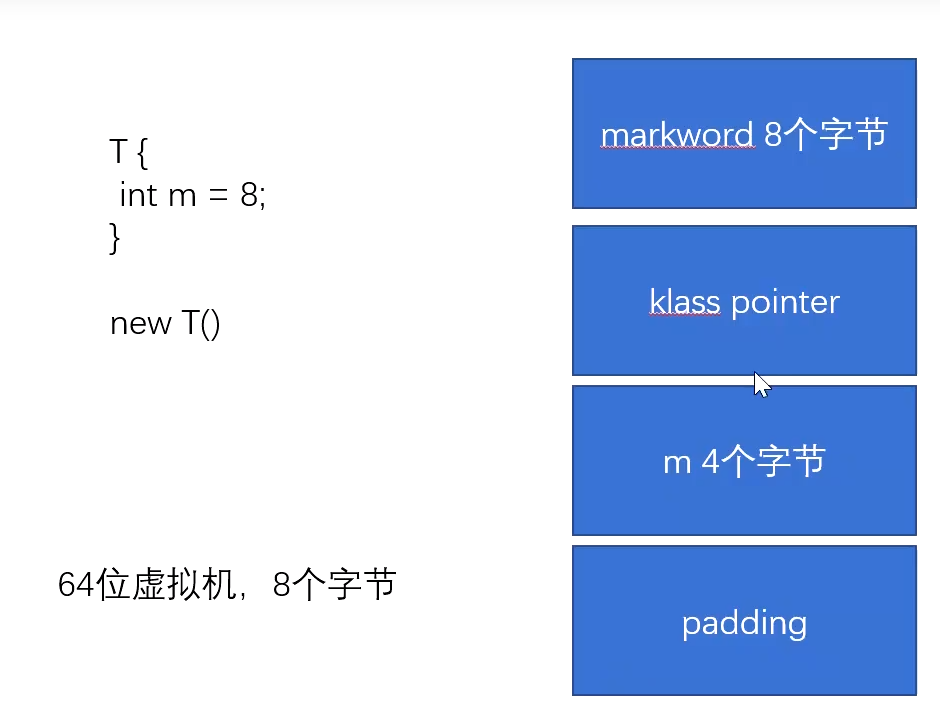

对象在内存的布局为上图所示

- markword ： 8个字节

- klass pointer ： 压缩之后4个字节，不压缩8个字节（默认4个字节）

- 变量 ： 对象里变量不同，存储空间也不同

- padding ： 对齐（64位虚拟机，8个字节，也就是说，4个空间内存加起来要被8能整除，如果上面3个加起来不能被8整除，padding来补齐）

  **比方**：上面三个块加起来12，不能被8整除，padding需要4个字节，加起来12+8=16，实现能被8整除

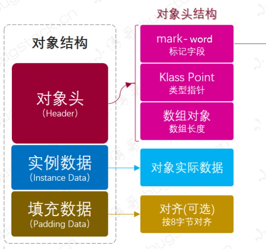


## 2.2 举例说明

> 64位虚拟机中，空对象占16个字节
>
> 32位虚拟机中，空对象占8个字节

> 一个最简单的程序，查看对象的内存布局

```java
public static void main(String[] args) {
    Object o = new Object();
    System.out.println(ClassLayout.parseInstance(o).toPrintable());
}
```

**输出结果：**

```
java.lang.Object object internals:
 OFFSET  SIZE   TYPE DESCRIPTION                               VALUE
      0     4        (object header)                           01 00 00 00 (00000001 00000000 00000000 00000000) (1)
      4     4        (object header)                           00 00 00 00 (00000000 00000000 00000000 00000000) (0)
      8     4        (object header)                           e5 01 00 20 (11100101 00000001 00000000 00100000) (536871397)
     12     4        (loss due to the next object alignment)
Instance size: 16 bytes
Space losses: 0 bytes internal + 4 bytes external = 4 bytes total
```

**结果分析：**

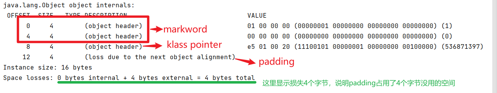


## 2.3 markword是做什么用的？

> 上述相同程序，给对象上锁，观察markword

```java
public static void main(String[] args) {
    Object o = new Object();
    System.out.println(ClassLayout.parseInstance(o).toPrintable());

    synchronized (o){
        System.out.println(ClassLayout.parseInstance(o).toPrintable());
    }
}
```

**执行结果：**

```
java.lang.Object object internals:
 OFFSET  SIZE   TYPE DESCRIPTION                               VALUE
      0     4        (object header)                           01 00 00 00 (00000001 00000000 00000000 00000000) (1)
      4     4        (object header)                           00 00 00 00 (00000000 00000000 00000000 00000000) (0)
      8     4        (object header)                           e5 01 00 20 (11100101 00000001 00000000 00100000) (536871397)
     12     4        (loss due to the next object alignment)
Instance size: 16 bytes
Space losses: 0 bytes internal + 4 bytes external = 4 bytes total

java.lang.Object object internals:
 OFFSET  SIZE   TYPE DESCRIPTION                               VALUE
      0     4        (object header)                           f8 f2 63 02 (11111000 11110010 01100011 00000010) (40104696)
      4     4        (object header)                           00 00 00 00 (00000000 00000000 00000000 00000000) (0)
      8     4        (object header)                           e5 01 00 20 (11100101 00000001 00000000 00100000) (536871397)
     12     4        (loss due to the next object alignment)
Instance size: 16 bytes
Space losses: 0 bytes internal + 4 bytes external = 4 bytes total
```

**结果分析：**

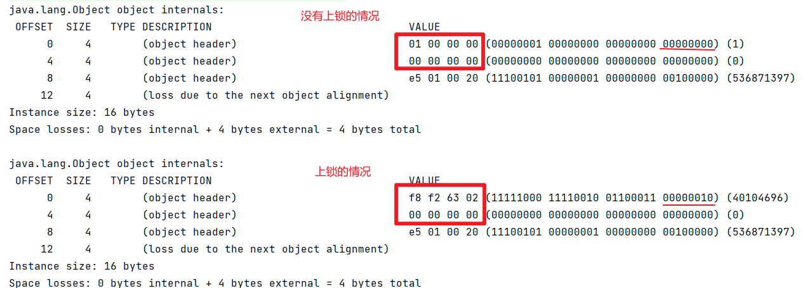


结果发现，上锁后的对象头中，markword的值变了。

**结论：** ==上锁，就是更改对象头中的markword值==


# 3、markword内部结构

**整体结构：**


**64位HotSpot的实现：（同上）**

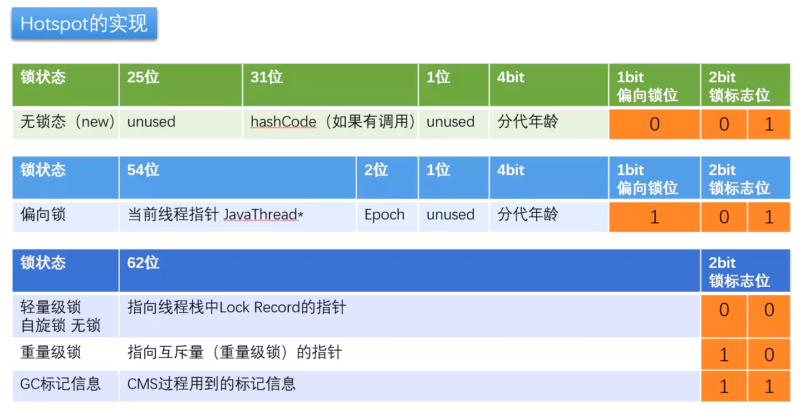

## 3.1 markword中记录的信息

1. 锁的状态
2. GC标记信息
3. hashCode信息

markword是一个8字节header，记录了一些信息，加锁实际上是==修改markword的信息==

后三位：

- `0 01` ：无锁
- `1 01` ： 偏向锁
- `00` ： 轻量级锁
- `10` ：重量级锁
- `11` ：GC标记


# 4、synchronized锁升级过程

> 在jdk1.2的时候，synchronized的效率非常低，后来优化成了下图所示

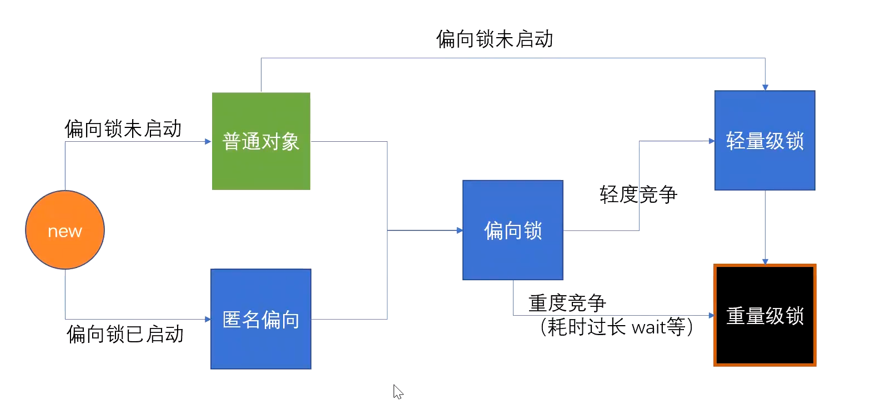

**为什么要优化？：**

> 需要了解线程的：**用户态和内核态**

在早期的操作系统，应用程序可以直接控制硬件（显示器，内存......），没有经过kernel（内核），这样就会非常危险，如果应用程序直接把内存的某一块清掉，系统可能就会死机。

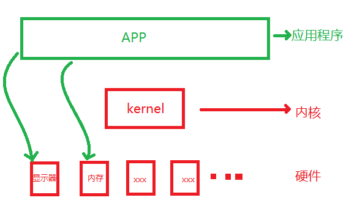

后来为了系统的安全，操作系统都会分成两层：

- 应用程序上面的叫：用户态
- kernel下面的叫：内核态

所有用户态的程序，访问非常危险的操作时（比如：格式化硬盘，访问内存，......），必须经过kernel的控制才可以。内核态可以执行所有的指令，用户态不能直接执行，需要经过内核态后，才能去执行

在操作系统角度来看，JVM也是一个应用程序

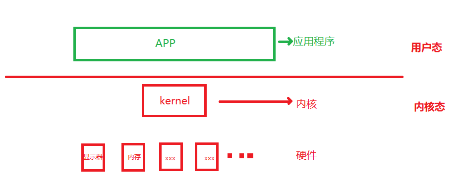


**为什么synchronized叫重量级锁？**

JVM处于用户态，加锁操作，需要经过内核态的允许，经过kernel的线程调度，才能拿到锁（用户态转换成内核态）

**后来优化：**

synchronized后来优化，在用户态做了一些优化，不用直接转内核态。这就是CAS

锁升级：先用户态拿锁，竞争激烈再去转到内核态

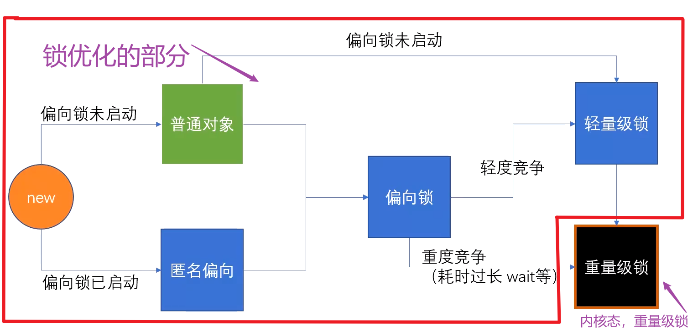


## 观察markword

> 依然使用第3节的程序

```java
public static void main(String[] args) {
    Object o = new Object();
    System.out.println(ClassLayout.parseInstance(o).toPrintable());

    synchronized (o){
        System.out.println(ClassLayout.parseInstance(o).toPrintable());
    }
}
```

**结果分析:**

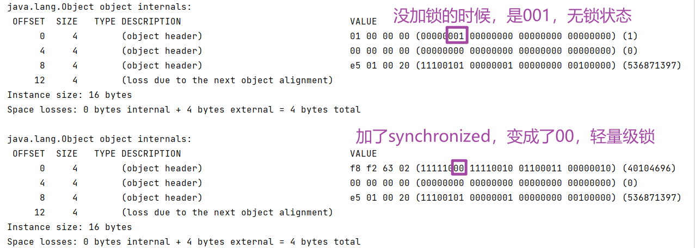

> 观察锁升级图上方的线，在偏向锁未启动的时候，给对象加锁，直接升级成轻量级锁
>
> *注：偏向锁会在程序启动后延迟4s启动，所以4s内给对象加锁，直接就升级到了轻量级锁


## 为什么有自旋锁还需要重量级锁

自旋锁是消耗CPU资源的，如果锁的时间长，或者自旋线程多，CPU会被大量消耗

重量级锁有等待队列，所有拿不到锁的线程进入**等待队列**，不需要消耗CPU资源

## 偏向锁是否一定比自旋锁效率高？

不一定，在明确知道会有多线程竞争的情况下，偏向锁肯定会涉及锁撤销，这时候直接使用自旋锁提升效率

JVM启动过程，会有很多线程竞争（明确），所以默认情况启动时不打开偏向锁，过一段时间再打开

## 自旋锁什么时候用比较好

线程数比较少，单个线程执行时间短，自旋锁的效率才高


# 5、synchronized 底层实现

> 底层也是通过 `lock cmpxchg`指令实现的

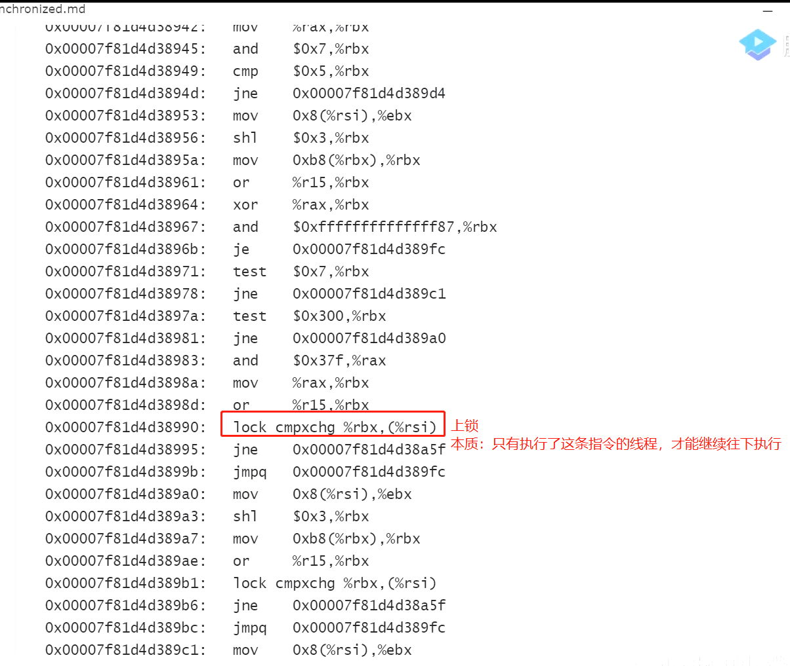


# 6、volatile     

## 6.1 作用

1. 线程可见性
2. 禁止指令重排

## 6.2 底层实现

volatile底层实现是：`lock addl`

`add`：往某个寄存器上加了一个`0`，加0相当于没有操作，实际就是个空操作


## 6.3 如何 禁止的指令重排

### JVM层级 - 内存屏障

> 内存屏障

JVM层级规范了4种屏障要求

1. LoadLoad屏障：（读读屏障）
2. StoreStore屏障：（写写屏障）
3. LoadStore屏障：（读写屏障）
4. StoreLoad屏障：（写读屏障）

每个JVM的实现不一样，上面4中屏障只是规范。规范两条指令不可以换位置执行

**实现细节：JVM层面：**


1. 在更改某个内存的指令前加：StoreStore屏障，在指令后加StoreLoad屏障
2. 在读某个内存的指令前加：LoadLoad屏障，在指令后加LoadStore屏障


> happens-before原则（JVM规定重排序必须遵守的规则），对于下面8种情况都要加屏障

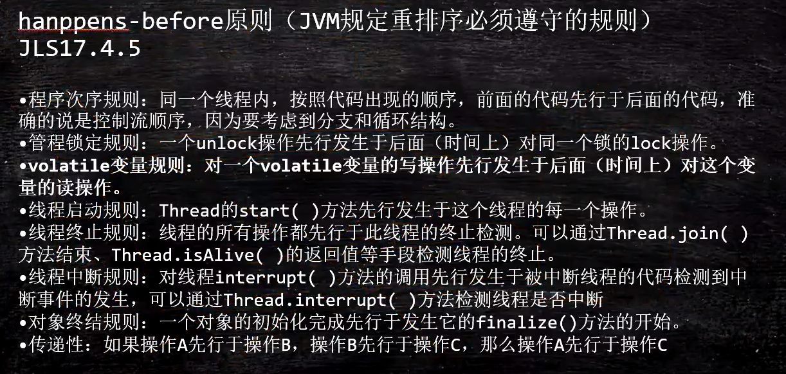

> as if serial

不管如何重排序，单线程执行结果不会改变


### 底层指令

Hotspot实现

> bytecodeinterpreter.cpp

```c++
int field_offset = cache->f2_as_index();
          if (cache->is_volatile()) {
            if (support_IRIW_for_not_multiple_copy_atomic_cpu) {
              OrderAccess::fence();
            }
```

> orderaccess_linux_x86.inline.hpp

```c++
inline void OrderAccess::fence() {
  if (os::is_MP()) {
    // always use locked addl since mfence is sometimes expensive
#ifdef AMD64
    __asm__ volatile ("lock; addl $0,0(%%rsp)" : : : "cc", "memory");
#else
    __asm__ volatile ("lock; addl $0,0(%%esp)" : : : "cc", "memory");
#endif
  }
}
```


> 结论：通过`lock; addl $0,0(%%rsp)`,lock addl 
>
> 添加一个0，空操作实现禁止指令重排序

LOCK用于在多处理器中执行指令时对共享内存的独占使用。

它的作用是能够将当前处理器对应缓存的内容刷新到内存，并使其他处理器对应的缓存失效（==MESI 缓存一致性协议==）

另外还提供了有序的指令无法越过这个内存屏障的作用，==lock 指令本省就无法越过==


## 6.4 MESI 缓存一致性

因为CPU处理速度太快，和内存处理数据速度相差太多，所以在内存和CPU之间有多级缓存，CPU去内存读取数据，先去缓存中读取，这样读取速度会很快

> 多级缓存：L1 ,L2,L3

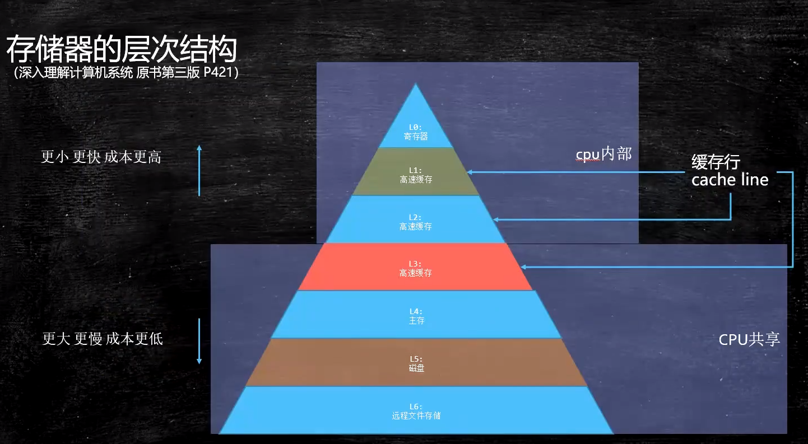


> 各级缓存之间的关系

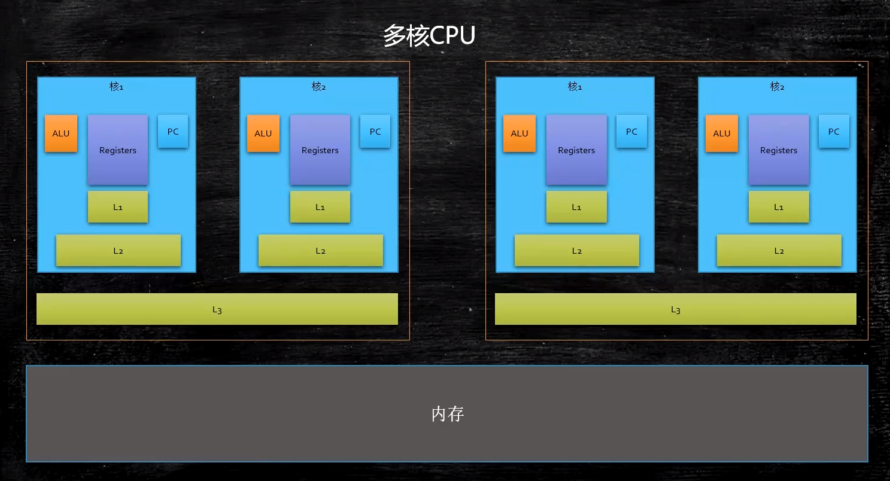

> 从内存中按块（也叫缓存行 - cacheLine）读取，可以提高效率。一层一层的向缓存中更新
>
> cache Line一般是64个字节
>
> - 缓存行越大，局部性空间效率越高，但读取时间慢
> - 缓存行越小，局部性空间效率越低，但读取时间快
> - 取一个折中值，目前多用：64字节

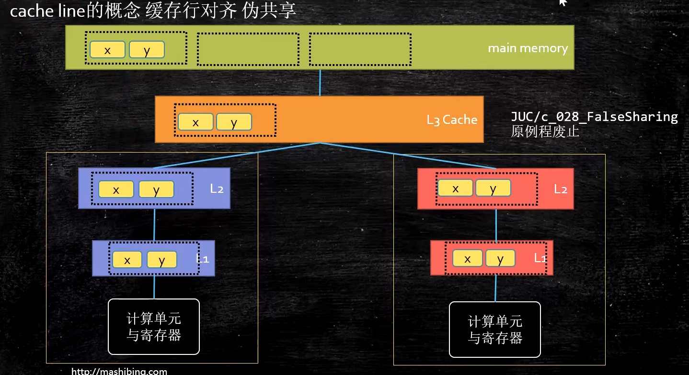

当一个CPU更改了某一个缓存行内的一个值时，要通知其他CPU（使用MESI缓存一致性协议），这一个cache line失效

**失效的是更改的这个数据的整个缓存行（cache line）**

> MESI 缓存一致性协议
>
> MESI对应缓存行的四种状态
>
> - Modified - 被修改
> - Exclusive - 被独占
> - Shared - 共享
> - Invalid - 失效

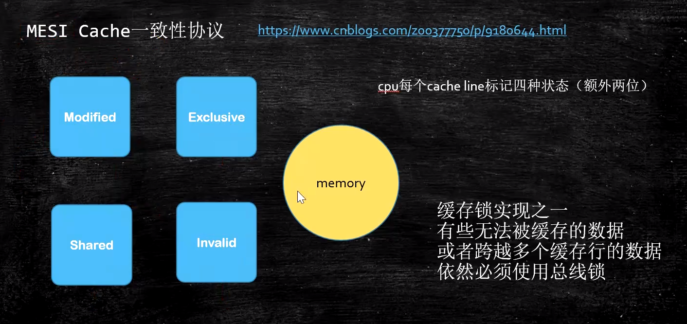


 


# 注意

synchronized锁定，不能锁String，String常量，Integer，Long，等基础类型

JVM中，字符串常量在方法区的字符串常量池，所有线程公用一个字符串，如果锁住的那个字符串常量在别的jar包里有，就会发生不可预知的问题....

如果用到该字符串常量的不是一个线程，A在本地锁字符串，B用到jar包里的，也加锁，就可能会死锁