[toc]

# 第 1 节 索引类型

索引可以提升查询速度，会影响where查询，以及order by排序。MySQL索引类型如下：

- 从索引存储结构划分：B Tree索引、Hash索引、FULLTEXT全文索引、R Tree索引
- 从应用层次划分：普通索引、唯一索引、主键索引、复合索引
- 从索引键值类型划分：主键索引、辅助索引（二级索引）
- 从数据存储和索引键值逻辑关系划分：聚集索引（聚簇索引）、非聚集索引（非聚簇索引）

## 1.1 普通索引

这是最基本的索引类型，基于普通字段建立的索引，没有任何限制。

创建普通索引的方法如下：

```sql
# 方式一
CREATE INDEX <索引的名字> ON tablename (字段名);

# 方式二
ALTER TABLE tablename ADD INDEX [索引的名字] (字段名);

# 方式三
CREATE TABLE tablename ( [...], INDEX [索引的名字] (字段名) );
```

## 1.2 唯一索引

与"普通索引"类似，不同的就是：索引字段的值必须唯一，但允许有空值 。在创建或修改表时追加唯一约束，就会自动创建对应的唯一索引。

创建唯一索引的方法如下：

```sql
# 方式一
CREATE UNIQUE INDEX <索引的名字> ON tablename (字段名);

# 方式二
ALTER TABLE tablename ADD UNIQUE INDEX [索引的名字] (字段名);

# 方式三
CREATE TABLE tablename ( [...], UNIQUE [索引的名字] (字段名) ;
```

## 1.3 主键索引

它是一种特殊的唯一索引，不允许有空值。在创建或修改表时追加主键约束即可，每个表只能有一个主键。

创建主键索引的方法如下：

```sql
# 方式一
CREATE TABLE tablename ( [...], PRIMARY KEY (字段名) );

# 方式二
ALTER TABLE tablename ADD PRIMARY KEY (字段名);
```

## 1.4 复合索引

单一索引是指索引列为一列的情况，即新建索引的语句只实施在一列上；用户可以在多个列上建立索引，这种索引叫做组复合索引（组合索引）。复合索引可以代替多个单一索引，相比多个单一索引复合索引所需的开销更小。

索引同时有两个概念叫做窄索引和宽索引，窄索引是指索引列为1-2列的索引，宽索引也就是索引列超过 2 列的索引，设计索引的一个重要原则就是能用窄索引不用宽索引，因为窄索引往往比组合索引更有效。

创建组合索引的方法如下：

```sql
# 方式一
CREATE INDEX <索引的名字> ON tablename (字段名 1 ，字段名2...);

# 方式二
ALTER TABLE tablename ADD INDEX [索引的名字] (字段名 1 ，字段名2...);

# 方式三
CREATE TABLE tablename ( [...], INDEX [索引的名字] (字段名 1 ，字段名2...) );
```

复合索引使用注意事项：

- 何时使用复合索引，要根据where条件建索引，注意不要过多使用索引，过多使用会对更新操作效率有很大影响。
- 如果表已经建立了(col1，col2)，就没有必要再单独建立（col1）；如果现在有(col1)索引，如果查询需要col1和col2条件，可以建立(col1,col2)复合索引，对于查询有一定提高。

## 1.5 全文索引

查询操作在数据量比较少时，可以使用like模糊查询，但是对于大量的文本数据检索，效率很低。如果使用全文索引，查询速度会比like快很多倍。在MySQL 5.6 以前的版本，只有MyISAM存储引擎支持全文索引，从MySQL 5.6开始MyISAM和InnoDB存储引擎均支持。

创建全文索引的方法如下：

```sql
# 方式一
CREATE FULLTEXT INDEX <索引的名字> ON tablename (字段名);

# 方式二
ALTER TABLE tablename ADD FULLTEXT [索引的名字] (字段名);

# 方式三
CREATE TABLE tablename ( [...], FULLTEXT KEY [索引的名字] (字段名) ;
```

和常用的like模糊查询不同，全文索引有自己的语法格式，使用 match 和 against 关键字，比如全文索引使用注意事项：

- 全文索引必须在字符串、文本字段上建立。

- 全文索引字段值必须在最小字符和最大字符之间的才会有效。（innodb：3-84；myisam：4-84 ）

- 全文索引字段值要进行切词处理，按syntax字符进行切割，例如b+aaa，切分成b和aaa

- 全文索引匹配查询，默认使用的是等值匹配，例如a匹配a，不会匹配ab,ac。如果想匹配可以在布尔模式下搜索a*

  ```sql
  select * from user where match(name) against('a*' in boolean mode);
  ```
  


# 第 2 节 索引原理

MySQL官方对索引定义：是存储引擎用于快速查找记录的一种数据结构。需要额外开辟空间和数据维护工作。

- 索引是物理数据页存储，在数据文件中（InnoDB，ibd文件），利用数据页(page)存储。
- 索引可以加快检索速度，但是同时也会降低增删改操作速度，索引维护需要代价。

> 索引涉及的理论知识：二分查找法、Hash和B+Tree。

## 2.1 二分查找法

二分查找法也叫作折半查找法，它是在有序数组中查找指定数据的搜索算法。它的优点是等值查询、范围查询性能优秀，缺点是更新数据、新增数据、删除数据维护成本高。

- 首先定位left和right两个指针
- 计算(left+right)/2
- 判断除 2 后索引位置值与目标值的大小比对
- 索引位置值大于目标值就-1，right移动；如果小于目标值就+1，left移动


举个例子，下面的有序数组有 17 个值，查找的目标值是 7 ，过程如下：

> 第一次查找

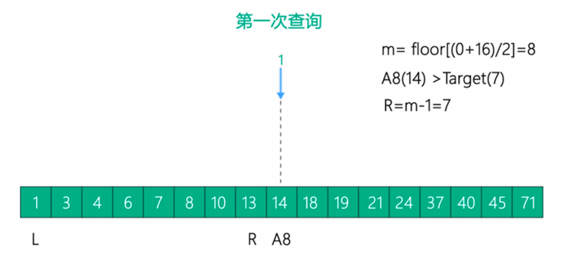

> 第二次查找

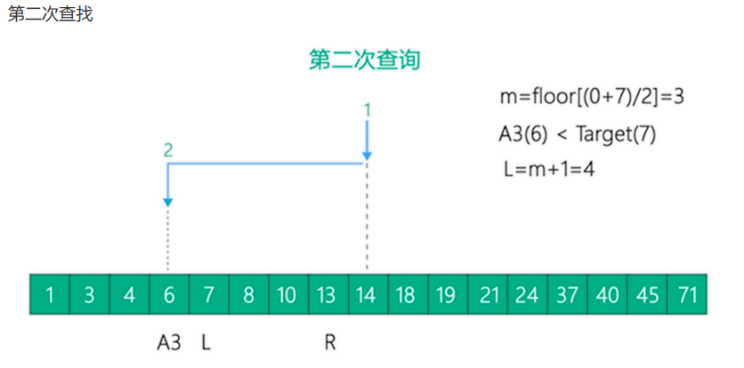

> 第三次查找

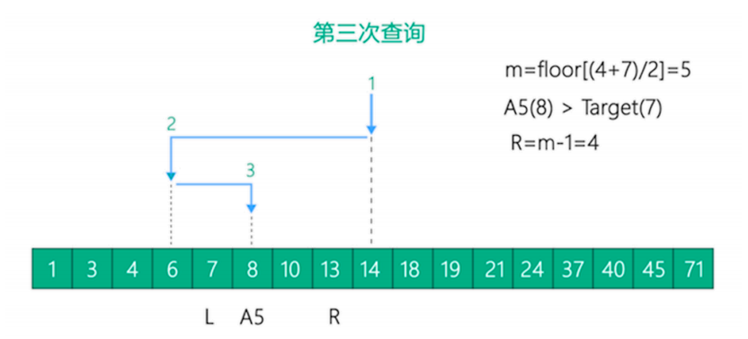

> 第四次查找

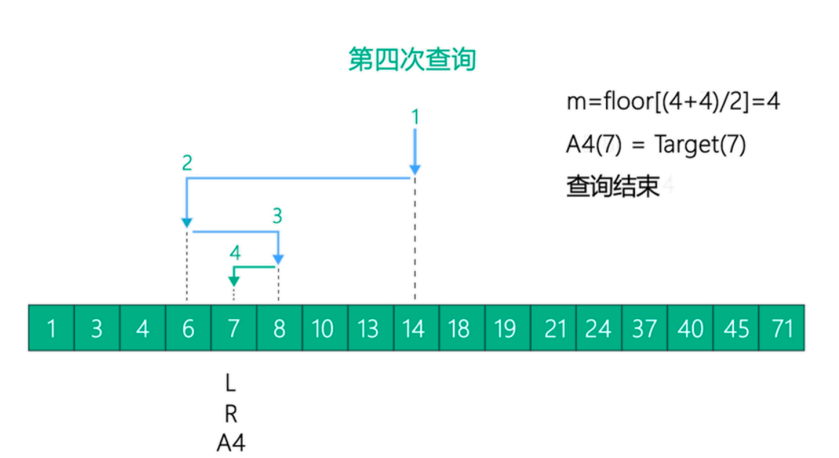


## 2.2 Hash结构

Hash底层实现是由Hash表来实现的，是根据键值 <key,value> 存储数据的结构。非常适合根据key查找value值，也就是单个key查询，或者说等值查询。其结构如下所示：

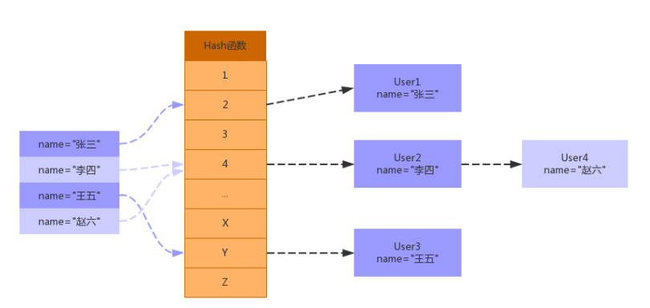

从上面结构可以看出，Hash索引可以方便的提供等值查询，但是对于范围查询就需要全表扫描了。Hash索引在MySQL 中Hash结构主要应用在Memory原生的Hash索引 、InnoDB 自适应哈希索引。

InnoDB提供的自适应哈希索引功能强大，接下来重点描述下InnoDB 自适应哈希索引。

InnoDB自适应哈希索引是为了提升查询效率，InnoDB存储引擎会监控表上各个索引页的查询，当InnoDB注意到某些索引值访问非常频繁时，会在内存中基于B+Tree索引再创建一个哈希索引，使得内存中的 B+Tree 索引具备哈希索引的功能，即能够快速定值访问频繁访问的索引页。

InnoDB自适应哈希索引：在使用Hash索引访问时，一次性查找就能定位数据，等值查询效率要优于B+Tree。

自适应哈希索引的建立使得InnoDB存储引擎能自动根据索引页访问的频率和模式自动地为某些热点页建立哈希索引来加速访问。另外InnoDB自适应哈希索引的功能，用户只能选择开启或关闭功能，无法进行人工干涉。

```sql
show engine innodb status \G;
show variables like '%innodb_adaptive%';
```

## 2.3 B+Tree结构

MySQL数据库索引采用的是B+Tree结构，在B-Tree结构上做了优化改造。

### 2.3.1 B-Tree结构

- 索引值和data数据分布在整棵树结构中
- 每个节点可以存放多个索引值及对应的data数据
- 树节点中的多个索引值从左到右升序排列


B树的搜索：从根节点开始，对节点内的索引值序列采用二分法查找，如果命中就结束查找。没有命中会进入子节点重复查找过程，直到所对应的的节点指针为空，或已经是叶子节点了才结束。

### 2.3.2 B+Tree结构

- 非叶子节点不存储data数据，只存储索引值，这样便于存储更多的索引值
- 叶子节点包含了所有的索引值和data数据
- 叶子节点用指针连接，提高区间的访问性能

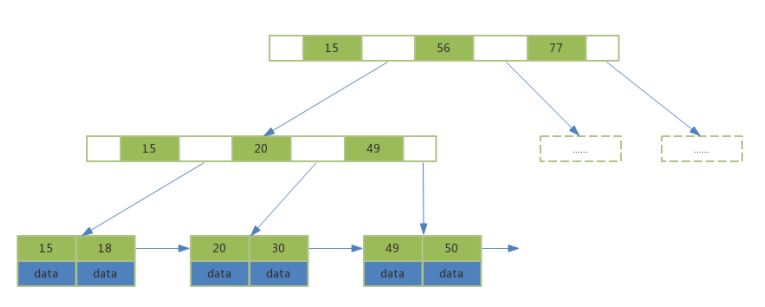

相比B树，B+树进行范围查找时，只需要查找定位两个节点的索引值，然后利用叶子节点的指针进行遍历即可。而B树需要遍历范围内所有的节点和数据，显然B+Tree效率高。

## 2.4 聚簇索引和辅助索引

聚簇索引和非聚簇索引：B+Tree的叶子节点存放主键索引值和行记录就属于聚簇索引；如果索引值和行记录分开存放就属于非聚簇索引。

主键索引和辅助索引：B+Tree的叶子节点存放的是主键字段值就属于主键索引；如果存放的是非主键值就属于辅助索引（二级索引）。

在InnoDB引擎中，主键索引采用的就是聚簇索引结构存储。

### 2.4.1 聚簇索引（聚集索引）

聚簇索引是一种数据存储方式，InnoDB的聚簇索引就是按照主键顺序构建 B+Tree结构。B+Tree的叶子节点就是行记录，行记录和主键值紧凑地存储在一起。 这也意味着 InnoDB 的主键索引就是数据表本身，它按主键顺序存放了整张表的数据，占用的空间就是整个表数据量的大小。通常说的 **主键索引** 就是聚集索引。

InnoDB的表要求必须要有聚簇索引：

- 如果表定义了主键，则主键索引就是聚簇索引
- 如果表没有定义主键，则第一个非空unique列作为聚簇索引
- 否则InnoDB会从建一个隐藏的row-id作为聚簇索引

### 2.4.2 辅助索引

InnoDB辅助索引，也叫作二级索引，是根据索引列构建 B+Tree结构。但在 B+Tree 的叶子节点中只存了索引列和主键的信息。二级索引占用的空间会比聚簇索引小很多， 通常创建辅助索引就是为了提升查询效率。一个表InnoDB只能创建一个聚簇索引，但可以创建多个辅助索引。

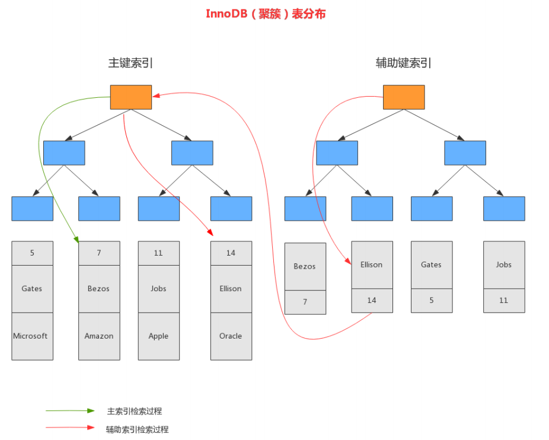

### 2.4.3 非聚簇索引

与InnoDB表存储不同，MyISAM数据表的索引文件和数据文件是分开的，被称为非聚簇索引结构。

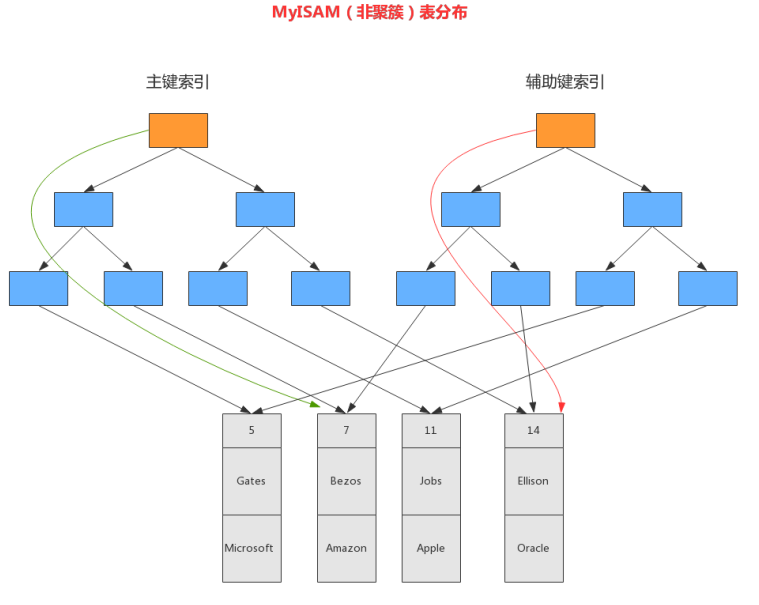

# 第 3 节 索引分析与优化

## 3.1 EXPLAIN

MySQL 提供了一个 EXPLAIN 命令，它可以对 SELECT 语句进行分析，并输出 SELECT 执行的详细信息，供开发人员有针对性的优化。例如：

```sql
EXPLAIN SELECT * from user WHERE id < 3;
```

EXPLAIN 命令的输出内容大致如下：

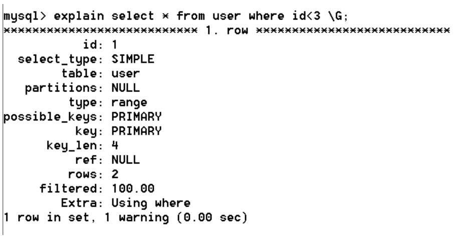

> select_type

表示查询的类型。

常用的值如下：

- SIMPLE ： 表示查询语句不包含子查询或union
- PRIMARY：表示此查询是最外层的查询
- UNION：表示此查询是UNION的第二个或后续的查询
- DEPENDENT UNION：UNION中的第二个或后续的查询语句，使用了外面查询结果
- UNION RESULT：UNION的结果
- SUBQUERY：SELECT子查询语句
- DEPENDENT SUBQUERY：SELECT子查询语句依赖外层查询的结果。

最常见的查询类型是SIMPLE，表示我们的查询没有子查询也没用到UNION查询。

> type

表示存储引擎查询数据时采用的方式。比较重要的一个属性，通过它可以判断出查询是全表扫描还是基于索引的部分扫描。常用属性值如下，从上至下效率依次增强。

- ALL：表示全表扫描，性能最差。

- index：表示基于索引的全表扫描，先扫描索引再扫描全表数据。

- range：表示使用索引范围查询。使用>、>=、<、<=、in等等。

- ref：表示使用非唯一索引进行单值查询。

  如果有一个索引`age_index(age)`，表里age=18的有好几条记录，当查询where条件是age=18时，会走全表查询；如果age=22只有一条记录，当查询where=22时，会走非唯一索引（type=ref）

- eq_ref：一般情况下出现在多表join查询，表示前面表的每一个记录，都只能匹配后面表的一行结果。

- const：表示使用主键或唯一索引做等值查询，常量查询。

- NULL：表示不用访问表，速度最快。


> possible_keys

表示查询时能够使用到的索引。注意并不一定会真正使用，显示的是索引名称。

> key

表示查询时真正使用到的索引，显示的是索引名称。

> rows

MySQL查询优化器会根据统计信息，估算SQL要查询到结果需要扫描多少行记录。原则上rows是越少效率越高，可以直观的了解到SQL效率高低。

> key_len

表示查询使用了索引的字节数量。可以判断是否全部使用了组合索引。

key_len的计算规则如下：

- 字符串类型

  字符串长度跟字符集有关：latin1=1、gbk=2、utf8=3、utf8mb4=4

  char(n)：n*字符集长度

  varchar(n)：n * 字符集长度 + 2字节

- 数值类型

  TINYINT： 1 个字节

  SMALLINT： 2 个字节

  MEDIUMINT： 3 个字节

  INT、FLOAT： 4 个字节

  BIGINT、DOUBLE： 8 个字节

- 时间类型

  DATE： 3 个字节

  TIMESTAMP： 4 个字节

  DATETIME： 8 个字节

- 字段属性

  NULL属性占用 1 个字节，如果一个字段设置了NOT NULL，则没有此项。

> Extra

Extra表示很多额外的信息，各种操作会在Extra提示相关信息，常见几种如下：

- Using where

  表示查询需要通过索引回表查询数据。

- Using index

  表示查询需要通过索引，索引就可以满足所需数据。

- Using filesort

  表示查询出来的结果需要额外排序，数据量小在内存，大的话在磁盘，因此有Using filesort建议优化。

- Using temprorary

  查询使用到了临时表，一般出现于去重、分组等操作。

## 3.2 回表查询

在之前介绍过，InnoDB索引有聚簇索引和辅助索引。聚簇索引的叶子节点存储行记录，InnoDB必须要有，且只有一个。辅助索引的叶子节点存储的是主键值和索引字段值，通过辅助索引无法直接定位行记录，通常情况下，需要扫码两遍索引树。先通过辅助索引定位主键值，然后再通过聚簇索引定位行记录，这就叫做 **回表查询** ，它的性能比扫一遍索引树低。

总结：通过索引查询主键值，然后再去聚簇索引查询记录信息

## 3.3 覆盖索引

在SQL-Server官网的介绍如下：

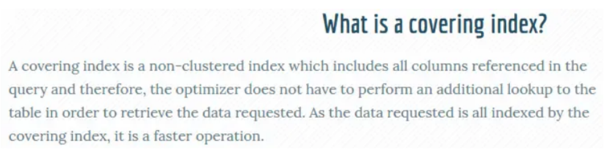

在MySQL官网，类似的说法出现在explain查询计划优化章节，即explain的输出结果Extra字段为Using index时，能够触发索引覆盖。

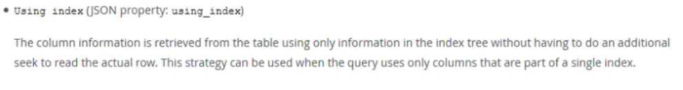

不管是SQL-Server官网，还是MySQL官网，都表达了： **只需要在一棵索引树上就能获取SQL所需的所有列数据，无需回表，速度更快，这就叫做索引覆盖** 。

实现索引覆盖最常见的方法就是：将被查询的字段，建立到组合索引。

## 3.4 最左前缀原则

复合索引使用时遵循最左前缀原则，最左前缀顾名思义，就是最左优先，即查询中使用到最左边的列，那么查询就会使用到索引，如果从索引的第二列开始查找，索引将失效。

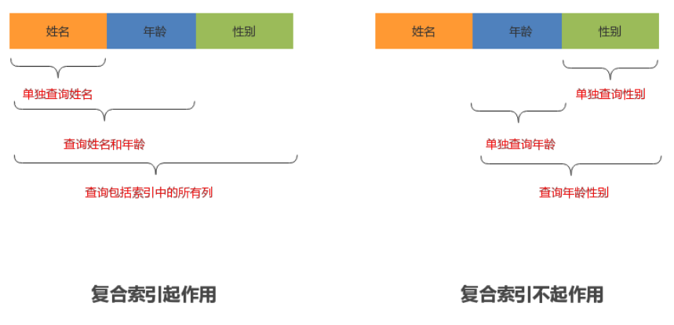

## 3.5 LIKE查询

**面试题：MySQL在使用like模糊查询时，索引能不能起作用？**

回答：MySQL在使用Like模糊查询时，索引是可以被使用的，只有把%字符写在后面才会使用到索引。

```sql
select * from user where name like '%o%'; #不起作用

select * from user where name like 'o%'; #起作用

select * from user where name like '%o'; #不起作用
```


## 3.6 NULL查询

**面试题：如果MySQL表的某一列含有NULL值，那么包含该列的索引是否有效？**

对MySQL来说，NULL是一个特殊的值，从概念上讲，NULL意味着“一个未知值”，它的处理方式与其他值有些不同。比如：不能使用=，<，>这样的运算符，对NULL做算术运算的结果都是NULL，count时不会包括NULL行等，NULL比空字符串需要更多的存储空间等。

```
“NULL columns require additional space in the row to record whether their values
are NULL. For MyISAM tables, each NULL column takes one bit extra, rounded up to
the nearest byte.”
```

NULL列需要增加额外空间来记录其值是否为NULL。对于MyISAM表，每一个空列额外占用一位，四舍五入到最接近的字节。

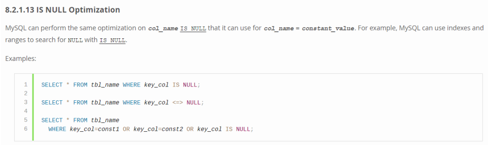

虽然MySQL可以在含有NULL的列上使用索引，但NULL和其他数据还是有区别的，不建议列上允许为NULL。最好设置NOT NULL，并给一个默认值，比如 0 和 ‘’ 空字符串等，如果是datetime类型，也可以设置系统当前时间或某个固定的特殊值，例如'1970-01-01 00:00:00'。

## 3.7 索引与排序

MySQL查询支持filesort和index两种方式的排序，filesort是先把结果查出，然后在缓存或磁盘进行排序操作，效率较低。使用index是指利用索引自动实现排序，不需另做排序操作，效率会比较高。

filesort有两种排序算法：双路排序和单路排序。

双路排序：需要两次磁盘扫描读取，最终得到用户数据。第一次将排序字段读取出来，然后排序；第二次去读取其他字段数据。

单路排序：从磁盘查询所需的所有列数据，然后在内存排序将结果返回。如果查询数据超出缓存sort_buffer，会导致多次磁盘读取操作，并创建临时表，最后产生了多次IO，反而会增加负担。解决方案：少使用select *；增加sort_buffer_size容量和max_length_for_sort_data容量。

如果我们Explain分析SQL，结果中Extra属性显示Using filesort，表示使用了filesort排序方式，需要优化。如果Extra属性显示Using index时，表示覆盖索引，也表示所有操作在索引上完成，也可以使用index排序方式，建议大家尽可能采用覆盖索引。

以下几种情况，会使用index方式的排序。

- ORDER BY 子句索引列组合满足索引最左前列

  ```sql
  explain select id from user order by id; #对应(id)、(id,name)索引有效
  ```

- WHERE子句+ORDER BY子句索引列组合满足索引最左前列

  ```sql
  explain select id from user where age=18 order by name; #对应(age,name)索引
  ```

  

以下几种情况，会使用filesort方式的排序。

- 对索引列同时使用了ASC和DESC

  ```sql
  explain select id from user order by age asc,name desc; #对应(age,name)索引
  ```

- WHERE子句和ORDER BY子句满足最左前缀，但where子句使用了范围查询（例如>、<、in等）

  ```sql
  explain select id from user where age>10 order by name; #对应(age,name)索引
  ```

- ORDER BY或者WHERE+ORDER BY索引列没有满足索引最左前列

  ```sql
  explain select id from user order by name; #对应(age,name)索引
  ```

- 使用了不同的索引，MySQL每次只采用一个索引，ORDER BY涉及了两个索引

  ```sql
  explain select id from user order by name,age; #对应(name)、(age)两个索引
  ```

- WHERE子句与ORDER BY子句，使用了不同的索引

  ```sql
  explain select id from user where name='tom' order by age; #对应(name)、(age)索引
  ```

- WHERE子句或者ORDER BY子句中索引列使用了表达式，包括函数表达式

  ```sql
  explain select id from user order by abs(age); #对应(age)索引
  ```

  

# 第 4 节 查询优化

## 4.1 慢查询定位

### 4.1.1 开启慢查询日志

查看 MySQL 数据库是否开启了慢查询日志和慢查询日志文件的存储位置的命令如下：

```sql
SHOW VARIABLES LIKE 'slow_query_log%'
```

通过如下命令开启慢查询日志：

```sql
SET global slow_query_log = ON;
SET global slow_query_log_file = 'OAK-slow.log';
SET global log_queries_not_using_indexes = ON;
SET long_query_time = 10;
```

- long_query_time：指定慢查询的阀值，单位秒。如果SQL执行时间超过阀值，就属于慢查询记录到日志文件中。
- log_queries_not_using_indexes：表示会记录没有使用索引的查询SQL。前提是slow_query_log的值为ON，否则不会奏效。

### 4.1.2 查看慢查询日志

#### 文本方式查看

直接使用文本编辑器打开slow.log日志即可。

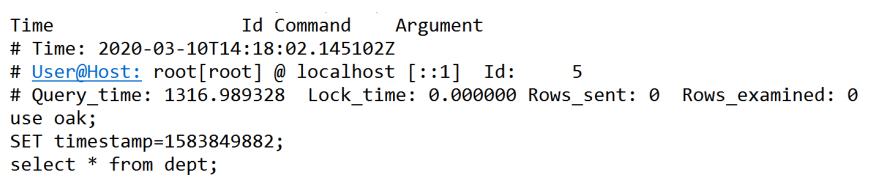

- time：日志记录的时间
- User@Host：执行的用户及主机
- Query_time：执行的时间
- Lock_time：锁表时间
- Rows_sent：发送给请求方的记录数，结果数量
- Rows_examined：语句扫描的记录条数
- SET timestamp：语句执行的时间点
- select....：执行的具体的SQL语句

#### 使用mysqldumpslow查看

MySQL 提供了一个慢查询日志分析工具mysqldumpslow，可以通过该工具分析慢查询日志内容。
在 MySQL bin目录下执行下面命令可以查看该使用格式。

```shell
perl mysqldumpslow.pl --help
```


运行如下命令查看慢查询日志信息：

```shell
perl mysqldumpslow.pl -t 5 -s at C:\ProgramData\MySQL\Data\OAK-slow.log
```

除了使用mysqldumpslow工具，也可以使用第三方分析工具，比如pt-query-digest、
mysqlsla等。

## 4.2 慢查询优化

#### 索引和慢查询

> 如何判断是否为慢查询？

MySQL判断一条语句是否为慢查询语句，主要依据SQL语句的执行时间，它把当前语句的执行时间跟 long_query_time 参数做比较，如果语句的执行时间 > long_query_time，就会把这条执行语句记录到慢查询日志里面。long_query_time 参数的默认值是 10s，该参数值可以根据自己的业务需要进行调整。

> 如何判断是否应用了索引？

SQL语句是否使用了索引，可根据SQL语句执行过程中有没有用到表的索引，可通过 explain命令分析查看，检查结果中的 key 值，是否为NULL。

> 应用了索引是否一定快？

下面我们来看看下面语句的 explain 的结果，你觉得这条语句有用上索引吗？比如

```sql
select * from user where id>0
```

虽然使用了索引，但是还是从主键索引的最左边的叶节点开始向右扫描整个索引树，进行了全表扫描，此时索引就失去了意义。

而像 select * from user where id = 2; 这样的语句，才是我们平时说的使用了索引。它表示的意思是，我们使用了索引的快速搜索功能，并且有效地减少了扫描行数。查询是否使用索引，只是表示一个SQL语句的执行过程；而是否为慢查询，是由它执行的时间决定的，也就是说是否使用了索引和是否是慢查询两者之间没有必然的联系。

我们在使用索引时，不要只关注是否起作用，应该关心索引是否减少了查询扫描的数据行数，如果扫描行数减少了，效率才会得到提升。对于一个大表，不止要创建索引，还要考虑索引过滤性，过滤性好，执行速度才会快。

#### 提高索引过滤性

假如有一个 5000 万记录的用户表，通过sex='男'索引过滤后，还需要定位 3000 万，SQL执行速度也不会很快。其实这个问题涉及到索引的过滤性，比如 1 万条记录利用索引过滤后定位 10 条、 100条、 1000 条，那他们过滤性是不同的。索引过滤性与索引字段、表的数据量、表设计结构都有关系。

下面我们看一个案例：

```
表：student
字段：id,name,sex,age
造数据：insert into student (name,sex,age) select name,sex,age from student;
SQL案例：select * from student where age=18 and name like '张%';（全表扫描）
```

> 优化 1

```sql
alter table student add index(name); # 追加name索引
```

> 优化2

```sql
alter table student add index(age,name); # 追加age,name索引
```

> 优化 3

可以看到，index condition pushdown 优化的效果还是很不错的。再进一步优化，我们可以把名字的第一个字和年龄做一个联合索引，这里可以使用MySQL 5.7 引入的虚拟列来实现

```sql
# 为user表添加first_name虚拟列，以及联合索引（first_name,age）
alter table student 
	add first_name varchar(2) generated always as (left(name,1)),
	add index(first_name,age);
	
# 查看执行
explain select * from student where first_name = '张' and age = 18;

```

#### 慢查询原因总结

- 全表扫描：explain分析type属性all 
- 全索引扫描：explain分析type属性index 索引过滤性不好：
- 靠索引字段选型、数据量和状态、表设计 
- 频繁的回表查询开销：尽量少用select *，使用覆盖索引

## 4.3 分页查询优化

### 4.3.1 一般性分页

一般的分页查询使用简单的 limit 子句就可以实现。limit格式如下：

```sql
select * from 表名 limit [offset,] rows
```

- 第一个参数指定第一个返回记录行的偏移量，注意从 0 开始；
- 第二个参数指定返回记录行的最大数目；
- 如果只给定一个参数，它表示返回最大的记录行数目；

**思考 1 ：如果偏移量固定，返回记录量对执行时间有什么影响？**

```sql
select * from user limit 10000,1;
select * from user limit 10000,10;
select * from user limit 10000,100;
select * from user limit 10000,1000;
select * from user limit 10000,10000;
```

结果：在查询记录时，返回记录量低于 100 条，查询时间基本没有变化，差距不大。随着查询记录量越大，所花费的时间也会越来越多。

**思考 2 ：如果查询偏移量变化，返回记录数固定对执行时间有什么影响？**

```sql
select * from user limit 1,100;
select * from user limit 10,100;
select * from user limit 100,100;
select * from user limit 1000,100;
select * from user limit 10000,100;
```

结果：在查询记录时，如果查询记录量相同，偏移量超过 100 后就开始随着偏移量增大，查询时间急剧的增加。（这种分页查询机制，每次都会从数据库第一条记录开始扫描，越往后查询越慢，而且查询的数据越多，也会拖慢总查询速度。）

### 4.3.2 分页优化方案

第一步：利用覆盖索引优化

```sql
select * from user limit 10000,100;
# 优化为
select id from user limit 10000,100;
```

第二步：利用子查询优化

```sql
select * from user limit 10000,100;
# 优化为
select * from user where id>= (select id from user limit 10000,1) limit 100;
```

原因：使用了id做主键比较(id>=)，并且子查询使用了覆盖索引进行优化。

