[toc]


# 第 1 节 ACID 特性

在关系型数据库管理系统中，一个逻辑工作单元要成为事务，必须满足这 4 个特性，即所谓的 ACID：原子性（Atomicity）、一致性（Consistency）、隔离性（Isolation）和持久性（Durability）。

## 1.1 原子性

原子性：事务是一个原子操作单元，其对数据的修改，要么全都执行，要么全都不执行。

修改---》Buffer Pool修改---》刷盘。可能会有下面两种情况：

- 事务提交了，如果此时Buffer Pool的脏页没有刷盘，如何保证修改的数据生效？ Redo
- 如果事务没提交，但是Buffer Pool的脏页刷盘了，如何保证不该存在的数据撤销？Undo

每一个写事务，都会修改BufferPool，从而产生相应的Redo/Undo日志，在Buffer Pool 中的页被刷到磁盘之前，这些日志信息都会先写入到日志文件中，如果 Buffer Pool 中的脏页没有刷成功，此时数据库挂了，那在数据库再次启动之后，可以通过 Redo 日志将其恢复出来，以保证脏页写的数据不会丢失。如果脏页刷新成功，此时数据库挂了，就需要通过Undo来实现了。

## 1.2 持久性

持久性：指的是一个事务一旦提交，它对数据库中数据的改变就应该是永久性的，后续的操作或故障不应该对其有任何影响，不会丢失。

如下图所示，一个“提交”动作触发的操作有：binlog落地、发送binlog、存储引擎提交、flush_logs，check_point、事务提交标记等。这些都是数据库保证其数据完整性、持久性的手段。

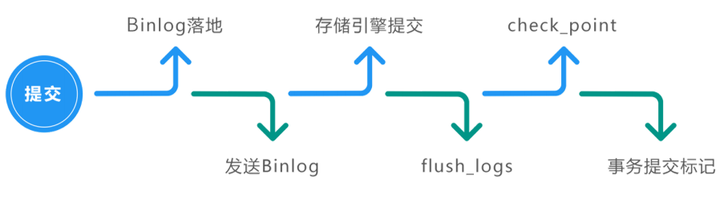

MySQL的持久性也与WAL技术相关，redo log在系统Crash重启之类的情况时，可以修复数据，从而保障事务的持久性。通过原子性可以保证逻辑上的持久性，通过存储引擎的数据刷盘可以保证物理上的持久性。

## 1.3 隔离性

隔离性：指的是一个事务的执行不能被其他事务干扰，即一个事务内部的操作及使用的数据对其他的并发事务是隔离的。

InnoDB 支持的隔离性有 4 种，隔离性从低到高分别为：读未提交、读提交、可重复读、可串行化。锁和多版本控制（MVCC）技术就是用于保障隔离性的（后面课程详解）。

## 1.4 一致性

一致性：指的是事务开始之前和事务结束之后，数据库的完整性限制未被破坏。一致性包括两方面的内容，分别是约束一致性和数据一致性。

- 约束一致性：创建表结构时所指定的外键、Check、唯一索引等约束，可惜在 MySQL 中不支持Check 。
- 数据一致性：是一个综合性的规定，因为它是由原子性、持久性、隔离性共同保证的结果，而不是单单依赖于某一种技术。

一致性也可以理解为数据的完整性。数据的完整性是通过原子性、隔离性、持久性来保证的，而这 3 个特性又是通过 Redo/Undo 来保证的。逻辑上的一致性，包括唯一索引、外键约束、check 约束，这属于业务逻辑范畴。

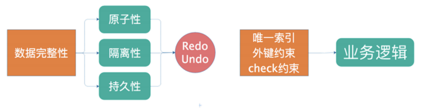

ACID 及它们之间的关系如下图所示， 4 个特性中有 3 个与 WAL 有关系，都需要通过 Redo、Undo 日志来保证等。

WAL的全称为Write-Ahead Logging，先写日志，再写磁盘。

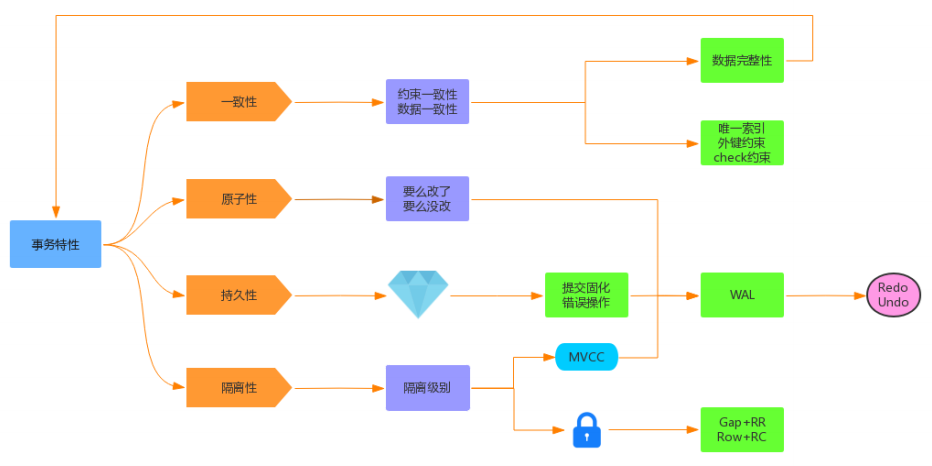

# 第 2 节 事务控制的演进

## 2.1 并发事务

事务并发处理可能会带来一些问题，比如：更新丢失、脏读、不可重复读、幻读等。

> 更新丢失

当两个或多个事务更新同一行记录，会产生更新丢失现象。可以分为回滚覆盖和提交覆盖。

- 回滚覆盖：一个事务回滚操作，把其他事务已提交的数据给覆盖了。

- 提交覆盖：一个事务提交操作，把其他事务已提交的数据给覆盖了。

> 脏读

一个事务读取到了另一个事务修改但未提交的数据。

> 不可重复读

一个事务中多次读取同一行记录不一致，后面读取的跟前面读取的不一致。

> 幻读

一个事务中多次按相同条件查询，结果不一致。后续查询的结果和面前查询结果不同，多了或少了几行记录。

## 2.2 排队

最简单的方法，就是完全顺序执行所有事务的数据库操作，不需要加锁，简单的说就是全局排队。序列化执行所有的事务单元，数据库某个时刻只处理一个事务操作，特点是强一致性，处理性能低。

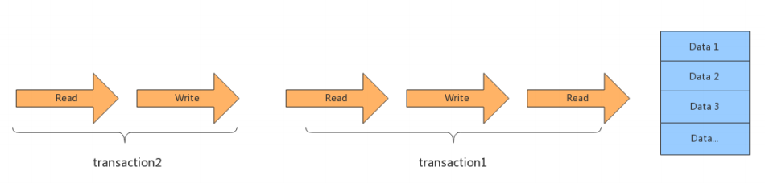

## 2.3 排他锁

引入锁之后就可以支持并发处理事务，如果事务之间涉及到相同的数据项时，会使用排他锁，或叫互斥锁，先进入的事务独占数据项以后，其他事务被阻塞，等待前面的事务释放锁。


注意，在整个事务 1 结束之前，锁是不会被释放的，所以，事务 2 必须等到事务 1 结束之后开始。

## 2.4 读写锁

读和写操作：读读、写写、读写、写读。

读写锁就是进一步细化锁的颗粒度，区分读操作和写操作，让读和读之间不加锁，这样下面的两个事务就可以同时被执行了。


读写锁，可以让读和读并行，而读和写、写和读、写和写这几种之间还是要加排他锁。

## 2.5 MVCC

多版本控制MVCC，也就是Copy on Write的思想。MVCC除了支持读和读并行，还支持读和写、写和读的并行，但为了保证一致性，写和写是无法并行的。

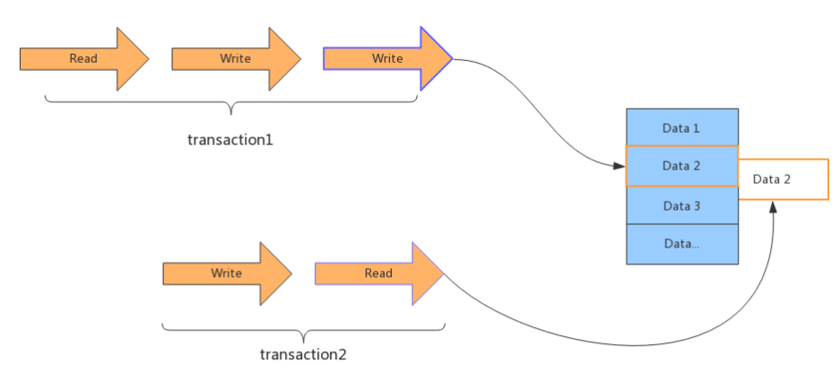

在事务 1 开始写操作的时候会copy一个记录的副本，其他事务读操作会读取这个记录副本，因此不会影响其他事务对此记录的读取，实现写和读并行。

### 2.5.1 MVCC概念

MVCC（Multi Version Concurrency Control）被称为多版本控制，是指在数据库中为了实现高并发的数据访问，对数据进行多版本处理，并通过事务的可见性来保证事务能看到自己应该看到的数据版本。多版本控制很巧妙地将稀缺资源的独占互斥转换为并发，大大提高了数据库的吞吐量及读写性能。

如何生成的多版本？每次事务修改操作之前，都会在Undo日志中记录修改之前的数据状态和事务号，该备份记录可以用于其他事务的读取，也可以进行必要时的数据回滚。

### 2.5.2 MVCC实现原理

MVCC最大的好处是读不加锁，读写不冲突。在读多写少的系统应用中，读写不冲突是非常重要的，极大的提升系统的并发性能，这也是为什么现阶段几乎所有的关系型数据库都支持 MVCC 的原因，不过目前MVCC只在 Read Commited 和 Repeatable Read 两种隔离级别下工作。

在 MVCC 并发控制中，读操作可以分为两类: 快照读（Snapshot Read）与当前读 （Current Read）。

- 快照读：读取的是记录的快照版本（有可能是历史版本），不用加锁。（select）
- 当前读：读取的是记录的最新版本，并且当前读返回的记录，都会加锁，保证其他事务不会再并发修改这条记录。（select... for update 或lock in share mode，insert/delete/update）

为了让大家更直观地理解 MVCC 的实现原理，举一个记录更新的案例来讲解 MVCC 中多版本的实现。

假设 F1～F6 是表中字段的名字， 1 ～ 6 是其对应的数据。后面三个隐含字段分别对应该行的隐含ID、事务号和回滚指针，如下图所示。

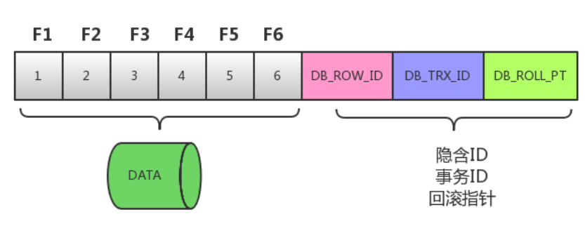

具体的更新过程如下：

假如一条数据是刚 INSERT 的，DB_ROW_ID 为 1 ，其他两个字段为空。当事务 1 更改该行的数据值时，会进行如下操作，如下图所示。

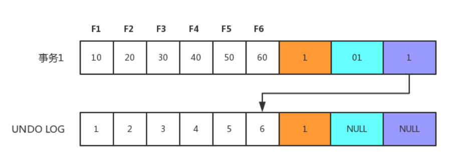

- 用排他锁锁定该行；记录 Redo log；
- 把该行修改前的值复制到 Undo log，即图中下面的行；
- 修改当前行的值，填写事务编号，使回滚指针指向 Undo log 中修改前的行。

接下来事务 2 操作，过程与事务 1 相同，此时 Undo log 中会有两行记录，并且通过回滚指针连在一起，通过当前记录的回滚指针回溯到该行创建时的初始内容，如下图所示。

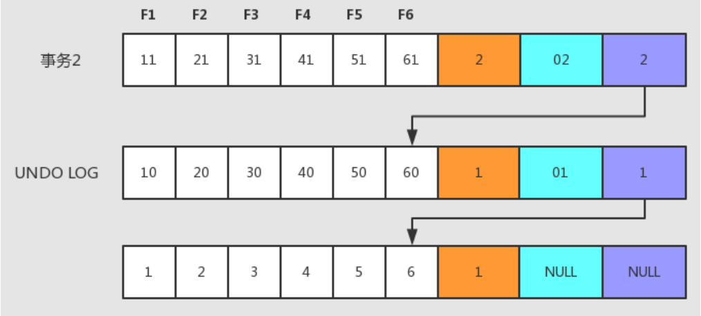

MVCC已经实现了读读、读写、写读并发处理，如果想进一步解决写写冲突，可以采用下面两种方案：

- 乐观锁

- 悲观锁

# 第 3 节 事务隔离级别

## 3.1 隔离级别类型

前面提到的“更新丢失”、”脏读”、“不可重复读”和“幻读”等并发事务问题，其实都是数据库一致性问题，为了解决这些问题，MySQL数据库是通过事务隔离级别来解决的，数据库系统提供了以下 4 种事务隔离级别供用户选择。

| 事务隔离级别 | 回滚覆盖 | 脏读     | 不可重复度 | 提交覆盖 | 幻读     |
| ------------ | -------- | -------- | ---------- | -------- | -------- |
| 读未提交     | ×        | 可能发生 | 可能发生   | 可能发生 | 可能发生 |
| 读已提交     | ×        | ×        | 可能发生   | 可能发生 | 可能发生 |
| 可重复度     | ×        | ×        | ×          | ×        | 可能发生 |
| 串行化       | ×        | ×        | ×          | ×        | ×        |

> 读未提交

Read Uncommitted 读未提交：解决了回滚覆盖类型的更新丢失，但可能发生脏读现象，也就是可能读取到其他会话中未提交事务修改的数据。

> 已提交读

Read Committed 读已提交：只能读取到其他会话中已经提交的数据，解决了脏读。但可能发生不可重复读现象，也就是可能在一个事务中两次查询结果不一致。

> 可重复度

Repeatable Read 可重复读：解决了不可重复读，它确保同一事务的多个实例在并发读取数据时，会看到同样的数据行。不过理论上会出现幻读，简单的说幻读指的的当用户读取某一范围的数据行时，另一个事务又在该范围插入了新行，当用户在读取该范围的数据时会发现有新的幻影行。

> 可串行化

Serializable 串行化：所有的增删改查串行执行。它通过强制事务排序，解决相互冲突，从而解决幻度的问题。这个级别可能导致大量的超时现象的和锁竞争，效率低下。

数据库的事务隔离级别越高，并发问题就越小，但是并发处理能力越差（代价）。读未提交隔离级别最低，并发问题多，但是并发处理能力好。以后使用时，可以根据系统特点来选择一个合适的隔离级别，比如对不可重复读和幻读并不敏感，更多关心数据库并发处理能力，此时可以使用Read Commited隔离级别。

事务隔离级别，针对Innodb引擎，支持事务的功能。像MyISAM引擎没有关系。

## 3.2 事务隔离级别和锁的关系

1 ）事务隔离级别是SQL92定制的标准，相当于事务并发控制的整体解决方案，本质上是对锁和MVCC使用的封装，隐藏了底层细节。

2 ）锁是数据库实现并发控制的基础，事务隔离性是采用锁来实现，对相应操作加不同的锁，就可以防止其他事务同时对数据进行读写操作。

3 ）对用户来讲，首先选择使用隔离级别，当选用的隔离级别不能解决并发问题或需求时，才有必要在开发中手动的设置锁。

MySQL默认隔离级别：可重复读

Oracle、SQLServer默认隔离级别：读已提交

一般使用时，建议采用默认隔离级别，然后存在的一些并发问题，可以通过悲观锁、乐观锁等实现处理。

## 3.3 MySQL隔离级别控制

MySQL默认的事务隔离级别是Repeatable Read，查看MySQL当前数据库的事务隔离级别命令如下：

```sql
show variables like 'tx_isolation'
```

或

```sql
show @@tx_isolation
```

> 设置事务隔离级别可以如下命令：

```sql
set tx_isolation='READ-UNCOMMITTED';
set tx_isolation='READ-COMMITTED';
set tx_isolation='REPEATABLE-READ';
set tx_isolation='SERIALIZABLE';
```


# 第 4 节 锁机制和实战

## 4.1 锁分类

在 MySQL中锁有很多不同的分类。

> 从操作的粒度可分为表级锁、行级锁和页级锁。

- 表级锁：每次操作锁住整张表。锁定粒度大，发生锁冲突的概率最高，并发度最低。应用在MyISAM、InnoDB、BDB 等存储引擎中。
- 行级锁：每次操作锁住一行数据。锁定粒度最小，发生锁冲突的概率最低，并发度最高。应用在InnoDB 存储引擎中。
- 页级锁：每次锁定相邻的一组记录，锁定粒度界于表锁和行锁之间，开销和加锁时间界于表锁和行锁之间，并发度一般。应用在BDB 存储引擎中。

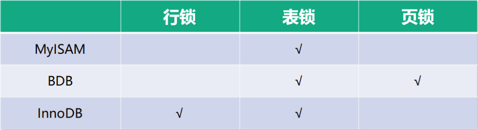

> 从操作的类型可分为读锁和写锁。

- 读锁（S锁）：共享锁，针对同一份数据，多个读操作可以同时进行而不会互相影响。
- 写锁（X锁）：排他锁，当前写操作没有完成前，它会阻断其他写锁和读锁。

**IS锁、IX锁**：意向读锁、意向写锁，属于表级锁，S和X主要针对行级锁。在对表记录添加S或X锁之前，会先对表添加IS或IX锁。

**S锁**：事务A对记录添加了S锁，可以对记录进行读操作，不能做修改，其他事务可以对该记录追加S锁，但是不能追加X锁，需要追加X锁，需要等记录的S锁全部释放。

**X锁**：事务A对记录添加了X锁，可以对记录进行读和修改操作，其他事务不能对记录做读和修改操作。

> 从操作的性能可分为乐观锁和悲观锁。

- 乐观锁：一般的实现方式是对记录数据版本进行比对，在数据更新提交的时候才会进行冲突检测，如果发现冲突了，则提示错误信息。
- 悲观锁：在对一条数据修改的时候，为了避免同时被其他人修改，在修改数据之前先锁定，再修改的控制方式。共享锁和排他锁是悲观锁的不同实现，但都属于悲观锁范畴。

## 4.2 行锁原理

在InnoDB引擎中，我们可以使用行锁和表锁，其中行锁又分为共享锁和排他锁。 **InnoDB行锁是通过对索引数据页上的记录加锁实现的** ，主要实现算法有 3 种：Record Lock、Gap Lock 和 Next-key Lock。

- RecordLock锁：锁定单个行记录的锁。（记录锁，RC、RR隔离级别都支持） 
- GapLock锁：间隙锁，锁定索引记录间隙，确保索引记录的间隙不变。（范围锁，RR隔离级别支 持） 
- Next-key Lock 锁：记录锁和间隙锁组合，同时锁住数据，并且锁住数据前后范围。（记录锁+范 围锁，RR隔离级别支持）

在RR隔离级别，InnoDB对于记录加锁行为都是先采用Next-Key Lock，但是当SQL操作含有唯一索引时，Innodb会对Next-Key Lock进行优化，降级为RecordLock，仅锁住索引本身而非范围。

1 ）select ... from 语句：InnoDB引擎采用MVCC机制实现非阻塞读，所以对于普通的select语句，InnoDB不加锁

2 ）select ... from lock in share mode语句：追加了共享锁，InnoDB会使用Next-Key Lock锁进行处理，如果扫描发现唯一索引，可以降级为RecordLock锁。

3 ）select ... from for update语句：追加了排他锁，InnoDB会使用Next-Key Lock锁进行处理，如果扫描发现唯一索引，可以降级为RecordLock锁。

4 ）update ... where 语句：InnoDB会使用Next-Key Lock锁进行处理，如果扫描发现唯一索引，可以降级为RecordLock锁。

5 ）delete ... where 语句：InnoDB会使用Next-Key Lock锁进行处理，如果扫描发现唯一索引，可以降级为RecordLock锁。

6 ）insert语句：InnoDB会在将要插入的那一行设置一个排他的RecordLock锁。


下面以“update t1 set name=‘XX’ where id=10”操作为例，举例子分析下 InnoDB 对不同索引的加锁行为，以RR隔离级别为例。

### 主键加锁

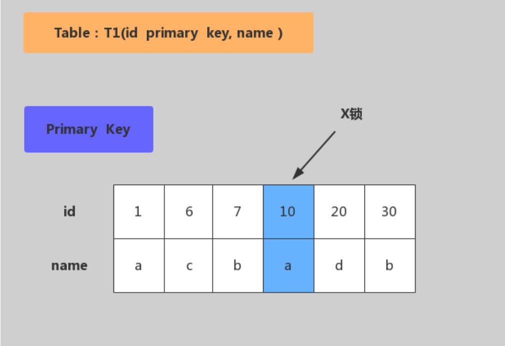

加锁行为：仅在id=10的主键索引记录上加X锁。

### 唯一键加锁

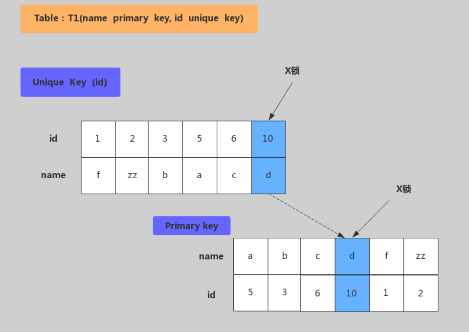

加锁行为：现在唯一索引id上加X锁，然后在id=10的主键索引记录上加X锁。

### 非唯一键加锁

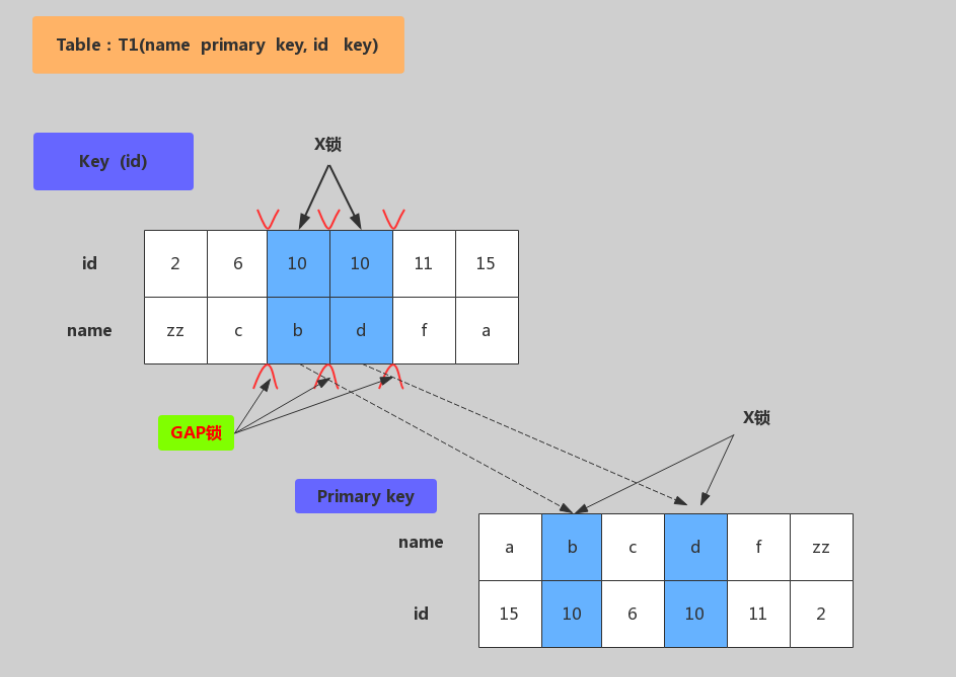

加锁行为：对满足id=10条件的记录和主键分别加X锁，然后在(6,c)-(10,b)、(10,b)-(10,d)、(10,d)-(11,f)范围分别加Gap Lock。

### 无索引加锁

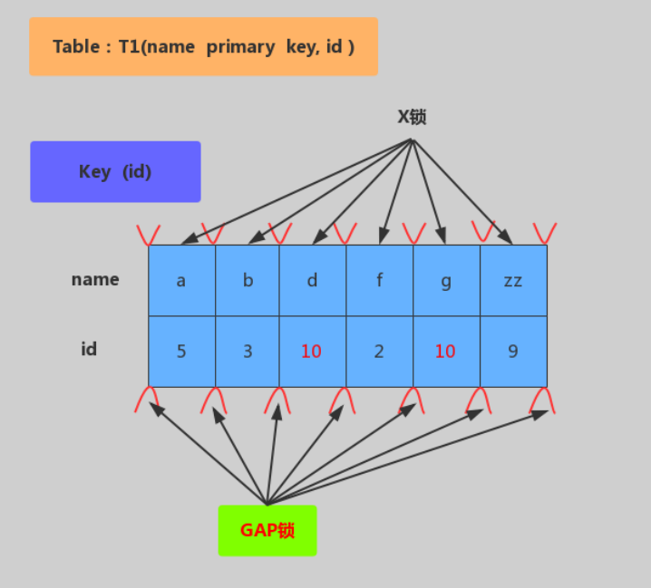

加锁行为：表里所有行和间隙都会加X锁。（当没有索引时，会导致全表锁定，因为InnoDB引擎锁机制是基于索引实现的记录锁定）。

## 4.3 悲观锁

悲观锁（Pessimistic Locking），是指在数据处理过程，将数据处于锁定状态，一般使用数据库的锁机制实现。从广义上来讲，前面提到的行锁、表锁、读锁、写锁、共享锁、排他锁等，这些都属于悲观锁范畴。

### 表级锁

表级锁每次操作都锁住整张表，并发度最低。常用命令如下：

手动增加表锁

```sql
lock table 表名称 read|write, 表名称2 read|wtite;
```

查看表上加过的锁删除表锁

```sql
show opent tables;
```

删除表锁

```sql
unlock tables;
```

表级读锁：当前表追加read锁，当前连接和其他的连接都可以读操作；但是当前连接增删改操作会报错，其他连接增删改会被阻塞。

表级写锁：当前表追加write锁，当前连接可以对表做增删改查操作，其他连接对该表所有操作都被阻塞（包括查询）。

**总结：**表级读锁会阻塞写操作，但是不会阻塞读操作。而写锁则会把读和写操作都阻塞。

### 共享锁（行级锁-读锁）

共享锁又称为读锁，简称S锁。共享锁就是多个事务对于同一数据可以共享一把锁，都能访问到数据，但是只能读不能修改。使用共享锁的方法是在 `select ... lock in share mode `，只适用查询语句。

**总结：**事务使用了共享锁（读锁），只能读取，不能修改，修改操作被阻塞。

### 排他锁（行级锁-写锁）

排他锁又称为写锁，简称X锁。排他锁就是不能与其他锁并存，如一个事务获取了一个数据行的排他锁，其他事务就不能对该行记录做其他操作，也不能获取该行的锁。

使用排他锁的方法是在SQL末尾加上 `for update` ，==innodb引擎默认会在update，delete语句加上for update==。**行级锁的实现其实是依靠其对应的索引，所以如果操作没用到索引的查询，那么会锁住全表记录。**


<font color=red>**总结：事务使用了排他锁（写锁），当前事务可以读取和修改，其他事务不能修改，也不能获取记录锁（select... for update）。如果查询没有使用到索引，将会锁住整个表记录。**</font>

## 4.4 乐观锁

乐观锁是相对于悲观锁而言的，它不是数据库提供的功能，需要开发者自己去实现。在数据库操作时，想法很乐观，认为这次的操作不会导致冲突，因此在数据库操作时并不做任何的特殊处理，即不加锁，而是在进行事务提交时再去判断是否有冲突了。

乐观锁实现的关键点：冲突的检测。

悲观锁和乐观锁都可以解决事务写写并发，在应用中可以根据并发处理能力选择区分，比如对并发率要求高的选择乐观锁；对于并发率要求低的可以选择悲观锁。

### 乐观锁实现原理

> 使用版本字段（version）

先给数据表增加一个版本(version) 字段，每操作一次，将那条记录的版本号加 1 。version是用来查看被读的记录有无变化，作用是防止记录在业务处理期间被其他事务修改。

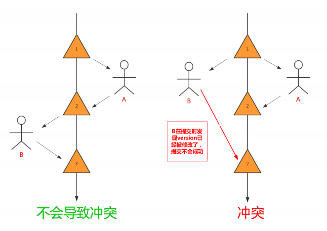

> 使用时间戳（Timestamp）

与使用version版本字段相似，同样需要给在数据表增加一个字段，字段类型使用timestamp时间戳。也是在更新提交的时候检查当前数据库中数据的时间戳和自己更新前取到的时间戳进行对比，如果一致则提交更新，否则就是版本冲突，取消操作。


### 乐观锁案例

下面我们使用下单过程作为案例，描述下乐观锁的使用。

> 第一步：查询商品信息

```sql
select (quantity,version) from products where id =1;
```

> 第二部：根据商品信息生成订单

```sql
insert into orders ...
insert into items ...
```

> 第三部：修改商品库存

```sql
update produces set quantity=quantity-1,version=version+1
	where id =1 and version=#{version};
```

> 除了自己手动实现乐观锁之外，许多数据库访问框架也封装了乐观锁的实现，比如hibernate框架。MyBatis框架大家可以使用OptimisticLocker插件来扩展。

## 4.5 死锁与解决方案

下面介绍几种常见的死锁现象和解决方案：

### 4.5.1 表锁死锁

> 产生原因：

用户A访问表A（锁住了表A），然后又访问表B；另一个用户B访问表B（锁住了表B），然后企图访问表A；这时用户A由于用户B已经锁住表B，它必须等待用户B释放表B才能继续，同样用户B要等用户A释放表A才能继续，这就死锁就产生了。

用户A--》A表（表锁）--》B表（表锁）

用户B--》B表（表锁）--》A表（表锁）

> 解决方案：

这种死锁比较常见，是由于程序的BUG产生的，除了调整的程序的逻辑没有其它的办法。仔细分析程序的逻辑，对于数据库的多表操作时，尽量按照相同的顺序进行处理，尽量避免同时锁定两个资源，如操作A和B两张表时，总是按先A后B的顺序处理， 必须同时锁定两个资源时，要保证在任何时刻都应该按照相同的顺序来锁定资源。

### 4.5.2 行级锁死锁

> 产生原因 1 ：

如果在事务中执行了一条没有索引条件的查询，引发全表扫描，把行级锁上升为全表记录锁定（等价于表级锁），多个这样的事务执行后，就很容易产生死锁和阻塞，最终应用系统会越来越慢，发生阻塞或死锁。

> 解决方案 1 ：

SQL语句中不要使用太复杂的关联多表的查询；使用explain“执行计划"对SQL语句进行分析，对于有全表扫描和全表锁定的SQL语句，建立相应的索引进行优化。


> 产生原因 2 ：

两个事务分别想拿到对方持有的锁，互相等待，于是产生死锁。

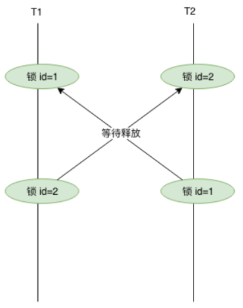

> 解决方案 2 ：

- 在同一个事务中，尽可能做到一次锁定所需要的所有资源
- 按照id对资源排序，然后按顺序进行处理

### 4.5.3 共享锁转换为排他锁

> 产生原因：

事务A 查询一条纪录，然后更新该条纪录；此时事务B 也更新该条纪录，这时事务B 的排他锁由于事务A 有共享锁，必须等A 释放共享锁后才可以获取，只能排队等待。事务A 再执行更新操作时，此处发生死锁，因为事务A 需要排他锁来做更新操作。但是，无法授予该锁请求，因为事务B 已经有一个排他锁请求，并且正在等待事务A 释放其共享锁。

事务A: 

```sql
select * from dept where deptno=1 lock in share mode; #共享锁,1

update dept set dname='java' where deptno=1;#排他锁,3
```

事务B: 

```sql
update dept set dname='Java' where deptno=1;
#由于 1 有共享锁，没法获取排他锁，需等待， 2
```


> 解决方案：

- 对于按钮等控件，点击立刻失效，不让用户重复点击，避免引发同时对同一条记录多次操作；

- 使用乐观锁进行控制。乐观锁机制避免了长事务中的数据库加锁开销，大大提升了大并发量下的系统性能。需要注意的是，由于乐观锁机制是在我们的系统中实现，来自外部系统的用户更新操作不受我们系统的控制，因此可能会造成脏数据被更新到数据库中；

### 4.5.4 死锁排查

MySQL提供了几个与锁有关的参数和命令，可以辅助我们优化锁操作，减少死锁发生。

> 查看死锁日志

通过 show engine innodb status\G 命令查看近期死锁日志信息。

使用方法： 1 、查看近期死锁日志信息； 2 、使用explain查看下SQL执行计划

> 查看锁状态变量

通过 show status like'innodb_row_lock%‘ 命令检查状态变量，分析系统中的行锁的争夺
情况

```sql
Innodb_row_lock_current_waits：#当前正在等待锁的数量
Innodb_row_lock_time：#从系统启动到现在锁定总时间长度
Innodb_row_lock_time_avg： #每次等待锁的平均时间
Innodb_row_lock_time_max：#从系统启动到现在等待最长的一次锁的时间
Innodb_row_lock_waits：#系统启动后到现在总共等待的次数
```

如果等待次数高，而且每次等待时间长，需要分析系统中为什么会有如此多的等待，然后着手定制优化。

