[TOC]


# 第 1 节 集群架构设计

## 1.1 架构设计理念

在集群架构设计时，主要遵从下面三个维度：

- 可用性
- 扩展性
- 一致性

## 1.2 可用性设计

- 站点高可用，冗余站点
- 服务高可用，冗余服务
- 数据高可用，冗余数据

**保证高可用的方法是冗余** 。但是数据冗余带来的问题是数据一致性问题。

实现高可用的方案有以下几种架构模式：

- 主从模式

  简单灵活，能满足多种需求。比较主流的用法，但是写操作高可用需要自行处理。

- 双主模式

  互为主从，有双主双写、双主单写两种方式，建议使用双主单写

## 1.3 扩展性设计

扩展性主要围绕着读操作扩展和写操作扩展展开。

- 如何扩展以提高读性能

  - 加从库

    简单易操作，方案成熟。

    从库过多会引发主库性能损耗。建议不要作为长期的扩充方案，应该设法用良好的设计避免持续加从库来缓解读性能问题。

  - 分库分表

    可以分为垂直拆分和水平拆分，垂直拆分可以缓解部分压力，水平拆分理论上可以无限扩展。

- 如何扩展以提高写性能

  分库分表

## 1.4 一致性设计

一致性主要考虑集群中各数据库数据同步以及同步延迟问题。可以采用的方案如下：

- 不使用从库

  扩展读性能问题需要单独考虑，否则容易出现系统瓶颈。

- 增加访问路由层

  可以先得到主从同步最长时间t，在数据发生修改后的t时间内，先访问主库。

# 第 2 节 主从模式

## 2.1 适用场景

MySQL主从模式是指数据可以从一个MySQL数据库服务器主节点复制到一个或多个从节点。MySQL 默认采用异步复制方式，这样从节点不用一直访问主服务器来更新自己的数据，从节点可以复制主数据库中的所有数据库，或者特定的数据库，或者特定的表。

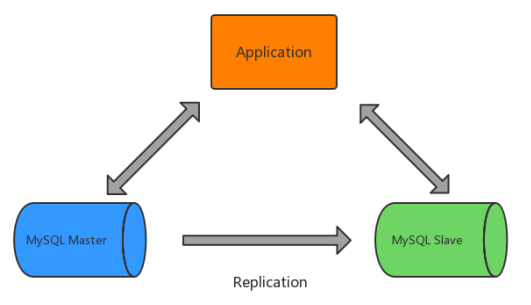

mysql主从复制用途：

- 实时灾备，用于故障切换（高可用）
- 读写分离，提供查询服务（读扩展）
- 数据备份，避免影响业务（高可用）

主从部署必要条件：

- 从库服务器能连通主库
- 主库开启binlog日志（设置log-bin参数）
- 主从server-id不同

## 2.2 实现原理

### 2.2.1 主从复制

下图是主从复制的原理图。

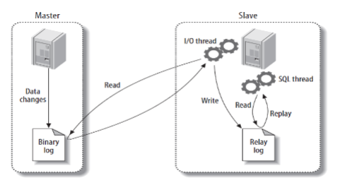

主从复制整体分为以下三个步骤：

- 主库将数据库的变更操作记录到Binlog日志文件中
- 从库读取主库中的Binlog日志文件信息写入到从库的Relay Log中继日志中
- 从库读取中继日志信息在从库中进行Replay,更新从库数据信息

在上述三个过程中，涉及了Master的BinlogDump Thread和Slave的I/O Thread、SQL Thread，它们
的作用如下：

- Master服务器对数据库更改操作记录在Binlog中，BinlogDump Thread接到写入请求后，读取
  Binlog信息推送给Slave的I/O Thread。
- Slave的I/O Thread将读取到的Binlog信息写入到本地Relay Log中。
- Slave的SQL Thread检测到Relay Log的变更请求，解析relay log中内容在从库上执行。

上述过程都是异步操作，俗称异步复制，存在数据延迟现象。

下图是异步复制的时序图。

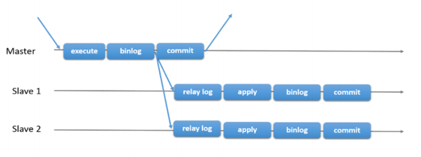

mysql主从复制存在的问题：

- 主库宕机后，数据可能丢失
- 从库只有一个SQL Thread，主库写压力大，复制很可能延时

解决方法：

- 半同步复制---解决数据丢失的问题
- 并行复制----解决从库复制延迟的问题

### 2.2.2 半同步复制

为了提升数据安全，MySQL让Master在某一个时间点等待Slave节点的 ACK（ *Ack* nowledgecharacter）消息，接收到ACK消息后才进行事务提交，这也是半同步复制的基础，MySQL从5.5版本开始引入了半同步复制机制来降低数据丢失的概率。

介绍半同步复制之前先快速过一下 MySQL 事务写入碰到主从复制时的完整过程，主库事务写入分为 4个步骤：

- InnoDB Redo File Write (Prepare Write)
- Binlog File Flush & Sync to Binlog File
- InnoDB Redo File Commit（Commit Write）
- Send Binlog to Slave

当Master不需要关注Slave是否接受到Binlog Event时，即为传统的主从复制。

当Master需要在第三步等待Slave返回ACK时，即为 after-commit，半同步复制（MySQL 5.5引入）。

当Master需要在第二步等待 Slave 返回 ACK 时，即为 after-sync，增强半同步（MySQL 5.7引入）。

下图是 MySQL 官方对于半同步复制的时序图，主库等待从库写入 relay log 并返回 ACK 后才进行Engine Commit。


## 2.3 并行复制

MySQL的主从复制延迟一直是受开发者最为关注的问题之一，MySQL从5.6版本开始追加了并行复制功能，目的就是为了改善复制延迟问题，并行复制称为enhanced multi-threaded slave（简称MTS）。

在从库中有两个线程IO Thread和SQL Thread，都是单线程模式工作，因此有了延迟问题，我们可以采用多线程机制来加强，减少从库复制延迟。（IO Thread多线程意义不大，主要指的是SQL Thread多线程）

在MySQL的5.6、5.7、8.0版本上，都是基于上述SQL Thread多线程思想，不断优化，减少复制延迟。

### 2.3.1 MySQL 5.6并行复制原理

MySQL 5.6版本也支持所谓的并行复制，但是其并行只是基于库的。如果用户的MySQL数据库中是多个库，对于从库复制的速度的确可以有比较大的帮助。

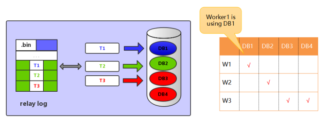

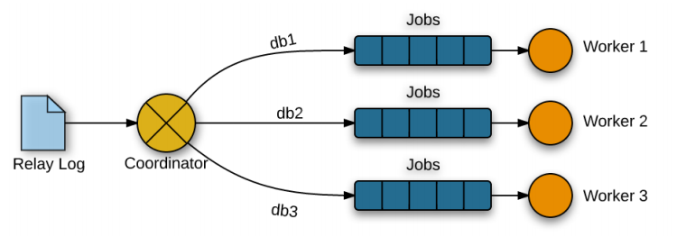

基于库的并行复制，实现相对简单，使用也相对简单些。基于库的并行复制遇到单库多表使用场景就发挥不出优势了，另外对事务并行处理的执行顺序也是个大问题。

### 2.3.2 MySQL 5.7并行复制原理

MySQL 5.7是基于组提交的并行复制，MySQL 5.7才可称为真正的并行复制，这其中最为主要的原因就是slave服务器的回放与master服务器是一致的，即master服务器上是怎么并行执行的slave上就怎样进行并行回放。不再有库的并行复制限制。

> MySQL 5.7中组提交的并行复制究竟是如何实现的？

MySQL 5.7是通过对事务进行分组，当事务提交时，它们将在单个操作中写入到二进制日志中。如果多个事务能同时提交成功，那么它们意味着没有冲突，因此可以在Slave上并行执行，所以通过在主库上的二进制日志中添加组提交信息。

MySQL 5.7的并行复制基于一个前提，即所有已经处于prepare阶段的事务，都是可以并行提交的。这些当然也可以在从库中并行提交，因为处理这个阶段的事务都是没有冲突的。在一个组里提交的事务，一定不会修改同一行。这是一种新的并行复制思路，完全摆脱了原来一直致力于为了防止冲突而做的分发算法，等待策略等复杂的而又效率底下的工作。

InnoDB事务提交采用的是两阶段提交模式。一个阶段是prepare，另一个是commit。

为了兼容MySQL 5.6基于库的并行复制，5.7引入了新的变量slave-parallel-type，其可以配置的值有：DATABASE（默认值，基于库的并行复制方式）、LOGICAL_CLOCK（基于组提交的并行复制方式）。

> 那么如何知道事务是否在同一组中，生成的Binlog内容如何告诉Slave哪些事务是可以并行复制的？
>

在MySQL 5.7版本中，其设计方式是将组提交的信息存放在GTID中。为了避免用户没有开启GTID功能（gtid_mode=OFF），MySQL 5.7又引入了称之为Anonymous_Gtid的二进制日志event类型ANONYMOUS_GTID_LOG_EVENT。

通过mysqlbinlog工具分析binlog日志，就可以发现组提交的内部信息。

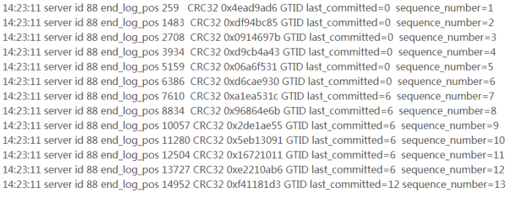

可以发现MySQL 5.7二进制日志较之原来的二进制日志内容多了last_committed和sequence_number，last_committed表示事务提交的时候，上次事务提交的编号，如果事务具有相同的last_committed，表示这些事务都在一组内，可以进行并行的回放。

### 2.3.3 MySQL8.0 并行复制

MySQL8.0 是基于write-set的并行复制。MySQL会一个集合变量来存储事务修改的记录信息（主键哈希值），所有已经提交的事务所修改的主键值经过hash后都会与那个变量的集合进行对比，来判断改行是否与其冲突，并以此来确定依赖关系，没有冲突即可并行。这样粒度，就到了 row级别了，此时并行的粒度更加精细，并行的速度会更快。

### 2.3.4 并行复制配置与调优

- binlog_transaction_dependency_history_size

  用于控制集合变量的大小。

- binlog_transaction_depandency_tracking

  用于控制binlog文件中事务之间的依赖关系，即last_committed值。

  - COMMIT_ORDERE: 基于组提交机制

  - WRITESET: 基于写集合机制

  - WRITESET_SESSION: 基于写集合，比writeset多了一个约束，同一个session中的事务last_committed按先后顺序递增
    transaction_write_set_extraction
    用于控制事务的检测算法，参数值为：OFF、 XXHASH64、MURMUR32

  - master_info_repository

    开启MTS功能后，务必将参数master_info_repostitory设置为TABLE，这样性能可以有50%~80%的提升。这是因为并行复制开启后对于元master.info这个文件的更新将会大幅提升，资源的竞争也会变大。

  - slave_parallel_workers

    若将slave_parallel_workers设置为 0 ，则MySQL 5.7退化为原单线程复制，但将slave_parallel_workers设置为 1 ，则SQL线程功能转化为coordinator线程，但是只有 1 个worker线程进行回放，也是单线程复制。然而，这两种性能却又有一些的区别，因为多了一次coordinator线程的转发，因此slave_parallel_workers=1的性能反而比 0 还要差。

  - slave_preserve_commit_order

    MySQL 5.7后的MTS可以实现更小粒度的并行复制，但需要将slave_parallel_type设置为LOGICAL_CLOCK，但仅仅设置为LOGICAL_CLOCK也会存在问题，因为此时在slave上应用事务的顺序是无序的，和relay log中记录的事务顺序不一样，这样数据一致性是无法保证的，为了保证事务是按照relay log中记录的顺序来回放，就需要开启参数slave_preserve_commit_order。

要开启enhanced multi-threaded slave其实很简单，只需根据如下设置：

```sql
slave-parallel-type=LOGICAL_CLOCK
slave-parallel-workers=16
slave_pending_jobs_size_max = 2147483648
slave_preserve_commit_order=1
master_info_repository=TABLE
relay_log_info_repository=TABLE
relay_log_recovery=ON
```


### 2.3.5 并行复制监控

在使用了MTS后，复制的监控依旧可以通过SHOW SLAVE STATUS\G，但是MySQL 5.7在performance_schema库中提供了很多元数据表，可以更详细的监控并行复制过程。

```sql
mysql> show tables like 'replication%';
+---------------------------------------------+
| Tables_in_performance_schema (replication%) |
+---------------------------------------------+
| replication_applier_configuration |
| replication_applier_status |
| replication_applier_status_by_coordinator |
| replication_applier_status_by_worker |
| replication_connection_configuration |
| replication_connection_status |
| replication_group_member_stats |
| replication_group_members |
+---------------------------------------------+
```

通过replication_applier_status_by_worker可以看到worker进程的工作情况：

```sql
mysql> select * from replication_applier_status_by_worker;
+--------------+-----------+-----------+---------------+------------------------
--------------------+-------------------+--------------------+------------------
----+
| CHANNEL_NAME | WORKER_ID | THREAD_ID | SERVICE_STATE | LAST_SEEN_TRANSACTION
| LAST_ERROR_NUMBER | LAST_ERROR_MESSAGE |
LAST_ERROR_TIMESTAMP |
+--------------+-----------+-----------+---------------+------------------------
--------------------+-------------------+--------------------+------------------
----+
| | 1 | 32 | ON | 0d8513d8-00a4-11e6-
a510-f4ce46861268:96604 | 0 | | 0000-00-00
00:00:00 |
| | 2 | 33 | ON | 0d8513d8-00a4-11e6-
a510-f4ce46861268:97760 | 0 | | 0000-00-00
00:00:00 |
+--------------+-----------+-----------+---------------+------------------------
--------------------+-------------------+--------------------+------------------
----+
2 rows in set (0.00 sec)
```

最后，如果MySQL 5.7要使用MTS功能，建议使用新版本，最少升级到5.7.19版本，修复了很多Bug。

## 2.4 读写分离

### 2.4.1 读写分离引入时机

大多数互联网业务中，往往读多写少，这时候数据库的读会首先成为数据库的瓶颈。如果我们已经优化了SQL，但是读依旧还是瓶颈时，这时就可以选择“读写分离”架构了。

读写分离首先需要将数据库分为主从库，一个主库用于写数据，多个从库完成读数据的操作，主从库之间通过主从复制机制进行数据的同步，如图所示。

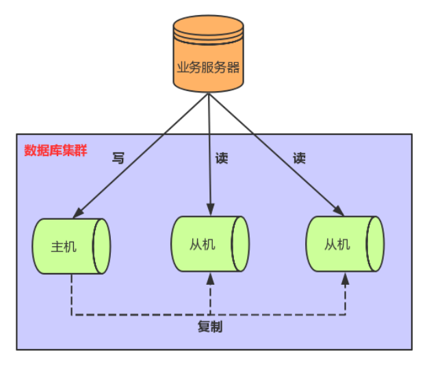

在应用中可以在从库追加多个索引 来优化查询，主库这些索引可以不加，用于提升写效率。

读写分离架构也能够消除读写锁冲突从而提升数据库的读写性能。使用读写分离架构需要注意： **主从同步延迟和读写分配机制** 问题

### 2.4.2 主从同步延迟

使用读写分离架构时，数据库主从同步具有延迟性，数据一致性会有影响，对于一些实时性要求比较高的操作，可以采用以下解决方案。

- 写后立刻读

  在写入数据库后，某个时间段内读操作就去主库，之后读操作访问从库。

- 二次查询

  先去从库读取数据，找不到时就去主库进行数据读取。该操作容易将读压力返还给主库，为了避免恶意攻击，建议对数据库访问API操作进行封装，有利于安全和低耦合。

- 根据业务特殊处理

  根据业务特点和重要程度进行调整，比如重要的，实时性要求高的业务数据读写可以放在主库。对于次要的业务，实时性要求不高可以进行读写分离，查询时去从库查询。

### 2.4.3 读写分离落地

**读写路由分配机制** 是实现读写分离架构最关键的一个环节，就是控制何时去主库写，何时去从库读。目前较为常见的实现方案分为以下两种：

- 基于编程和配置实现（应用端）

  程序员在代码中封装数据库的操作，代码中可以根据操作类型进行路由分配，增删改时操作主库，查询时操作从库。这类方法也是目前生产环境下应用最广泛的。优点是实现简单，因为程序在代码中实现，不需要增加额外的硬件开支，缺点是需要开发人员来实现，运维人员无从下手，如果其中一个数据库宕机了，就需要修改配置重启项目。

- 基于服务器端代理实现（服务器端）

  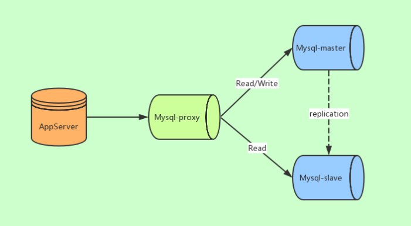

  中间件代理一般介于应用服务器和数据库服务器之间，从图中可以看到，应用服务器并不直接进入到master数据库或者slave数据库，而是进入MySQL proxy代理服务器。代理服务器接收到应用服务器的请求后，先进行判断然后转发到后端master和slave数据库。

目前有很多性能不错的数据库中间件，常用的有MySQL Proxy、MyCat以及Shardingsphere等等。

- MySQL Proxy：是官方提供的MySQL中间件产品可以实现负载平衡、读写分离等。
- MyCat：MyCat是一款基于阿里开源产品Cobar而研发的，基于 Java 语言编写的开源数据库中间件。
- ShardingSphere：ShardingSphere是一套开源的分布式数据库中间件解决方案，它由Sharding-JDBC、Sharding-Proxy和Sharding-Sidecar（计划中）这 3 款相互独立的产品组成。已经在 2020年 4 月 16 日从Apache孵化器毕业，成为Apache顶级项目。
- Atlas：Atlas是由 Qihoo 360公司Web平台部基础架构团队开发维护的一个数据库中间件。
- Amoeba：变形虫，该开源框架于 2008 年开始发布一款 Amoeba for MySQL软件。

# 第 3 节 双主模式

## 3.1 适用场景

很多企业刚开始都是使用MySQL主从模式，一主多从、读写分离等。但是单主如果发生单点故障，从库切换成主库还需要作改动。因此，如果是双主或者多主，就会增加MySQL入口，提升了主库的可用性。因此随着业务的发展，数据库架构可以由主从模式演变为双主模式。双主模式是指两台服务器互为主从，任何一台服务器数据变更，都会通过复制应用到另外一方的数据库中。

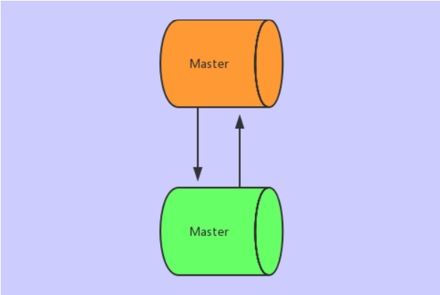

> 使用 **双主双写** 还是 **双主单写** ？

建议大家使用双主单写，因为双主双写存在以下问题：

- ID冲突

  在A主库写入，当A数据未同步到B主库时，对B主库写入，如果采用自动递增容易发生ID主键的冲突。

  可以采用MySQL自身的自动增长步长来解决，例如A的主键为1,3,5,7...，B的主键为2,4,6,8... ，但是对数据库运维、扩展都不友好。

- 更新丢失

  同一条记录在两个主库中进行更新，会发生前面覆盖后面的更新丢失。

高可用架构如下图所示，其中一个Master提供线上服务，另一个Master作为备胎供高可用切换，Master下游挂载Slave承担读请求。

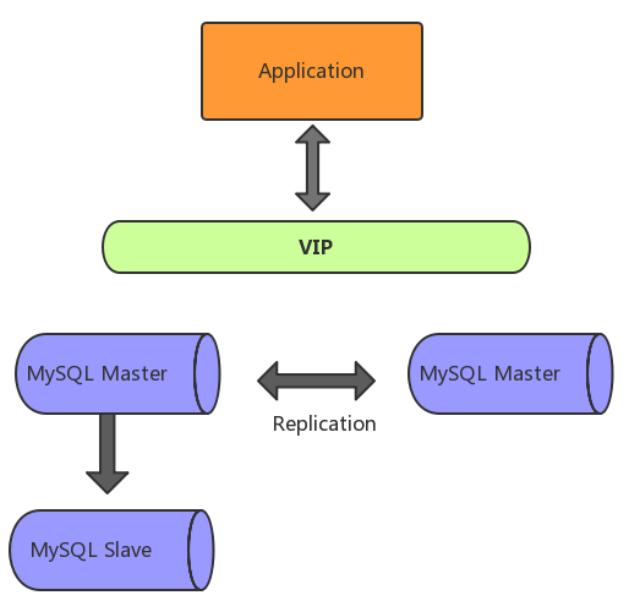

随着业务发展，架构会从主从模式演变为双主模式，建议用双主单写，再引入高可用组件，例如Keepalived和MMM等工具，实现主库故障自动切换。

## 3.2 MMM架构

MMM（Master-Master Replication Manager for MySQL）是一套用来管理和监控双主复制，支持双主故障切换 的第三方软件。MMM 使用Perl语言开发，虽然是双主架构，但是业务上同一时间只允许一个节点进行写入操作。下图是基于MMM实现的双主高可用架构。

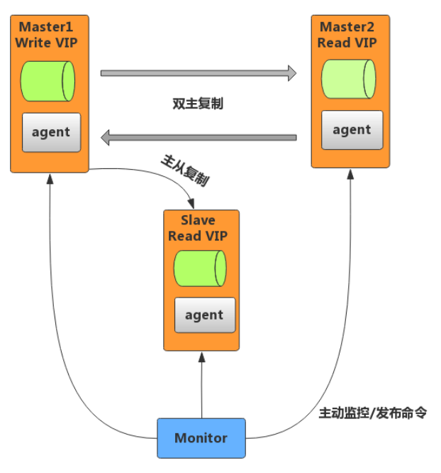

- MMM故障处理机制

  MMM 包含writer和reader两类角色，分别对应写节点和读节点。

  - 当 writer节点出现故障，程序会自动移除该节点上的VIP
  - 写操作切换到 Master2，并将Master2设置为writer
  - 将所有Slave节点会指向Master2

  除了管理双主节点，MMM 也会管理 Slave 节点，在出现宕机、复制延迟或复制错误，MMM 会移除该节点的 VIP，直到节点恢复正常。

- MMM监控机制

  MMM 包含monitor和agent两类程序，功能如下：

  - monitor：监控集群内数据库的状态，在出现异常时发布切换命令，一般和数据库分开部署。
  - agent：运行在每个 MySQL 服务器上的代理进程，monitor 命令的执行者，完成监控的探针工作和具体服务设置，例如设置 VIP（虚拟IP）、指向新同步节点。

## 3.3 MHA架构

MHA（Master High Availability）是一套比较成熟的 MySQL 高可用方案，也是一款优秀的故障切换和主从提升的高可用软件。在MySQL故障切换过程中，MHA能做到在 30 秒之内自动完成数据库的故障切换操作，并且在进行故障切换的过程中，MHA能在最大程度上保证数据的一致性，以达到真正意义上的高可用。MHA还支持在线快速将Master切换到其他主机，通常只需0.5－ 2 秒。

目前MHA主要支持一主多从的架构，要搭建MHA，要求一个复制集群中必须最少有三台数据库服务器。

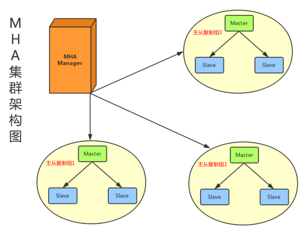

MHA由两部分组成：MHA Manager（管理节点）和MHA Node（数据节点）。

- MHA Manager可以单独部署在一台独立的机器上管理多个master-slave集群，也可以部署在一台slave节点上。负责检测master是否宕机、控制故障转移、检查MySQL复制状况等。
- MHA Node运行在每台MySQL服务器上，不管是Master角色，还是Slave角色，都称为Node，是被监控管理的对象节点，负责保存和复制master的二进制日志、识别差异的中继日志事件并将其差异的事件应用于其他的slave、清除中继日志。

MHA Manager会定时探测集群中的master节点，当master出现故障时，它可以自动将最新数据的slave提升为新的master，然后将所有其他的slave重新指向新的master，整个故障转移过程对应用程序完全透明。

MHA故障处理机制：

- 把宕机master的binlog保存下来
- 根据binlog位置点找到最新的slave
- 用最新slave的relay log修复其它slave
- 将保存下来的binlog在最新的slave上恢复
- 将最新的slave提升为master
- 将其它slave重新指向新提升的master，并开启主从复制

MHA优点：

- 自动故障转移快
- 主库崩溃不存在数据一致性问题
- 性能优秀，支持半同步复制和异步复制
- 一个Manager监控节点可以监控多个集群

## 3.4 主备切换

主备切换是指将备库变为主库，主库变为备库，有 **可靠性优先** 和 **可用性优先** 两种策略。

- 主备延迟问题

  主备延迟是由主从数据同步延迟导致的，与数据同步有关的时间点主要包括以下三个：

  - 主库 A 执行完成一个事务，写入 binlog，我们把这个时刻记为 T1;
  - 之后将binlog传给备库 B，我们把备库 B 接收完 binlog 的时刻记为 T2;
  - 备库 B 执行完成这个binlog复制，我们把这个时刻记为 T3。

  所谓主备延迟，就是同一个事务，在备库执行完成的时间和主库执行完成的时间之间的差值，也就是 T3-T1。

  在备库上执行show slave status命令，它可以返回结果信息，seconds_behind_master表示当前备库延迟了多少秒。

  同步延迟主要原因如下：

  - 备库机器性能问题

    机器性能差，甚至一台机器充当多个主库的备库。

  - 分工问题

    备库提供了读操作，或者执行一些后台分析处理的操作，消耗大量的CPU资源。

  - 大事务操作

    大事务耗费的时间比较长，导致主备复制时间长。比如一些大量数据的delete或大表DDL操作都可能会引发大事务。

- 可靠性优先

  主备切换过程一般由专门的HA高可用组件完成，但是切换过程中会存在短时间不可用，因为在切换过程中某一时刻主库A和从库B都处于只读状态。如下图所示：

  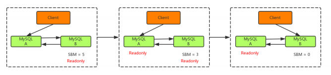

  主库由A切换到B，切换的具体流程如下：

  - 判断从库B的Seconds_Behind_Master值，当小于某个值才继续下一步
  - 把主库A改为只读状态（readonly=true）
  - 等待从库B的Seconds_Behind_Master值降为 0
  - 把从库B改为可读写状态（readonly=false）
  - 把业务请求切换至从库B

- 可用性优先

  不等主从同步完成， 直接把业务请求切换至从库B ，并且让 从库B可读写 ，这样几乎不存在不可用时间，但可能会数据不一致。

  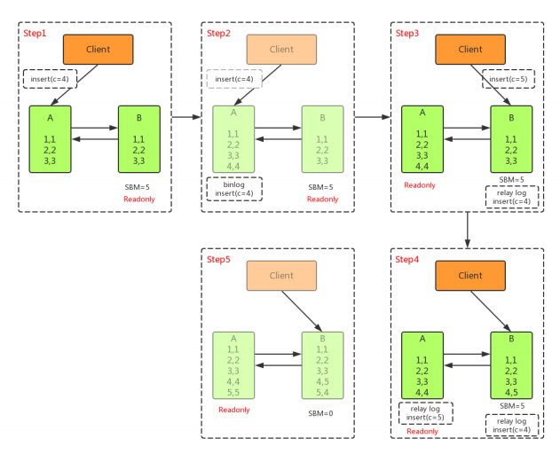

  如上图所示，在A切换到B过程中，执行两个INSERT操作，过程如下：

  - 主库A执行完 INSERT c=4 ，得到 (4,4) ，然后开始执行 主从切换
  - 主从之间有5S的同步延迟，从库B会先执行 INSERT c=5 ，得到 (4,5)
  - 从库B执行主库A传过来的binlog日志 INSERT c=4 ，得到 (5,4)
  - 主库A执行从库B传过来的binlog日志 INSERT c=5 ，得到 (5,5)
  - 此时主库A和从库B会有 两行 不一致的数据

  通过上面介绍了解到，主备切换采用可用性优先策略，由于可能会导致数据不一致，所以大多数情
  况下，优先选择可靠性优先策略。在满足数据可靠性的前提下，MySQL的可用性依赖于同步延时
  的大小，同步延时越小，可用性就越高。

# 第 4 节 分库分表

互联网系统需要处理大量用户的请求。比如微信日活用户破 10 亿，海量的用户每天产生海量的数量；美团外卖，每天都是几千万的订单，那这些系统的用户表、订单表、交易流水表等是如何处理呢？

数据量只增不减，历史数据又必须要留存，非常容易成为性能的瓶颈，而要解决这样的数据库瓶颈问题，“读写分离”和缓存往往都不合适，目前比较普遍的方案就是使用NoSQL/NewSQL或者采用分库分表。

使用分库分表时，主要有垂直拆分和水平拆分两种拆分模式，都属于物理空间的拆分。

分库分表方案：只分库、只分表、分库又分表。

垂直拆分：由于表数量多导致的单个库大。将表拆分到多个库中。

水平拆分：由于表记录多导致的单个库大。将表记录拆分到多个表中。

## 4.1 拆分方式

### 垂直拆分

垂直拆分又称为纵向拆分，垂直拆分是将表按库进行分离，或者修改表结构按照访问的差异将某些列拆分出去。应用时有垂直分库和垂直分表两种方式，一般谈到的垂直拆分主要指的是垂直分库。

如下图所示，采用垂直分库，将用户表和订单表拆分到不同的数据库中。


垂直分表就是将一张表中不常用的字段拆分到另一张表中，从而保证第一张表中的字段较少，避免出现数据库跨页存储的问题，从而提升查询效率。

解决：一个表中字段过多，还有有些字段经常使用，有些字段不经常使用，或者还有text等字段信息。可以考虑使用垂直分表方案。

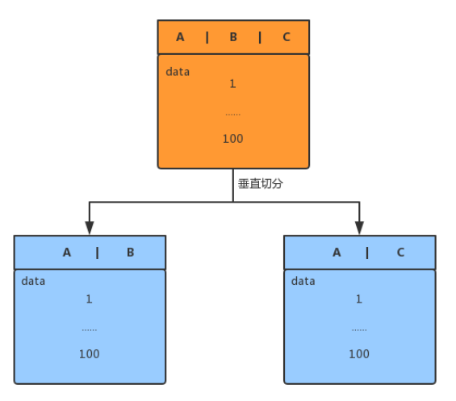

按列进行垂直拆分，即把一条记录分开多个地方保存，每个子表的行数相同。把主键和一些列放到一个表，然后把主键和另外的列放到另一个表中。

**垂直拆分优点 ：**

- 拆分后业务清晰，拆分规则明确；
- 易于数据的维护和扩展；
- 可以使得行数据变小，一个数据块 (Block) 就能存放更多的数据，在查询时就会减少 I/O 次数；
- 可以达到最大化利用 Cache 的目的，具体在垂直拆分的时候可以将不常变的字段放一起，将经常改变的放一起；
- 便于实现冷热分离的数据表设计模式。

**垂直拆分缺点** ：

- 主键出现冗余，需要管理冗余列；
- 会引起表连接 JOIN 操作，可以通过在业务服务器上进行 join 来减少数据库压力，提高了系统的复杂度；
- 依然存在单表数据量过大的问题；
- 事务处理复杂。


### 水平拆分

水平拆分又称为横向拆分。 相对于垂直拆分，它不再将数据根据业务逻辑分类，而是通过某个字段（或某几个字段），根据某种规则将数据分散至多个库或表中，每个表仅包含数据的一部分，如下图所示。

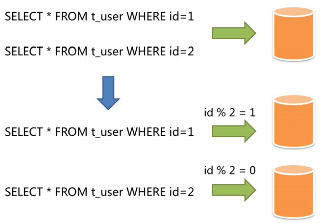

水平分表是将一张含有很多记录数的表水平切分，不同的记录可以分开保存，拆分成几张结构相同的表。如果一张表中的记录数过多，那么会对数据库的读写性能产生较大的影响，虽然此时仍然能够正确地读写，但读写的速度已经到了业务无法忍受的地步，此时就需要使用水平分表来解决这个问题。


### 总结

水平拆分：解决表中记录过多问题。

垂直拆分：解决表过多或者是表字段过多问题。

水平拆分重点考虑拆分规则：例如范围、时间或Hash算法等。

**水平拆分优点 ：**

- 拆分规则设计好，join 操作基本可以数据库做；
- 不存在单库大数据，高并发的性能瓶颈；
- 切分的表的结构相同，应用层改造较少，只需要增加路由规则即可；
- 提高了系统的稳定性和负载能力。

**水平拆分缺点 ：**

- 拆分规则难以抽象；
- 跨库Join性能较差；
- 分片事务的一致性难以解决；
- 数据扩容的难度和维护量极大。

日常工作中，我们通常会同时使用两种拆分方式，垂直拆分更偏向于产品/业务/功能拆分的过程，在技术上我们更关注水平拆分的方案。

## 4.2 主键策略

在很多中小项目中，我们往往直接使用数据库自增特性来生成主键ID，这样确实比较简单。而在分库分表的环境中，数据分布在不同的数据表中，不能再借助数据库自增长特性直接生成，否则会造成不同数据表主键重复。下面介绍几种ID生成算法。

### UUID

UUID是通用唯一识别码（Universally Unique Identifier）的缩写，长度是 16 个字节，被表示为32 个十六进制数字，以“ - ”分隔的五组来显示，格式为8-4-4-4-12，共 36 个字符，例如：`550e8400-e29b-41d4-a716-446655440000`。UUID在生成时使用到了以太网卡地址、纳秒级时间、芯片ID码和随机数等信息，目的是让分布式系统中的所有元素都能有唯一的识别信息。

使用UUID做主键，可以在本地生成，没有网络消耗，所以生成性能高。但是UUID比较长，没有规律性，耗费存储空间。

> All indexes other than the clustered index are known as secondary indexes. In InnoDB,each record in a secondary index contains the primary key columns for the row, as well as the columns specified for the secondary index. InnoDB uses this primary key value to search for the row in the clustered index. If the primary key is long, the secondary indexes use more space, so it is advantageous to have a short primary key.

除聚集索引以外的所有索引都称为辅助索引。在InnoDB中，二级索引中的每条记录都包含行的主键列，以及为二级索引指定的列。InnoDB使用这个主键值来搜索聚集索引中的行。如果主键是长的，则次索引使用更多的空间，因此主键短是有利的。

如果UUID作为数据库主键，在InnoDB引擎下，UUID的无序性可能会引起数据位置频繁变动，影响性能。

#### COMB（UUID变种）

COMB（combine）型是数据库特有的一种设计思想，可以理解为一种改进的GUID，它通过组合GUID和系统时间，以使其在索引和检索事有更优的性能。数据库中没有COMB类型，它是Jimmy Nilsson在他的“The Cost of GUIDs as Primary Keys”一文中设计出来的。
COMB设计思路是这样的：既然UniqueIdentifier数据因毫无规律可言造成索引效率低下，影响了系统的性能，那么我们能不能通过组合的方式，保留UniqueIdentifier的前 10 个字节，用后 6 个字节表示GUID生成的时间（DateTime），这样我们将时间信息与UniqueIdentifier组合起来，在保留UniqueIdentifier的唯一性的同时增加了有序性，以此来提高索引效率。解决UUID无序的问题，性能优于UUID。

#### SNOWFLAKE

有些时候我们希望能使用一种简单一些的ID，并且希望ID能够按照时间有序生成，SnowFlake解决了这种需求。SnowFlake是Twitter开源的分布式ID生成算法，结果是一个long型的ID，long型是 8个字节，64-bit。其核心思想是：使用41bit作为毫秒数，10bit作为机器的ID（ 5 个bit是数据中心， 5 个bit的机器ID），12bit作为毫秒内的流水号，最后还有一个符号位，永远是 0 。如下图所示：

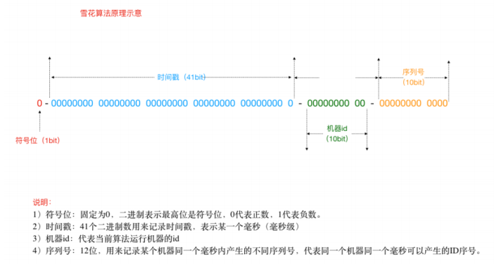


​	SnowFlake生成的ID整体上按照时间自增排序，并且整个分布式系统内不会产生ID重复，并且效率较高。经测试SnowFlake每秒能够产生 26 万个ID。缺点是强依赖机器时钟，如果多台机器环境时钟没同步，或时钟回拨，会导致发号重复或者服务会处于不可用状态。因此一些互联网公司也基于上述的方案做了封装，例如百度的uidgenerator（基于SnowFlake）和美团的leaf（基于数据库和SnowFlake）等。

#### 数据库ID表

比如A表分表为A1表和A2表，我们可以单独的创建一个MySQL数据库，在这个数据库中创建一张表，这张表的ID设置为自动递增，其他地方需要全局唯一ID的时候，就先向这个这张表中模拟插入一条记录，此时ID就会自动递增，然后我们获取刚生成的ID后再进行A1和A2表的插入。例如，下面DISTRIBUTE_ID就是我们创建要负责ID生成的表，结构如下：

```sql
CREATE TABLE DISTRIBUTE_ID (
    id bigint(32) NOT NULL AUTO_INCREMENT COMMENT '主键',
    createtime datetime DEFAULT NULL,
    PRIMARY KEY (id)
) ENGINE=InnoDB DEFAULT CHARSET=utf8;
```

当分布式集群环境中哪个应用需要获取一个全局唯一的分布式ID的时候，就可以使用代码连接这个数据库实例，执行如下SQL语句即可。

```sql
insert into DISTRIBUTE_ID(createtime) values(NOW());
select LAST_INSERT_ID()；
```

注意：

- 这里的createtime字段无实际意义，是为了随便插入一条数据以至于能够自动递增ID。
- 使用独立的MySQL实例生成分布式ID，虽然可行，但是性能和可靠性都不够好，因为你需要代码连接到数据库才能获取到ID，性能无法保障，另外mysql数据库实例挂掉了，那么就无法获取分布式ID了。

### Redis生成ID

当使用数据库来生成ID性能不够要求的时候，我们可以尝试使用Redis来生成ID。这主要依赖于Redis是单线程的，所以也可以用生成全局唯一的ID。可以用Redis的原子操作 INCR和INCRBY来实现。

也可以使用Redis集群来获取更高的吞吐量。假如一个集群中有 5 台Redis。可以初始化每台Redis的值分别是1,2,3,4,5，然后步长都是 5 。各个Redis生成的ID为：

```
A：1,6,11,16,21
B：2,7,12,17,22
C：3,8,13,18,23
D：4,9,14,19,24
E：5,10,15,20,25
```


## 4.3 分片策略

### 4.3.1 分片概念

分片（Sharding）就是用来确定数据在多台存储设备上分布的技术。Shard这个词的意思是“碎片”，如果将一个数据库当作一块大玻璃，将这块玻璃打碎，那么每一小块都称为数据库的碎片（DatabaseSharding）。将一个数据库打碎成多个的过程就叫做分片，分片是属于横向扩展方案。

分片：表示分配过程，是一个逻辑上概念，表示如何实现

分库分表：表示分配结果，是一个物理上概念，表示最终实现的结果

数据库扩展方案：

横向扩展：一个库变多个库，加机器数量

纵向扩展：一个库还是一个库，优化机器性能，加高配CPU或内存

在分布式存储系统中，数据需要分散存储在多台设备上，分片就是把数据库横向扩展到多个数据库服务

器上的一种有效的方式，其主要目的就是为突破单节点数据库服务器的 I/O 能力限制，解决数据库扩展

性问题。

### 4.3.2 分片策略

数据分片是根据指定的分片键和分片策略将数据水平拆分，拆分成多个数据片后分散到多个数据存储节点中。分片键是用于划分和定位表的字段，一般使用ID或者时间字段。而分片策略是指分片的规则，常用规则有以下几种。

#### 基于范围分片

根据特定字段的范围进行拆分，比如用户ID、订单时间、产品价格等。例如：{[1 - 100] => Cluster A, [101 - 199] => Cluster B}

优点：新的数据可以落在新的存储节点上，如果集群扩容，数据无需迁移。

缺点：数据热点分布不均，数据冷热不均匀，导致节点负荷不均。

#### 哈希取模分片

整型的Key可直接对设备数量取模，其他类型的字段可以先计算Key的哈希值，然后再对设备数量取模。假设有n台设备，编号为0 ~ n-1，通过Hash(Key) % n就可以确定数据所在的设备编号。该模式也称为离散分片。

优点：实现简单，数据分配比较均匀，不容易出现冷热不均，负荷不均的情况。

缺点：扩容时会产生大量的数据迁移，比如从n台设备扩容到n+1，绝大部分数据需要重新分配和迁移。

#### 一致性哈希分片

采用Hash取模的方式进行拆分，后期集群扩容需要迁移旧的数据。使用一致性Hash算法能够很大程度的避免这个问题，所以很多中间件的集群分片都会采用一致性Hash算法。一致性Hash是将数据按照特征值映射到一个首尾相接的Hash环上，同时也将节点（按照IP地址或
者机器名Hash）映射到这个环上。对于数据，从数据在环上的位置开始，顺时针找到的第一个节点即为数据的存储节点。Hash环示意图与数据的分布如下：

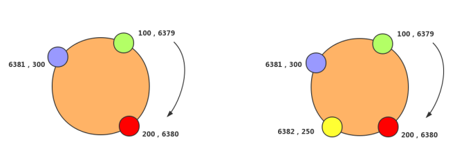

一致性Hash在增加或者删除节点的时候，受到影响的数据是比较有限的，只会影响到Hash环相邻的节点，不会发生大规模的数据迁移。

## 4.4 扩容方案

当系统用户进入了高速增长期时，即便是对数据进行分库分表，但数据库的容量，还有表的数据量也总会达到天花板。当现有数据库达到承受极限时，就需要增加新服务器节点数量进行横向扩容。

首先来思考一下，横向扩展会有什么技术难度？

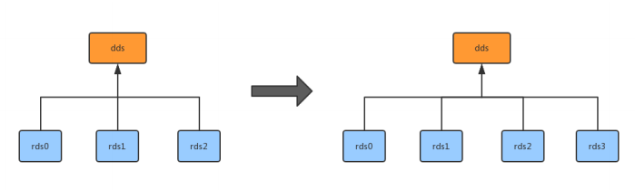

- 数据迁移问题
- 分片规则改变
- 数据同步、时间点、数据一致性

遇到上述问题时，我们可以使用以下两种方案：

### 4.4.1 停机扩容

这是一种很多人初期都会使用的方案，尤其是初期只有几台数据库的时候。停机扩容的具体步骤如下：

- 站点发布一个公告，例如：“为了为广大用户提供更好的服务，本站点将在今晚00:00-2:00之间升级，给您带来不便抱歉"；
- 时间到了，停止所有对外服务；
- 新增n个数据库，然后写一个数据迁移程序，将原有x个库的数据导入到最新的y个库中。比如分片规则由%x变为%y；
- 数据迁移完成，修改数据库服务配置，原来x个库的配置升级为y个库的配置
- 重启服务，连接新库重新对外提供服务

回滚方案：万一数据迁移失败，需要将配置和数据回滚，改天再挂公告。

优点：简单

缺点：

- 停止服务，缺乏高可用
- 程序员压力山大，需要在指定时间完成
- 如果有问题没有及时测试出来启动了服务，运行后发现问题，数据会丢失一部分，难以回滚。

适用场景：

- 小型网站
- 大部分游戏
- 对高可用要求不高的服务

### 4.4.2 平滑扩容

数据库扩容的过程中，如果想要持续对外提供服务，保证服务的可用性，平滑扩容方案是最好的选择。平滑扩容就是将数据库数量扩容成原来的 2 倍，比如：由 2 个数据库扩容到 4 个数据库，具体步骤如下：

- 新增 2 个数据库

- 配置双主进行数据同步（先测试、后上线）

  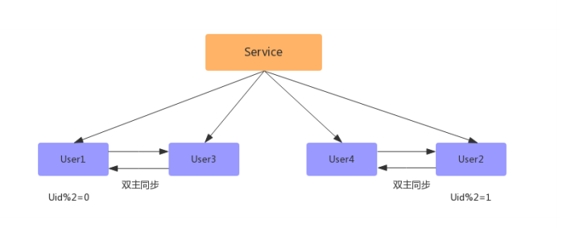

- 数据同步完成之后，配置双主双写（同步因为有延迟，如果时时刻刻都有写和更新操作，会存在不准确问题）

  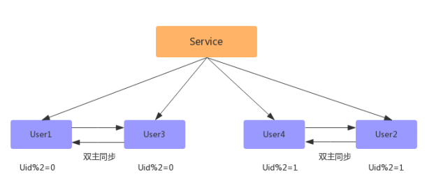

- 数据同步完成后，删除双主同步，修改数据库配置，并重启；

  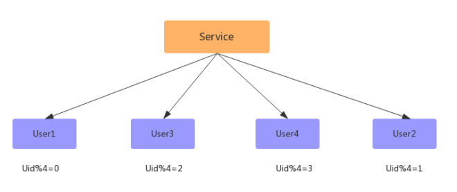

- 此时已经扩容完成，但此时的数据并没有减少，新增的数据库跟旧的数据库一样多的数据，此时还需要写一个程序，清空数据库中多余的数据，如：

  ```
  User1去除 uid % 4 = 2的数据；
  User3去除 uid % 4 = 0的数据；
  User2去除 uid % 4 = 3的数据；
  User4去除 uid % 4 = 1的数据；
  ```

  

平滑扩容方案能够实现n库扩2n库的平滑扩容，增加数据库服务能力，降低单库一半的数据量。其核心原理是：成倍扩容，避免数据迁移。

优点：

- 扩容期间，服务正常进行，保证高可用
- 相对停机扩容，时间长，项目组压力没那么大，出错率低
- 扩容期间遇到问题，随时解决，不怕影响线上服务
- 可以将每个数据库数据量减少一半

缺点：

- 程序复杂、配置双主同步、双主双写、检测数据同步等
- 后期数据库扩容，比如成千上万，代价比较高

适用场景：

- 大型网站
- 对高可用要求高的服务

