[toc]

# 前言 实战背景介绍

## 背景描述

- 刚开始我们的系统只用了 **单机数据库**

- 随着用户的不断增多，考虑到系统的高可用和越来越多的用户请求，我们开始使用数据库 **主从架构**

- 当用户量级和业务进一步提升后，写请求越来越多，这时我们开始使用了 **分库分表**

## 遇到的问题

- 用户请求量太大

  单服务器TPS、内存、IO都是有上限的，需要将请求打散分布到多个服务器

- 单库数据量太大

  单个数据库处理能力有限；单库所在服务器的磁盘空间有限；单库上的操作IO有瓶颈

- 单表数据量太大

  查询、插入、更新操作都会变慢，在加字段、加索引、机器迁移都会产生高负载，影响服务

## 如何解决

### 垂直拆分

> 垂直分库

微服务架构时，业务切割得足够独立，数据也会按照业务切分，保证业务数据隔离，大大提升了数据库的吞吐能力

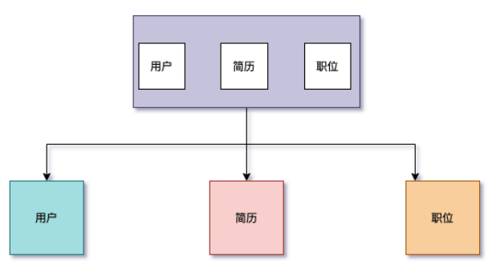

> 垂直分表

表中字段太多且包含大字段的时候，在查询时对数据库的IO、内存会受到影响，同时更新数据时，产生的binlog文件会很大，MySQL在主从同步时也会有延迟的风险

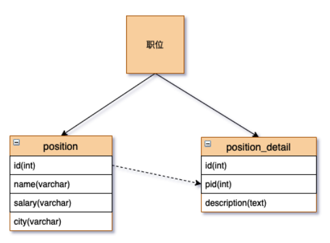

### 水平拆分

> 水平分表

针对数据量巨大的单张表（比如订单表），按照规则把一张表的数据切分到多张表里面去。但是这些表还是在同一个库中，所以库级别的数据库操作还是有IO瓶颈。

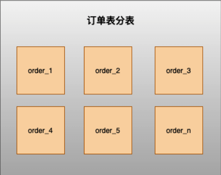

> 水平分库

将单张表的数据切分到多个服务器上去，每个服务器具有相应的库与表，只是表中数据集合不同。 水平分库分表能够有效的缓解单机和单库的性能瓶颈和压力，突破IO、连接数、硬件资源等的瓶颈

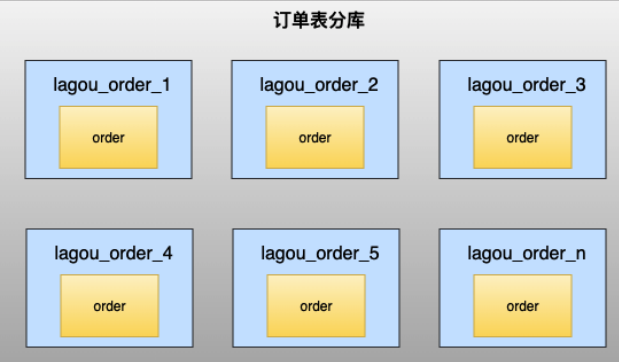

### 水平分库规则

不跨库、不跨表，保证同一类的数据都在同一个服务器上面。

数据在切分之前，需要考虑如何高效的进行数据获取，如果每次查询都要跨越多个节点，就需要谨慎使用。

#### RANGE

- 时间：按照年、月、日去切分。例如order_2020、order_202005、order_
- 地域：按照省或市去切分。例如order_beijing、order_shanghai、order_chengdu
- 大小：从 0 到 1000000 一个表。例如1000001-2000000放一个表，每 100 万放一个表

#### HASH

用户ID取模

不同的业务使用的切分规则是不一样，就上面提到的切分规则，举例如下：

> 站内信

用户维度：用户只能看到发送给自己的消息，其他用户是不可见的，这种情况下是按照用户ID hash分库，在用户查看历史记录翻页查询时，所有的查询请求都在同一个库内

> 用户表

范围法：以用户ID为划分依据，将数据水平切分到两个数据库实例，如： 1 到1000W在一张表，1000W到2000W在一张表，这种情况会出现单表的负载较高

按照用户ID HASH尽量保证用户数据均衡分到数据库中

如果在登录场景下，用户输入手机号和验证码进行登录，这种情况下，登录时是不是需要扫描所有分库的信息？

最终方案：用户信息采用ID做切分处理，同时存储用户ID和手机号的映射的关系表（新增一个关系表），关系表采用手机号进行切分。可以通过关系表根据手机号查询到对应的ID，再定位用户信息。

> 流水表

时间维度：可以根据每天新增的流水来判断，选择按照年份分库，还是按照月份分库，甚至也可以按照日期分库

> 订单表

在拉勾网，求职者（下面统称C端用户）投递企业（下面统称B端用户）的职位产生的记录称之为订单表。在线上的业务场景中，C端用户看自己的投递记录，每次的投递到了哪个状态，B端用户查看自己收到的简历，对于合适的简历会进行下一步沟通，同一个公司内的员工可以协作处理简历。

**如何能同时满足C端和B端对数据查询，不进行跨库处理？**

最终方案：为了同时满足两端用户的业务场景，采用空间换时间，将一次的投递记录存为两份，C端的投递记录以用户ID为分片键，B端收到的简历按照公司ID为分片键

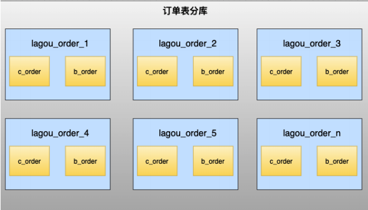

#### 主键选择

UUID：本地生成，不依赖数据库，缺点就是作为主键性能太差

SNOWFLAKE：百度UidGenerator、美团Leaf、基于SNOWFLAKE算法实现

#### 数据一致性

强一致性：XA协议

最终一致性：TCC、saga、Seata

#### 数据库扩容

成倍增加数据节点，实现平滑扩容

成倍扩容以后，表中的部分数据请求已被路由到其他节点上面，可以清理掉

#### 业务层改造

基于代理层方式：Mycat、Sharding-Proxy、MySQL Proxy

基于应用层方式：Sharding-jdbc

#### 分库后面临的问题

事务问题：一次投递需要插入两条记录，且分布在不同的服务器上，数据需要保障一致性。

跨库跨表的join问题

- 全局表（字典表）：基础数据/配置数据，所有库都拷贝一份
- 字段冗余：可以使用字段冗余就不用join查询了
- 系统层组装：可以在业务层分别查询出来，然后组装起来，逻辑较复杂

额外的数据管理负担和数据运算压力：数据库扩容、维护成本变高

# 第 1 节 ShardingSphere实战

## 1.1 ShardingSphere

Apache ShardingSphere是一款开源的分布式数据库中间件组成的生态圈。它由Sharding-JDBC、Sharding-Proxy和Sharding-Sidecar（规划中）这 3 款相互独立的产品组成。 他们均提供标准化的数据分片、分布式事务和数据库治理功能，可适用于如Java同构、异构语言、容器、云原生等各种多样化的应用场景。

ShardingSphere项目状态如下：

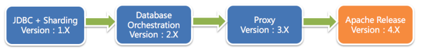


ShardingSphere定位为关系型数据库中间件，旨在充分合理地在分布式的场景下利用关系型数据库的计算和存储能力，而并非实现一个全新的关系型数据库。

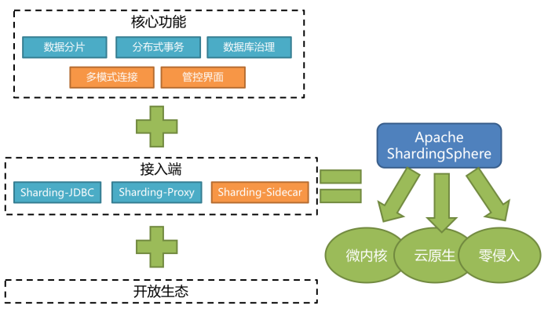


- Sharding-JDBC：被定位为轻量级Java框架，在Java的JDBC层提供的额外服务，以jar包形式使用。
- Sharding-Proxy：被定位为透明化的数据库代理端，提供封装了数据库二进制协议的服务端版本，用于完成对异构语言的支持。
- Sharding-Sidecar：被定位为Kubernetes或Mesos的云原生数据库代理，以DaemonSet的形式代理所有对数据库的访问。

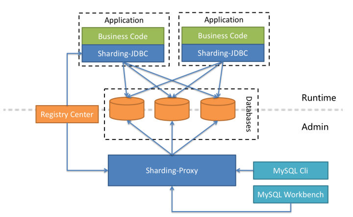

Sharding-JDBC、Sharding-Proxy和Sharding-Sidecar三者区别如下：

|            | Sharding-JDBC | Sharding-Proxy | Sharding-Sidecar |
| ---------- | ------------- | -------------- | ---------------- |
| 数据库     | 任意          | MySQL          | MySQL            |
| 连接消耗数 | 高            | 低             | 高               |
| 异构语言   | 仅Java        | 任意           | 任意             |
| 性能       | 损耗低        | 损耗略高       | 损耗低           |
| 无中心化   | 是            | 否             | 是               |
| 静态入口   | 无            | 无             | 无               |

ShardingSphere安装包下载：https://shardingsphere.apache.org/document/current/cn/downloads/

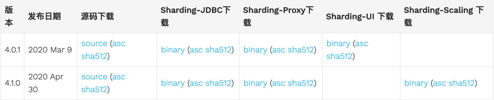

使用Git下载工程：git clone https://github.com/apache/incubator-shardingsphere.git

## 1.2 Sharding-JDBC

Sharding-JDBC定位为轻量级Java框架，在Java的JDBC层提供的额外服务。 它使用客户端直连数据库，以jar包形式提供服务，无需额外部署和依赖，可理解为增强版的JDBC驱动，完全兼容JDBC和各种ORM框架的使用。

- 适用于任何基于Java的ORM框架，如：JPA, Hibernate, Mybatis, Spring JDBC Template或直接使用JDBC。
- 基于任何第三方的数据库连接池，如：DBCP, C3P0, BoneCP, Druid, HikariCP等。
- 支持任意实现JDBC规范的数据库。目前支持MySQL，Oracle，SQLServer和PostgreSQL。


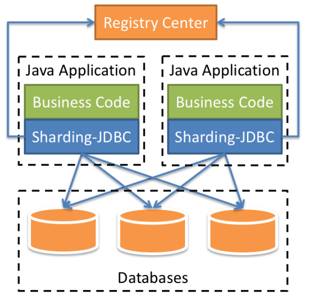

### Sharding-JDBC主要功能 

- 数据分片
  - 分库、分表
  - 读写分离
  - 分片策略
  - 分布式主键
- 分布式事务
  - 标准化的事务接口
  - XA强一致性事务
  - 柔性事务
- 数据库治理
  - 配置动态化
  - 编排和治理
  - 数据脱敏
  - 可视化链路追踪

### Sharding-JDBC 内部结构 

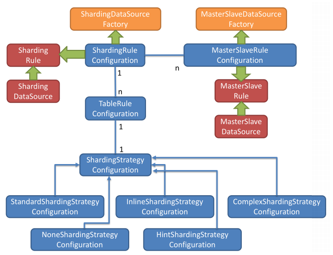

- 图中黄色部分表示的是Sharding-JDBC的入口API，采用工厂方法的形式提供。 目前有
  ShardingDataSourceFactory和MasterSlaveDataSourceFactory两个工厂类。
  - ShardingDataSourceFactory支持分库分表、读写分离操作
  - MasterSlaveDataSourceFactory支持读写分离操作
- 图中蓝色部分表示的是Sharding-JDBC的配置对象，提供灵活多变的配置方式。
  ShardingRuleConfiguration是分库分表配置的核心和入口，它可以包含多个TableRuleConfiguration和MasterSlaveRuleConfiguration。
  - TableRuleConfiguration封装的是表的分片配置信息，有 5 种配置形式对应不同的Configuration类型。
  - MasterSlaveRuleConfiguration封装的是读写分离配置信息。
- 图中红色部分表示的是内部对象，由Sharding-JDBC内部使用，应用开发者无需关注。Sharding-JDBC通过ShardingRuleConfiguration和MasterSlaveRuleConfiguration生成真正供ShardingDataSource和MasterSlaveDataSource使用的规则对象。ShardingDataSource和MasterSlaveDataSource实现了DataSource接口，是JDBC的完整实现方案。

### Sharding-JDBC初始化流程

- 根据配置的信息生成Configuration对象
- 通过Factory会将Configuration对象转化为Rule对象
- 通过Factory会将Rule对象与DataSource对象封装
- Sharding-JDBC使用DataSource进行分库分表和读写分离操作

### Sharding-JDBC 使用过程 

- 引入maven依赖

  ```xml
  <dependency>
      <groupId>org.apache.shardingsphere</groupId>
      <artifactId>sharding-jdbc-core</artifactId>
      <version>${latest.release.version}</version>
  </dependency>
  ```

  注意: 请将${latest.release.version}更改为实际的版本号。

- 规则配置

  Sharding-JDBC可以通过Java，YAML，Spring命名空间和Spring Boot Starter四种方式配置，开发者可根据场景选择适合的配置方式。

- 创建DataSource

  通过ShardingDataSourceFactory工厂和规则配置对象获取ShardingDataSource，然后即可通过
  DataSource选择使用原生JDBC开发，或者使用JPA, MyBatis等ORM工具。

  ```java
  DataSource dataSource = ShardingDataSourceFactory.
      createDataSource(dataSourceMap,shardingRuleConfig, props);
  ```

  

## 1.3 数据分片剖析实战

### 1.3.1 核心概念

#### 表概念

> 真实表

数据库中真实存在的物理表。例如b_order0、b_order

> 逻辑表

在分片之后，同一类表结构的名称（总成）。例如b_order。

> 数据节点

在分片之后，由数据源和数据表组成。例如ds0.b_order

> 绑定表

指的是分片规则一致的关系表（主表、子表），例如b_order和b_order_item，均按照order_id分片，则此两个表互为绑定表关系。绑定表之间的多表关联查询不会出现笛卡尔积关联，可以提升关联查询效率。

```sql
b_order：b_order0、b_order
b_order_item：b_order_item0、b_order_item
select * from b_order o join b_order_item i on(o.order_id=i.order_id)
where o.order_id in (10,11);
```

如果不配置绑定表关系，采用笛卡尔积关联，会生成 4 个SQL

```sql
select * from b_order0 o join b_order_item0 i on(o.order_id=i.order_id)
where o.order_id in (10,11);

select * from b_order0 o join b_order_item1 i on(o.order_id=i.order_id)
where o.order_id in (10,11);

select * from b_order1 o join b_order_item0 i on(o.order_id=i.order_id)
where o.order_id in (10,11);

select * from b_order1 o join b_order_item1 i on(o.order_id=i.order_id)
where o.order_id in (10,11);

```

如果配置绑定表关系，生成 2 个SQL

```sql
select * from b_order0 o join b_order_item0 i on(o.order_id=i.order_id)
where o.order_id in (10,11);

select * from b_order1 o join b_order_item1 i on(o.order_id=i.order_id)
where o.order_id in (10,11);
```


> 广播表

在使用中，有些表没必要做分片，例如字典表、省份信息等，因为他们数据量不大，而且这种表可能需要与海量数据的表进行关联查询。广播表会在不同的数据节点上进行存储，存储的表结构和数据完全相同。

#### 分片算法（ShardingAlgorithm）

由于分片算法和业务实现紧密相关，因此并未提供内置分片算法，而是通过分片策略将各种场景提炼出来，提供更高层级的抽象，并提供接口让应用开发者自行实现分片算法。目前提供 4 种分片算法。

- 精确分片算法PreciseShardingAlgorithm

  用于处理使用单一键作为分片键的=与IN进行分片的场景。

- 范围分片算法RangeShardingAlgorithm

  用于处理使用单一键作为分片键的BETWEEN AND、>、<、>=、<=进行分片的场景。

- 复合分片算法ComplexKeysShardingAlgorithm

  用于处理使用多键作为分片键进行分片的场景，多个分片键的逻辑较复杂，需要应用开发者自行处理其中的复杂度。

- Hint分片算法HintShardingAlgorithm

  用于处理使用Hint行分片的场景。对于分片字段非SQL决定，而由其他外置条件决定的场景，可使用SQL Hint灵活的注入分片字段。例：内部系统，按照员工登录主键分库，而数据库中并无此字段。SQL Hint支持通过Java API和SQL注释两种方式使用。

#### 分片策略（ShardingStrategy）

分片策略包含分片键和分片算法，真正可用于分片操作的是分片键 + 分片算法，也就是分片策略。目前提供 5 种分片策略。

- 标准分片策略StandardShardingStrategy

  只支持单分片键，提供对SQL语句中的=, >, <, >=, <=, IN和BETWEEN AND的分片操作支持。提供PreciseShardingAlgorithm和RangeShardingAlgorithm两个分片算法。

  PreciseShardingAlgorithm是必选的，RangeShardingAlgorithm是可选的。但是SQL中使用了范围操作，如果不配置RangeShardingAlgorithm会采用全库路由扫描，效率低。

- 复合分片策略ComplexShardingStrategy

  支持多分片键。提供对SQL语句中的=, >, <, >=, <=, IN和BETWEEN AND的分片操作支持。由于多分片键之间的关系复杂，因此并未进行过多的封装，而是直接将分片键值组合以及分片操作符透传至分片算法，完全由应用开发者实现，提供最大的灵活度。

- 行表达式分片策略InlineShardingStrategy

  只支持单分片键。使用Groovy的表达式，提供对SQL语句中的=和IN的分片操作支持，对于简单的分片算法，可以通过简单的配置使用，从而避免繁琐的Java代码开发。如: t_user_$->{u_id % 8} 表示t_user表根据u_id模 8 ，而分成 8 张表，表名称为t_user_0到t_user_7。

- Hint分片策略HintShardingStrategy

  通过Hint指定分片值而非从SQL中提取分片值的方式进行分片的策略。

- 不分片策略NoneShardingStrategy

  不分片的策略。

#### 分片策略配置

对于分片策略存有数据源分片策略和表分片策略两种维度，两种策略的API完全相同。

> 数据源分片策略

用于配置数据被分配的目标数据源。

> 表分片策略

用于配置数据被分配的目标表，由于表存在与数据源内，所以表分片策略是依赖数据源分片策略结果的。

### 1.3.2 流程剖析

ShardingSphere 3个产品的数据分片功能主要流程是完全一致的，如下图所示。


> SQL解析

SQL解析分为词法解析和语法解析。 先通过词法解析器将SQL拆分为一个个不可再分的单词。再使用语法解析器对SQL进行理解，并最终提炼出解析上下文。

Sharding-JDBC采用不同的解析器对SQL进行解析，解析器类型如下：

- MySQL解析器
- Oracle解析器
- SQLServer解析器
- PostgreSQL解析器
- 默认SQL解析器

> 查询优化

负责合并和优化分片条件，如OR等。

> SQL路由

根据解析上下文匹配用户配置的分片策略，并生成路由路径。目前支持分片路由和广播路由。

> SQL改写

将SQL改写为在真实数据库中可以正确执行的语句。SQL改写分为正确性改写和优化改写。

> SQL执行

通过多线程执行器异步执行SQL。

> 结果归并

将多个执行结果集归并以便于通过统一的JDBC接口输出。结果归并包括流式归并、内存归并和使用装饰者模式的追加归并这几种方式。

### **1.3.3 SQL使用规范**

#### SQL使用规范

> 支持项

- 路由至单数据节点时，目前MySQL数据库100%全兼容，其他数据库完善中。

- 路由至多数据节点时，全面支持DQL、DML、DDL、DCL、TCL。支持分页、去重、排序、分组、聚合、关联查询（不支持跨库关联）。以下用最为复杂的查询为例：

  ```sql
  SELECT select_expr [, select_expr ...]
  FROM table_reference [, table_reference ...]
  	[WHERE predicates]
  [GROUP BY {col_name | position} [ASC | DESC], ...]
  	[ORDER BY {col_name | position} [ASC | DESC], ...]
  	[LIMIT {[offset,] row_count | row_count OFFSET offset}]
  ```

  

> 不支持项（路由至多数据节点）

不支持CASE WHEN、HAVING、UNION (ALL)

> 支持分页子查询，但其他子查询有限支持，无论嵌套多少层，只能解析至第一个包含数据表的子查询，一旦在下层嵌套中再次找到包含数据表的子查询将直接抛出解析异常。

例如，以下子查询可以支持：

```sql
SELECT COUNT(*) FROM (SELECT * FROM b_order o)
```

以下子查询不支持：

```sql
SELECT 
	COUNT(*) 
FROM (
    SELECT * FROM b_order o 
    WHERE o.id IN (SELECT id FROM b_order WHERE status = ?)                  
)
```

简单来说，通过子查询进行非功能需求，在大部分情况下是可以支持的。比如分页、统计总数等；而通过子查询实现业务查询当前并不能支持。

> 由于归并的限制，子查询中包含聚合函数目前无法支持。

> 不支持包含schema的SQL。因为ShardingSphere的理念是像使用一个数据源一样使用多数据源，因此对SQL的访问都是在同一个逻辑schema之上。

> 当分片键处于运算表达式或函数中的SQL时，将采用全路由的形式获取结果。

例如下面SQL，create_time为分片键：

```sql
SELECT * FROM b_order WHERE to_date(create_time, 'yyyy-mm-dd') = '2020-05-05';
```

由于ShardingSphere只能通过SQL字面提取用于分片的值，因此当分片键处于运算表达式或函数中时，ShardingSphere无法提前获取分片键位于数据库中的值，从而无法计算出真正的分片值。

**不支持的SQL示例：**

```sql
#VALUES语句不支持运算表达式
INSERT INTO tbl_name (col1, col2, ...) VALUES(1+2, ?, ...) 

#INSERT .. SELECT
INSERT INTO tbl_name (col1, col2, ...) SELECT col1, col2, ... FROM tbl_name WHERE col3 =? 

#HAVING
SELECT COUNT(col1) as count_alias FROM tbl_name GROUP BY col1 HAVING count_alias >? 

#UNION
SELECT * FROM tbl_name1 UNION SELECT * FROM tbl_name2 

#UNION ALL
SELECT * FROM tbl_name1 UNION ALL SELECT * FROM tbl_name2 

#包含schema
SELECT * FROM ds.tbl_name1 

#同时使用普通聚合函数和DISTINCT
SELECT SUM(DISTINCT col1), SUM(col1) FROM tbl_name 

#会导致全路由
SELECT * FROM tbl_name WHERE to_date(create_time, ‘yyyy-mm-dd’) =? 
```


#### 分页查询

完全支持MySQL和Oracle的分页查询，SQLServer由于分页查询较为复杂，仅部分支持.

> 性能瓶颈：

查询偏移量过大的分页会导致数据库获取数据性能低下，以MySQL为例：

```sql
SELECT * FROM b_order ORDER BY id LIMIT 1000000, 10
```

这句SQL会使得MySQL在无法利用索引的情况下跳过 1000000 条记录后，再获取 10 条记录，其性能可想而知。 而在分库分表的情况下（假设分为 2 个库），为了保证数据的正确性，SQL会改写为：

```sql
SELECT * FROM b_order ORDER BY id LIMIT 0, 1000010
```

即将偏移量前的记录全部取出，并仅获取排序后的最后 10 条记录。这会在数据库本身就执行很慢的情况下，进一步加剧性能瓶颈。 因为原SQL仅需要传输 10 条记录至客户端，而改写之后的SQL则会传输1,000,010 * 2的记录至客户端。

> ShardingSphere的优化：

ShardingSphere进行了以下 2 个方面的优化。

- 首先，采用流式处理 + 归并排序的方式来避免内存的过量占用。
- 其次，ShardingSphere对仅落至单节点的查询进行进一步优化。

> 分页方案优化：

由于LIMIT并不能通过索引查询数据，因此如果可以保证ID的连续性，通过ID进行分页是比较好的解决方案：

```sql
SELECT * FROM b_order WHERE id > 1000000 AND id <= 1000010 ORDER BY id
```

或通过记录上次查询结果的最后一条记录的ID进行下一页的查询：

```sql
SELECT * FROM b_order WHERE id > 1000000 LIMIT 10
```


### 1.3.4 其他功能

#### Inline行表达式

InlineShardingStrategy：采用Inline行表达式进行分片的配置。

Inline是可以简化数据节点和分片算法配置信息。主要是解决配置简化、配置一体化。

> **语法格式**

行表达式的使用非常直观，只需要在配置中使用${ expression }或$->{ expression }标识行表达式即可。例如：

```sql
${begin..end} 表示范围区间
${[unit1, unit2, unit_x]} 表示枚举值
```

行表达式中如果出现多个${}或$->{}表达式，整个表达式结果会将每个子表达式结果进行笛卡尔(积)组合。例如，以下行表达式：

```sql
${['online', 'offline']}_table${1..3}
$->{['online', 'offline']}_table$->{1..3}
```

最终会解析为：

```sql
online_table1, online_table2, online_table3,
offline_table1, offline_table2, offline_table
```

> **数据节点配置**

对于均匀分布的数据节点，如果数据结构如下：

```sql
db0
 ├── b_order2
   └── b_order1
db1
 ├── b_order2
   └── b_order1
```

用行表达式可以简化为：

```sql
db${0..1}.b_order${1..2}
或者
db$->{0..1}.b_order$->{1..2}
```

对于自定义的数据节点，如果数据结构如下：

```
db
  ├── b_order
  └── b_order
db
  ├── b_order
  ├── b_order
  └── b_order
```

用行表达式可以简化为：

```sql
db0.b_order${0..1},db1.b_order${2..4}
```

> **分片算法配置**

行表达式内部的表达式本质上是一段Groovy代码，可以根据分片键进行计算的方式，返回相应的真实数据源或真实表名称。

```sql
ds${id % 10}
或者
ds$->{id % 10}
```

结果为：ds0、ds1、ds2... ds

#### 分布式主键

ShardingSphere不仅提供了内置的分布式主键生成器，例如UUID、SNOWFLAKE，还抽离出分布式主键生成器的接口，方便用户自行实现自定义的自增主键生成器。

> 内置主键生成器：

- UUID

  采用UUID.randomUUID()的方式产生分布式主键。

- SNOWFLAKE

  在分片规则配置模块可配置每个表的主键生成策略，默认使用雪花算法，生成64bit的长整型数据。

> 自定义主键生成器：

- 自定义主键类，实现ShardingKeyGenerator接口

- 按SPI规范配置自定义主键类

  在Apache ShardingSphere中，很多功能实现类的加载方式是通过SPI注入的方式完成的。

  注意：在resources目录下新建META-INF文件夹，再新建services文件夹，然后新建文件的名字为org.apache.shardingsphere.spi.keygen.ShardingKeyGenerator，打开文件，复制自定义主键类全路径到文件中保存。

- 自定义主键类应用配置

  ```properties
  #对应主键字段名
  spring.shardingsphere.sharding.tables.t_book.key-generator.column=id
  #对应主键类getType返回内容
  spring.shardingsphere.sharding.tables.t_book.key-generator.type=LAGOUKEY
  ```

  

## 1.4 读写分离剖析实战

读写分离是通过主从的配置方式，将查询请求均匀的分散到多个数据副本，进一步的提升系统的处理能力。


主从架构：读写分离，目的是高可用、读写扩展。主从库内容相同，根据SQL语义进行路由。

分库分表架构：数据分片，目的读写扩展、存储扩容。库和表内容不同，根据分片配置进行路由。

将水平分片和读写分离联合使用，能够更加有效的提升系统性能， 下图展现了将分库分表与读写分离一同使用时，应用程序与数据库集群之间的复杂拓扑关系。

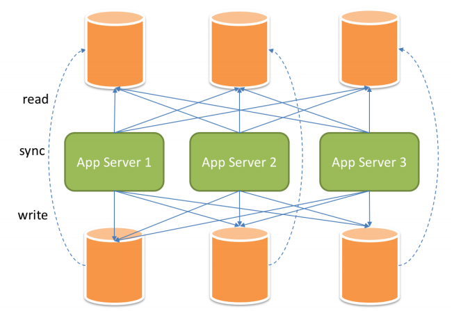


读写分离虽然可以提升系统的吞吐量和可用性，但同时也带来了数据不一致的问题，包括多个主库之间的数据一致性，以及主库与从库之间的数据一致性的问题。 并且，读写分离也带来了与数据分片同样的问题，它同样会使得应用开发和运维人员对数据库的操作和运维变得更加复杂。

### 1.4.1 读写分离应用方案

在数据量不是很多的情况下，我们可以将数据库进行读写分离，以应对高并发的需求，通过水平扩展从库，来缓解查询的压力。如下：

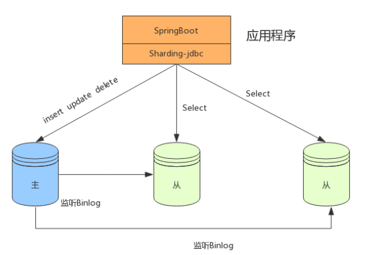

### 1.4.2 分表+读写分离

在数据量达到 500 万的时候，这时数据量预估千万级别，我们可以将数据进行分表存储。

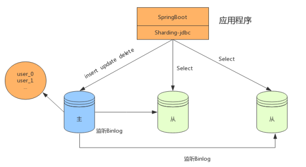

### 1.4.3 分库分表+读写分离

在数据量继续扩大，这时可以考虑分库分表，将数据存储在不同数据库的不同表中，如下：

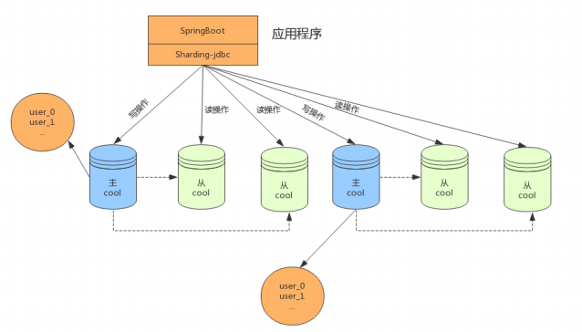


**透明化读写分离所带来的影响，让使用方尽量像使用一个数据库一样使用主从数据库集群，ShardingSphere读写分离模块的主要设计目标。**

主库、从库、主从同步、负载均衡

- 核心功能
  - 提供一主多从的读写分离配置。仅支持单主库，可以支持独立使用，也可以配合分库分表使用
  - 独立使用读写分离，支持SQL透传。不需要SQL改写流程
  - 同一线程且同一数据库连接内，能保证数据一致性。如果有写入操作，后续的读操作均从主库读取。
  - 基于Hint的强制主库路由。可以强制路由走主库查询实时数据，避免主从同步数据延迟。
- 不支持项
  - 主库和从库的数据同步
  - 主库和从库的数据同步延迟
  - 主库双写或多写
  - 跨主库和从库之间的事务的数据不一致。建议在主从架构中，事务中的读写均用主库操作。

## 1.5 强制路由剖析实战

在一些应用场景中，分片条件并不存在于SQL，而存在于外部业务逻辑。因此需要提供一种通过在外部业务代码中指定路由配置的一种方式，在ShardingSphere中叫做Hint。如果使用Hint指定了强制分片路由，那么SQL将会无视原有的分片逻辑，直接路由至指定的数据节点操作。

HintManager主要使用ThreadLocal管理分片键信息，进行hint强制路由。在代码中向HintManager添加的配置信息只能在当前线程内有效。

**Hint使用场景：**

- 数据分片操作，如果分片键没有在SQL或数据表中，而是在业务逻辑代码中
- 读写分离操作，如果强制在主库进行某些数据操作

**Hint使用过程：**

- 编写分库或分表路由策略，实现HintShardingAlgorithm接口

  ```java
  public class MyHintShardingAlgorithm implements
      HintShardingAlgorithm<Integer> {
      @Override
      public Collection<String> doSharding(
          	Collection<String> collection,
          	HintShardingValue<Integer> hintShardingValue) {
          //添加分库或分表路由逻辑
      }
  }
  ```

- 在配置文件指定分库或分表策略

  ```properties
  #强制路由库和表
  spring.shardingsphere.sharding.tables.b_order.database-
  strategy.hint.algorithm-class-name=com.lagou.hint.MyHintShardingAlgorithm
  spring.shardingsphere.sharding.tables.b_order.table-strategy.hint.algorithm-class-name=com.lagou.hint.MyHintShardingAlgorithm
  spring.shardingsphere.sharding.tables.b_order.actual-data-nodes=ds$->{0..1}.b_order$->{0..1}
  ```

  

- 在代码执行查询前使用HintManager指定执行策略值

  ```java
  @Test//路由库和表
  public void test(){
      HintManager hintManager = HintManager.getInstance();
      hintManager.addDatabaseShardingValue("b_order", 1 );
      hintManager.addTableShardingValue("b_order", 1 );
      List<Order> list = orderRepository.findAll();
      hintManager.close();
      list.forEach(o -> {
          System.out.println(o.getOrderId()+" "+o.getUserId()+""+o.getOrderPrice());
      });
  }
  ```

  

  在读写分离结构中，为了避免主从同步数据延迟及时获取刚添加或更新的数据，可以采用强制路由走主库查询实时数据，使用hintManager.setMasterRouteOnly设置主库路由即可。

## 1.6 数据脱敏剖析实战

数据脱敏是指对某些敏感信息通过脱敏规则进行数据的变形，实现敏感隐私数据的可靠保护。涉及客户安全数据或者一些商业性敏感数据，如身份证号、手机号、卡号、客户号等个人信息按照规定，都需要进行数据脱敏。

数据脱敏模块属于ShardingSphere分布式治理这一核心功能下的子功能模块。

- 在更新操作时，它通过对用户输入的SQL进行解析，并依据用户提供的脱敏配置对SQL进行改写，从而实现对原文数据进行加密，并将密文数据存储到底层数据库。
- 在查询数据时，它又从数据库中取出密文数据，并对其解密，最终将解密后的原始数据返回给用户。

**Apache ShardingSphere自动化&透明化了数据脱敏过程，让用户无需关注数据脱敏的实现细节，像使用普通数据那样使用脱敏数据。**

### 1.6.1 整体架构

ShardingSphere提供的Encrypt-JDBC和业务代码部署在一起。业务方需面向Encrypt-JDBC进行JDBC编程。

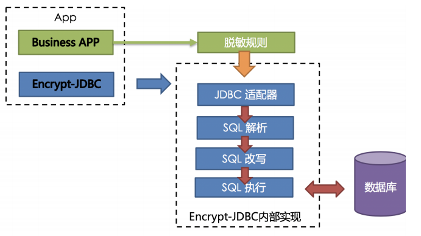

Encrypt-JDBC将用户发起的SQL进行拦截，并通过SQL语法解析器进行解析、理解SQL行为，再依据用户传入的脱敏规则，找出需要脱敏的字段和所使用的加解密器对目标字段进行加解密处理后，再与底层数据库进行交互。

### 1.6.2 脱敏规则

脱敏配置主要分为四部分：数据源配置，加密器配置，脱敏表配置以及查询属性配置，其详情如下图所示：

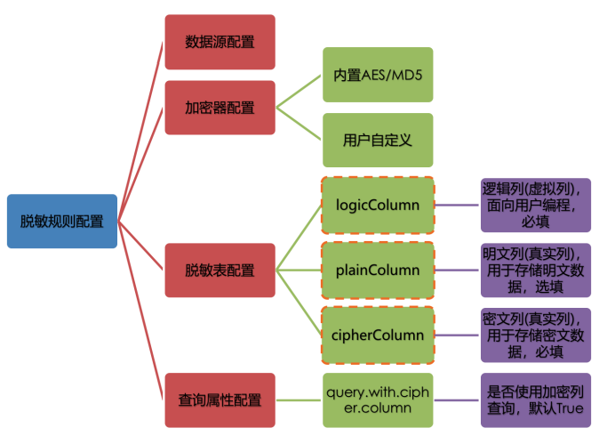

- 数据源配置：指DataSource的配置信息
- 加密器配置：指使用什么加密策略进行加解密。目前ShardingSphere内置了两种加解密策略：AES/MD5
- 脱敏表配置：指定哪个列用于存储密文数据（cipherColumn）、哪个列用于存储明文数据
  （plainColumn）以及用户想使用哪个列进行SQL编写（logicColumn）
- 查询属性的配置：当底层数据库表里同时存储了明文数据、密文数据后，该属性开关用于决定是直接查询数据库表里的明文数据进行返回，还是查询密文数据通过Encrypt-JDBC解密后返回。

### 1.6.3 脱敏处理流程

下图可以看出ShardingSphere将逻辑列与明文列和密文列进行了列名映射。

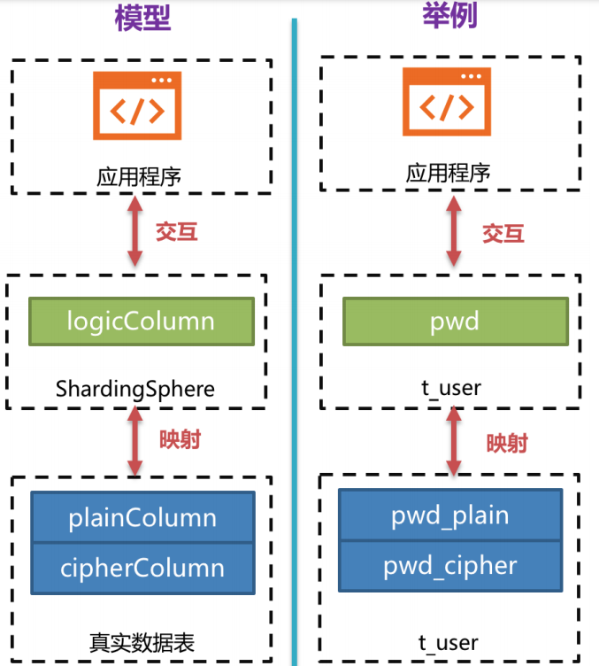

下方图片展示了使用Encrypt-JDBC进行增删改查时，其中的处理流程和转换逻辑，如下图所示。

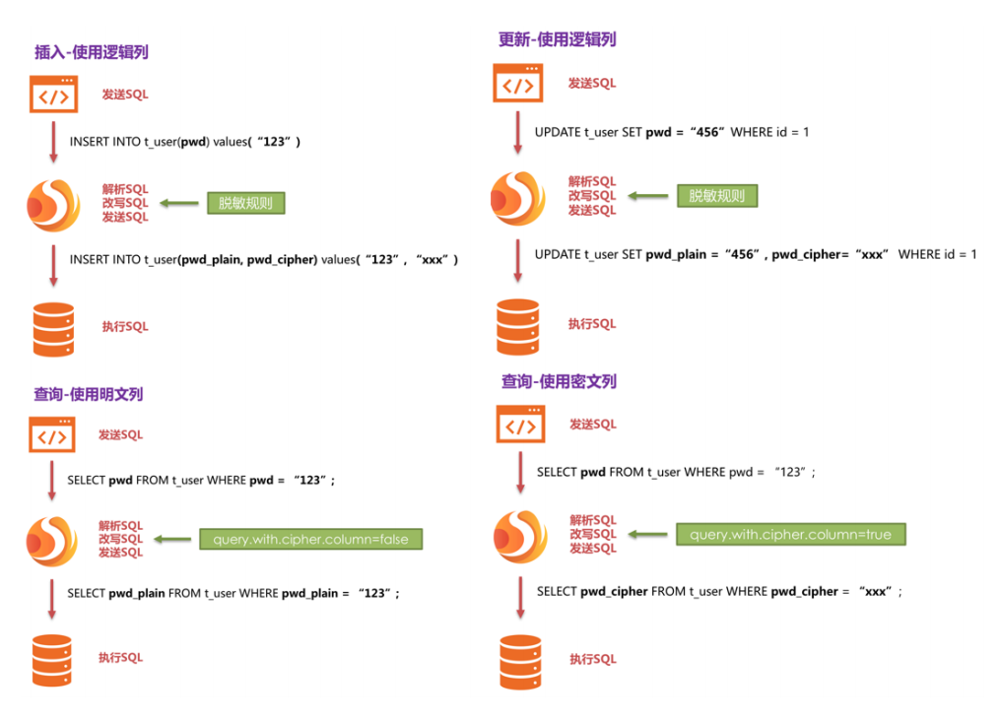

### 1.6.4 加密策略解析

ShardingSphere提供了两种加密策略用于数据脱敏，该两种策略分别对应ShardingSphere的两种加解密的接口，即Encryptor和QueryAssistedEncryptor。

> Encryptor

该解决方案通过提供encrypt(), decrypt()两种方法对需要脱敏的数据进行加解密。在用户进行INSERT, DELETE, UPDATE时，ShardingSphere会按照用户配置，对SQL进行解析、改写、路由，并会调用encrypt()将数据加密后存储到数据库, 而在SELECT时，则调用decrypt()方法将从数据库中取出的脱敏数据进行逆向解密，最终将原始数据返回给用户。

当前，ShardingSphere针对这种类型的脱敏解决方案提供了两种具体实现类，分别是MD5(不可逆)，AES(可逆)，用户只需配置即可使用这两种内置的方案。

> QueryAssistedEncryptor

相比较于第一种脱敏方案，该方案更为安全和复杂。它的理念是：即使是相同的数据，如两个用户的密码相同，它们在数据库里存储的脱敏数据也应当是不一样的。这种理念更有利于保护用户信息，防止撞库成功。

它提供三种函数进行实现，分别是encrypt(), decrypt(), queryAssistedEncrypt()。在encrypt()阶段，用户通过设置某个变动种子，例如时间戳。针对原始数据+变动种子组合的内容进行加密，就能保证即使原始数据相同，也因为有变动种子的存在，致使加密后的脱敏数据是不一样的。在decrypt()可依据之前规定的加密算法，利用种子数据进行解密。queryAssistedEncrypt()用于生成辅助查询列，用于原始数据的查询过程。

当前，ShardingSphere针对这种类型的脱敏解决方案并没有提供具体实现类，却将该理念抽象成接口，提供给用户自行实现。ShardingSphere将调用用户提供的该方案的具体实现类进行数据脱敏。

## 1.7 分布式事务剖析实战

### 1.7.1 分布式事务理论

> CAP（强一致性）

CAP 定理，又被叫作布鲁尔定理。对于共享数据系统，最多只能同时拥有CAP其中的两个，任意两个都有其适应的场景。

| 选项                     | 描述                                                         |
| ------------------------ | ------------------------------------------------------------ |
| C（Consistence）         | **一致性**，分布式环境中，数据在多个副本之间能够保持一致的特性（严格的一致性）。在一致性的需求下，当一个系统在数据一致的状态下执行更新操作后，应该保证系统的数据仍然处在一致的状态 |
| A（Availability）        | **可用性**，指系统提供的服务必须一直处于可用的状态，每次请求都能够获取到非错的响应-----但不保证获取的数据为最新的数据 |
| P（partition tolerance） | **分区容忍性**，分布式系统在遇到任何网络分区故障的时候，仍然能够对外提供满足一致性和可用性的服务，除非整个网络环境都发生了故障 |


> BASE（最终一致性）

BASE 是指基本可用（Basically Available）、软状态（ Soft State）、最终一致性（ Eventual Consistency）。它的核心思想是即使无法做到强一致性（CAP 就是强一致性），但应用可以采用适合的方式达到最终一致性。

- BA指的是基本业务可用性，支持分区失败；
- S表示柔性状态，也就是允许短时间内不同步；
- E表示最终一致性，数据最终是一致的，但是实时是不一致的。

原子性和持久性必须从根本上保障，为了可用性、性能和服务降级的需要，只有降低一致性和隔离性的要求。BASE 解决了 CAP 理论中没有考虑到的网络延迟问题，在BASE中用软状态和最终一致，保证了延迟后的一致性。

### 1.7.2 分布式事务模式

了解了分布式事务中的强一致性和最终一致性理论，下面介绍几种常见的分布式事务的解决方案。

#### 2PC模式（强一致性）

2PC是Two-Phase Commit缩写，即两阶段提交，就是将事务的提交过程分为两个阶段来进行处理。事务的发起者称协调者，事务的执行者称参与者。协调者统一协调参与者执行。

- 阶段 1 ：准备阶段

  协调者向所有参与者发送事务内容，询问是否可以提交事务，并等待所有参与者答复。各参与者执行事务操作，但不提交事务，将 undo 和 redo 信息记入事务日志中。如参与者执行成功，给协调者反馈 yes；如执行失败，给协调者反馈 no。

- 阶段 2 ：提交阶段

  如果协调者收到了参与者的失败消息或者超时，直接给每个参与者发送回滚(rollback)消息；否则，发送提交(commit)消息。

2PC 方案实现起来简单，实际项目中使用比较少，主要因为以下问题：

- 性能问题：所有参与者在事务提交阶段处于同步阻塞状态，占用系统资源，容易导致性能瓶颈。
- 可靠性问题：如果协调者存在单点故障问题，如果协调者出现故障，参与者将一直处于锁定状态。
- 数据一致性问题：在阶段 2 中，如果发生局部网络问题，一部分事务参与者收到了提交消息，另一部分事务参与者没收到提交消息，那么就导致了节点之间数据的不一致。

#### 3PC模式（强一致性）

3PC 三阶段提交，是两阶段提交的改进版本，与两阶段提交不同的是，引入超时机制。同时在协调者和参与者中都引入超时机制。三阶段提交将两阶段的准备阶段拆分为 2 个阶段，插入了一个preCommit 阶段，解决了原先在两阶段提交中，参与者在准备之后，由于协调者或参与者发生崩溃或错误，而导致参与者无法知晓处于长时间等待的问题。如果在指定的时间内协调者没有收到参与者的消息则默认失败。

- 阶段 1 ：canCommit

  协调者向参与者发送 commit 请求，参与者如果可以提交就返回 yes 响应，否则返回 no 响应。

- 阶段 2 ：preCommit

  - 协调者根据阶段 1 canCommit 参与者的反应情况执行预提交事务或中断事务操作。参与者均反馈 yes：协调者向所有参与者发出 preCommit 请求，参与者收到preCommit 请求后，执行事务操作，但不提交；将 undo 和 redo 信息记入事务日志中；各参与者向协调者反馈 ack 响应或 no 响应，并等待最终指令。
  - 任何一个参与者反馈 no或等待超时：协调者向所有参与者发出 abort 请求，无论收到协调者发出的 abort 请求，或者在等待协调者请求过程中出现超时，参与者均会中断事务。

- 阶段 3 ：do Commit

  该阶段进行真正的事务提交，根据阶段 2 preCommit反馈的结果完成事务提交或中断操作。

相比2PC模式，3PC模式降低了阻塞范围，在等待超时后协调者或参与者会中断事务。避免了协调者单点问题，阶段 3 中协调者出现问题时（比如网络中断等），参与者会继续提交事务。

#### XA（强一致性）

XA是由X/Open组织提出的分布式事务的规范，是基于两阶段提交协议。 XA规范主要定义了全局事务管理器（TM）和局部资源管理器（RM）之间的接口。目前主流的关系型数据库产品都是实现了XA接口。

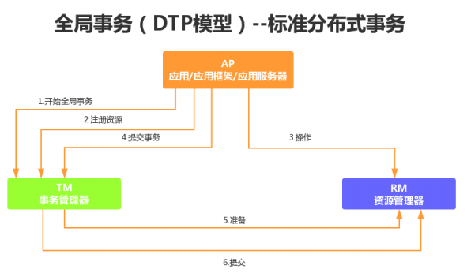


XA之所以需要引入事务管理器，是因为在分布式系统中，从理论上讲两台机器理论上无法达到一致的状态，需要引入一个单点进行协调。由全局事务管理器管理和协调的事务，可以跨越多个资源（数据库）和进程。

事务管理器用来保证所有的事务参与者都完成了准备工作(第一阶段)。如果事务管理器收到所有参与者都准备好的消息，就会通知所有的事务都可以提交了（第二阶段）。MySQL 在这个XA事务中扮演的是参与者的角色，而不是事务管理器。

#### TCC模式（最终一致性）

TCC（Try-Confirm-Cancel）的概念，最早是由 Pat Helland 于 2007 年发表的一篇名为《Life beyond Distributed Transactions:an Apostate’s Opinion》的论文提出。TCC 是服务化的两阶段编程模型，其 Try、Confirm、Cancel 3 个方法均由业务编码实现：

- Try 操作作为一阶段，负责资源的检查和预留；

- Confirm 操作作为二阶段提交操作，执行真正的业务；

- Cancel 是预留资源的取消；

TCC事务模式相对于 XA 等传统模型如下图所示：


TCC 模式相比于 XA，解决了如下几个缺点：

- 解决了协调者单点，由主业务方发起并完成这个业务活动。业务活动管理器可以变成多点，引入集群。

- 同步阻塞：引入超时机制，超时后进行补偿，并且不会锁定整个资源，将资源转换为业务逻辑形式，粒度变小。

- 数据一致性，有了补偿机制之后，由业务活动管理器控制一致性。

#### 消息队列模式（最终一致性）

消息队列的方案最初是由 eBay 提出，基于TCC模式，消息中间件可以基于 Kafka、RocketMQ 等消息队列。此方案的核心是将分布式事务拆分成本地事务进行处理，将需要分布式处理的任务通过消息日志的方式来异步执行。消息日志可以存储到本地文本、数据库或MQ中间件，再通过业务规则人工发起重试。

下面描述下事务的处理流程：

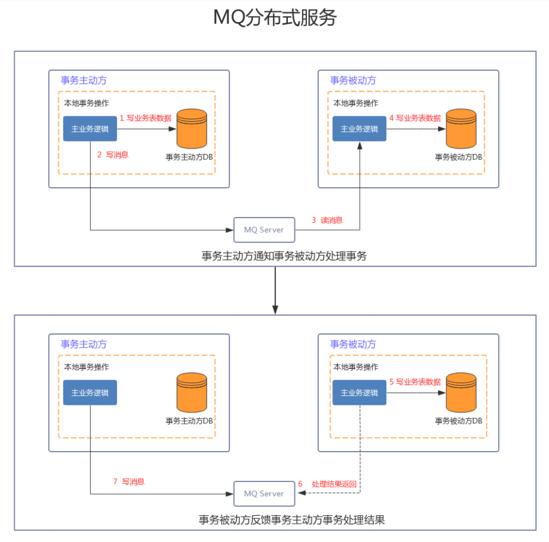

- 步骤 1 ：事务主动方处理本地事务。

  事务主动方在本地事务中处理业务更新操作和MQ写消息操作。

- 步骤 2 ：事务主动方通过消息中间件，通知事务被动方处理事务通知事务待消息。

  事务主动方主动写消息到MQ，事务消费方接收并处理MQ中的消息。

- 步骤 3 ：事务被动方通过MQ中间件，通知事务主动方事务已处理的消息，事务主动方根据反馈结果提交或回滚事务。

为了数据的一致性，当流程中遇到错误需要重试，容错处理规则如下：

- 当步骤 1 处理出错，事务回滚，相当于什么都没发生。

- 当步骤 2 处理出错，由于未处理的事务消息还是保存在事务发送方，可以重试或撤销本地业务操作。
- 如果事务被动方消费消息异常，需要不断重试，业务处理逻辑需要保证幂等。
- 如果是事务被动方业务上的处理失败，可以通过MQ通知事务主动方进行补偿或者事务回滚。
- 如果多个事务被动方已经消费消息，事务主动方需要回滚事务时需要通知事务被动方回滚。

#### Saga模式（最终一致性）

Saga这个概念源于 1987 年普林斯顿大学的 Hecto 和 Kenneth 发表的一篇数据库论文Sagas ，一个Saga事务是一个有多个短时事务组成的长时的事务。 在分布式事务场景下，我们把一个Saga分布式事务看做是一个由多个本地事务组成的事务，每个本地事务都有一个与之对应的补偿事务。在Saga事务的执行过程中，如果某一步执行出现异常，Saga事务会被终止，同时会调用对应的补偿

事务完成相关的恢复操作，这样保证Saga相关的本地事务要么都是执行成功，要么通过补偿恢复成为事务执行之前的状态。（自动反向补偿机制）。

Saga 事务基本协议如下：

- 每个 Saga 事务由一系列幂等的有序子事务(sub-transaction) Ti 组成。
- 每个 Ti 都有对应的幂等补偿动作 Ci，补偿动作用于撤销 Ti 造成的结果。
- Saga是一种补偿模式，它定义了两种补偿策略：
  - 向前恢复（forward recovery）：对应于上面第一种执行顺序，发生失败进行重试，适用于必须要成功的场景。
  - 向后恢复（backward recovery）：对应于上面提到的第二种执行顺序，发生错误后撤销掉之前所
    有成功的子事务，使得整个 Saga 的执行结果撤销。

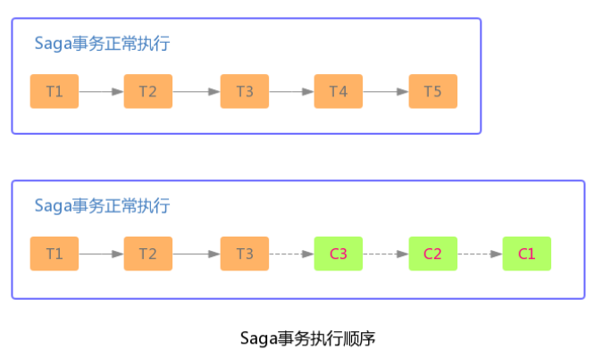

Saga 的执行顺序有两种，如上图：

- 事务正常执行完成：T1, T2, T3, ..., Tn，例如：减库存(T1)，创建订单(T2)，支付(T3)，依次有序完成整个事务。

- 事务回滚：T1, T2, ..., Tj, Cj,..., C2, C1，其中 0 < j < n，例如：减库存(T1)，创建订单(T2)，支付(T3)，支付失败，支付回滚(C3)，订单回滚(C2)，恢复库存(C1)。

- Seata框架

  Fescar开源项目，最初愿景是能像本地事务一样控制分布式事务，解决分布式环境下的难题。Seata（Simple Extensible Autonomous Transaction Architecture）是一套一站式分布式事务解决方案，是阿里集团和蚂蚁金服联合打造的分布式事务框架。Seata目前的事务模式有AT、TCC、Saga和XA，默认是AT模式，AT本质上是2PC协议的一种实现。

  Seata AT事务模型包含TM(事务管理器)，RM(资源管理器)，TC(事务协调器)。其中TC是一个独立的服务需要单独部署，TM和RM以jar包的方式同业务应用部署在一起，它们同TC建立长连接，在整个事务生命周期内，保持RPC通信。

  - 全局事务的发起方作为TM，全局事务的参与者作为RM

  - TM负责全局事务的begin和commit/rollback

  - RM负责分支事务的执行结果上报，并且通过TC的协调进行commit/rollback。

    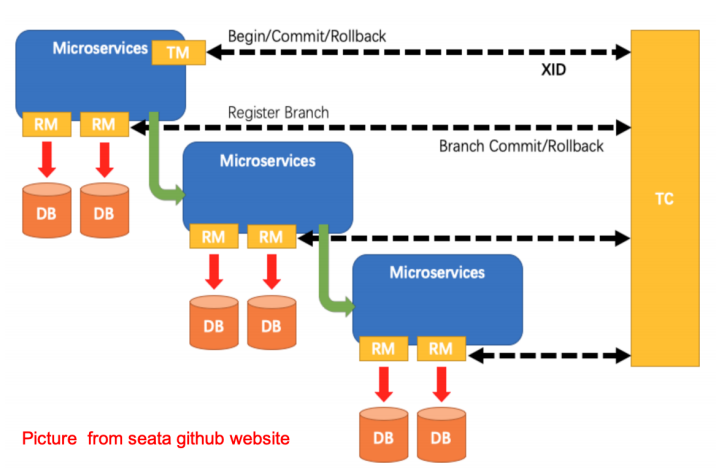

  在 Seata 中，AT时分为两个阶段的，第一阶段，就是各个阶段本地提交操作；第二阶段会根据第一阶段的情况决定是进行全局提交还是全局回滚操作。具体的执行流程如下：

  - TM 开启分布式事务，负责全局事务的begin和commit/rollback（TM 向 TC 注册全局事务记录）；
  - RM 作为参与者，负责分支事务的执行结果上报，并且通过TC的协调进行commit/rollback（RM 向 TC 汇报资源准备状态 ）；
  - RM分支事务结束，事务一阶段结束;
  - 根据TC 汇总事务信息，由TM发起事务提交或回滚操作；
  - TC 通知所有 RM 提交/回滚资源，事务二阶段结束；

### 1.7.3 Sharding-JDBC整合XA原理

Java通过定义JTA接口实现了XA的模型，JTA接口里的ResourceManager需要数据库厂商提供XA的驱动实现，而TransactionManager则需要事务管理器的厂商实现，传统的事务管理器需要同应用服务器绑定，因此使用的成本很高。 而嵌入式的事务管器可以以jar包的形式提供服务，同ShardingSphere集成后，可保证分片后跨库事务强一致性。

ShardingSphere支持以下功能：

- 支持数据分片后的跨库XA事务
- 两阶段提交保证操作的原子性和数据的强一致性
- 服务宕机重启后，提交/回滚中的事务可自动恢复
- SPI机制整合主流的XA事务管理器，默认Atomikos
- 同时支持XA和非XA的连接池
- 提供spring-boot和namespace的接入端

ShardingSphere整合XA事务时，分离了XA事务管理和连接池管理，这样接入XA时，可以做到对业务的
零侵入。

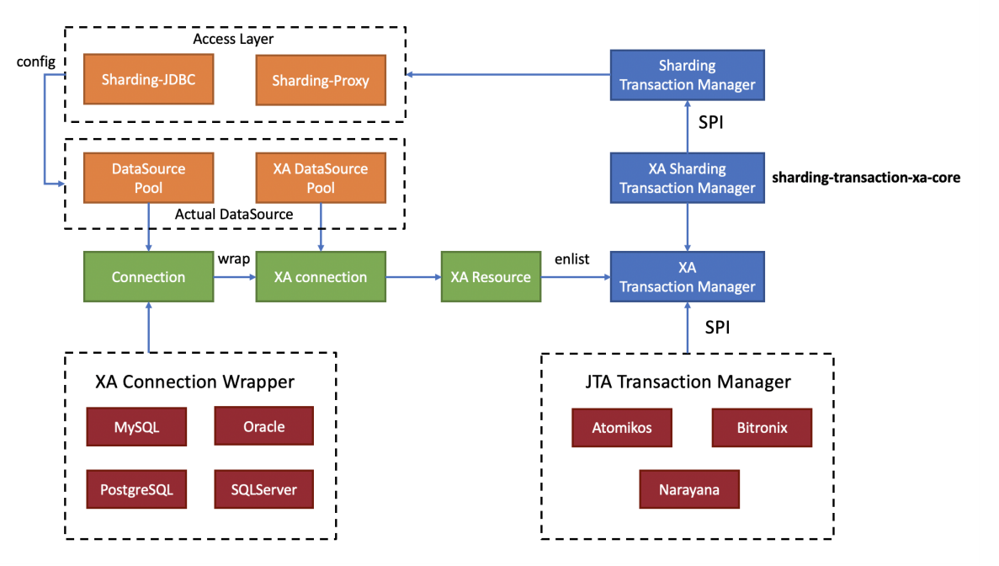

- Begin（开启XA全局事务）

  XAShardingTransactionManager会调用具体的XA事务管理器开启XA的全局事务。

- 执行物理SQL

  ShardingSphere进行解析/优化/路由后会生成SQL操作，执行引擎为每个物理SQL创建连接的同时，物理连接所对应的XAResource也会被注册到当前XA事务中。事务管理器会在此阶段发送XAResource.start命令给数据库，数据库在收到XAResource.end命令之前的所有SQL操作，会被标记为XA事务。

  例如:

  ```sql
  XAResource1.start 			## Enlist阶段执行
  statement.execute("sql1"); 	## 模拟执行一个分片SQL1
  statement.execute("sql2"); 	## 模拟执行一个分片SQL2
  XAResource1.end 			## 提交阶段执行
  ```

  这里sql1和sql2将会被标记为XA事务。

- Commit/rollback（提交XA事务）

  XAShardingTransactionManager收到接入端的提交命令后，会委托实际的XA事务管理进行提交动作，这时事务管理器会收集当前线程里所有注册的XAResource，首先发送XAResource.end指令，用以标记此XA事务的边界。 接着会依次发送prepare指令，收集所有参与XAResource投票，如果所有XAResource的反馈结果都是OK，则会再次调用commit指令进行最终提交，如果有一个XAResource的反馈结果为No，则会调用rollback指令进行回滚。 在事务管理器发出提交指令后，任何XAResource产生的异常都会通过recovery日志进行重试，来保证提交阶段的操作原子性，和数据强一致性。

  例如:

  ```sql
  XAResource1.prepare 	## ack: yes
  XAResource2.prepare 	## ack: yes
  XAResource1.commit
  XAResource2.commit
  
  XAResource1.prepare 	## ack: yes
  XAResource2.prepare 	## ack: no
  XAResource1.rollback
  XAResource2.rollback
  ```

  

### 1.7.4 Sharding-JDBC整合Saga原理

ShardingSphere的柔性事务已通过第三方servicecomb-saga组件实现的，通过SPI机制注入使用。
ShardingSphere是基于反向SQL技术实现的反向补偿操作，它将对数据库进行更新操作的SQL自动生成反向SQL，并交由Saga-actuator引擎执行。使用方则无需再关注如何实现补偿方法，将柔性事务管理器的应用范畴成功的定位回了事务的本源——数据库层面。ShardingSphere支持以下功能：

- 完全支持跨库事务
- 支持失败SQL重试及最大努力送达
- 支持反向SQL、自动生成更新快照以及自动补偿
- 默认使用关系型数据库进行快照及事务日志的持久化，支持使用SPI的方式加载其他类型的持久化

Saga柔性事务的实现类为SagaShardingTransactionMananger, ShardingSphere通过Hook的方式拦截逻辑SQL的解析和路由结果，这样，在分片物理SQL执行前，可以生成逆向SQL，在事务提交阶段再把SQL调用链交给Saga引擎处理。

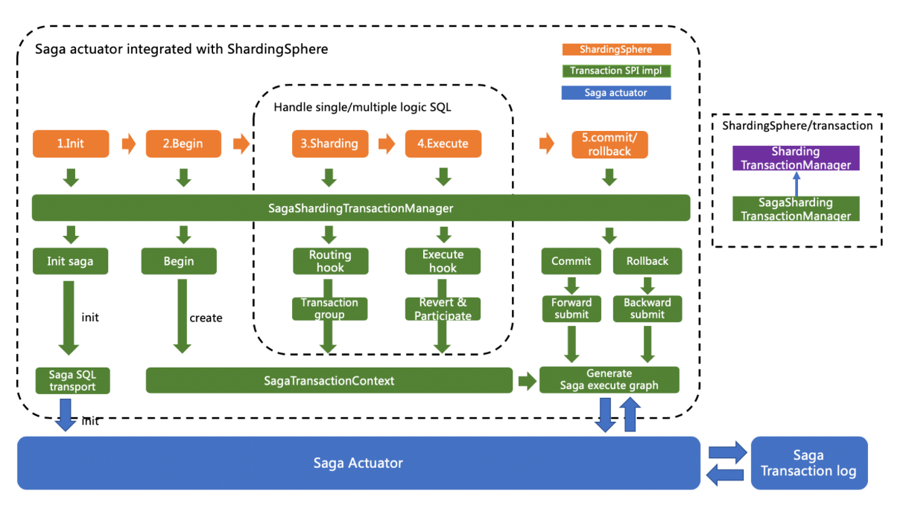

- Init（Saga引擎初始化）

  包含Saga柔性事务的应用启动时，saga-actuator引擎会根据saga.properties的配置进行初始化的流程。

- Begin（开启Saga全局事务）

  每次开启Saga全局事务时，将会生成本次全局事务的上下文（SagaTransactionContext），事务上下文记录了所有子事务的正向SQL和逆向SQL，作为生成事务调用链的元数据使用。

- 执行物理SQL

  在物理SQL执行前，ShardingSphere根据SQL的类型生成逆向SQL，这里是通过Hook的方式拦截Parser的解析结果进行实现。

- Commit/rollback（提交Saga事务）

  提交阶段会生成Saga执行引擎所需的调用链路图，commit操作产生ForwardRecovery（正向SQL补偿）任务，rollback操作产生BackwardRecovery任务（逆向SQL补偿）。

### 1.7.5 Sharding-JDBC整合Seata原理

分布式事务的实现目前主要分为两阶段的XA强事务和BASE柔性事务。

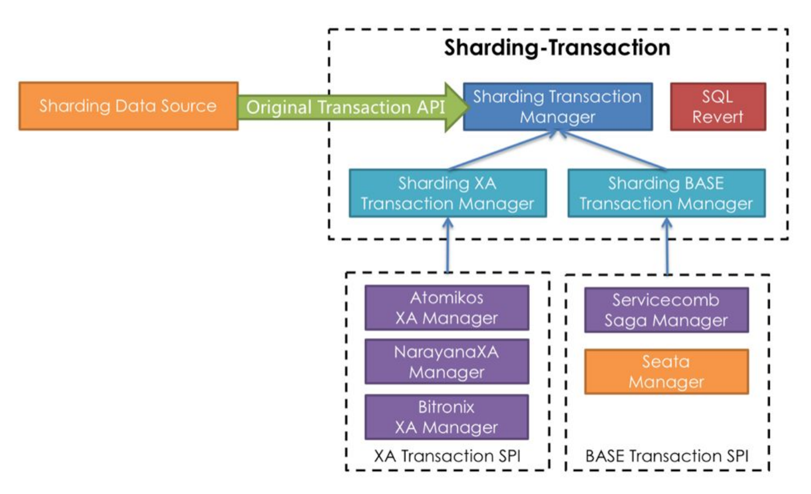


Seata AT事务作为BASE柔性事务的一种实现，可以无缝接入到ShardingSphere生态中。在整合Seata AT事务时，需要把TM，RM，TC的模型融入到ShardingSphere 分布式事务的SPI的生态中。在数据库资源上，Seata通过对接DataSource接口，让JDBC操作可以同TC进行RPC通信。同样，ShardingSphere也是面向DataSource接口对用户配置的物理DataSource进行了聚合，因此把物理DataSource二次包装为Seata 的DataSource后，就可以把Seata AT事务融入到ShardingSphere的分片中。

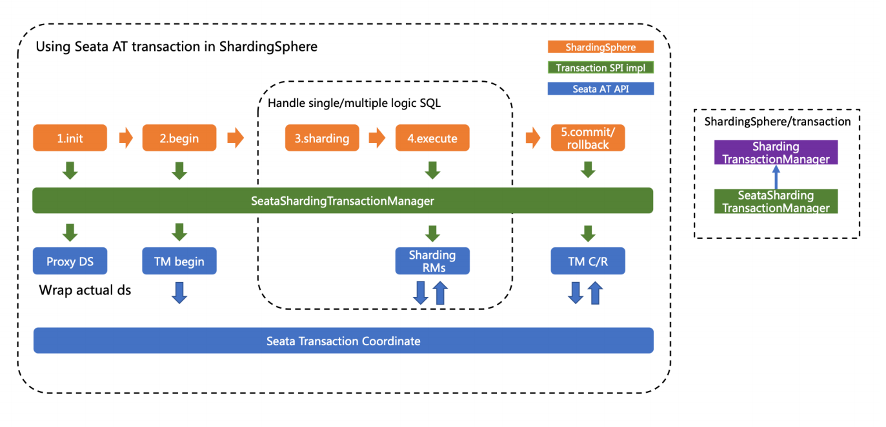

- Init（Seata引擎初始化）

  包含Seata柔性事务的应用启动时，用户配置的数据源会按seata.conf的配置，适配成Seata事务所需的DataSourceProxy，并且注册到RM中。

- Begin（开启Seata全局事务）

  TM控制全局事务的边界，TM通过向TC发送Begin指令，获取全局事务ID，所有分支事务通过此全局事务ID，参与到全局事务中；全局事务ID的上下文存放在当前线程变量中。

- 执行分片物理SQL

  处于Seata全局事务中的分片SQL通过RM生成undo快照，并且发送participate指令到TC，加入到全局事务中。ShardingSphere的分片物理SQL是按多线程方式执行，因此整合Seata AT事务时，需要在主线程和子线程间进行全局事务ID的上下文传递，这同服务间的上下文传递思路完全相同。

- Commit/rollback（提交Seata事务）

  提交Seata事务时，TM会向TC发送全局事务的commit和rollback指令，TC根据全局事务ID协调所有分支事务进行commit和rollback。

### 1.7.6 Sharding-JDBC分布式事务实战

ShardingSphere整合了XA、Saga和Seata模式后，为分布式事务控制提供了极大的便利，我们可以在应用程序编程时，采用以下统一模式进行使用。

> 引入Maven依赖

```xml
<!--XA模式-->
<dependency>
    <groupId>org.apache.shardingsphere</groupId>
    <artifactId>sharding-transaction-xa-core</artifactId>
    <version>${shardingsphere.version}</version>
</dependency>

<!--Saga模式-->
<dependency>
    <groupId>io.shardingsphere</groupId>
    <artifactId>sharding-transaction-base-saga</artifactId>
    <version>${shardingsphere-spi-impl.version}</version>
</dependency>
```

> JAVA编码方式设置事务类型

```java
TransactionTypeHolder.set(TransactionType.XA);
TransactionTypeHolder.set(TransactionType.BASE);
```

> 参数配置

ShardingSphere默认的XA事务管理器为Atomikos，通过在项目的classpath中添加jta.properties来定制化Atomikos配置项。具体的配置规则如下：

```properties
#指定是否启动磁盘日志，默认为true。在生产环境下一定要保证为true，否则数据的完整性无法保证
com.atomikos.icatch.enable_logging=true
#JTA/XA资源是否应该自动注册
com.atomikos.icatch.automatic_resource_registration=true
#JTA事务的默认超时时间，默认为10000ms
com.atomikos.icatch.default_jta_timeout=10000
#事务的最大超时时间，默认为300000ms。这表示事务超时时间由 UserTransaction.setTransactionTimeout()较大者决定。4.x版本之后，指定为 0 的话则表示不设置超时时间
com.atomikos.icatch.max_timeout=300000
#指定在两阶段提交时，是否使用不同的线程(意味着并行)。3.7版本之后默认为false，更早的版本默认为true。如果为false，则提交将按照事务中访问资源的顺序进行。
com.atomikos.icatch.threaded_2pc=false
#指定最多可以同时运行的事务数量，默认值为 50 ，负数表示没有数量限制。在调用 UserTransaction.begin()方法时，可能会抛出一个”Max number of active transactions reached”异常信息，表示超出最大事务数限制
com.atomikos.icatch.max_actives=50
#是否支持subtransaction，默认为true
com.atomikos.icatch.allow_subtransactions=true
#指定在可能的情况下，否应该join 子事务(subtransactions)，默认值为true。如果设置为 false，对于有关联的不同subtransactions，不会调用XAResource.start(TM_JOIN)
com.atomikos.icatch.serial_jta_transactions=true
#指定JVM关闭时是否强制(force)关闭事务管理器，默认为false
com.atomikos.icatch.force_shutdown_on_vm_exit=false
#在正常关闭(no-force)的情况下，应该等待事务执行完成的时间，默认为Long.MAX_VALUE
com.atomikos.icatch.default_max_wait_time_on_shutdown=9223372036854775807
========= 日志记录配置=======
#事务日志目录，默认为./。
com.atomikos.icatch.log_base_dir=./
#事务日志文件前缀，默认为tmlog。事务日志存储在文件中，文件名包含一个数字后缀，日志文件以.log为扩展名，如tmlog1.log。遇到checkpoint时，新的事务日志文件会被创建，数字增加。
com.atomikos.icatch.log_base_name=tmlog
#指定两次checkpoint的时间间隔，默认为 500
com.atomikos.icatch.checkpoint_interval=500
=========日志恢复配置=============
#指定在多长时间后可以清空无法恢复的事务日志(orphaned)，默认86400000ms
com.atomikos.icatch.forget_orphaned_log_entries_delay=86400000
#指定两次恢复扫描之间的延迟时间。默认值为与com.atomikos.icatch.default_jta_timeout相同
com.atomikos.icatch.recovery_delay=${com.atomikos.icatch.default_jta_timeout}
#提交失败时，再抛出一个异常之前，最多可以重试几次，默认值为 5
com.atomikos.icatch.oltp_max_retries=5
#提交失败时，每次重试的时间间隔，默认10000ms
com.atomikos.icatch.oltp_retry_interval=10000
```

Saga可以通过在项目的classpath中添加saga.properties来定制化Saga事务的配置项。配置项的属性及说明如下：

| 属性名称                                            | 默认值    | 说明                                  |
| --------------------------------------------------- | --------- | ------------------------------------- |
| saga.actuator.executor.size                         | 5         | 使用的线程池大小                      |
| saga.actuator.transaction.max.retries               | 5         | 失败SQL的最大重试次数                 |
| saga.actuator.compensation.max.retries              | 5         | 失败SQL的最大尝试补                   |
| saga.actuator.transaction.retry.delay.milliseconds  | 5000      | 失败SQL的重试间隔， 单位毫秒          |
| saga.actuator.compensation.retry.delay.milliseconds | 3000      | 失败SQL的补偿间隔， 单位毫秒          |
| saga.persistence.enabled                            | false     | 是否对日志进行持久 化                 |
| saga.persistence.ds.url                             | 无        | 事务日志数据库JDBC 连接               |
| saga.persistence.ds.username                        | 无        | 事务日志数据库用户 名                 |
| saga.persistence.ds.password                        | 无        | 事务日志数据库密码                    |
| saga.persistence.ds.max.pool.size                   | 50        | 事务日志连接池最大 连接数             |
| saga.persistence.ds.min.pool.size                   | 1         | 事务日志连接池最小 连接数             |
| saga.persistence.ds.max.life.time.milliseconds      | 0(无限制) | 事务日志连接池最大 存活时间，单位毫秒 |
| saga.persistence.ds.idle.timeout.milliseconds       | 60 * 1000 | 事务日志连接池空闲 回收时间，单位毫秒 |
| saga.persistence.ds.connection.timeout.milliseconds | 30 * 1000 | 事务日志连接池超时 时间，单位毫秒     |


## 1.8 SPI 加载剖析

在Apache ShardingSphere中，很多功能实现类的加载方式是通过SPI注入的方式完成的。 Service Provider Interface （SPI）是Java提供的一套被第三方实现或扩展的API，它可以用于实现框架扩展或组件替换。

本节汇总了Apache ShardingSphere所有通过SPI方式载入的功能模块。

> SQL解析

SQL解析的接口用于规定用于解析SQL的ANTLR语法文件。

主要接口是SQLParserEntry，其内置实现类有MySQLParserEntry, PostgreSQLParserEntry,SQLServerParserEntry和OracleParserEntry。

> 数据库协议

数据库协议的接口用于Sharding-Proxy解析与适配访问数据库的协议。

主要接口是DatabaseProtocolFrontendEngine，其内置实现类有MySQLProtocolFrontendEngine和PostgreSQLProtocolFrontendEngine。

> 数据脱敏

数据脱敏的接口用于规定加解密器的加密、解密、类型获取、属性设置等方式。

主要接口有两个：Encryptor和QueryAssistedEncryptor，其中Encryptor的内置实现类有AESEncryptor和MD5Encryptor。

> 分布式主键

分布式主键的接口主要用于规定如何生成全局性的自增、类型获取、属性设置等。

主要接口为ShardingKeyGenerator，其内置实现类有UUIDShardingKeyGenerator和
SnowflakeShardingKeyGenerator。

> 分布式事务

分布式事务的接口主要用于规定如何将分布式事务适配为本地事务接口。

主要接口为ShardingTransactionManager，其内置实现类有XAShardingTransactionManager和
SeataATShardingTransactionManager。

> XA事务管理器

XA事务管理器的接口主要用于规定如何将XA事务的实现者适配为统一的XA事务接口。

主要接口为XATransactionManager，其内置实现类有AtomikosTransactionManager,NarayanaXATransactionManager和BitronixXATransactionManager。

> 注册中心

注册中心的接口主要用于规定注册中心初始化、存取数据、更新数据、监控等行为。

主要接口为RegistryCenter，其内置实现类有Zookeeper。

## 1.9 编排治理剖析

编排治理模块提供配置中心/注册中心（以及规划中的元数据中心）、配置动态化、数据库熔断禁用、调用链路等治理能力。

### 1.9.1 配置中心

配置集中化：越来越多的运行时实例，使得散落的配置难于管理，配置不同步导致的问题十分严重。将配置集中于配置中心，可以更加有效进行管理。

配置动态化：配置修改后的分发，是配置中心可以提供的另一个重要能力。它可支持数据源、表与分片及读写分离策略的动态切换。

- 配置中心数据结构

  配置中心在定义的命名空间的config下，以YAML格式存储，包括数据源，数据分片，读写分离、Properties配置，可通过修改节点来实现对于配置的动态管理。

  ```properties
  config
  ├──authentication 		# Sharding-Proxy权限配置
  ├──props 				# 属性配置
  ├──schema 				# Schema配置
  ├ ├──sharding_db 		# SchemaName配置
  ├ ├ ├──datasource 		# 数据源配置
  ├ ├ ├──rule 			# 数据分片规则配置
  ├ ├──masterslave_db 	# SchemaName配置
  ├ ├ ├──datasource 		# 数据源配置
  ├ ├ ├──rule 			# 读写分离规则
  ```

- config/authentication

  ```properties
  password: root
  username: root
  ```

- config/sharding/props

  ```properties
  sql.show: true
  ```

- config/schema/schemeName/datasource

  多个数据库连接池的集合，不同数据库连接池属性自适配（例如：DBCP，C3P0，Druid, HikariCP）。

  ```yaml
  ds_0:
  	dataSourceClassName: com.zaxxer.hikari.HikariDataSource
  	properties:
  		url: jdbc:mysql://127.0.0.1:3306/lagou1?serverTimezone=UTC&useSSL=false
  		password: root
  		username: root
  		maxPoolSize: 50
  		minPoolSize: 1
  ds_1:
  	dataSourceClassName: com.zaxxer.hikari.HikariDataSource
  	properties:
          url: jdbc:mysql://127.0.0.1:3306/lagou2?serverTimezone=UTC&useSSL=false
          password: root
          username: root
          maxPoolSize: 50
          minPoolSize: 1
  ```

  

- config/schema/sharding_db/rule

  数据分片配置，包括数据分片配置。

  ```yaml
  tables:
  	b_order:
  		actualDataNodes: ds_$->{0..1}.b_order_$->{0..1}
  		databaseStrategy:
  		inline:
  			shardingColumn: user_id
  			algorithmExpression: ds_$->{user_id % 2}
  	keyGenerator:
  		column: order_id
  	logicTable: b_order
  		tableStrategy:
  			inline:
  				shardingColumn: order_id
  				algorithmExpression: b_order_$->{order_id % 2}
  	b_order_item:
  		actualDataNodes: ds_$->{0..1}.b_order_item_$->{0..1}
  		databaseStrategy:
  			inline:
  				shardingColumn: user_id
  				algorithmExpression: ds_$->{user_id % 2}
  		keyGenerator:
  			column: order_item_id
  		logicTable: b_order_item
  		tableStrategy:
  			inline:
  				shardingColumn: order_id
  				algorithmExpression: b_order_item_$->{order_id % 2}
  ```

- config/schema/masterslave/rule读写分离独立使用时使用该配置。

  ```yaml
  name: ds_ms
  masterDataSourceName: master
  slaveDataSourceNames:
  	- ds_slave0
  	- ds_slave1
  loadBalanceAlgorithmType: ROUND_ROBIN
  ```

  

- 动态生效

  在注册中心上修改、删除、新增相关配置，会动态推送到生产环境并立即生效。

### 1.9.2 注册中心

相对于配置中心管理配置数据，注册中心存放运行时的动态/临时状态数据，比如可用的proxy的实例，需要禁用或熔断的datasource实例。通过注册中心，可以提供熔断数据库访问程序对数据库的访问和禁用从库的访问的编排治理能力。治理仍然有大量未完成的功能（比如流控等）

- 注册中心数据结构

  注册中心在定义的命名空间的state下，创建数据库访问对象运行节点，用于区分不同数据库访问实例。包括instances和datasources节点。

- state/instances

  数据库访问对象运行实例信息，子节点是当前运行实例的标识。 运行实例标识由运行服务器的IP地址和PID构成。运行实例标识均为临时节点，当实例上线时注册，下线时自动清理。注册中心监控这些节点的变化来治理运行中实例对数据库的访问等。

- state/datasources

  可以控制读写分离，可动态添加删除以及禁用。

- 熔断实例

  可在IP地址@-@PID节点写入DISABLED（忽略大小写）表示禁用该实例，删除DISABLED表示启用。

  Zookeeper命令如下：

  ```shell
  [zk: localhost:2181(CONNECTED) 0 ] set
  /your_zk_namespace/your_app_name/state/instances/your_instance_ip_a@-@your_instance_pid_x DISABLED
  ```

- 禁用从库

  在读写分离场景下，可在数据源名称子节点中写入DISABLED表示禁用从库数据源，删除DISABLED或节点表示启用。

  Zookeeper命令如下：

  ```
  [zk: localhost:2181(CONNECTED) 0 ] set
  /your_zk_namespace/your_app_name/state/datasources/your_slave_datasource_name DISABLED
  ```

  

### 1.9.3 支持的配置中心和注册中心

ShardingSphere在数据库治理模块使用SPI方式载入数据到配置中心/注册中心，进行实例熔断和数据库禁用。 目前，ShardingSphere内部支持Zookeeper和Etcd这种常用的配置中心/注册中心。 此外，您可以使用其他第三方配置中心/注册中心，例如Apollo、Nacos等，并通过SPI的方式注入到ShardingSphere，从而使用该配置中心/注册中心，实现数据库治理功能。

### 1.9.4 应用性能监控

APM是应用性能监控的缩写。目前APM的主要功能着眼于分布式系统的性能诊断，其主要功能包括调用链展示，应用拓扑分析等。ShardingSphere并不负责如何采集、存储以及展示应用性能监控的相关数据，而是将SQL解析与SQL执行这两块数据分片的最核心的相关信息发送至应用性能监控系统，并交由其处理。 换句话
说，ShardingSphere仅负责产生具有价值的数据，并通过标准协议递交至相关系统。ShardingSphere可以通过两种方式对接应用性能监控系统。

- 使用OpenTracing API发送性能追踪数据。面向OpenTracing协议的APM产品都可以和ShardingSphere自动对接，比如SkyWalking，Zipkin和Jaeger。
- 使用SkyWalking的自动探针。 ShardingSphere团队与SkyWalking团队共同合作，在SkyWalking中实现了ShardingSphere自动探针，可以将相关的应用性能数据自动发送到SkyWalking中。

## 1.10 Sharding-Proxy实战

Sharding-Proxy是ShardingSphere的第二个产品，定位为透明化的数据库代理端，提供封装了数据库二进制协议的服务端版本，用于完成对异构语言的支持。 目前先提供MySQL版本，它可以使用任何兼容MySQL协议的访问客户端(如：MySQL Command Client, MySQL Workbench等操作数据，对DBA更加友好。

- 向应用程序完全透明，可直接当做MySQL使用

- 适用于任何兼容MySQL协议的客户端

  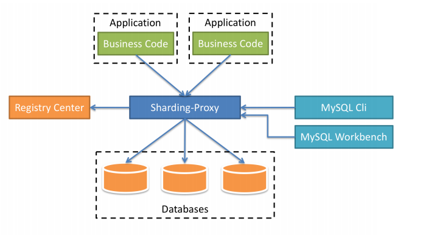

Sharding-Proxy的优势在于对异构语言的支持，以及为DBA提供可操作入口。

### Sharding-Proxy使用过程 

- 下载Sharding-Proxy的最新发行版；

- 解压缩后修改conf/server.yaml和以config-前缀开头的文件，进行分片规则、读写分离规则配置

  编辑%SHARDING_PROXY_HOME%\conf\config-xxx.yaml

  编辑%SHARDING_PROXY_HOME%\conf\server.yaml

- 引入依赖jar

  如果后端连接MySQL数据库，需要下载MySQL驱动， 解压缩后将mysql-connector-java-5.1.48.jar拷贝到${sharding-proxy}\lib目录。如果后端连接PostgreSQL数据库，不需要引入额外依赖。

- Linux操作系统请运行bin/start.sh，Windows操作系统请运行bin/start.bat启动Sharding-Proxy。

  使用默认配置启动：${sharding-proxy}\bin\start.sh

  配置端口启动：${sharding-proxy}\bin\start.sh ${port}

- 使用客户端工具连接。如: mysql -h 127.0.0.1 -P 3307 -u root -p root

若想使用Sharding-Proxy的数据库治理功能，则需要使用注册中心实现实例熔断和从库禁用功能。Sharding-Proxy默认提供了Zookeeper的注册中心解决方案。只需按照配置规则进行注册中心的配置，即可使用。

### 注意事项

- Sharding-Proxy 默认不支持hint，如需支持，请在conf/server.yaml中，将props的属性proxy.hint.enabled设置为true。在Sharding-Proxy中，HintShardingAlgorithm的泛型只能是String类型。
- Sharding-Proxy默认使用 3307 端口，可以通过启动脚本追加参数作为启动端口号。如:bin/start.sh 3308
- Sharding-Proxy使用conf/server.yaml配置注册中心、认证信息以及公用属性。
- Sharding-Proxy支持多逻辑数据源，每个以"config-"做前缀命名yaml配置文件，即为一个逻辑数据源。

# 第 2 节 Mycat实战

## 2.1 Mycat 简介

Mycat 是一个实现了 MySQL 协议的 Server，前端用户可以把它看作是一个数据库代理，用 MySQL 客户端工具和命令行访问，而其后端可以用 MySQL 原生协议或JDBC 协议与多个 MySQL 服务器通信，其核心功能是分库分表和读写分离，即将一个大表水平分割为 N 个小表，存储在后端 MySQL 服务器里或者其他数据库里。

- 对于 DBA 来说，可以这么理解 Mycat

  Mycat 就是 MySQL Server，但是Mycat 本身并不存储数据，数据是在后端的 MySQL 上存储的，因此数据可靠性以及事务等都是 MySQL 保证的。简单的说，Mycat 就是 MySQL 最佳伴侣。

- 对于软件工程师来说，可以这么理解 Mycat

  Mycat 就是一个近似等于 MySQL 的数据库服务器，你可以用连接 MySQL 的方式去连接Mycat（除了端 口不同，默认的 Mycat 端口是 8066 而非 MySQL 的 3306 ，因此需要在连接字符串上增加端口信息），大多数 情况下，可以用你熟悉的对象映射框架使用 Mycat，但建议对于分片表，尽量使用基础的 SQL 语句，因为这样能 达到最佳性能，特别是几千万甚至几百亿条记录的情况下。

- 对于架构师来说，可以这么理解 Mycat

  Mycat 是一个强大的数据库中间件，不仅仅可以用作读写分离、以及分表分库、容灾备份，而且可以用于多 用户应用开发、云平台基础设施、让你的架构具备很强的适应性和灵活性，借助于即将发布的 Mycat 智能优化模块，系统的数据访问瓶颈和热点一目了然，根据这些统计分析数据，你可以自动或手工调整后端存储，将不同的 表映射到不同存储引擎上，而整个应用的代码一行也不用改变。

## 2.2 Mycat 核心概念

### 2.2.1 逻辑库

对数据进行分片处理之后，从原有的一个库，被切分为多个分片数据库，所有的分片数据库集群构成了整个完整的数据库存储。Mycat在操作时，使用逻辑库来代表这个完整的数据库集群，便于对整个集群操作。

### 2.2.2 逻辑表

既然有逻辑库，那么就会有逻辑表，分布式数据库中，对应用来说，读写数据的表就是逻辑表。

### 2.2.3 分片表

分片表，是指那些原有的很大数据的表，需要切分到多个数据库的表，这样，每个分片都有一部分数据，所 有分片构成了完整的数据。例如在 mycat 配置中的 t_node 就属于分片表，数据按照规则被分到 dn1,dn2 两个分片节点上。

```xml
<table name="t_node" primaryKey="vid" autoIncrement="true" dataNode="dn1,dn2" 
       rule="rule1" />
```

### 2.2.4 非分片表

一个数据库中并不是所有的表都很大，某些表是可以不用进行切分的，非分片是相对分片表来说的，就是那些不需要进行数据切分的表。如下配置中 t_node，只存在于分片节点dn1上。

```xml
<table name="t_node" primaryKey="vid" autoIncrement="true" dataNode="dn1" />
```

### 2.2.5 ER表

Mycat提出了基于 E-R 关系的数据分片策略，子表的记录与所关联的父表记录存放在同一个数据分片上，即子表依赖于父表，通过表分组(Table Group)保证数据 join 不会跨库操作。表分组(Table Group)是解决跨分片数据 join 的一种很好的思路，也是数据切分规划的重要一条规则。

### 2.2.6 全局表

一个真实的业务系统中，往往存在大量的类似字典表的表，这些表基本上很少变动，字典表具有以下几个特 性:

- 变动不频繁;
- 数据量总体变化不大;
- 数据规模不大，很少有超过数十万条记录。

对于这类的表，在分片的情况下，当业务表因为规模而进行分片以后，业务表与这些附属的字典表之间的关联，就成了比较棘手的问题，所以 Mycat 中通过数据冗余来解决这类表的 join，即所有的分片都有一份数据的拷贝，所有将字典表或者符合字典表特性的一些表定义为全局表。数据冗余是解决跨分片数据 join 的一种很好的思路，也是数据切分规划的另外一条重要规则。

### 2.2.7 分片节点

数据切分后，一个大表被分到不同的分片数据库上面，每个表分片所在的数据库就是分片节点dataNode。

### 2.2.8 节点主机

数据切分后，每个分片节点不一定都会独占一台机器，同一机器上面可以有多个分片数据库， 这样一个或多个分片节点所在的机器就是节点主机，为了规避单节点主机并发数限制， 尽量将读写压力高的分片节点均衡的放在不同的节点主机dataHost。

### 2.2.9 分片规则

前面讲了数据切分，一个大表被分成若干个分片表，就需要一定的规则rule，这样按照某种业务规则把数据分到 某个分片的规则就是分片规则，数据切分选择合适的分片规则非常重要，将极大的避免后续数据处理的难度。


## 2.3 server.xml配置

server.xml几乎保存了所有 mycat 需要的系统配置信息。

### 2.3.1 user标签

这个标签主要用于定义登录 mycat 的用户和权限。例如下面的例子中，我们定义了一个用户，用户名为 user、密码也为 user，可访问的 schema为lg_edu_order。

```xml
<user name="user">
    <property name="password">user</property>
    <property name="schemas">lg_edu_order</property>
    <property name="readOnly">true</property>
    <property name="defaultSchema">lg_edu_order</property>
</user>
```

### 2.3.2 firewall标签

```xml
<firewall>
    <!-- ip白名单 用户对应的可以访问的 ip 地址 -->
    <whitehost>
        <host host="127.0.0.*" user="root"/>
        <host host="127.0.*" user="root"/>
        <host host="127.*" user="root"/>
        <host host="1*7.*" user="root"/>
    </whitehost>
    <!-- 黑名单允许的 权限 后面为默认 -->
    <blacklist check="true">
        <property name="selelctAllow">false</property>
        <property name="selelctIntoAllow">false</property>
        <property name="updateAllow">false</property>
        <property name="insertAllow">false</property>
        <property name="deletetAllow">false</property>
        <property name="dropAllow">false</property>
    </blacklist>
</firewall>
```

### 2.3.3 全局序列号

在实现分库分表的情况下，数据库自增主键已无法保证自增主键的全局唯一。为此，Mycat 提供了全局
sequence，并且提供了包含本地配置和数据库配置等多种实现方式。

```xml
<system>
    <property name="sequnceHandlerType">0</property>
</system>
```

> 0 表示使用本地文件方式； 
>
> 1 表示使用数据库方式生成； 
>
> 2 表示使用本地时间戳方式； 
>
> 3 表示基于ZK与本地配置的分布式ID生成器； 
>
> 4 表示使用zookeeper递增方式生成

#### 2.3.3.1 本地文件

此方式 Mycat 将 sequence 配置到文件中，当使用到 sequence 中的配置后，Mycat 会更下 classpath中的 sequence_conf.properties 文件中 sequence 当前的值。

```properties
#default global sequence
GLOBAL.HISIDS=
GLOBAL.MINID= 10001
GLOBAL.MAXID= 20000
GLOBAL.CURID= 10000

# self define sequence
COMPANY.HISIDS=
COMPANY.MINID= 1001
COMPANY.MAXID= 2000
COMPANY.CURID= 1000

ORDER.HISIDS=
ORDER.MINID= 1001
ORDER.MAXID= 2000
ORDER.CURID= 1000
```

#### 2.3.3.2 数据库方式

在数据库中建立一张表，存放 sequence 名称（name），sequence 当前值（current_value），步长
（increment） 等信息。

```sql
CREATE TABLE MYCAT_SEQUENCE
(
    name VARCHAR(64) NOT NULL,
    current_value BIGINT(20) NOT NULL,
    increment INT NOT NULL DEFAULT 1,
    PRIMARY KEY (name)
) ENGINE = InnoDB;
```

#### 2.3.3.3 本地时间戳方式

ID为 64 位二进制 ， 42 （毫秒）+5（机器 ID）+5（业务编码）+12（重复累加）

换算成十进制为 18 位数的 long 类型，每毫秒可以并发 12 位二进制的累加。

在 Mycat 下配置sequence_time_conf.properties文件

```properties
WORKID=0-31  		#任意整数
DATAACENTERID=0-31 	#任意整数
```

每个Mycat 配置的 WORKID、DATAACENTERID 不同，组成唯一标识，总共支持32*32=1024 种组合。

#### 2.4.3.4 分布式 ZK ID 生成器

Zk 的连接信息统一在 myid.properties 的 zkURL 属性中配置。基于 ZK 与本地配置的分布式 ID 生成器，InstanceID可以通过ZK自动获取，也可以通过配置文件配置。在sequence_distributed_conf.properties，只要配置INSTANCEID=ZK就表示从 ZK 上获取 InstanceID。

ID 最大为 63 位二进制，可以承受单机房单机器单线程 1000*(2^6)=640000 的并发。结构如下

- current time millis（微秒时间戳 38 位，可以使用 17 年）
- clusterId（机房或者 ZKid，通过配置文件配置， 5 位）
- instanceId（实例 ID，可以通过 ZK 或者配置文件获取， 5 位）
- threadId（线程 ID， 9 位）
- increment（自增， 6 位）

#### 2.3.3.5 ZK 递增方式

Zk 的连接信息统一在 myid.properties 的 zkURL 属性中配置。需要配置sequence_conf.properties文件

- TABLE.MINID 某线程当前区间内最小值
- TABLE.MAXID 某线程当前区间内最大值
- TABLE.CURID 某线程当前区间内当前值


## 2.4 schema.xml配置

schema.xml 作为 Mycat 中重要的配置文件之一，管理着 Mycat 的逻辑库、表、分片节点、主机等信息。

### 2.4.1 schema标签

schema 标签用于定义 Mycat 实例中的逻辑库，Mycat 可以有多个逻辑库，每个逻辑库都有自己的相关配置。可以使用 schema 标签来划分这些不同的逻辑库。

```xml
<!-- 逻辑库 -->
<schema name="lg_edu_order" checkSQLschema="true" sqlMaxLimit="100"
        dataNode="dn1"></schema>
```

| 属性名         | 值         | 数量限制 | 说明                      |
| -------------- | ---------- | -------- | ------------------------- |
| dataNode       | 任意String | （0..1） | 分片节点                  |
| sqlMaxLimit    | Integer    | （1）    | 查询返回的记录数限制limit |
| checkSQLschema | Boolean    | （1）    | 是否去表库名              |

### 2.4.2 table标签

table标签定义了 Mycat 中的逻辑表，所有需要拆分的表都需要在这个标签中定义

```xml
<table name="b_order" dataNode="dn1,dn2" rule="b_order_rule" primaryKey="ID"
       autoIncrement="true"/>
```

| 属性          | 值      | 数量限制  | 说明                         |
| ------------- | ------- | --------- | ---------------------------- |
| name          | String  | （1）     | 逻辑表名                     |
| dataNode      | String  | （1.. *） | 分片节点                     |
| rule          | String  | （0..1）  | 分片规则                     |
| ruleRequired  | Boolean | （0..1）  | 是否强制绑定分片规则         |
| primaryKey    | String  | （1）     | 主键                         |
| type          | String  | （0..1）  | 逻辑表类型，全局表、普通表   |
| autoIncrement | Boolean | （0..1）  | 自增长主键                   |
| subTables     | String  | (1)       | 分表                         |
| needAddLimit  | Boolean | （0..1）  | 是否为查询SQL自动加limit限制 |


### 2.4.3 dataNode标签

dataNode标签定义了 MyCat 中的分片节点，也就是我们通常说所的数据分片。

```xml
<!-- 数据节点 -->
<dataNode name="dn1" dataHost="lg_edu_order_1" database="lg_edu_order_1" />
```

**name**： 定义数据节点的名字，这个名字需要是唯一的，我们需要在 table 标签上应用这个名字，来建立表与分片对应的关系。

**dataHost** : 用于定义该分片属于哪个分片主机，属性值是引用 dataHost 标签上定义的 name 属性。

**database**： 用于定义该分片节点属于哪个具体的库。

### 2.4.4 dataHost标签

dataHost标签在 Mycat 逻辑库中也是作为最底层的标签存在，直接定义了具体的数据库实例、读写分离配置和心跳语句

```xml
<dataHost name="lg_edu_order_1" maxCon="100" minCon="10" balance="0"
          writeType="0" dbType="mysql" dbDriver="native" switchType="1"
          slaveThreshold="100">
</dataHost>
```

| 属性       | 值      | 数量限制 | 说明               |
| ---------- | ------- | -------- | ------------------ |
| name       | String  | (1)      | 节点主机名         |
| maxCon     | Integer | (1)      | 最大连接数         |
| minCon     | Integer | (1)      | 最小连接数         |
| balance    | Integer | (1)      | 读操作负载均衡类型 |
| writeType  | Integer | (1)      | 写操作负载均衡类型 |
| dbType     | String  | (1)      | 数据库类型         |
| dbDriver   | String  | (1)      | 数据库驱动         |
| switchType | String  | (1)      | 主从切换类型       |

### 2.4.5 heartbeat标签

heartbeat标签内指明用于和后端数据库进行心跳检查的语句。例如：MySQL 可以使用 select user()、Oracle 可以 使用 select 1 from dual 等

```xml
<dataHost>
    <heartbeat>select user()</heartbeat>
</dataHost>
```

### 2.4.6 writeHost和readHost标签

writeHost和readHost标签都指定后端数据库的相关配置给 mycat，用于实例化后端连接池。唯一不同的是，writeHost 指定写实例、readHost 指定读实例。在一个 dataHost 内可以定义多个 writeHost 和readHost。但是，如果 writeHost 指定的后端数据库宕机， 那么这个 writeHost 绑定的所有 readHost都将不可用。另一方面，由于这个 writeHost 宕机系统会自动的检测 到，并切换到备用的 writeHost上去。

```xml
<dataHost name="lg_edu_order_2" maxCon="100" minCon="10" balance="0"
          writeType="0" dbType="mysql" dbDriver="native" switchType="1"
          slaveThreshold="100">
    <heartbeat>select user()</heartbeat>
    <writeHost host="M1" url="192.168.95.133:3306" user="root" password="1234">
    </writeHost>
</dataHost>
```

| 属性         | 值     | 数量限制 | 说明                   |
| ------------ | ------ | -------- | ---------------------- |
| host         | String | (1)      | 主机名                 |
| url          | String | (1)      | 连接字符串             |
| password     | String | (1)      | 密码                   |
| user         | String | (1)      | 用户名                 |
| weight       | String | (1)      | 权重                   |
| usingDecrypt | String | (1)      | 是否对密码加密，默认 0 |


## 2.5 rule.xml配置

rule.xml用于定义Mycat的分片规则。

### 2.5.1 tableRule标签

```xml
<tableRule name="c_order_rule">
    <rule>
        <columns>user_id</columns>
        <algorithm>partitionByOrderFunc</algorithm>
    </rule>
</tableRule>
```

name：指定唯一的名字，用于标识不同的表规则。

columns：指定要拆分的列名字。

algorithm：使用 function 标签中的 name 属性，连接表规则和具体路由算法。

### 2.5.2 function标签

```xml
<function name="partitionByOrderFunc"
          class="io.mycat.route.function.PartitionByMod">
    <property name="count"> 2 </property>
</function>
```

name：指定算法的名字。

class：制定路由算法具体的类名字。

property： 为具体算法需要用到的一些属性。


## 2.6 Mycat实战

### 2.6.1 Mycat安装

> 提示：需要先安装jdk

- 下载Mycat-server工具包

- 解压Mycat工具包

  ```shell
  tar -zxvf Mycat-server-1.6.7.5-release-20200410174409-linux.tar.gz
  ```

- 进入mycat/bin，启动Mycat

  ```shell
  启动命令：./mycat start
  停止命令：./mycat stop
  重启命令：./mycat restart
  查看状态：./mycat status
  ```

- 访问Mycat

  ```shell
  mysql -uroot -proot -h127.0.0.1 -P8066
  ```

  

### 2.6.2 分库分表

在rule.xml配置Mycat分库分表。

```xml
<mycat:rule xmlns:mycat="http://io.mycat/">
    <tableRule name="b_order_rule">
        <rule>
            <columns>company_id</columns>
            <algorithm>partitionByOrderFunc</algorithm>
        </rule>
    </tableRule>
    <!-- 路由函数定义 -->
    <function name="partitionByOrderFunc"
              class="io.mycat.route.function.PartitionByMod">
        <property name="count">2</property>
    </function>
</mycat:rule>
```

Mycat常用分片规则如下：

- 时间类：按天分片、自然月分片、单月小时分片
- 哈希类：Hash固定分片、日期范围Hash分片、截取数字Hash求模范围分片、截取数字Hash分片、一致性Hash分片
- 取模类：取模分片、取模范围分片、范围求模分片
- 其他类：枚举分片、范围约定分片、应用指定分片、冷热数据分片

Mycat常用分片配置示例：

> 自动分片
>

```xml
<tableRule name="auto-sharding-long">
    <rule>
        <columns>id</columns>
        <algorithm>rang-long</algorithm>
    </rule>
</tableRule>
<function name="rang-long"
          class="io.mycat.route.function.AutoPartitionByLong">
    <property name="mapFile">autopartition-long.txt</property>
</function>
```

autopartition-long.txt文件内容如下：

```
# range start-end ,data node index
# K=1000,M=10000.
0-500M=0
500M-1000M=1
1000M-1500M=2
```


> 枚举分片

把数据分类存储。

```xml
<tableRule name="sharding-by-intfile">
    <rule>
        <columns>sharding_id</columns>
        <algorithm>hash-int</algorithm>
    </rule>
</tableRule>
<function name="hash-int" class="io.mycat.route.function.PartitionByFileMap">
    <property name="mapFile">partition-hash-int.txt</property>
    <!-- 找不到分片时设置容错规则，把数据插入到默认分片 0 里面 -->
    <property name="defaultNode">0</property>
</function>
```

partition-hash-int.txt文件内容如下：

```
10000=0
10010=1
```

> 取模分片

根据分片字段值 % 分片数 。

```xml
<tableRule name="mod-long">
    <rule>
        <columns>id</columns>
        <algorithm>mod-long</algorithm>
    </rule>
</tableRule>
<function name="mod-long" class="io.mycat.route.function.PartitionByMod">
    <!--分片数 -->
    <property name="count">3</property>
</function>
```

> 冷热数据分片

根据日期查询日志数据冷热数据分布 ，最近 n 个月的到实时交易库查询，超过 n 个月的按照 m 天分片。

```xml
<tableRule name="sharding-by-date">
    <rule>
        <columns>create_time</columns>
        <algorithm>sharding-by-hotdate</algorithm>
    </rule>
</tableRule>
<function name="sharding-by-hotdate" class="org.opencloudb.route.function.PartitionByHotDate">
    <!-- 定义日期格式 -->
    <property name="dateFormat">yyyy-MM-dd</property>
    <!-- 热库存储多少天数据 -->
    <property name="sLastDay">30</property>
    <!-- 超过热库期限的数据按照多少天来分片 -->
    <property name="sPartionDay">30</property>
</function>
```

> 一致性哈希分片

```xml
<tableRule name="sharding-by-murmur">
    <rule>
        <columns>id</columns>
        <algorithm>murmur</algorithm>
    </rule>
</tableRule>
<function name="murmur"
          class="io.mycat.route.function.PartitionByMurmurHash">
    <property name="seed">0</property><!-- 默认是0 -->
    <property name="count">2</property><!-- 要分片的数据库节点数量，必须指定，否则没法分片 -->
    <property name="virtualBucketTimes">160</property><!-- 一个实际的数据库节点被映射为这么多虚拟节点，默认是 160 倍，也就是虚拟节点数是物理节点数的 160 倍 -->
    <!-- 
        <property name="weightMapFile">weightMapFile</property> 节点的权重，
         没有指定权重的节点默认是 1 。以properties文件的格式填写，以从 0 开始到count-1的整数值也就
         是节点索引为key，以节点权重值为值。所有权重值必须是正整数，否则以 1 代替 
	-->
    <!-- 
        <property name="bucketMapPath">/etc/mycat/bucketMapPath</property>
         用于测试时观察各物理节点与虚拟节点的分布情况，如果指定了这个属性，会把虚拟节点的
         murmur hash值与物理节点的映射按行输出到这个文件，没有默认值，如果不指定，就不会输出任何东西 
    -->
</function>
```


### 2.6.3 读写分离

在schema.xml文件中配置Mycat读写分离。使用前需要搭建MySQL主从架构，并实现主从复制，Mycat不负数据同步问题。

```xml
<dataHost name="localhost1" maxCon="1000" minCon="10" balance="1" writeType="0"
          dbType="mysql" dbDriver="native">
    <heartbeat>select user()</heartbeat>
    <!-- can have multi write hosts -->
    <writeHost host="M1" url="localhost:3306" user="root" password="123456">
        <readHost host="S1" url="localhost:3307" user="root" password="123456" weight="1" />
    </writeHost>
</dataHost>
```

balance参数：

- 0 ： 所有读操作都发送到当前可用的writeHost
- 1 ：所有读操作都随机发送到readHost和stand by writeHost

- 2 ：所有读操作都随机发送到writeHost和readHost
- 3 ：所有读操作都随机发送到writeHost对应的readHost上，但是writeHost不负担读压力

writeType参数：

- 0 ： 所有写操作都发送到可用的writeHost
- 1 ：所有写操作都随机发送到readHost
- 2 ：所有写操作都随机发送到writeHost，readHost

或者

```xml
<dataHost name="localhost1" maxCon="1000" minCon="10" balance="1" writeType="0"
          dbType="mysql" dbDriver="native">
    <heartbeat>select user()</heartbeat>
    <!-- can have multi write hosts -->
    <writeHost host="M1" url="localhost:3306" user="root" password="123456">
    </writeHost>
    <writeHost host="S1" url="localhost:3307" user="root" password="123456">
    </writeHost>
</dataHost>
```


> 以上两种取模第一种当写挂了读不可用，第二种可以继续使用，事务内部的一切操作都会走写节点，所以读操作不要加事务，如果读延时较大，使用根据主从延时切换的读写分离，或者强制走写节点


### 2.6.4 强制路由

一个查询 SQL 语句以/* !mycat * /注解来确定其是走读节点还是写节点。

/*! */

/*# */

/** */

```sql
强制走从:
/*!mycat:db_type=slave*/ select * from travelrecord //有效
/*#mycat:db_type=slave*/ select * from travelrecord
强制走写:
/*!mycat:db_type=master*/ select * from travelrecord //有效
/*#mycat:db_type=slave*/ select * from travelrecord
```

1.6 以后Mycat除了支持db_type注解以外，还有其他注解，如下：

```
/*!mycat:sql=sql */ 指定真正执行的SQL
/*!mycat:schema=schema1 */ 指定走那个schema
/*!mycat:datanode=dn1 */ 指定sql要运行的节点
/*!mycat:catlet=io.mycat.catlets.ShareJoin */ 通过catlet支持跨分片复杂SQL实现以及存储过程支持等
```


### 2.6.5 主从延时切换

switchType参数：

- -1： 表示不自动切换
- 1 ：表示自动切换
- 2 ：基于MySQL主从同步状态决定是否切换
- 3 ：基于MySQL cluster集群切换机制

1.4 开始支持 MySQL 主从复制状态绑定的读写分离机制，让读更加安全可靠，配置如下:MyCAT 心跳检查语句配置为 show slave status ，dataHost 上定义两个新属性: switchType="2" 与slaveThreshold="100"，此时意味着开启 MySQL 主从复制状态绑定的读写分离与切换机制，Mycat 心跳机 制通过检测 show slave status 中的 "Seconds_Behind_Master", "Slave_IO_Running","Slave_SQL_Running" 三个字段来确定当前主从同步的状态以及 Seconds_Behind_Master 主从复制时延， 当 Seconds_Behind_Master > slaveThreshold 时，读写分离筛选器会过滤掉此 Slave 机器，防止读到很久之 前的旧数据，而当主节点宕机后，切换逻辑会检查 Slave 上的 Seconds_Behind_Master 是否为 0 ，为 0 时则 表示主从同步，可以安全切换，否则不会切换。

```xml
<dataHost name="localhost1" maxCon="1000" minCon="10" balance="0" writeType="0"
          dbType="mysql" dbDriver="native" switchType="2" slaveThreshold="100">
    <heartbeat>show slave status </heartbeat>
    <!-- can have multi write hosts -->
    <writeHost host="M1" url="localhost:3306" user="root" password="123456"></writeHost>
    <writeHost host="S1" url="localhost:3316" user="root"></writeHost>
</dataHost>
```

1.4.1 开始支持 MySQL 集群模式，让读更加安全可靠，配置如下: MyCAT 心跳检查语句配置为 show status like ‘wsrep%’ ，dataHost 上定义两个新属性: switchType="3"此时意味着开启 MySQL 集群复制状态状态绑定的读写分离与切换机制，Mycat 心跳机制通过检测集群复制时延时，如果延时过大或者集群出现节点问题不会负载改节点。

```xml
<dataHost name="localhost1" maxCon="1000" minCon="10" balance="0" writeType="0"
          dbType="mysql" dbDriver="native" switchType="3" >
    <heartbeat> show status like ‘wsrep%’</heartbeat>
    <writeHost host="M1" url="localhost:3306" user="root"password="123456"></writeHost>
    <writeHost host="S1"url="localhost:3316"user="root"password="123456" ></writeHost>
</dataHost>
```


## 2.7 Mycat事务

### 2.7.1 Mycat 数据库事务

Mycat 目前没有出来跨分片的事务强一致性支持，单库内部可以保证事务的完整性，如果跨库事务，在执行的时候任何分片出错，可以保证所有分片回滚，但是一旦应用发起 commit 指令，无法保证所有分片都成功，考虑到某个分片挂的可能性不大所以称为弱 XA。

### 2.7.2 XA 事务使用

Mycat 从 1.6.5 版本开始支持标准 XA 分布式事务，考虑到 MySQL 5.7 之前版本XA有bug，所以推荐最佳搭配 XA 功能使用 MySQL 5.7 版本。

Mycat 实现 XA 标准分布式事务，Mycat 作为XA 事务协调者角色，即使事务过程中 Mycat 宕机挂掉，由于 Mycat 会记录事务日志，所以 Mycat 恢复后会进行事务的恢复善后处理工作。考虑到分布式事务的性能开销比较大，所以只推荐在全局表的事务以及其他一些对一致性要 求比较高的场景。

使用示例:
XA 操作说明

- XA 事务需要设置手动提交

  ```sql
  set autocommit=0;
  ```

- 使用该命令开启 XA 事务

  ```sql
  set xa=on;
  ```

- 执行相应的 SQL 语句部分

  ```sql
  insert into city(id,name,province) values(200,'chengdu','sichuan');
  update position set salary='300000' where id<5;
  ```

- 提交或回滚事务

  ```sql
  commit;
  rollback;
  ```

  

### 2.7.3 保证Repeatable Read

mycat 有一个特性，就是开事务之后，如果不运行 update/delete/select for update 等更新类语句SQL 的话，不会将当前连接与当前 session 绑定。如下图所示:

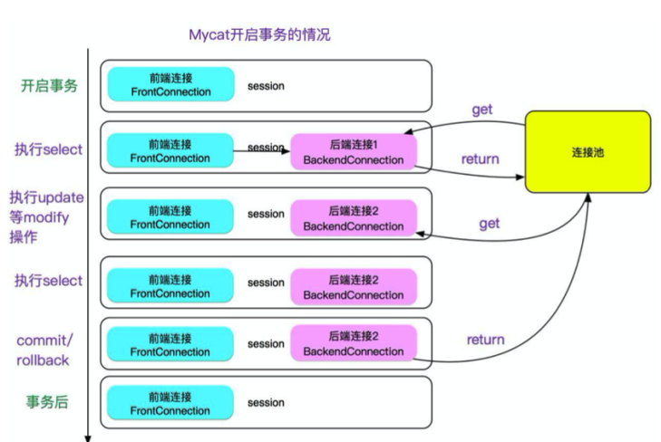

这样做的好处是可以保证连接可以最大限度的复用，提升性能。

但是,这就会导致两次 select 中如果有其它的在提交的话，会出现两次同样的 select 不一 致的现象,即不能 Repeatable Read，这会让人直连 MySQL 的人很困惑,可能会在依赖 Repeatable Read 的场景出现问题。所以做了一个开关,当 server.xml 的 system 配置了 strictTxIsolation=true 的时候，会关掉这个特性，以保证 repeatable read,加了开关 后如下图所示:

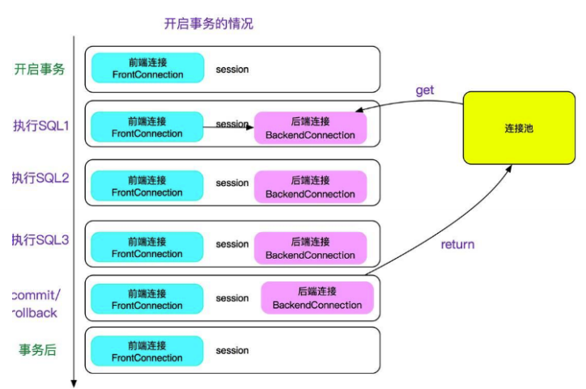

