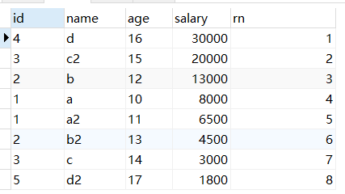
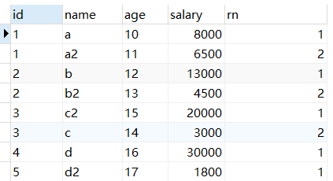
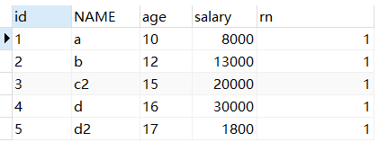
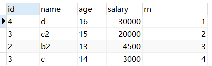

[toc]

# 1. row_number()over()

> 语法格式：row_number() over(partition by 分组列 order by 排序列 desc)

**row_number() over()**分组排序功能：在使用 row_number() over()函数时候，over()里头的分组以及排序的执行晚于 where 、group by、  order by 的执行.

## 1.1 表及数据

```sql
create table TEST_ROW_NUMBER_OVER(
       id varchar(10) not null,
       name varchar(10) null,
       age varchar(10) null,
       salary int null
);
select * from TEST_ROW_NUMBER_OVER t;
 
insert into TEST_ROW_NUMBER_OVER(id,name,age,salary) values(1,'a',10,8000);
insert into TEST_ROW_NUMBER_OVER(id,name,age,salary) values(1,'a2',11,6500);
insert into TEST_ROW_NUMBER_OVER(id,name,age,salary) values(2,'b',12,13000);
insert into TEST_ROW_NUMBER_OVER(id,name,age,salary) values(2,'b2',13,4500);
insert into TEST_ROW_NUMBER_OVER(id,name,age,salary) values(3,'c',14,3000);
insert into TEST_ROW_NUMBER_OVER(id,name,age,salary) values(3,'c2',15,20000);
insert into TEST_ROW_NUMBER_OVER(id,name,age,salary) values(4,'d',16,30000);
insert into TEST_ROW_NUMBER_OVER(id,name,age,salary) values(5,'d2',17,1800);
```

## 1.2 示例

1. 一次排序：对查询结果进行排序（无分组）

   ```sql
   select 
       id,
       name,
       age,
       salary,
       row_number()over(order by salary desc) rn
   from TEST_ROW_NUMBER_OVER t
   ```

   

2. 进一步排序：根据id分组排序

   ```sql
   select 
       id,
       name,
       age,
       salary,
       row_number()over(partition by id order by salary desc) rn
   from TEST_ROW_NUMBER_OVER t
   ```

   

3. 再一次排序：找出每一组中序号为1的数据

   ```sql
   SELECT * FROM 
   (
   	SELECT 
       id,
       NAME,
       age,
       salary,
       row_number() over (PARTITION BY id ORDER BY salary DESC) rn 
       FROM TEST_ROW_NUMBER_OVER
   ) t 
   WHERE t.rn<2
   ```

   

4. 排序找出年龄在13岁到16岁的数据，按salary排序

   ```sql
   select 
       id,
       name,
       age,
       salary,
   	row_number()over(order by salary desc)  rn
   from 
   	TEST_ROW_NUMBER_OVER t 
   where age between '13' and '16'
   ```

   


## 1.3 其他应用

1. 使用row_number() 函数进行编号

   ```sql
   select 
       email,
       customerID, 
       ROW_NUMBER() over(order by psd) as rows 
   from QT_Customer
   ```

   原理：先按psd进行排序，排序完后，给每条数据进行编号

2. 在订单中按价格的升序进行排序，并给每条记录进行排序

   ```sql
   select 
       DID,
       customerID,
       totalPrice,
       ROW_NUMBER() over(order by totalPrice) as rows 
   from OP_Order
   ```

3. 统计出每一个客户的所有订单并按每个客户下的订单金额 升序排序，同时给每一个客户的订单进行编号。这样就知道每个客户下几单了：

   ```sql
   select 
       ROW_NUMBER() over(partition by customerID  order by totalPrice) as rows,
       customerID,
       totalPrice, 
       DID 
   from OP_Order
   ```

4. 统计每一个客户最近下的订单是第几次下的订单：

   ```sql
   with tabs as  
   (  
   	select 
           ROW_NUMBER() over(partition by customerID  order by totalPrice)as rows,
           customerID,
           totalPrice, 
           DID 
       from OP_Order  
    )  
   select 
   	MAX(rows) as '下单次数',
   	customerID 
   from tabs 
   group by customerID 
   ```

5. 统计每一个客户所有的订单中购买的金额最小，而且并统计改订单中，客户是第几次购买的：

   思路：利用临时表来执行这一操作

   - 先按客户进行分组，然后按客户的下单的时间进行排序，并进行编号。
   - 然后利用子查询查找出一个客户购买时的最小价格。
   - 根据查找出每一个客户的最小价格来查找相应的记录。

   ```sql
   with tabs as  
   (  
       select 
           ROW_NUMBER() over(partition by customerID  order by insDT) as rows,
           customerID,
           totalPrice, 
           DID 
       from OP_Order  
   )  
   select * from tabs  
   where totalPrice in   
   (  
   	select MIN(totalPrice) from tabs group by customerID  
   ) 
   ```

6. 筛选出客户第一次下的订单。

   思路：利用rows=1来查询客户第一次下的订单记录

   ```sql
   with tabs as  
   (  
   	select 
           ROW_NUMBER() over(partition by customerID  order by insDT) as rows,
           * 
       from OP_Order  
   )  
   select * from tabs where rows = 1 
   select * from OP_Order 
   ```

**注意：在使用over等开窗函数时，over里头的分组及排序的执行晚于“where，group by，order by”的执行**


# 2. with xx as

> 类似子查询，可以全局访问该子查询

如果只用一次，和子查询一样

如果用来多次，执行器会优化，将改子查询片段生成临时表，后面直接用临时表。I/O比较多


# 时间差函数

## datediff函数

datediff函数，返回值是相差的天数

```sql
select datediff('2018-03-22 09:00:00','2018-03-20 07:00:00')
```


## timestampdiff函数

timestampdiff函数，有参数设置，可以精确到天（DAY）、小时（HOUR）、分钟（MINUTE）和秒（SECOND）

使用起来比datediff函数更加灵活，==对于比较的两个时间，时间小的放在前面，时间大的放在后面==

```sql
--相差1天
select TIMESTAMPDIFF(DAY, '2018-03-20 23:59:00', '2015-03-22 00:00:00');

--相差49小时
select TIMESTAMPDIFF(HOUR, '2018-03-20 09:00:00', '2018-03-22 10:00:00');

--相差2940分钟
select TIMESTAMPDIFF(MINUTE, '2018-03-20 09:00:00', '2018-03-22 10:00:00');

--相差176400秒
select TIMESTAMPDIFF(SECOND, '2018-03-20 09:00:00', '2018-03-22 10:00:00');
```

