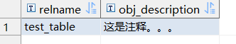
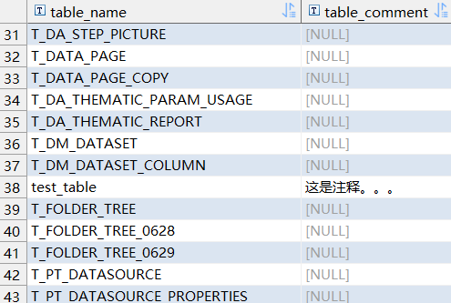
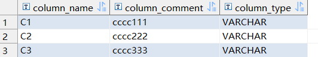
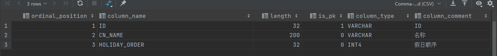

[TOC]


> 和postgre sql类似，把postgre sql的pg改成sys即可

# 查询库下的表信息

1. 查询库下有哪些表

   ```sql
   SELECT
   	t.table_name
   FROM
   	information_schema.tables t
   WHERE
   	table_catalog = 'DATA_BI'
   	AND table_schema = 'public'
   ```

2. 查询具体某张表的注释

   ```sql
   SELECT
   	relname,
   	sys_catalog.obj_description(
   		oid,
   		'sys_class'
   	)
   FROM sys_class
   WHERE relname = 'test_table'
   ```

   

3. 查询库下表名以及注释

   ```sql
   SELECT
   	t.table_name,
   	obj_description(t1.OID,'sys_class') table_comment
   FROM
   	information_schema.tables t,
   	(SELECT relname,OID FROM sys_catalog.sys_class) t1
   WHERE
   	t.table_name = t1.relname 
   	AND table_catalog = 'DATA_BI'
   	AND table_schema = 'public'
   ORDER BY table_name
   ```

   

# 查询表下字段信息

1. 查询表下字段信息（字段名+注释+类型）

   ```sql
   SELECT
   	t1.*,
   	t2.udt_name column_type 
   FROM
   (
   	SELECT
   		a.attname column_name,
   		sys_catalog.col_description ( a.attrelid, a.attnum ) column_comment 
   	FROM
   		sys_catalog.sys_attribute a 
   	WHERE
   		a.attrelid =(
   		SELECT
   			OID 
   		FROM
   			sys_class 
   		WHERE
   			relname = 'test_table'  --表名称
   		) 
   		AND a.attnum > 0 
   		AND NOT a.attisdropped 
   	ORDER BY
   		a.attnum 
   ) t1
   LEFT JOIN 
   ( 
       SELECT 
       	column_name, 
       	udt_name 
       FROM information_schema.COLUMNS 
       WHERE 
       	table_schema = 'public' 
       	AND table_name = 'test_table' --表名称
   ) t2 
   ON t1.column_name = t2.column_name
   ```

   

# 查询表的主键信息

```sql
select sys_constraint.conname as pk_name, sys_attribute.attname as colname, sys_type.typname as typename
from sys_constraint
         inner join sys_class
                    on sys_constraint.conrelid = sys_class.oid
         inner join sys_attribute on sys_attribute.attrelid = sys_class.oid
    and sys_attribute.attnum = sys_constraint.conkey[1]
         inner join sys_type on sys_type.oid = sys_attribute.atttypid
where sys_class.relname = 'T_COMMON_HOLIDAY'
  and sys_constraint.contype = 'p'
```


# 查询表字段中文，注释，类型，长度，是否主键

```sql
select t1.*, t2.column_comment
from (
         SELECT A.ordinal_position,
                A.column_name,
                coalesce(A.character_maximum_length, A.numeric_precision, -1) as length,
                CASE WHEN length(B.attname) > 0 THEN 1 ELSE 0 END             AS is_pk,
                A.udt_name                                                    as column_type
         FROM information_schema.columns A
                  LEFT JOIN (
             SELECT distinct (sys_attribute.attname)
             FROM sys_index,
                  sys_class,
                  sys_attribute
             WHERE sys_class.oid = 'T_COMMON_HOLIDAY' :: regclass
 AND sys_index.indrelid = sys_class.oid
 AND sys_attribute.attrelid = sys_class.oid
 AND sys_attribute.attnum = ANY (sys_index.indkey)
         ) B ON A.column_name = b.attname
         WHERE A.table_schema = 'public'
           AND A.table_name = 'T_COMMON_HOLIDAY'
         ORDER BY ordinal_position ASC
     ) t1
         left join(
    SELECT a.attname                                         column_name,
           sys_catalog.col_description(a.attrelid, a.attnum) column_comment
    FROM sys_catalog.sys_attribute a
    WHERE a.attrelid = (
        SELECT OID
        FROM sys_class
        WHERE relname = 'T_COMMON_HOLIDAY' --表名称
    )
      AND a.attnum > 0
      AND NOT a.attisdropped
    ORDER BY a.attnum) t2
                  on t1.column_name = t2.column_name
```

