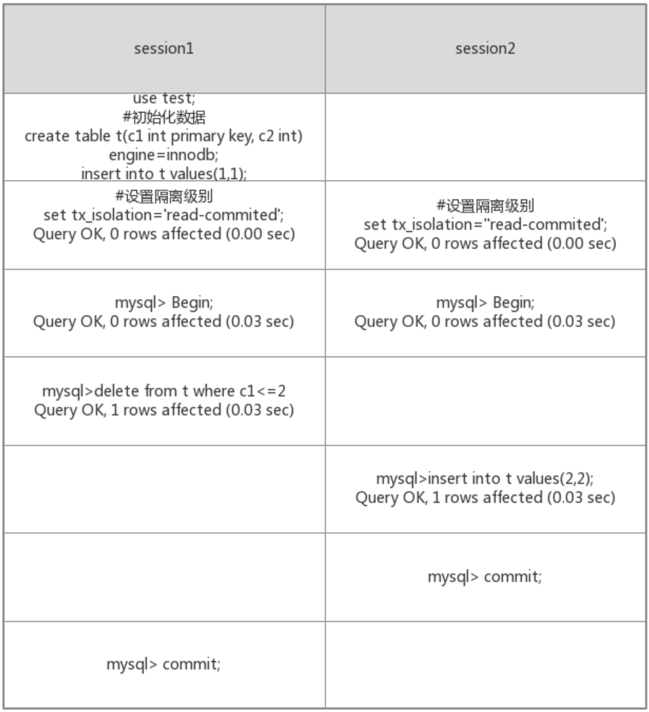

[TOC]

# 1. 事务的传播机制

1. required(TransactionDefinition.PROPAGATION_REQUIRED) — ==默认传播机制==
   支持当前事务，如果没有事务会创建一个新的事务

   > 外层有事务，加入外层事务；外层没有事务，新建一个事务

2. supports(TransactionDefinition.PROPAGATION_SUPPORTS)
   支持当前事务，如果没有事务的话以非事务方式执行

   > 外层有事务，加入外层事务；外层没有事务，非事务执行

3. mandatory(TransactionDefinition.PROPAGATION_MANDATORY)
   支持当前事务，如果没有事务抛出异常

   > 外层必须有事务，没有事务抛出异常

4. requires_new(TransactionDefinition.PROPAGATION_REQUIRES_NEW)
   创建一个新的事务并挂起当前事务

   > 把外层事务挂起，当前事务执行完毕，恢复上层事务。如果外层没有事务，新开启一个即可

5. not_supported(TransactionDefinition.PROPAGATION_NOT_SUPPORTED)
   以非事务方式执行，如果当前存在事务则将当前事务挂起

   > 

6. never(TransactionDefinition.PROPAGATION_NEVER)
   以非事务方式进行，如果存在事务则抛出异常

   > 

7. nested(TransactionDefinition.PROPAGATION_NESTED) /nai si tei de/
   如果当前存在事务，则在嵌套事务内执行。如果当前没有事务，则进行与PROPAGATION_REQUIRED类似的操作。

   > 主事务和嵌套事务属于同一个事务
   >
   > 嵌套事务出错回滚不会影响到主事务
   >
   > 主事务回滚会将嵌套事务一起回滚了

# 2. Spring事务隔离级别

## 2.1 事务并发引起的三种情况

**1) Dirty Reads 脏读** 
一个事务正在对数据进行更新操作，但是更新还未提交，另一个事务这时也来操作这组数据，并且读取了前一个事务还未提交的数据，而前一个事务如果操作失败进行了回滚，后一个事务读取的就是错误数据，这样就造成了脏读。

**2) Non-Repeatable Reads 不可重复读** 
一个事务多次读取同一数据，在该事务还未结束时，另一个事务也对该数据进行了操作，而且在第一个事务两次次读取之间，第二个事务对数据进行了更新，那么第一个事务前后两次读取到的数据是不同的，这样就造成了不可重复读。

**3) Phantom Reads 幻像读** 
第一个数据正在查询符合某一条件的数据，这时，另一个事务又插入了一条符合条件的数据，第一个事务在第二次查询符合同一条件的数据时，发现多了一条前一次查询时没有的数据，仿佛幻觉一样，这就是幻像读。

**非重复度和幻像读的区别：**
非重复读是指同一查询在同一事务中多次进行，由于其他提交事务所做的修改或删除，每次返回不同的结果集，此时发生非重复读。

幻像读是指同一查询在同一事务中多次进行，由于其他提交事务所做的插入操作，每次返回不同的结果集，此时发生幻像读。

表面上看，区别就在于非重复读能看见其他事务提交的修改和删除，而幻像能看见其他事务提交的插入。 

## 2.2 隔离级别

**1) DEFAULT （默认）** 
这是一个PlatfromTransactionManager默认的隔离级别，使用数据库默认的事务隔离级别。另外四个与JDBC的隔离级别相对应。

**2) READ_UNCOMMITTED （读未提交）** 
这是事务最低的隔离级别，它允许另外一个事务可以看到这个事务未提交的数据。这种隔离级别会产生脏读，不可重复读和幻像读。 

**3) READ_COMMITTED （读已提交）** 
保证一个事务修改的数据提交后才能被另外一个事务读取，另外一个事务不能读取该事务未提交的数据。这种事务隔离级别可以避免脏读出现，但是可能会出现不可重复读和幻像读。 

**4) REPEATABLE_READ （可重复读）** /rui pi te bo/
这种事务隔离级别可以防止脏读、不可重复读，但是可能出现幻像读。它除了保证一个事务不能读取另一个事务未提交的数据外，还保证了不可重复读。

**5) SERIALIZABLE（串行化）** 
这是花费最高代价但是最可靠的事务隔离级别，事务被处理为顺序执行。除了防止脏读、不可重复读外，还避免了幻像读。 

# 3. 为什么MySQL默认隔离级别是repeatable-read

> 原因：因为主从复制，binlog的问题

binlog记录的是commit之后的sql语句

如果默认级别是read_uncommited。如下图，最终主节点先删除，后新增，数据库中有一条记录

但是，binlog按照commit顺序记录日志，binlog记录的是先新增，再删除，最后导致从节点数据库中没有数据！！！