[TOC]


# 一、 Spring概述

## 第1节 Spring简介

Spring 是分层的 full-stack（全栈） 轻量级开源框架，以 IoC 和 AOP 为内核，提供了展现层 Spring
MVC 和业务层事务管理等众多的企业级应用技术，还能整合开源世界众多著名的第三方框架和类库，已
经成为使用最多的 Java EE 企业应用开源框架。
Spring 官方地址：http://spring.io/
我们经常说的 Spring 其实指的是Spring Framework（spring 框架）。

## 第2节 Spring发展历程

- 1997年IBM提出了EJB的思想；1998年SUN指定了开发标准规范EJB1.0；1999年EJB 1.1发布；2001年EJB 2.0发布；2003年EJB 2.1发布；2006年 EJB 3.0发布

- Rod Johnson(Spring之父)

  - Expert One-to-One J2EE Design and Development(2002) 阐述了J2EE使用EJB开发设计的优

    点及解决方案

  - Expert One-to-One J2EE Development without EJB(2004) 阐述了J2EE开发不使用EJB的解决

    方式（Spring雏形）

  2017 年 9 月份发布了 Spring 的最新版本 Spring 5.0 通用版（GA） 

## 第3节 Spring的优势

> 整个Spring优势，传出一个信号，Spring是一个综合性，且有很强的思想性框架，每学习一天，就能体会到它的一些优势

- **方便解耦，简化开发**

  通过Spring提供的IoC容器，可以将对象间的依赖关系交由Spring进行控制，避免硬编码所造成的过度程序耦合。用户也不必再为单例模式类、属性文件解析等这些很底层的需求编写代码，可以更专注于上层的应用

- **AOP编程的支持**

  通过Spring的AOP功能，方便进行面向切面的编程，许多不容易用传统OOP实现的功能可以通过AOP轻松应付。

- **声明式的支持**

  @Transactional可以将我们从单调烦闷的事务管理代码中解脱出来，通过声明式方式灵活的进行事务的管理，提高开发效率和质量。

- **方便程序的测试**

  可以用非容器依赖的编程方式进行几乎所有的测试工作，测试不再是昂贵的操作，而是随手可做的事情。

- **方便集成各种优秀框架**

  Spring可以降低各种框架的使用难度，提供了对各种优秀框架（Struts、Hibernate、Hessian、Quartz等）的直接支持。

- **降低JavaEE API的使用难度**

  Spring对JavaEE API（如JDBC、JavaMail、远程调用等）进行了薄薄的封装层，使这些API的使用难度大为降低

- **源码是经典的 Java 学习范例**

  Spring的源代码设计精妙、结构清晰、匠心独用，处处体现着大师对Java设计模式灵活运用以及对Java技术的高深造诣。它的源代码无意是Java技术的最佳实践的范例。

## 第4节 Spring的核心

Spring是一个分层非常清晰并且依赖关系、职责定位非常明确的轻量级框架，主要包括几个大模块：数据处理模块、Web模块、AOP（Aspect Oriented Programming）/Aspects模块、Core Container模块和 Test 模块，如下图所示，Spring依靠这些基本模块，实现了一个令人愉悦的融合了现有解决方案的零侵入的轻量级框架。

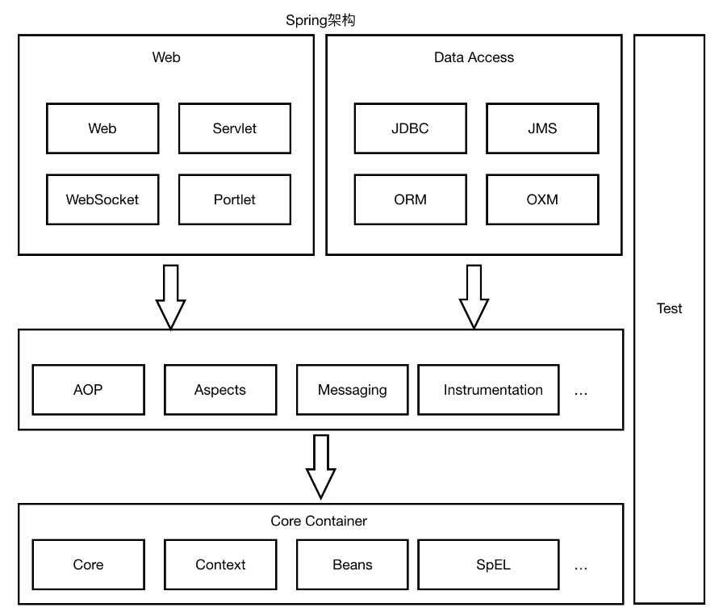

- Spring核心容器（Core Container）容器是Spring框架最核心的部分，它管理着Spring应用中bean的创建、配置和管理。在该模块中，包括了Spring bean工厂，它为Spring提供了DI的功能。基于bean工厂，我们还会发现有多种Spring应用上下文的实现。所有的Spring模块都构建于核心容器之上

- 面向切面编程（AOP）/AspectsSpring对面向切面编程提供了丰富的支持。这个模块是Spring应用系统中开发切面的基础，与DI一样，AOP可以帮助应用对象解耦。

- 数据访问与集成（Data Access/Integration）

  Spring的JDBC和DAO模块封装了大量样板代码，这样可以使得数据库代码变得简洁，也可以更专注于我们的业务，还可以避免数据库资源释放失败而引起的问题。另外，Spring AOP为数据访问提供了事务管理服务，同时Spring还对ORM进行了集成，如Hibernate、MyBatis等。该模块由JDBC、Transactions、ORM、OXM 和 JMS 等模块组成

- Web该模块提供了SpringMVC框架给Web应用，还提供了多种构建和其它应用交互的远程调用方案。SpringMVC框架在Web层提升了应用的松耦合水平

- Test为了使得开发者能够很方便的进行测试，Spring提供了测试模块以致力于Spring应用的测试。通过该模块，Spring为使用Servlet、JNDI等编写单元测试提供了一系列的mock对象实现

## 第5节 Spring框架版本

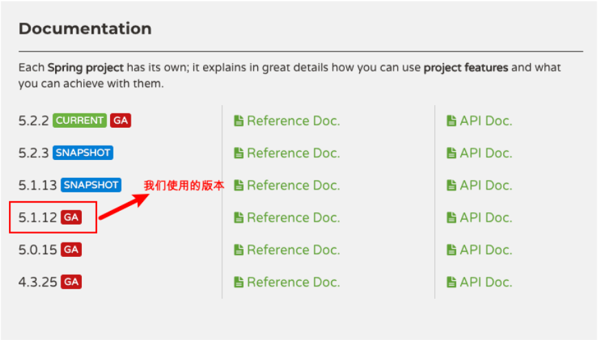

Spring Framework不同版本对 Jdk 的要求

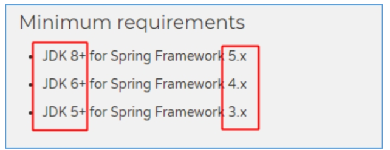


JDK 11.0.5

IDE idea 2019

Maven 3.6.x

# 二、 核心思想

注意：IOC和AOP不是spring提出的，在spring之前就已经存在，只不过更偏向于理论化，spring在技术层次把这两个思想做了非常好的实现（Java）

## 第1节 IOC

### 1.1 什么是IOC？

IoC Inversion of Control (控制反转/反转控制)，注意它是一个技术思想，不是一个技术实现

描述的事情：Java开发领域对象的创建，管理的问题

传统开发方式：比如类A依赖于类B，往往会在类A中new一个B的对象

IoC思想下开发方式：我们不用自己去new对象了，而是由IoC容器（Spring框架）去帮助我们实例化对象并且管理它，我们需要使用哪个对象，去问IoC容器要即可

我们丧失了一个权利（创建、管理对象的权利）,得到了一个福利（不用考虑对象的创建、管理等一系列事情）

**为什么叫做控制反转？**

控制：指的是对象创建（实例化、管理）的权利

反转：控制权交给外部环境了（spring框架、IoC容器）

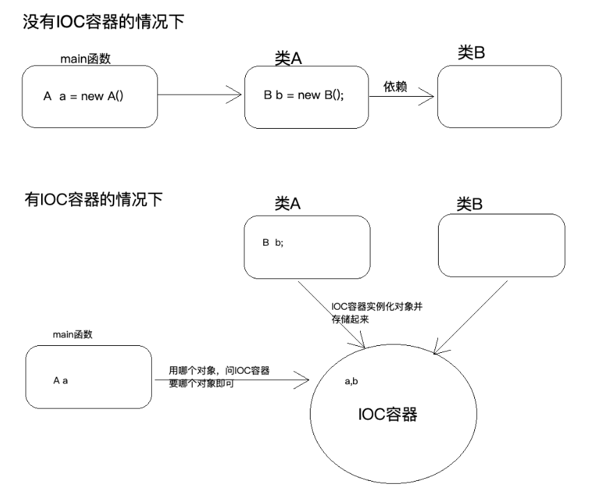


### 1.2 IoC解决了什么问题

**IoC解决对象之间的耦合问题**


### 1.3 IoC和DI的区别

DI：Dependancy Injection（依赖注入）

怎么理解：IOC和DI描述的是同一件事情，只不过角度不一样罢了

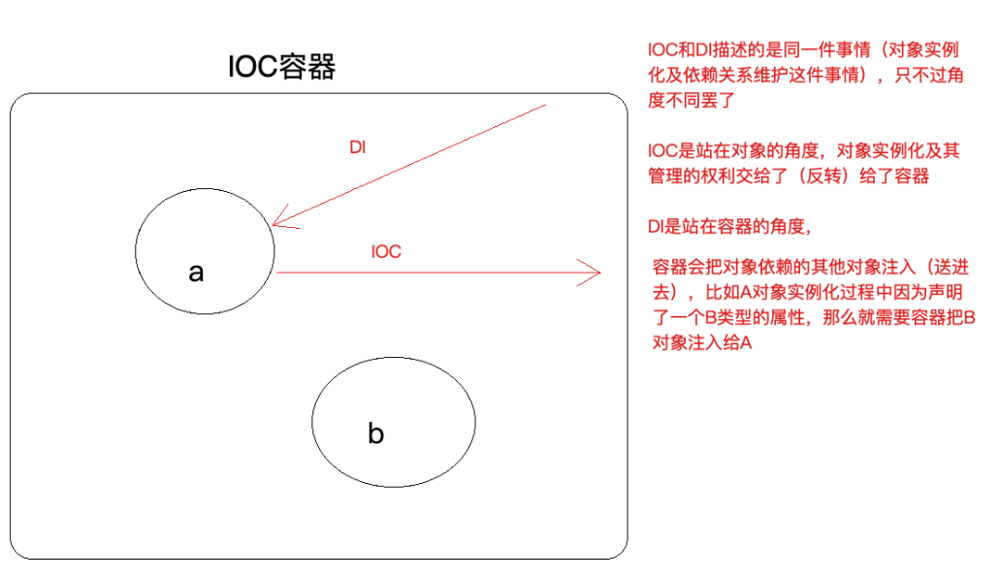


## 第2节 AOP

### 2.1 什么是AOP

AOP: Aspect oriented Programming 面向切面编程/面向方面编程

AOP是OOP的延续，从OOP说起

OOP三大特征：封装、继承和多态

oop是一种垂直继承体系

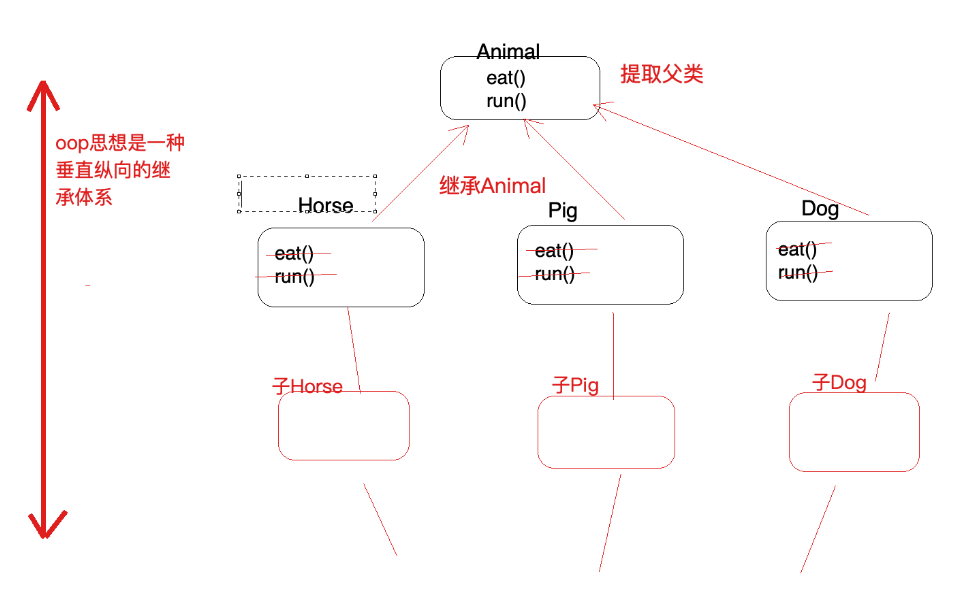

OOP编程思想可以解决大多数的代码重复问题，但是有一些情况是处理不了的，比如下面的在顶级父类Animal中的多个方法中相同位置出现了重复代码，OOP就解决不了

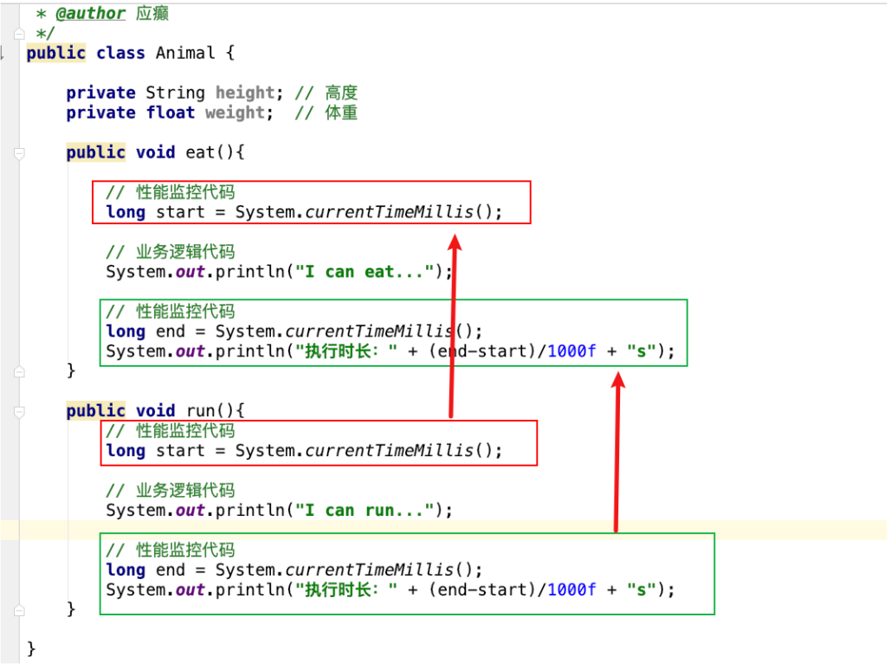

横切逻辑代码

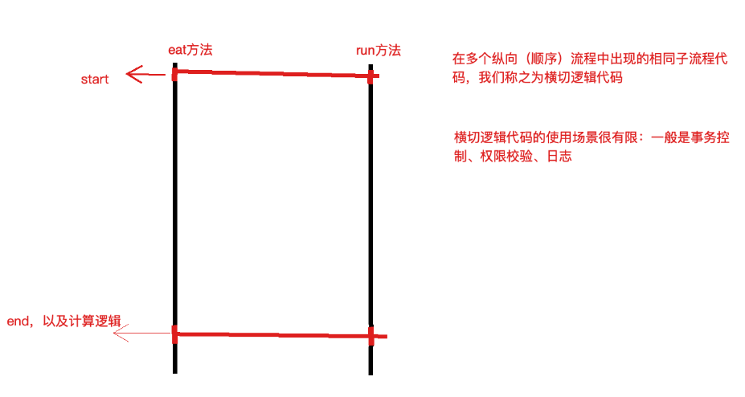

横切逻辑代码存在什么问题：

- 横切代码重复问题
- 横切逻辑代码和业务代码混杂在一起，代码臃肿，维护不方便

AOP出场，AOP独辟蹊径提出横向抽取机制，将横切逻辑代码和业务逻辑代码分析

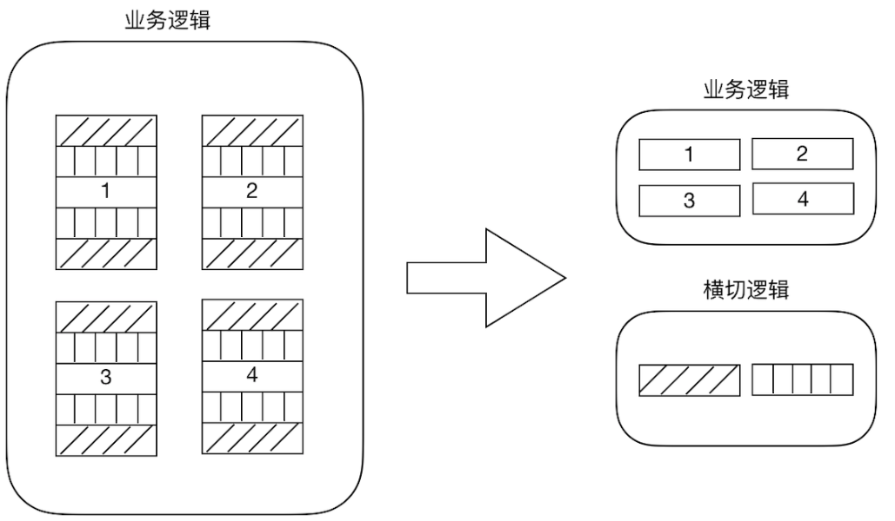

代码拆分容易，那么如何在不改变原有业务逻辑的情况下，悄无声息的把横切逻辑代码应用到原有的业务逻辑中，达到和原来一样的效果，这个是比较难的

### 2.2 AOP在解决什么问题

在不改变原有业务逻辑情况下，增强横切逻辑代码，根本上解耦合，避免横切逻辑代码重复

### 2.3 为什么叫面向切面编程

「切」：指的是横切逻辑，原有业务逻辑代码我们不能动，只能操作横切逻辑代码，所以面向横切逻辑

「面」：横切逻辑代码往往要影响的是很多个方法，每一个方法都如同一个点，多个点构成面，有一个面的概念在里面


# 三、 手写IOC和AOP

上一部分我们理解了 IoC 和 AOP 思想，我们先不考虑 Spring 是如何实现这两个思想的，此处准备了一个『银行转账』的案例，请分析该案例在代码层次有什么问题？分析之后使用我们已有知识解决这些问题（痛点）。其实这个过程我们就是在一步步分析并手写实现 IoC 和 AOP。

## 第1节 银行转账案例界面

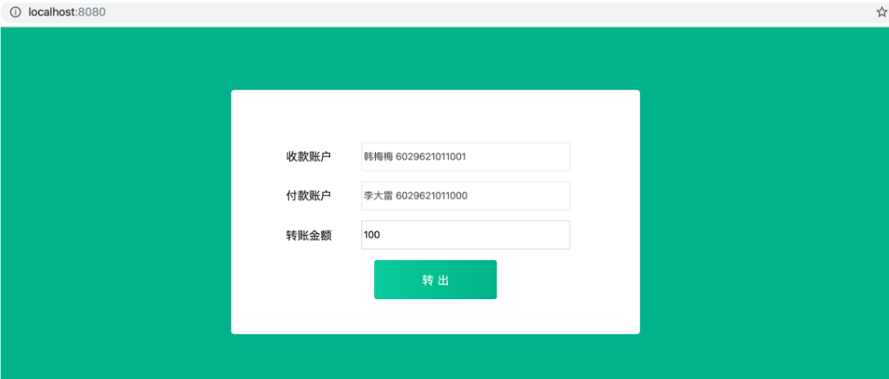


## 第2节 银行转账案例表结构

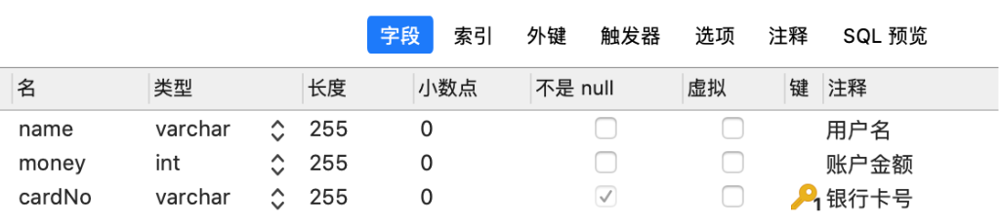

## 第3节 银行转账案例代码调用关系

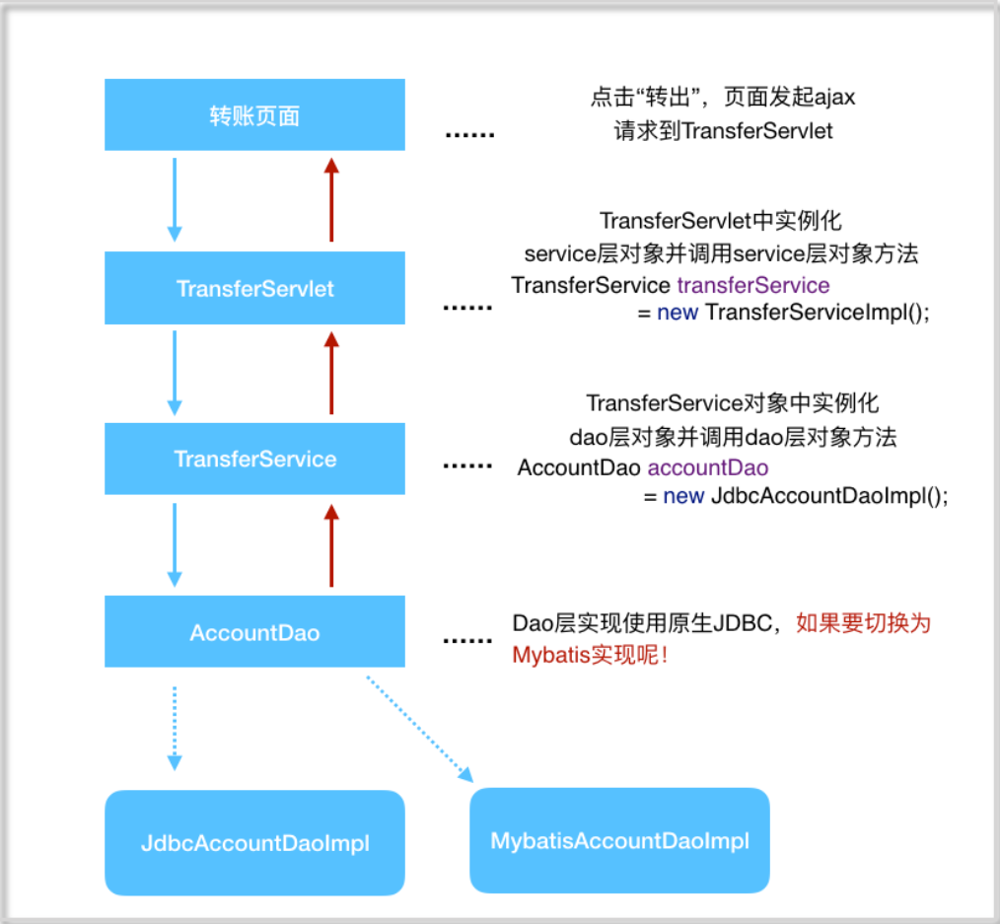

## 第4节 银行转账案例关键代码

- TransferServlet

  ```java
  package com.lagou.edu.servlet;
  import com.lagou.edu.service.impl.TransferServiceImpl;
  import com.lagou.edu.utils.JsonUtils;
  import com.lagou.edu.pojo.Result;
  import com.lagou.edu.service.TransferService;
  import javax.servlet.ServletException;
  import javax.servlet.annotation.WebServlet;
  import javax.servlet.http.HttpServlet;
  import javax.servlet.http.HttpServletRequest;
  import javax.servlet.http.HttpServletResponse;
  import java.io.IOException;
  /**
  * @author 应癫
  */
  @WebServlet(name="transferServlet",urlPatterns = "/transferServlet")
  public class TransferServlet extends HttpServlet {
      // 1. 实例化service层对象
      private TransferService transferService = new TransferServiceImpl();
      @Override
      protected void doGet(HttpServletRequest req, HttpServletResponse resp)
          throws ServletException, IOException {
          doPost(req,resp);
      }
      @Override
      protected void doPost(HttpServletRequest req, HttpServletResponse
                            resp) throws ServletException, IOException {
          // 设置请求体的字符编码
          req.setCharacterEncoding("UTF-8");
          String fromCardNo = req.getParameter("fromCardNo");
          String toCardNo = req.getParameter("toCardNo");
          String moneyStr = req.getParameter("money");
          int money = Integer.parseInt(moneyStr);
          Result result = new Result();
          try {
              // 2. 调⽤service层⽅法
              transferService.transfer(fromCardNo,toCardNo,money);
              result.setStatus("200");
          } catch (Exception e) {
              e.printStackTrace();
              result.setStatus("201");
              result.setMessage(e.toString());
          }
          // 响应
          resp.setContentType("application/json;charset=utf-8");
          resp.getWriter().print(JsonUtils.object2Json(result));
      }
  }
  ```

- TransferService接口及实现类

  ```java
  package com.lagou.edu.service;
  /**
  * @author 应癫
  */
  public interface TransferService {
      void transfer(String fromCardNo,String toCardNo,int money) throws Exception; 
  }
  ```

  ```java
  package com.lagou.edu.service.impl;
  import com.lagou.edu.dao.AccountDao;
  import com.lagou.edu.dao.impl.JdbcAccountDaoImpl;
  import com.lagou.edu.pojo.Account;
  import com.lagou.edu.service.TransferService;
  /**
  * @author 应癫
  */
  public class TransferServiceImpl implements TransferService {
      private AccountDao accountDao = new JdbcAccountDaoImpl();
      @Override
      public void transfer(String fromCardNo, String toCardNo, int money)
          throws Exception {
          Account from = accountDao.queryAccountByCardNo(fromCardNo);
          Account to = accountDao.queryAccountByCardNo(toCardNo);
          from.setMoney(from.getMoney()-money);
          to.setMoney(to.getMoney()+money);
          accountDao.updateAccountByCardNo(from);
          accountDao.updateAccountByCardNo(to);
      }
  }
  ```

- AccountDao层接口及基于Jdbc的实现类

  ```java
  package com.lagou.edu.dao;
  import com.lagou.edu.pojo.Account;
  /**
  * @author 应癫
  */
  public interface AccountDao {
      Account queryAccountByCardNo(String cardNo) throws Exception;
      int updateAccountByCardNo(Account account) throws Exception; }
  ```

- JdbcAccountDaoImpl（Jdbc技术实现Dao层接⼝）

  ```java
  package com.lagou.edu.dao.impl;
  import com.lagou.edu.pojo.Account;
  import com.lagou.edu.dao.AccountDao;
  import com.lagou.edu.utils.DruidUtils;
  import java.sql.Connection;
  import java.sql.PreparedStatement;
  import java.sql.ResultSet;
  /**
  * @author 应癫
  */
  public class JdbcAccountDaoImpl implements AccountDao {
      @Override
      public Account queryAccountByCardNo(String cardNo) throws Exception {
          //从连接池获取连接
          Connection con = DruidUtils.getInstance().getConnection();
          String sql = "select * from account where cardNo=?";
          PreparedStatement preparedStatement = con.prepareStatement(sql);
          preparedStatement.setString(1,cardNo);
          ResultSet resultSet = preparedStatement.executeQuery();
          Account account = new Account();
          while(resultSet.next()) {
              account.setCardNo(resultSet.getString("cardNo"));
              account.setName(resultSet.getString("name"));
              account.setMoney(resultSet.getInt("money"));
          }
          resultSet.close();
          preparedStatement.close();
          con.close();
          return account;
      }
  
      @Override
      public int updateAccountByCardNo(Account account) throws Exception {
          //从连接池获取连接
          Connection con = DruidUtils.getInstance().getConnection();
          String sql = "update account set money=? where cardNo=?";
          PreparedStatement preparedStatement = con.prepareStatement(sql);
          preparedStatement.setInt(1,account.getMoney());
          preparedStatement.setString(2,account.getCardNo());
          int i = preparedStatement.executeUpdate();
          preparedStatement.close();
          con.close();
          return i;
      }
  }
  ```

  

## 第5节 银行转账案例代码问题分析

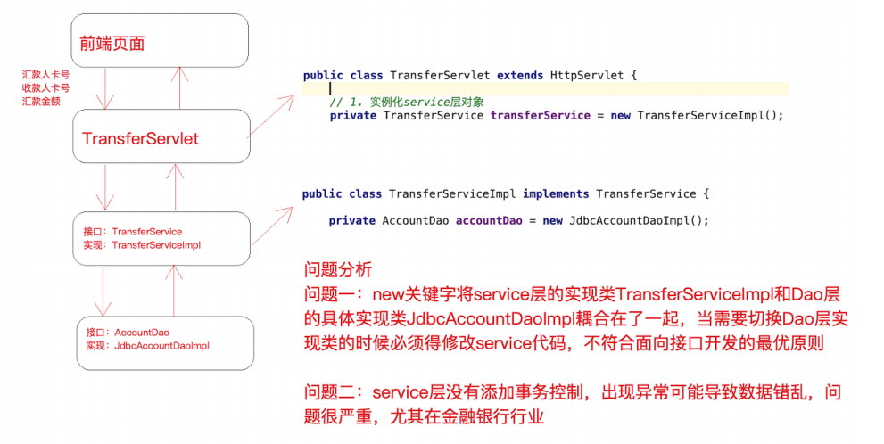

（1）问题一：在上述案例实现中，service 层实现类在使用 dao 层对象时，直接在TransferServiceImpl 中通过AccountDao accountDao = new JdbcAccountDaoImpl() 获得了 dao层对象，然而一个 new 关键字却将 TransferServiceImpl 和 dao 层具体的一个实现类JdbcAccountDaoImpl 耦合在了一起，如果说技术架构发生一些变动，dao 层的实现要使用其它技术，比如 Mybatis，思考切换起来的成本？每一个 new 的地方都需要修改源代码，重新编译，面向接口开发的意义将大打折扣？

（2）问题二：service 层代码没有竟然还没有进行事务控制？！如果转账过程中出现异常，将可能导致数据库数据错乱，后果可能会很严重，尤其在金融业务。

## 第6节 问题解决思路

- 针对问题一思考：
  - 实例化对象的方式除了 new 之外，还有什么技术？反射 (需要把类的全限定类名配置在xml中)
- 考虑使用设计模式中的工厂模式解耦合，另外项目中往往有很多对象需要实例化，那就在工厂中使用反射技术实例化对象，工厂模式很合适

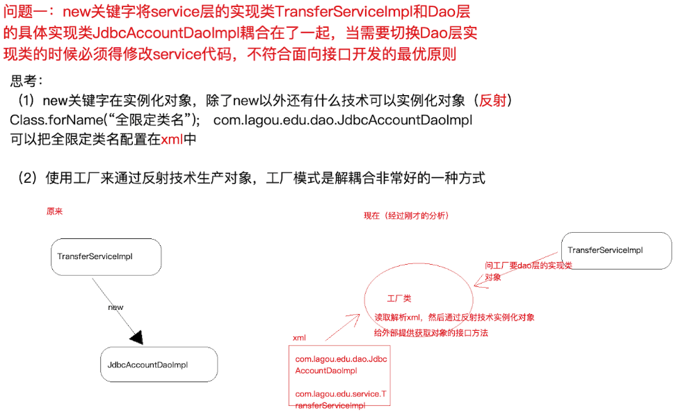

- 更进一步，代码中能否只声明所需实例的接口类型，不出现 new 也不出现工厂类的字眼，如下图？能！声明一个变量并提供 set 方法，在反射的时候将所需要的对象注入进去吧

  

- 针对问题二思考：

  - service 层没有添加事务控制，怎么办？没有事务就添加上事务控制，手动控制 JDBC 的Connection 事务，但要注意将Connection和当前线程绑定（即保证一个线程只有一个Connection，这样操作才针对的是同一个 Connection，进而控制的是同一个事务）

    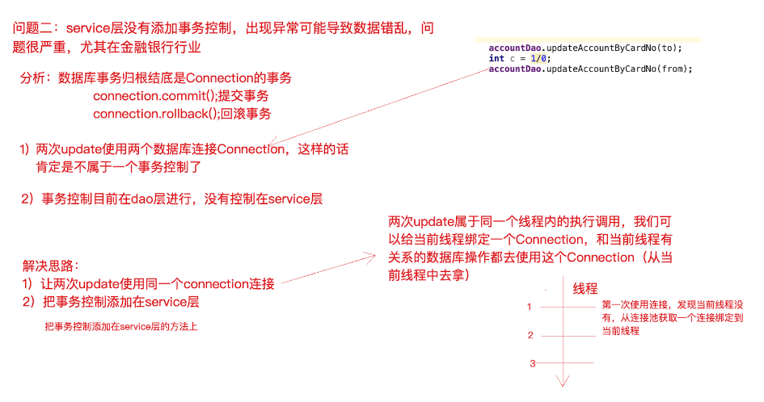

    

## 第7节 案例代码改造

（1）针对问题一的代码改造

- beans.xml

  ```xml
  <?xml version="1.0" encoding="UTF-8" ?>
  <beans>
      <bean id="transferService"
            class="com.lagou.edu.service.impl.TransferServiceImpl">
          <property name="AccountDao" ref="accountDao"></property>
      </bean>
      <bean id="accountDao"
            class="com.lagou.edu.dao.impl.JdbcAccountDaoImpl">
      </bean>
  </beans>
  ```

- 增加BeanFactory.java

  ```java
  package com.lagou.edu.factory;
  import org.dom4j.Document;
  import org.dom4j.DocumentException;
  import org.dom4j.Element;
  import org.dom4j.io.SAXReader;
  import java.io.InputStream;
  import java.lang.reflect.InvocationTargetException;
  import java.lang.reflect.Method;
  import java.util.HashMap;
  import java.util.List;
  import java.util.Map;
  /**
  * @author 应癫
  */
  public class BeanFactory {
      /**
   * ⼯⼚类的两个任务
   * 任务⼀：加载解析xml，读取xml中的bean信息，通过反射技术实例化bean对象，然后放⼊
  map待⽤
   * 任务⼆：提供接⼝⽅法根据id从map中获取bean（静态⽅法）
   */
      private static Map<String,Object> map = new HashMap<>();
      static {
          InputStream resourceAsStream =
              BeanFactory.class.getClassLoader().getResourceAsStream("beans.xml");
          SAXReader saxReader = new SAXReader();
          try {
              Document document = saxReader.read(resourceAsStream);
              Element rootElement = document.getRootElement();
              List<Element> list = rootElement.selectNodes("//bean");
              // 实例化bean对象
              for (int i = 0; i < list.size(); i++) {
                  Element element = list.get(i);
                  String id = element.attributeValue("id");
                  String clazz = element.attributeValue("class");
                  Class<?> aClass = Class.forName(clazz);
                  Object o = aClass.newInstance();
                  map.put(id,o);
              }
              // 维护bean之间的依赖关系
              List<Element> propertyNodes =
                  rootElement.selectNodes("//property");
              for (int i = 0; i < propertyNodes.size(); i++) {
                  Element element = propertyNodes.get(i);
                  // 处理property元素
                  String name = element.attributeValue("name");
                  String ref = element.attributeValue("ref");
  
                  String parentId =
                      element.getParent().attributeValue("id");
                  Object parentObject = map.get(parentId);
                  Method[] methods = parentObject.getClass().getMethods();
                  for (int j = 0; j < methods.length; j++) {
                      Method method = methods[j];
                      if(("set" + name).equalsIgnoreCase(method.getName()))
                      {
                          // bean之间的依赖关系（注⼊bean）
                          Object propertyObject = map.get(ref);
                          method.invoke(parentObject,propertyObject);
                      }
                  }
                  // 维护依赖关系后重新将bean放⼊map中
                  map.put(parentId,parentObject);
              }
          } catch (DocumentException e) {
              e.printStackTrace();
          } catch (ClassNotFoundException e) {
              e.printStackTrace();
          } catch (IllegalAccessException e) {
              e.printStackTrace();
          } catch (InstantiationException e) {
              e.printStackTrace();
          } catch (InvocationTargetException e) {
              e.printStackTrace();
          }
      }
      public static Object getBean(String id) {
          return map.get(id);
      }
  }
  ```

- 修改TransferServlet

  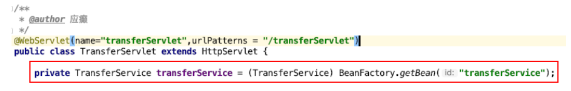

- 修改TransferServiceImpl

  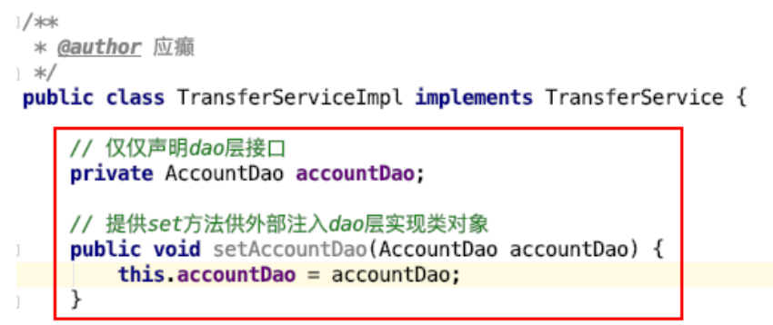

（2）针对问题二的改造

- 增加ConnectionUtils

  ```java
  package com.lagou.edu.utils;
  import java.sql.Connection;
  import java.sql.SQLException;
  /**
  * @author 应癫
  */
  public class ConnectionUtils {
      /*private ConnectionUtils() {}
       private static ConnectionUtils connectionUtils = new ConnectionUtils();
       public static ConnectionUtils getInstance() {
       return connectionUtils;
       }*/
      private ThreadLocal<Connection> threadLocal = new ThreadLocal<>(); //
      存储当前线程的连接
          /**
           * 从当前线程获取连接
           */
          public Connection getCurrentThreadConn() throws SQLException {
          /**
           * 判断当前线程中是否已经绑定连接，如果没有绑定，需要从连接池获取⼀个连接绑定到
          当前线程
           */
          Connection connection = threadLocal.get();
          if(connection == null) {
              // 从连接池拿连接并绑定到线程
              connection = DruidUtils.getInstance().getConnection();
              // 绑定到当前线程
              threadLocal.set(connection);
          }
          return connection;
      }
  }
  ```

- 增加TransactionManager事务管理器类

  ```java
  package com.lagou.edu.utils;
  import java.sql.SQLException;
  /**
  * @author 应癫
  */
  public class TransactionManager {
      private ConnectionUtils connectionUtils;
      public void setConnectionUtils(ConnectionUtils connectionUtils) {
          this.connectionUtils = connectionUtils;
      }
      // 开启事务
      public void beginTransaction() throws SQLException {
          connectionUtils.getCurrentThreadConn().setAutoCommit(false);
      }
      // 提交事务
      public void commit() throws SQLException {
          connectionUtils.getCurrentThreadConn().commit();
      }
      // 回滚事务
      public void rollback() throws SQLException {
          connectionUtils.getCurrentThreadConn().rollback();
      }
  }
  ```

- 增加ProxyFactory 代理工厂类

  ```java
  package com.lagou.edu.factory;
  import com.lagou.edu.utils.TransactionManager;
  import java.lang.reflect.InvocationHandler;
  import java.lang.reflect.Method;
  import java.lang.reflect.Proxy;
  /**
  * @author 应癫
  */
  public class ProxyFactory {
      private TransactionManager transactionManager;
      public void setTransactionManager(TransactionManager
                                        transactionManager) {
          this.transactionManager = transactionManager;
      }
      public Object getProxy(Object target) {
          return Proxy.newProxyInstance(this.getClass().getClassLoader(),
                                        target.getClass().getInterfaces(), 
                                        new InvocationHandler() {
                                            @Override
                                            public Object invoke(Object proxy, Method method, Object[]
                                                                 args) throws Throwable {
                                                Object result = null;
                                                try{
                                                    // 开启事务
                                                    transactionManager.beginTransaction();
                                                    // 调⽤原有业务逻辑
                                                    result = method.invoke(target,args);
                                                    // 提交事务
                                                    transactionManager.commit();
                                                }catch(Exception e) {
                                                    e.printStackTrace();
                                                    // 回滚事务
                                                    transactionManager.rollback();
                                                    // 异常向上抛出,便于servlet中捕获
                                                    throw e.getCause();
                                                }
                                                return result;
                                            }
                                        });
      }
  }
  ```

- 修改beans.xml

  ```xml
  <?xml version="1.0" encoding="UTF-8" ?>
  <!--跟标签beans，⾥⾯配置⼀个⼜⼀个的bean⼦标签，每⼀个bean⼦标签都代表⼀个类的配置--
  ><beans>
   <!--id标识对象，class是类的全限定类名-->
  <bean id="accountDao"
        class="com.lagou.edu.dao.impl.JdbcAccountDaoImpl">
      <property name="ConnectionUtils" ref="connectionUtils"/>
  </bean>
  <bean id="transferService"
        class="com.lagou.edu.service.impl.TransferServiceImpl">
      <!--set+ name 之后锁定到传值的set⽅法了，通过反射技术可以调⽤该⽅法传⼊对应
  的值-->
      <property name="AccountDao" ref="accountDao"></property>
  </bean>
  <!--配置新增的三个Bean-->
  <bean id="connectionUtils"
        class="com.lagou.edu.utils.ConnectionUtils"></bean>
  <!--事务管理器-->
  <bean id="transactionManager"
        class="com.lagou.edu.utils.TransactionManager">
      <property name="ConnectionUtils" ref="connectionUtils"/>
  </bean>
  <!--代理对象⼯⼚-->
  <bean id="proxyFactory" class="com.lagou.edu.factory.ProxyFactory">
      <property name="TransactionManager" ref="transactionManager"/>
  </bean>
  </beans>
  ```

- 修改 JdbcAccountDaoImpl

  ```java
  package com.lagou.edu.dao.impl;
  import com.lagou.edu.pojo.Account;
  import com.lagou.edu.dao.AccountDao;
  import com.lagou.edu.utils.ConnectionUtils;
  import com.lagou.edu.utils.DruidUtils;
  import java.sql.Connection;
  import java.sql.PreparedStatement;
  import java.sql.ResultSet;
  /**
  * @author 应癫
  */
  public class JdbcAccountDaoImpl implements AccountDao {
      private ConnectionUtils connectionUtils;
      public void setConnectionUtils(ConnectionUtils connectionUtils) {
          this.connectionUtils = connectionUtils;
      }
      @Override
      public Account queryAccountByCardNo(String cardNo) throws Exception {
          //从连接池获取连接
          // Connection con = DruidUtils.getInstance().getConnection();
          Connection con = connectionUtils.getCurrentThreadConn();
          String sql = "select * from account where cardNo=?";
          PreparedStatement preparedStatement = con.prepareStatement(sql);
          preparedStatement.setString(1,cardNo);
          ResultSet resultSet = preparedStatement.executeQuery();
          Account account = new Account();
          while(resultSet.next()) {
              account.setCardNo(resultSet.getString("cardNo"));
              account.setName(resultSet.getString("name"));
              account.setMoney(resultSet.getInt("money"));
          }
          resultSet.close();
          preparedStatement.close();
          //con.close();
          return account;
      }
      @Override
      public int updateAccountByCardNo(Account account) throws Exception {
          // 从连接池获取连接
          // 改造为：从当前线程当中获取绑定的connection连接
          //Connection con = DruidUtils.getInstance().getConnection();
          Connection con = connectionUtils.getCurrentThreadConn();
          String sql = "update account set money=? where cardNo=?";
          PreparedStatement preparedStatement = con.prepareStatement(sql);
          preparedStatement.setInt(1,account.getMoney());
          preparedStatement.setString(2,account.getCardNo());
          int i = preparedStatement.executeUpdate();
          preparedStatement.close();
          //con.close();
          return i;
      }
  }
  ```

- 修改TransferServlet

  ```java
  package com.lagou.edu.servlet;
  import com.lagou.edu.factory.BeanFactory;
  import com.lagou.edu.factory.ProxyFactory;
  import com.lagou.edu.service.impl.TransferServiceImpl;
  import com.lagou.edu.utils.JsonUtils;
  import com.lagou.edu.pojo.Result;
  import com.lagou.edu.service.TransferService;
  import javax.servlet.ServletException;
  import javax.servlet.annotation.WebServlet;
  import javax.servlet.http.HttpServlet;
  import javax.servlet.http.HttpServletRequest;
  import javax.servlet.http.HttpServletResponse;
  import java.io.IOException;
  /**
  * @author 应癫
  */
  @WebServlet(name="transferServlet",urlPatterns = "/transferServlet")
  public class TransferServlet extends HttpServlet {
      // 1. 实例化service层对象
      //private TransferService transferService = new TransferServiceImpl();
      //private TransferService transferService = (TransferService)
      BeanFactory.getBean("transferService");
      // 从⼯⼚获取委托对象（委托对象是增强了事务控制的功能）
      // ⾸先从BeanFactory获取到proxyFactory代理⼯⼚的实例化对象
      private ProxyFactory proxyFactory = (ProxyFactory)
          BeanFactory.getBean("proxyFactory");
      private TransferService transferService = (TransferService)
          proxyFactory.getJdkProxy(BeanFactory.getBean("transferService")) ;
      @Override
      protected void doGet(HttpServletRequest req, HttpServletResponse resp)
          throws ServletException, IOException {
          doPost(req,resp);
          第四部分 Spring IOC 应⽤
              第1节 Spring IoC基础
      }
      @Override
      protected void doPost(HttpServletRequest req, HttpServletResponse
                            resp) throws ServletException, IOException {
          // 设置请求体的字符编码
          req.setCharacterEncoding("UTF-8");
          String fromCardNo = req.getParameter("fromCardNo");
          String toCardNo = req.getParameter("toCardNo");
          String moneyStr = req.getParameter("money");
          int money = Integer.parseInt(moneyStr);
          Result result = new Result();
          try {
              // 2. 调⽤service层⽅法
              transferService.transfer(fromCardNo,toCardNo,money);
              result.setStatus("200");
          } catch (Exception e) {
              e.printStackTrace();
              result.setStatus("201");
              result.setMessage(e.toString());
          }
          // 响应
          resp.setContentType("application/json;charset=utf-8");
          resp.getWriter().print(JsonUtils.object2Json(result));
      }
  }
  ```

  


# 四、 Spring IOC应用

## 第1节 Spring IOC基础

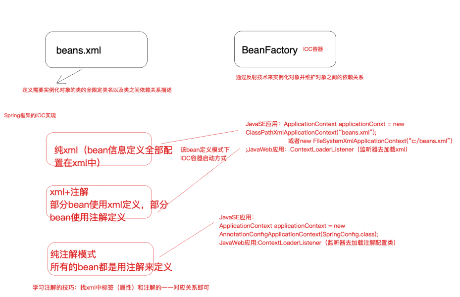

### 1.1 BeanFactory 与 ApplicationContext区别

BeanFactory是Spring框架中IoC容器的顶层接口,它只是用来定义一些基础功能,定义一些基础规范,而ApplicationContext是它的一个子接口，所以ApplicationContext是具备BeanFactory提供的全部功能的。

通常，我们称BeanFactory为SpringIOC的基础容器，ApplicationContext是容器的高级接口，比BeanFactory要拥有更多的功能，比如说国际化支持和资源访问（xml，java配置类）等等

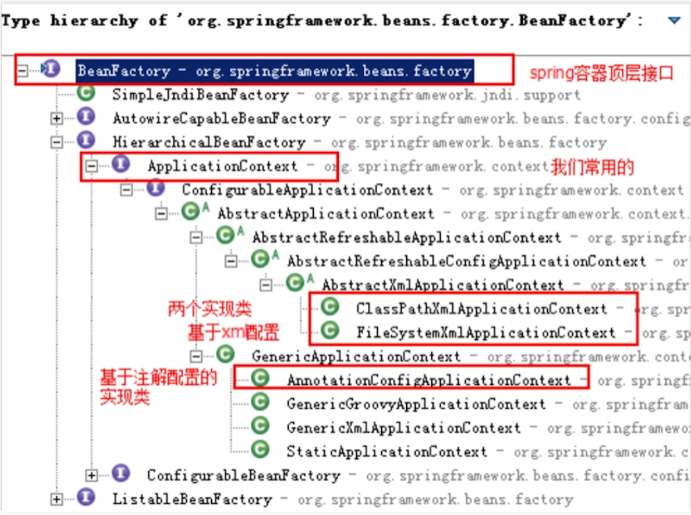

启动IoC容器的方式

- Java环境下启动IoC容器

  - ClassPathXmlApplicationContext：从类的根路径下加载配置文件（推荐使用）
  - FileSystemXmlApplicationContext：从磁盘路径上加载配置文件
  - AnnotationConfigApplicationContext：纯注解模式下启动Spring容器

- Web环境下启动IoC容器

  - 从xml启动容器

    ```xml
    <!DOCTYPE web-app PUBLIC
    "-//Sun Microsystems, Inc.//DTD Web Application 2.3//EN"
    "http://java.sun.com/dtd/web-app_2_3.dtd" >
    <web-app>
        <display-name>Archetype Created Web Application</display-name>
        <!--配置Spring ioc容器的配置⽂件-->
        <context-param>
            <param-name>contextConfigLocation</param-name>
            <param-value>classpath:applicationContext.xml</param-value>
        </context-param>
        <!--使⽤监听器启动Spring的IOC容器-->
        <listener>
            <listener-class>org.springframework.web.context.ContextLoaderListener</listener-class>
        </listener>
    </web-app>
    ```

  - 从配置类启动容器

    ```xml
    <!DOCTYPE web-app PUBLIC
    "-//Sun Microsystems, Inc.//DTD Web Application 2.3//EN"
    "http://java.sun.com/dtd/web-app_2_3.dtd" >
    <web-app>
        <display-name>Archetype Created Web Application</display-name>
        <!--告诉ContextloaderListener知道我们使⽤注解的⽅式启动ioc容器-->
        <context-param>
            <param-name>contextClass</param-name>
            <param-value>org.springframework.web.context.support.AnnotationConfigWebApplicationContext</param-value>
        </context-param>
        <!--配置启动类的全限定类名-->
        <context-param>
            <param-name>contextConfigLocation</param-name>
            <param-value>com.lagou.edu.SpringConfig</param-value>
        </context-param>
        <!--使⽤监听器启动Spring的IOC容器-->
        <listener>
            <listener-class>org.springframework.web.context.ContextLoaderListener</listener-class>
        </listener>
    </web-app>
    ```

### 1.2 纯xml模式

本部分内容不采用一一讲解知识点的方式，采用Spring IoC纯xml模式改造前面手写的IoC和AOP实现，在改造过程中，把各个知识点串起来

- xml文件头

  ```xml
  <?xml version="1.0" encoding="UTF-8"?>
  <beans xmlns="http://www.springframework.org/schema/beans"
         xmlns:xsi="http://www.w3.org/2001/XMLSchema-instance"
         xsi:schemaLocation="http://www.springframework.org/schema/beans
                             https://www.springframework.org/schema/beans/spring-beans.xsd">
  ```

- 实例化Bean的三种方式

  - 方式一：使用无参构造函数

    在默认情况下，他会通过反射调用无参构造函数来创建对象。如果类中没有无参构造，将创建失败。

    ```xml
    <!--配置service对象-->
    <bean id="userService" class="com.lagou.service.impl.TransferServiceImpl">
    </bean>
    ```

  - 方式二：使用静态方法创建

    在实际开发中，我么使用的对象有些时候并不是直接通过构造函数就可以创建出来的，它可能在创建的过程中会有很多额外的操作。此时会提供一个创建对象的方法，恰好这个方法是static修饰的方法，即是此种情况。

    例如：我们在做JDBC操作时，会用到java.sql.Connection接口的实现类，如果是MySQL数据库，那么用的就是JDBC4Connection，但是我们不会去写`JDBC4Connection connection = new JDBC4Connection()`，因为我们要注册驱动，还要提供URL和凭证信息，用`DriverManager.getConnection`方法来获取连接。

    那么在实际开发中，尤其早期的项目没有使用Spring框架来管理对象的创建，但是在设计时使用了工厂模式 解耦，那么当接入Spring后，工厂类创建对象就具有和上述例子相同的特征，即可采用此种方式配置。

    ```xml
    <!--使⽤静态⽅法创建对象的配置⽅式-->
    <bean id="userService" class="com.lagou.factory.BeanFactory"
          factory-method="getTransferService"></bean>
    ```

  - 方法三：使用实例化方法创建

    此种方式和上面静态方法创建其实类似，区别是用于获取对象的方法不再是static修饰的了，而是类中的一个普通方法。此种方式比静态方法创建的使用几率要高一些

    在早期开发的项目中，工厂类中的方法有可能是静态的，也有可能是非静态方法，当是非静态方法时，即可采用下面的配置方式：

    ```xml
    <!--使⽤实例⽅法创建对象的配置⽅式-->
    <bean id="beanFactory"
          class="com.lagou.factory.instancemethod.BeanFactory">
    </bean> 
    <bean id="transferService" factory-bean="beanFactory" 
          factory-method="getTransferService">
    </bean>
    ```

- Bean的X及生命周期

  - 作用范围的改变

    在spring框架管理Bean对象的创建时，Bean对象默认都是单例的，但是它支持配置的方式改变作用范围。作用范围官方提供的说明如下图：

    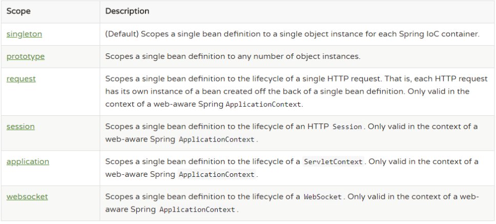

    在上图中提供的这些选项中，我们实际开发中用到最多的作用范围就是singleton（单例模式）和prototype（原型模式，也叫多例模式）。配置方式参考下面的代码：

    ```xml
    <!--配置service对象-->
    <bean id="transferService" class="com.lagou.service.impl.TransferServiceImpl" 
          scope="singleton">
    </bean>
    ```

  - 不同作用范围的生命周期

    - **单例模式：singleton**

      对象出生：当创建容器时，对象就被创建了。

      对象活着：只要容器在，对象一直活着。

      对象死亡：当销毁容器时，对象就被销毁了。

      一句话总结：单例模式的bean对象生命周期与容器相同。

    - **多例模式：prototype**

      对象出生：当使用对象时，创建新的对象实例。

      对象活着：只要对象在使用中，就一直活着。

      对象死亡：当对象⻓时间不用时，被java的垃圾回收器回收了。

      一句话总结：多例模式的bean对象，spring框架只负责创建，不负责销毁

- Bean标签属性

  在基于xml的IoC配置中，bean标签是最基础的标签。它表示了IoC容器中的一个对象。换句话说，如果一个对象想让spring管理，在XML的配置中都需要使用此标签配置，Bean标签的属性如下：

  **id属性**：用于给bean提供一个唯一标识。在一个标签内部，标识必须唯一。

  **class属性**：用于指定创建Bean对象的全限定类名。

  **name属性**：用于给bean提供一个或多个名称。多个名称用空格分隔。

  **factory-bean属性**：用于指定创建当前bean对象的工厂bean的唯一标识。当指定了此属性之后，class属性失效。

  **factory-method属性**：用于指定创建当前bean对象的工厂方法，如配合factory-bean属性使用，则class属性失效。如配合class属性使用，则方法必须是static的。

  **scope属性**：用于指定bean对象的作用范围。通常情况下就是singleton。当要用到多例模式时，可以配置为prototype。

  **init-method属性**：用于指定bean对象的初始化方法，此方法会在bean对象装配后调用。必须是一个无参方法。

  **destory-method属性**：用于指定bean对象的销毁方法，此方法会在bean对象销毁前执行。它只能为scope是singleton时起作用。

- DI依赖注入的xml配置

  - 依赖注入分类

    - 按照注入的方式分类

      **构造函数注入**：顾名思义，就是利用带参构造函数实现对类成员的数据赋值。

      **set方法注入**：它是通过类成员的set方法实现数据的注入。（使用最多的）

    - 按照注入的数据类型分类

      **基本类型和String**

      注入的数据类型是基本类型或者是字符串类型的数据。

      **其他Bean类型**

      注入的数据类型是对象类型，称为其他Bean的原因是，这个对象是要求出现在IoC容器中的。那么针对当前Bean来说，就是其他Bean了。

      **复杂类型（集合类型）**

      注入的数据类型是Aarry，List，Set，Map，Properties中的一种类型。

  - 依赖注入的配置实现之构造函数注入顾名思义，就是利用构造函数实现对类成员的赋值。它的使用要求是，类中提供的构造函数参数个数必须和配置的参数个数一致，且数据类型匹配。同时需要注意的是，当没有无参构造时，则必须提供构造函数参数的注入，否则Spring框架会报错。

  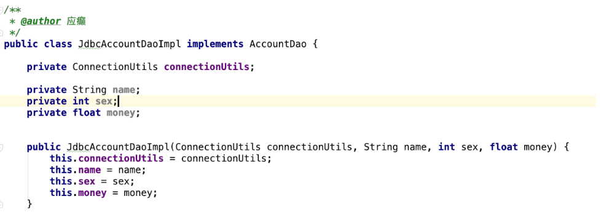

  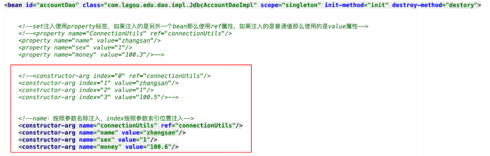

  在使用构造函数注入时，涉及的标签是constructor-arg，该标签有如下属性：

  **name**：用于给构造函数中指定名称的参数赋值。

  **index**：用于给构造函数中指定索引位置的参数赋值。

  **value**：用于指定基本类型或者String类型的数据。

  **ref**：用于指定其他Bean类型的数据。写的是其他bean的唯一标识。

  - 依赖注入的配置实现之set方法注入

  顾名思义，就是利用字段的set方法实现赋值的注入方式。此种方式在实际开发中是使用最多的注入方式。

  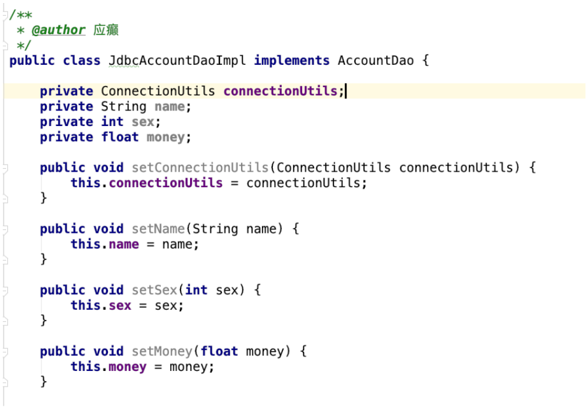

  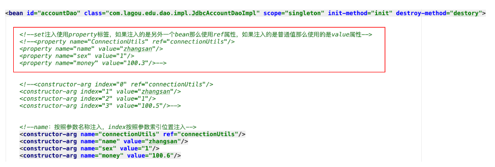

  在使用set方法注入时，需要使用`property`标签，该标签属性如下：

  **name**：指定注入时调用的set方法名称。（注：不包含set这三个字母,druid连接池指定属性名称）

  **value**：指定注入的数据。它支持基本类型和String类型。

  **ref**：指定注入的数据。它支持其他bean类型。写的是其他bean的唯一标识。

  - 复杂数据类型注入首先，解释一下复杂类型数据，它指的是集合类型数据。集合分为两类，一类是List结构（数组结构），一类是Map接口（键值对）。

    接下来就是注入的方式的选择，只能在构造函数和set方法中选择，我们的示例选用set方法注入。

    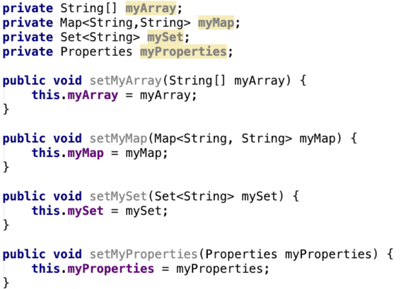

    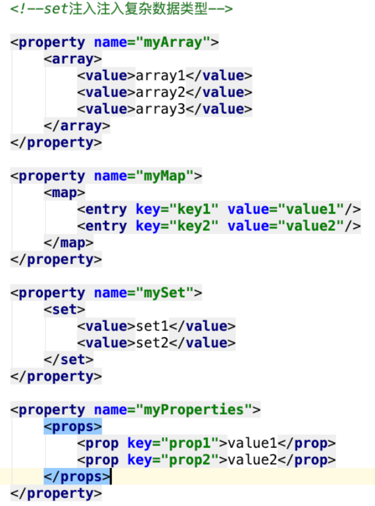

    在List结构的集合数据注入时，`array`,`list`,`set`这三个标签通用，另外注值的`value`标签内部可以直接写值，也可以使用`bean`标签配置一个对象，或者用`ref`标签引用一个已经配合的bean的唯一标识。

    在Map结构的集合数据注入时，`map`标签使用`entry`子标签实现数据注入，`entry`标签可以使用**key**和**value**属性指定存入map中的数据。使用**value-ref**属性指定已经配置好的bean的引用。同时`entry`标签中也可以使用`ref`标签，但是不能使用`bean`标签。而`property`标签中不能使用`ref`或者`bean`标签引用对象

### 1.3 xml与注解相结合模式

注意：

1）实际企业开发中，纯xml模式使用已经很少了

2）引入注解功能，不需要引入额外的jar

3）xml+注解结合模式，xml文件依然存在，所以，Spring IoC容器启动仍然从加载xml开始

4）哪些bean的定义写在xml中，哪些bean的定义使用注解

​	**第三方jar中的bean定义在xml，比如德鲁伊数据库连接池**

​	**自己开发的bean定义使用注解**


- xml中标签与注解的对应（IoC）

  | xml形式                  | 对应的注解形式                                               |
  | ------------------------ | ------------------------------------------------------------ |
  | 标签                     | @Component("accountDao")，注解加在类上bean的id属性内容直接配置在注解后面如果不配置，默认定义个这个bean的id为类的类名首字母小写；另外，针对分层代码开发提供了@Componenet的三种别名@Controller、@Service、@Repository分别用于控制层类、服务层类、dao层类的bean定义，这四个注解的用法完全一样，只是为了更清晰的区分而已 |
  | 标签的scope属性          | @Scope("prototype")，默认单例，注解加在类上                  |
  | 标签的init-method属性    | @PostConstruct，注解加在方法上，该方法就是初始化后调用的方法 |
  | 标签的destory-method属性 | @PreDestory，注解加在方法上，该方法就是销毁前调用的方法      |

- DI依赖注入的注解实现方式

  - **@Autowired**（推荐使用）

    @Autowired为Spring提供的注解，需要导入包：org.springframework.beans.factory.annotation.Autowired

    **@Autowired采取的策略为按照类型注入。**

    ```java
    public class TransferServiceImpl {
        @Autowired
        private AccountDaoaccountDao;
    }
    ```

    如上代码所示，这样装配回去spring容器中找到类型为AccountDao的类，然后将其注入进来。这样会产生一个问题，当一个类型有多个bean值的时候，会造成无法选择具体注入哪一个的情况，这个时候我们需要配合着@Qualifier使用。

    @Qualifier告诉Spring具体去装配哪个对象。

    ```java
    public class TransferServiceImpl {
        @Autowired
        @Qualifier(name="jdbcAccountDaoImpl")
        private AccountDaoaccountDao;
    }
    ```

    这个时候我们就可以通过类型和名称定位到我们想注入的对象。

  - **@Resource**

    @Resource 注解由 J2EE 提供，需要导入包 javax.annotation.Resource。

    @Resource 默认按照 ByName 自动注入。

    ```java
    public class TransferService {
        @Resource
        private AccountDaoaccountDao;
    
        @Resource(name="studentDao")  
        private StudentDaostudentDao;
        
        @Resource(type="TeacherDao")  
        private TeacherDaoteacherDao;
        
        @Resource(name="manDao",type="ManDao")  
        privateManDaomanDao;
    } 
    ```

    - 如果同时指定了 name 和 type，则从Spring上下文中找到唯一匹配的bean进行装配，找不到则抛出异常。
    - 如果指定了 name，则从上下文中查找名称（id）匹配的bean进行装配，找不到则抛出异常。
    - 如果指定了 type，则从上下文中找到类似匹配的唯一bean进行装配，找不到或是找到多个，都会抛出异常。
    - 如果既没有指定name，又没有指定type，则自动按照byName方式进行装配；

    **注意：**

    @Resource 在 Jdk 11中已经移除，如果要使用，需要单独引入jar包

    ```xml
    <dependency>
        <groupId>javax.annotation</groupId>
        <artifactId>javax.annotation-api</artifactId>
        <version>1.3.2</version>
    </dependency>
    ```

    

  

### 1.4 纯注解模式

改造xm+注解模式，将xml中遗留的内容全部以注解的形式迁移出去，最终删除xml，从Java配置类启动

**对应注解**

@Configuration 注解，表名当前类是一个配置类

@ComponentScan 注解，替代 context:component-scan

@PropertySource，引入外部属性配置文件

@Import 引入其他配置类

@Value 对变量赋值，可以直接赋值，也可以使用 ${} 读取资源配置文件中的信息

@Bean 将方法返回对象加入 SpringIOC 容器


## 第2节 Spring IOC高级特性

### 2.1 lazy-init 延迟加载

Bean的延迟加载（延迟创建）

ApplicationContext 容器的默认行为是在启动服务器时将所有 singleton bean 提前进行实例化。提前实例化意味着作为初始化过程的一部分，ApplicationContext 实例会创建并配置所有的singletonbean。

比如：

```xml
<bean id="testBean" class="cn.lagou.LazyBean" />
<!--该bean默认的设置为: -->
<bean id="testBean" calss="cn.lagou.LazyBean" lazy-init="false" />
```

lazy-init=“false”，立即加载，表示在Spring启动时，立刻进行实例化。

如果不想让一个singleton bean 在ApplicationContext实现初始化时被提前实例化，那么可以将bean设置为延迟实例化

```xml
<bean id="testBean" calss="cn.lagou.LazyBean" lazy-init="true" />
```

设置 lazy-init 为 true 的 bean 将不会在 ApplicationContext 启动时提前被实例化，⽽是第⼀次向容器通过 getBean 索取 bean 时实例化的。

如果⼀个设置了立即加载的 bean1，引用了⼀个延迟加载的 bean2 ，那么 bean1 在容器启动时被实例化，而bean2 由于被 bean1 引用，所以也被实例化，这种情况也符合延时加载的 bean 在第一次调用时才被实例化的规则。

也可以在容器层次中通过在元素上使用 "default-lazy-init" 属性来控制延时初始化。如下面配置：

```xml
<beans default-lazy-init="true">
    <!-- no beans will be eagerly pre-instantiated... -->
</beans>
```

如果一个 bean 的 scope 属性为 scope="pototype" 时，即使设置了 lazy-init="false"，容器启动时也不会实例化bean，而是调用 getBean 方法实例化的。

**应用场景**

（1）开启延迟加载一定程度提高容器启动和运转性能

（2）对于不常使用的 Bean 设置延迟加载，这样偶尔使用的时候再加载，不必要从一开始该 Bean 就占用资源


### 2.2 FactoryBean 和 BeanFactory

BeanFactory接口是容器的顶级接口，定义了容器的一些基础行为，负责生产和管理Bean的一个工厂，具体使用它下面的子接口类型，比如ApplicationContext；此处我们重点分析FactoryBean

Spring中Bean有两种，一种是普通Bean，一种是工厂Bean（FactoryBean），FactoryBean可以生成某一个类型的Bean实例（返回给我们），也就是说我们可以借助于它自定义Bean的创建过程。

Bean创建的三种方式中的静态方法和实例化方法和FactoryBean作用类似，FactoryBean使用较多，尤其在Spring框架一些组件中会使用，还有其他框架和Spring框架整合时使用。

```java
// 可以让我们⾃定义Bean的创建过程（完成复杂Bean的定义）
public interface FactoryBean<T> {
    
    @Nullable
    // 返回FactoryBean创建的Bean实例，如果isSingleton返回true，则该实例会放到Spring容器的单例对象缓存池中Map
    T getObject() throws Exception;
    
    @Nullable
    // 返回FactoryBean创建的Bean类型
    Class<?> getObjectType();
    
    // 返回作⽤域是否单例
    default boolean isSingleton() {
        return true;
    } 
}
```

Company类

```java
package com.lagou.edu.pojo;
/**
* @author 应癫
*/
public class Company {
    private String name;
    private String address;
    private int scale;
    public String getName() {
        return name;
    }

    public void setName(String name) {
        this.name = name;
    }
    public String getAddress() {
        return address;
    }
    public void setAddress(String address) {
        this.address = address;
    }
    public int getScale() {
        return scale;
    }
    public void setScale(int scale) {
        this.scale = scale;
    }
    @Override
    public String toString() {
        return "Company{" +
            "name='" + name + '\'' +
            ", address='" + address + '\'' +
            ", scale=" + scale +
            '}';
    }
}
```

CompanyFactoryBean类

```java
package com.lagou.edu.factory;
import com.lagou.edu.pojo.Company;
import org.springframework.beans.factory.FactoryBean;
/**
* @author 应癫
*/
public class CompanyFactoryBean implements FactoryBean<Company> {
    private String companyInfo; // 公司名称,地址,规模
    public void setCompanyInfo(String companyInfo) {
        this.companyInfo = companyInfo;
    }

    @Override
    public Company getObject() throws Exception {
        // 模拟创建复杂对象Company
        Company company = new Company();
        String[] strings = companyInfo.split(",");
        company.setName(strings[0]);
        company.setAddress(strings[1]);
        company.setScale(Integer.parseInt(strings[2]));
        return company;
    }
    @Override
    public Class<?> getObjectType() {
        return Company.class;
    }
    @Override
    public boolean isSingleton() {
        return true;
    }
}
```

xml配置

```xml
<bean id="companyBean" class="com.lagou.edu.factory.CompanyFactoryBean">
    <property name="companyInfo" value="拉勾,中关村,500"/>
</bean>
```

测试，获取FactoryBean产生的对象

```java
Object companyBean = applicationContext.getBean("companyBean");
System.out.println("bean:" + companyBean);
// 结果如下
bean:Company{name='拉勾', address='中关村', scale=500}
```

测试，获取FactoryBean，需要在id之前添加`&`

```java
Object companyBean = applicationContext.getBean("&companyBean");
System.out.println("bean:" + companyBean);
// 结果如下
bean:com.lagou.edu.factory.CompanyFactoryBean@53f6fd09
```


### 2.3 后置处理器

Spring提供了两种后处理bean的扩展接口，分别为 BeanPostProcessor 和BeanFactoryPostProcessor，两者在使用上是有所区别的。

工厂初始化（BeanFactory）—> Bean对象

在BeanFactory初始化之后可以使用BeanFactoryPostProcessor进行后置处理做一些事情

在Bean对象实例化（并不是Bean的整个生命周期完成）之后可以使用BeanPostProcessor进行后置处理做一些事情

**注意：**对象不一定是springbean，而springbean一定是个对象

#### 2.3.1 BeanPostProcessor

BeanPostProcessor是针对Bean级别的处理，可以针对某个具体的Bean

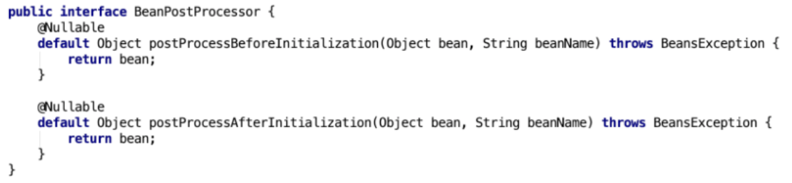

该接口提供了两个方法，分别在Bean的初始化方法前和初始化方法后执行，具体这个初始化方法指的是什么方法，类似我们在定义bean时，定义了init-method所指定的方法

定义一个类实现了BeanPostProcessor，默认是会对整个Spring容器中所有的bean进行处理。如果要对具体的某个bean处理，可以通过方法参数判断，两个类型参数分别为Object和String，第一个参数是每个bean的实例，第二个参数是每个bean的name或者id属性的值。所以我们可以通过第二个参数，来判断我们将要处理的具体的bean。

**注意：**处理是发生在Spring容器的实例化和依赖注入之后。

#### 2.3.2 BeanFactoryPostProcessor

BeanFactory级别的处理，是针对整个Bean的工厂进行处理，典型应用:PropertyPlaceholderConfigurer

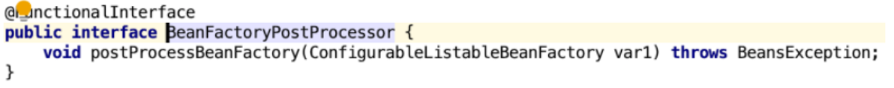

此接口只提供了一个方法，方法参数为ConfigurableListableBeanFactory，该参数类型定义了一些方法

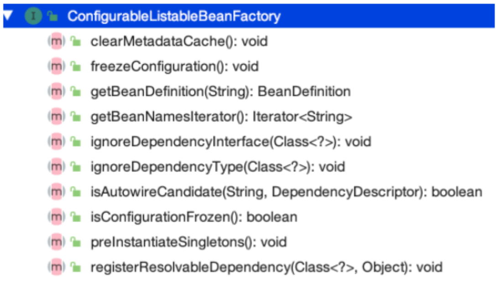

其中有个方法名为getBeanDefinition的方法，我们可以根据此方法，找到我们定义bean 的BeanDefinition对象。然后我们可以对定义的属性进行修改，以下是BeanDefinition中的方法

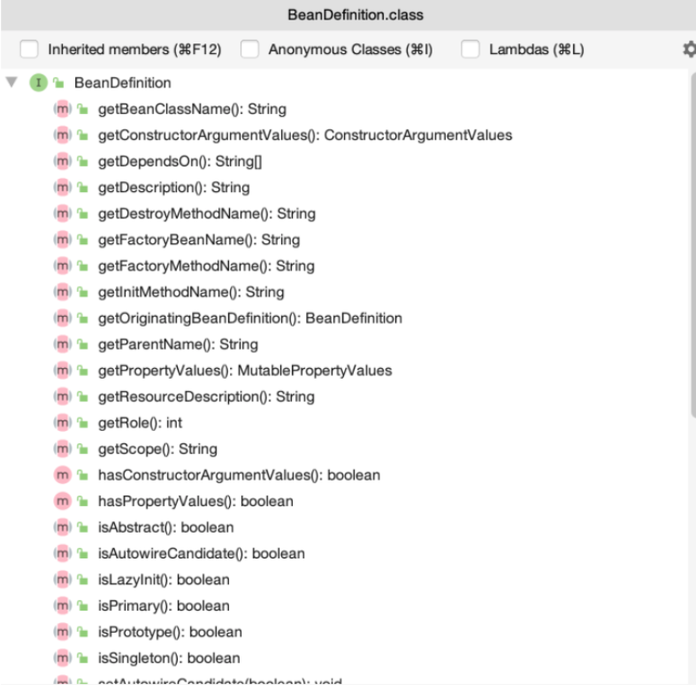

方法名字类似我们bean标签的属性，setBeanClassName对应bean标签中的class属性，所以当我们拿到BeanDefinition对象时，我们可以手动修改bean标签中所定义的属性值。

**BeanDefinition对象：**我们在xml中定义的bean标签，Spring解析bean标签成为一个JavaBean，这个javaBean就是BeanDefinition

**注意：**调用 BeanFactoryPostProcessor 方法时，这时候bean还没有实例化，此时 bean 刚被解析成BeanDefinition对象

#### 2.3.3 Bean创建过程

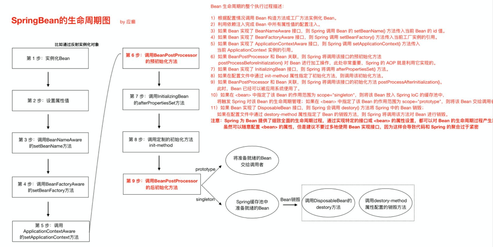


# 五、 Spring IOC源码深度剖析

- 好处：提高培养代码架构思维、深入理解框架
- 原则：
  - 定焦原则：抓住主线
  - 宏观原则：站在上帝视角，关注源码结构和业务流程（淡化具体某行代码的编写细节）
- 读源码的方法和技巧
  - 断点（观察调⽤栈）
  - 反调（Find Usages）
  - 经验（spring框架中doXXX，做具体处理的地⽅）
- Spring源码构建
  - 下载源码（github）
  - 安装gradle 5.6.3（类似于maven） Idea 2019.1 Jdk 11.0.5
  - 导⼊（耗费⼀定时间）
  - 编译⼯程（顺序：core-oxm-context-beans-aspects-aop）
    - ⼯程—>tasks—>compileTestJava

## 第1节 Spring IOC容器初始化主体流程

### 1.1 Spring IoC的容器体系

IoC容器是Spring的核⼼模块，是抽象了对象管理、依赖关系管理的框架解决⽅案。Spring 提供了很多的容器，其中 BeanFactory 是顶层容器（根容器），不能被实例化，它定义了所有 IoC 容器 必须遵从的⼀套原则，具体的容器实现可以增加额外的功能，⽐如我们常⽤到的ApplicationContext，其下更具体的实现如 ClassPathXmlApplicationContext 包含了解析 xml 等⼀系列的内容，
AnnotationConfifigApplicationContext 则是包含了注解解析等⼀系列的内容。Spring IoC 容器继承体系⾮常聪明，需要使⽤哪个层次⽤哪个层次即可，不必使⽤功能⼤⽽全的。

BeanFactory 顶级接⼝⽅法栈如下

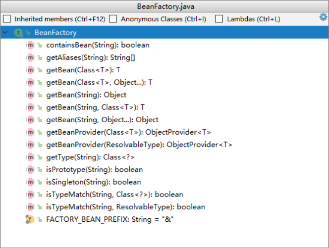

BeanFactory 容器继承体系

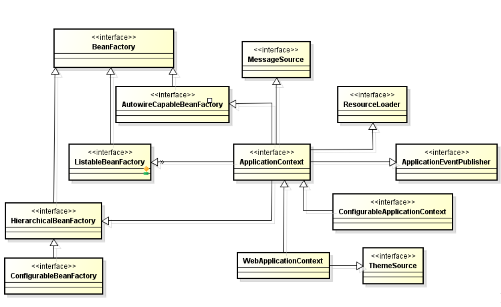

通过其接⼝设计，我们可以看到我们⼀贯使⽤的 ApplicationContext 除了继承BeanFactory的⼦接⼝，还继承了ResourceLoader、MessageSource等接⼝，因此其提供的功能也就更丰富了。

下⾯我们以 ClasspathXmlApplicationContext 为例，深⼊源码说明 IoC 容器的初始化流程。

### 1.2 Bean生命周期关键时机点

**思路：**创建⼀个类 LagouBean ，让其实现⼏个特殊的接⼝，并分别在接⼝实现的构造器、接⼝⽅法中

断点，观察线程调⽤栈，分析出 Bean 对象创建和管理关键点的触发时机

LagouBean类

```java
package com.lagou;
import org.springframework.beans.BeansException;
import org.springframework.beans.factory.DisposableBean;
import org.springframework.beans.factory.InitializingBean;
import org.springframework.beans.factory.config.BeanFactoryPostProcessor;
import org.springframework.beans.factory.config.BeanPostProcessor;
import
    org.springframework.beans.factory.config.ConfigurableListableBeanFactory;
import org.springframework.stereotype.Component;
/**
* @Author 应癫
* @create 2019/12/3 11:46
*/
public class LagouBean implements InitializingBean{
    /**
 * 构造函数
 */
    public LagouBean(){
        System.out.println("LagouBean 构造器...");
    }
    /**
 * InitializingBean 接⼝实现
 */
    public void afterPropertiesSet() throws Exception {
        System.out.println("LagouBean afterPropertiesSet...");
    } }
```

BeanPostProcessor 接⼝实现类

```java
package com.lagou;
import org.springframework.beans.BeansException;
import org.springframework.beans.factory.config.BeanPostProcessor;
import org.springframework.stereotype.Component;
/**
* @Author 应癫
* @create 2019/12/3 16:59
*/
public class MyBeanPostProcessor implements BeanPostProcessor {
    public MyBeanPostProcessor() {
        System.out.println("BeanPostProcessor 实现类构造函数...");
    }
    @Override
    public Object postProcessBeforeInitialization(Object bean, String beanName)throws BeansException {
        if("lagouBean".equals(beanName)) {
            System.out.println("BeanPostProcessor 实现类 postProcessBeforeInitialization ⽅法被调⽤中......");
        }
        return bean;
    }
    @Override
    public Object postProcessAfterInitialization(Object bean, String beanName)
        throws BeansException {
        if("lagouBean".equals(beanName)) {
            System.out.println("BeanPostProcessor 实现类postProcessAfterInitialization ⽅法被调⽤中......");
        }
        return bean;
    } 
}
```

BeanFactoryPostProcessor 接⼝实现类

```java
package com.lagou;
import org.springframework.beans.BeansException;
import org.springframework.beans.factory.config.BeanFactoryPostProcessor;
import
    org.springframework.beans.factory.config.ConfigurableListableBeanFactory;
import org.springframework.stereotype.Component;
/**
* @Author 应癫
* @create 2019/12/3 16:56
*/
public class MyBeanFactoryPostProcessor implements BeanFactoryPostProcessor {
    public MyBeanFactoryPostProcessor() {
        System.out.println("BeanFactoryPostProcessor的实现类构造函数...");
    }
    @Override
    public void postProcessBeanFactory(ConfigurableListableBeanFactory
                                       beanFactory) throws BeansException {
        System.out.println("BeanFactoryPostProcessor的实现⽅法调⽤中......");
    } 
}
```

applicationContext.xml

```xml
<?xml version="1.0" encoding="UTF-8"?>
<beans xmlns="http://www.springframework.org/schema/beans"
       xmlns:xsi="http://www.w3.org/2001/XMLSchema-instance"
       xsi:schemaLocation="
                           http://www.springframework.org/schema/beans
                           https://www.springframework.org/schema/beans/spring-beans.xsd
                           ">
    <bean id="lagouBean" class="com.lagou.LagouBean"/>
    <bean id="myBeanFactoryPostProcessor"
          class="com.lagou.MyBeanFactoryPostProcessor"/>
    <bean id="myBeanPostProcessor" class="com.lagou.MyBeanPostProcessor"/>
</beans>
```


IoC容器源码分析用例

```java
/**
* Ioc 容器源码分析基础案例
*/
@Test
public void testIoC() {
    ApplicationContext applicationContext = new 
        ClassPathXmlApplicationContext("classpath:applicationContext.xml");
    LagouBean lagouBean = applicationContext.getBean(LagouBean.class);
    System.out.println(lagouBean);
}
```

#### （1） 分析 Bean 的创建时在容器初始化时还是在getBean时

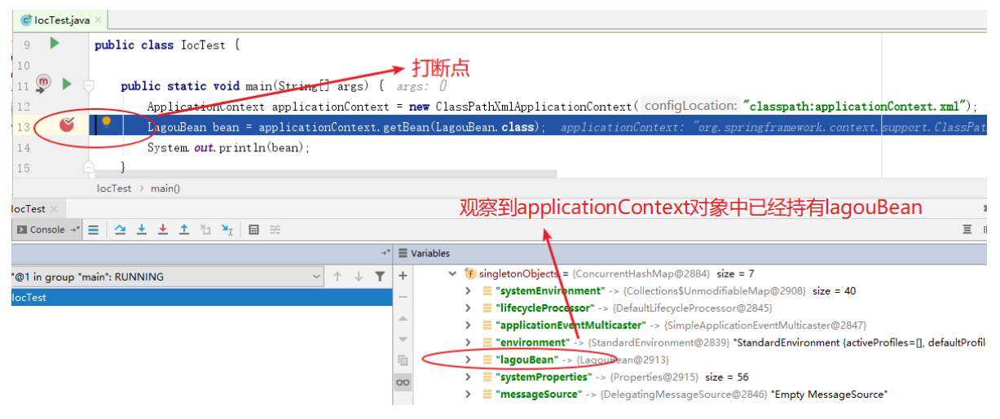

根据断点调试，我们发现，在未设置延迟加载的前提下，Bean 的创建是在容器初始化过程中完成的。

#### （2） 分析构造函数调用情况

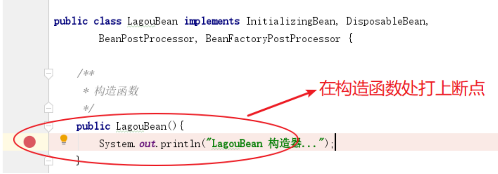

观察调用栈


通过如上观察，我们发现构造函数的调⽤时机在AbstractApplicationContext类refresh⽅法的fifinishBeanFactoryInitialization(beanFactory)处; 

#### （3）分析 InitializingBean 之 afterPropertiesSet 初始化方法调用情况

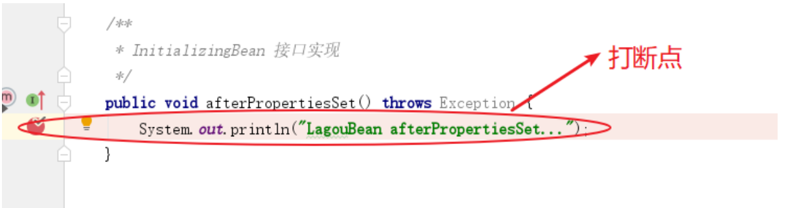

观察调用栈

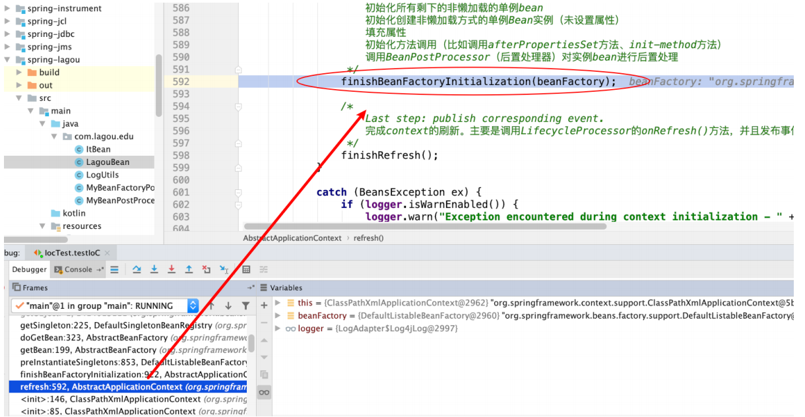

通过如上观察，我们发现 InitializingBean中afterPropertiesSet ⽅法的调⽤时机也是在AbstractApplicationContext类refresh⽅法的fifinishBeanFactoryInitialization(beanFactory);

#### （4）分析 BeanFactoryPostProcessor  初始化和调用情况

分别在构造函数、postProcessBeanFactory ⽅法处打断点，观察调⽤栈，发现

**BeanFactoryPostProcessor** **初始化**在AbstractApplicationContext类refresh⽅法的invokeBeanFactoryPostProcessors(beanFactory);

**postProcessBeanFactory** **调⽤**在AbstractApplicationContext类refresh⽅法的invokeBeanFactoryPostProcessors(beanFactory);

#### （5）分析 BeanPostProcessor 初始化和调用情况

分别在构造函数、postProcessBeanFactory ⽅法处打断点，观察调⽤栈，发现

**BeanPostProcessor** **初始化**在AbstractApplicationContext类refresh⽅法的registerBeanPostProcessors(beanFactory);

**postProcessBeforeInitialization** **调⽤**在AbstractApplicationContext类refresh⽅法的fifinishBeanFactoryInitialization(beanFactory);

**postProcessAfterInitialization** **调⽤**在AbstractApplicationContext类refresh⽅法的fifinishBeanFactoryInitialization(beanFactory);


#### （6）总结

根据上⾯的调试分析，我们发现 Bean对象创建的⼏个关键时机点代码层级的调⽤都在AbstractApplicationContext 类 的 refresh ⽅法中，可⻅这个⽅法对于Spring IoC 容器初始化来说相当关键，汇总如下：

| 关键点                           | 触发代码                                                     |
| -------------------------------- | ------------------------------------------------------------ |
| 构造器                           | refresh#fifinishBeanFactoryInitialization(beanFactory)(beanFactory) |
| BeanFactoryPostProcessor初始化   | refresh#invokeBeanFactoryPostProcessors(beanFactory)         |
| BeanFactoryPostProcessor方法调用 | refresh#invokeBeanFactoryPostProcessors(beanFactory)         |
| BeanPostProcessor初始化          | registerBeanPostProcessors(beanFactory                       |
| BeanPostProcessor方法调用        | refresh#fifinishBeanFactoryInitialization(beanFactory)       |

### 1.3 Spring IoC容器初始化主流程

由上分析可知，Spring IoC 容器初始化的关键环节就在 AbstractApplicationContext#refresh() ⽅法中，我们查看 refresh ⽅法来俯瞰容器创建的主体流程，主体流程下的具体⼦流程我们后⾯再来讨论。

```java
@Override
public void refresh() throws BeansException, IllegalStateException {
    synchronized (this.startupShutdownMonitor) {
        // 第⼀步：刷新前的预处理
        prepareRefresh();
        /*第⼆步：
         获取BeanFactory；默认实现是DefaultListableBeanFactory
         加载BeanDefition 并注册到 BeanDefitionRegistry
         */
        ConfigurableListableBeanFactory beanFactory = obtainFreshBeanFactory();
        // 第三步：BeanFactory的预准备⼯作（BeanFactory进⾏⼀些设置，⽐如context的类加载器等）
        prepareBeanFactory(beanFactory);
        try {
            // 第四步：BeanFactory准备⼯作完成后进⾏的后置处理⼯作
            postProcessBeanFactory(beanFactory);
            // 第五步：实例化并调⽤实现了BeanFactoryPostProcessor接⼝的Bean
            invokeBeanFactoryPostProcessors(beanFactory);
            // 第六步：注册BeanPostProcessor（Bean的后置处理器），在创建bean的前后等执⾏ 
            registerBeanPostProcessors(beanFactory);
            // 第七步：初始化MessageSource组件（做国际化功能；消息绑定，消息解析）；
            initMessageSource();
            // 第⼋步：初始化事件派发器
            initApplicationEventMulticaster();
            // 第九步：⼦类重写这个⽅法，在容器刷新的时候可以⾃定义逻辑
            onRefresh();
            // 第⼗步：注册应⽤的监听器。就是注册实现了ApplicationListener接⼝的监听器
            bean
                registerListeners();
            /*
             第⼗⼀步：
             初始化所有剩下的⾮懒加载的单例bean
             初始化创建⾮懒加载⽅式的单例Bean实例（未设置属性）
             填充属性
             初始化⽅法调⽤（⽐如调⽤afterPropertiesSet⽅法、init-method⽅法）
             调⽤BeanPostProcessor（后置处理器）对实例bean进⾏后置处
             */
            finishBeanFactoryInitialization(beanFactory);
            /*
             第⼗⼆步：
             完成context的刷新。主要是调⽤LifecycleProcessor的onRefresh()⽅法，并且发布事
            件 （ContextRefreshedEvent）
             */
            finishRefresh();
        }
		......
    }
}
```


## 第2节 BeanFactory创建流程

### 2.1 获取BeanFactory 子流程

时序图如下


### 2.2 BeanDefinition 加载解析及注册子流程

#### （1）该子流程涉及到如下几个关键步骤

**Resource定位：**指对BeanDefifinition的资源定位过程。通俗讲就是找到定义Javabean信息的XML⽂件，并将其封装成Resource对象。

**BeanDefifinition载入：**把⽤户定义好的Javabean表示为IoC容器内部的数据结构，这个容器内部的数据结构就是BeanDefifinition。

**注册BeanDefifinition到 IoC容器**

#### （2）过程分析

**Step1**：子流程入口在 AbstractRefreshableApplicationContext#refreshBeanFactory 方法中

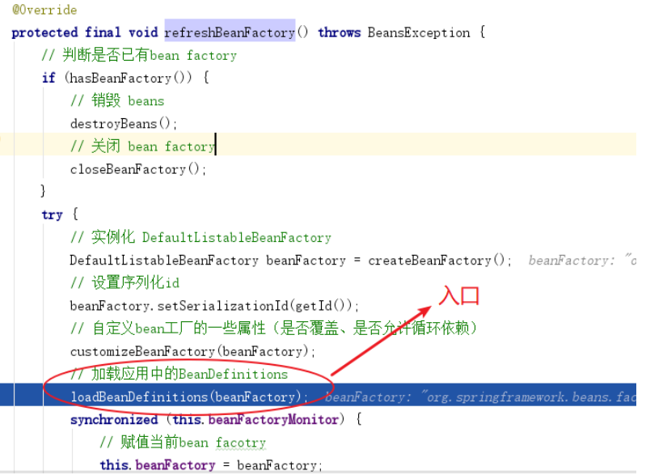

**Step 2：**依次调用多个类的 loadBeanDefifinitions 方法 —> AbstractXmlApplicationContext —>AbstractBeanDefifinitionReader —> XmlBeanDefifinitionReader 一直执行到XmlBeanDefifinitionReader 的 doLoadBeanDefifinitions 方法

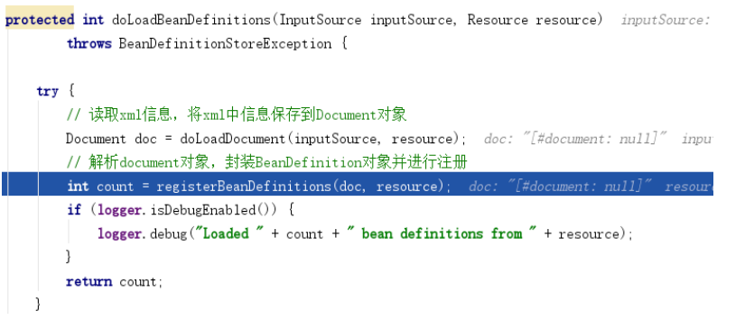

**Step 3:** 我们重点观察XmlBeanDefinitionReader类的registerBeanDefinition方法，期间产生了多次重载调用，我们定位到最后一个

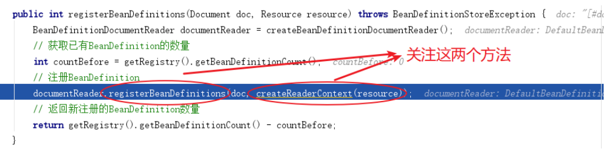

此处我们关注两个地方：⼀个createRederContext方法，⼀个是DefaultBeanDefifinitionDocumentReader类的registerBeanDefifinitions方法，先进入createRederContext 方法看看

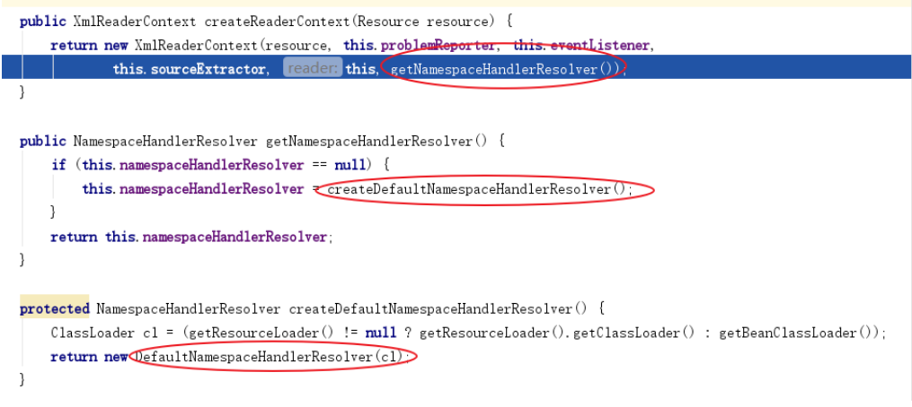

我们可以看到，此处Spring首先完成了NamespaceHandlerResolver的初始化。

我们再进入registerBeanDefinitions方法中追踪，调用了DefaultBeanDefinitionDocumentReader#registerBeanDefinitions方法

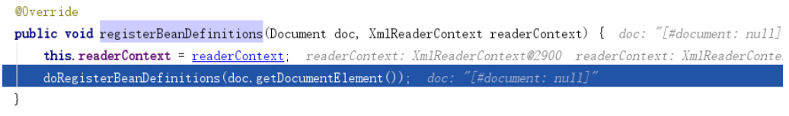

进入doRegisterBeanDefinitions方法

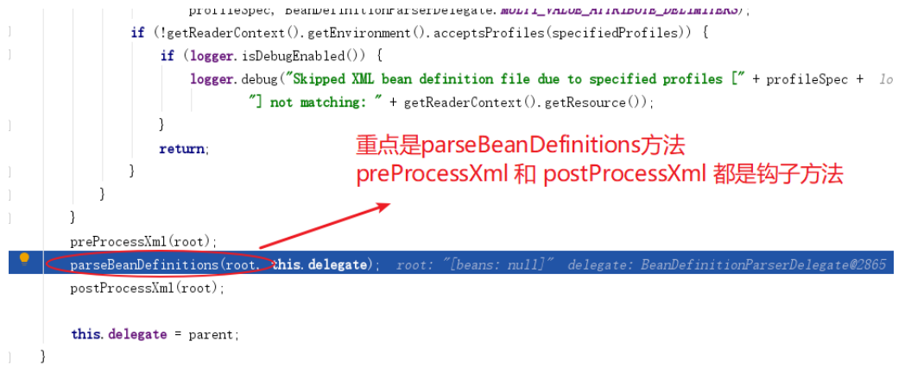

进入parseBeanDefinitions方法

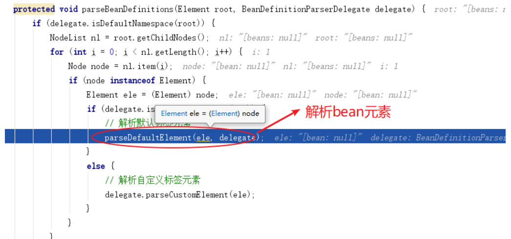

进入parseDefaultElement方法

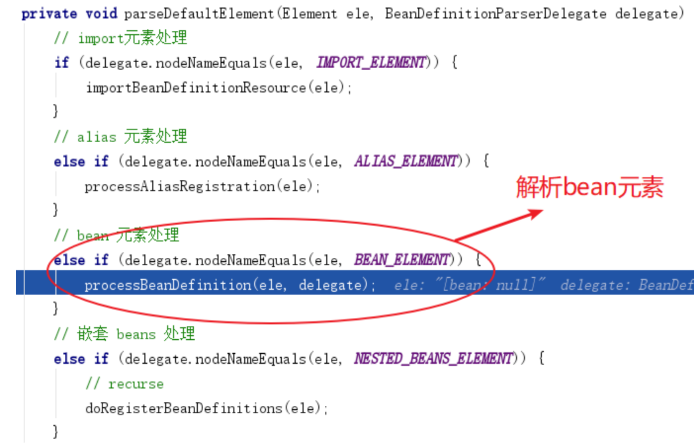

进入processBeanDefinition方法

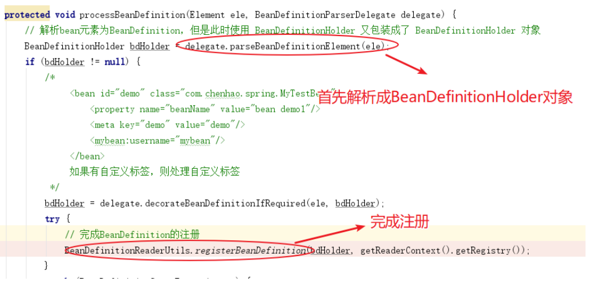

至此，注册流程结束，我们发现，所谓的注册就是把封装的XML中定义的Bean信息封装为BeanDefinition对象后，放入一个Map中，BeanFactory是以Map的结构组织这些BeanDefinition的


可以在DefaultListableBeanFactory中看到此Map的定义

```java
/** Map of bean definition objects, keyed by bean name. */
private final Map<String, BeanDefinition> beanDefinitionMap = new
    ConcurrentHashMap<>(256);
```


#### （3）时序图

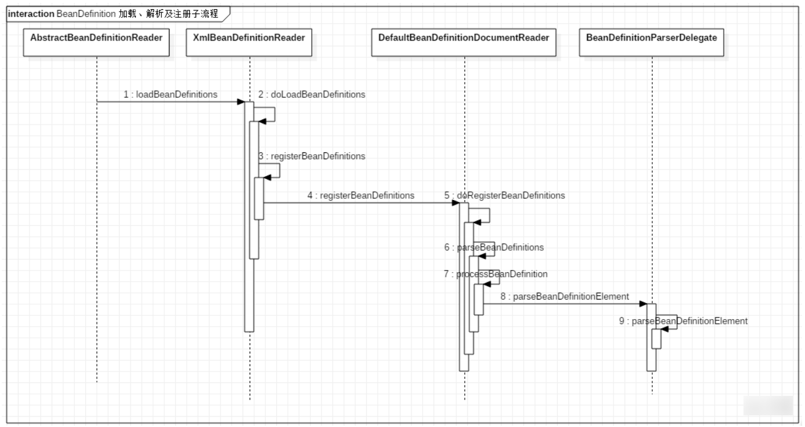

## 第3节 Bean创建流程

- 通过最开始的关键时机点分析，我们知道Bean创建子流程入口在AbstractApplicationContext#refresh()方法的finishBeanFactoryInitialization(beanFactory)处

  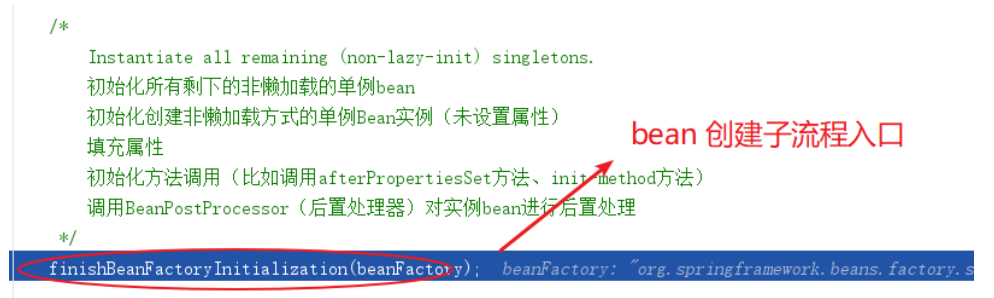

- 进入finishBeanFactoryInitialization

  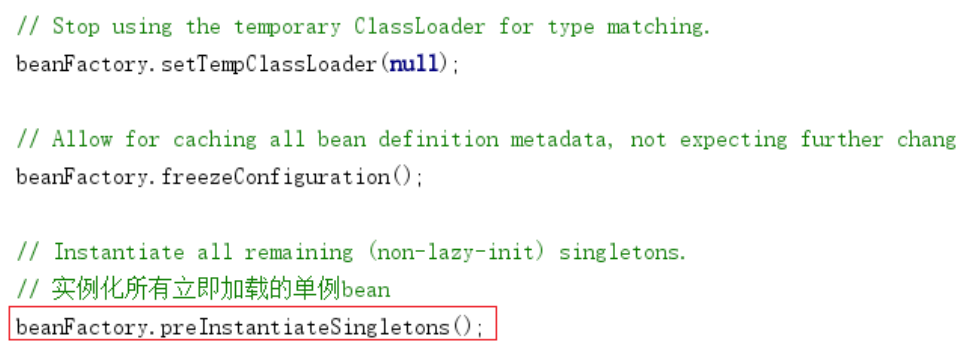

- 继续进入DefaultListableBeanFactory类的preInstanttiateSingletons方法，我们找到下面部分的代码，看到工程Bean或者普通Bean，最终都是通过getBean的方法获取实例

  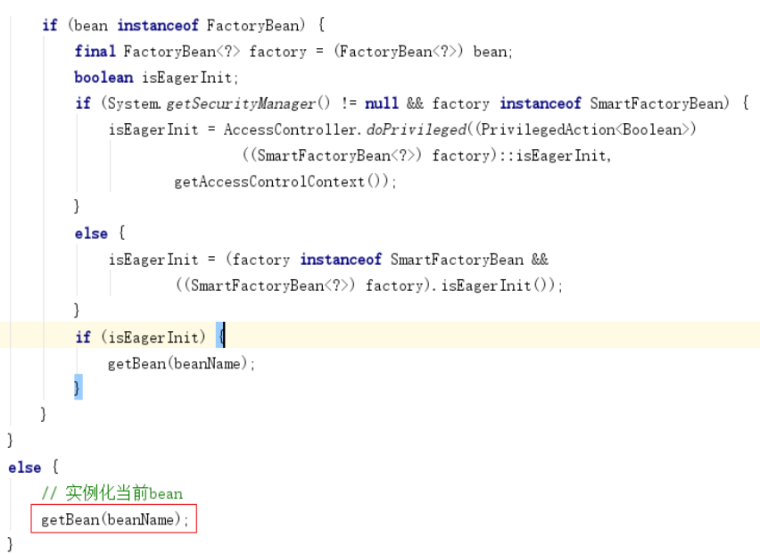

- 继续跟踪下去，我们进入到了AbstractBeanFactory类的doGetBean方法，这个方法的代码很多，我们直接找到核心部分

  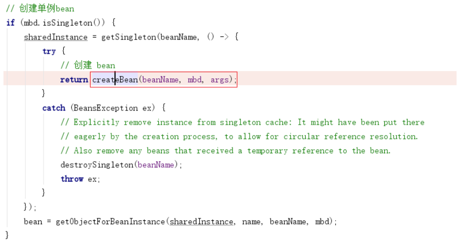

- 接着进入到AbstractAutowireCapableBeanFactory类的方法，找到一下代码部分

  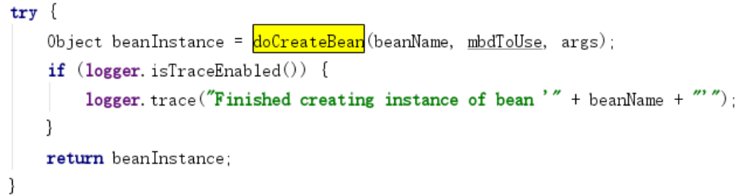

- 进入doCreateBean方法看看，改方法我们关注两块重点区域

  - 创建Bean示例，此时尚未设置属性

    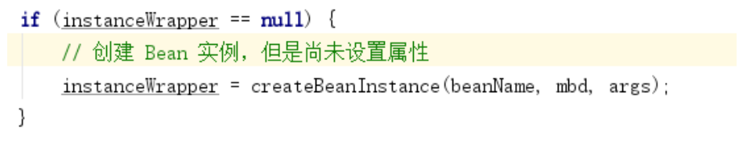

  - 给Bean填充属性，调用初始化方法，应用BeanPostProcessor后置处理器

    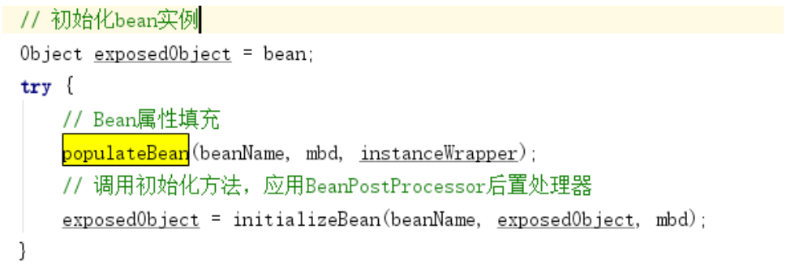

## 第4节 lazy-init 延迟加载机制原理

- lazy-init 延迟加载机制分析

  普通 Bean 的初始化是在容器启动初始化阶段执行的，而被lazy-init=true修饰的 bean 则是在从容器里
  第一次进行context.getBean() 时进行触发。Spring 启动的时候会把所有bean信息(包括XML和注解)解
  析转化成Spring能够识别的BeanDefinition并存到Hashmap里供下面的初始化时用，然后对每个
  BeanDefinition 进行处理，如果是懒加载的则在容器初始化阶段不处理，其他的则在容器初始化阶段进
  行初始化并依赖注入。

  ```java
  public void preInstantiateSingletons() throws BeansException {
      // 所有beanDefinition集合
      List<String> beanNames = new ArrayList<String>(this.beanDefinitionNames);
      // 触发所有⾮懒加载单例bean的初始化
      for (String beanName : beanNames) {
          // 获取bean 定义
          RootBeanDefinition bd = getMergedLocalBeanDefinition(beanName);
          // 判断是否是懒加载单例bean，如果是单例的并且不是懒加载的则在容器创建时初始化
          if (!bd.isAbstract() && bd.isSingleton() && !bd.isLazyInit()) {
              // 判断是否是 FactoryBean
              if (isFactoryBean(beanName)) {
                  final FactoryBean<?> factory = (FactoryBean<?>)
                      getBean(FACTORY_BEAN_PREFIX + beanName);
                  boolean isEagerInit;
                  if (System.getSecurityManager() != null && factory instanceof SmartFactoryBean) {
                      isEagerInit = AccessController.doPrivileged(new PrivilegedAction<Boolean>() {
                          @Override
                          public Boolean run() {
                              return ((SmartFactoryBean<?>) factory).isEagerInit();
                          }
                      }, getAccessControlContext());
                  }
              }else {
                  /*
                   如果是普通bean则进⾏初始化并依赖注⼊，此 getBean(beanName)接下来触发的逻辑和
                   懒加载时 context.getBean("beanName") 所触发的逻辑是⼀样的
                   */
                  getBean(beanName);
              }
          }
      }
  }
  ```

- 总结

  - 对于被修饰为lazy-init的bean Spring 容器初始化阶段不会进行 init 并且依赖注⼊，当第⼀次进行getBean时候才进⾏初始化并依赖注⼊
  - 对于非懒加载的bean，getBean的时候会从缓存⾥头获取，因为容器初始化阶段 Bean 已经初始化完成并缓存了起来

## 第5节 Spring IOC循环依赖问题

### 5.1 什么是循环依赖

循环依赖其实就是循环引用，也就是两个或者两个以上的Bean互相持有对方，最终形成闭环。比如A依赖于B，B依赖于C，C又依赖于A

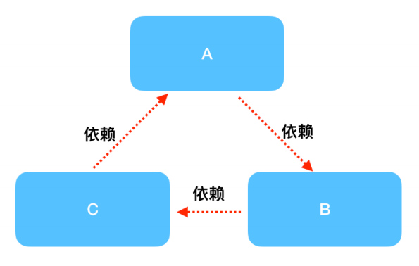

注意，这里不是函数的循环调用，是对象的互相依赖关系。循环调用其实就是一个死循环，除非有终结条件。

Spring中循环依赖场景有：

- 构造器的循环依赖（构造器注入）
- Field属性的循环依赖（Set注入）

其中，构造器的循环依赖问题无法解决，只能抛出BeanCurrentlyCreationException异常，在解决属性循环依赖时，Spring采用的是提前暴露对象的方法

### 5.2 循环依赖处理机制

- 单例 bean 构造器参数循环依赖（无法解决）

- prototype原型bean循环依赖（无法解决）

  对于prototype 的bean 的初始化过程中不论是通过构造参数循环依赖还是通过set方法产生循环依赖，Spring都会直接报错处理

  AbstractBeanFactory.doGetBean() 方法

  ```java
  if (isPrototypeCurrentlyInCreation(beanName)) {
      throw new BeanCurrentlyInCreationException(beanName);
  }
  ```

  ```java
  protected boolean isPrototypeCurrentlyInCreation(String beanName) {
      Object curVal = this.prototypesCurrentlyInCreation.get();
      return (curVal != null 
              && (curVal.equals(beanName) 
                  ||(curVal instanceof Set && ((Set<?>) curVal).contains(beanName)))
             );
  }
  ```

  在获取bean之前，如果这个prototype 类型的bean正在被创建择直接抛出异常。prototype 类型的 bean 在创建之前会进行标记，这个beanName正在被创建，等创建结束后会删除标记

  ```java
  try {
      //创建原型bean之前添加标记
      beforePrototypeCreation(beanName);
      //创建原型bean
      prototypeInstance = createBean(beanName, mbd, args);
  }
  finally {
      //创建原型bean之后删除标记
      afterPrototypeCreation(beanName);
  }
  ```

  总结：Spring不支持prototype 类型的bean的循环依赖

- 单例bean通过set或者@Autowired进行循环依赖

  Spring的循环依赖的理论依据基于Java的引用传递，当获得对象的引用时，对象的属性是可以延后设置的，但是构造器必须是在获取引用之前

  Spring通过setXxx或者@Autowired方法解决循环依赖其实是通过提前暴露一个ObjectFactory对象来完成的，简单来说ClassA在调用构造器完成对象初始化之后，在调用ClassA的setClassB方法之前把ClassA实例化的对象通过ObjectFactory提前暴露到Spring容器中。

  - Spring容器初始化ClassA通过构造器初始化对象后，提前暴露到Spring容器中

    ```java
    boolean earlySingletonExposure = (mbd.isSingleton() &&
                                      this.allowCircularReferences &&
                                      isSingletonCurrentlyInCreation(beanName));
    if (earlySingletonExposure) {
        if (logger.isDebugEnabled()) {
            logger.debug("Eagerly caching bean '" + beanName +
                         "' to allow for resolving potential circular references");
        }
        //将初始化后的对象提前已ObjectFactory对象注⼊到容器中
        addSingletonFactory(beanName, new ObjectFactory<Object>() {
            @Override
            public Object getObject() throws BeansException {
                return getEarlyBeanReference(beanName, mbd, bean);
            }
        });
    }
    ```

  - ClassA调用setClassB方法，Spring首先尝试从容器中获取ClassB，此时ClassB不存在Spring容器中

  - Spring容器初始化ClassB，同时也会将ClassB提前暴露到Spring容器中

  - ClassB调用setClassA方法，Spring从容器中获取ClassA，因为第一步中已经提前暴露了ClassA，因此可以获取到ClassA实例

    - ClassA通过Spring容器获取到ClassB，完成了对象初始化操作

  - 这样ClassA和ClassB都完成了对象初始化操作，解决了循环依赖问题


# 六、 Spring AOP应用

AOP本质：在不改变原有业务逻辑的情况下增强横切逻辑，横切逻辑代码往往是权限校验代码、日志代码、事务控制代码、性能监控代码。

## 第1节 AOP相关术语

### 1.1 业务主线

在讲解AOP术语之前，我们先来看一下下面这两张图，它们就是第三部分案例需求的扩展（针对这些扩展的需求，我们只进行分析，在此基础上去进一步回顾AOP，不进行实现）

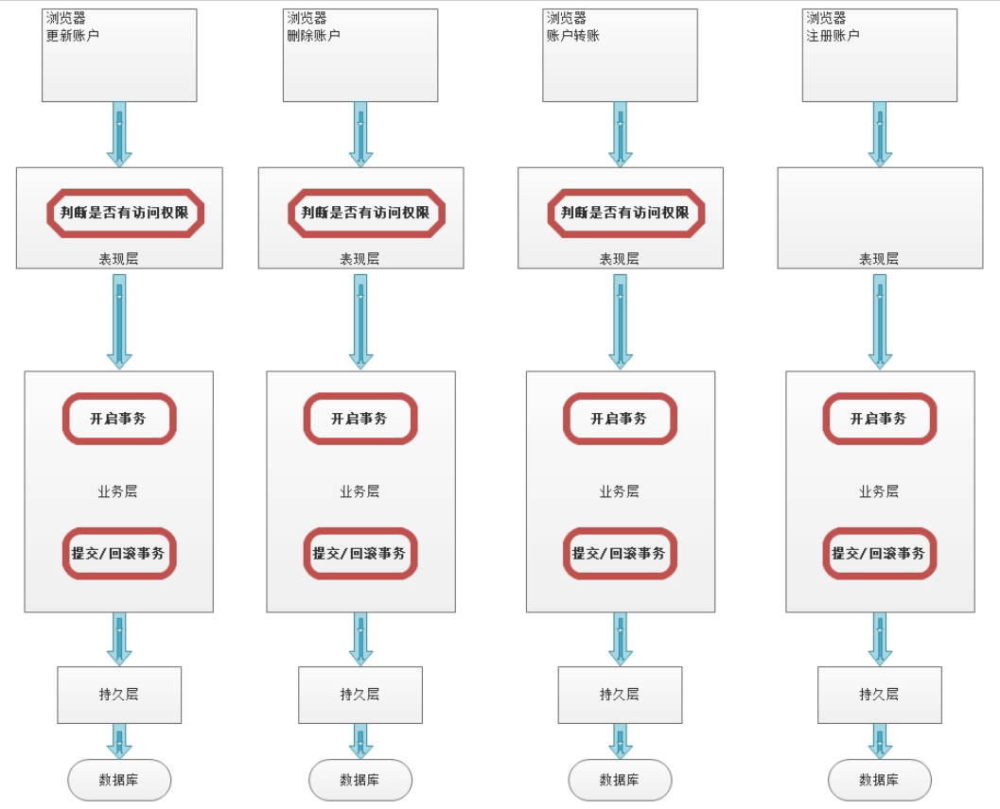

上图描述的就是未采用AOP思想设计的程序，当我们红色框中圈定的方法时，会带来大量的重复劳动。程序中充斥着大量的重复代码，使我们程序的独立性很差。而下图中是采用了AOP思想设计的程序，它把红框部分的代码抽取出来的同时，运用动态代理技术，在运行期对需要使用的业务逻辑方法进行增强。

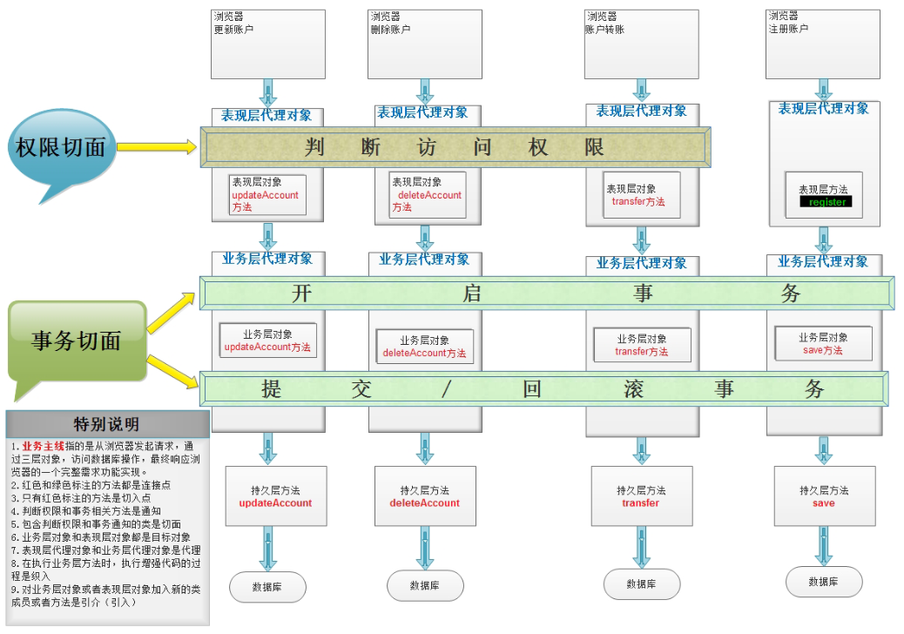

### 1.2 AOP术语

| 名词              | 解释                                                         |
| ----------------- | ------------------------------------------------------------ |
| Joinpoint(连接点) | 它指的是那些可以用于把增强代码加入到业务主线中的点，那么由上图中我们可以看出，这些点指的就是方法。在方法执行的前后通过动态代理技术加入增强的代码。在Spring框架AOP思想的技术实现中，也只支持方法类型的连接点。 |
| Pointcut(切入点)  | 它指的是那些已经把增强代码加入到业务主线进来之后的连接点。由上图中，我们看出表现层`transfer`方法就只是连接点，因为判断访问权限的功能并没有对其增强。 |
| Advice(通知/增强) | 它指的是切面类中用于提供增强功能的方法。并且不同的方法增强的时机是不一样的。比如，开启事务肯定要在业务方法执行之前执行；提交事务要在业务方法正常执行之后执行，而回滚事务要在业务方法执行产生异常之后执行等等。那么这些就是通知的类型。其分类有：**前置通知** **后置通知** **异常通知** **最终通知** **环绕通知**。 |
| Target(目标对象)  | 它指的是代理的目标对象。即被代理对象                         |
| Proxy(代理)       | 它指的是一个类被AOP织入增强后，产生的代理类。即代理对象。    |
| Weaving(织入)     | 它指的是把增强应用到目标对象来创建新的代理对象的过程。spring采用动态代理织入，而AspectJ采用编译期织入和类装载期织入。 |
| Aspect(切面)      | 它指定是增强的代码所关注的方面，把这些相关的增强代码定义到一个类中，这个类就是切面类。例如，事务切面，它里面定义的方法就是和事务相关的，像开启事务，提交事务，回滚事务等等，不会定义其他与事务无关的方法。我们前面的案例中`TrasnactionManager`就是一个切面。 |

连接点：方法开始时、结束时、正常运行完毕时、方法异常时等这些特殊的时机点，我们称之为连接点，项目中每个方法都有连接点，连接点是一种候选点

切入点：指定AOP思想想要影响的具体方法是哪些，描述感兴趣的方法

Advice增强：

- 第一个层次：指的是横切逻辑
- 第二个层次：方位点（在某一些连接点上加入横切逻辑，那么这些连接点就叫做方位点，描述的是具体的特殊时机）

Aspect切面：切面概念是对上述概念的一个综合

Aspect切面= 切入点+增强 = 切入点（锁定方法） + 方位点（锁定方法中的特殊时机）+ 横切逻辑

**众多的概念，目的就是为了锁定要在哪个地方插入什么横切逻辑代码**


## 第2节 Spring中AOP的代理选择

Spring 实现AOP思想使用的是动态代理技术

默认情况下，Spring会根据被代理对象是否实现接口来选择使用JDK还是CGLIB。当被代理对象没有实现任何接口时，Spring会选择CGLIB。当被代理对象实现了接口，Spring会选择JDK官方的代理技术，不过我们可以通过配置的方式，让Spring强制使用CGLIB


## 第3节 Spring中AOP的配置方式

在Spring的AOP配置中，也和IoC配置一样，支持3类配置方式

第一类：使用XML配置

第二类：使用XML+注解组合配置

第三类：使用纯注解配置

## 第4节 Spring中AOP实现

需求：横切逻辑代码是打印日志，希望把打印日志的逻辑织入到目标方法的特定位置(service层transfer方法)

### 4.1 XML模式

Spring是模块化开发的框架，使用aop就引入aop的jar

- 坐标

  ```xml
  <dependency>
      <groupId>org.springframework</groupId>
      <artifactId>spring-aop</artifactId>
      <version>5.1.12.RELEASE</version>
  </dependency> <dependency>
      <groupId>org.aspectj</groupId>
      <artifactId>aspectjweaver</artifactId>
      <version>1.9.4</version>
  </dependency>
  ```

  

- AOP核心配置

  ```xml
  <!--
   Spring基于XML的AOP配置前期准备：
   在spring的配置⽂件中加⼊aop的约束
   xmlns:aop="http://www.springframework.org/schema/aop"
   http://www.springframework.org/schema/aop 
  https://www.springframework.org/schema/aop/spring-aop.xsd 
  
   Spring基于XML的AOP配置步骤：
   第⼀步：把通知Bean交给Spring管理
   第⼆步：使⽤aop:config开始aop的配置
   第三步：使⽤aop:aspect配置切⾯
   第四步：使⽤对应的标签配置通知的类型
   ⼊⻔案例采⽤前置通知，标签为aop:before
  -->
  <!--把通知bean交给spring来管理-->
  <bean id="logUtil" class="com.lagou.utils.LogUtil"></bean>
  <!--开始aop的配置-->
  <aop:config>
      <!--配置切⾯-->
      <aop:aspect id="logAdvice" ref="logUtil">
          <!--配置前置通知-->
          <aop:before method="printLog" 
                      pointcut="execution(public * com.lagou.service.impl.TransferServiceImpl.updateAccountByCardNo(com.lagou.pojo.Account))"></aop:before>
      </aop:aspect>
  </aop:config>
  ```

- 细节

  - 关于切入点表达式

    上述配置实现了对 TransferServiceImpl 的 updateAccountByCardNo 方法进行增强，在其执行之前，输出了记录日志的语句。这里面，我们接触了一个比较陌生的名称：切入点表达式，它是做什么的呢？我们往下看。

    - 概念及作用

    - 关于AspectJ

    - 切入点表达式使用示例

      ```
      全限定⽅法名 访问修饰符 返回值 包名.包名.包名.类名.⽅法名(参数列表)
      
       全匹配⽅式：
       public void com.lagou.service.impl.TransferServiceImpl.updateAccountByCardNo(com.lagou.pojo.Account)
       
       访问修饰符可以省略
       void com.lagou.service.impl.TransferServiceImpl.updateAccountByCardNo(com.lagou.pojo.Account)
       
       返回值可以使⽤*，表示任意返回值
       * com.lagou.service.impl.TransferServiceImpl.updateAccountByCardNo(com.lagou.pojo.Account)
       
       包名可以使⽤.表示任意包，但是有⼏级包，必须写⼏个
       * ....TransferServiceImpl.updateAccountByCardNo(com.lagou.pojo.Account)
       
       包名可以使⽤..表示当前包及其⼦包
       * ..TransferServiceImpl.updateAccountByCardNo(com.lagou.pojo.Account)
       
       类名和⽅法名，都可以使⽤.表示任意类，任意⽅法
       * ...(com.lagou.pojo.Account)
       
       参数列表，可以使⽤具体类型
       基本类型直接写类型名称 ： int
       引⽤类型必须写全限定类名：java.lang.String
       参数列表可以使⽤*，表示任意参数类型，但是必须有参数
       * *..*.*(*)
       
       参数列表可以使⽤..，表示有⽆参数均可。有参数可以是任意类型
       * *..*.*(..)
       
       全通配⽅式：
       * *..*.*(..)
      ```

  - 改变代理方式的配置

    在前面我们已经说了，Spring在选择创建代理对象时，会根据被代理对象的实际情况来选择的。被代理对象实现了接口，则采用基于接口的动态代理。当被代理对象没有实现任何接口的时候，Spring会自动切换到基于子类的动态代理方式。但是我们都知道，无论被代理对象是否实现接口，只要不是final修饰的类都可以采用cglib提供的方式创建代理对象。所以Spring也考虑到了这个情况，提供了配置的方式实现强制使用基于子类的动态代理（即cglib的方式），配置的方式有两种

    - 使用`aop:config`标签配置

      ```xml
      <aop:config proxy-target-class="true">
      ```

      

    - 使用`aop:aspectj-autoproxy`标签配置

      ```xml
      <!--此标签是基于XML和注解组合配置AOP时的必备标签，表示Spring开启注解配置AOP的⽀持-->
      <aop:aspectj-autoproxy proxy-target-class="true"></aop:aspectj-autoproxy>
      ```

  - 五种通知类型

    - 前置通知

      **配置方式：`aop:befor`标签**

      ```xml
      <!--
       作⽤：
       ⽤于配置前置通知。
       出现位置：
       它只能出现在aop:aspect标签内部
       属性：
       method：⽤于指定前置通知的⽅法名称
       pointcut：⽤于指定切⼊点表达式
       pointcut-ref：⽤于指定切⼊点表达式的引⽤
      -->
      <aop:before method="printLog" pointcut-ref="pointcut1">
      </aop:before>
      ```

      **执行时机**

      前置通知永远都会在切入点方法（业务核心方法）执行之前执行

      **细节**

      前置通知可以获取切入点方法的参数，并对其进行增强。

    - 环绕通知

      **配置方式：aop:around 标签**

      ```xml
      <!--
       作⽤：
       ⽤于配置环绕通知。
       出现位置：
       它只能出现在aop:aspect标签的内部
       属性：
       method:⽤于指定环绕通知的⽅法名称
       pointcut:⽤于指定切⼊点表达式
       pointcut-ref:⽤于指定切⼊点表达式的引⽤
       
       -->
      <aop:around method="aroundPrintLog" pointcut-ref="pt1"></aop:around>
      ```

      **特别说明**

      环绕通知，它是有别于前⾯四种通知类型外的特殊通知。前⾯四种通知（前置，后置，异常和最终）它们都是指定何时增强的通知类型。而环绕通知，它是Spring框架为我们提供的⼀种可以通过编码的方式，控制增强代码何时执行的通知类型。它里面借助的ProceedingJoinPoint接口及其实现类，实现手动触发切入点方法的调用。

      **ProceedingJoinPoint接口介绍**

      类视图：

      

      

    - 后置通知

      **配置方式：aop:after-returning标签**

      ```xml
      <!--
       作⽤：
       ⽤于配置正常执⾏时通知
       出现位置：
       它只能出现在aop:aspect标签内部
       属性：
       method:⽤于指定后置通知的⽅法名称
       pointcut:⽤于指定切⼊点表达式
       pointcut-ref:⽤于指定切⼊点表达式的引⽤
       -->
      <aop:after-returning method="afterReturningPrintLog" 
                           pointcut-ref="pt1">
      </aop:after-returning>
      ```

      

    - 异常通知

      **配置方式：aop:after-throwing标签**

      ```xml
      <!--
       作⽤：
       ⽤于配置异常通知。
       出现位置：
       它只能出现在aop:aspect标签内部
       属性：
       method:⽤于指定异常通知的⽅法名称
       pointcut:⽤于指定切⼊点表达式
       pointcut-ref:⽤于指定切⼊点表达式的引⽤
      
       -->
      <aop:after-throwing method="afterThrowingPrintLog" pointcut-ref="pt1">
      </aop:after-throwing>
      ```

      **执行时机**

      异常通知的执行时机是在切入点方法（业务核心方法）执行产生异常之后，异常通知执行。如果切入点方法执行没有产生异常，则异常通知不会执行。

      **细节**

      异常通知不仅可以获取切入点方法执行的参数，也可以获取切入点方法执行产生的异常信息

    - 最终通知

      **配置方式：aop:after标签**

      ```xml
      <!--
       作⽤：
       ⽤于指定最终通知。
       出现位置：
       它只能出现在aop:aspect标签内部
       属性：
       method:⽤于指定最终通知的⽅法名称
       pointcut:⽤于指定切⼊点表达式
       pointcut-ref:⽤于指定切⼊点表达式的引⽤
      -->
      <aop:after method="afterPrintLog" pointcut-ref="pt1"></aop:after>
      ```

      **执行时机**

      最终通知的执行时机是在切入点方法（业务核心方法）执行完成之后，切入点方法返回之前执行。换句话说，无论切入点方法执行是否产生异常，它都会在返回之前执行。

      **细节**

      最终通知执行时，可以获取到通知方法的参数。同时它可以做一些清理操作。

    

### 4.2 XML+注解模式

- XML中开启Spring对注解AOP的支持

  ```xml
  <!--开启spring对注解aop的⽀持-->
  <aop:aspectj-autoproxy/>
  ```

- 示例

  ```java
  /**
  * 模拟记录⽇志
  * @author 应癫
  */
  @Component
  @Aspect
  public class LogUtil {
      /**
       * 我们在xml中已经使⽤了通⽤切⼊点表达式，供多个切⾯使⽤，那么在注解中如何使⽤呢？
       * 第⼀步：编写⼀个⽅法
       * 第⼆步：在⽅法使⽤@Pointcut注解
       * 第三步：给注解的value属性提供切⼊点表达式
       * 细节：
       * 1.在引⽤切⼊点表达式时，必须是⽅法名+()，例如"pointcut()"。
       * 2.在当前切⾯中使⽤，可以直接写⽅法名。在其他切⾯中使⽤必须是全限定⽅法名。
       */
      @Pointcut("execution(* com.lagou.service.impl.*.*(..))")
      public void pointcut(){}
  
      @Before("pointcut()")
      public void beforePrintLog(JoinPoint jp){
          Object[] args = jp.getArgs();
          System.out.println("前置通知：beforePrintLog，参数是："+Arrays.toString(args));
      }
      @AfterReturning(value = "pointcut()",returning = "rtValue")
      public void afterReturningPrintLog(Object rtValue){
          System.out.println("后置通知：afterReturningPrintLog，返回值是："+rtValue);
      }
      @AfterThrowing(value = "pointcut()",throwing = "e")
      public void afterThrowingPrintLog(Throwable e){
          System.out.println("异常通知：afterThrowingPrintLog，异常是："+e);
      }
      @After("pointcut()")
      public void afterPrintLog(){
          System.out.println("最终通知：afterPrintLog");
      }
      /**
       * 环绕通知
       * @param pjp
       * @return
       */
      @Around("pointcut()")
      public Object aroundPrintLog(ProceedingJoinPoint pjp){
          //定义返回值
          Object rtValue = null;
          try{
              //前置通知
              System.out.println("前置通知");
              //1.获取参数
              Object[] args = pjp.getArgs();
              //2.执⾏切⼊点⽅法
              rtValue = pjp.proceed(args);
              //后置通知
              System.out.println("后置通知");
          }catch (Throwable t){
              //异常通知
              System.out.println("异常通知");
              t.printStackTrace();
          }finally {
              //最终通知
              System.out.println("最终通知");
          }
          return rtValue;
      }
  }
  ```


### 4.3 注解模式

在使用注解驱动开发AOP时，我们要明确的就是，是注解替换掉配置文件中的下面配置：

```xml
<!--开启spring对注解aop的⽀持-->
<aop:aspectj-autoproxy/>
```

在配置类中使用如下注解进行替换上述配置

```java
/**
* @author 应癫
*/
@Configuration
@ComponentScan("com.lagou")
@EnableAspectJAutoProxy //开启spring对注解AOP的⽀持
public class SpringConfiguration {
}
```


## 第5节 Spring声明式事务的支持

**编程式事务：**在业务代码中添加事务控制代码，这样的事务控制机制就叫做编程式事务

**声明式事务：**通过xml或者注解配置的方式达到事务控制的目的，叫做声明式事务


### 5.1 事务回顾

#### 5.1.1 事务的概念

事务指逻辑上的一组操作，组成这组操作的各个单元，要么全部成功，要么全部不成功。从而确保了数据的准确与安全。例如：A——B转帐，对应于如下两条sql语句：

```sql
/*转出账户减钱*/
update account set money=money-100where name=‘a’;
/**转入账户加钱*/
update account set money=money+100where name=‘b’;
```

这两条语句的执行，要么全部成功，要么全部不成功。

#### 5.1.2 事务的四大特性

**原子性（Atomicity）**原子性是指事务是一个不可分割的工作单位，事务中的操作要么都发生，要么都不发生。

从操作的⻆度来描述，事务中的各个操作要么都成功要么都失败

**一致性（Consistency）**事务必须使数据库从一个一致性状态变换到另外一个一致性状态。

例如转账前A有1000，B有1000。转账后A+B也得是2000。一致性是从数据的⻆度来说的，（1000，1000）（900，1100），不应该出现（900，1000）

**隔离性（Isolation）**事务的隔离性是多个用户并发访问数据库时，数据库为每一个用户开启的事务，每个事务不能被其他事务的操作数据所干扰，多个并发事务之间要相互隔离。

比如：事务1给员工涨工资2000，但是事务1尚未被提交，员工发起事务2查询工资，发现工资涨了2000块钱，读到了事务1尚未提交的数据（脏读）

**持久性（Durability）**

持久性是指一个事务一旦被提交，它对数据库中数据的改变就是永久性的，接下来即使数据库发生故障也不应该对其有任何影响。

#### 5.1.3 事务的隔离级别

不考虑隔离级别，会出现以下情况：（以下情况全是错误的），也即为隔离级别在解决事务并发问题

**脏读**：一个线程中的事务读到了另外一个线程中**未提交**的数据。

**不可重复读**：一个线程中的事务读到了另外一个线程中已经提交的update的数据（前后内容不一样）

​	场景：

> 员工A发起事务1，查询工资，工资为1w，此时事务1尚未关闭
>
> 财务人员发起了事务2，给员工A张了2000块钱，并且提交了事务
>
> 员工A通过事务1再次发起查询请求，发现工资为1.2w，原来读出来1w读不到了，叫做不可重复读

**虚读（幻读）**：一个线程中的事务读到了另外一个线程中已经提交的insert或者delete的数据（前后条数不一样）

​	场景：

> 事务1查询所有工资为1w的员工的总数，查询出来了10个人，此时事务尚未关闭
>
> 事务2财务人员发起，新来员工，工资1w，向表中插入了2条数据，并且提交了事务
>
> 事务1再次查询工资为1w的员工个数，发现有12个人，见了鬼了


数据库共定义了四种隔离级别：

1. Read uncommitted（读未提交）：最低级别，以上情况均无法保证。(读未提交) 最低
2. Read committed（读已提交）：可避免脏读情况发生。不可重复读和幻读一定会发生。第三
3. Repeatable read（可重复读）：可避免脏读、不可重复读情况的发生。(幻读有可能发生) 第二。该机制下会对要update的行进行加锁
4. Serializable（串行化）：可避免脏读、不可重复读、虚读情况的发生。（串行化）最高

**注意：级别依次升高，效率依次降低**

MySQL的默认隔离级别是：`REPEATABLE READ`

查询当前使用的隔离级别：`select @@tx_isolation;`

设置MySQL事务的隔离级别：`set session transaction isolation level xxx;`（设置的是当前mysql连接会话的，并不是永久改变的）


#### 5.1.4 事务的传播行为

事务往往在service层进行控制，如果出现service层方法A调用了另外一个service层方法B，A和B方法本身都已经被添加了事务控制，那么A调用B的时候，就需要进行事务的一些协商，这就叫做事务的传播行为。

A调用B，我们站在B的⻆度来观察来定义事务的传播行为

| 传播机制                  | 解释                                                         |
| ------------------------- | ------------------------------------------------------------ |
| PROPAGATION_REQUIRED      | 如果当前没有事务，就新建一个事务，如果已经存在一个事务中，加入到这个事务中。这是最常⻅的选择。 |
| PROPAGATION_SUPPORTS      | 支持当前事务，如果当前没有事务，就以非事务方式执行。         |
| PROPAGATION_MANDATORY     | 使用当前的事务，如果当前没有事务，就抛出异常。               |
| PROPAGATION_REQUIRES_NEW  | 新建事务，如果当前存在事务，把当前事务挂起。                 |
| PROPAGATION_NOT_SUPPORTED | 以非事务方式执行操作，如果当前存在事务，就把当前事务挂起。   |
| PROPAGATION_NEVER         | 以非事务方式执行，如果当前存在事务，则抛出异常。             |
| PROPAGATION_NESTED        | 如果当前存在事务，则在嵌套事务内执行。如果当前没有事务，则执行与PROPAGATION_REQUIRED类似的操作。 |


### 5.2 Spring中事务的API

mybatis：sqlSession.commit();

hibernate：session.commit();

**PlatformTransactionManager**

```java
public interface PlatformTransactionManager {
    /**
     * 获取事务状态信息
     */
    TransactionStatus getTransaction(@Nullable TransactionDefinition definition)
        throws TransactionException;
    /**
     * 提交事务
     */
    void commit(TransactionStatus status) throws TransactionException;
    /**
     * 回滚事务
     */
    void rollback(TransactionStatus status) throws TransactionException; }
```

**作用**

此接口是Spring的事务管理器核心接口。Spring本身并不支持事务实现，只是负责提供标准，应用底层支持什么样的事务，需要提供具体实现类。此处也是策略模式的具体应用。在Spring框架中，也为我们内置了一些具体策略，例如：`DataSourceTransactionManager`,`HibernateTransactionManager`等等。（和`HibernateTransactionManager`事务管理器在`spring-orm-5.1.12.RELEASE.jar`中）

- Spring JdbcTemplate（数据库操作工具）、Mybatis（mybatis-spring.jar）————>DataSourceTransactionManager

- Hibernate框架——————> HibernateTransactionManager

DataSourceTransactionManager 归根结底是横切逻辑代码，声明式事务要做的就是使用Aop（动态代理）来将事务控制逻辑织入到业务代码


### 5.2 Spring 声明式事务配置

- 纯xml模式

  - 导入jar

    ```xml
    <dependency>
        <groupId>org.springframework</groupId>
        <artifactId>spring-context</artifactId>
        <version>5.1.12.RELEASE</version>
    </dependency> <dependency>
        <groupId>org.aspectj</groupId>
        <artifactId>aspectjweaver</artifactId>
        <version>1.9.4</version>
    </dependency> <dependency>
        <groupId>org.springframework</groupId>
        <artifactId>spring-jdbc</artifactId>
        <version>5.1.12.RELEASE</version>
    </dependency> <dependency>
        <groupId>org.springframework</groupId>
        <artifactId>spring-tx</artifactId>
        <version>5.1.12.RELEASE</version>
    </dependency>
    ```

  - xml配置

    ```xml
    <tx:advice id="txAdvice" transaction-manager="transactionManager">
        <!--定制事务细节，传播⾏为、隔离级别等-->
        <tx:attributes>
            <!--⼀般性配置-->
            <tx:method name="*" read-only="false"
                       propagation="REQUIRED" isolation="DEFAULT" timeout="-1"/>
            <!--针对查询的覆盖性配置-->
            <tx:method name="query*" read-only="true"
                       propagation="SUPPORTS"/>
        </tx:attributes>
    </tx:advice>
    <aop:config>
        <!--advice-ref指向增强=横切逻辑+⽅位-->
        <aop:advisor advice-ref="txAdvice" pointcut="execution(* com.lagou.edu.service.impl.TransferServiceImpl.*(..))"/>
    </aop:config>
    ```

- 基于XML+注解

  - xml配置

    ```xml
    <!--配置事务管理器-->
    <bean id="transactionManager"
          class="org.springframework.jdbc.datasource.DataSourceTransactionManager">
        <property name="dataSource" ref="dataSource"></property>
    </bean>
    <!--开启spring对注解事务的⽀持-->
    <tx:annotation-driven transaction-manager="transactionManager"/>
    ```

  - 在接口、类或者方法上添加@Transaction注解

    ```java
    @Transactional(readOnly = true,propagation = Propagation.SUPPORTS)
    ```

- 基于纯注解

  Spring基于注解驱动开发的事务控制配置，只需要把 xml 配置部分改为注解实现。只是需要一个注解替换掉xml配置文件中的`<tx:annotation-driven transaction-manager="transactionManager"/>`配置。

  在 Spring 的配置类上添加 `@EnableTransactionManagement` 注解即可

  ```java
  @EnableTransactionManagement//开启spring注解事务的支持
  public class SpringConfiguration {}
  ```

  

# 七、 Spring AOP源码深度剖析

## 第1节 代理对象创建

### 1.1 AOP基础用例准备

Bean定义

```java
@Component
public class LagouBean {
    public voidtech(){
        System.out.println("java learning......");    
    }
}
```

Aspect定义

```java
package com.lagou;
import org.aspectj.lang.annotation.Aspect;
import org.aspectj.lang.annotation.Before;
import org.aspectj.lang.annotation.Pointcut;
import org.springframework.stereotype.Component;
@Component
@Aspect
public class LagouAspect {
    @Pointcut("execution(* com.lagou.*.*(..))")
    public void pointcut(){
    }
    @Before("pointcut()")
    public void before() {
        System.out.println("before method ......");
    }
}
```

测试用例

```java
/**
* 测试⽤例：Aop 代理对象创建
*/
@Test
public void testAopProxyBuild(){
    ApplicationContext applicationContext = new
        AnnotationConfigApplicationContext(SpringConfig.class);
    LagouBean lagouBean = applicationContext.getBean(LagouBean.class);
    lagouBean.tech();
}
```


### 1.2 时机点分析

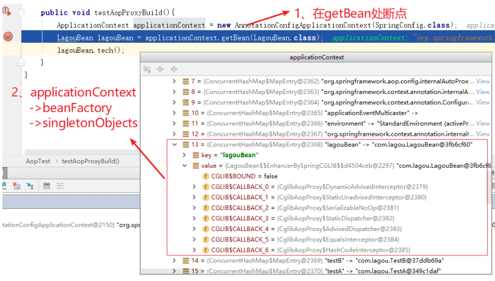

我们发现在 getBean 之前，LagouBean对象已经产生（即在第一行初始化代码中完成），而且该对象是一个代理对象（Cglib代理对象），我们断定，容器初始化过程中目标Ban已经完成了代理，返回了代理对象。

### 1.3 代理对象创建流程

AbstractAutowireCapableBeanFactory#initializeBean(java.lang.String, java.lang.Object,org.springframework.beans.factory.support.RootBeanDefinition)

```java
/**
 *
 * 初始化Bean
 包括Bean后置处理器初始化
 Bean的⼀些初始化⽅法的执⾏init-method
 Bean的实现的声明周期相关接⼝的属性注⼊
 */
protected Object initializeBean(final String beanName, final Object bean,
                                @Nullable RootBeanDefinition mbd) {
    // 执⾏所有的AwareMethods
    if (System.getSecurityManager() != null) {
        AccessController.doPrivileged((PrivilegedAction<Object>) () -> {
            invokeAwareMethods(beanName, bean);
            return null;
        }, getAccessControlContext());
    }
    else {
        invokeAwareMethods(beanName, bean);
    }
    Object wrappedBean = bean;
    if (mbd == null || !mbd.isSynthetic()) {
        // 执⾏所有的BeanPostProcessor#postProcessBeforeInitialization 初始化之前
        的处理器⽅法
            wrappedBean = applyBeanPostProcessorsBeforeInitialization(wrappedBean,beanName);
    }
    try {
        // 这⾥就开始执⾏afterPropertiesSet（实现了InitializingBean接⼝）⽅法和
        initMethod
            invokeInitMethods(beanName, wrappedBean, mbd);
    }
    catch (Throwable ex) {
        throw new BeanCreationException(
            (mbd != null ? mbd.getResourceDescription() : null),
            beanName, "Invocation of init method failed", ex);
    }
    if (mbd == null || !mbd.isSynthetic()) {
        // 整个Bean初始化完成，执⾏后置处理器⽅法
        wrappedBean = applyBeanPostProcessorsAfterInitialization(wrappedBean,beanName);
    }
    return wrappedBean; }
```

AbstractAutowireCapableBeanFactory#applyBeanPostProcessorsAfterInitialization

```java
@Override
public Object applyBeanPostProcessorsAfterInitialization(Object existingBean, String beanName)
    throws BeansException {
    Object result = existingBean;
    // 循环执⾏后置处理器
    for (BeanPostProcessor processor : getBeanPostProcessors()) {
        Object current = processor.postProcessAfterInitialization(result,beanName);
        if (current == null) {
            return result;
        }
        result = current;
    }
    return result;
}
```

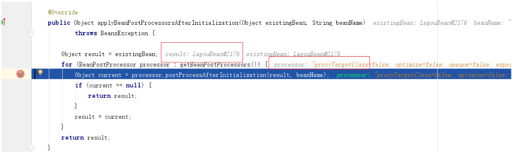

创建代理对象的后置处理器AbstractAutoProxyCreator#postProcessAfterInitialization

```java
/**
 * Create a proxy with the configured interceptors if the bean is
 * identified as one to proxy by the subclass.
 * @see #getAdvicesAndAdvisorsForBean
 */
@Override
public Object postProcessAfterInitialization(@Nullable Object bean, String beanName) {
    if (bean != null) {
        // 检查下该类是否已经暴露过了（可能已经创建了，⽐如A依赖B时，创建A时候，就会先
        去创建B。
            // 当真正需要创建B时，就没必要再代理⼀次已经代理过的对象）,避免重复创建
            Object cacheKey = getCacheKey(bean.getClass(), beanName);
        if (this.earlyProxyReferences.remove(cacheKey) != bean) {
            return wrapIfNecessary(bean, beanName, cacheKey);
        }
    }
    return bean;
}
```

AbstractAutoProxyCreator#wrapIfNecessary

```java
/**
* Wrap the given bean if necessary, i.e. if it is eligible for being
proxied.
 * @param bean the raw bean instance
 * @param beanName the name of the bean
 * @param cacheKey the cache key for metadata access
 * @return a proxy wrapping the bean, or the raw bean instance as-is
 */
protected Object wrapIfNecessary(Object bean, String beanName, Object cacheKey) {
    // targetSourcedBeans包含，说明前⾯创建过
    if (StringUtils.hasLength(beanName) &&
        this.targetSourcedBeans.contains(beanName)) {
        return bean;
    }
    if (Boolean.FALSE.equals(this.advisedBeans.get(cacheKey))) {
        return bean;
    }
    if (isInfrastructureClass(bean.getClass()) || shouldSkip(bean.getClass(), beanName)) {
        this.advisedBeans.put(cacheKey, Boolean.FALSE);
        return bean;
    }
    // Create proxy if we have advice.
    // 得到所有候选Advisor，对Advisors和bean的⽅法双层遍历匹配，最终得到⼀个
    List<Advisor>，即specificInterceptors
        Object[] specificInterceptors =
        getAdvicesAndAdvisorsForBean(bean.getClass(), beanName, null);
    if (specificInterceptors != DO_NOT_PROXY) {
        this.advisedBeans.put(cacheKey, Boolean.TRUE);
        // 重点，创建代理对象
        Object proxy = createProxy(
            bean.getClass(), beanName, specificInterceptors, new SingletonTargetSource(bean));
        this.proxyTypes.put(cacheKey, proxy.getClass());
        return proxy;
    }
    this.advisedBeans.put(cacheKey, Boolean.FALSE);
    return bean;
}
```

AbstractAutoProxyCreator#createProxy

```java
/**
 * Create an AOP proxy for the given bean.
 * 为指定 bean 创建代理对象
 */
protected Object createProxy(Class<?> beanClass, @Nullable String beanName,
                             @Nullable Object[] specificInterceptors, TargetSource targetSource) {
    if (this.beanFactory instanceof ConfigurableListableBeanFactory) {
        AutoProxyUtils.exposeTargetClass((ConfigurableListableBeanFactory)
                                         this.beanFactory, beanName, beanClass);
    }
    // 创建代理的⼯作交给ProxyFactory
    ProxyFactory proxyFactory = new ProxyFactory();
    proxyFactory.copyFrom(this);
    // 根据⼀些情况判断是否要设置proxyTargetClass=true
    if (!proxyFactory.isProxyTargetClass()) {
        if (shouldProxyTargetClass(beanClass, beanName)) {
            proxyFactory.setProxyTargetClass(true);
        }
        else {
            evaluateProxyInterfaces(beanClass, proxyFactory);
        }
    }
    // 把指定和通⽤拦截对象合并, 并都适配成Advisor
    Advisor[] advisors = buildAdvisors(beanName, specificInterceptors);
    proxyFactory.addAdvisors(advisors);
    // 设置参数
    proxyFactory.setTargetSource(targetSource);
    customizeProxyFactory(proxyFactory);
    proxyFactory.setFrozen(this.freezeProxy);
    if (advisorsPreFiltered()) {
        proxyFactory.setPreFiltered(true);
    }
    // 上⾯准备做完就开始创建代理
    return proxyFactory.getProxy(getProxyClassLoader());
}
```

接着跟进到ProxyFactory中

```java
public class ProxyFactory extends ProxyCreatorSupport {
    public Object getProxy(ClassLoader classLoader) {
        // ⽤ProxyFactory创建AopProxy, 然后⽤AopProxy创建Proxy, 所以这⾥重要的是看获取的AopProxy
        // 对象是什么,
        // 然后进去看怎么创建动态代理, 提供了两种：jdk proxy, cglib
        return createAopProxy().getProxy(classLoader);
    } 
}

public class ProxyCreatorSupport extends AdvisedSupport {
    private AopProxyFactory aopProxyFactory;

    public ProxyCreatorSupport() {
        this.aopProxyFactory = new DefaultAopProxyFactory();
    }

    protected final synchronized AopProxy createAopProxy() {
        if (!this.active) {
            activate();
        }
        //先获取创建AopProxy的⼯⼚, 再由此创建AopProxy
        return getAopProxyFactory().createAopProxy(this);
    }

    public AopProxyFactory getAopProxyFactory() {
        return this.aopProxyFactory;
    } 
}
```

流程就是用AopProxyFactory创建AopProxy, 再用AopProxy创建代理对象，这里的AopProxyFactory默认是DefaultAopProxyFactory，看他的createAopProxy方法

```java
public class DefaultAopProxyFactory implements AopProxyFactory, Serializable {
    @Override
    public AopProxy createAopProxy(AdvisedSupport config) throws AopConfigException {
        if (config.isOptimize() || config.isProxyTargetClass() ||hasNoUserSuppliedProxyInterfaces(config)) {
            Class<?> targetClass = config.getTargetClass();
            if (targetClass == null) {
                throw new AopConfigException("TargetSource cannot determine target class: "
                                             + "Either an interface or a target is required for proxy creation.");
            }
            if (targetClass.isInterface()) {
                return new JdkDynamicAopProxy(config);
            }
            return new ObjenesisCglibAopProxy(config);
        } else {
            return new JdkDynamicAopProxy(config);
        }
    }
    /**
 * Determine whether the supplied {@link AdvisedSupport} has only the
 * {@link org.springframework.aop.SpringProxy} interface specified (or no
 * proxy interfaces specified at all).
 */
    private boolean hasNoUserSuppliedProxyInterfaces(AdvisedSupport config) {
        Class<?>[] interfaces = config.getProxiedInterfaces();
        return (interfaces.length == 0 || (interfaces.length == 1 && SpringProxy.class.equals(interfaces[0])));
    } }
```

这里决定创建代理对象是用JDK Proxy，还是用 Cglib 了，最简单的从使用方面使用来说：设置proxyTargetClass=true强制使用Cglib 代理，什么参数都不设并且对象类实现了接口则默认用JDK 代理，如果没有实现接口则也必须用Cglib

ProxyFactory#getProxy(java.lang.ClassLoader) —— CglibAopProxy#getProxy(java.lang.ClassLoader)

```java
@Override
public Object getProxy(@Nullable ClassLoader classLoader) {
    if (logger.isTraceEnabled()) {
        logger.trace("Creating CGLIB proxy: " + this.advised.getTargetSource());
    }
    try {
        Class<?> rootClass = this.advised.getTargetClass();
        Assert.state(rootClass != null, "Target class must be available for creating a CGLIB proxy");
        Class<?> proxySuperClass = rootClass;
        if (ClassUtils.isCglibProxyClass(rootClass)) {
            proxySuperClass = rootClass.getSuperclass();
            Class<?>[] additionalInterfaces = rootClass.getInterfaces();
            for (Class<?> additionalInterface : additionalInterfaces) {
                this.advised.addInterface(additionalInterface);
            }
        }
        // Validate the class, writing log messages as necessary.
        validateClassIfNecessary(proxySuperClass, classLoader);
        // 配置 Cglib 增强
        Enhancer enhancer = createEnhancer();
        if (classLoader != null) {
            enhancer.setClassLoader(classLoader);
            if (classLoader instanceof SmartClassLoader &&
                ((SmartClassLoader)
                 classLoader).isClassReloadable(proxySuperClass)) {
                enhancer.setUseCache(false);
            }
        }
        enhancer.setSuperclass(proxySuperClass);

        enhancer.setInterfaces(AopProxyUtils.completeProxiedInterfaces(this.advised));
        enhancer.setNamingPolicy(SpringNamingPolicy.INSTANCE);
        enhancer.setStrategy(new
                             ClassLoaderAwareUndeclaredThrowableStrategy(classLoader));
        Callback[] callbacks = getCallbacks(rootClass);
        Class<?>[] types = new Class<?>[callbacks.length];
        for (int x = 0; x < types.length; x++) {
            types[x] = callbacks[x].getClass();
        }
        // fixedInterceptorMap only populated at this point, after getCallbacks call above
        enhancer.setCallbackFilter(new ProxyCallbackFilter(
            this.advised.getConfigurationOnlyCopy(), this.fixedInterceptorMap,
            this.fixedInterceptorOffset));
        enhancer.setCallbackTypes(types);
        // ⽣成代理类，并且创建⼀个代理类的实例
        return createProxyClassAndInstance(enhancer, callbacks);
    }
    catch (CodeGenerationException | IllegalArgumentException ex) {
        throw new AopConfigException("Could not generate CGLIB subclass of " +
                                     this.advised.getTargetClass() +
                                     ": Common causes of this problem include using a final class or a
                                     non-visible class",
                                     ex);
    }
    catch (Throwable ex) {
        // TargetSource.getTarget() failed
        throw new AopConfigException("Unexpected AOP exception", ex);
    }
}
```


**AOP源码分析类方法调用关系课堂讲解过程中记录**

```
org.springframework.beans.factory.support.AbstractAutowireCapableBeanFactory#initializeBean

调用

org.springframework.beans.factory.support.AbstractAutowireCapableBeanFactory#applyBeanPostProcessorsAfterInitialization

调用

org.springframework.aop.framework.autoproxy.AbstractAutoProxyCreator#postProcessAfterInitialization（后置处理器AbstractAutoProxyCreator完成bean代理对象创建）

调用

org.springframework.aop.framework.autoproxy.AbstractAutoProxyCreator#wrapIfNecessary

调用

org.springframework.aop.framework.autoproxy.AbstractAutoProxyCreator#createProxy（在这一步把委托对象的aop增强和通用拦截进行合并，最终给代理对象）

调用

org.springframework.aop.framework.DefaultAopProxyFactory#createAopProxy

调用

org.springframework.aop.framework.CglibAopProxy#getProxy(java.lang.ClassLoader)
```


## 第2节 Spring声明式事务控制

声明式事务很方便，尤其纯注解模式，仅仅几个注解就能控制事务了

思考：这些注解都做了什么？好神奇！

@EnableTransactionManagement @Transactional

### 2.1 @EnableTransactionManagement

```java
@Target(ElementType.TYPE)
@Retention(RetentionPolicy.RUNTIME)
@Documented
@Import(TransactionManagementConfigurationSelector.class)
public @interface EnableTransactionManagement {
```

@EnableTransactionManagement 注解使用 @Import 标签引入了TransactionManagementConfigurationSelector类，这个类又向容器中导入了两个重要的组件

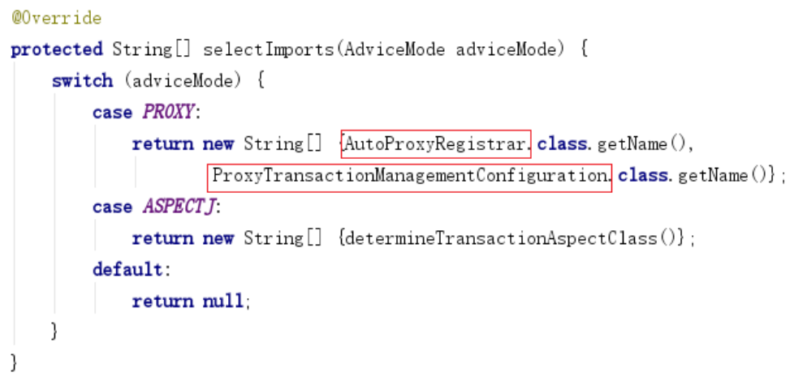

### 2.2 加载事务控制组件

- AutoProxyRegistrar

  AutoProxyRegistrar 类的 registerBeanDefinitions 方法中又注册了一个组件

  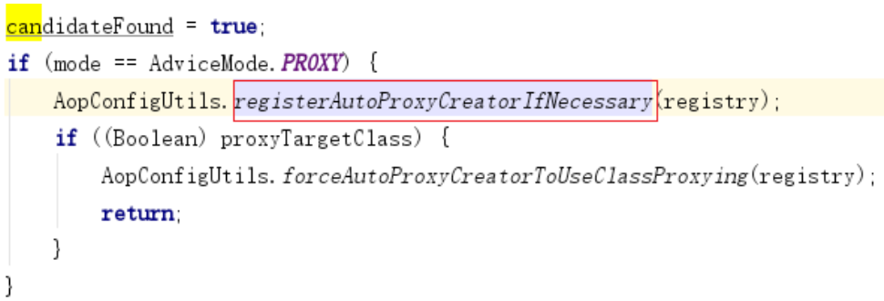

  进入 AopConfigUtils.registerAutoProxyCreatorIfNecessary 方法

  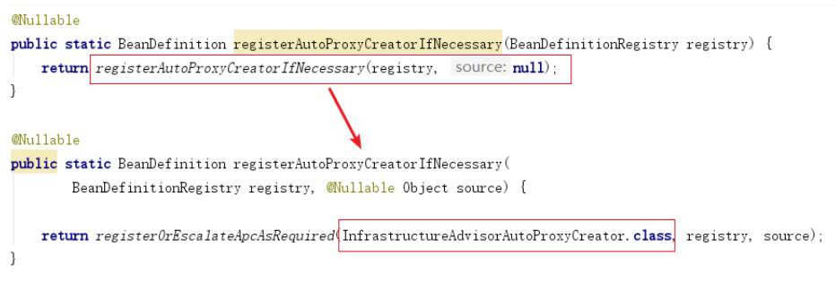

  发现最终，注册了一个叫做 InfrastructureAdvisorAutoProxyCreator 的 Bean，而这个类是AbstractAutoProxyCreator 的子类，实现了 SmartInstantiationAwareBeanPostProcessor 接口

  ```java
  public class InfrastructureAdvisorAutoProxyCreator extends AbstractAdvisorAutoProxyCreator
  public abstract class AbstractAdvisorAutoProxyCreator extends AbstractAutoProxyCreator
  public abstract class AbstractAutoProxyCreator extends ProxyProcessorSupport 
      implements SmartInstantiationAwareBeanPostProcessor, BeanFactoryAware
  ```

  继承体系结构图如下

  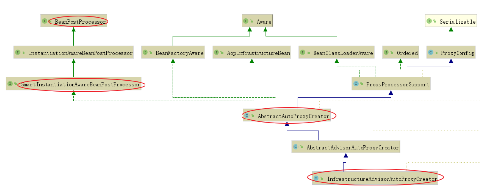

  它实现了SmartInstantiationAwareBeanPostProcessor，说明这是一个后置处理器，而且跟spring AOP 开启@EnableAspectJAutoProxy 时注册的 AnnotationAwareAspectJProxyCreator实现的是同一个接口，所以说，声明式事务是 springAOP 思想的一种应用

- ProxyTransactionManagementConfiguration 组件

  ```java
  /*
  * Copyright 2002-2017 the original author or authors.
  *
  * Licensed under the Apache License, Version 2.0 (the "License");
  * you may not use this file except in compliance with the License.
  * You may obtain a copy of the License at
  *
  * https://www.apache.org/licenses/LICENSE-2.0
  *
  * Unless required by applicable law or agreed to in writing, software
  * distributed under the License is distributed on an "AS IS" BASIS,
  * WITHOUT WARRANTIES OR CONDITIONS OF ANY KIND, either express or
  implied.
  * See the License for the specific language governing permissions and
  * limitations under the License.
  */
  package org.springframework.transaction.annotation;
  import org.springframework.beans.factory.config.BeanDefinition;
  import org.springframework.context.annotation.Bean;
  import org.springframework.context.annotation.Configuration;
  import org.springframework.context.annotation.Role;
  import
      org.springframework.transaction.config.TransactionManagementConfigUtils;
  import
      org.springframework.transaction.interceptor.BeanFactoryTransactionAttribut
      eSourceAdvisor;
  import
      org.springframework.transaction.interceptor.TransactionAttributeSource;
  import org.springframework.transaction.interceptor.TransactionInterceptor;
  /**
  * {@code @Configuration} class that registers the Spring infrastructure
  beans
  * necessary to enable proxy-based annotation-driven transaction
  management.
  *
  * @author Chris Beams
  * @since 3.1
  * @see EnableTransactionManagement
  * @see TransactionManagementConfigurationSelector
  */
  @Configuration
  public class ProxyTransactionManagementConfiguration extends
      AbstractTransactionManagementConfiguration {
      @Bean(name =
            TransactionManagementConfigUtils.TRANSACTION_ADVISOR_BEAN_NAME)
      @Role(BeanDefinition.ROLE_INFRASTRUCTURE)
      public BeanFactoryTransactionAttributeSourceAdvisor transactionAdvisor()
      {
          // 事务增强器
          BeanFactoryTransactionAttributeSourceAdvisor advisor = new
              BeanFactoryTransactionAttributeSourceAdvisor();
          // 向事务增强器中注⼊ 属性解析器 transactionAttributeSource
          advisor.setTransactionAttributeSource(transactionAttributeSource());
          // 向事务增强器中注⼊ 事务拦截器 transactionInterceptor
          advisor.setAdvice(transactionInterceptor());
          if (this.enableTx != null) {
              advisor.setOrder(this.enableTx.<Integer>getNumber("order"));
          }
          return advisor;
      }
      @Bean
      @Role(BeanDefinition.ROLE_INFRASTRUCTURE)
      // 属性解析器 transactionAttributeSource
      public TransactionAttributeSource transactionAttributeSource() {
          return new AnnotationTransactionAttributeSource();
      }
      @Bean
      @Role(BeanDefinition.ROLE_INFRASTRUCTURE)
      // 事务拦截器 transactionInterceptor
      public TransactionInterceptor transactionInterceptor() {
          TransactionInterceptor interceptor = new TransactionInterceptor();
  
          interceptor.setTransactionAttributeSource(transactionAttributeSource());
          if (this.txManager != null) {
              interceptor.setTransactionManager(this.txManager);
          }
          return interceptor;
      } }
  ```

  ProxyTransactionManagementConfiguration是一个容器配置类，注册了一个组件transactionAdvisor，称为事务增强器，然后在这个事务增强器中又注入了两个属性：transactionAttributeSource，即属性解析器transactionAttributeSource 和事务拦截器transactionInterceptor

  - 属性解析器 AnnotationTransactionAttributeSource 部分源码如下

    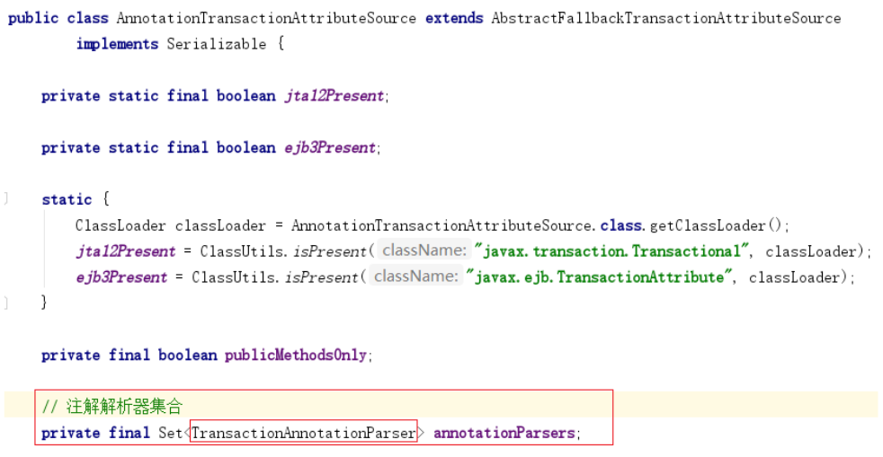

    属性解析器有一个成员变量是annotationParsers，是一个集合，可以添加多种注解解析器(TransactionAnnotationParser)，我们关注 Spring 的注解解析器，部分源码如下

    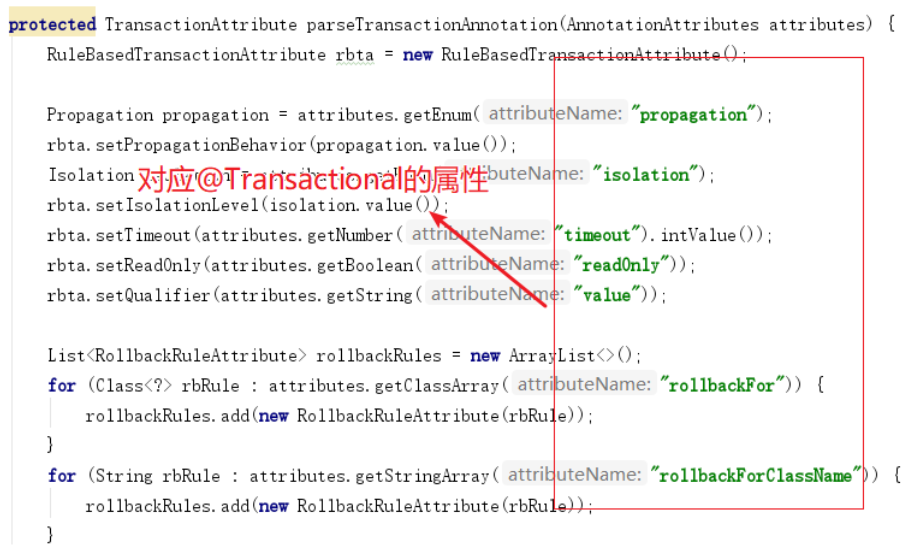

    属性解析器的作用之一就是用来解析@Transaction注解

  - TransactionInterceptor 事务拦截器，部分源码如下

    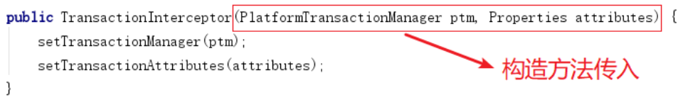

    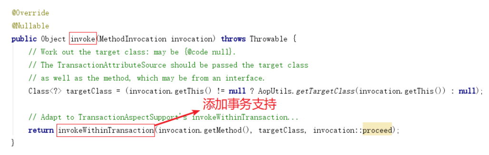

- 上述组件如何关联起来的？

  - 事务拦截器实现了MethodInterceptor接口，追溯一下上面提到的InfrastructureAdvisorAutoProxyCreator后置处理器，它会在代理对象执行目标方法的时候获取其拦截器链，而拦截器链就是这个TransactionInterceptor，这就把这两个组件联系起来；
  - 构造方法传入PlatformTransactionManager(事务管理器)、TransactionAttributeSource(属性解析器)，但是追溯一下上面贴的ProxyTransactionManagementConfiguration的源码，在注册事务拦截器的时候并没有调用这个带参构造方法，而是调用的无参构造方法，然后再调用set方法注入这两个属性，效果一样

- invokeWithinTransaction 方法，部分源码如下（关注1、2、3、4 标注处）

  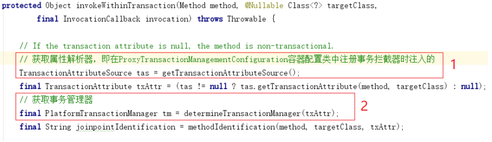

  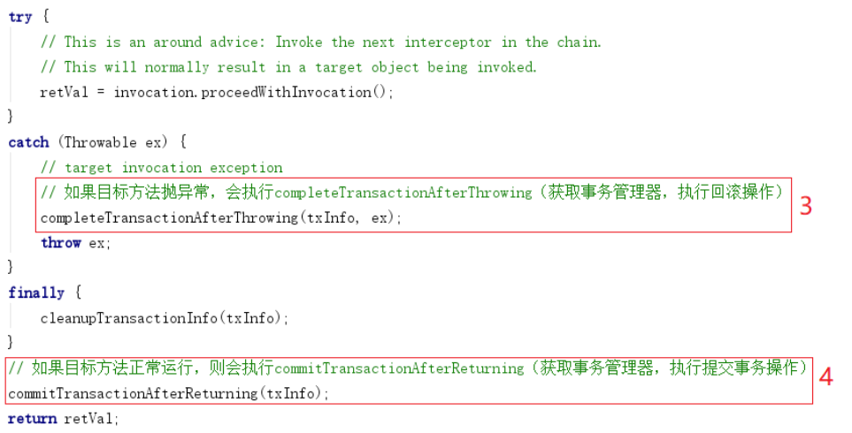

  

**声明式事务分析课堂讲解过程中记录**

@EnableTransactionManagement注解
1）通过@import引入了TransactionManagementConfigurationSelector类。它的selectImports方法导入了另外两个类：AutoProxyRegistrar和ProxyTransactionManagementConfiguration
2）AutoProxyRegistrar类分析
	方法registerBeanDefinitions中，引入了其他类，通过
		`AopConfigUtils.registerAutoProxyCreatorIfNecessary(registry)`引入`InfrastructureAdvisorAutoProxyCreator`，它继承了AbstractAutoProxyCreator，是一个后置处理器类
3）ProxyTransactionManagementConfiguration是一个添加了@Configuration注解的配置类
	（注册bean）
		注册事务增强器（注入属性解析器、事务拦截器）

- 属性解析器：`AnnotationTransactionAttributeSource`，内部持有了一个解析器集合`Set<TransactionAnnotationParser>annotationParsers;`具体使用的是`SpringTransactionAnnotationParser`解析器，用来解析`@Transactional`的事务属性
- 事务拦截器：TransactionInterceptor实现了MethodInterceptor接口，该通用拦截会在产生代理对象之前和aop增强合并，最终一起影响到代理对象TransactionInterceptor的invoke方法`invokeWithinTransaction`会触发原有业务逻辑调用（增强事务）

