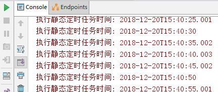
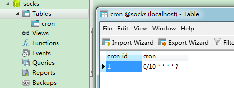
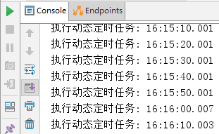
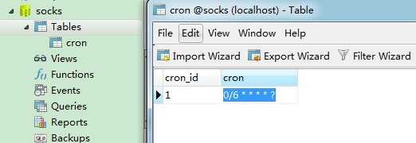
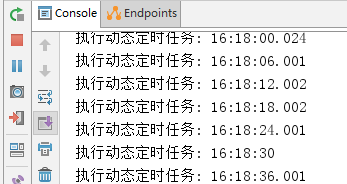
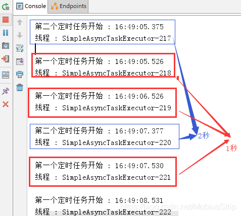

[toc]


## 序言

使用SpringBoot创建定时任务非常简单，目前主要有以下三种创建方式：

- 一、基于注解(@Scheduled)
- 二、基于接口（SchedulingConfigurer） 前者相信大家都很熟悉，但是实际使用中我们往往想从数据库中读取指定时间来动态执行定时任务，这时候基于接口的定时任务就派上用场了。
- 三、基于注解设定多线程定时任务

## 一、静态：基于注解

基于注解@Scheduled默认为单线程，开启多个任务时，任务的执行时机会受上一个任务执行时间的影响。

#### 1、创建定时器

使用SpringBoot基于注解来创建定时任务非常简单，只需几行代码便可完成。 代码如下：

[](javascript:void(0);)

```
@Configuration      //1.主要用于标记配置类，兼备Component的效果。
@EnableScheduling   // 2.开启定时任务
public class SaticScheduleTask {
    //3.添加定时任务
    @Scheduled(cron = "0/5 * * * * ?")
    //或直接指定时间间隔，例如：5秒
    //@Scheduled(fixedRate=5000)
    private void configureTasks() {
        System.err.println("执行静态定时任务时间: " + LocalDateTime.now());
    }
}
```

 

Cron表达式参数分别表示：

- 秒（0~59） 例如0/5表示每5秒
- 分（0~59）
- 时（0~23）
- 日（0~31）的某天，需计算
- 月（0~11）
- 周几（ 可填1-7 或 SUN/MON/TUE/WED/THU/FRI/SAT）

@Scheduled：除了支持灵活的参数表达式cron之外，还支持简单的延时操作，例如 fixedDelay ，fixedRate 填写相应的毫秒数即可。

 

```
// Cron表达式范例：

每隔5秒执行一次：*/5 * * * * ?

每隔1分钟执行一次：0 */1 * * * ?

每天23点执行一次：0 0 23 * * ?

每天凌晨1点执行一次：0 0 1 * * ?

每月1号凌晨1点执行一次：0 0 1 1 * ?

每月最后一天23点执行一次：0 0 23 L * ?

每周星期天凌晨1点实行一次：0 0 1 ? * L

在26分、29分、33分执行一次：0 26,29,33 * * * ?

每天的0点、13点、18点、21点都执行一次：0 0 0,13,18,21 * * ?
```


 

#### 2、启动测试

启动应用，可以看到控制台打印出如下信息：

 

显然，使用@Scheduled 注解很方便，但缺点是当我们调整了执行周期的时候，需要重启应用才能生效，这多少有些不方便。为了达到实时生效的效果，可以使用接口来完成定时任务。

 

## 二、动态：基于接口

基于接口（SchedulingConfigurer）

#### 1、导入依赖包：

```xml
<parent>
  <groupId>org.springframework.boot</groupId>
  <artifactId>spring-boot-starter</artifactId>
  <version>2.0.4.RELEASE</version>
</parent>

<dependencies>
  <dependency><!--添加Web依赖 -->
    <groupId>org.springframework.boot</groupId>
    <artifactId>spring-boot-starter-web</artifactId>
  </dependency>
  <dependency><!--添加MySql依赖 -->
    <groupId>mysql</groupId>
    <artifactId>mysql-connector-java</artifactId>
  </dependency>
  <dependency><!--添加Mybatis依赖 配置mybatis的一些初始化的东西-->
    <groupId>org.mybatis.spring.boot</groupId>
    <artifactId>mybatis-spring-boot-starter</artifactId>
    <version>1.3.1</version>
  </dependency>
  <dependency><!-- 添加mybatis依赖 -->
    <groupId>org.mybatis</groupId>
    <artifactId>mybatis</artifactId>
    <version>3.4.5</version>
    <scope>compile</scope>
  </dependency>
</dependencies>
```

 

#### 2、添加数据库记录：

开启本地数据库mysql，随便打开查询窗口，然后执行脚本内容，如下：

```
DROP DATABASE IF EXISTS `socks`;
CREATE DATABASE `socks`;
USE `SOCKS`;
DROP TABLE IF EXISTS `cron`;
CREATE TABLE `cron`  (
  `cron_id` varchar(30) NOT NULL PRIMARY KEY,
  `cron` varchar(30) NOT NULL  
);
INSERT INTO `cron` VALUES ('1', '0/5 * * * * ?');
```

 

然后在项目中的application.yml 添加数据源：

```
spring:
  datasource:
    url: jdbc:mysql://localhost:3306/socks
    username: root
    password: 123456
```

 

#### 3、创建定时器

数据库准备好数据之后，我们编写定时任务，注意这里添加的是TriggerTask，目的是循环读取我们在数据库设置好的执行周期，以及执行相关定时任务的内容。
具体代码如下：

```
@Configuration      //1.主要用于标记配置类，兼备Component的效果。
@EnableScheduling   // 2.开启定时任务
public class DynamicScheduleTask implements SchedulingConfigurer {

    @Mapper
    public interface CronMapper {
        @Select("select cron from cron limit 1")
        public String getCron();
    }

    @Autowired      //注入mapper
    @SuppressWarnings("all")
    CronMapper cronMapper;

    /**
     * 执行定时任务.
     */
    @Override
    public void configureTasks(ScheduledTaskRegistrar taskRegistrar) {

        taskRegistrar.addTriggerTask(
                //1.添加任务内容(Runnable)
                () -> System.out.println("执行动态定时任务: " + LocalDateTime.now().toLocalTime()),
                //2.设置执行周期(Trigger)
                triggerContext -> {
                    //2.1 从数据库获取执行周期
                    String cron = cronMapper.getCron();
                    //2.2 合法性校验.
                    if (StringUtils.isEmpty(cron)) {
                        // Omitted Code ..
                    }
                    //2.3 返回执行周期(Date)
                    return new CronTrigger(cron).nextExecutionTime(triggerContext);
                }
        );
    }

}
```

 

#### 4、启动测试

启动应用后，查看控制台，打印时间是我们预期的每10秒一次：
 

然后打开Navicat ，将执行周期修改为每6秒执行一次，如图：
 

查看控制台，发现执行周期已经改变，并且不需要我们重启应用，十分方便。如图：
 

注意： 如果在数据库修改时格式出现错误，则定时任务会停止，即使重新修改正确；此时只能重新启动项目才能恢复。

 

## 三、多线程定时任务

基于注解设定多线程定时任务

#### 1、创建多线程定时任务

```java
//@Component注解用于对那些比较中立的类进行注释；
//相对与在持久层、业务层和控制层分别采用 @Repository、@Service 和 @Controller 对分层中的类进行注释
@Component
@EnableScheduling   // 1.开启定时任务
@EnableAsync        // 2.开启多线程
public class MultithreadScheduleTask {

  @Async
  @Scheduled(fixedDelay = 1000)  //间隔1秒
  public void first() throws InterruptedException {
    System.out.println("第一个定时任务开始 : " + LocalDateTime.now().toLocalTime() + "\r\n线程 : " + Thread.currentThread().getName());
    System.out.println();
    Thread.sleep(1000 * 10);
  }

  @Async
  @Scheduled(fixedDelay = 2000)
  public void second() {
    System.out.println("第二个定时任务开始 : " + LocalDateTime.now().toLocalTime() + "\r\n线程 : " + Thread.currentThread().getName());
    System.out.println();
  }
}
```

**注：** 这里的[@Async](https://www.cnblogs.com/mmzs/p/11557583.html)注解很关键

 

#### 2、启动测试

启动应用后，查看控制台：
 

从控制台可以看出，第一个定时任务和第二个定时任务互不影响；

并且，由于开启了多线程，第一个任务的执行时间也不受其本身执行时间的限制，所以需要注意可能会出现重复操作导致数据异常。