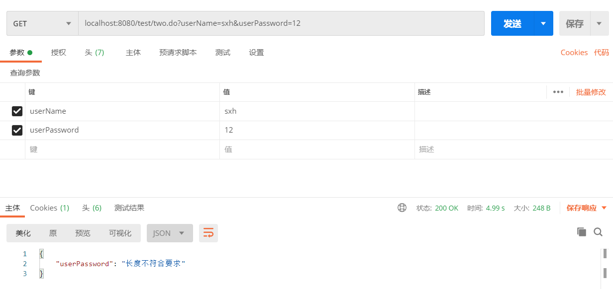
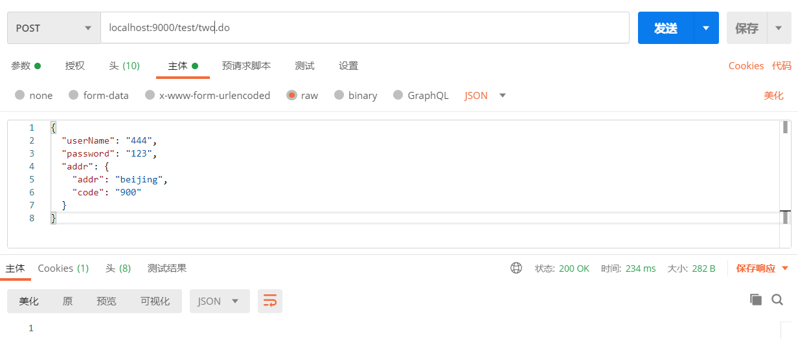
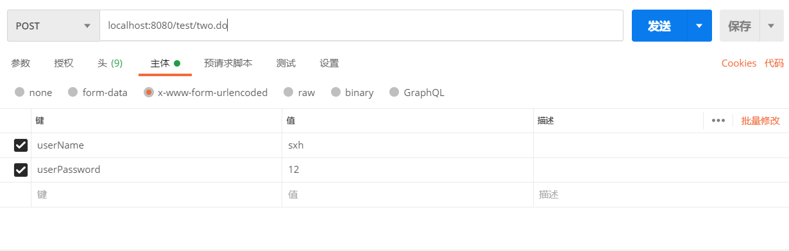
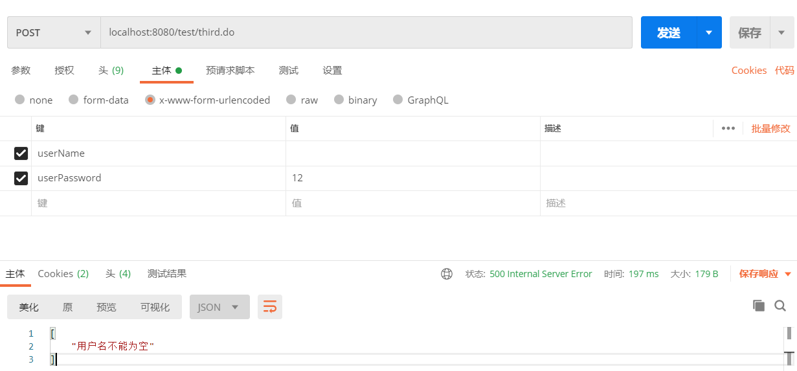

[TOC]

> 参数校验框架

如果表单参数多大20-30个，再用if-else校验就太麻烦了，代码不仅乱，开发效率还低

所以，用spring的validation参数校验框架来校验参数


# 1. 依赖

```xml
<dependency>
    <groupId>javax.validation</groupId>
    <artifactId>validation-api</artifactId>
    <version>2.0.1.Final</version>
</dependency>
<dependency>
    <groupId>org.hibernate.validator</groupId>
    <artifactId>hibernate-validator</artifactId>
    <version>6.1.5.Final</version>
</dependency>
```

# 2. 定义全局参数异常处理

```java
@ControllerAdvice
public class GlobParamExceptionHandler {

    // 捕获方法参数校验异常
    @ExceptionHandler(ConstraintViolationException.class)
    @ResponseBody
    public ResponseEntity constraintViolationExceptionHandler(ConstraintViolationException e){
        Set<ConstraintViolation<?>> message = e.getConstraintViolations();
        HashMap<String, Object> map = new HashMap<>();
        message.stream().forEach(msg -> {
            String path = msg.getPropertyPath().toString();
            String field = path.substring(path.indexOf(".")+1);
            map.put(field,msg.getMessageTemplate());
        });
        return ResponseEntity.ok(map);
    }

    // 捕获实体参数校验异常
    @ExceptionHandler(MethodArgumentNotValidException.class)
    @ResponseBody
    public ResponseEntity resolveMethodArgumentNotValidException(MethodArgumentNotValidException e){
        List<ObjectError> allErrors = e.getBindingResult().getAllErrors();
        HashMap<String, Object> map = new HashMap<>();
        allErrors.stream().forEach(error -> {
            FieldError fieldError = (FieldError) error;
            map.put(fieldError.getField(), fieldError.getDefaultMessage());
        });
        return ResponseEntity.ok(map);
    }
}
```


> 在controller上添加注解：`@Validated`
>
> 在该controller中会进行参数校验，可以使用validation的API

# 3. Get参数校验

> 使用Spring接收参数，在参数前使用注解完成参数校验

```java
@RestController
@RequestMapping("/test")
@Validated
public class SpringTest {


    @GetMapping("/two")
    public void test1(@NotBlank(message = "用户名不能为空") String userName,
                      @NotBlank(message = "密码不能为空") @Length(min = 3, max = 10,message = "长度不符合要求") String userPassword) {
        System.out.println("userName = " + userName);
        System.out.println("userPassword = " + userPassword);
    }
}

```

> 发送的请求




# 4. Post参数校验

## 4.1 有嵌套BO的情况

> 使用Spring接受BO对象，需要使用`@RequestBody`进行标识

<!-- 如果对象有嵌套，需要在Bo中添加@Valid 注解，才能对嵌套的BO进行参数校验 -->

> 请求参数BO

```java
// USER---------------------
public class User{
    @NotBlank(message = "用户名不能为空")
    private String userName;

    @NotBlank(message = "密码不能为空")
    private String password;

    @Valid
    @NotNull(message = "地址不能为空")
    private Addr addr;

    public String getUserName() {return userName;}
    public void setUserName(String userName) {this.userName = userName;}
    public String getPassword() {return password;}
    public void setPassword(String password) {this.password = password;}
    public Addr getAddr() {return addr;}
    public void setAddr(Addr addr) {this.addr = addr;}
    @Override
    public String toString() {
        return "User{" +
                "userName='" + userName + '\'' +
                ", password='" + password + '\'' +
                ", addr=" + addr +
                '}';
    }
}

//Addr---------------------
public class Addr {
    @NotNull(message = "地址不能为空")
    private String addr;
    private String code;
    @Override
    public String toString() {
        return "Addr{" +
                "addr='" + addr + '\'' +
                ", code='" + code + '\'' +
                '}';
    }

    public Addr() {}
    public Addr(String addr, String code) {
        this.addr = addr;
        this.code = code;
    }
    public String getAddr() {return addr;}
    public void setAddr(String addr) {this.addr = addr;}
    public String getCode() {return code;}
    public void setCode(String code) {this.code = code;}
}
```

> Controller接收示例

```java
@RestController
@Validated
@RequestMapping("test")
public class TestController {

    @PostMapping("/two")
    @ResponseBody
    // 因为发送的是JSON，所以需要加@RequeBody
    public void test1(@RequestBody @Valid User user, BindingResult bindingResult) {
        System.out.println(user);
    }
}
```

> 请求参数



> 接收的BO

```java
User{userName='444', password='123', addr=Addr{addr='beijing', code='900'}}
```

## 4.2 没有嵌套BO的情况

> 不加`@RequestBody`

```java
@RestController
@Validated
@RequestMapping("/test")
public class TestController {

    @PostMapping("/two")
    @ResponseBody
    public void test1(@Valid User user, BindingResult bindingResult) {
        System.out.println(user);
    }
}
```

> BO

```java
public class User{
    @NotBlank(message = "用户名不能为空")
    private String userName;

    @NotBlank(message = "密码不能为空")
    private String password;

    public String getUserName() {return userName;}
    public void setUserName(String userName) {this.userName = userName;}
    public String getPassword() {return password;}
    public void setPassword(String password) {this.password = password;}

    @Override
    public String toString() {
        return "User{" +
                "userName='" + userName + '\'' +
                ", password='" + password + '\'' +
                '}';
    }
}
```

> 请求参数




# 5. validation注解

## 5.1 Bean Validation 中内置的 constraint

| 注解                       | 描述                                                     |
| -------------------------- | -------------------------------------------------------- |
| @Null                      | 被注释的元素必须为 null                                  |
| @NotNull                   | 被注释的元素必须不为 null                                |
| @AssertTrue                | 被注释的元素必须为 true                                  |
| @AssertFalse               | 被注释的元素必须为 false                                 |
| @Min(value)                | 被注释的元素必须是一个数字，其值必须大于等于指定的最小值 |
| @Max(value)                | 被注释的元素必须是一个数字，其值必须小于等于指定的最大值 |
| @DecimalMin(value)         | 被注释的元素必须是一个数字，其值必须大于等于指定的最小值 |
| @DecimalMax(value)         | 被注释的元素必须是一个数字，其值必须小于等于指定的最大值 |
| @Size(max=, min=)          | 被注释的元素的大小必须在指定的范围内                     |
| @Digits(integer, fraction) | 被注释的元素必须是一个数字，其值必须在可接受的范围内     |
| @Past                      | 被注释的元素必须是一个过去的日期                         |
| @Future                    | 被注释的元素必须是一个将来的日期                         |
| @Pattern(regex=,flag=)     | 被注释的元素必须符合指定的正则表达式                     |

## 5.2 Hibernate Validator 附加的 constraint

| 注解                       | 描述                                   |
| -------------------------- | -------------------------------------- |
| @NotBlank                  | 验证字符串非null，且长度必须大于0      |
| @Email                     | 被注释的元素必须是电子邮箱地址         |
| @Length(min=,max=)         | 被注释的字符串的大小必须在指定的范围内 |
| @NotEmpty                  | 被注释的字符串的必须非空               |
| @Range(min=,max=,message=) | 被注释的元素必须在合适的范围内         |


# 6. 手动调用validation-API

> 有时候仅仅依靠spring接收参数时的校验还不能满足业务需求，就可以手动调用API进行参数校验

```java
@RestController
@RequestMapping("/test")
@Validated
public class SpringTest {
    
    // Spring封装好了validation的校验对象，直接注入即可
    @Autowired
    Validator validator;

    @PostMapping("/third")
    public ResponseEntity test3(User user ) {
        List<String> list = new ArrayList<>();
        // 调用API校验
        Set<ConstraintViolation<User>> set = validator.validate(user);
        for (ConstraintViolation<User> constraintViolation : set) {
            list.add(constraintViolation.getMessage());
        }

        System.out.println(user);
        if (!list.isEmpty()) {
            return new ResponseEntity(list, HttpStatus.INTERNAL_SERVER_ERROR);
        }
        return ResponseEntity.ok(user);
    }
}
```

> 请求示例



> **手调用也可以自己封装返回的数据格式，这里只是一个示例**


# 7. 自定义校验规则

## 7.1 自定义校验注解

> 示例：**不能为空** 校验

```java
@Target({METHOD, FIELD, ANNOTATION_TYPE, CONSTRUCTOR, PARAMETER})
@Retention(RUNTIME)
@Documented
@Constraint(validatedBy = {CannotHaveBlankValidator.class}) // 这里指定真正进行参数校验的验证类
public @interface CannotHaveBlank {
 
    //默认错误消息
    String message() default "不能包含空格";
 
    //分组
    Class<?>[] groups() default {};
 
    //负载
    Class<? extends Payload>[] payload() default {};
 
    //指定多个时使用
    @Target({FIELD, METHOD, PARAMETER, ANNOTATION_TYPE})
    @Retention(RUNTIME)
    @Documented
    @interface List {
        CannotHaveBlank[] value();
    }
 
}
```

## 7.2 实现校验验证类

```java
public class CannotHaveBlankValidator implements <1>  ConstraintValidator<CannotHaveBlank, String> {
 
    @Override
    public void initialize(CannotHaveBlank constraintAnnotation) {
    }
 
 
    @Override
    public boolean isValid(String value, ConstraintValidatorContext context <2>) {
        //null时不进行校验
        if (value != null && value.contains(" ")) {
            <3>
            //获取默认提示信息
            String defaultConstraintMessageTemplate = context.getDefaultConstraintMessageTemplate();
            System.out.println("default message :" + defaultConstraintMessageTemplate);
            //禁用默认提示信息
            context.disableDefaultConstraintViolation();
            //设置提示语
            context.buildConstraintViolationWithTemplate("can not contains blank").addConstraintViolation();
            return false;
        }
        return true;
    }
}
```

<1> : 所有的验证者都需要实现`ConstraintValidator`接口:`ConstraintValidator<A extends Annotation, T>`

​		第一个参数：注解类；第二个参数：校验的参数类型

​		它的接口也很形象，包含一个初始化事件方法，和一个判断是否合法的方法。

<2> : `ConstraintValidatorContext ` 这个上下文包含了认证中所有的信息，我们可以利用这个上下文实现获取默认错误提示信息，禁用错误提示信息，改写错误提示信息等操作。

<3> : 一些典型校验操作

