[toc]


# SpringBoot

## 1. SpringBoot基础回顾

### 1.1 约定优于配置

```
	Build Anything with Spring Boot：Spring Boot is the starting point for
building all Spring-based applications. Spring Boot is designed to get you up
and running as quickly as possible, with minimal upfront configuration of
Spring.
```

​	上面是引自官网的一段话，大概是说： Spring Boot 是所有基于 Spring 开发的项目的起点。Spring
Boot 的设计是为了让你尽可能快的跑起来 Spring 应用程序并且尽可能减少你的配置文件。


约定优于配置（Convention over Configuration），又称按约定编程，是一种软件设计范式。

本质上是说，系统、类库或框架应该假定合理的默认值，而非要求提供不必要的配置。比如说模型中有
一个名为User的类，那么数据库中对应的表就会默认命名为user。只有在偏离这一个约定的时候，例如
想要将该表命名为person，才需要写有关这个名字的配置。

比如平时架构师搭建项目就是限制软件开发随便写代码，制定出一套规范，让开发人员按统一的要求进
行开发编码测试之类的，这样就加强了开发效率与审查代码效率。所以说写代码的时候就需要按要求命
名，这样统一规范的代码就有良好的可读性与维护性了

约定优于配置简单来理解，就是遵循约定

### 1.2 SpringBoot概念

#### 1.2.1 spring优缺点分析

##### 优点：

spring是Java企业版(Java Enterprise Edition，JEE，也称J2EE)的轻量级代替品。无需开发重量级的
Enterprise JavaBean(EJB)，Spring为企业级Java开发提供了一种相对简单的方法，通过依赖注入和面
向切面编程，用简单 的Java对象(Plain Old Java Object，POJO)实现了EJB的功能

##### 缺点：

虽然Spring的组件代码是轻量级的，但它的配置却是重量级的。一开始，Spring用XML配置，而且是很
多XML配 置。Spring 2.5引入了基于注解的组件扫描，这消除了大量针对应用程序自身组件的显式XML
配置。Spring 3.0引入 了基于Java的配置，这是一种类型安全的可重构配置方式，可以代替XML。

所有这些配置都代表了开发时的损耗。因为在思考Spring特性配置和解决业务问题之间需要进行思维切
换，所以编 写配置挤占了编写应用程序逻辑的时间。和所有框架一样，Spring实用，但与此同时它要求
的回报也不少。

除此之外，项目的依赖管理也是一件耗时耗力的事情。在环境搭建时，需要分析要导入哪些库的坐标，
而且还需要分析导入与之有依赖关系的其他库的坐标，一旦选错了依赖的版本，随之而来的不兼容问题
就会严重阻碍项目的开发进度

#### 1.2.2 SpringBoot解决上述spring问题

SpringBoot对上述Spring的缺点进行的改善和优化，基于约定优于配置的思想，可以让开发人员不必在
配置与逻辑 业务之间进行思维的切换，全身心的投入到逻辑业务的代码编写中，从而大大提高了开发的
效率，一定程度上缩短 了项目周期

**起步依赖**

起步依赖本质上是一个Maven项目对象模型(Project Object Model，POM)，定义了对其他库的传递依
赖，这些东西加在一起即支持某项功能。

简单的说，起步依赖就是将具备某种功能的坐标打包到一起，并提供一些默认的功能。

**自动配置**

springboot的自动配置，指的是springboot，会自动将一些配置类的bean注册进ioc容器，我们可以需
要的地方使用@autowired或者@resource等注解来使用它。

“自动”的表现形式就是我们只需要引我们想用功能的包，相关的配置我们完全不用管，springboot会自
动注入这些配置bean，我们直接使用这些bean即可

springboot: 简单、快速、方便地搭建项目；对主流开发框架的无配置集成；极大提高了开发、部署效
率

### 1.3 SpringBoot 案例实现

案例需求：请求Controller中的方法，并将返回值响应到页面

##### （ 1 ）使用Spring Initializr方式构建Spring Boot项目

​	本质上说，Spring Initializr是一个Web应用，它提供了一个基本的项目结构，能够帮助我们快速
构建一个基础的Spring Boot项目

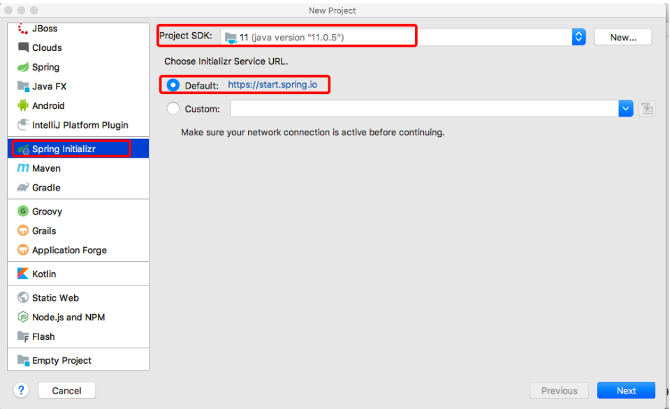

Project SDK”用于设置创建项目使用的JDK版本，这里，使用之前初始化设置好的JDK版本即可；在
“Choose Initializr Service URL（选择初始化服务地址）”下使用默认的初始化服务地址“https://start.sp
ring.io”进行Spring Boot项目创建（注意使用快速方式创建Spring Boot项目时，所在主机须在联网状态
下）

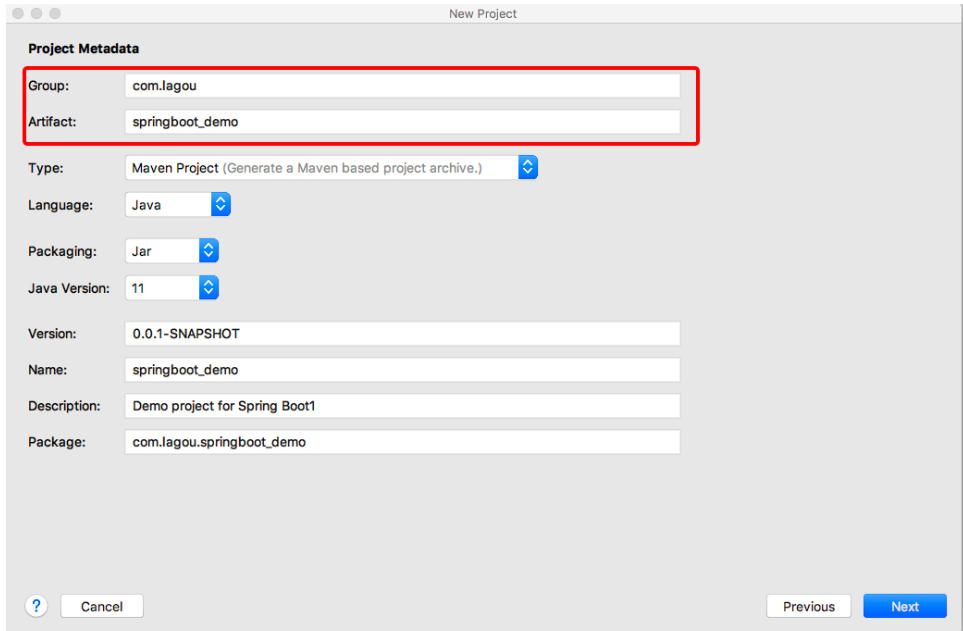

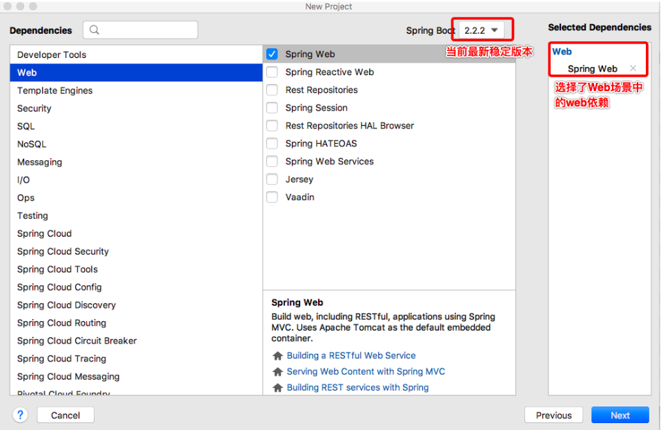

Spring Boot项目就创建好了。创建好的Spring Boot项目结构如图：

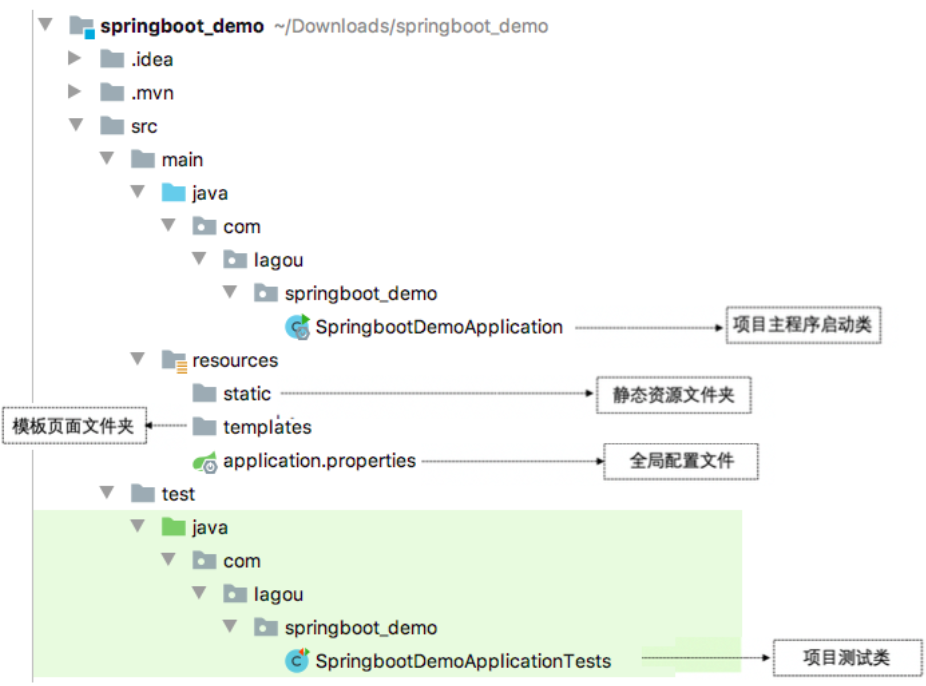

​	使用Spring Initializr方式构建的Spring Boot项目会默认生成项目启动类、存放前端静态资源和页
面的文件夹、编写项目配置的配置文件以及进行项目单元测试的测试类

##### （ 2 ） 创建一个用于Web访问的Controller

com.lagou包下创建名称为controller的包，在该包下创建一个请求处理控制类HelloController，
并编写一个请求处理方法 **(注意：将项目启动类SpringBootDemoApplication移动到com.lagou包下)**

```java
@RestController // 该注解为组合注解，等同于Spring中@Controller+@ResponseBody注解
public class DemoController {
    @RequestMapping("/demo")
    public String demo(){
        return "你好 spring Boot";
    }
}
```


##### （ 3 ） 运行项目

运行主程序启动类SpringbootDemoApplication，项目启动成功后，在控制台上会发现Spring
Boot项目默认启动的端口号为 8080 ，此时，可以在浏览器上访问“http://localhost:8080/hello”


页面输出的内容是“hello Spring Boot”，至此，构建Spring Boot项目就完成了

附：解决中文乱码：

解决方法一：

```java
@RequestMapping(produces="application/json; charset=utf-8")
```

解决方法二：

```properties
#设置响应为utf-8
spring.http.encoding.force-response=true
```


### 1.4 单元测试与热部署

##### 1.4.1 单元测试

​	开发中，每当完成一个功能接口或业务方法的编写后，通常都会借助单元测试验证该功能是否正确。Spring Boot对项目的单元测试提供了很好的支持，在使用时，需要提前在项目的pom.xml文件中添加spring-boot-starter-test测试依赖启动器，可以通过相关注解实现单元测试

演示：

1 ．添加spring-boot-starter-test测试依赖启动器

在项目的pom.xml文件中添加spring-boot-starter-test测试依赖启动器，示例代码如下 ：

```xml
<dependency>
    <groupId>org.springframework.boot</groupId>
    <artifactId>spring-boot-starter-test</artifactId>
    <scope>test</scope>
</dependency>
```

注意：使用Spring Initializr方式搭建的Spring Boot项目，会自动加入spring-boot-starter-test测试依赖
启动器，无需再手动添加

2 ．编写单元测试类和测试方法

使用Spring Initializr方式搭建的Spring Boot项目，会在src.test.java测试目录下自动创建与项目主程序
启动类对应的单元测试类

```java
@RunWith(SpringRunner.class) // 测试启动器，并加载Spring Boot测试注解
@SpringBootTest // 标记为Spring Boot单元测试类，并加载项目的ApplicationContext上下文环境
public class SpringbootDemoApplicationTests {
    @Autowired
    private DemoController demoController;
    // 自动创建的单元测试方法实例
    @Test
    void contextLoads() {
        String demo = demoController.demo();
        System.out.println(demo);
    }
}
```
​	上述代码中，先使用@Autowired注解注入了DemoController实例对象，然后在contextLoads()
方法中调用了DemoController类中对应的请求控制方法contextLoads()，并输出打印结果


##### 1.4.2 热部署

​	在开发过程中，通常会对一段业务代码不断地修改测试，在修改之后往往需要重启服务，有些服务需要加载很久才能启动成功，这种不必要的重复操作极大的降低了程序开发效率。为此，SpringBoot框架专门提供了进行热部署的依赖启动器，用于进行项目热部署，而无需手动重启项目

演示：

**1 ．添加spring-boot-devtools热部署依赖启动器**

在Spring Boot项目进行热部署测试之前，需要先在项目的pom.xml文件中添加spring-boot-devtools热
部署依赖启动器:

```xml
<!-- 引入热部署依赖 -->
<dependency>
    <groupId>org.springframework.boot</groupId>
    <artifactId>spring-boot-devtools</artifactId>
</dependency>
```

​	由于使用的是IDEA开发工具，添加热部署依赖后可能没有任何效果，接下来还需要针对IDEA开发工具进行热部署相关的功能设置

**2. IDEA工具热部署设置**

选择IDEA工具界面的【File】->【Settings】选项，打开Compiler面板设置页面

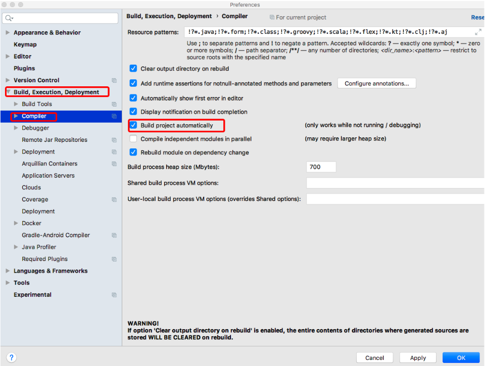

​	选择Build下的Compiler选项，在右侧勾选“Build project automatically”选项将项目设置为自动编
译，单击【Apply】→【OK】按钮保存设置

​	在项目任意页面中使用组合快捷键“Ctrl+Shift+Alt+/”打开Maintenance选项框，选中并打开
Registry页面，具体如图所示

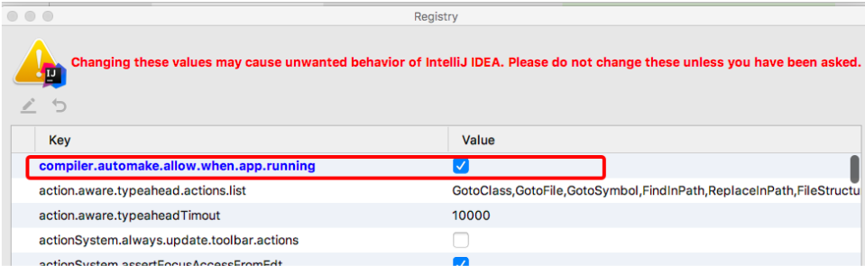

​	列表中找到“compiler.automake.allow.when.app.running”，将该选项后的Value值勾选，用于指
定IDEA工具在程序运行过程中自动编译，最后单击【Close】按钮完成设置

**3 ．热部署效果测试**

启动chapter01http://localhost:8080/hello


页面原始输出的内容是“hello Spring Boot”。

为了测试配置的热部署是否有效，接下来，在不关闭当前项目的情况下，将DemoController 类中的请
求处理方法hello()的返回值修改为“你好，Spring Boot”并保存，查看控制台信息会发现项目能够自动构
建和编译，说明项目热部署生效

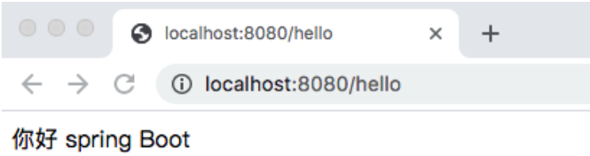

可以看出，浏览器输出了“你好，Spring Boot”，说明项目热部署配置成功

### 1.5 全局配置文件

全局配置文件能够对一些默认配置值进行修改。Spring Boot使用一个application.properties或者
application.yaml的文件作为全局配置文件，该文件存放在src/main/resource目录或者类路径
的/config，一般会选择resource目录。接下来，将针对这两种全局配置文件进行讲解 ：

#### 1.5.1 application.properties配置文件

使用Spring Initializr方式构建Spring Boot项目时，会在resource目录下自动生成一个空application.properties文件，Spring Boot项目启动时会自动加载application.properties文件。

我们可以在application.properties文件中定义Spring Boot项目的相关属性，当然，这些相关属性可以
是系统属性、环境变量、命令参数等信息，也可以是自定义配置文件名称和位置

```properties
server.port= 8081
spring.datasource.driver-class-name=com.mysql.jdbc.Driver
spring.config.additional-location=
spring.config.location=
spring.config.name=application
```

接下来，通过一个案例对Spring Boot项目中application.properties配置文件的具体使用进行讲解

演示：

预先准备了两个实体类文件，后续会演示将application.properties配置文件中的自定义配置属性注入
到Person实体类的对应属性中

（ 1 ）先在项目的com.lagou包下创建一个pojo包，并在该包下创建两个实体类Pet和Person

```java
public class Pet {
    private String type;
    private String name;
    // 省略属性getXX()和setXX()方法
    // 省略toString()方法
}

```


```java
@Component //用于将Person类作为Bean注入到Spring容器中
@ConfigurationProperties(prefix = "person") //将配置文件中以person开头的属性注入到该类中
public class Person {
    private int id;  //id
    private String name;  //名称
    private List hobby; //爱好
    private String[] family; //家庭成员
    private Map map;
    private Pet pet;  //宠物
    // 省略属性getXX()和setXX()方法
    // 省略toString()方法
}
```

@ConfigurationProperties(prefix = "person")注解的作用是将配置文件中以person开头的属性值通过
setXX()方法注入到实体类对应属性中

@Component注解的作用是将当前注入属性值的Person类对象作为Bean组件放到Spring容器中，只有
这样才能被@ConfigurationProperties注解进行赋值

（ 2 ）打开项目的resources目录下的application.properties配置文件，在该配置文件中编写需要对
Person类设置的配置属性

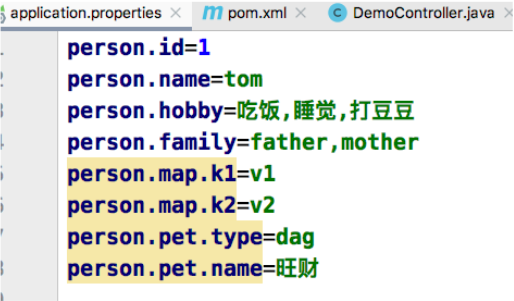

​		编写application.properties配置文件时，由于要配置的Person对象属性是我们自定义的，Spring
Boot无法自动识别，所以不会有任何书写提示。在实际开发中，为了出现代码提示的效果来方便配置，
在使用@ConfigurationProperties注解进行配置文件属性值注入时，可以在pom.xml文件中添加一个
Spring Boot提供的配置处理器依赖:

```xml
<dependency>
    <groupId>org.springframework.boot</groupId>
    <artifactId>spring-boot-configuration-processor</artifactId>
    <optional>true</optional>
</dependency>
```

​		在pom.xml中添加上述配置依赖后，还需要重新运行项目启动类或者使用“Ctrl+F9”快捷键（即
Build Project）重构当前Spring Boot项目方可生效

（ 3 ）查看application.properties配置文件是否正确，同时查看属性配置效果，打开通过IDEA工具创建
的项目测试类，在该测试类中引入Person实体类Bean，并进行输出测试

```java
@RunWith(SpringRunner.class) // 测试启动器，并加载Spring Boot测试注解
@SpringBootTest // 标记为Spring Boot单元测试类，并加载项目的ApplicationContext上下文环境
public class SpringbootDemoApplicationTests {
    // 配置测试
    @Autowired
    private Person person;
    @Test
    void configurationTest() {
        System.out.println(person);
    }
}
```


**打印结果：**

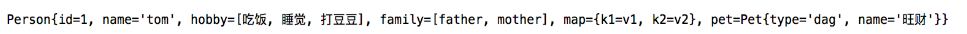

可以看出，测试方法configurationTest()运行成功，同时正确打印出了Person实体类对象。至此，说明
application.properties配置文件属性配置正确，并通过相关注解自动完成了属性注入

#### 1.5.2 application.yaml配置文件

YAML文件格式是Spring Boot支持的一种JSON超集文件格式，相较于传统的Properties配置文件，YAML文件以数据为核心，是一种更为直观且容易被电脑识别的数据序列化格式。application.yaml配置文件的工作原理和application.properties是一样的，只不过yaml格式配置文件看起来更简洁一些。

- YAML文件的扩展名可以使用.yml或者.yaml。
- application.yml文件使用 “key:（空格）value”格式配置属性，使用缩进控制层级关系。

这里，针对不同数据类型的属性值，介绍一下YAML

（ 1 ）value值为普通数据类型（例如数字、字符串、布尔等）

​		当YAML配置文件中配置的属性值为普通数据类型时，可以直接配置对应的属性值，同时对于字符
串类型的属性值，不需要额外添加引号，示例代码如下

```yaml
server:  
 port: 8081  
 path: /hello
```

​		上述代码用于配置server的port和path属性，port和path属于一个级别

（ 2 ）value值为数组和单列集合

当YAML配置文件中配置的属性值为数组或单列集合类型时，主要有两种书写方式：缩进式写法和行内
式写法。

其中，缩进式写法还有两种表示形式，示例代码如下

```yaml
person:
 hobby:
  - play
  - read
  - sleep
```

​	或者使用如下示例形式

```yaml
person:
 hobby:
  play,
  read,
  sleep
```

上述代码中，在YAML配置文件中通过两种缩进式写法对person对象的单列集合（或数组）类型的爱好hobby赋值为play、read和sleep。其中一种形式为“-（空格）属性值”，另一种形式为多个属性值之前加英文逗号分隔（注意，最后一个属性值后不要加逗号）。

​		通过上述示例对比发现，YAML配置文件的行内式写法更加简明、方便。另外，包含属性值的中括号“[]”还可以进一步省略，在进行属性赋值时，程序会自动匹配和校对

（ 3 ）value值为Map集合和对象

当YAML配置文件中配置的属性值为Map集合或对象类型时，YAML配置文件格式同样可以分为两种书写
方式：缩进式写法和行内式写法。

其中，缩进式写法的示例代码如下

```yaml
person:
 map:
  k1: v
  k2: v
```

​	对应的行内式写法示例代码如下

```yaml
person:
 map: {k1: v1,k2: v2}
```

在YAML配置文件中，配置的属性值为Map集合或对象类型时，缩进式写法的形式按照YAML文件格式编写即可，而行内式写法的属性值要用大括号“{}”包含。

接下来，在Properties配置文件演示案例基础上，通过配置application.yaml配置文件对Person对象进行赋值，具体使用如下

（ 1 ）在项目的resources目录下，新建一个application.yaml配置文件，在该配置文件中编写为Person
类设置的配置属性

```yaml
#对实体类对象Person进行属性配置
person:
 id: 1
 name: lucy
 hobby: [吃饭，睡觉，打豆豆]
 family: [father,mother]
 map: {k1: v1,k2: v2}
 pet: {type: dog,name: 旺财}
```

（ 2 ）再次执行测试

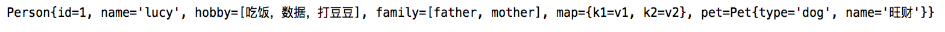

可以看出，测试方法configurationTest()同样运行成功，并正确打印出了Person实体类对象。

需要 **说明** 的是，本次使用application.yaml配置文件进行测试时需要提前将application.properties配置文件中编写的配置注释，这是因为application.properties配置文件会覆盖application.yaml配置文件

### 1.6 配置文件属性值的注入

使用Spring Boot全局配置文件设置属性时：

如果配置属性是Spring Boot已有属性，例如服务端口server.port，那么Spring Boot内部会自动扫描并读取这些配置文件中的属性值并覆盖默认属性。

如果配置的属性是用户自定义属性，例如刚刚自定义的Person实体类属性，还必须在程序中注入这些配置属性方可生效。

Spring Boot支持多种注入配置文件属性的方式，下面来介绍如何使用注解@ConfigurationProperties和@Value注入属性

#### 1.6.1 使用@ConfigurationProperties注入属性

Spring Boot提供的@ConfigurationProperties注解用来快速、方便地将配置文件中的自定义属性值批
量注入到某个Bean对象的多个对应属性中。假设现在有一个配置文件，如果使用
@ConfigurationProperties注入配置文件的属性，示例代码如下：

```java
@Component
@ConfigurationProperties(prefix = "person")
public class Person {
    private int id;
    // 属性的setXX()方法
    public void setId(int id) {
        this.id = id;
    }
}
```

上述代码使用@Component和@ConfigurationProperties(prefix = “person”)将配置文件中的每个属性映射到person类组件中。

需要注意的是，使用@ConfigurationProperties

#### 1.6.2 使用@Value注入属性

@Value注解是Spring框架提供的，用来读取配置文件中的属性值并逐个注入到Bean对象的对应属性中，Spring Boot框架从Spring框架中对@Value注解进行了默认继承，所以在Spring Boot框架中还可以使用该注解读取和注入配置文件属性值。使用@Value注入属性的示例代码如下

```java
@Component
public class Person {
    @Value("${person.id}")
    private int id;
}
```

​		上述代码中，使用@Component和@Value注入Person实体类的id属性。其中，@Value不仅可以将配置文件的属性注入Person的id属性，还可以直接给id属性赋值，这点是@ConfigurationProperties不支持的

**演示@Value注解读取并注入配置文件属性的使用:**

（ 1 ）在com.lagou.pojo包下新创建一个实体类Student，并使用@Value注解注入属性

```java
@Component
public class Student {
    @Value("${person.id}")
    private int id;
    @Value("${person.name}")
    private String name; //名称
    //省略toString
}
```

Student类使用@Value注解将配置文件的属性值读取和注入。

从上述示例代码可以看出，使用@Value注解方式需要对每一个属性注入设置，同时又免去了属性的setXX()方法

（ 2 ）再次打开测试类进行测试

```java
    @Autowired
    private Student student;
    @Test
    public void studentTest() {
    System.out.println(student);
    }
```


**打印结果：**

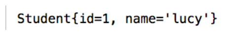

​		可以看出，测试方法studentTest()运行成功，同时正确打印出了Student实体类对象。需要说明的是，本示例中只是使用@Value注解对实例中Student对象的普通类型属性进行了赋值演示，而@Value注解对于包含Map集合、对象以及YAML文件格式的行内式写法的配置文件的属性注入都不支持，如果赋值会出现错误

### 1.7 自定义配置

​		spring Boot免除了项目中大部分的手动配置，对于一些特定情况，我们可以通过修改全局配置文
件以适应具体生产环境，可以说，几乎所有的配置都可以写在application.peroperties文件中，Spring
Boot会自动加载全局配置文件从而免除我们手动加载的烦恼。但是，如果我们自定义配置文件，Spring
Boot是无法识别这些配置文件的，此时就需要我们手动加载。接下来，将针对Spring Boot的自定义配
置文件及其加载方式进行讲解

#### 1.7.1 使用@PropertySource加载配置文件

​		对于这种加载自定义配置文件的需求，可以使用@PropertySource注解结合@Configuration注解配置类的方式来实现。@PropertySource注解用于指定自定义配置文件的具体位置和名称。同时，为了保证Spring Boot能够扫描该注解，还需要类上添加@Configuration注解将实体类作为自定义配置类。

当然，如果需要将自定义配置文件中的属性值注入到对应类的属性中，可以使用@ConfigurationProperties或者@Value注解进行属性值注入

演示：

（ 1 ）打开Spring Boot项目的resources目录，在项目的类路径下新建一个test.properties自定义配
置文件，在该配置文件中编写需要设置的配置属性

```properties
#对实体类对象MyProperties进行属性配置
test.id= 110
test.name=test
```

（ 2 ）在com.lagou.pojo包下新创建一个配置类MyProperties，提供test.properties自定义配置文件
中对应的属性，并根据@PropertySource注解的使用进行相关配置

```java
@Configuration // 自定义配置类
@PropertySource("classpath:test.properties") // 指定自定义配置文件位置和名称
@EnableConfigurationProperties(MyProperties.class) // 开启对应配置类的属性注入功能
@ConfigurationProperties(prefix = "test")  // 指定配置文件注入属性前缀
public class MyProperties {
    private int id;
    private String name;
    // 省略属性getXX()和setXX()方法
    // 省略toString()方法
}
```

​		主要是一个自定义配置类，通过相关注解引入了自定义的配置文件，并完成了自定义属性值的注入。针对示例中的几个注解，具体说明如下

- @Configuration注解表示当前类是一个自定义配置类，并添加为Spring容器的组件，这里也可以
  使用传统的@Component注解；
- @PropertySource("classpath:test.properties")注解指定了自定义配置文件的位置和名称，此示例
  表示自定义配置文件为classpath类路径下的test.properties文件；
- @ConfigurationProperties(prefix = "test")注解将上述自定义配置文件test.properties中以test开
  头的属性值注入到该配置类属性中。
  如果配置类上使用的是@Component注解而非@Configuration注解，那么
- @EnableConfigurationProperties注解还可以省略

（ 3 ）进行测试

```java
@Autowired
private MyProperties myProperties;
@Test
public void myPropertiesTest() {
    System.out.println(myProperties);
}
```

打印结果：

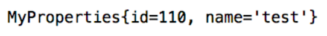

#### 1.7.2 使用@Configuration编写自定义配置类

在Spring Boot框架中，推荐使用配置类的方式向容器中添加和配置组件

在Spring Boot框架中，通常使用@Configuration注解定义一个配置类，Spring Boot会自动扫描和识别配置类，从而替换传统Spring框架中的XML配置文件。

当定义一个配置类后，还需要在类中的方法上使用@Bean注解进行组件配置，将方法的返回对象注入到Spring容器中，并且组件名称默认使用的是方法名，当然也可以使用@Bean注解的name或value属性自定义组件的名称

**演示：**

（ 1 ）在项目下新建一个com.lagou.config包，并在该包下新创建一个类MyService，该类中不需要编写
任何代码

```java
public class MyService {
}
```

创建了一个空的MyService类，而该类目前没有添加任何配置和注解，因此还无法正常被Spring Boot扫
描和识别

（ 2 ） 在项目的com.lagou.config包下，新建一个类MyConfig，并使用@Configuration注解将该类声
明一个配置类，内容如下：

```java
@Configuration // 定义该类是一个配置类
public class MyConfig {
    @Bean // 将返回值对象作为组件添加到Spring容器中，该组件id默认为方法名
    public MyService myService(){
        return new MyService();
    }
}
```

​		MyConfig是@Configuration注解声明的配置类（类似于声明了一个XML配置文件），该配置类会被Spring Boot自动扫描识别；使用@Bean注解的myService()方法，其返回值对象会作为组件添加到了Spring容器中（类似于XML配置文件中的标签配置），并且该组件的id默认是方法名myService

（ 3 ）测试类

```java
@Autowired
private ApplicationContext applicationContext;
@Test
public void iocTest() {
    System.out.println(applicationContext.containsBean("myService"));
}
```

上述代码中，先通过@Autowired注解引入了Spring容器实例ApplicationContext，然后在测试方法iocTest()中测试查看该容器中是否包括id为myService的组件。

执行测试方法iocTest() ，查看控制台输出效果，结果如下：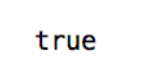

从测试结果可以看出，测试方法iocTest()运行成功，显示运行结果为true，表示Spirng的IOC容器中也已经包含了id为myService的实例对象组件，说明使用自定义配置类的形式完成了向Spring容器进行组件的添加和配置

### 1.8 随机数设置及参数间引用

在Spring Boot配置文件中设置属性时，除了可以像前面示例中显示的配置属性值外，还可以使用随机值和参数间引用对属性值进行设置。下面，针对配置文件中这两种属性值的设置方式进行讲解


#### 1.8.1随机值设置

​		在Spring Boot配置文件中，随机值设置使用到了Spring Boot内嵌的RandomValuePropertySource类，对一些隐秘属性值或者测试用例属性值进行随机值注入

​		随机值设置的语法格式为${random.xx}，xx表示需要指定生成的随机数类型和范围，它可以生成随机的整数、uuid或字符串，示例代码如下

```properties
my.secret=${random.value} // 配置随机值
my.number=${random.int} // 配置随机整数
my.bignumber=${random.long} // 配置随机long类型数
my.uuid=${random.uuid} // 配置随机uuid类型数
my.number.less.than.ten=${random.int(10)} // 配置小于 10 的随机整数
my.number.in.range=${random.int[1024,65536]} // 配置范围在[1024,65536]之间的随机整数
```

​		上述代码中，使用RandomValuePropertySource类中random提供的随机数类型，分别展示了不同类型随机值的设置示例

#### 1.8.2参数间引用

​		在Spring Boot配置文件中，配置文件的属性值还可以进行参数间的引用，也就是在后一个配置的属性值中直接引用先前已经定义过的属性，这样可以直接解析其中的属性值了。

使用参数间引用的好处就是，在多个具有相互关联的配置属性中，只需要对其中一处属性预先配置，其他地方都可以引用，省去了后续多处修改的麻烦

​		参数间引用的语法格式为${xx}，xx表示先前在配置文件中已经配置过的属性名，示例代码如下

```properties
app.name=MyApp
app.description=${app.name} is a Spring Boot application
```

​		上述参数间引用设置示例中，先设置了“app.name=MyApp”，将app.name属性的属性值设置为了MyApp；接着，在app.description属性配置中，使用${app.name}对前一个属性值进行了引用

​		接下来，通过一个案例来演示使用随机值设置以及参数间引用的方式进行属性设置的具体使用和效果，具体步骤如下

（ 1 ）打开Spring Boot项目resources目录下的application.properties配置文件，在该配置文件中分别通过随机值设置和参数间引用来配置两个测试属性，示例代码如下

```properties
#随机值设置以及参数间引用配置
tom.age=${random.int[10,20]}
tom.description=tom的年龄可能是${tom.age}
```

​		在上述application.properties配置文件中，先使用随机值设置了tom.age属性的属性值，该属性
值设置在了[10,20]之间，随后使用参数间引用配置了tom.description属性

（ 2 ）打开\项目的测试类，在该测试类中新增字符串类型的description属性，并将配置文件中tom.description属性进行注入，然后新增一个测试方法进行输出测试，示例代码如下

```java
@Value("${tom.description}")
private String description;
@Test
public void placeholderTest() {
    System.out.println(description);
}
```

上述代码中，通过@Value("${tom.description}")注解将配置文件中的tom.description属性值注入到了对应的description属性中，在测试方法placeholderTest()中对该属性值进行了输出打印。

执行测试方法placeholderTest() ，查看控制台输出效果

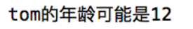

​		可以看出，测试方法placeholderTest()运行成功，并打印出了属性description的注入内容，该内容与配置文件中配置的属性值保持一致。接着，重复执行测试方法placeholderTest()，查看控制台输出语句中显示的年龄就会在[10,20]之间随机显示


## 2. SpringBoot原理深入及源码剖析

​		传统的Spring框架实现一个Web服务，需要导入各种依赖JAR包，然后编写对应的XML配置文件等，相较而言，Spring Boot显得更加方便、快捷和高效。那么，Spring Boot究竟如何做到这些的呢？

接下来分别针对Spring Boot框架的依赖管理、自动配置和执行流程进行深入分析

### 2.1 依赖管理

问题：（ 1 ）为什么导入dependency时不需要指定版本？

​		在Spring Boot入门程序中，项目pom.xml文件有两个核心依赖，分别是spring-boot-starter-parent和spring-boot-starter-web，关于这两个依赖的相关介绍具体如下：

**1 ．spring-boot-starter-parent依赖**

在chapter01项目中的pom.xml文件中找到spring-boot-starter-parent依赖，示例代码如下:

```xml
<!-- Spring Boot父项目依赖管理 -->
<parent>
    <groupId>org.springframework.boot</groupId>
    <artifactId>spring-boot-starter-parent</artifactId>
    <version>2.2.2.RELEASE</version>
    <relativePath/> <!-- lookup parent from repository -->
</parent>
```

​		上述代码中，将spring-boot-starter-parent依赖作为Spring Boot项目的统一父项目依赖管理，并将项目版本号统一为2.2.2.RELEASE，该版本号根据实际开发需求是可以修改的

使用“Ctrl+鼠标左键”进入并查看spring-boot-starter-parent底层源文件，发现spring-boot-starter-parent的底层有一个父依赖spring-boot-dependencies，核心代码具体如下

```xml
<parent>
    <groupId>org.springframework.boot</groupId>
    <artifactId>spring-boot-dependencies</artifactId>
    <version>2.2.2.RELEASE</version>
    <relativePath>../../spring-boot-dependencies</relativePath>
</parent>
```

继续查看spring-boot-dependencies底层源文件，核心代码具体如下：

```xml
<properties>
    <activemq.version>5.15.11</activemq.version>
    ...
    <solr.version>8.2.0</solr.version>
    <mysql.version>8.0.18</mysql.version>
    <kafka.version>2.3.1</kafka.version>
    <spring-amqp.version>2.2.2.RELEASE</spring-amqp.version>
    <spring-restdocs.version>2.0.4.RELEASE</spring-restdocs.version>
    <spring-retry.version>1.2.4.RELEASE</spring-retry.version>
    <spring-security.version>5.2.1.RELEASE</spring-security.version>
    <spring-session-bom.version>Corn-RELEASE</spring-session-bom.version>
    <spring-ws.version>3.0.8.RELEASE</spring-ws.version>
    <sqlite-jdbc.version>3.28.0</sqlite-jdbc.version>
    <sun-mail.version>${jakarta-mail.version}</sun-mail.version>
    <tomcat.version>9.0.29</tomcat.version>
    <thymeleaf.version>3.0.11.RELEASE</thymeleaf.version>
    <thymeleaf-extras-data-attribute.version>2.0.1</thymeleaf-extras-data-attribute.version>
    ...
</properties>
```

 		从spring-boot-dependencies底层源文件可以看出，该文件通过标签对一些常用技术框架的依赖文件进行了统一版本号管理，例如activemq、spring、tomcat等，都有与Spring Boot 2.2.2版本相匹配的版本，这也是pom.xml引入依赖文件不需要标注依赖文件版本号的原因。

需要说明的是，如果pom.xml引入的依赖文件不是 spring-boot-starter-parent管理的，那么在pom.xml引入依赖文件时，需要使用标签指定依赖文件的版本号。

（ 2 ）问题 2 ： spring-boot-starter-parent父依赖启动器的主要作用是进行版本统一管理，那么项目运行依赖的JAR包是从何而来的？

**2. spring-boot-starter-web依赖**

查看spring-boot-starter-web依赖文件源码，核心代码具体如下

```xml
<dependencies>
    <dependency>
        <groupId>org.springframework.boot</groupId>
        <artifactId>spring-boot-starter</artifactId>
        <version>2.2.2.RELEASE</version>
        <scope>compile</scope>
    </dependency>
    <dependency>
        <groupId>org.springframework.boot</groupId>
        <artifactId>spring-boot-starter-json</artifactId>
        <version>2.2.2.RELEASE</version>
        <scope>compile</scope>
    </dependency>
    <dependency>
        <groupId>org.springframework.boot</groupId>
        <artifactId>spring-boot-starter-tomcat</artifactId>
        <version>2.2.2.RELEASE</version>
        <scope>compile</scope>
    </dependency>
    <dependency>
        <groupId>org.springframework.boot</groupId>
        <artifactId>spring-boot-starter-validation</artifactId>
        <version>2.2.2.RELEASE</version>
        <scope>compile</scope>
        <exclusions>
            <exclusion>
                <artifactId>tomcat-embed-el</artifactId>
                <groupId>org.apache.tomcat.embed</groupId>
            </exclusion>
        </exclusions>
    </dependency>
    <dependency>
        <groupId>org.springframework</groupId>
        <artifactId>spring-web</artifactId>
        <version>5.2.2.RELEASE</version>
        <scope>compile</scope>
    </dependency>
    <dependency>
        <groupId>org.springframework</groupId>
        <artifactId>spring-webmvc</artifactId>
        <version>5.2.2.RELEASE</version>
        <scope>compile</scope>
    </dependency>
</dependencies>
```

从上述代码可以发现，spring-boot-starter-web依赖启动器的主要作用是提供Web开发场景所需的底层所有依赖

正是如此，在pom.xml中引入spring-boot-starter-web依赖启动器时，就可以实现Web场景开发，而不需要额外导入Tomcat服务器以及其他Web依赖文件等。当然，这些引入的依赖文件的版本号还是由spring-boot-starter-parent父依赖进行的统一管理。

Spring Boot除了提供有上述介绍的Web依赖启动器外，还提供了其他许多开发场景的相关依赖，我们可以打开Spring Boot官方文档，搜索“Starters”关键字查询场景依赖启动器

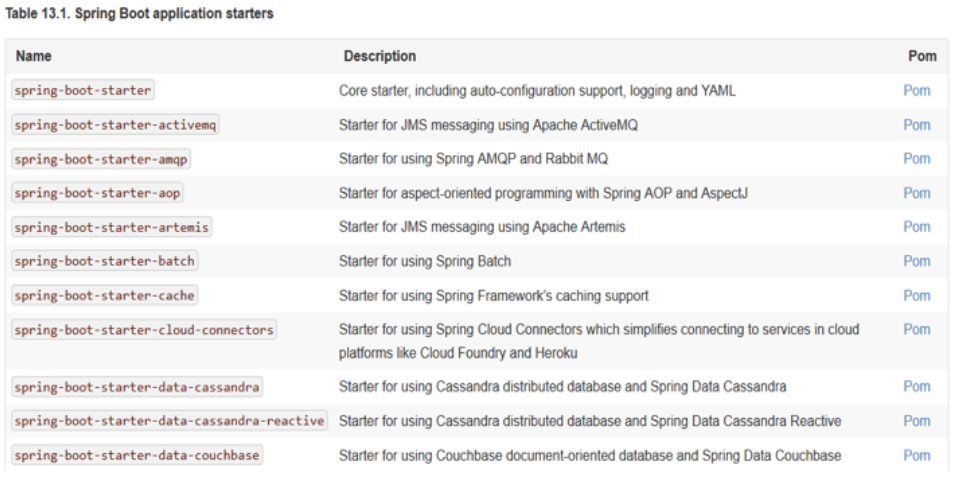

列出了Spring Boot官方提供的部分场景依赖启动器，这些依赖启动器适用于不同的场景开发，使用时只需要在pox.xml文件中导入对应的依赖启动器即可。

需要说明的是，Spring Boot官方并不是针对所有场景开发的技术框架都提供了场景启动器，例如数据库操作框架MyBatis、阿里巴巴的Druid数据源等，Spring Boot官方就没有提供对应的依赖启动器。为了充分利用Spring Boot框架的优势，在Spring Boot官方没有整合这些技术框架的情况下，MyBatis、Druid等技术框架所在的开发团队主动与Spring Boot框架进行了整合，实现了各自的依赖启动器，例如mybatis-spring-boot-starter、druid-spring-boot-starter等。我们在pom.xml文件中引入这些第三方的依赖启动器时，切记要配置对应的版本号

### 2.2 自动配置（启动流程）

**概念：**能够在我们添加jar包依赖的时候，自动为我们配置一些组件的相关配置，我们无需配置或者只需要少量配置就能运行编写的项目

**问题：**Spring Boot到底是如何进行自动配置的，都把哪些组件进行了自动配置？

Spring Boot应用的启动入口是@SpringBootApplication注解标注类中的main()方法，@SpringBootApplication能够扫描Spring组件并自动配置Spring Boot

下面，查看@SpringBootApplication内部源码进行分析 ，核心代码具体如下

```java
@SpringBootApplication
public class SpringbootDemoApplication {
    public static void main(String[] args) {
        SpringApplication.run(SpringbootDemoApplication.class, args);
    }
}
```
```java
@Target({ElementType.TYPE}) //注解的适用范围,Type表示注解可以描述在类、接口、注解或枚举中
@Retention(RetentionPolicy.RUNTIME) //表示注解的生命周期，Runtime运行时
@Documented //表示注解可以记录在javadoc中
@Inherited //表示可以被子类继承该注解
@SpringBootConfiguration // 标明该类为配置类
@EnableAutoConfiguration // 启动自动配置功能
@ComponentScan(  // 包扫描器
    excludeFilters = {@Filter(
        type = FilterType.CUSTOM,
        classes = {TypeExcludeFilter.class}
    ), @Filter(
        type = FilterType.CUSTOM,
        classes = {AutoConfigurationExcludeFilter.class}
    )}
)
public @interface SpringBootApplication {
    ...
}
```

​		从上述源码可以看出，@SpringBootApplication注解是一个组合注解，前面 4 个是注解的元数据信息， 我们主要看后面 3 个注解：@SpringBootConfiguration、@EnableAutoConfiguration、@ComponentScan三个核心注解，关于这三个核心注解的相关说明具体如下：

#### 2.2.1 @SpringBootConfiguration注解

@SpringBootConfiguration注解表示Spring Boot配置类。查看@SpringBootConfiguration注解源
码，核心代码具体如下。

```java
@Target(ElementType.TYPE)
@Retention(RetentionPolicy.RUNTIME)
@Documented
@Configuration //配置IoC容器
public @interface SpringBootConfiguration {

}
```

​		从上述源码可以看出，@SpringBootConfiguration注解内部有一个核心注解@Configuration，该注解是Spring框架提供的，表示当前类为一个配置类（XML配置文件的注解表现形式），并可以被组件扫描器扫描。由此可见，@SpringBootConfiguration注解的作用与@Configuration注解相同，都是标识一个可以被组件扫描器扫描的配置类，只不过@SpringBootConfiguration是被Spring Boot进行了重新封装命名而已

#### 2.2.2 @EnableAutoConfiguration注解

@EnableAutoConfiguration注解表示开启自动配置功能，该注解是Spring Boot框架最重要的注解，也是实现自动化配置的注解。同样，查看该注解内部查看源码信息，核心代码具体如下

```java
@Target(ElementType.TYPE)
@Retention(RetentionPolicy.RUNTIME)
@Documented
@Inherited
@AutoConfigurationPackage // 自动配置包，扫描@SpringBootApplication标注的类的包以及子包，并添加到容器中
@Import(AutoConfigurationImportSelector.class)// 自动配置类扫描导入
public @interface EnableAutoConfiguration {

	String ENABLED_OVERRIDE_PROPERTY = "spring.boot.enableautoconfiguration";

	Class<?>[] exclude() default {};

	String[] excludeName() default {};
```

可以发现它是一个组合注解，Spring 中有很多以Enable开头的注解，其作用就是借助@Import来收集并注册特定场景相关的bean，并加载到IoC容器。`@EnableAutoConfiguration`就是借助`@Import`来收集所有符合自动配置条件的bean定义，并加载到IoC容器。

**下面，对这两个核心注解分别讲解 :**

##### （1）@AutoConfigurationPackage注解

​	查看`@AutoConfigurationPackage`注解内部源码信息，核心代码具体如下：

```java
@Target(ElementType.TYPE)
@Retention(RetentionPolicy.RUNTIME)
@Documented
@Inherited
@Import(AutoConfigurationPackages.Registrar.class)// 导入Registrar中注册的组件
public @interface AutoConfigurationPackage {

}
```

​		从上述源码可以看出，@AutoConfigurationPackage注解的功能是由@Import注解实现的，它是spring框架的底层注解，它的作用就是给容器中导入某个组件类，例如
`@Import(AutoConfigurationPackages.Registrar.class)`，它就是将Registrar这个组件类导入到容器中，可查看Registrar类中`registerBeanDefinitions`方法，这个方法就是导入组件类的具体实现 :

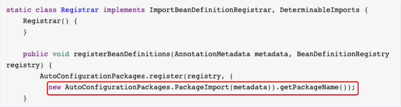

​		从上述源码可以看出，在Registrar类中有一个registerBeanDefinitions()方法，使用Debug模式启动项目， 可以看到选中的部分就是com.lagou。也就是说，<font color=red>@AutoConfigurationPackage注解的主要作用就是将主程序类所在包及所有子包下的组件到扫描到spring容器中。</font>

因此 在定义项目包结构时，要求定义的包结构非常规范，项目主程序启动类要定义在最外层的根目录位置，然后在根目录位置内部建立子包和类进行业务开发，这样才能够保证定义的类能够被组件扫描器扫描

##### （ 2 ） @Import(AutoConfigurationImportSelector.class)

将**AutoConfigurationImportSelector** 这个类导入到spring容器中，**AutoConfigurationImportSelector** 可以帮助springboot应用将所有符合条件的`@Configuration`配置都加载到当前SpringBoot创建并使用的IoC容器(ApplicationContext)中

继续研究 **AutoConfigurationImportSelector** 这个类，通过源码分析这个类中是通过selectImports这个方法告诉springboot都需要导入那些组件：

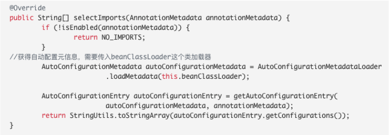

**深入研究loadMetadata方法**

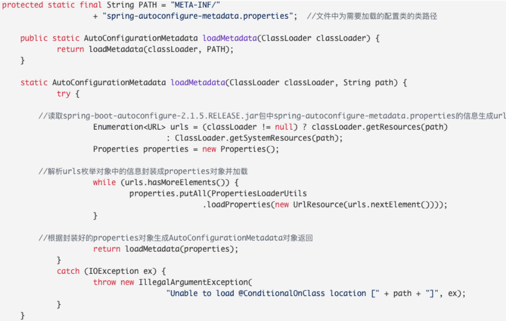

**深入getCandidateConfigurations方法**

个方法中有一个重要方法loadFactoryNames，这个方法是让SpringFactoryLoader去加载一些组件的名字。

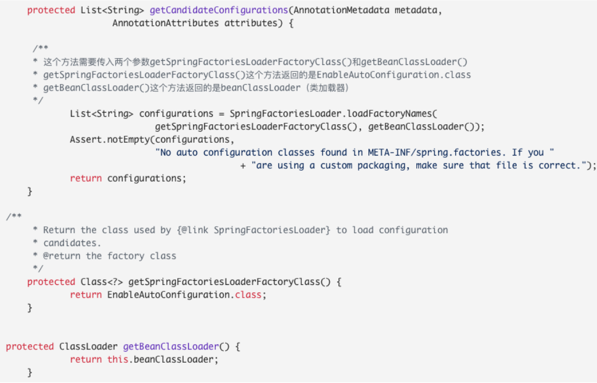

继续点开loadFactory方法

```java
public static List<String> loadFactoryNames(Class<?> factoryClass, @Nullable
                                            ClassLoader classLoader) {
    //获取出入的键
    String factoryClassName = factoryClass.getName();
    return
        (List)loadSpringFactories(classLoader).getOrDefault(factoryClassName,
                                                            Collections.emptyList());
}
private static Map<String, List<String>> loadSpringFactories(@Nullable
    ClassLoader classLoader) {
    MultiValueMap<String, String> result =
        (MultiValueMap)cache.get(classLoader);
    if (result != null) {
        return result;
    } else {
        try {
            //如果类加载器不为null，则加载类路径下spring.factories文件，
            //将其中设置的配置类的全路径信息封装 为Enumeration类对象
            Enumeration<URL> urls = classLoader != null?
                classLoader.getResources("META-INF/spring.factories") :
            ClassLoader.getSystemResources("META-INF/spring.factories");
            LinkedMultiValueMap result = new LinkedMultiValueMap();
            //循环Enumeration类对象，根据相应的节点信息生成Properties对象，
            //通过传入的键获取值，在将值切割为一个个小的字符串转化为Array，方法result集合中
            while(urls.hasMoreElements()) {
                URL url = (URL)urls.nextElement();
                UrlResource resource = new UrlResource(url);
                Properties properties =
                    PropertiesLoaderUtils.loadProperties(resource);
                Iterator var6 = properties.entrySet().iterator();
                while(var6.hasNext()) {
                    Entry<?, ?> entry = (Entry)var6.next();
                    String factoryClassName =
                        ((String)entry.getKey()).trim();
                    String[] var9 =
                        StringUtils.commaDelimitedListToStringArray((String)entry.getValue());
                    int var10 = var9.length;
                    for(int var11 = 0 ; var11 < var10; ++var11) {
                        String factoryName = var9[var11];
                        result.add(factoryClassName, factoryName.trim());
                    }
                }
            }
            cache.put(classLoader, result);
            return result;
```
会去读取一个 sprin g.factories 的文件，读取不到会表这个错误，我们继续根据会看到，最终路径的长
这样，而这个是spring提供的一个工具类

```java
public final class SpringFactoriesLoader {
    public static final String 
        FACTORIES_RESOURCE_LOCATION = "META-INF/spring.factories";
}
```

**它其实是去加载一个外部的文件，而这文件是在**

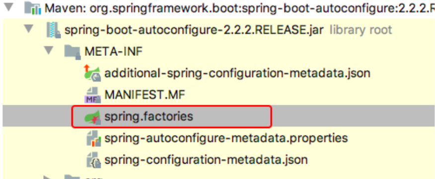

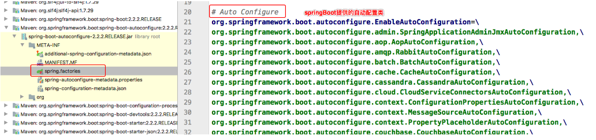

@EnableAutoConfiguration就是从classpath中搜寻META-INF/spring.factories配置文件，并将其中
org.springframework.boot.autoconfigure.EnableutoConfiguration对应的配置项通过反射（Java Refletion）实例化为对应的标注了@Configuration的JavaConfig形式的配置类，并加载到IOC容器中

以刚刚的项目为例，在项目中加入了Web环境依赖启动器，对应的WebMvcAutoConfiguration自动配置类就会生效，打开该自动配置类会发现，在该配置类中通过全注解配置类的方式对Spring MVC运行所需环境进行了默认配置，包括默认前缀、默认后缀、视图解析器、MVC校验器等。而这些自动配置类的本质是传统Spring MVC框架中对应的XML配置文件，只不过在Spring Boot中以自动配置类的形式进行了预先配置。因此，在Spring Boot项目中加入相关依赖启动器后，基本上不需要任何配置就可以运行程序，当然，我们也可以对这些自动配置类中默认的配置进行更改

**总结**

因此springboot底层实现自动配置的步骤是：

1. springboot应用启动；
2. @SpringBootApplication起作用；
3. @EnableAutoConfiguration；
4. @AutoConfigurationPackage：这个组合注解主要是
@Import(AutoConfigurationPackages.Registrar.class)，它通过将Registrar类导入到容器中，而Registrar类作用是扫描主配置类同级目录以及子包，并将相应的组件导入到springboot创建管理的容器中；
5. @Import(AutoConfigurationImportSelector.class)：它通过将AutoConfigurationImportSelector类导入到容器中，AutoConfigurationImportSelector类作用是通过selectImports方法执行的过程中，会使用内部工具类SpringFactoriesLoader，查找classpath上所有jar包中的META-INF/spring.factories进行加载，实现将配置类信息交给SpringFactory加载器进行一系列的容器创建过程

#### 2.2.3 @ComponentScan注解


​		@ComponentScan注解具体扫描的包的根路径由Spring Boot项目主程序启动类所在包位置决定，在扫描过程中由前面介绍的@AutoConfigurationPackage注解进行解析，从而得到Spring Boot项目主程序启动类所在包的具体位置

**总结**：

@SpringBootApplication 的注解的功能就分析差不多了， 简单来说就是 3 个注解的组合注解：

```java
|- @SpringBootConfiguration
    |- @Configuration //通过javaConfig的方式来添加组件到IOC容器中
|- @EnableAutoConfiguration
    |- @AutoConfigurationPackage //自动配置包，与@ComponentScan扫描到的添加到IOC
    |- @Import(AutoConfigurationImportSelector.class) //到META-INF/spring.factories中定义的bean添加到IOC容器中
|- @ComponentScan //包扫描
```


### 2.3 自定义Stater

**SpringBoot starter机制**

​	SpringBoot由众多Starter组成（一系列的自动化配置的starter插件），SpringBoot之所以流行，也是因为starter。

​	starter是SpringBoot非常重要的一部分，可以理解为一个可拔插式的插件，正是这些starter使得使用某个功能的开发者不需要关注各种依赖库的处理，不需要具体的配置信息，由Spring Boot自动通过classpath路径下的类发现需要的Bean，并织入相应的Bean。

例如，你想使用Reids插件，那么可以使用spring-boot-starter-redis；如果想使用MongoDB，可以使用spring-boot-starter-data-mongodb


**为什么要自定义starter**

​	开发过程中，经常会有一些独立于业务之外的配置模块。如果我们将这些可独立于业务代码之外的功能配置模块封装成一个个starter，复用的时候只需要将其在pom中引用依赖即可，SpringBoot为我们完成自动装配


**自定义starter的命名规则**

SpringBoot提供的starter以`spring-boot-starter-xxx`的方式命名的。官方建议自定义的starter使用`xxx-spring-boot-starter`命名规则。以区分SpringBoot生态提供的starter

整个过程分为两部分：

- 自定义starter
- 使用starter

首先，先完成自定义starter

（ 1 ）新建maven jar工程，工程名为zdy-spring-boot-starter，导入依赖：

```xml
<dependencies>
    <dependency>
        <groupId>org.springframework.boot</groupId>
        <artifactId>spring-boot-autoconfigure</artifactId>
        <version>2.2.2.RELEASE</version>
    </dependency>
</dependencies>
```

（ 2 ）编写javaBean

```java
@EnableConfigurationProperties(SimpleBean.class)
@ConfigurationProperties(prefix = "simplebean")
public class SimpleBean {
    private int id;
    private String name;
    public int getId() {
        return id;
    }
    public void setId(int id) {
        this.id = id;
    }
    public String getName() {
        return name;
    }
    public void setName(String name) {
        this.name = name;
    }
    @Override
    public String toString() {
        return "SimpleBean{" +
            "id=" + id +
            ", name='" + name + '\'' +
            '}';
    }
}
```

（ 3 ）编写配置类MyAutoConfiguration

```java
@Configuration
@ConditionalOnClass //@ConditionalOnClass：当类路径classpath下有指定的类的情况下进行自动配置
public class MyAutoConfiguration {
    static {
        System.out.println("MyAutoConfiguration init....");
    }
    @Bean
    public SimpleBean simpleBean(){
        return new SimpleBean();
    }
}
```
（ 4 ）resources下创建/META-INF/spring.factories

​	-Dspring.profiles.active=dev,这个dev在resources下怎么配置呀

​	注意：META-INF是自己手动创建的目录，spring.factories也是手动创建的文件,在该文件中配置自己的
自动配置类


```properties
org.springframework.boot.autoconfigure.EnableAutoConfiguration=\
com.lagou.config.MyAutoConfiguration
```


使用自定义starter

（ 1 ）导入自定义starter的依赖

```xml
<dependency>
    <groupId>com.lagou</groupId>
    <artifactId>zdy-spring-boot-starter</artifactId>
    <version>1.0-SNAPSHOT</version>
</dependency>
```

（ 2 ）在全局配置文件中配置属性值

```
simplebean.id= 1
simplebean.name=自定义starter
```

（ 3 ）编写测试方法

```java
//测试自定义starter
@Autowired
private SimpleBean simpleBean;

@Test
public void zdyStarterTest(){
    System.out.println(simpleBean);
}
```


### 2.4 执行原理

​		每个Spring Boot项目都有一个主程序启动类，在主程序启动类中有一个启动项目的main()方法，在该方法中通过执行SpringApplication.run()即可启动整个Spring Boot程序。

问题：那么SpringApplication.run()方法到底是如何做到启动Spring Boot项目的呢？

下面我们查看run()方法内部的源码，核心代码具体如下：

```java
@SpringBootApplication
public class SpringbootDemoApplication {
    public static void main(String[] args) {
        SpringApplication.run(SpringbootDemoApplication.class, args);
    }
}
```

```java
public static ConfigurableApplicationContext run(Class<?> primarySource,String... args) {
    return run(new Class[]{primarySource}, args);
}
public static ConfigurableApplicationContext run(Class<?>[] primarySources,String[] args) {
    return (new SpringApplication(primarySources)).run(args);
}
```

​		从上述源码可以看出，SpringApplication.run()方法内部执行了两个操作，分别是SpringApplication实例的初始化创建和调用run()启动项目，这两个阶段的实现具体说明如下

**1 ．SpringApplication实例的初始化创建**

​		查看SpringApplication实例对象初始化创建的源码信息，核心代码具体如下

```java
public SpringApplication(ResourceLoader resourceLoader, Class... primarySources)
{
    this.sources = new LinkedHashSet();
    this.bannerMode = Mode.CONSOLE;
    this.logStartupInfo = true;
    this.addCommandLineProperties = true;
    this.addConversionService = true;
    this.headless = true;
    this.registerShutdownHook = true;
    this.additionalProfiles = new HashSet();
    this.isCustomEnvironment = false;
    this.resourceLoader = resourceLoader;
    Assert.notNull(primarySources, "PrimarySources must not be null");
    //把项目启动类.class设置为属性存储起来
    this.primarySources = new LinkedHashSet(Arrays.asList(primarySources));
    //判断当前webApplicationType应用的类型
    this.webApplicationType = WebApplicationType.deduceFromClasspath();
    // 设置初始化器(Initializer),最后会调用这些初始化器
    this.setInitializers(this.getSpringFactoriesInstances(
        ApplicationContextInitializer.class));
    // 设置监听器(Listener)
    this.setListeners(this.getSpringFactoriesInstances(ApplicationListener.class));
    // 用于推断并设置项目main()方法启动的主程序启动类
    this.mainApplicationClass = this.deduceMainApplicationClass();
}
```


从上述源码可以看出，SpringApplication的初始化过程主要包括 4 部分，具体说明如下。

（ 1 ）this.webApplicationType = WebApplicationType.deduceFromClasspath()

​		用于判断当前webApplicationType应用的类型。deduceFromClasspath()方法用于查看Classpath类路径下是否存在某个特征类，从而判断当前webApplicationType类型是SERVLET应用（Spring 5之前的传统MVC应用）还是REACTIVE应用（Spring 5开始出现的WebFlux交互式应用）

（ 2 ）this.setInitializers(this.getSpringFactoriesInstances(ApplicationContextInitializer.class))

​		用于SpringApplication应用的初始化器设置。在初始化器设置过程中，会使用Spring类加载器
SpringFactoriesLoader从META-INF/spring.factories类路径下的META-INF下的spring.factores文件中获取所有可用的应用初始化器类ApplicationContextInitializer。

（ 3 ）this.setListeners(this.getSpringFactoriesInstances(ApplicationListener.class))

​		用于SpringApplication应用的监听器设置。监听器设置的过程与上一步初始化器设置的过程基本一样，也是使用SpringFactoriesLoader从META-INF/spring.factories类路径下的META-INF下的spring.factores文件中获取所有可用的监听器类ApplicationListener。

（ 4 ）this.mainApplicationClass = this.deduceMainApplicationClass()

​		用于推断并设置项目main()方法启动的主程序启动类

**2 ．项目的初始化启动**

​		分析完(new SpringApplication(primarySources)).run(args)源码前一部分SpringApplication实例
对象的初始化创建后，查看run(args)方法执行的项目初始化启动过程，核心代码具体如下：

```java
public ConfigurableApplicationContext run(String... args) {
    StopWatch stopWatch = new StopWatch();
    stopWatch.start();
    ConfigurableApplicationContext context = null;
    Collection<SpringBootExceptionReporter> exceptionReporters = new
        ArrayList();
    this.configureHeadlessProperty();
    // 第一步：获取并启动监听器
    SpringApplicationRunListeners listeners = this.getRunListeners(args);
    listeners.starting();
    Collection exceptionReporters;
    try {
        ApplicationArguments applicationArguments =
            new DefaultApplicationArguments(args);
        // 第二步：根据SpringApplicationRunListeners以及参数来准备环境
        ConfigurableEnvironment environment =
            this.prepareEnvironment(listeners, applicationArguments);
        this.configureIgnoreBeanInfo(environment);
        // 准备Banner打印器 - 就是启动Spring Boot的时候打印在console上的ASCII艺术字体
        Banner printedBanner = this.printBanner(environment);
        // 第三步：创建Spring容器
        context = this.createApplicationContext();
        exceptionReporters =
            this.getSpringFactoriesInstances(SpringBootExceptionReporter.class,
                                             new Class[]{ConfigurableApplicationContext.class}, new Object[]{context});
        // 第四步：Spring容器前置处理
        this.prepareContext(context, environment, listeners,
                            applicationArguments, printedBanner);
        // 第五步：刷新容器
        this.refreshContext(context);
        // 第六步：Spring容器后置处理
        this.afterRefresh(context, applicationArguments);
        stopWatch.stop();
        if(this.logStartupInfo) {
            (new StartupInfoLogger(this.mainApplicationClass))
            .logStarted(this.getApplicationLog(), stopWatch);
        }
        // 第七步：发出结束执行的事件
        listeners.started(context);
        // 返回容器
        this.callRunners(context, applicationArguments);
    } catch (Throwable var10) {
        this.handleRunFailure(context, var10, exceptionReporters, listeners);
        throw new IllegalStateException(var10);
    }
    try {
        listeners.running(context);
        return context;
    } catch (Throwable var9) {
        this.handleRunFailure(context, var9, exceptionReporters,
                              (SpringApplicationRunListeners)null);
        throw new IllegalStateException(var9);
    }
}
```


从上述源码可以看出，项目初始化启动过程大致包括以下部分：

**第一步：获取并启动监听器**

```
this.getRunListeners(args)和listeners.starting()方法主要用于获取SpringApplication实
例初始化过程中初始化的SpringApplicationRunListener监听器并运行。
```

**第二步：根据SpringApplicationRunListeners以及参数来准备环境**

```
this.prepareEnvironment(listeners, applicationArguments)方法主要用于对项目运行环境进
行预设置，同时通过this.configureIgnoreBeanInfo(environment)方法排除一些不需要的运行环境
```

**第三步：创建Spring容器**

```
根据webApplicationType进行判断， 确定容器类型，如果该类型为SERVLET类型，会通过反射装载
对应的字节码，也就是AnnotationConfigServletWebServerApplicationContext，接着使用之前
初始化设置的context（应用上下文环境）、environment（项目运行环境）、listeners（运行监听
器）、applicationArguments（项目参数）和printedBanner（项目图标信息）进行应用上下文的组
装配置，并刷新配置
```
**第四步：Spring容器前置处理**

```
这一步主要是在容器刷新之前的准备动作。设置容器环境，包括各种变量等等，其中包含一个非常关键的操作：
将启动类注入容器，为后续开启自动化配置奠定基础
```
**第五步：刷新容器**

```
开启刷新spring容器，通过refresh方法对整个IOC容器的初始化(包括bean资源的定位，解析，注册等
等)，同时向JVM运行时注册一个关机钩子，在JVM关机时会关闭这个上下文，除非当时它已经关闭
```
**第六步：Spring容器后置处理**

```
扩展接口，设计模式中的模板方法，默认为空实现。如果有自定义需求，可以重写该方法。比如打印一些启动结束log，
或者一些其他的后置处理
```
**第七步：发出结束执行的事件**

```java
获取EventPublishingRunListener监听器，并执行其started方法，并且将创建的Spring容器传进去
了，创建一个ApplicationStartedEvent事件，并执行ConfigurableApplicationContext 的
publishEvent方法，也就是说这里是在Spring容器中发布事件，并不是在SpringApplication中发布
事件，和前面的starting是不同的，前面的starting是直接向SpringApplication中的监听器发布启
动事件。
```
**第八步：执行Runners**

```
用于调用项目中自定义的执行器XxxRunner类，使得在项目启动完成后立即执行一些特定程序。其中，
Spring Boot提供的执行器接口有ApplicationRunner 和CommandLineRunner两种，在使用时只需要
自定义一个执行器类实现其中一个接口并重写对应的run()方法接口，然后Spring Boot项目启动后会立
即执行这些特定程序
```
下面，通过一个Spring Boot执行流程图，让大家更清晰的知道Spring Boot的整体执行流程和主要启
动阶段:

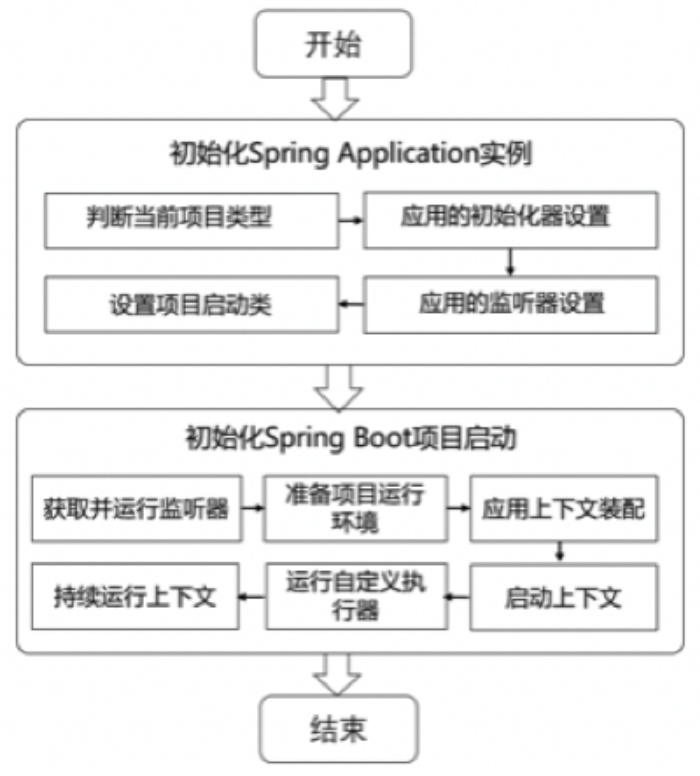


 

## 3. SpringBoot数据访问

​	SpringData是Spring提供的一个用于简化数据库访问、支持云服务的开源框架。它是一个伞形项目，包含了大量关系型数据库及非关系型数据库的数据访问解决方案，其设计目的是使我们可以快速且简单地使用各种数据访问技术。Spring Boot默认采用整合SpringData的方式统一处理数据访问层，通过添加大量自动配置，引入各种数据访问模板xxxTemplate以及统一的Repository接口，从而达到简化数据访问层的操作。

Spring Data提供了多种类型数据库支持，对支持的的数据库进行了整合管理，提供了各种依赖启动器，接下来，通过一张表罗列提供的常见数据库依赖启动器，如表所示。

| 名称                             | 描述                                                  |
| -------------------------------- | ----------------------------------------------------- |
| spring-boot-starter-data-jpa     | 使用Spring Data JPA与Hibernate                        |
| spring-boot-starter-data-mongodb | 使用MongoDB和Spring Data MongoDB                      |
| spring-boot-starter-data-neo4j   | 使用Neo4j图数据库和Spring Data Neo4j                  |
| spring-boot-starter-data-redis   | 使用Redis键值数据存储与Spring Data Redis和Jedis客户端 |

​		除此之外，还有一些框架技术，Spring Data项目并没有进行统一管理， Spring Boot官方也没有提供对应的依赖启动器，但是为了迎合市场开发需求、这些框架技术开发团队自己适配了对应的依赖启动器，例如mybatis-spring-boot-starter支持MyBatis的使用


### 3.1 Spring Boot整合MyBatis

​		MyBatis 是一款优秀的持久层框架，Spring Boot官方虽然没有对MyBatis进行整合，但是MyBatis团队自行适配了对应的启动器，进一步简化了使用MyBatis进行数据的操作

​		因为Spring Boot框架开发的便利性，所以实现Spring Boot与数据访问层框架（例如MyBatis）的整合非常简单，主要是引入对应的依赖启动器，并进行数据库相关参数设置即可

#### 3.1.1 基础环境搭建 

**1.数据准备**

​		在MySQL中，先创建了一个数据库springbootdata，然后创建了两个表t_article和t_comment并向表中插入数据。其中评论表t_comment的a_id与文章表t_article的主键id相关联

```sql
# 创建数据库
CREATE DATABASE springbootdata;
# 选择使用数据库
USE springbootdata;
# 创建表t_article并插入相关数据
DROP TABLE IF EXISTS t_article;
CREATE TABLE t_article (
    id int( 20 ) NOT NULL AUTO_INCREMENT COMMENT '文章id',
    title varchar( 200 ) DEFAULT NULL COMMENT '文章标题',
    content longtext COMMENT '文章内容',
    PRIMARY KEY (id)
) ENGINE=InnoDB AUTO_INCREMENT= 2 DEFAULT CHARSET=utf8;
INSERT INTO t_article VALUES ('1', 'Spring Boot基础入门', '从入门到精通讲解...');
INSERT INTO t_article VALUES ('2', 'Spring Cloud基础入门', '从入门到精通讲解...');
# 创建表t_comment并插入相关数据
DROP TABLE IF EXISTS t_comment;
CREATE TABLE t_comment (
    id int( 20 ) NOT NULL AUTO_INCREMENT COMMENT '评论id',
    content longtext COMMENT '评论内容',
    author varchar( 200 ) DEFAULT NULL COMMENT '评论作者',
    a_id int( 20 ) DEFAULT NULL COMMENT '关联的文章id',
    PRIMARY KEY (id)
) ENGINE=InnoDB AUTO_INCREMENT= 3 DEFAULT CHARSET=utf8;
INSERT INTO t_comment VALUES ('1', '很全、很详细', 'luccy', '1');
INSERT INTO t_comment VALUES ('2', '赞一个', 'tom', '1');
INSERT INTO t_comment VALUES ('3', '很详细', 'eric', '1');
INSERT INTO t_comment VALUES ('4', '很好，非常详细', '张三', '1');
INSERT INTO t_comment VALUES ('5', '很不错', '李四', '2');
```

**2. 创建项目，引入相应的启动器**

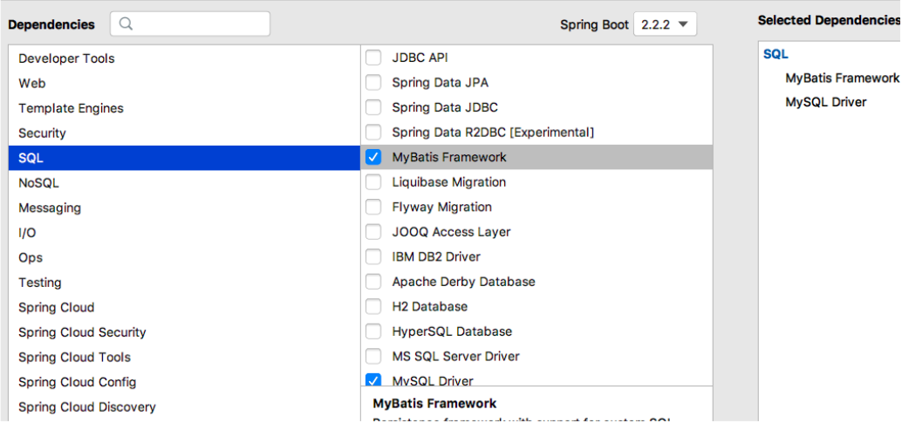


**3. 编写与数据库表t_comment和t_article对应的实体类Comment和Article**

```java
public class Comment {
private Integer id;
private String content;
private String author;
private Integer aId;
// 省略属性getXX()和setXX()方法
// 省略toString()方法
}
```

```java
public class Article {
    private Integer id;
    private String title;
    private String content;
    // 省略属性getXX()和setXX()方法
    // 省略toString()方法
}
```

**4. 编写配置文件**

（ 1 ）在application.properties配置文件中进行数据库连接配置

```properties
# MySQL数据库连接配置
spring.datasource.url=jdbc:mysql://localhost:3306/springbootdata?
serverTimezone=UTC
spring.datasource.username=root
spring.datasource.password=root
```

#### 3.1.2 注解方式整合Mybatis

- 创建一个用于对数据库表t_comment数据操作的接口CommentMapper

  ```java
  @Mapper
  public interface CommentMapper {
      @Select("SELECT * FROM t_comment WHERE id =#{id}")
      public Comment findById(Integer id);
  }
  ```

  ```
  @Mapper注解表示该类是一个MyBatis接口文件，并保证能够被Spring Boot自动扫描到Spring容器中
  
  对应的接口类上添加了@Mapper注解，如果编写的Mapper接口过多时，需要重复为每一个接口文件添加
  @Mapper注解
  
  为了解决这种麻烦，可以直接在Spring Boot项目启动类上添加@MapperScan("xxx")注解，不需要再逐
  个添加
  
  @Mapper注解，@MapperScan("xxx")注解的作用和@Mapper注解类似，但是它必须指定需要扫描的具体
  包名
  ```

  

- 编写测试方法

  ```java
  @RunWith(SpringRunner.class)
  @SpringBootTest
  class SpringbootPersistenceApplicationTests {
      @Autowired
      private CommentMapper commentMapper;
      @Test
      void contextLoads() {
          Comment comment = commentMapper.findById( 1 );
          System.out.println(comment);
      }
  }
  ```

- 打印结果

  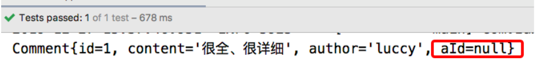

  ​	控制台中查询的Comment的aId属性值为null，没有映射成功。这是因为编写的实体Comment中使用了驼峰命名方式将t_comment表中的a_id字段设计成了aId属性，所以无法正确映射查询结果。

  ​	为了解决上述由于驼峰命名方式造成的表字段值无法正确映射到类属性的情况，可以在Spring Boot全局配置文件application.properties中添加开启驼峰命名匹配映射配置，示例代码如下

  ```properties
  #开启驼峰命名匹配映射
  mybatis.configuration.map-underscore-to-camel-case=true
  ```

  **打印结果：**

  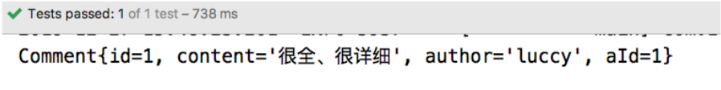

#### 3.1.3 使用配置文件的方式整合MyBatis

（ 1 ）创建一个用于对数据库表t_article数据操作的接口ArticleMapper

```java
@Mapper
public interface ArticleMapper {
    public Article selectArticle(Integer id);
}
```

（ 2 ）创建XML映射文件

​		resources目录下创建一个统一管理映射文件的包mapper，并在该包下编写与ArticleMapper接口方应的映射文件ArticleMapper.xml

```xml
<?xml version="1.0" encoding="UTF-8" ?>
<!DOCTYPE mapper PUBLIC "-//mybatis.org//DTD Mapper 3.0//EN"
"http://mybatis.org/dtd/mybatis-3-mapper.dtd">
<mapper namespace="com.lagou.mapper.ArticleMapper">
    <select id="selectArticle" resultType="Article">
        select * from Article
    </select>
</mapper>
```

（ 3 ）配置XML映射文件路径。在项目中编写的XML映射文件，Spring Boot并无从知晓，所以无法扫描到该自定义编写的XML配置文件，还必须在全局配置文件application.properties中添加MyBatis映射文件路径的配置，同时需要添加实体类别名映射路径，示例代码如下

```properties
#配置MyBatis的xml配置文件路径
mybatis.mapper-locations=classpath:mapper/*.xml
#配置XML映射文件中指定的实体类别名路径
mybatis.type-aliases-package=com.lagou.pojo
```

（ 4 ）编写单元测试进行接口方法测试

```java
@Autowired
private ArticleMapper articleMapper;

@Test
public void selectArticle() {
    Article article = articleMapper.selectArticle( 1 );
    System.out.println(article);
}
```

打印结果：


### 3.2 Spring Boot整合JPA

（ 1 ）添加Spring Data JPA依赖启动器。在项目的pom.xml文件中添加Spring Data JPA依赖启动器，示例代码如下

```xml
<dependency>
    <groupId>org.springframework.boot</groupId>
    <artifactId>spring-boot-starter-data-jpa</artifactId>
</dependency>
```

（ 2 ）编写ORM实体类。

```java
@Entity(name = "t_comment")  // 设置ORM实体类，并指定映射的表名
public class Comment {
    @Id // 表明映射对应的主键id
    @GeneratedValue(strategy = GenerationType.IDENTITY) // 设置主键自增策略
    private Integer id;
    private String content;
    private String author;
    @Column(name = "a_id")  //指定映射的表字段名
    private Integer aId;
    // 省略属性getXX()和setXX()方法
    // 省略toString()方法
}
```

（ 3 ）编写Repository接口 ：CommentRepository

```java
public interface CommentRepository 
    extends JpaRepository<Comment,Integer> {
}
```

（ 4 ）测试

```java
@Autowired
private CommentRepository repository;

@Test
public void selectComment() {
    Optional<Comment> optional = repository.findById( 1 );
    if(optional.isPresent()){
        System.out.println(optional.get());
    }
    System.out.println();
}
```

打印：

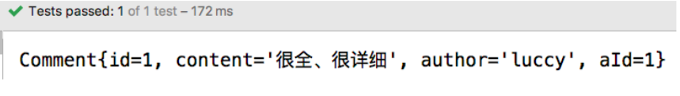


### 3.3 Spring Boot整合Redis

​		除了对关系型数据库的整合支持外，Spring Boot对非关系型数据库也提供了非常好的支持。Spring Boot与非关系型数据库Redis的整合使用

（ 1 ）添加Spring Data Redis依赖启动器。先在项目的pom.xml文件中添加Spring Data Redis依赖启动器，示例代码如下

```xml
<dependency>
    <groupId>org.springframework.boot</groupId>
    <artifactId>spring-boot-starter-data-redis</artifactId>
</dependency>
```

（ 2 ）编写实体类。此处为了演示Spring Boot与Redis数据库的整合使用，在项目的com.lagou.domain包下编写几个对应的实体类

```java
@RedisHash("persons")  // 指定操作实体类对象在Redis数据库中的存储空间
public class Person {
    @Id // 标识实体类主键
    private String id;
    @Indexed // 标识对应属性在Redis数据库中生成二级索引
    private String firstname;
    @Indexed
    private String lastname;
    private Address address;
    // 省略属性getXX()和setXX()方法
    // 省略有参和无参构造方法
    // 省略toString()方法
}
```

Address :

```java
public class Address {
    @Indexed
    private String city;
    @Indexed
    private String country;
    // 省略属性getXX()和setXX()方法
    // 省略有参和无参构造方法
    // 省略toString()方法
}
```

实体类示例中，针对面向Redis数据库的数据操作设置了几个主要注解，这几个注解的说明如下 :

- @RedisHash("persons")：用于指定操作实体类对象在Redis数据库中的存储空间，此处表示针对Person实体类的数据操作都存储在Redis数据库中名为persons的存储空间下。
- @Id：用于标识实体类主键。在Redis数据库中会默认生成字符串形式的HashKey表示唯一的实体对象id，当然也可以在数据存储时手动指定id。
- @Indexed：用于标识对应属性在Redis数据库中生成二级索引。使用该注解后会在Redis数据库中生成属性对应的二级索引，索引名称就是属性名，可以方便的进行数据条件查询。

（ 3 ）编写Repository接口。Spring Boot针对包括Redis在内的一些常用数据库提供了自动化配置，可以通过实现Repository接口简化对数据库中的数据进行增删改查操作

```java
public interface PersonRepository extends CrudRepository<Person,String> {
    List<Person> findByAddress_City(String 北京);
}
```

- 需要说明的是，在操作Redis数据库时编写的Repository接口文件需要继承最底层的CrudRepository接口，而不是继承JpaRepository，这是因为JpaRepository是Spring Boot整合JPA特有的。当然，也可以在项目pom.xml文件中同时导入Spring Boot整合的JPA依赖和Redis依赖，这样就可以编写一个继承JpaRepository的接口操作Redis数据库

（ 4 ）Redis数据库连接配置。在项目的全局配置文件application.properties中添加Redis数据库的连接配置，示例代码如下

```properties
# Redis服务器地址
spring.redis.host=127.0.0.1
# Redis服务器连接端口
spring.redis.port= 6379
# Redis服务器连接密码（默认为空）
spring.redis.password=
```

（ 5 ）编写单元测试进行接口方法测试

```java
@RunWith(SpringRunner.class)
@SpringBootTest
public class RedisTests {
    
    @Autowired
    private PersonRepository repository;
    
    @Test
    public void savePerson() {
        Person person = new Person();
        person.setFirstname("张");
        person.setLastname("三");
        Address address = new Address();
        address.setCity("北京");
        address.setCountry("中国");
        person.setAddress(address);
        // 向Redis数据库添加数据
        Person save = repository.save(person);
    }
    
    @Test
    public void selectPerson() {
        List<Person> list = (List<Person>) repository.findByAddress_City("北京");
        for (Person person : list) {
            System.out.println(person);
        }
    }
}
```

整合测试 :

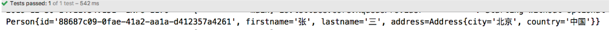

​	为了验证savePerson()方法的执行效果，还可以打开之前连接的Redis客户端可视化管理工具查看数据，效果如图 ( 可能需要Reload刷新 )

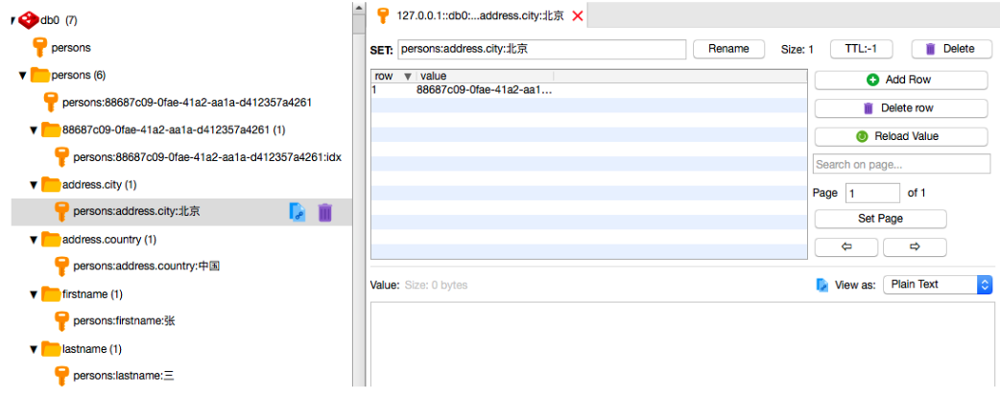

​	执行savePerson()方法添加的数据在Redis数据库中存储成功。另外，在数据库列表左侧还生成了一些类似address.city、firstname、lastname等二级索引，这些二级索引是前面创建Person类时在对应属性上添加@Indexed注解而生成的。同时，由于在Redis数据库中生成了对应属性的二级索引，所以可以通过二级索引来查询具体的数据信息，例如repository.findByAddress_City("北京")通过address.city索引查询索引值为“北京”的数据信息。如果没有设置对应属性的二级索引，那么通过属性索引查询数据结果将会为空


## 4. SpringBoot视图技术

### 4.1 支持的视图技术

​	前端模板引擎技术的出现，使前端开发人员无需关注后端业务的具体实现，只关注自己页面的呈现效果即可，并且解决了前端代码错综复杂的问题、实现了前后端分离开发。Spring Boot框架对很多常用的模板引擎技术（如：FreeMarker、Thymeleaf、Mustache等）提供了整合支持

​	Spring Boot不太支持常用的JSP模板，并且没有提供对应的整合配置，这是因为使用嵌入式
Servlet容器的Spring Boot应用程序对于JSP模板存在一些限制 ：

- Spring Boot默认使用嵌入式Servlet容器以JAR包方式进行项目打包部署，这种JAR包方式不支持JSP模板。
- 如果使用Undertow嵌入式容器部署Spring Boot项目，也不支持JSP模板。
- Spring Boot默认提供了一个处理请求路径“/error”的统一错误处理器，返回具体的异常信息。使用JSP模板时，无法对默认的错误处理器进行覆盖，只能根据Spring Boot要求在指定位置定制错误页面。

​     上面对Spring Boot支持的模板引擎进行了介绍，并指出了整合JSP模板的一些限制。接下来，对其中常用的Thymeleaf模板引擎进行介绍，并完成与Spring Boot框架的整合实现

### 4.2 Thymeleaf

​	Thymeleaf是一种现代的基于服务器端的Java模板引擎技术，也是一个优秀的面向Java的XML、XHTML、HTML5页面模板，它具有丰富的标签语言、函数和表达式，在使用Spring Boot框架进行页面设计时，一般会选择Thymeleaf模板

#### 4.2.1 Thymeleaf语法

##### 常用标签

在HTML页面上使用Thymeleaf标签，Thymeleaf 标签能够动态地替换掉静态内容，使页面动态展示。

为了大家更直观的认识Thymeleaf，下面展示一个在HTML文件中嵌入了Thymeleaf的页面文件，示例代码如下：

```html
<!DOCTYPE html>
<html lang="en" xmlns:th="http://www.thymeleaf.org">
    <head>
        <meta charset="UTF-8">
        <link rel="stylesheet" type="text/css" media="all"
              href="../../css/gtvg.css" th:href="@{/css/gtvg.css}" />
        <title>Title</title>
    </head>
    <body>
        <p th:text="${hello}">欢迎进入Thymeleaf的学习</p>
    </body>
</html>
```

​	上述代码中，“xmlns:th="http://www.thymeleaf.org"“ 用于引入Thymeleaf模板引擎标签，使用关键字“th”标注标签是Thymeleaf模板提供的标签，其中，“th:href”用于引入外联样式文件，“th:text”用于动态显示标签文本内容。

除此之外，Thymeleaf模板提供了很多标签，接下来，通过一张表罗列Thymeleaf的常用标签

| th：标签   | 说明                                   |
| ---------- | -------------------------------------- |
| th:insert  | 布局标签，替换内容到引入的文件         |
| th:replace | 页面片段包含（类似JSP中的include标签） |
| th:each    | 元素遍历（类似JSP中的c:forEach标签）   |
| th:if      | 条件判断，如果为真                     |
| th:unless  | 条件判断，如果为假                     |
| th:switch  | 条件判断，进行选择性匹配               |
| th:case    | 条件判断，进行选择性匹配               |
| th:value   | 属性值修改，指定标签属性值             |
| th:href    | 用于设定链接地址                       |
| th:src     | 用于设定链接地址                       |
| th:text    | 用于指定标签显示的文本内容             |


##### 标准表达式

​	Thymeleaf模板引擎提供了多种标准表达式语法，在正式学习之前，先通过一张表来展示其主要语法及说明

| 说明           | 表达式语法 |
| -------------- | ---------- |
| 变量表达式     | ${...}     |
| 选择变量表达式 | *{...}     |
| 消息表达式     | #{...}     |
| 链接URL表达式  | @{...}     |
| 片段表达式     | ~{...}     |


###### 1 ．变量表达式 ${...}

​	变量表达式${...}主要用于获取上下文中的变量值，示例代码如下：

```html
<p th:text="${title}">这是标题</p>
```

​	示例使用了Thymeleaf模板的变量表达式${...}用来动态获取P标签中的内容，如果当前程序没有启动或者当前上下文中不存在title变量，该片段会显示标签默认值“这是标题”；如果当前上下文中存在title变量并且程序已经启动，当前P标签中的默认文本内容将会被title变量的值所替换，从而达到模板引擎页面数据动态替换的效果

​	同时，Thymeleaf为变量所在域提供了一些内置对象，具体如下所示

```
# ctx：上下文对象
# vars：上下文变量
# locale：上下文区域设置
# request：（仅限Web Context）HttpServletRequest对象
# response：（仅限Web Context）HttpServletResponse对象
# session：（仅限Web Context）HttpSession对象
# servletContext：（仅限Web Context）ServletContext对象
```

​	结合上述内置对象的说明，假设要在Thymeleaf模板引擎页面中动态获取当前国家信息，可以使用`#locale`内置对象，示例代码如下

```html
The locale country is: <span th:text="${#locale.country}">US</span>.
```

​	上述代码中，使用th:text="${#locale.country}"动态获取当前用户所在国家信息，其中标签内默认内容为US（美国），程序启动后通过浏览器查看当前页面时，Thymeleaf会通过浏览器语言设置来识别当前用户所在国家信息，从而实现动态替换

###### 2 ．选择变量表达式 *{...}

​	选择变量表达式和变量表达式用法类似，一般用于从被选定对象而不是上下文中获取属性值，如果没有选定对象，则和变量表达式一样，示例代码如下

```html
<div th:object="${book}">
    <p>titile: <span th:text="*{title}">标题</span>.</p>
</div>
```

​	`*{title}` 选择变量表达式获取当前指定对象book的title属性值。

###### 3 ．消息表达式 #{...}

消息表达式#{...}主要用于Thymeleaf模板页面国际化内容的动态替换和展示，使用消息表达式#{...}进行国际化设置时，还需要提供一些国际化配置文件。关于消息表达式的使用，后续会详细说明

###### 4 ．链接表达式 @{...}

链接表达式@{...}一般用于页面跳转或者资源的引入，在Web开发中占据着非常重要的地位，并且使用
也非常频繁，示例代码如下：

```html
<a th:href="@{http://localhost:8080/order/details(orderId=${o.id})}">view</a>
<a th:href="@{/order/details(orderId=${o.id})}">view</a>
```

​	上述代码中，链接表达式@{...}分别编写了绝对链接地址和相对链接地址。在有参表达式中，需要按照@{路径(参数名称=参数值，参数名称=参数值...)}的形式编写，同时该参数的值可以使用变量表达式来传递动态参数值

###### 5 ．片段表达式 ~{...}

片段表达式~{...}用来标记一个片段模板，并根据需要移动或传递给其他模板。其中，最常见的用法是使用th:insert或th:replace属性插入片段，示例代码如下：

```html
<div th:insert="~{thymeleafDemo::title}"></div>
```

​	上述代码中，使用th:insert属性将title片段模板引用到该标签中。thymeleafDemo为模板名称，Thymeleaf会自动查找“/resources/templates/”目录下的thymeleafDemo模板，title为片段名称

#### 4.2.2 基本使用

（ 1 ） Thymeleaf模板基本配置

​		首先 在Spring Boot项目中使用Thymeleaf模板，首先必须保证引入Thymeleaf依赖，示例代码如下：

```xml
<dependency>
    <groupId>org.springframework.boot</groupId>
    <artifactId>spring-boot-starter-thymeleaf</artifactId>
</dependency>
```

其次，在全局配置文件中配置Thymeleaf模板的一些参数。一般Web项目都会使用下列配置，示例代码如：

```properties
spring.thymeleaf.cache = true ＃启用模板缓存
spring.thymeleaf.encoding = UTF-8 ＃模板编码
spring.thymeleaf.mode = HTML5 ＃应用于模板的模板模式
spring.thymeleaf.prefix = classpath:/templates/ ＃指定模板页面存放路径
spring.thymeleaf.suffix = .html ＃指定模板页面名称的后缀
```

​	上述配置中，spring.thymeleaf.cache表示是否开启Thymeleaf模板缓存，默认为true，在开发过程中通常会关闭缓存，保证项目调试过程中数据能够及时响应;spring.thymeleaf.prefix指定了Thymeleaf模板页面的存放路径，默认为classpath:/templates/;spring.thymeleaf.suffix指定了Thymeleaf模板页面的名称后缀，默认为.html

（ 2 ）静态资源的访问

开发Web应用时，难免需要使用静态资源。Spring boot默认设置了静态资源的访问路径。

使用Spring Initializr方式创建的Spring Boot项目，默认生成了一个resources目录，在resources目录中新建public、resources、static三个子目录下，Spring boot默认会挨个从public、resources、static里面查找静态资源

#### 4.2.3 完成数据的页面展示

1. 创建Spring Boot项目，引入Thymeleaf依赖

   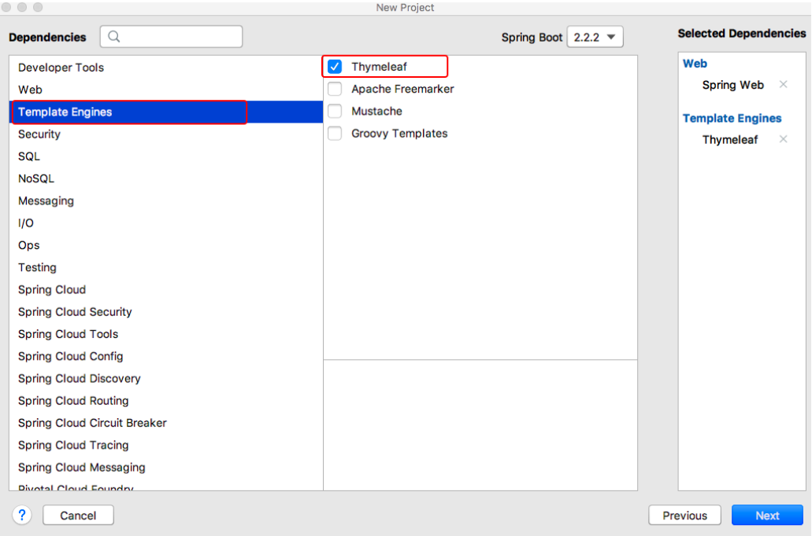

2. 编写配置文件

   打开application.properties全局配置文件，在该文件中对Thymeleaf模板页面的数据缓存进行设置

   ```properties
   # thymeleaf页面缓存设置（默认为true），
   # 开发中方便调试应设置为false，上线稳定后应保持默认true
   spring.thymeleaf.cache=false
   ```

   使用“spring.thymeleaf.cache=false”将Thymeleaf默认开启的缓存设置为了false，用来关闭模板页面缓存

3. 创建web控制类

   ​	在项目中创建名为com.lagou.controller的包，并在该包下创建一个用于前端模板页面动态数据替换效果测试的访问实体类LoginController

   ```java
   @Controller
   public class LoginController {
       /**
   * 获取并封装当前年份跳转到登录页login.html
   */
       @RequestMapping("/toLoginPage")
       public String toLoginPage(Model model){
           model.addAttribute("currentYear",
                              Calendar.getInstance().get(Calendar.YEAR));
           return "login";
       }
   ```

   toLoginPage()方法用于向登录页面login.html跳转，同时携带了当前年份信息currentYear。

4. 创建模板页面并引入静态资源文件

   在“classpath:/templates/”目录下引入一个用户登录的模板页面login.html

   ```html
   <!DOCTYPE html>
   <html lang="en" xmlns:th="http://www.thymeleaf.org">
       <head>
           <meta http-equiv="Content-Type" content="text/html; charset=UTF-8">
           <meta name="viewport" content="width=device-width, initial-scale=1,shrink-
                                          to-fit=no">
           <title>用户登录界面</title>
           <link th:href="@{/login/css/bootstrap.min.css}" rel="stylesheet">
           <link th:href="@{/login/css/signin.css}" rel="stylesheet">
       </head>
       <body class="text-center">
           <!-- 用户登录form表单 -->
           <form class="form-signin">
               
               <h1 class="h3 mb-3 font-weight-normal">请登录</h1>
               <input type="text" class="form-control"
                      th:placeholder="用户名" required="" autofocus="">
               <input type="password" class="form-control"
                      th:placeholder="密码" required="">
               <div class="checkbox mb-3">
                   <label>
                       <input type="checkbox" value="remember-me"> 记住我
                   </label>
               </div>
               <button class="btn btn-lg btn-primary btn-block" type="submit" >登录</button>
               <p class="mt-5 mb-3 text-muted">
                   © 
                   <span th:text="${currentYear}"> 2019 </span>
                   -
                   <span th:text="${currentYear}+1"> 2020 </span></p>
           </form>
       </body>
   </html>
   ```

   通过“xmlns:th="http://www.thymeleaf.org"”引入了Thymeleaf模板标签；

   使用“th:href”和“th:src”分别引入了两个外联的样式文件和一个图片；

   使用“th:text”引入了后台动态传递过来的当前年份currentYear

5. 效果测试

   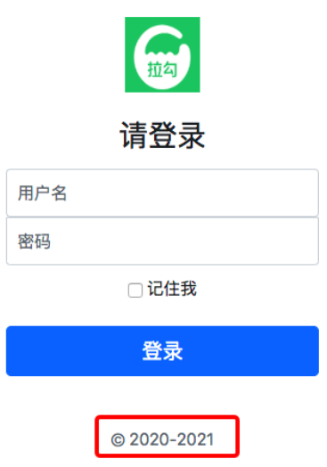

   

   ​	可以看出，登录页面login.html显示正常，在文件4-3中使用“th:*”相关属性引入的静态文件生效，并且在页面底部动态显示了当前日期2019-2020，而不是文件中的静态数字2019-2020。这进一步说明了Spring Boot与Thymeleaf整合成功，完成了静态资源的引入和动态数据的显示

#### 4.2.4 配置国际化页面

##### 1 ．编写多语言国际化配置文件

​		在项目的类路径resources下创建名称为i18n的文件夹，并在该文件夹中根据需要编写对应的多语言国际化文件login.properties、login_zh_CN.properties和login_en_US.properties文件

login.properties

```properties
login.tip=请登录
login.username=用户名
login.password=密码
login.rememberme=记住我
login.button=登录
```

login_zh_CN.properties

```properties
login.tip=请登录
login.username=用户名
login.password=密码
login.rememberme=记住我
login.button=登录
```

login_en_US.properties

```properties
login.tip=Please sign in
login.username=Username
login.password=Password
login.rememberme=Remember me
login.button=Login
```

​		login.properties为自定义默认语言配置文件，login_zh_CN.properties为自定义中文国际化文件，login_en_US.properties为自定义英文国际化文件

​		需要说明的是，Spring Boot默认识别的语言配置文件为类路径resources下的
messages.properties；其他语言国际化文件的名称必须严格按照“文件前缀名语言代码国家代
码.properties”的形式命名

​		本示例中，在项目类路径resources下自定义了一个i18n包用于统一配置管理多语言配置文件，并将项目默认语言配置文件名自定义为login.properties，因此，后续还必须在项目全局配置文件中进行国际化文件基础名配置，才能引用自定义国际化文件

##### 2 ． 编写配置文件

​		打开项目的application.properties全局配置文件，在该文件中添加国际化文件基础名设置，内容如文件

```properties
# 配置国际化文件基础名
spring.messages.basename=i18n.login
```

​		spring.messages.basename=i18n.login”设置了自定义国际化文件的基础名。其中，i18n表示国际化文件相对项目类路径resources的位置，login表示多语言文件的前缀名。如果开发者完全按照Spring Boot默认识别机制，在项目类路径resources下编写messages.properties等国际化文件，可以省略国际化文件基础名的配置

##### 3 ． 定制区域信息解析器

​		在完成上一步中多语言国际化文件的编写和配置后，就可以正式在前端页面中结合Thymeleaf模板相关属性进行国际化语言设置和展示了，不过这种实现方式默认是使用请求头中的语言信息（浏览器语言信息）自动进行语言切换的，有些项目还会提供手动语言切换的功能，这就需要定制区域解析器了

​		在项目中创建名为com.lagou.config的包，并在该包下创建一个用于定制国际化功能区域信息解析器的自定义配置类MyLocalResovel

```java
package com.lagou.config;
import org.springframework.context.annotation.Bean;
import org.springframework.context.annotation.Configuration;
import org.springframework.lang.Nullable;
import org.springframework.util.StringUtils;
import org.springframework.web.servlet.LocaleResolver;
import javax.servlet.http.HttpServletRequest;
import javax.servlet.http.HttpServletResponse;
import java.util.Locale;
@Configuration
public class MyLocaleResovel implements LocaleResolver {
    // 自定义区域解析方式
    @Override
    public Locale resolveLocale(HttpServletRequest httpServletRequest) {
        // 获取页面手动切换传递的语言参数l
        String l = httpServletRequest.getParameter("l");
        // 获取请求头自动传递的语言参数Accept-Language
        String header = httpServletRequest.getHeader("Accept-Language");
        Locale locale=null;
        // 如果手动切换参数不为空，就根据手动参数进行语言切换，否则默认根据请求头信息切换
        if(!StringUtils.isEmpty(l)){
            String[] split = l.split("_");
            locale=new Locale(split[ 0 ],split[ 1 ]);
        }else {
            // Accept-Language: en-US,en;q=0.9
            ,zh-CN;q=0.8,zh;q=0.7
                String[] splits = header.split(",");
            String[] split = splits[ 0 ].split("-");
            locale=new Locale(split[ 0 ],split[ 1 ]);
        }
        return locale;
    }
    @Override
    public void setLocale(HttpServletRequest httpServletRequest, @Nullable
                          HttpServletResponse httpServletResponse, @Nullable Locale locale) {
    }
    // 将自定义的MyLocalResovel类重新注册为一个类型LocaleResolver的Bean组件
    @Bean
    public LocaleResolver localeResolver(){
        return new MyLocalResovel();
    }
}
```
​		MyLocalResolver自定义区域解析器配置类实现了LocaleResolver接口，并重写了其中的resolveLocale()方法进行自定义语言解析，最后使用@Bean注解将当前配置类注册成Spring容器中的一个类型为LocaleResolver的Bean组件，这样就可以覆盖默认的LocaleResolver组件。其中，在resolveLocale()方法中，根据不同需求（手动切换语言信息、浏览器请求头自动切换语言信息）分别获取了请求参数l和请求头参数Accept-Language，然后在请求参数l不为空的情况下就以l参数携带的语言为标准进行语言切换，否则就定制通过请求头信息进行自动切换。

​		需要注意的是，在请求参数l的语言手动切换组装时，使用的是下划线“_”进行的切割，这是由多语言配置文件的格式决定的（例如login_zh_CN.properties）；而在请求头参数Accept-Language的语言自动切换组装时，使用的是短横线“-”进行的切割，这是由浏览器发送的请求头信息样式决定的（例如Accept-Language: en-US,en;q=0.9,zh-CN;q=0.8,zh;q=0.7）

##### 4 ． 页面国际化使用

​		打开项目templates模板文件夹中的用户登录页面login.html，结合Thymeleaf模板引擎实现国际化功能

```html
<!DOCTYPE html>
<html lang="en" xmlns:th="http://www.thymeleaf.org">
    <head>
        <meta http-equiv="Content-Type" content="text/html; charset=UTF-8">
        <meta name="viewport" content="width=device-width, initial-scale=1,shrink-
                                       to-fit=no">
        <title>用户登录界面</title>
        <link th:href="@{/login/css/bootstrap.min.css}" rel="stylesheet">
        <link th:href="@{/login/css/signin.css}" rel="stylesheet">
    </head>
    <body class="text-center">
        <!-- 用户登录form表单 -->
        <form class="form-signin">
            
            <h1 class="h3 mb-3 font-weight-normal" th:text="#{login.tip}">请登录</h1>
            <input type="text" class="form-control"
                   th:placeholder="#{login.username}" required="" autofocus="">
            <input type="password" class="form-control"
                   th:placeholder="#{login.password}" required="">
            <div class="checkbox mb-3">
                <label>
                    <input type="checkbox" value="remember-me"> [[#{login.rememberme}]]
                </label>
            </div>
            <button class="btn btn-lg btn-primary btn-block" type="submit" th:text="#
                                                                                    {login.button}">登录</button>
            <p class="mt-5 mb-3 text-muted">© <span
                                                    th:text="${currentYear}"> 2018 </span>-<span
                                                                                                 th:text="${currentYear}+1"> 2019 </span></p>
            <a class="btn btn-sm" th:href="@{/toLoginPage(l='zh_CN')}">中文</a>
            <a class="btn btn-sm" th:href="@{/toLoginPage(l='en_US')}">English</a>
        </form>
    </body>
</html>
```

​		使用Thymeleaf模板的#{}消息表达式设置了国际化展示的部分信息。在对记住我rememberme国际化设置时，需要国际化设置的rememberme在 标签外部，所以这里使用了行内表达式[[#{login.rememberme}]]动态获取国际化文件中的login.rememberme信息。另外，在

​		表单尾部还提供了中文、English手动切换语言的功能链接，在单击链接时会分别携带国家语言参数向“/”路径请求跳转，通过后台定制的区域解析器进行手动语言切换

##### 5. 整合效果测试

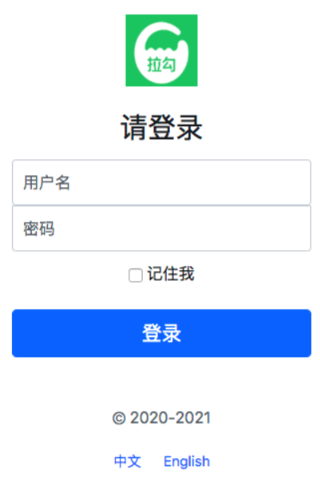

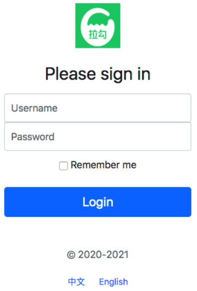


​		单击“English”链接进行语言国际化切换时携带了指定的“l=zh_CN”参数，后台定制的区域解析器配置类MyLocalResovel中的解析方法会根据定制规则进行语言切换，从而达到了手动切换国际化语言的效果

## 5. SpringBoot缓存管理

### 5.1 默认缓存管理

Spring框架支持透明地向应用程序添加缓存对缓存进行管理，其管理缓存的核心是将缓存应用于
操作数据的方法，从而减少操作数据的执行次数，同时不会对程序本身造成任何干扰。

Spring Boot继承了Spring框架的缓存管理功能，通过使用@EnableCaching注解开启基于注解的缓存支
持，Spring Boot就可以启动缓存管理的自动化配置。

接下来针对Spring Boot支持的默认缓存管理进行讲解

#### 5.1.1 基础环境搭建

##### 1 ．准备数据

使用创建的springbootdata的数据库，该数据库有两个表t_article和t_comment

##### 2 ．创建项目,功能编写

（ 1 ）在Dependencies依赖选择项中添加SQL模块中的JPA依赖、MySQL依赖和Web模块中的Web依赖

（ 2 ）编写数据库表对应的实体类，并使用JPA相关注解配置映射关系

```java
import javax.persistence.*;
@Entity(name = "t_comment")  // 设置ORM实体类，并指定映射的表名
public class Comment {
    @Id // 表明映射对应的主键id
    @GeneratedValue(strategy = GenerationType.IDENTITY) // 设置主键自增策略
    private Integer id;
    private String content;
    private String author;
    @Column(name = "a_id")  //指定映射的表字段名
    private Integer aId;
    // 省略属性getXX()和setXX()方法
    // 省略toString()方法
}
```

（ 3 ）编写数据库操作的Repository接口文件

```java
public interface CommentRepository extends JpaRepository<Comment,Integer> {
    //根据评论id修改评论作者author
    @Transactional
    @Modifying
    @Query("update t_comment c set c.author = ?1 where c.id=?2")
    public int updateComment(String author,Integer id);
}
```

（ 4 ）编写service层

```java
@Service
public class CommentService {
    @Autowired
    private CommentRepository commentRepository;
    public Comment findCommentById(Integer id){
        Optional<Comment> comment = commentRepository.findById(id);
        if(comment.isPresent()){
            Comment comment1 = comment.get();
            return comment1;
        }
        return null;
    }
```

（ 5 ）编写Controller层

```java
@RestController
public class CommentController {
    @Autowired
    private CommentService commentService;
    @RequestMapping(value = "/findCommentById")
    public Comment findCommentById(Integer id){
        Comment comment = commentService.findCommentById(id);
        return comment;
    }
}
```

（ 6 ）编写配置文件

​		在项目全局配置文件application.properties中编写对应的数据库连接配置

```properties
# MySQL数据库连接配置
spring.datasource.url=jdbc:mysql://localhost:3306/springbootdata?
serverTimezone=UTC
spring.datasource.username=root
spring.datasource.password=root
#显示使用JPA进行数据库查询的SQL语句
spring.jpa.show-sql=true
#开启驼峰命名匹配映射
mybatis.configuration.map-underscore-to-camel-case=true
#解决乱码
spring.http.encoding.force-response=true
```

（ 7 ）测试

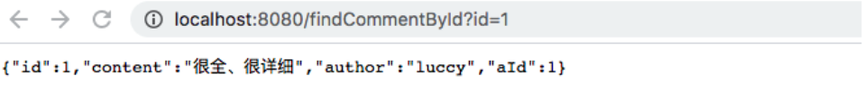

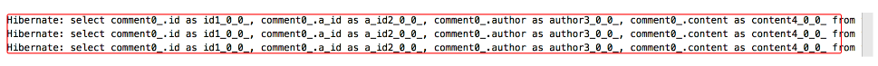

​		上图情况，是因为没有在Spring Boot项目中开启缓存管理。在没有缓存管理的情况下，虽然数据表中的数据没有发生变化，但是每执行一次查询操作（本质是执行同样的SQL语句），都会访问一次数据库并执行一次SQL语句

#### 5.1.2 默认缓存体验

在前面搭建的Web应用基础上，开启Spring Boot默认支持的缓存，体验Spring Boot默认缓存的使用效果

（ 1 ）使用@EnableCaching注解开启基于注解的缓存支持

```java
@EnableCaching // 开启Spring Boot基于注解的缓存管理支持
@SpringBootApplication
public class Springboot04CacheApplication {
    public static void main(String[] args) {
        SpringApplication.run(Springboot04CacheApplication.class, args);
    }
}
```

（ 2 ）使用@Cacheable注解对数据操作方法进行缓存管理。将@Cacheable注解标注在Service类的查询方法上，对查询结果进行缓存

```java
// 根据评论id查询评论信息
@Cacheable(cacheNames = "comment")
public Comment findById(int comment_id){
    Optional<Comment> optional = commentRepository.findCommentById(comment_id);
    if(optional.isPresent()){
        return optional.get();
    }
    return null;
}
```

上述代码中，在CommentService类中的findCommentById(int comment_id)方法上添加了查询缓存注解@Cacheable，该注解的作用是将查询结果Comment存放在Spring Boot默认缓存中名称为comment的名称空间（namespace）中，对应缓存唯一标识

（即缓存数据对应的主键k）默认为方法参数comment_id的值

（ 3 ）测试访问

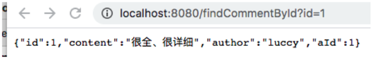


可以看出，再次 执行findCommentById()方法正确查询出用户评论信息Comment，在配置了SpringBoot默认注解后，重复进行同样的查询操作，数据库只执行了一次SQL查询语句，说明项目开启的默认缓存支持已经生效

- 底层结构：在诸多的缓存自动配置类中, SpringBoot默认装配的是SimpleCacheConfiguration,他使用的CacheManager是ConcurrentMapCacheManager, 使用 ConcurrentMap当底层的数据结构,按照Cache的名字查询出Cache, 每一个Cache中存在多个k-v键值对,缓存值

（ 4 ）缓存注解介绍

​		刚刚通过使用@EnableCaching、@Cacheable注解实现了Spring Boot默认的基于注解的缓存管理，除此之外，还有更多的缓存注解及注解属性可以配置优化缓存管理

##### 1 ．@EnableCaching注解

@EnableCaching是由spring框架提供的，springboot框架对该注解进行了继承，该注解需要配置在类上（在中，通常配置在项目启动类上），用于开启基于注解的缓存支持

##### 2 ．@Cacheable注解

@Cacheable注解也是由spring框架提供的，可以作用于类或方法（通常用在数据查询方法上），用于对方法结果进行缓存存储。注解的执行顺序是，先进行缓存查询，如果为空则进行方法查询，并将结果进行缓存；如果缓存中有数据，不进行方法查询，而是直接使用缓存数据

@Cacheable注解提供了多个属性，用于对缓存存储进行相关配置

| 属性名           | 说明                                                      |
| ---------------- | --------------------------------------------------------- |
| value/cacheNames | 指定缓存空间的名称，必配属性。这两个属性二选一使用        |
| key              | 指定缓存数据的key，默认使用方法参数值，可以使用SpEL表达式 |
| keyGenerator     | 指定缓存数据的key的生成器，与key属性二选一使用            |
| cacheManager     | 指定缓存管理器                                            |
| cacheResolver    | 指定缓存解析器，与cacheManager属性二选一使用              |
| condition        | 指定在符合某条件下，进行数据缓存                          |
| unless           | 指定在符合某条件下，不进行数据缓存                        |
| sync             | 指定是否使用异步缓存。默认false                           |

**执行流程&时机**

​		方法运行之前，先去查询Cache（缓存组件），按照cacheNames指定的名字获取，（CacheManager先获取相应的缓存），第一次获取缓存如果没有Cache组件会自动创建；

​		去Cache中查找缓存的内容，使用一个key，默认就是方法的参数，如果多个参数或者没有参数，是按照某种策略生成的，默认是使用KeyGenerator生成的，使用SimpleKeyGenerator生成key，SimpleKeyGenerator生成key的默认策略：

| 参数个数   | key                   |
| ---------- | --------------------- |
| 没有参数   | new SimpleKey()       |
| 有一个参数 | 参数值                |
| 多个参数   | new SimpleKey(params) |


**常用的SPEL表达式**

| 描述                       | 示例                                                  |
| -------------------------- | ----------------------------------------------------- |
| 当前被调用的方法名         | #root.mathodName                                      |
| 当前被调用的方法           | #root.mathod                                          |
| 当前被调用的目标对象       | #root.target                                          |
| 当前被调用的目标对象类     | #root.targetClass                                     |
| 当前被调用的方法的参数列表 | #root.args[0] 第一个参数, #root.args[1] 第二个参数... |
| 根据参数名字取出值         | #参数名, 也可以使用 #p0 #a0 0是参数的下标索引         |
| 当前方法的返回值           | #result                                               |

##### 3 ．@CachePut注解

​		目标方法执行完之后生效, @CachePut被使用于修改操作比较多,哪怕缓存中已经存在目标值了,但是这个注解保证这个方法 **依然会执行** ,执行之后的结果被保存在缓存中

@CachePut注解也提供了多个属性，这些属性与@Cacheable注解的属性完全相同。

​		更新操作,前端会把id+实体传递到后端使用,我们就直接指定方法的返回值从新存进缓存时的key="#id", 如果前端只是给了实体,我们就使用key="#实体.id" 获取key. 同时,他的执行时机是目标方法结束后执行, 所以也可以使用 key="#result.id", 拿出返回值的id

##### 4 ．@CacheEvict注解

​		@CacheEvict注解是由Spring框架提供的，可以作用于类或方法（通常用在数据删除方法上），该注解的作用是删除缓存数据。@CacheEvict注解的默认执行顺序是，先进行方法调用，然后将缓存进行清除。


### 5.2 整合Redis缓存实现

#### 5.2.1 Spring Boot支持的缓存组件

​		在Spring Boot中，数据的缓存管理存储依赖于Spring框架中cache相关的
org.springframework.cache.Cache和org.springframework.cache.CacheManager缓存管理器接口。

​		如果程序中没有定义类型为CacheManager的Bean组件或者是名为cacheResolver的CacheResolver缓存解析器，Spring Boot将尝试选择并启用以下缓存组件（按照指定的顺序）：

（ 1 ）Generic

（ 2 ）JCache (JSR-107) (EhCache 3、Hazelcast、Infinispan等)

（ 3 ）EhCache 2.x

（ 4 ）Hazelcast

（ 5 ）Infinispan

（ 6 ）Couchbase

（ 7 ）Redis

（ 8 ）Caffeine


（ 9 ）Simple

​		上面按照Spring Boot缓存组件的加载顺序，列举了支持的 9 种缓存组件，在项目中添加某个缓存管理组件（例如Redis）后，Spring Boot项目会选择并启用对应的缓存管理器。如果项目中同时添加了多个缓存组件，且没有指定缓存管理器或者缓存解析器（CacheManager或者cacheResolver），那么Spring Boot会按照上述顺序在添加的多个缓存中优先启用指定的缓存组件进行缓存管理。

​		刚刚讲解的Spring Boot默认缓存管理中，没有添加任何缓存管理组件能实现缓存管理。这是因为开启缓存管理后，Spring Boot会按照上述列表顺序查找有效的缓存组件进行缓存管理，如果没有任何缓存组件，会默认使用最后一个Simple缓存组件进行管理。Simple缓存组件是Spring Boot默认的缓存管理组件，它默认使用内存中的ConcurrentMap进行缓存存储，所以在没有添加任何第三方缓存组件的情况下，可以实现内存中的缓存管理，但是我们不推荐使用这种缓存管理方式

#### 5.2.2 基于注解的Redis缓存实现

​		在Spring Boot默认缓存管理的基础上引入Redis缓存组件，使用基于注解的方式讲解SpringBoot整合Redis缓存的具体实现

（ 1 ）添加Spring Data Redis依赖启动器。在pom.xml文件中添加Spring Data Redis依赖启动器

```xml
<dependency>
    <groupId>org.springframework.boot</groupId>
    <artifactId>spring-boot-starter-data-redis</artifactId>
</dependency>
```

​		当我们添加进redis相关的启动器之后, SpringBoot会使用RedisCacheConfigratioin当做生效的自动配置类进行缓存相关的自动装配,容器中使用的缓存管理器是RedisCacheManager, 这个缓存管理器创建的Cache为 RedisCache, 进而操控redis进行数据的缓存

（ 2 ）Redis服务连接配置

```properties
# Redis服务地址
spring.redis.host=127.0.0.1
# Redis服务器连接端口
spring.redis.port= 6379
# Redis服务器连接密码（默认为空）
spring.redis.password=
```

（ 3 ）对CommentService类中的方法进行修改使用@Cacheable、@CachePut、@CacheEvict三个注解定制缓存管理，分别进行缓存存储、缓存更新和缓存删除的演示

```java
@Service
public class CommentService {
    @Autowired
    private CommentRepository commentRepository;
    @Cacheable(cacheNames = "comment",unless = "#result==null")
    public Comment findCommentById(Integer id){
        Optional<Comment> comment = commentRepository.findById(id);
        if(comment.isPresent()){
            Comment comment1 = comment.get();
            return comment1;
        }
        return null;
    }
    @CachePut(cacheNames = "comment",key = "#result.id")
    public Comment updateComment(Comment comment) {
        commentRepository.updateComment(comment.getAuthor(), comment.getaId());
        return comment;
    }
    @CacheEvict(cacheNames = "comment")
    public void deleteComment(int comment_id) {
        commentRepository.deleteById(comment_id);
    }
}
```
​		以上 使用@Cacheable、@CachePut、@CacheEvict注解在数据查询、更新和删除方法上进行了缓存管理。

​		其中，查询缓存@Cacheable注解中没有标记key值，将会使用默认参数值comment_id作为key进行数据保存，在进行缓存更新时必须使用同样的key；同时在查询缓存@Cacheable注解中，定义了“unless = "#result==null"”表示查询结果为空不进行缓存

（ 4 ） 基于注解的Redis查询缓存测试

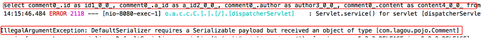

​		可以看出，查询用户评论信息Comment时执行了相应的SQL语句，但是在进行缓存存储时出现了IllegalArgumentException非法参数异常，提示信息要求对应Comment实体类必须实现序列化（“DefaultSerializer requires a Serializable payload but received an object of type”）。

（ 5 ）将缓存对象实现序列化。

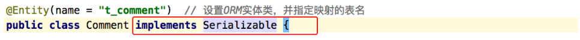

（ 6 ）再次启动测试

​		访问“http://localhost:8080/findCommentById?id=1”查询id为 1 的用户评论信息，并重复刷新浏览器查询同一条数据信息，查询结果

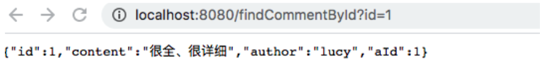

**查看控制台打印的SQL查询语句**

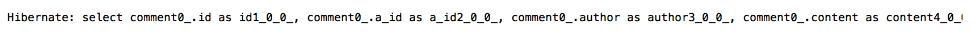

​		还可以打开Redis客户端可视化管理工具Redis Desktop Manager连接本地启用的Redis服务，查看具体的数据缓存效果

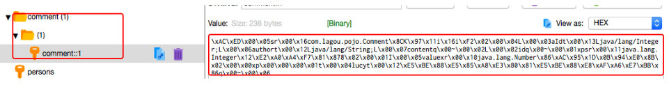

​		执行findById()方法查询出的用户评论信息Comment正确存储到了Redis缓存库中名为comment的名称空间下。其中缓存数据的唯一标识key值是以“名称空间comment::+参数值（comment::1）”的字符串形式体现的，而value值则是经过JDK默认序列格式化后的HEX格式存储。这种JDK默认序列格式化后的数据显然不方便缓存数据的可视化查看和管理，所以在实际开发中，通常会自定义数据的序列化格式


（ 7 ） 基于注解的Redis缓存更新测试。

先通过浏览器访问“http://localhost:8080/update/1/shitou”更新id为 1 的评论作者名为shitou；接着，继续访问“http://localhost:8080/get/1”查询id为 1 的用户评论信息

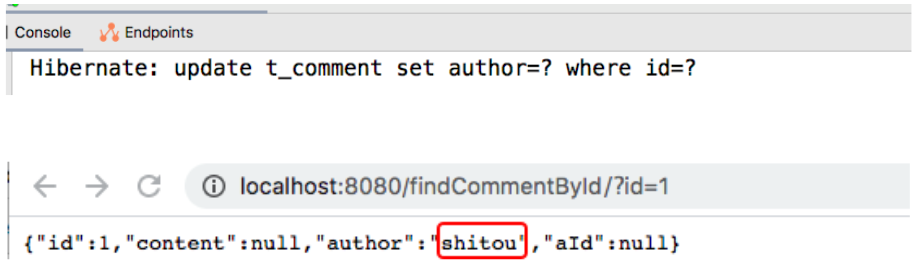


​		可以看出，执行updateComment()方法更新id为 1 的数据时执行了一条更新SQL语句，后续调用findById()方法查询id为 1 的用户评论信息时没有执行查询SQL语句，且浏览器正确返回了更新后的结果，表明@CachePut缓存更新配置成功

（ 8 ）基于注解的Redis缓存删除测试

通过浏览器访问“http://localhost:8080/deleteComment?id=1”删除id为 1 的用户评论信息；

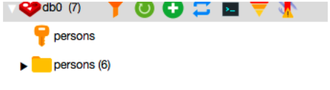

​		执行deleteComment()方法删除id为 1 的数据后查询结果为空，之前存储在Redis数据库的comment相关数据也被删除，表明@CacheEvict缓存删除成功实现

​		通过上面的案例可以看出，使用基于注解的Redis缓存实现只需要添加Redis依赖并使用几个注解可以实现对数据的缓存管理。另外，还可以在Spring Boot全局配置文件中配置Redis有效期，示例代码如下：

```properties
# 对基于注解的Redis缓存数据统一设置有效期为 1 分钟，单位毫秒
spring.cache.redis.time-to-live= 60000
```

​		上述代码中，在Spring Boot全局配置文件中添加了“spring.cache.redis.time-to-live”属性统一配置Redis数据的有效期（单位为毫秒），但这种方式相对来说不够灵活

#### 5.2.3 基于API的Redis缓存实现

​		在Spring Boot整合Redis缓存实现中，除了基于注解形式的Redis缓存实现外，还有一种开发中常用的方式——基于API的Redis缓存实现。这种基于API的Redis缓存实现，需要在某种业务需求下通过Redis提供的API调用相关方法实现数据缓存管理；同时，这种方法还可以手动管理缓存的有效期。

下面，通过Redis API的方式讲解Spring Boot整合Redis缓存的具体实现

（ 1 ）使用Redis API进行业务数据缓存管理。在com.lagou.service包下编写一个进行业务处理的类ApiCommentService

```java
@Service
public class ApiCommentService {
    @Autowired
    private CommentRepository commentRepository;
    
    @Autowired
    private RedisTemplate redisTemplate;
    
    public Comment findCommentById(Integer id){
        Object o = redisTemplate.opsForValue().get("comment_" + id);
        if(o!=null){
            return (Comment) o;
        }else {
            //缓存中没有，从数据库查询
            Optional<Comment> byId = commentRepository.findById(id);
            if(byId.isPresent()){
                Comment comment = byId.get();
                //将查询结果存入到缓存中，并设置有效期为 1 天
                redisTemplate.opsForValue().set("comment_"+id,comment, 1 ,TimeUnit.DAYS);
                return comment;
            }else {
                return null;
            }
        }
    }
    
    public Comment updateComment(Comment comment) {
        commentRepository.updateComment(comment.getAuthor(), comment.getaId());
        //更新数据后进行缓存更新
        redisTemplate.opsForValue().set("comment_"+comment.getId(),comment);
        return comment;
    }
    
    public void deleteComment(int comment_id) {
        commentRepository.deleteById(comment_id);
        redisTemplate.delete("comment_"+comment_id);
    }
```

（ 2 ）编写Web访问层Controller文件

```java
@RestController
@RequestMapping("api") //窄化请求路径
public class ApiCommentController {

    @Autowired
    private ApiCommentService commentService;

    @RequestMapping(value = "/findCommentById")
    public Comment findCommentById(Integer id){
        Comment comment = commentService.findCommentById(id);
        return comment;
    }

    @RequestMapping(value = "/updateComment")
    public void updateComment(Comment comment){
        Comment comment2 = commentService.findCommentById(comment.getId());
        comment.setAuthor(comment.getAuthor());
        commentService.updateComment(comment);
    }

    @RequestMapping(value = "/deleteComment")
    public void deleteComment(int id){
        commentService.deleteComment(id);
    }
}
```
​		基于API的Redis缓存实现的相关配置。基于API的Redis缓存实现不需要@EnableCaching注解开启基于注解的缓存支持，所以这里可以选择将添加在项目启动类上的@EnableCaching进行删除或者注释

### 5.3 自定义Redis缓存序列化机制

​		刚刚完成了Spring Boot整合Redis进行了数据的缓存管理，但缓存管理的实体类数据使用的是JDK序列化方式，不便于使用可视化管理工具进行查看和管理。

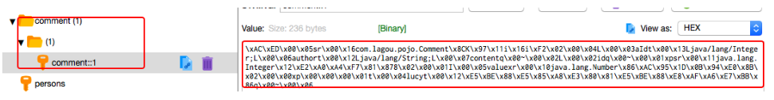

​		接下来分别针对基于注解的Redis缓存实现和基于API的Redis缓存实现中的数据序列化机制进行介绍，并自定义JSON格式的数据序列化方式进行数据缓存管理

#### 5.3.1 自定义RedisTemplate

##### 1 ．Redis API默认序列化机制

基于API的Redis缓存实现是使用RedisTemplate模板进行数据缓存操作的，这里打开
RedisTemplate类，查看该类的源码信息

```java
public class RedisTemplate<K, V> extends RedisAccessor implements RedisOperations<K, V>,
BeanClassLoaderAware {
    // 声明了key、value的各种序列化方式，初始值为空
    @Nullable
    private RedisSerializer keySerializer = null;

    @Nullable
    private RedisSerializer valueSerializer = null;
    @Nullable
    private RedisSerializer hashKeySerializer = null;
    @Nullable
    private RedisSerializer hashValueSerializer = null;
	...
    // 进行默认序列化方式设置，设置为JDK序列化方式
    public void afterPropertiesSet() {
        super.afterPropertiesSet();
        boolean defaultUsed = false;
        if(this.defaultSerializer == null) {
            this.defaultSerializer = new JdkSerializationRedisSerializer(
                this.classLoader != null?
                this.classLoader:this.getClass().getClassLoader());
        }
		...
    }
	...
}
```
​		从上述RedisTemplate核心源码可以看出，在RedisTemplate内部声明了缓存数据key、value的各种序列化方式，且初始值都为空；在afterPropertiesSet()方法中，判断如果默认序列化参数defaultSerializer为空，将数据的默认序列化方式设置为JdkSerializationRedisSerializer

​		**根据上述源码信息的分析，可以得到以下两个重要的结论：**

（ 1 ）使用RedisTemplate进行Redis数据缓存操作时，内部默认使用的是JdkSerializationRedisSerializer序列化方式，所以进行数据缓存的实体类必须实现JDK自带的序列化接口（例如Serializable）；

（ 2 ）使用RedisTemplate进行Redis数据缓存操作时，如果自定义了缓存序列化方式defaultSerializer，那么将使用自定义的序列化方式。

​		另外，在RedisTemplate类源码中，看到的缓存数据key、value的各种序列化类型都是RedisSerializer。进入RedisSerializer源码查看RedisSerializer支持的序列化方式（进入该类后，使用Ctrl+Alt+左键单击类名查看）

​		可以看出，RedisSerializer是一个Redis序列化接口，默认有 6 个实现类，这 6 个实现类代表了 6 种不同的数据序列化方式。其中，JdkSerializationRedisSerializer是JDK自带的，也是RedisTemplate内部默认使用的数据序列化方式，开发者可以根据需要选择其他支持的序列化方式（例如JSON方式）

##### 2 ．自定义RedisTemplate序列化机制

​		在项目中引入Redis依赖后，Spring Boot提供的RedisAutoConfiguration自动配置会生效。打开RedisAutoConfiguration类，查看内部源码中关于RedisTemplate的定义方式

```java
public class RedisAutoConfiguration {
    @Bean
    @ConditionalOnMissingBean(
        name = {"redisTemplate"}
    )
    public RedisTemplate<Object, Object> redisTemplate(
        	RedisConnectionFactory redisConnectionFactory) throws UnknownHostException {
        RedisTemplate<Object, Object> template = new RedisTemplate();
        template.setConnectionFactory(redisConnectionFactory);
        return template;
    }
    ...
}
```

​		从上述RedisAutoConfiguration核心源码中可以看出，在Redis自动配置类中，通过Redis连接工厂RedisConnectionFactory初始化了一个RedisTemplate；该类上方添加了@ConditionalOnMissingBean注解（顾名思义，当某个Bean不存在时生效），用来表明如果开发者自定义了一个名为redisTemplate的Bean，则该默认初始化的RedisTemplate不会生效。

​		如果想要使用自定义序列化方式的RedisTemplate进行数据缓存操作，可以参考上述核心代码创建一个名为redisTemplate的Bean组件，并在该组件中设置对应的序列化方式即可

​		接下来，在项目中创建名为com.lagou.config的包，在该包下创建一个Redis自定义配置类RedisConfig，并按照上述思路自定义名为redisTemplate的Bean组件

```java
@Configuration
public class RedisConfig {
    @Bean
    public RedisTemplate<Object, Object> redisTemplate(RedisConnectionFactory
                                                       redisConnectionFactory) {
        RedisTemplate<Object, Object> template = new RedisTemplate();
        template.setConnectionFactory(redisConnectionFactory);
        // 使用JSON格式序列化对象，对缓存数据key和value进行转换
        Jackson2JsonRedisSerializer jacksonSeial = new
            Jackson2JsonRedisSerializer(Object.class);
        // 解决查询缓存转换异常的问题
        ObjectMapper om = new ObjectMapper();
        om.setVisibility(PropertyAccessor.ALL, JsonAutoDetect.Visibility.ANY);
        om.enableDefaultTyping(ObjectMapper.DefaultTyping.NON_FINAL);
        jacksonSeial.setObjectMapper(om);
        // 设置RedisTemplate模板API的序列化方式为JSON
        template.setDefaultSerializer(jacksonSeial);
        return template;
    }
}
```

​		通过@Configuration注解定义了一个RedisConfig配置类，并使用@Bean注解注入了一个默认名称为方法名的redisTemplate组件（注意，该Bean组件名称必须是redisTemplate）。在定义的Bean组件中，自定义了一个RedisTemplate，使用自定义的Jackson2JsonRedisSerializer数据序列化方式；在定制序列化方式中，定义了一个ObjectMapper用于进行数据转换设置

##### 3 ．效果测试

​		启动项目，项目启动成功后，通过浏览器访问“http://localhost:8080/api/findCommentById?id=3 ”查询id为 3 的用户评论信息，并重复刷新浏览器查看同一条数据信息

查看控制台打印的SQL查询语句


​		可以看出，执行findById()方法正确查询出用户评论信息Comment，重复进行同样的查询操作，数据库只执行了一次SQL语句，这说明定制的Redis缓存生效。

​		使用Redis客户端可视化管理工具Redis Desktop Manager查看缓存数据 ：

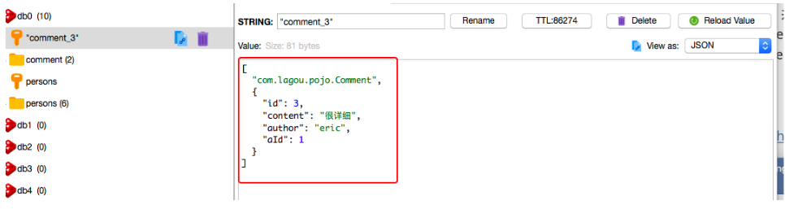

​		执行findById()方法查询出用户评论信息Comment正确存储到了Redis缓存库中，且缓存到Redis服务的数据已经使用了JSON格式存储展示，查看和管理也非常方便，说明自定义的Redis API模板工具RedisTemplate生效

#### 5.3.2 自定义RedisCacheManager

​		刚刚针对基于 API方式的RedisTemplate进行了自定义序列化方式的改进，从而实现了JSON序列化方式缓存数据，但是这种自定义的RedisTemplate对于基于注解的Redis缓存来说，是没有作用的。

接下来，针对基于注解的Redis缓存机制和自定义序列化方式进行讲解

##### 1 ．Redis注解默认序列化机制

​		打开Spring Boot整合Redis组件提供的缓存自动配置类
RedisCacheConfiguration（org.springframework.boot.autoconfigure.cache包下的），查看该类的源码信息，其核心代码如下

```java
@Configuration
class RedisCacheConfiguration {
    @Bean
    public RedisCacheManager cacheManager(RedisConnectionFactory redisConnectionFactory,
                                          ResourceLoader resourceLoader) {
        RedisCacheManagerBuilder builder =
            RedisCacheManager.builder(redisConnectionFactory)
            .cacheDefaults(this.determineConfiguration(resourceLoader.getClassLoader()));
        List<String> cacheNames = this.cacheProperties.getCacheNames();
        if(!cacheNames.isEmpty()) {
            builder.initialCacheNames(new LinkedHashSet(cacheNames));
        }
        return (RedisCacheManager)this.customizerInvoker.customize(builder.build());
    }
    private org.springframework.data.redis.cache.RedisCacheConfiguration
        determineConfiguration(ClassLoader classLoader){
        if(this.redisCacheConfiguration != null) {
            return this.redisCacheConfiguration;
        } else {
            Redis redisProperties = this.cacheProperties.getRedis();
            org.springframework.data.redis.cache.RedisCacheConfiguration config
                =org.springframework.data.redis.cache.RedisCacheConfiguration.defaultCacheConfig();
            config = config.serializeValuesWith(SerializationPair.fromSerializer(
                    new JdkSerializationRedisSerializer(classLoader)));
            ...
                return config;
        }
    }
}
```
​		从上述核心源码中可以看出，同RedisTemplate核心源码类似，RedisCacheConfiguration内部同样通过Redis连接工厂RedisConnectionFactory定义了一个缓存管理器RedisCacheManager；同时定制RedisCacheManager时，也默认使用了JdkSerializationRedisSerializer序列化方式。

​		如果想要使用自定义序列化方式的RedisCacheManager进行数据缓存操作，可以参考上述核心代码创建一个名为cacheManager的Bean组件，并在该组件中设置对应的序列化方式即可

​		**注意**，在Spring Boot 2.X版本中，RedisCacheManager是单独进行构建的。因此，在SpringBoot 2.X版本中，对RedisTemplate进行自定义序列化机制构建后，仍然无法对RedisCacheManager内部默认序列化机制进行覆盖（这也就解释了基 于注解的Redis缓存实现仍然会使用JDK默认序列化机制的原因），想要基于注解的Redis缓存实现也使用自定义序列化机制，需要自定义RedisCacheManager

##### 2 ．自定义RedisCacheManager

​		在项目的Redis配置类RedisConfig中，按照上一步分析的定制方法自定义名为cacheManager的Bean组件

```java
@Bean
public RedisCacheManager cacheManager(RedisConnectionFactory redisConnectionFactory) {
    // 分别创建String和JSON格式序列化对象，对缓存数据key和value进行转换
    RedisSerializer<String> strSerializer = new StringRedisSerializer();
    Jackson2JsonRedisSerializer jacksonSeial =
        new Jackson2JsonRedisSerializer(Object.class);
    // 解决查询缓存转换异常的问题
    ObjectMapper om = new ObjectMapper();
    om.setVisibility(PropertyAccessor.ALL, JsonAutoDetect.Visibility.ANY);
    om.enableDefaultTyping(ObjectMapper.DefaultTyping.NON_FINAL);
    jacksonSeial.setObjectMapper(om);
    // 定制缓存数据序列化方式及时效
    RedisCacheConfiguration config = RedisCacheConfiguration.defaultCacheConfig()
        .entryTtl(Duration.ofDays( 1 ))
        .serializeKeysWith(RedisSerializationContext.SerializationPair.fromSerializer(strSerializer))
        .serializeValuesWith(RedisSerializationContext.SerializationPair.fromSerializer(jacksonSeial))
        .disableCachingNullValues();
    RedisCacheManager cacheManager = RedisCacheManager
        .builder(redisConnectionFactory).cacheDefaults(config).build();
    return cacheManager;
}
```

​		上述代码中，在RedisConfig配置类中使用@Bean注解注入了一个默认名称为方法名的cacheManager组件。在定义的Bean组件中，通过RedisCacheConfiguration对缓存数据的key和value分别进行了序列化方式的定制，其中缓存数据的key定制为StringRedisSerializer（即String格式），而value定制为了Jackson2JsonRedisSerializer（即JSON格式），同时还使用
entryTtl(Duration.ofDays(1))方法将缓存数据有效期设置为 1 天

​		完成基于注解的Redis缓存管理器RedisCacheManager定制后，可以对该缓存管理器的效果进行
测试（使用自定义序列化机制的RedisCacheManager测试时，实体类可以不用实现序列化接口）