[TOC]

# 主要内容

- 第一部分：微服务架构
  - 单体
  - 垂直
  - SOA
  - 微服务
- 第二部分：SpringCloud概述
  - 是什么
  - 解决什么问题
  - 架构及其核心组件（框架）
  - SpringCloud与Dubbo的对比
  - SpringCloud与SpringBoot的对比
- 第三部分：案例准备
- 第四部分：第一代SpringCloud核心组件
- 第五部分：常见问题及解决方案
- 第六部分：SpringCloud高级进阶
  - 监控Hystrix Dashborad/Turbine
  - 分布式链路追踪技术（Sleuth/Zipkin)
  - 统一认证（SpringCloud OAuth2 + Jwt)
- 第七部分：第二代SpringCloud 核心组件（SpringCloud Alibaba）


# 第一部分 微服务架构

## 第1节 互联网应用架构发展（回顾）

随着互联网的发展，用户群体逐渐扩大，网站的流量成倍增⻓，常规的单体架构已无法满足请求压力和业务的快速迭代，架构的变化势在必行。下面我们就以拉勾网的架构演进为例，从最开始的单体架构分析，一步步的到现在的微服务架构。

1）单体应用架构

在诞生之初，拉勾的用户量、数据量规模都比较小，项目所有的功能模块都放在一个工程中编码、编译、打包并且部署在一个Tomcat容器中的架构模式就是单体应用架构，这样的架构既简单实用、便于维护，成本又低，成为了那个时代的主流架构方式。

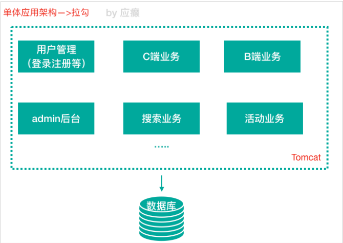

**优点：**

- 项目前期开发节奏快，团队成员少的时候能够快速迭代
- 架构简单：MVC架构，只需要借助IDE开发、调试即可
- 易于测试：只需要通过单元测试或者浏览器完成
- 易于部署：打包成单一可执行的jar或者打成war包放到容器内启动

**缺点：**

- 随着不断的功能迭代，单个项目过大，代码杂乱，耦合严重，开发团队逐渐壮大以后，沟通成本变高，如：代码从编译到启动时达到3-5分钟
- 新增业务困难：在已经乱如麻的系统中增加新业务，维护旧功能，一脚踩进去全是不可预测的问题。新人来了以后很难接手任务，学习成本高，需要大概一周时间才能上手开发
- 核心业务与边缘业务混合在一块，出现问题互相影响，如：一个临时活动流量猛涨，机器负载升高就会影响正常的业务服务

业务量上涨之后，单体应用架构进一步丰富变化，比如应用集群部署、使用Nginx进行负载均衡、增加缓存服务器、增加文件服务器、数据库集群并做读写分离等，通过以上措施增强应对高并发的能力、应对一定的复杂业务场景，但依然属于单体应用架构

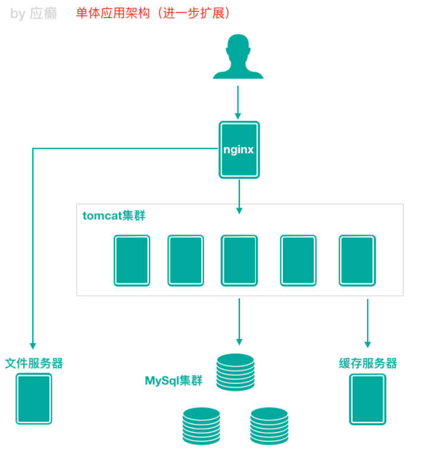

2）垂直应用架构

为了避免上面提到的那些问题，开始做模块的垂直划分，做垂直划分的原则是基于拉勾现有的业务特性来做，核心目标第一个是为了业务之间互不影响，第二个是在研发团队的壮大后为了提高效率，减少之间的依赖。

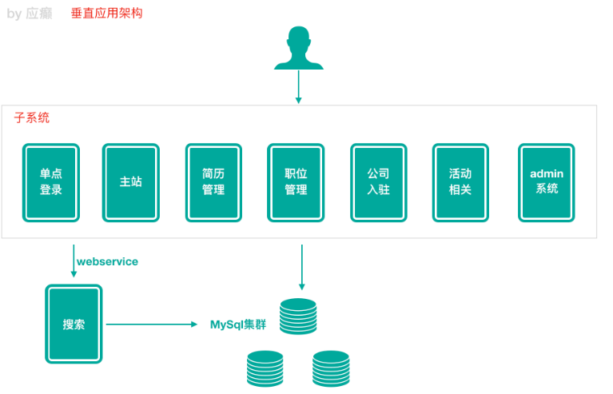

**优点：**

- 系统拆分实现了流量分担，解决了并发问题
- 可以针对不同模块进行优化
- 方便水平扩展，负载均衡，容错率提高
- 系统间相互独立，互不影响，新的业务迭代时更加高效

**缺点：**

- 服务之间相互调用，如果某个服务的端口或者ip地址发生变化，调用的系统得手动改变
- 搭建集群之后，实现负载均衡比较复杂，如：内网负载，在迁移机器时会影响调用方的路由，导致线上故障
- 服务之间调用方式不统一，基于httpclient、webservice，接口协议不统一
- 服务监控不到位：除了依靠端口、进程的监控，调用的成功率、失败率、总耗时等等这些监控指标是没有的

3）SOA应用架构

在做了垂直划分以后，模块随之增多，维护的成本在也变高，一些通用的业务和模块重复的越来越多，为了解决上面提到的接口协议不统一、服务无法监控、服务的负载均衡，引入了阿里巴巴开源的 Dubbo ，一款高性能、轻量级的开源Java RPC框架，它提供了三大核心能力：面向接口的远程方法调用，智能容错和负载均衡，以及服务自动注册和发现。

SOA (Service-Oriented Architecture)，即面向服务的架构。根据实际业务，把系统拆分成合适的、独立部署的模块，模块之间相互独立（通过Webservice/Dubbo等技术进行通信）。

**优点：**分布式、松耦合、扩展灵活、可重用

**缺点：**服务抽取粒度大、服务调用方和提供方耦合度较高（接口耦合度）

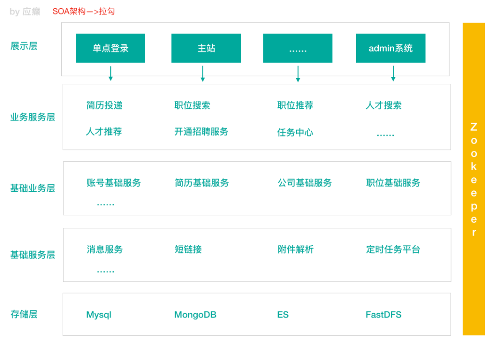

4）微服务应用架构

​		微服务架构可以说是SOA架构的一种扩展，这种架构模式下它**拆分粒度更小**、服务更独立。把应用拆分成为一个个微小的服务，不同的服务可以使用不同的开发语言和存储，服务之间往往通过RESTFul等轻量级通信。微服务架构关键在于**微小、独立、轻量级通信**

微服务是在SOA上做的升华粒度更加细致，微服务架构强调的一个重点是“业务需要彻底的组件化和服务化“

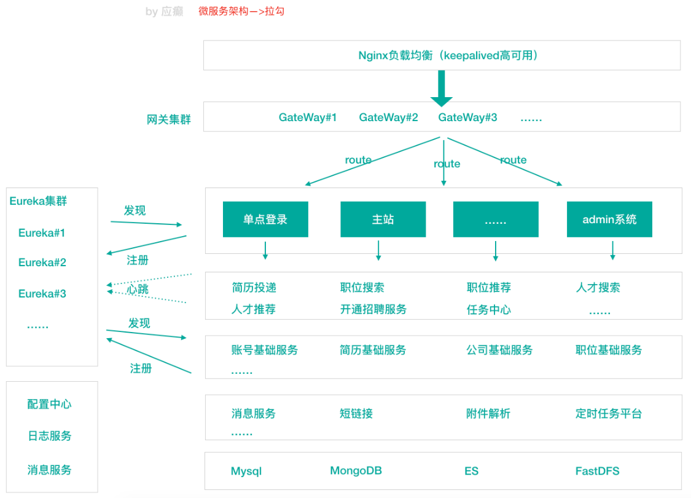

**微服务架构和SOA架构相似又不同**

​		微服务架构和SOA架构很明显的一个区别就是**服务拆分粒度的不同**，但是对于拉勾的架构发展来说，我们所看到的SOA阶段其实服务拆分粒度相对来说已经比较细了（超前哦！），所以上述拉勾SOA到拉勾微服务，从服务拆分上来说变化并不大，只是引入了相对完整的新一代Spring Cloud微服务技术。自然，上述我们看到的都是拉勾架构演变的阶段结果，每一个阶段其实都经历了很多变化，拉勾的服务拆分其实也是走过了从粗到细，并非绝对的一步到位。

​		举个拉勾案例来说明SOA和微服务拆分粒度不同

​		我们在SOA架构的初期，“简历投递模块”和“人才搜索模块”都有简历内容展示的需求，只不过说可能略有区别，一开始在两个模块中各维护了一套简历查询和展示的代码；后期我们将服务更细粒度拆分，拆分出简历基础服务，那么不同模块调用这个基础服务即可。


## 第2节 微服务架构体现的思路及优缺点

微服务架构设计的核心思想就是“微”，拆分的粒度相对比较小，这样的话单一职责、开发的耦合度就会降低、微小的功能可以独立部署扩展、灵活性强，升级改造影响范围小。

单体应用（1.7 -> 1.8）

**微服务架构的优点：**

- 微服务很小，便于特定业务功能的聚焦
- 微服务很小，每个微服务都可以被一个小团队单独实施（开发、测试、部署上线、运维），团队合作一定程度解耦，便于实施敏捷开发
- 微服务很小，便于重用和模块之间的组装
- 微服务很独立，那么不同的微服务可以使用不同的语言开发，松耦合
- 微服务结构下，很容易引入新技术
- 微服务架构下，我们可以更好的实现DevOps开发运维一体化

**微服务架构的缺点：**

- 微服务架构下，分布式复杂难以管理，当服务数量增加，管理将越加复杂；
- 微服务架构下，分布式链路跟踪难等；


## 第3节 微服务架构中的一些概念

- 服务注册与服务发现

  **服务注册：**服务提供者将所提供服务的信息（服务器IP和port、服务访问协议等）

  **服务发现：**服务消费者能够从注册中心获取到较为实时的服务列表，然后根究一定的策选择一个服务访问

  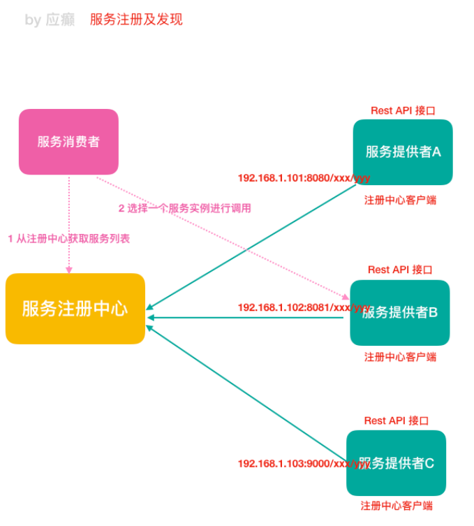

- 负载均衡

  负载均衡即将请求压力分配到多个服务器（应用服务器、数据库服务器等），以此来提高服务的性能、可靠性

  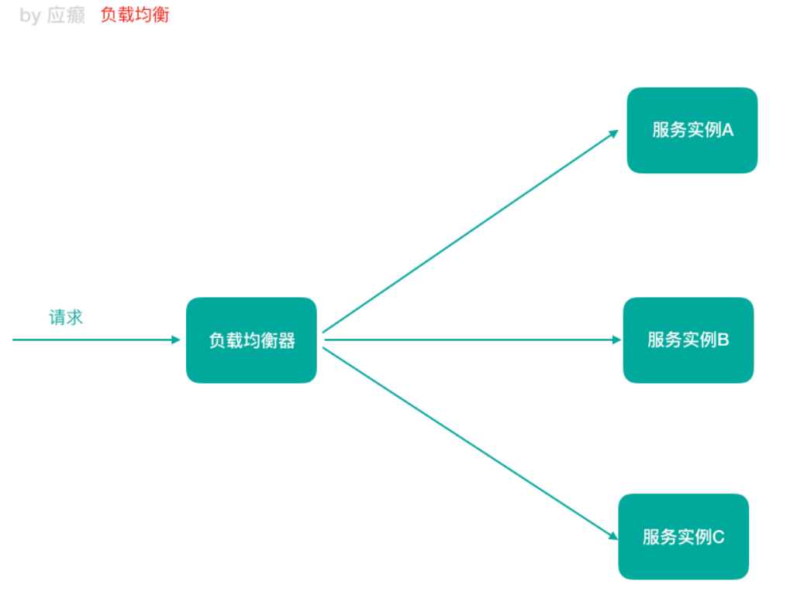

- 熔断

  熔断即短路保护。微服务架构中，如果下游服务因访问压力过大而相应慢或失败，上游服务为了保护系统整体可用性，可以暂时切断对下游服务的调用。这种牺牲局部，保全整体的措施就叫做熔断。

  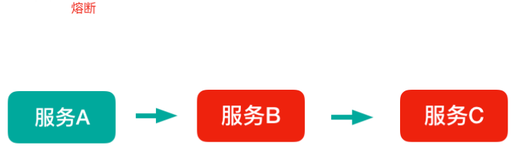

- 链路追踪

  微服务架构越发流行，一个项目往往拆分成很多个服务，那么一次请求就需要涉及到很多个服务。不同的微服务可能是由不同的团队开发、可能使用不同的编程语言实现、整个项目也有可能部署在了很多服务器上（甚至百台、千台）横跨多个不同的数据中心。所谓链路追踪，就是对一次请求涉及的很多个服务链路进行日志记录、性能监控

  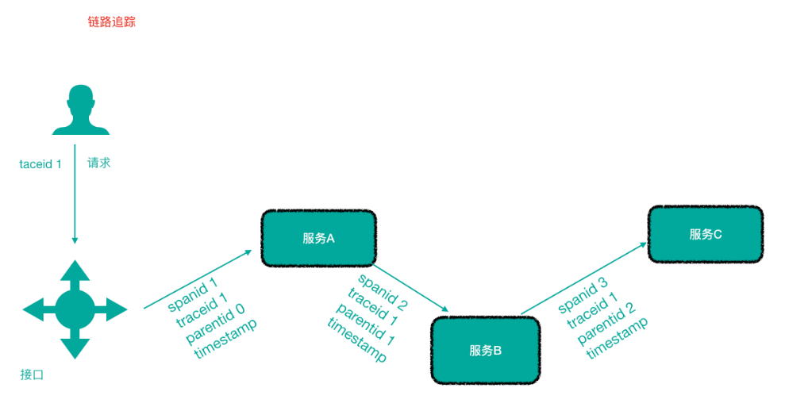

- API网关

  微服务架构下，不同的微服务往往会有不同的访问地址，客户端可能需要调用多个服务的接口才能完成一个业务需求，如果让客户端直接与各个微服务通信可能出现：

  1）客户端需要调用不同的url地址，增加了维护调用难度

  2）在一定的场景下，也存在跨域请求的问题（前后端分离就会碰到跨域问题，原本我们在后端采用Cors就能解决，现在利用网关，那么就放在网关这层做就好了）

  3）每个微服务都需要进行单独的身份验证。那么，API网关就可以较好的统一处理上述问题，API请求调用统一接入API网关层，由网关转发请求。API网关更专注在安全、路由、流量等问题的处理上（微服务团队专注于处理业务逻辑即可），它的功能比如

  - 统一接入（路由）
  - 安全防护（统一鉴权，负责网关访问身份认证验证，与“访问认证中心”通信，实际认证业务逻辑交移“访问认证中心”处理）
  - 黑白名单（实现通过IP地址控制禁止访问网关功能，控制访问）
  - 协议适配（实现通信协议校验、适配转换的功能）
  - 流量控制（限流）
  - 长短链接支持
  - 容错能力（负载均衡）

  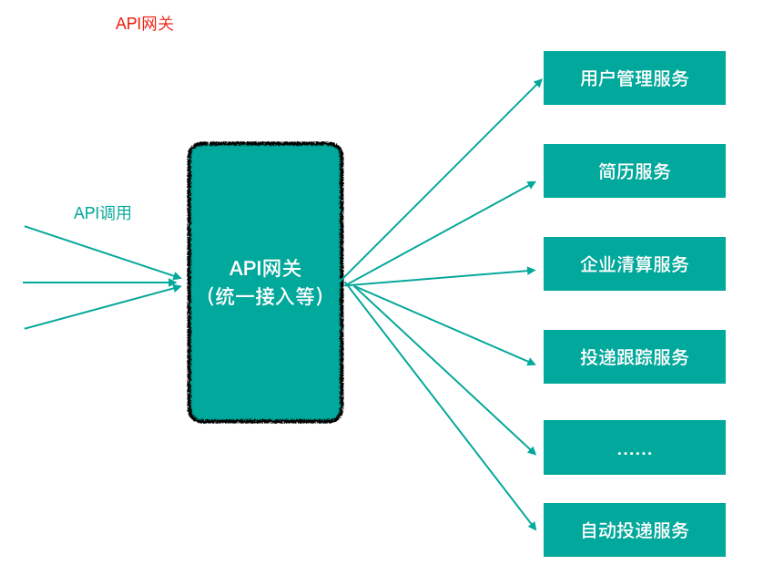

  

# 第二部分 SpringCloud综述

## 第1节 SpringCloud是什么

**[百度百科]**Spring Cloud是一系列框架的有序集合。它利用Spring Boot的开发便利性巧妙地简化了分布式系统基础设施的开发，如服务发现注册、配置中心、消息总线、负载均衡、断路器、数据监控等，都可以用 Spring Boot的开发⻛格做到一键启动和部署。**Spring Cloud并没有重复制造轮子，它只是将目前各家公司开发的比较成熟、经得起实际考验的服务框架组合起来，通过Spring Boot⻛格进行再封装屏蔽掉了复杂的配置和实现原理，最终给开发者留出了一套简单易懂、易部署和易维护的分布式系统开发工具包。**

SpringCloud是一系列框架的有序集合（SpringCloud是一个规范）

开发服务发现注册、配置中心、消息总线、负载均衡、断路器、数据监控等

利用SpringBoot的开发便利性简化了微服务架构的开发（自动装配）

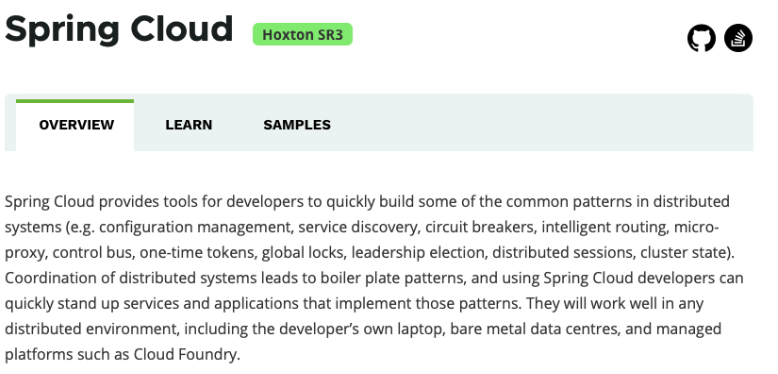

这里，我们需要注意，SpringCloud其实是一套规范，是一套用于构建微服务架构的规范，而不是一个可以拿来即用的框架（所谓规范就是应该有哪些功能组件，然后组件之间怎么配合，共同完成什么事情）。在这个规范之下第三方的Netflix公司开发了一些组件、Spring官方开发了一些框架/组件，包括第三方的阿里巴巴开发了一套框架/组件集合SpringCloud Alibaba，这些才是SpringCloud规范的实现。

Netflix搞了一套 简称SCN

SpringCloud吸收了Netflix公司的产品基础之上自己也搞了几个组件

阿里巴巴在之前的基础上搞出了一堆微服务组件，SpringCloud Alibaba（SCA）

## 第2节 SpringCloud 解决什么问题

Spring Cloud 规范及实现意图要解决的问题其实就是微服务架构实施过程中存在的一些问题，比如微服务架构中的服务注册发现问题、网络问题（比如熔断场景）、统一认证安全授权问题、负载均衡问题、链路追踪等问题。

## 第3节 SpringCloud架构

如前所述，Spring Cloud是一个微服务相关规范，这个规范意图为搭建微服务架构提供一站式服务，**采用组件（框架）化机制**定义一系列组件，各类组件针对性的处理微服务中的特定问题，这些组件共同来构成**Spring Cloud微服务技术栈。**

### 3.1 SpringCloud核心组件

SpringCloud生态圈中的组件，按照发展可以分为第一代SpringCloud组件和第二代SpringCloud组件

|                | 第一代SpringCloud组件                       | 第二代SpringCloud组件                       |
| -------------- | ------------------------------------------- | ------------------------------------------- |
| 注册中心       | Netflix Eureka                              | 阿里巴巴 Nacos                              |
| 客户端负载均衡 | Netflix Ribbon                              | 阿里巴巴 Dubbo LB、SpringCloud Loadbalancer |
| 熔断器         | Netfix Hystrix                              | 阿里巴巴 Sentinel                           |
| 网关           | Netflix Zuul（未来将推出SpringCloud生态圈） | 官方 SpringCloud Gateway                    |
| 配置中心       | 官方 SpringCloud Config                     | 阿里巴巴 Nacos、携程 Apollo                 |
| 服务调用       | Netflix Feign                               | 阿里巴巴 Dubbo RPC                          |
| 消息驱动       | 官方 SpringCloud Stream                     |                                             |
| 链路追踪       | 官方SpringCloud Sleuth/Zipkin               |                                             |
|                |                                             | 阿里巴巴 seata 分布式事务方案               |

### 3.2 Spring Cloud 体系结构（组件协同工作机制）

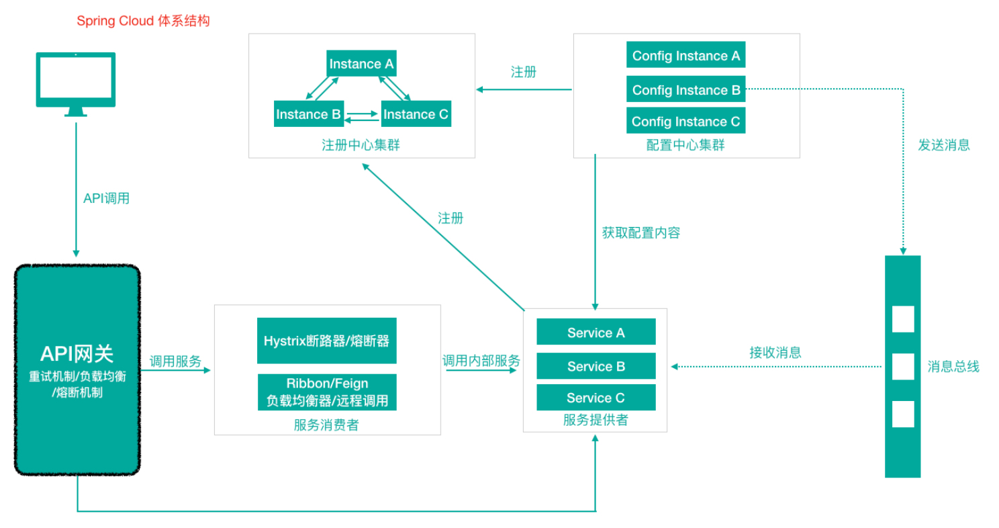

Spring Cloud中的各组件协同工作，才能够支持一个完整的微服务架构。比如

- 注册中心负责服务的注册与发现，很好将各服务连接起来
- API网关负责转发所有外来的请求
- 断路器负责监控服务之间的调用情况，连续多次失败进行熔断保护。
- 配置中心提供了统一的配置信息管理服务,可以实时的通知各个服务获取最新的配置信息

## 第4节 Spring Cloud 与Dubbo 对比

Dubbo是阿里巴巴公司开源的一个高性能优秀的服务框架，基于RPC调用，对于目前使用率较高的Spring Cloud Netflix来说，它是基于HTTP的，所以效率上没有Dubbo高，但问题在于Dubbo体系的组件不全，不能够提供一站式解决方案，比如服务注册与发现需要借助于Zookeeper等实现，而Spring Cloud Netflix则是真正的提供了一站式服务化解决方案，且有Spring大家族背景。

前些年，Dubbo使用率高于SpringCloud，但目前Spring Cloud在服务化/微服务解决方案中已经有了非常好的发展趋势。

## 第5节 Spring Cloud 与 Spring Boot 的关系

Spring Cloud 只是利用了Spring Boot 的特点，让我们能够快速的实现微服务组件开发，否则不使用Spring Boot的话，我们在使用Spring Cloud时，每一个组件的相关Jar包都需要我们自己导入配置以及需要开发人员考虑兼容性等各种情况。所以Spring Boot是我们快速把Spring Cloud微服务技术应用起来的一种方式。


# 第三部分 案例准备

## 第1节 案例说明

本部分我们按照普通方式模拟一个微服务之间的调用（后续我们将一步步使用Spring Cloud的组件对案例进行改造）。

拉勾App里有这样一个功能：“面试直通⻋”，当求职用户开启了面试直通⻋之后，会根据企业客户的招聘岗位需求进行双向匹配。其中有一个操作是：为企业用户开启一个定时任务，根据企业录入的用人条件，每日匹配一定数量的应聘者“投递”到企业的资源池中去，那么系统在将匹配到的应聘者投递到资源池的时候需要先检查：此时应聘者默认简历的状态(公开/隐藏)，如果此时默认简历的状态已经被应聘者设置为“隐藏”，那么不再执行“投递”操作。“自动投递功能”在“自动投递微服务”中，“简历状态查询功能”在“简历微服务”中，那么就涉及到“自动投递微服务”调用“简历微服务”查询简历。在这种场景下，“自动投递微服务”就是一个服务消费者，“简历微服务”就是一个服务提供者。

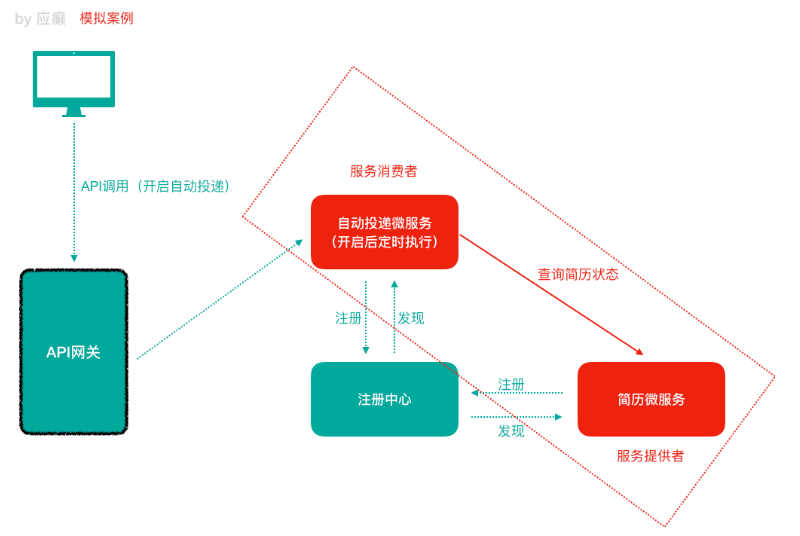

## 第2节 案例数据库环境准备

**简历基本信息表：r_resume**

```sql
/*
Navicat Premium Data Transfer
Source Server : lagou
Source Server Type : MySQL
Source Server Version : 100019
Source Schema : lagou
Target Server Type : MySQL
Target Server Version : 100019
File Encoding : 65001
*/ 
SET NAMES utf8mb4;

SET FOREIGN_KEY_CHECKS = 0;
-- ----------------------------
-- Table structure for r_resume
-- ----------------------------
DROP TABLE
IF
	EXISTS `r_resume`;
CREATE TABLE `r_resume` (
    `id` INT ( 11 ) NOT NULL AUTO_INCREMENT,
    `sex` VARCHAR ( 10 ) DEFAULT NULL COMMENT '性别',
    `birthday` VARCHAR ( 30 ) DEFAULT NULL COMMENT '出⽣⽇期',
    `workYear` VARCHAR ( 100 ) DEFAULT NULL COMMENT '⼯作年限',
    `phone` VARCHAR ( 20 ) DEFAULT NULL COMMENT '⼿机号码',
    `email` VARCHAR ( 100 ) DEFAULT NULL COMMENT '邮箱',
    `status` VARCHAR ( 80 ) DEFAULT NULL COMMENT '⽬前状态',
    `resumeName` VARCHAR ( 500 ) DEFAULT NULL COMMENT '简历名称',
    `name` VARCHAR ( 40 ) DEFAULT NULL,
    `createTime` datetime DEFAULT NULL COMMENT '创建⽇期',
    `headPic` VARCHAR ( 100 ) DEFAULT NULL COMMENT '头像',
    `isDel` INT ( 2 ) DEFAULT NULL COMMENT '是否删除 默认值0-未删除 1-已删除',
    `updateTime` datetime DEFAULT NULL COMMENT '简历更新时间',
    `userId` INT ( 11 ) DEFAULT NULL COMMENT '⽤户ID',
    `isDefault` INT ( 2 ) DEFAULT NULL COMMENT '是否为默认简历 0-⾮默认 1-默 认',
    `highestEducation` VARCHAR ( 20 ) DEFAULT '' COMMENT '最⾼学历',
    `deliverNearByConfirm` INT ( 2 ) DEFAULT '0' COMMENT '投递附件简历确认0-需要确认 1-不需要确认',
    `refuseCount` INT ( 11 ) NOT NULL DEFAULT '0' COMMENT '简历被拒绝次数',
    `markCanInterviewCount` INT ( 11 ) NOT NULL DEFAULT '0' COMMENT '被标记为可⾯试次数',
    `haveNoticeInterCount` INT ( 11 ) NOT NULL DEFAULT '0' COMMENT '已通知⾯试次数',
    `oneWord` VARCHAR ( 100 ) DEFAULT '' COMMENT '⼀句话介绍⾃⼰',
    `liveCity` VARCHAR ( 100 ) DEFAULT '' COMMENT '居住城市',
    `resumeScore` INT ( 3 ) DEFAULT NULL COMMENT '简历得分',
    `userIdentity` INT ( 1 ) DEFAULT '0' COMMENT '⽤户身份1-学⽣ 2-⼯⼈',
    `isOpenResume` INT ( 1 ) DEFAULT '3' COMMENT '⼈才搜索-开放简历 0-关闭，1-打开，2-简历未达到投放标准被动关闭 3-从未设置过开放简历', 
    PRIMARY KEY ( `id` ) 
) ENGINE = INNODB AUTO_INCREMENT = 2195867 DEFAULT CHARSET = utf8;
```


## 第3节 案例功能环境准备

基于SpringBoot来构造工程环境，我们的功能模块关系如下所示：

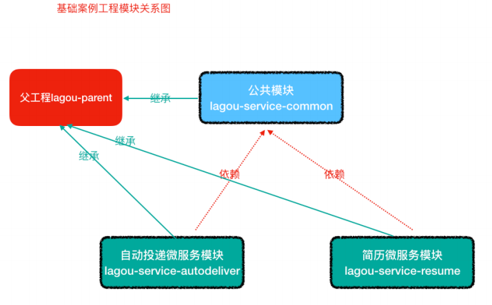

**父工程 lagou-parent**

创建module，命名为lagou-parent

```xml
<?xml version="1.0" encoding="UTF-8"?>
<project xmlns="http://maven.apache.org/POM/4.0.0"
         xmlns:xsi="http://www.w3.org/2001/XMLSchema-instance"
         xsi:schemaLocation="http://maven.apache.org/POM/4.0.0
                             http://maven.apache.org/xsd/maven-4.0.0.xsd">
    <modelVersion>4.0.0</modelVersion>
    <groupId>com.lagou.edu</groupId>
    <artifactId>lagou-parent</artifactId>
    <version>1.0-SNAPSHOT</version>
    <!--⽗⼯程打包⽅式为pom-->
    <packaging>pom</packaging>
    <!--spring boot ⽗启动器依赖-->
    <parent>
        <groupId>org.springframework.boot</groupId>
        <artifactId>spring-boot-starter-parent</artifactId>
        <version>2.1.6.RELEASE</version>
    </parent>
    <dependencies>
        <!--web依赖-->
        <dependency>
            <groupId>org.springframework.boot</groupId>
            <artifactId>spring-boot-starter-web</artifactId>
        </dependency>
        <!--⽇志依赖-->
        <dependency>
            <groupId>org.springframework.boot</groupId>
            <artifactId>spring-boot-starter-logging</artifactId>
        </dependency>
        <!--测试依赖-->
        <dependency>
            <groupId>org.springframework.boot</groupId>
            <artifactId>spring-boot-starter-test</artifactId>
            <scope>test</scope>
        </dependency>
        <!--lombok⼯具-->
        <dependency>
            <groupId>org.projectlombok</groupId>
            <artifactId>lombok</artifactId>
            <version>1.18.4</version>
            <scope>provided</scope>
        </dependency>
        <!-- Actuator可以帮助你监控和管理Spring Boot应⽤-->
        <dependency>
            <groupId>org.springframework.boot</groupId>
            <artifactId>spring-boot-starter-actuator</artifactId>
        </dependency>
        <!--热部署-->
        <dependency>
            <groupId>org.springframework.boot</groupId>
            <artifactId>spring-boot-devtools</artifactId>
            <optional>true</optional>
        </dependency>
    </dependencies>
    <build>
        <plugins>
            <!--编译插件-->
            <plugin>
                <groupId>org.apache.maven.plugins</groupId>
                <artifactId>maven-compiler-plugin</artifactId>
                <configuration>
                    <source>11</source>
                    <target>11</target>
                    <encoding>utf-8</encoding>
                </configuration>
            </plugin>
            <!--打包插件-->
            <plugin>
                <groupId>org.springframework.boot</groupId>
                <artifactId>spring-boot-maven-plugin</artifactId>
            </plugin>
        </plugins>
    </build>
</project>
```


## 第4节 案例核心微服务开发及通信调用

### 4.1 简历微服务

**pom文件导入坐标**

在lagou-service-resume模块的pom.xml中导入如下操作数据库相关坐标（可放到lagou-service-common）

```xml
<!--Spring Data Jpa-->
<dependency>
    <groupId>org.springframework.boot</groupId>
    <artifactId>spring-boot-starter-data-jpa</artifactId>
</dependency>
<dependency>
    <groupId>mysql</groupId>
    <artifactId>mysql-connector-java</artifactId>
    <scope>runtime</scope>
</dependency>
<!--添加对common⼯程的依赖-->
<dependency>
    <groupId>com.lagou.edu</groupId>
    <artifactId>lagou-service-common</artifactId>
    <version>1.0-SNAPSHOT</version>
</dependency>
```

**实体类开发**

实体类统一放到lagou-service-common模块中，包路径为com.lagou.edu.pojo.Resume.java

```java
package com.lagou.edu.pojo;
import lombok.Data;
import javax.persistence.Column;
import javax.persistence.Entity;
import javax.persistence.Id;
import javax.persistence.Table;
@Data
@Entity
@Table(name="r_resume")
public class Resume {
    @Id
    private Long id; // 主键
    private String sex; // 性别
    private String birthday; // ⽣⽇
    private String workYear; // ⼯作年限
    private String phone; // ⼿机号
    private String email; // 邮箱
    private String status; // ⽬前状态
    private String resumeName; // 简历名称
    private String name; // 姓名
    private String createTime; // 创建时间
    private String headPic; // 头像
    private Integer isDel; //是否删除 默认值0-未删除 1-已删除
    private String updateTime; // 简历更新时间
    private Long userId; // ⽤户ID
    private Integer isDefault; // 是否为默认简历 0-默认 1-⾮默认
    private String highestEducation; // 最⾼学历
    private Integer deliverNearByConfirm; // 投递附件简历确认 0-需要确认 1-不需要确认
    private Integer refuseCount; // 简历被拒绝次数
    private Integer markCanInterviewCount; //被标记为可⾯试次数
    private Integer haveNoticeInterCount; //已通知⾯试次数
    private String oneWord; // ⼀句话介绍⾃⼰
    private String liveCity; // 居住城市
    private Integer resumeScore; // 简历得分
    private Integer userIdentity; // ⽤户身份1-学⽣ 2-⼯⼈
    private Integer isOpenResume; // ⼈才搜索-开放简历 0-关闭，1-打开，2-简历未达到投放标准被动关闭 3-从未设置过开放简历
}
```

**Dao层接口**

哪个业务模块的Dao层接口就放置到哪个模块中，此处我们放置在lagou-service-resume中，包路径com.lagou.edu.dao

ResumeDao

```java
package com.lagou.edu.dao;
import com.lagou.edu.pojo.Resume;
import org.springframework.data.jpa.repository.JpaRepository;
public interface ResumeDao extends JpaRepository<Resume,Long> {
}
```

**Service层接口和实现类**

```java
package com.lagou.edu.service;
import com.lagou.edu.pojo.Resume;
public interface ResumeService {
    Resume findDefaultResumeByUserId(Long userId);
}
```

```java
package com.lagou.edu.service.impl;
import com.lagou.edu.dao.ResumeDao;
import com.lagou.edu.pojo.Resume;
import com.lagou.edu.service.ResumeService;
import org.springframework.beans.factory.annotation.Autowired;
import org.springframework.data.domain.Example;
import org.springframework.stereotype.Service;
@Service
public class ResumeServiceImpl implements ResumeService {
    @Autowired
    private ResumeDao resumeDao;
    @Override
    public Resume findDefaultResumeByUserId(Long userId) {
        Resume resume = new Resume();
        resume.setUserId(userId);
        // 查询默认简历
        resume.setIsDefault(1);
        Example<Resume> example = Example.of(resume);
        return resumeDao.findOne(example).get();
    }
}
```

**Controller控制层**

```java
package com.lagou.edu.controller;
import com.lagou.edu.service.ResumeService;
import org.springframework.beans.factory.annotation.Autowired;
import org.springframework.beans.factory.annotation.Value;
import org.springframework.web.bind.annotation.GetMapping;
import org.springframework.web.bind.annotation.PathVariable;
import org.springframework.web.bind.annotation.RequestMapping;
import org.springframework.web.bind.annotation.RestController;
@RestController
@RequestMapping("/resume")
public class ResumeController {
    @Autowired
    private ResumeService resumeService;
    //"/resume/openstate/1545132"
    @GetMapping("/openstate/{userId}")
    public Integer findDefaultResumeState(@PathVariable Long userId) {
        return resumeService.findDefaultResumeByUserId(userId).getIsOpenResume();
        return port;  
    }
}
```

**SpringBoot 启动类**

```java
package com.lagou.edu;
import org.springframework.boot.SpringApplication;
import org.springframework.boot.autoconfigure.SpringBootApplication;
import org.springframework.boot.autoconfigure.domain.EntityScan;
import org.springframework.cloud.client.discovery.EnableDiscoveryClient;
import org.springframework.context.annotation.Bean;
import org.springframework.context.support.PropertySourcesPlaceholderConfigurer;
@SpringBootApplication
@EntityScan("com.lagou.edu.pojo")
public class LagouResumeApplication8080 {
    public static void main(String[] args) {
        SpringApplication.run(LagouResumeApplication8080.class,args);
    }
}
```

**yml配置文件**

```yaml
server:
	port: 8080 # 后期该微服务多实例，端⼝从8080递增（10个以内）
Spring:
	application:
		name: lagou-service-resume
	datasource:
		driver-class-name: com.mysql.jdbc.Driver
		url: jdbc:mysql://localhost:3306/lagou?useUnicode=true&characterEncoding=utf8
		username: root
		password: 123456
	jpa:
		database: MySQL
		show-sql: true
		hibernate:
			naming:
				physical-strategy:org.hibernate.boot.model.naming.PhysicalNamingStrategyStandardImpl
#避免将驼峰命名转换为下划线命名
```

### 4.2 自动投递服务

**application.yml**

```yaml
server:
 port: 8090 # 后期该微服务多实例，端⼝从8090递增（10个以内）
```

**Controller层**

```java
package com.lagou.edu.controller;
import org.springframework.beans.factory.annotation.Autowired;
import org.springframework.web.bind.annotation.GetMapping;
import org.springframework.web.bind.annotation.PathVariable;
import org.springframework.web.bind.annotation.RequestMapping;
import org.springframework.web.bind.annotation.RestController;
import org.springframework.web.client.RestTemplate;
@RestController
@RequestMapping("/autodeliver")
public class AutodeliverController {
    @Autowired
    private RestTemplate restTemplate;
    @GetMapping("/checkState/{userId}")
    public Integer findResumeOpenState(@PathVariable Long userId) {
        Integer forObject = restTemplate.getForObject("http://localhost:8080/resume/openstate/"+ userId, Integer.class);
        System.out.println("======>>>调⽤简历微服务，获取到⽤户" + userId + "的默认简历当前状态为：" + forObject);
        return forObject;
    }
}
```

**SpringBoot启动类**

```java
package com.lagou.edu;
import org.springframework.boot.SpringApplication;
import org.springframework.boot.autoconfigure.SpringBootApplication;
import org.springframework.boot.autoconfigure.domain.EntityScan;
import org.springframework.context.annotation.Bean;
import org.springframework.web.client.RestTemplate;
@SpringBootApplication
public class AutodeliverApplication {
    public static void main(String[] args) {
        SpringApplication.run(AutodeliverApplication.class, args);
    }
    /**
     * 注⼊RestTemplate
     * @return
     */
    @Bean
    public RestTemplate getRestTemplate() {
        return new RestTemplate();
    }
}
```


## 第5节 案例代码问题分析

我们在自动投递微服务中使用RestTemplate调用简历微服务的简历状态接口时（RESTFul API接口）。在微服务**分布式集群环境**下会存在什么问题呢？怎么解决？

**存在的问题：**

- 在服务消费者中，我们把url地址硬编码到代码中，不方便后期维护
- 服务提供者只有一个服务，几遍服务提供者形成集群，服务提供者还需要自己实现负载均衡
- 在服务消费者中，不清楚服务提供者的状态
- 服务消费者调用服务提供者的时候，如果出现故障能否及时发现不向用户抛出异常页面？
- RestTemplate这种请求调用方式是否还有优化空间？能不能类似于Dubbo那样？
- 这么多的微服务统一认证如何实现？
- 配置文件每次都修改好多个很麻烦！？
- ……

上述分析出的问题，其实就是微服务架构中必然面临的一些问题：

- 服务管理：自动注册与发现、状态监管
- 服务负载均衡
- 熔断
- 远程过程调用
- 网关拦截、路由转发
- 统一认证
- 集中式配置管理，配置信息实时自动更新

这些问题，Spring Cloud 体系都有解决方案，后续我们会逐个学习。


# 第四部分 第一代SpringCloud核心组件

说明：上面提到网关组件Zuul性能一般，未来将退出Spring Cloud 生态圈，所以我们直接讲解GateWay，在课程章节规划时，我们就把GateWay划分到第一代SpringCloud 核心组件这一部分了

各组件整体结构如下：

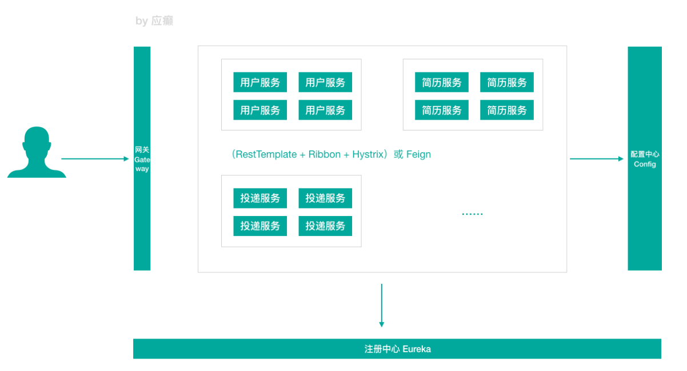

从形式上来说，Feign一个顶三，Feign = RestTemplate + Ribbon + Hystrix

## 第1节 Eureka 服务注册中心

### 1.1 关于服务注册中心

**注意：服务注册中心本质上是为了解耦服务提供者和服务消费者。**

对于任何一个微服务，原则上都应存在或者支持多个提供者（比如简历微服务部署多个实例），这是由微服务的**分布式属性**决定的。

更进一步，为了支持弹性扩缩容特性，一个微服务的提供者的数量和分布往往是动态变化的，也是无法预先确定的。因此，原本在单体应用阶段常用的静态LB机制就不再适用了，需要引入额外的组件来管理微服务提供者的注册与发现，而这个组件就是服务注册中心。

#### 1.1.1 服务注册中心一般原理

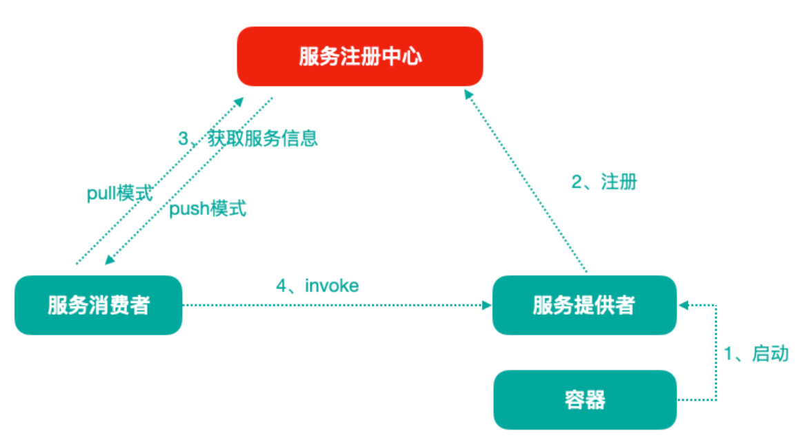

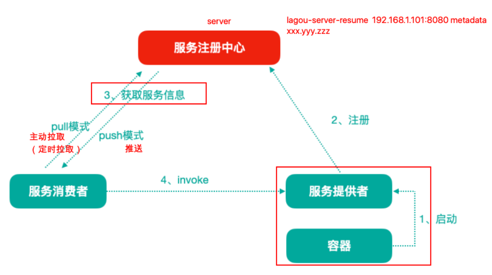

分布式微服务架构中，服务注册中心用于存储服务提供者地址信息、服务发布相关的属性信息，消费者通过主动查询和被动通知的方式获取服务提供者的地址信息，而不再需要通过硬编码方式得到提供者的地址信息。消费者只需要知道当前系统发布了那些服务，而不需要知道服务具体存在于什么位置，这就是透明化路由。

1）服务提供者启动

2）服务提供者将相关服务信息主动注册到注册中心

3）服务消费者获取服务注册信息：

- pull模式：服务消费者可以主动拉取可用的服务提供者清单
- push模式：服务消费者订阅服务（当服务提供者有变化时，注册中心也会主动推送更新后的服务清单给消费者

4）服务消费者直接调用服务提供者

另外，注册中心也需要完成服务提供者的健康监控，当发现服务提供者失效时需要及时剔除；

#### 1.1.2 主流服务中心对比

- Zookeeper

  Zookeeper它是一个分布式服务框架，是Apache Hadoop 的一个子项目，它主要是用来解决分布式应用中经常遇到的一些数据管理问题，如：统一命名服务、状态同步服务、集群管理、分布式应用配置项的管理等。

  简单来说zookeeper本质=存储+监听通知。

  znode

  Zookeeper 用来做服务注册中心，主要是因为它具有节点变更通知功能，只要客户端监听相关服务节点，服务节点的所有变更，都能及时的通知到监听客户端，这样作为调用方只要使用 Zookeeper 的客户端就能实现服务节点的订阅和变更通知功能了，非常方便。另外，Zookeeper 可用性也可以，因为只要半数以上的选举节点存活，整个集群就是可用的。

- Eureka

  由Netflix开源，并被Pivatal集成到SpringCloud体系中，它是基于 RestfulAPI⻛格开发的服务注册与发现组件。

- Consul

  Consul是由HashiCorp基于Go语言开发的支持多数据中心分布式高可用的服务发布和注册服务软件，采用Raft算法保证服务的一致性，且支持健康检查。

- Nacos

  Nacos是一个更易于构建云原生应用的动态服务发现、配置管理和服务管理平台。简单来说 Nacos 就是注册中心 + 配置中心的组合，帮助我们解决微服务开发必会涉及到的服务注册与发现，服务配置，服务管理等问题。Nacos 是Spring Cloud Alibaba 核心组件之一，负责服务注册与发现，还有配置。

| 组件名    | 语言 | CAP                          | 对外暴露接口 |
| --------- | ---- | ---------------------------- | ------------ |
| Eureka    | Java | AP（自我保护机制，保证可用） | HTTP         |
| Consul    | GO   | CP                           | HTTP/DNS     |
| Zookeeper | Java | CP                           | 客户端       |
| Nacos     | Java | 支持AP/CP切换                | HTTP         |

==P：分区容错性（一定要满足的 ）==

C：数据一致性

A：高可用

CAP不可能同时满足三个，要么是AP，要么是CP

### 1.2 服务注册中心组件 Eureka

服务注册中心的一般原理、对比了主流的服务注册中心方案

**Eureka 基础架构**

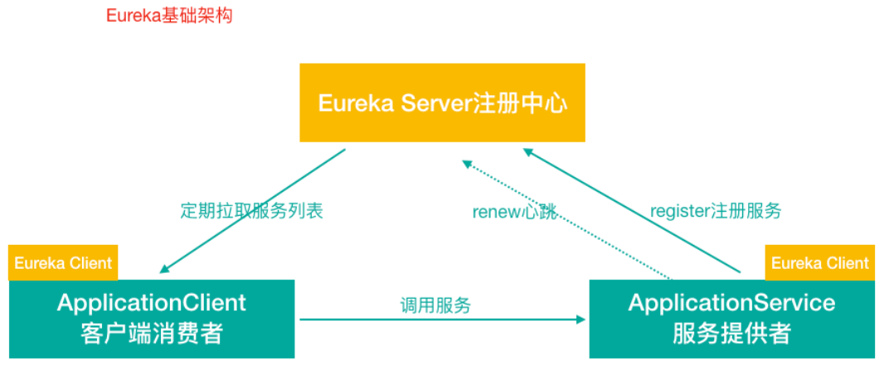


**Eureka 交互流程及原理**

下图是官网描述的一个架构图：

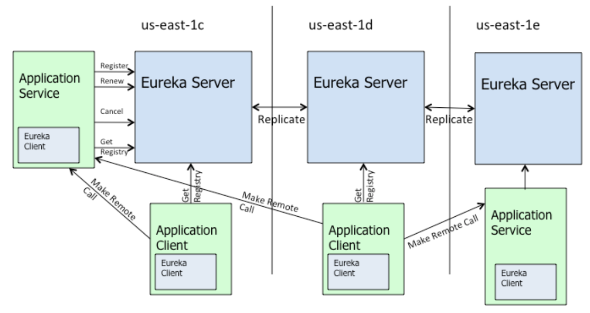

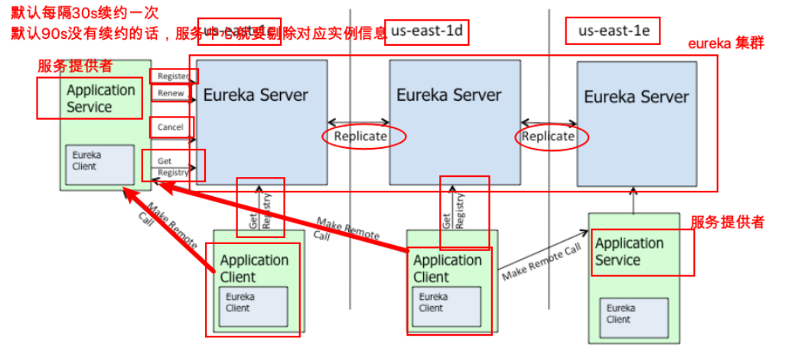

Eureka 包含两个组件：Eureka Server 和 Eureka Client，Eureka Client是一个Java客户端，用于简化与Eureka Server的交互；Eureka Server提供服务发现的能力，各个微服务启动时，会通过Eureka Client向Eureka Server 进行注册自己的信息（例如网络信息），Eureka Server会存储该服务的信息；

1. 图中us-east-1c、us-east-1d，us-east-1e代表不同的区也就是不同的机房
2. 图中每一个Eureka Server都是一个集群。
3. 图中Application Service作为服务提供者向Eureka Server中注册服务，Eureka Server接受到注册事件会在集群和分区中进行数据同步，ApplicationClient作为消费端（服务消费者）可以从Eureka Server中获取到服务注册信息，进行服务调用。
4. 微服务启动后，会周期性地向Eureka Server发送心跳（默认周期为30秒）以续约自己的信息
5. Eureka Server在一定时间内没有接收到某个微服务节点的心跳，EurekaServer将会注销该微服务节点（默认90秒）
6. 每个Eureka Server同时也是Eureka Client，多个Eureka Server之间通过复制的方式完成服务注册列表的同步
7. Eureka Client会缓存Eureka Server中的信息。即使所有的Eureka Server节点都宕掉，服务消费者依然可以使用缓存中的信息找到服务提供者

**Eureka通过心跳检测、健康检查和客户端缓存等机制，提高系统的灵活性、可伸缩性和可用性。**

### 1.3 Eureka应用及高可用集群

1. 单实例Eureka Server—>访问管理界面—>Eureka Server集群
2. 服务提供者（简历微服务注册到集群）
3. 服务消费者（自动投递微服务注册到集群/从Eureka Server集群获取服务信息）
4. 完成调用

#### 1.3.1 搭建单例Eureka Server服务注册中心

lagou-service-resume 8080-----

lagou-service-autodeliver 8090----

lagou-cloud-eureka-server 8761----

基于Maven构建SpringBoot工程，在SpringBoot工程之上搭建EurekaServer服务（lagou-cloud-eureka-server-8761)

- lagou-parent中引入Spring Cloud 依赖

  Spring Cloud 是一个综合的项目，下面有很多子项目，比如eureka子项目（版本号 1.x.x）

  ```xml
  <dependencyManagement>
      <dependencies>
          <dependency>
              <groupId>org.springframework.cloud</groupId>
              <artifactId>spring-cloud-dependencies</artifactId>
              <version>Greenwich.RELEASE</version>
              <type>pom</type>
              <scope>import</scope>
          </dependency>
      </dependencies>
  </dependencyManagement>
  ```

- 当前工程pom.xml中引入依赖

  ```xml
  <dependencies>
      <!--Eureka server依赖-->
      <dependency>
          <groupId>org.springframework.cloud</groupId>
          <artifactId>spring-cloud-starter-netflix-eurekaserver</artifactId>
      </dependency>
  </dependencies>
  ```

  **注意：在父工程的pom文件中手动引入jaxb的jar，因为Jdk9之后默认没有加载该模块，EurekaServer使用到，所以需要手动导入，否则EurekaServer服务无法启动**

- 父工程pom.xml

  ```xml
  <!--引⼊Jaxb，开始-->
  <dependency>
      <groupId>com.sun.xml.bind</groupId>
      <artifactId>jaxb-core</artifactId>
      <version>2.2.11</version>
  </dependency> <dependency>
      <groupId>javax.xml.bind</groupId>
      <artifactId>jaxb-api</artifactId>
  </dependency> <dependency>
      <groupId>com.sun.xml.bind</groupId>
      <artifactId>jaxb-impl</artifactId>
      <version>2.2.11</version>
  </dependency> <dependency>
      <groupId>org.glassfish.jaxb</groupId>
      <artifactId>jaxb-runtime</artifactId>
      <version>2.2.10-b140310.1920</version>
  </dependency> <dependency>
      <groupId>javax.activation</groupId>
      <artifactId>activation</artifactId>
      <version>1.1.1</version>
  </dependency>
  <!--引⼊Jaxb，结束-->
  ```

- application.yml

  ```yaml
  #Eureka server服务端⼝
  server:
   port: 8761
  spring:
   application:
   name: lagou-cloud-eureka-server # 应⽤名称，会在Eureka中作为服务的id标识（serviceId）
  eureka:
   instance:
   hostname: localhost
   client:
   service-url: # 客户端与EurekaServer交互的地址，如果是集群，也需要写其它Server的地址
   defaultZone: http://${eureka.instance.hostname}:${server.port}/eureka/
   register-with-eureka: false # ⾃⼰就是服务不需要注册⾃⼰
   fetch-registry: false #⾃⼰就是服务不需要从Eureka Server获取服务信息,默认为true，置为false
  ```

- SpringBoot启动类，使用@EnableEurekaServer声明当前的项目为EurekaServer服务

  ```java
  package com.lagou.edu;
  import org.springframework.boot.SpringApplication;
  importorg.springframework.boot.autoconfigure.SpringBootApplication;
  importorg.springframework.cloud.netflix.eureka.server.EnableEurekaServer;
  @SpringBootApplication
  // 声明本项⽬是⼀个Eureka服务
  @EnableEurekaServer
  public class LagouCloudEurekaServerApplication {
      public static void main(String[] args) {
          SpringApplication.run(LagouCloudEurekaServerApplication.class,args);
      }
  }
  ```

- 执行启动类LagouCloudEurekaServerApplication的main函数

- 访问http://127.0.0.1:8761 , 如果看到如下页面（Eureka注册中心后台），则表名EurekaServer发布成功

  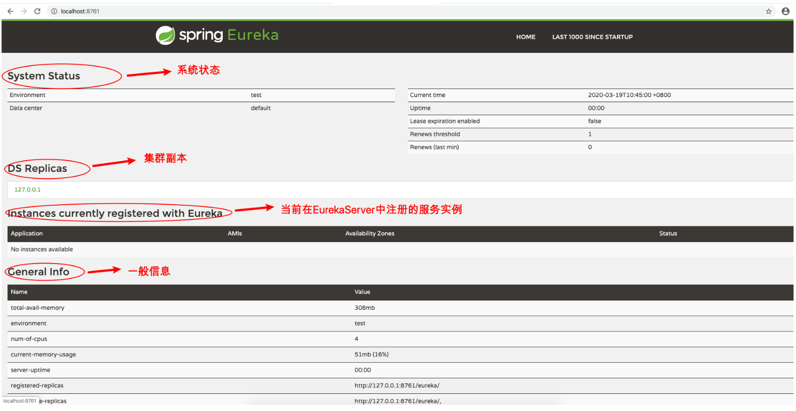

  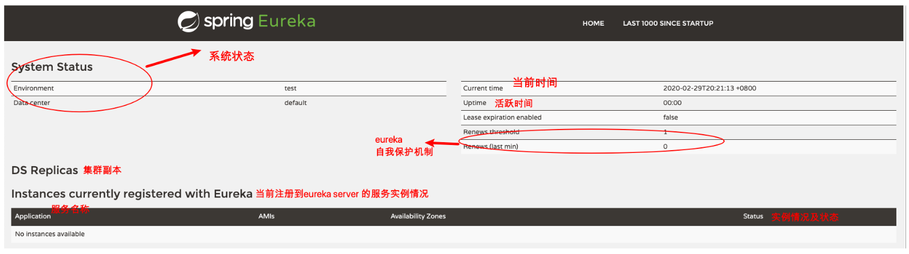

  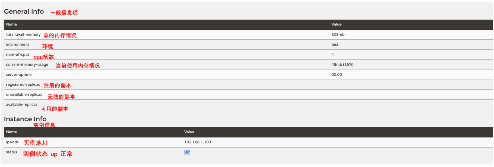


#### 1.3.2 搭建Eureka Server HA 高可用集群

在互联网应用中，服务实例很少有单个的。

即使微服务消费者会缓存服务列表，但是如果EurekaServer只有一个实例，该实例挂掉，正好微服务消费者本地缓存列表中的服务实例也不可用，那么这个时候整个系统都受影响。

在生产环境中，我们会配置Eureka Server集群实现高可用。Eureka Server集群之中的节点通过点对点（P2P）通信的方式共享服务注册表。我们开启两台 EurekaServer 以搭建集群。

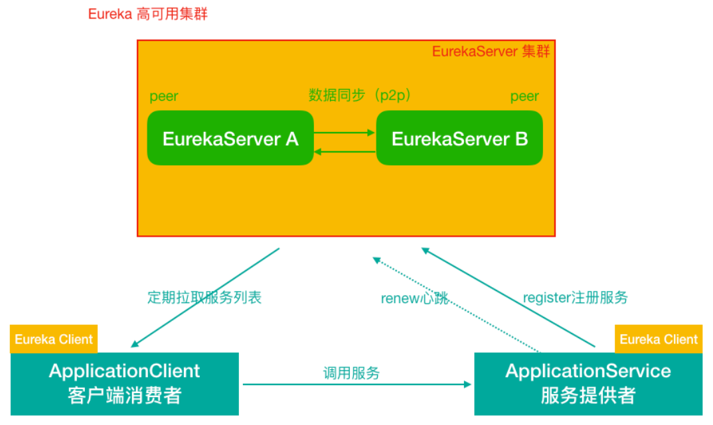

**1）修改本机Host属性**

由于是在个人计算机中进行测试很难模拟多主机的情况，Eureka配置server集群时需要执行host地址。所以需要修改个人电脑中host地址

```
127.0.0.1 LagouCloudEurekaServerA
127.0.0.1 LagouCloudEurekaServerB
```

**2）修改lagou-cloud-eureka-server 工程中的yml配置文件**

```yaml
#指定应⽤名称
spring:
 application:
 name: lagou-cloud-eureka-server
 
---
#第⼀个profile,后期启动spring-boot项⽬时，可通过命令参数指定
spring:
 profiles: LagouCloudEurekaServerA
server:
 port: 8761
eureka:
 instance:
 hostname: LagouCloudEurekaServerA
 client:
 register-with-eureka: true
 fetch-registry: true
 serviceUrl:
 defaultZone: http://LagouCloudEurekaServerB:8762/eureka
 
---
#第⼆个profile,后期启动spring-boot项⽬时，可通过命令参数指定
spring:
 profiles: LagouCloudEurekaServerB
server:
 port: 8762
eureka:
 instance:
 hostname: LagouCloudEurekaServerB
 client:
 register-with-eureka: true
 fetch-registry: true
 serviceUrl:
 defaultZone: http://LagouCloudEurekaServerA:8761/eureka
```

**说明：**

- 在 一个实例中，把另外的实例作为了集群中的镜像节点，那么这个`http://LagouCloudEurekaServer:8762/eureka`URL中的LagouCloudEurekaServerB就要和其它profile中的`eureka.instance.hostname`保持一致
- `register-with-eureka`和`fetch-registry`在单节点时设置了false，因为只有一台Eureka Server，并不需要自己注册自己，而现在有了集群，可以在集群的其他节点中注册本服务

**3）启动两次该SpringBoot项目，分别使用两个不同的profiles**

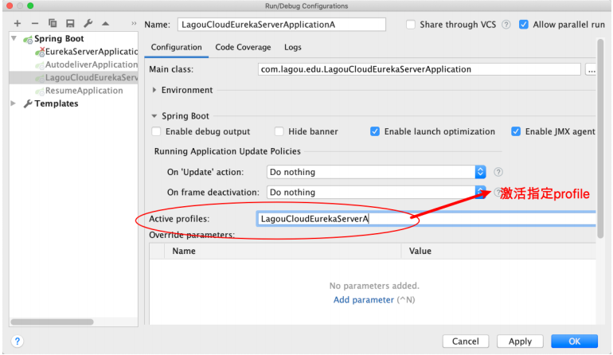

**4) 访问两个EurekaServer的管理页面**

`http://lagouCloudEurekaServer:8761`和`http://lagouCloudEurekaServer:8762`会发现注册中心LAGOU-CLOUD-EUREKA-SERVER已经有两个节点，并且registered-replicas（相邻集群复制节点）中已经包含对方


除了上述在同一个工程基础上启动两次外，我们也可以配置两个工程


#### 1.3.3 微服务提供者—> 注册到Eureka Server 集群

**注册简历微服务**

> 简历服务部署两个实例，分别占用8080、8081端口）

- 父工程中引入spring-cloud-commons依赖

  ```xml
  <dependency>
      <groupId>org.springframework.cloud</groupId>
      <artifactId>spring-cloud-commons</artifactId>
  </dependency>
  ```

  

- pom文件引入坐标，添加eureka client的相关坐标

  ```xml
  <dependency>
      <groupId>org.springframework.cloud</groupId>
      <artifactId>spring-cloud-starter-netflix-eurekaclient</artifactId>
  </dependency>
  ```

- 配置application.yml文件

  > 在application.yml中添加Eureka Server高可用集群的地址及相关配置

  ```yaml
  eureka:
   client:
   serviceUrl: # eureka server的路径
   defaultZone:http://lagoucloudeurekaservera:8761/eureka/,http://lagoucloudeur
  ekaserverb:8762/eureka/ #把 eureka 集群中的所有 url 都填写了进来，也可以只写⼀台，因为各个 eureka server 可以同步注册表
   instance:
   #使⽤ip注册，否则会使⽤主机名注册了（此处考虑到对⽼版本的兼容，新版本经过实验都是ip）
   prefer-ip-address: true
   #⾃定义实例显示格式，加上版本号，便于多版本管理，注意是ip-address，早期版本是ipAddress
   instance-id: ${spring.cloud.client.ipaddress}:${spring.application.name}:${server.port}:@project.version@
  ```

  **经验：自定义实例显示格式，加上版本号，便于多版本管理**

- 启动类添加注解

  

  **注意：**

  - 从SpringCloud Edgware版本开始，@EnableDiscoveryClient 或 @EnableEurekaClient可省略。只需加上相关依赖，并进行相应配置，即可将微服务注册到服务发现组件上。
  - @EnableDiscoveryClient和@EnableEurekaClient二者的功能是一样的。但是如果选用的是Eureka服务器，那么就推荐@EnableEurekaClient，如果是其他的注册中心，那么推荐使用@EnableDiscoveryClient，考虑到通用性，后期使用@EnableDiscoveryClient

- 启动类执行，在Eureka Server后台界面可以看到注册的服务实例

  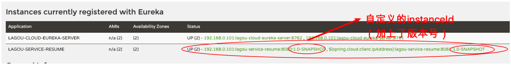

  说明：其他微服务注册课参考执行

  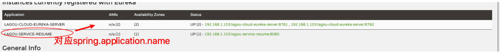

  instance-id添加上版本号的效果

  

#### 1.3.4 微服务消费者 —> 注册到Eureka Server

> 此处自动注册微服务是消费者

- pom文件引入坐标，添加eureka client的相关坐标

  ```xml
  <dependency>
      <groupId>org.springframework.cloud</groupId>
      <artifactId>spring-cloud-commons</artifactId>
  </dependency> <dependency>
      <groupId>org.springframework.cloud</groupId>
      <artifactId>spring-cloud-starter-netflix-eureka-client</artifactId>
  </dependency>
  ```

- 配置application.yml文件

  ```yaml
  server:
   port: 8090
  eureka:
   client:
   serviceUrl: # eureka server的路径
   defaultZone:http://lagoucloudeurekaservera:8761/eureka/,http://lagoucloudeur
  ekaserverb:8762/eureka/ #把 eureka 集群中的所有 url 都填写了进来，也可以只写⼀台，因为各个 eureka server 可以同步注册表
   instance:
   #使⽤ip注册，否则会使⽤主机名注册了（此处考虑到对⽼版本的兼容，新版本经过实验都是ip）
   prefer-ip-address: true
   #⾃定义实例显示格式，加上版本号，便于多版本管理，注意是ip-address，早期版本是ipAddress
   instance-id: ${spring.cloud.client.ip-address}:${spring.application.name}:${server.port}:@project.version@
  spring:
   application:
   name: lagou-service-autodeliver
  ```

- 在启动类添加注解@EnableDiscoveryClient，开启服务发现

  ```java
  package com.lagou.edu;
  import org.springframework.boot.SpringApplication;
  import org.springframework.boot.autoconfigure.SpringBootApplication;
  import org.springframework.boot.autoconfigure.domain.EntityScan;
  import org.springframework.cloud.client.discovery.EnableDiscoveryClient;
  import org.springframework.context.annotation.Bean;
  import org.springframework.web.client.RestTemplate;
  @SpringBootApplication
  @EnableDiscoveryClient // 开启服务发现
  public class AutodeliverApplication {
      public static void main(String[] args) {
          SpringApplication.run(AutodeliverApplication.class,args);
      }
      /**
       * 注⼊RestTemplate
       * @return
       */
      @Bean
      public RestTemplate getRestTemplate() {
          return new RestTemplate();
      }
  }
  ```

#### 1.3.5 服务消费者调用服务提供者(通过Eureka)

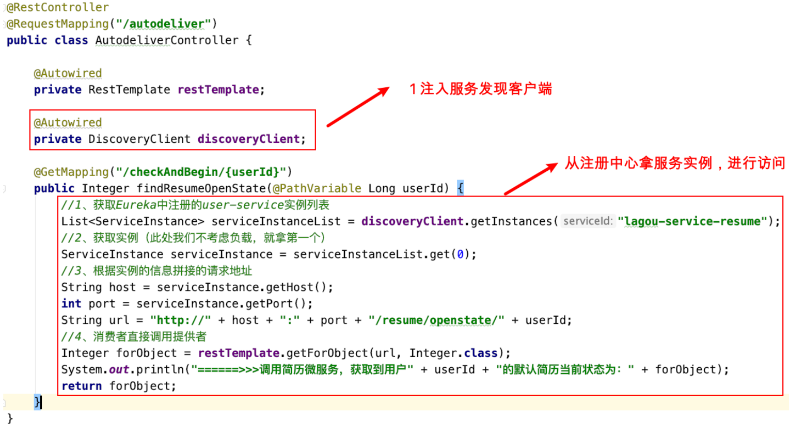


### 1.4 Eureka细节详解

#### 1.4.1 Eureka元数据详解

Eureka的元数据有两种：标准元数据和自定义元数据。

**标准元数据**：主机名、IP地址、端口号等信息，这些信息都会被发布在服务注册表中，用于服务之间的调用。

**自定义元数据**：可以使用eureka.instance.metadata-map配置，符合KEY/VALUE的存储格式。这些元数据可以在远程客户端中访问。

类似于：

```yaml
instance:
 prefer-ip-address: true
 metadata-map:
 # ⾃定义元数据(kv⾃定义)
 cluster: cl1
 region: rn1
```

我们可以在程序中可以使用DiscoveryClient 获取指定微服务的所有元数据信息

```java
import com.lagou.edu.AutodeliverApplication;
import org.junit.Test;
import org.junit.runner.RunWith;
import org.springframework.beans.factory.annotation.Autowired;
import org.springframework.boot.autoconfigure.SpringBootApplication;
import org.springframework.boot.test.context.SpringBootTest;
import org.springframework.cloud.client.ServiceInstance;
import org.springframework.cloud.client.discovery.DiscoveryClient;
import org.springframework.test.context.junit4.SpringJUnit4ClassRunner;
import java.util.List;
import java.util.Map;
@SpringBootTest(classes = {AutodeliverApplication.class})
@RunWith(SpringJUnit4ClassRunner.class)
public class AutodeliverApplicationTest {
    @Autowired
    private DiscoveryClient discoveryClient;
    @Test
    public void test() {
        // 从EurekaServer获取指定微服务实例
        List<ServiceInstance> serviceInstanceList =
            discoveryClient.getInstances("lagou-service-resume");
        // 循环打印每个微服务实例的元数据信息
        for (int i = 0; i < serviceInstanceList.size(); i++) {
            ServiceInstance serviceInstance =
                serviceInstanceList.get(i);
            System.out.println(serviceInstance);
        }
    }
}
```

元数据查看如下：

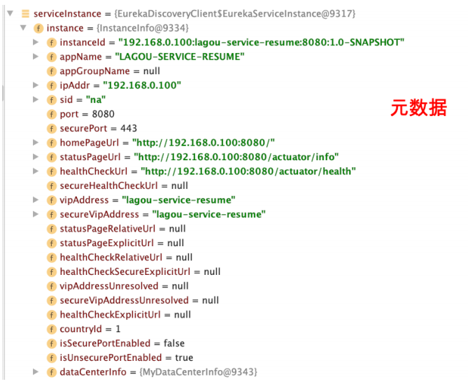

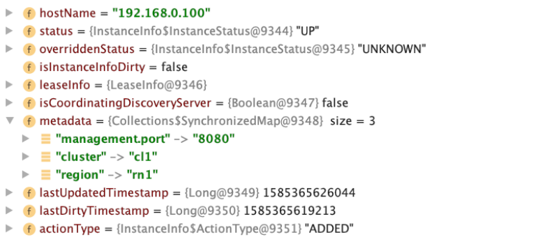

#### 1.4.2 Eureka客户端详解

服务提供者（也是Eureka客户端）要向EurekaServer注册服务，并完成服务续约等工作

**服务注册详解（服务提供者）**

1）当我们导入了eureka-client依赖坐标，配置Eureka服务注册中心地址

2）服务在启动时会向注册中心发起注册请求，携带服务元数据信息

3）Eureka注册中心会把服务的信息保存在Map中。

**服务续约详解（服务提供者）**

服务每隔30秒会向注册中心续约(心跳)一次（也称为报活），如果没有续约，租约在90秒后到期，然后服务会被失效。每隔30秒的续约操作我们称之为心跳检测

往往不需要我们调整这两个配置

```yaml
#向Eureka服务中⼼集群注册服务
eureka:
 instance:
 # 租约续约间隔时间，默认30秒
 lease-renewal-interval-in-seconds: 30
 # 租约到期，服务时效时间，默认值90秒,服务超过90秒没有发⽣⼼跳，EurekaServer会将服务从列表移除
 lease-expiration-duration-in-seconds: 90
```

**获取服务列表详解（服务消费者）**

每隔30秒服务会从注册中心中拉取一份服务列表，这个时间可以通过配置修改。往往不需要我们调整

```yaml
#向Eureka服务中⼼集群注册服务
eureka:
 client:
 # 每隔多久拉取⼀次服务列表
 registry-fetch-interval-seconds: 30
```

1）服务消费者启动时，从 EurekaServer服务列表获取只读备份，缓存到本地

2）每隔30秒，会重新获取并更新数据

3）每隔30秒的时间可以通过配置eureka.client.registry-fetch-interval-seconds修改


#### 1.4.3 Eureka服务端详解

**服务下线**

1）当服务正常关闭操作时，会发送服务下线的REST请求给EurekaServer

2）服务中心接受到请求后，将该服务置为下线状态

**失效剔除**

Eureka Server会定时（间隔值是eureka.server.eviction-interval-timer-in-ms，默认60s）进行检查，如果发现实例在在一定时间（此值由客户端设置的eureka.instance.lease-expiration-duration-in-seconds定义，默认值为90s）内没有收到心跳，则会注销此实例

**自我保护**

服务提供者 —> 注册中心

定期的续约（服务提供者和注册中心通信），假如服务提供者和注册中心之间的网络有点问题，不代表服务提供者不可用，不代表服务消费者无法访问服务提供者

如果在15分钟内超过85%的客户端节点都没有正常的心跳，那么Eureka就认为客户端与注册中心出现了网络故障，Eureka Server自动进入自我保护机制。

**为什么会有自我保护机制？**

默认情况下，如果Eureka Server在一定时间内（默认90秒）没有接收到某个微服务实例的心跳，Eureka Server将会移除该实例。但是当网络分区故障发生时，微服务与Eureka Server之间无法正常通信，而微服务本身是正常运行的，此时不应该移除这个微服务，所以引入了自我保护机制。

服务中心⻚面会显示如下提示信息:


**当处于自我保护模式时：**

1）不会剔除任何服务实例（可能是服务提供者和EurekaServer之间网络问题），保证了大多数服务依然可用

2）Eureka Server仍然能够接受新服务的注册和查询请求，但是不会被同步到其它节点上，保证当前节点依然可用，当网络稳定时，当前Eureka Server新的注册信息会被同步到其它节点中。

3）在Eureka Server工程中通过eureka.server.enable-self-preservation配置可用关停自我保护，默认值是打开

```yaml
eureka:
 server:
 enable-self-preservation: false # 关闭⾃我保护模式（缺省为打开）
```

> 经验：建议生产环境打开自我保护机制


### 1.5 Eureka核心源码剖析

#### 1.5.1 Eureka Server启动过程

入口：SpringCloud充分利用了SpringBoot的自动装配的特点

- 观察eureka-server的jar包，发现在META-INF下面有配置文件spring.factories

  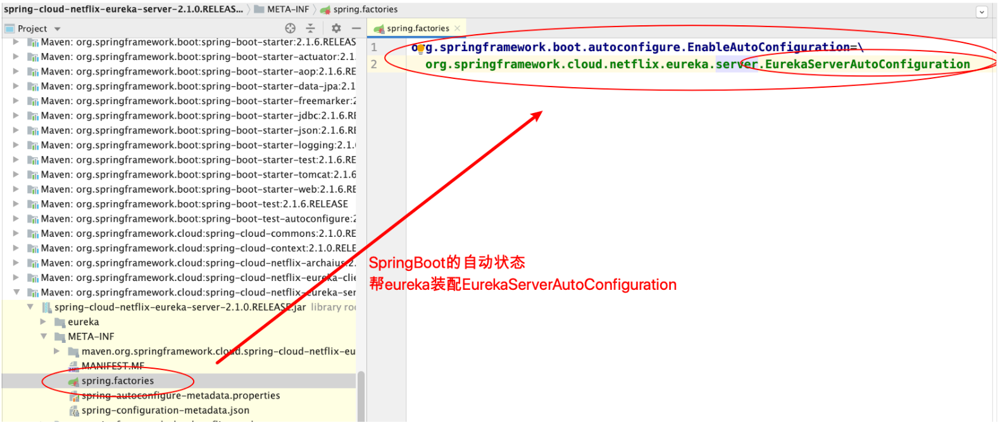

  springboot应用启动时会加载EurekaServerAutoConfiguration自动配置类

- EurekaServerAutoConfiguration类

  首先观察类头分析

  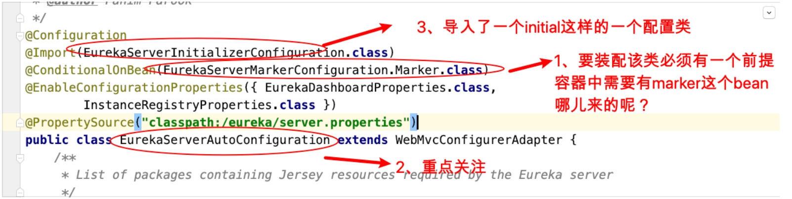

  **图中的 1、**

  > 需要有一个marker bean，才能装配Eureka Server，那么这个marker其实是由@EnableEurekaServer注解决定的

  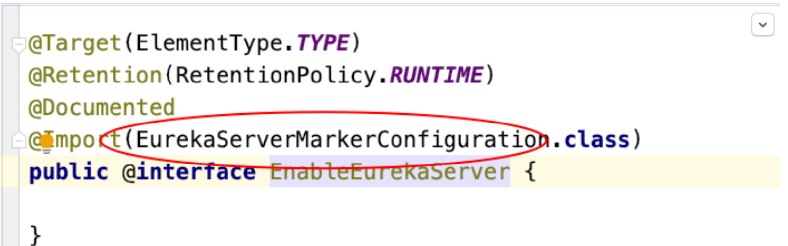

  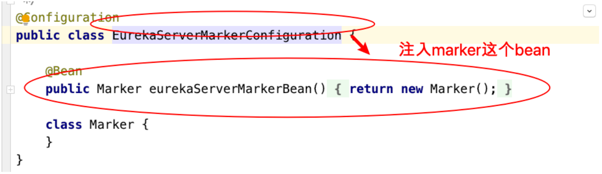

  也就是说只有添加了@EnableEurekaServer注解，才会有后续的动作，这是成为一个EurekaServer的前提

  **图中的 2、**

  > 关注EurekaServerAutoConfiguration

  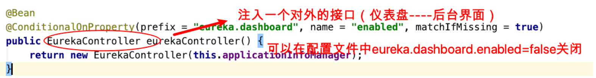

  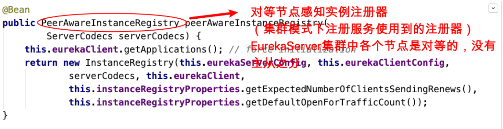

  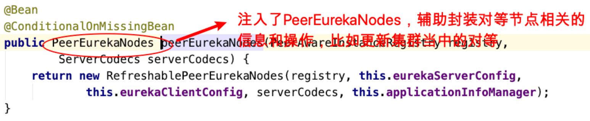

  而在 com.netflix.eureka.cluster.PeerEurekaNodes#start方法中

  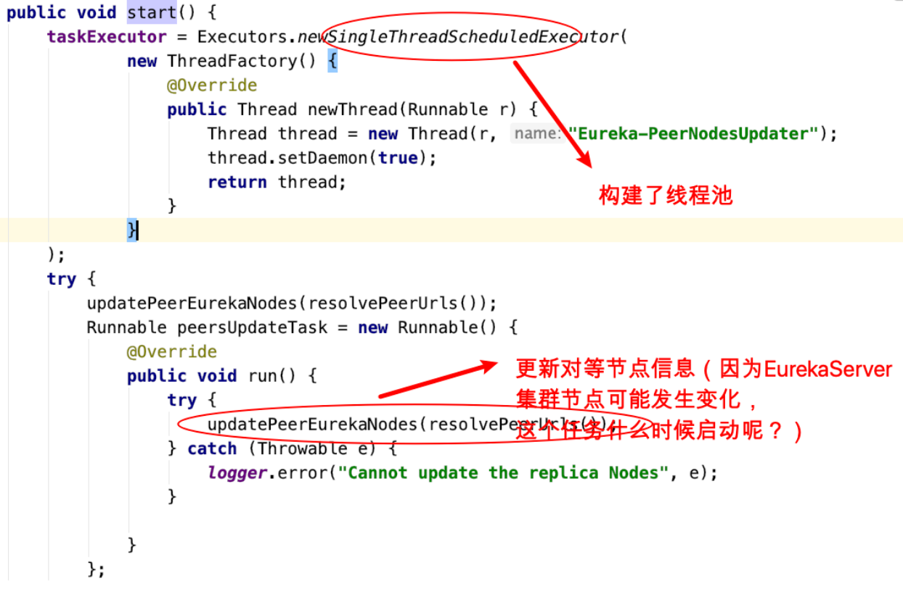

  回到主配置类中

  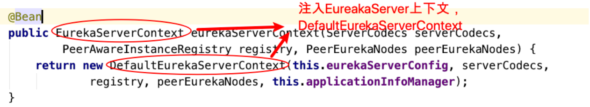

  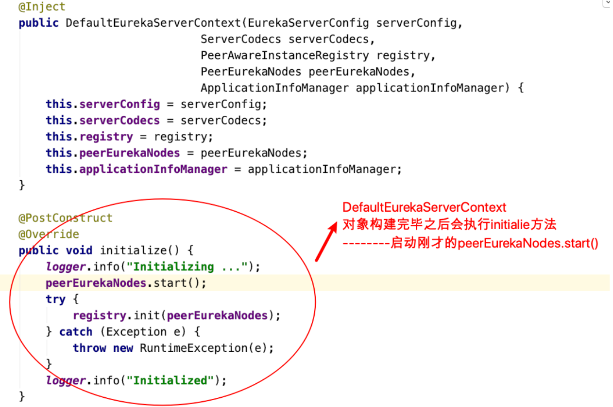

  回到主配置类中

  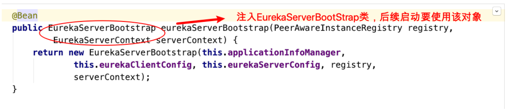

  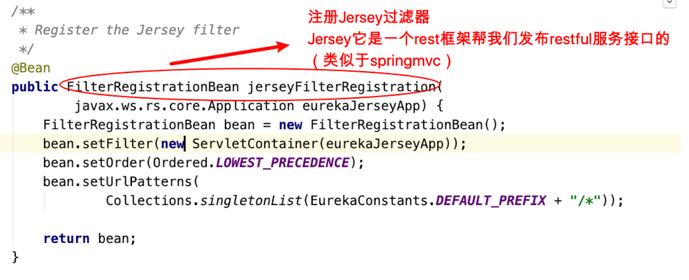

  **图中 3、**

  > 关注EurekaServerInitializerConfiguration

  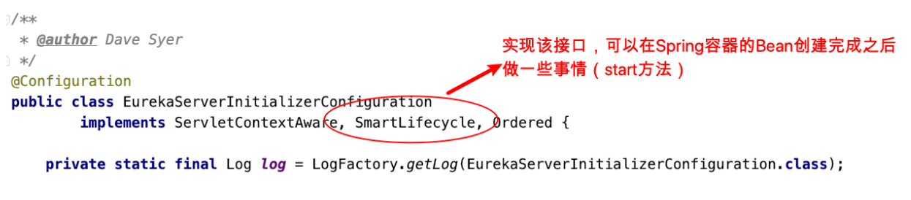

  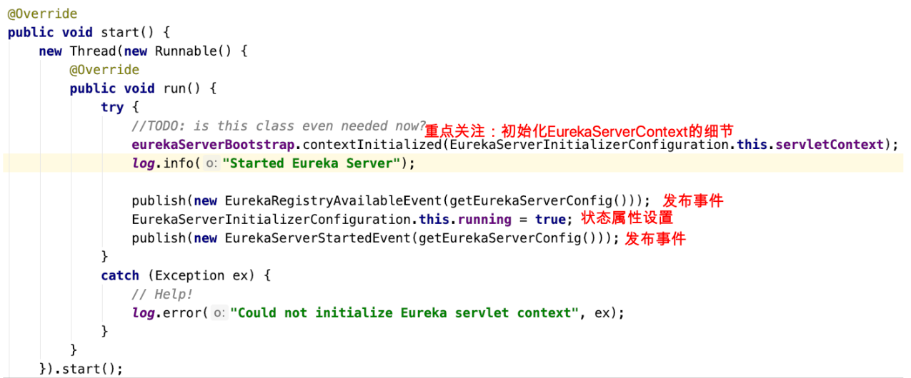

  重点关注，进入org.springframework.cloud.netflix.eureka.server.EurekaServerBootstrap#contextInitialized

  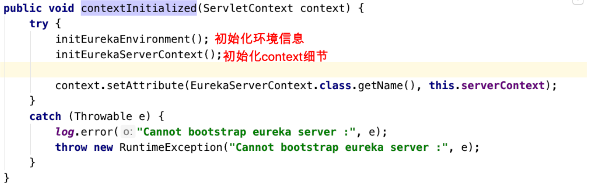

  重点关注initEurekaServerContext()

  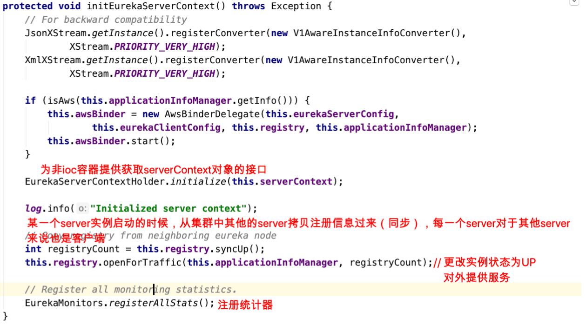

  研究一下上图中的syncUp方法

  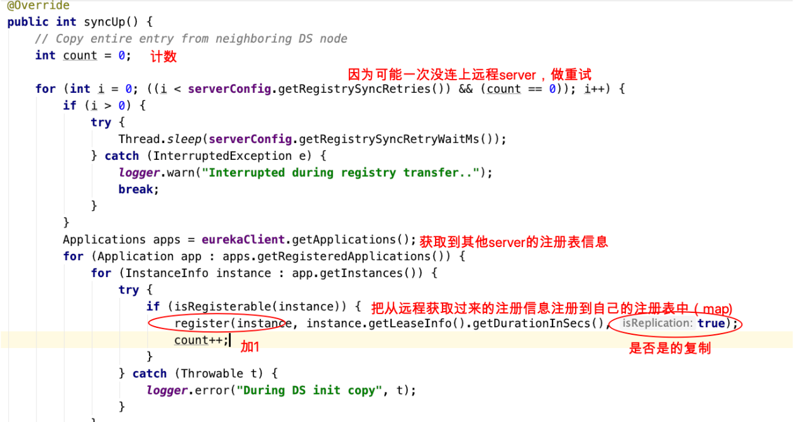

  继续研究com.netflix.eureka.registry.AbstractInstanceRegistry#register（提供实例注册功能）

  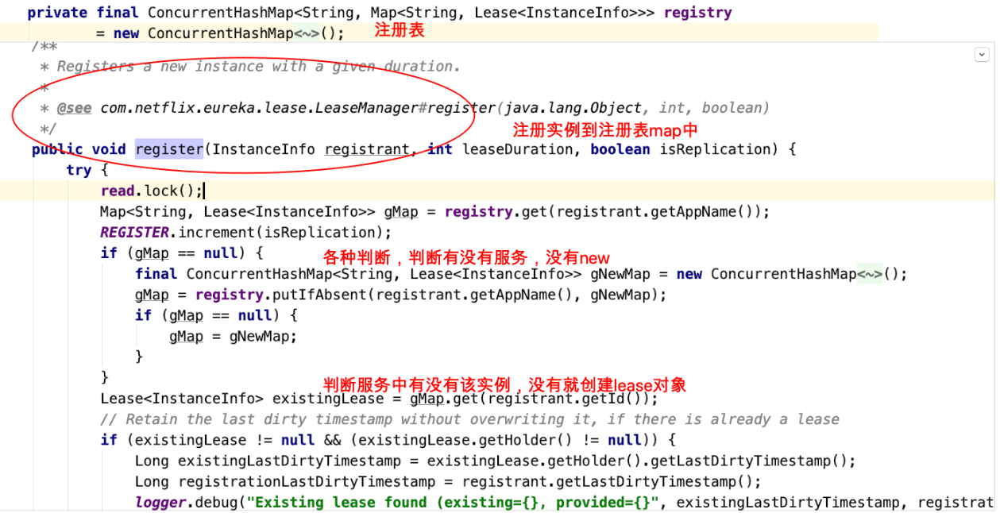

  继续研究com.netflix.eureka.registry.PeerAwareInstanceRegistryImpl#openForTraffic

  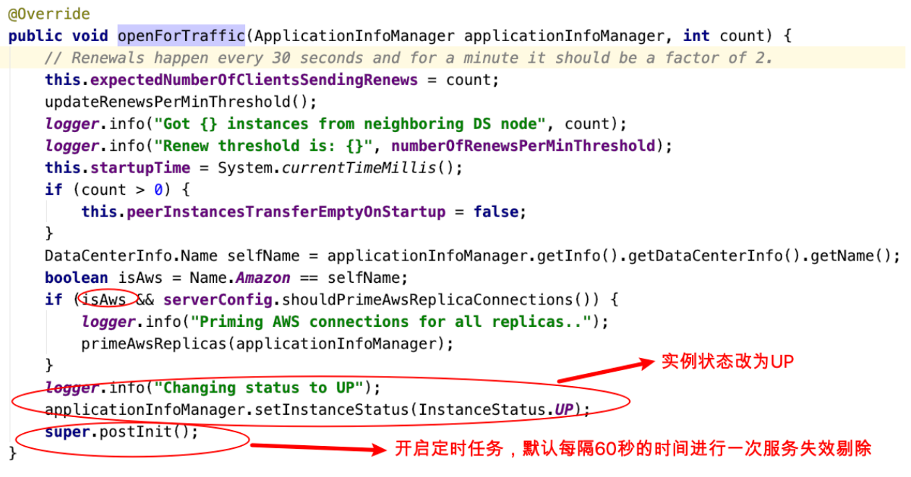

  进入postInit()方法查看

  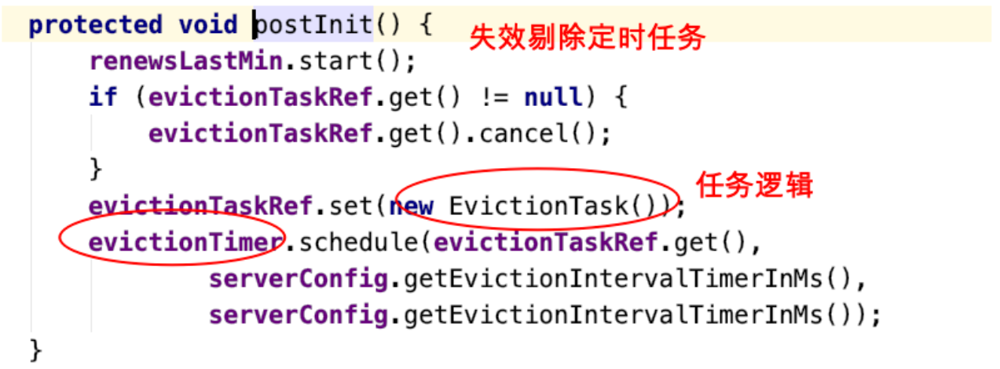


#### 1.5.2 Eureka Server服务接口暴露策略

在Eureka Server启动过程中主配置类注册了Jersey框架（是一个发布restful⻛格接口的框架，类似于我们的springmvc）


注入的Jersey细节


扫描classpath下的那些packages呢？已经定义好了


对外提供的接口服务，在Jersey中叫做资源


这些就是使用Jersey发布的供Eureka Client调用的Restful⻛格服务接口（完成服务注册、心跳续约等接口）


#### 1.5.3 Eureka Server服务注册接口（接受客户端注册服务）

ApplicationResource类的addInstance()方法中代码：registry.register(info,"true".equals(isReplication));


com.netflix.eureka.registry.PeerAwareInstanceRegistryImpl#register - 注册服务信息并同步到其它Eureka节点


AbstractInstanceRegistry#register()：注册，实例信息存储到注册表是一个ConcurrentHashMap

```java
/**
* Registers a new instance with a given duration.
*
* @see
com.netflix.eureka.lease.LeaseManager#register(java.lang.Object,
int, boolean)
*/
public void register(InstanceInfo registrant, int leaseDuration,
                     boolean isReplication) {
    try {
        read.lock(); //读锁

        // registry是保存所有应⽤实例信息的Map：
        ConcurrentHashMap<String, Map<String, Lease<InstanceInfo>>>
            // 从registry中获取当前appName的所有实例信息
            Map<String, Lease<InstanceInfo>> gMap =
            registry.get(registrant.getAppName());

        REGISTER.increment(isReplication); //注册统计+1

        // 如果当前appName实例信息为空，新建Map
        if (gMap == null) {
            final ConcurrentHashMap<String, Lease<InstanceInfo>>
                gNewMap = new ConcurrentHashMap<String, Lease<InstanceInfo>>();
            gMap = registry.putIfAbsent(registrant.getAppName(),
                                        gNewMap);
            if (gMap == null) {
                gMap = gNewMap;
            }
        }

        // 获取实例的Lease租约信息
        Lease<InstanceInfo> existingLease =
            gMap.get(registrant.getId());
        // Retain the last dirty timestamp without overwriting it,
        if there is already a lease
            // 如果已经有租约，则保留最后⼀个脏时间戳⽽不覆盖它
            // （⽐较当前请求实例租约 和 已有租约 的LastDirtyTimestamp，选择靠后的）
            if (existingLease != null && (existingLease.getHolder() !=null)) {
                Long existingLastDirtyTimestamp =
                    existingLease.getHolder().getLastDirtyTimestamp();
                Long registrationLastDirtyTimestamp =
                    registrant.getLastDirtyTimestamp();
                logger.debug("Existing lease found (existing={},
                             provided={}", existingLastDirtyTimestamp,
                             registrationLastDirtyTimestamp);
                if (existingLastDirtyTimestamp >
                    registrationLastDirtyTimestamp) {
                    logger.warn("There is an existing lease and the
                                existing lease's dirty timestamp {} is greater" +
                                " than the one that is being registered{}", existingLastDirtyTimestamp, registrationLastDirtyTimestamp);
                    logger.warn("Using the existing instanceInfoinstead of the new instanceInfo as the registrant");
                    registrant = existingLease.getHolder();}
            }
        else {
            // The lease does not exist and hence it is a new
            registration
                // 如果之前不存在实例的租约，说明是新实例注册
                // expectedNumberOfRenewsPerMin期待的每分钟续约数+2（因为30s⼀个）
                // 并更新numberOfRenewsPerMinThreshold每分钟续约阀值（85%）
                synchronized (lock) {
                if (this.expectedNumberOfRenewsPerMin > 0) {
                    // Since the client wants to cancel it, reduce
                    the threshold
                        // (1
                        // for 30 seconds, 2 for a minute)
                        this.expectedNumberOfRenewsPerMin =
                        this.expectedNumberOfRenewsPerMin + 2;
                    this.numberOfRenewsPerMinThreshold =
                        (int) (this.expectedNumberOfRenewsPerMin *serverConfig.getRenewalPercentThreshold());
                }
            }
            logger.debug("No previous lease information found; it is new registration");
        }

        Lease<InstanceInfo> lease = new Lease<InstanceInfo> (registrant, leaseDuration);
        if (existingLease != null) {
            lease.setServiceUpTimestamp(existingLease.getServiceUpTimestamp());
        }
        gMap.put(registrant.getId(), lease); //当前实例信息放到维护注册信息的Map

        // 同步维护最近注册队列
        synchronized (recentRegisteredQueue) {
            recentRegisteredQueue.add(new Pair<Long, String>(
                System.currentTimeMillis(),
                registrant.getAppName() + "(" +registrant.getId() + ")"));
        }

        // This is where the initial state transfer of overridden
        status happens
            // 如果当前实例已经维护了OverriddenStatus，将其也放到此Eureka
            Server的overriddenInstanceStatusMap中
            if(!InstanceStatus.UNKNOWN.equals(registrant.getOverriddenStatus()))
            {
                logger.debug("Found overridden status {} for instance{}. Checking to see if needs to be add to the "
                             + "overrides",registrant.getOverriddenStatus(), registrant.getId());
                if
                    (!overriddenInstanceStatusMap.containsKey(registrant.getId())) {
                    logger.info("Not found overridden id {} and henceadding it", registrant.getId());
                    overriddenInstanceStatusMap.put(registrant.getId(),registrant.getOverriddenStatus());
                }
            }
        InstanceStatus overriddenStatusFromMap = overriddenInstanceStatusMap.get(registrant.getId());
        if (overriddenStatusFromMap != null) {
            logger.info("Storing overridden status {} from map",overriddenStatusFromMap);

            registrant.setOverriddenStatus(overriddenStatusFromMap);
        }
        // Set the status based on the overridden status rules
        // 根据overridden status规则，设置状态
        InstanceStatus overriddenInstanceStatus
            = getOverriddenInstanceStatus(registrant,existingLease, isReplication);
        registrant.setStatusWithoutDirty(overriddenInstanceStatus);
        // If the lease is registered with UP status, set lease
        service up timestamp
            // 如果租约以UP状态注册，设置租赁服务时间戳
            if (InstanceStatus.UP.equals(registrant.getStatus())) {
                lease.serviceUp();
            }

        registrant.setActionType(ActionType.ADDED); //ActionType为ADD
        recentlyChangedQueue.add(new RecentlyChangedItem(lease));
        //维护recentlyChangedQueue
        registrant.setLastUpdatedTimestamp(); //更新最后更新时间

        // 使当前应⽤的ResponseCache失效
        invalidateCache(registrant.getAppName(),
                        registrant.getVIPAddress(), registrant.getSecureVipAddress());
        logger.info("Registered instance {}/{} with status {}(replication={})",
                    registrant.getAppName(), registrant.getId(),
                    registrant.getStatus(), isReplication);
    } finally {
        read.unlock(); //读锁
    }
}
```

PeerAwareInstanceRegistryImpl#replicateToPeers() ：复制到Eureka对等节点

```java
private void replicateToPeers(Action action, String appName, String
                              id,
                              InstanceInfo info /* optional */,
                              InstanceStatus newStatus /* optional*/, 
                              boolean isReplication) {
    Stopwatch tracer = action.getTimer().start();
    try {
        // 如果是复制操作（针对当前节点，false）
        if (isReplication) {
            numberOfReplicationsLastMin.increment();
        }
        // 如果它已经是复制，请不要再次复制，直接return
        if (peerEurekaNodes == Collections.EMPTY_LIST ||sReplication) {
            return;
        }
        // 遍历集群所有节点（除当前节点外）
        for (final PeerEurekaNode node :
             peerEurekaNodes.getPeerEurekaNodes()) {
            // If the url represents this host, do not replicate to
            yourself.
                if (peerEurekaNodes.isThisMyUrl(node.getServiceUrl())){
                    continue;
                }
            // 复制Instance实例操作到某个node节点
            replicateInstanceActionsToPeers(action, appName, id,
                                            info, newStatus, node);
        }
    }
    finally {
        tracer.stop();
    }
}
```

PeerAwareInstanceRegistryImpl#replicateInstanceActionsToPeers


#### 1.5.4 Eureka Server服务续约接口（接受客户端续约）

InstanceResource的renewLease方法中完成客户端的心跳（续约）处理，关键代码：registry.renew(app.getName(), id, isFromReplicaNode);


com.netflix.eureka.registry.PeerAwareInstanceRegistryImpl#renew

```java
private void replicateInstanceActionsToPeers(Action action, String
                                             appName,
                                             String id,
                                             InstanceInfo info, InstanceStatus newStatus,
                                             PeerEurekaNode node) {
    try {
        InstanceInfo infoFromRegistry = null;
        CurrentRequestVersion.set(Version.V2);
        switch (action) {
            case Cancel: //取消
                node.cancel(appName, id);
                break;
            case Heartbeat: //⼼跳
                InstanceStatus overriddenStatus =overriddenInstanceStatusMap.get(id);
                infoFromRegistry = getInstanceByAppAndId(appName,id, false);
                node.heartbeat(appName, id, infoFromRegistry,overriddenStatus, false);
                break;
            case Register: //注册
                node.register(info);
                break;
            case StatusUpdate: //状态更新
                infoFromRegistry = getInstanceByAppAndId(appName,id, false);
                node.statusUpdate(appName, id, newStatus,infoFromRegistry);
                break;
            case DeleteStatusOverride: //删除OverrideStatus
                infoFromRegistry = getInstanceByAppAndId(appName,id, false);
                node.deleteStatusOverride(appName, id,infoFromRegistry);
                break;
        }
    } catch (Throwable t) {
        logger.error("Cannot replicate information to {} for action{}", node.getServiceUrl(), action.name(), t);
    }
}
```

renew()方法中—>leaseToRenew.renew()—>对最后更新时间戳进行更新


#### 1.5.5 Eureka Client注册服务

启动过程：Eureka客户端在启动时也会装载很多配置类，我们通过spring-cloud-netflix-eureka-client-2.1.0.RELEASE.jar下的spring.factories文件可以看到加载的配置类


引入jar就会被自动装配，分析EurekaClientAutoConfiguration类头


如果不想作为客户端，可以设置eureka.client.enabled=false


回到主配置类EurekaClientAutoConfiguration

思考：EurekaClient启动过程要做什么事情？？？？

1）读取配置文件

2）启动时从EurekaServer获取服务实例信息

3）注册自己到EurekaServer（addInstance）

4）开启一些定时任务（心跳续约，刷新本地服务缓存列表）


##### 1）读取配置文件


##### 2）启动时从EurekaServer获取服务实例信息


观察父类DiscoveryClient()


在另外一个构造器中


##### 3）注册自己到EurekaServer


DiscoveryClient#register


底层使用Jersey客户端进行远程请求。

##### 4）开启一些定时任务（心跳续约，刷新本地服务缓存列表）


刷新本地缓存


心跳续约定时任务


**读取配置文件**


获取配置信息之外就开始获取一个Eureka客户端了


来到父类，super


**初始化一些定时器（定时获取注册信息、发送心跳等）**


刷新本地缓存定时任务


心跳


**注册自己**


服务下架，服务死掉的时候就会调用shutdown，就是shutdown


客户端注册服务，在com.netflix.discovery.DiscoveryClient类的构造函数中调用了this.initScheduledTasks()方法，这个方法会启动定时任务调用EurekaServer的相关Restful接口，那么这个DiscoveryClient构造函数是什么时候调用呢？右键—>FindUsages就能知道

因此，我们看com.netflix.discovery.DiscoveryClient#register


#### 1.5.6 Eureka Client 下架服务

我们看com.netflix.discovery.DiscoveryClient#shutdown


#### 1.5.7 Eureka Client心跳续约

参考前文


## 第2节 Ribbon 负载均衡

### 2.1 关于负载均衡

负载均衡一般分为**服务器端负载均衡**和**客户端负载均衡**

所谓**服务器端负载均衡**，比如Nginx、F5这些，请求到服务器之后由这些负载均衡器根据一定的算法将请求路由到目标服务器处理。

所谓**客户端负载均衡**，比如Ribbon，服务消费者根据客户端会有一个服务器地址列表，调用方在请求前通过一定的负载均衡算法选择一个服务器进行访问，负载均衡算法的执行是在请求客户端进行。

Ribbon是Netfix发布的负载均衡器。Eureka一般配合Ribbon进行使用，Ribbon利用从Eureka中读取到服务信息，在调用服务提供者的服务时，会根据一定的算法进行负载


### 2.2 Ribbon高级应用

不需要引入额外的jar坐标，因为在服务消费者中我们引入过eureka-client，它会引入Ribbon相关Jar


代码中使用如下，在RestTemplate上添加对应注解即可

```java
@Bean
// Ribbon负载均衡
@LoadBalanced
public TestTemplate getRestTemplate(){
    return new RestTemplate();
}
```

修改服务提供者api返回值，返回当前实例的端口号，便于观察负载均衡


测试


打印如下：


### 2.3 Ribbon负载均衡策略

Ribbon内置了多种负载均衡策略，内部负责复杂均衡的顶级接口为IRule：`com.netflix.loadbalancer.IRule`,类树如下：


| 负载均衡策略                                | 描述                                                         |
| ------------------------------------------- | ------------------------------------------------------------ |
| RoundRobinRule：轮询策略                    | 默认超过10次获取到的server都不可用，会返回一个空的server     |
| RandomRule：随机策略                        | 如果随机到的server为null或者不可用的话，会while不停的循环获取 |
| RetryRule：重试策略                         | 一定时间内循环重试。<br />默认继承RoundRobinRule，也支持自定义注入，RetryRule会在每次获取之后，对选举的server进行判断，是否为null，是否alive，并且在500ms内会不停的选取判断。而RoundRobinRule失效的策略是超过10次，RandomRule是没有失效时间的概念，只要serverList没都挂 |
| BestAvailableRule：最小连接数策略           | 遍历serverList，选取出可用的且连接数最小的一个server。<br />该算法里面有一个LoadBalancerStats的成员变量，会存储所有server的运行状况和连接数。如果选取到的server为null，那么会调用RoundRobinRule重新选取 |
| AvailabilityFilteringRule：可用过滤策略     | 扩展了轮询策略，会先通过默认的轮询选取一个server，再去判断该server是否超时可用，当前连接数是否超限，都成功再返回。 |
| ZoneAvoidanceRule：区域权衡策略（默认策略） | 扩展了轮询策略，继承了2个过滤器：ZoneAvoidancePredicate和AvailabilityPredicate，除了过滤超时和链接数过多的server，还会过滤掉不符合要求的zone区域里面的所有节点，AWS --ZONE 在一个区域/机房内的服务实例中轮询 |

修改负载均衡策略

```yaml
#针对的被调⽤⽅微服务名称,不加就是全局⽣效
lagou-service-resume:
 ribbon:
 NFLoadBalancerRuleClassName:
com.netflix.loadbalancer.RandomRule #负载策略调整
```


### 2.4 Ribbon核心源码剖析

**Ribbon工作原理**


**重点：**Ribbon 给RestTemplate添加了一个拦截器

**思考**：Ribbon在做什么：

当我们访问http://lagou-service-resume/resume/openstate/的时候，ribbon应该根据服务名lagou-service-resume获取到该服务的实例列表并按照一定的负载均衡策略从实例列表中获取一个实例Server，并最终通过RestTemplate进行请求访问

**Ribbon细节结构图（涉及到底层的一些组件/类的描述）**

1）获取服务实例列表

2）从列表中选择一个server


图中核心是**负载均衡管理器LoadBalancer（总的协调者，相当于大脑，为了做事情，协调四肢）**，围绕它周围的多有IRule、IPing等

- IRule：是在选择实例的时候的负载均衡策略对象
- IPing：是用来向服务发起心跳检测的，通过心跳检测来判断该服务是否可用
- ServerListFilter：根据一些规则过滤传入的服务列表
- ServerListUpdater：定义了一些列的对服务列表的更新操作


#### 2.4.1 @LoadBalanced源码剖析

我们在RestTemplate实例上添加了一个@LoadBalanced注解，就可以实现负载均衡，很神奇，下面分析这个注解背后的操作（负载均衡过程）

- 查看@LoadBalanced注解，那这个注解是在哪里被识别到的呢？

  

- LoadBalancedClient类（实现类RibbonLoadBalancedClient，待用）

  ```java
  public interface LoadBalancerClient extends ServiceInstanceChooser
  {
      // 根据服务执⾏请求内容
      <T> T execute(String serviceId, LoadBalancerRequest<T> request)
          throws IOException;
      // 根据服务执⾏请求内容
      <T> T execute(String serviceId, ServiceInstance serviceInstance,
                    LoadBalancerRequest<T> request) throws IOException;
      // 拼接请求⽅式 传统中是ip:port 现在是服务名称:port 形式
      URI reconstructURI(ServiceInstance instance, URI original);
  }
  ```

- 老规矩：SpringCloud充分利用了SpringBoot的自动装配特点，找spring.factories配置文件

  

  


##### 2.4.1.1 研究LoadBalancerAutoConfiguration


———-》》》LoadBalancerAutoConfiguration里面的内容剖析

第一处：注入RestTemplate对象到集合待用


第二处：注入RestTemplate定制器


第三处：使用定制器给集合中的每一个RestTemplate对象添加一个拦截器


到这里，我们明白，添加了注解的RestTemplate对象会被添加一个拦截器LoadBalancerInterceptor，该拦截器就是后续拦截请求进行负载均衡处理的

所以，下一步重点我们该分析拦截器LoadBalancerInterceptor—->intercept()方法

##### 2.4.1.2 分析LoadBalancerInterceptor.intercept()方法


那么，RibbonLoadBalancerClient对象是在哪里注入的？

回到最初的自动配置类：RibbonAutoConfiguration中


负载均衡的事情实行原来交给了最初看到的RibbonLoadBalancerClient对象

非常核心的一个方法：RibbonLoadBalancerClient.execute()


##### 2.4.1.3 回到主配置类RibbonAutoConfiguration


RibbonClientConfiguration中装配了大脑和肢干


ZoneAwareLoadBalancer#chooseServer


父类：com.netflix.loadbalancer.BaseLoadBalancer#chooseServer


来到区域隔离策略的父类choose方法中

> com.netflix.loadbalancer.PredicateBasedRule#choose


**前文我们提到的关注点3**


AbstractClientHttpRequest#execute

此处，就已经到了RestTemplate底层执行的代码了，由此也将验证最终请求的调用还是靠的RestTemplate


接下来，在进行负载chooseServer的时候，LoadBalancer负载均衡器中已经有了serverList，那么这个ServerList是什么时候被注入到LoadBalancer中的，它的一个机制大概是怎样的？

来到RibbonClientConfiguration


把目光聚焦到使用这个空对象ServerList的地方


进入EnableAndInitLearnNewServersFeature()方法


#### 2.4.2 RoundRobinRule轮询策略源码剖析

```java
//
// Source code recreated from a .class file by IntelliJ IDEA
// (powered by Fernflower decompiler)
//
package com.netflix.loadbalancer;

import com.netflix.client.config.IClientConfig;
import java.util.List;
import java.util.concurrent.atomic.AtomicInteger;
import org.slf4j.Logger;
import org.slf4j.LoggerFactory;

public class RoundRobinRule extends AbstractLoadBalancerRule {
    private AtomicInteger nextServerCyclicCounter;
    private static final boolean AVAILABLE_ONLY_SERVERS = true;
    private static final boolean ALL_SERVERS = false;
    private static Logger log =
        LoggerFactory.getLogger(RoundRobinRule.class);
    public RoundRobinRule() {
        this.nextServerCyclicCounter = new AtomicInteger(0);
    }
    public RoundRobinRule(ILoadBalancer lb) {
        this();
        this.setLoadBalancer(lb);
    }
    // 负载均衡策略类核⼼⽅法
    public Server choose(ILoadBalancer lb, Object key) {
        if (lb == null) {
            log.warn("no load balancer");
            return null;
        } else {
            Server server = null;
            int count = 0;
            while(true) {
                if (server == null && count++ < 10) {
                    // 所有可⽤服务实例列表
                    List<Server> reachableServers = lb.getReachableServers();
                    // 所有服务实例列表
                    List<Server> allServers = lb.getAllServers();
                    int upCount = reachableServers.size();
                    int serverCount = allServers.size();
                    if (upCount != 0 && serverCount != 0) {
                        // 获得⼀个轮询索引
                        int nextServerIndex = this.incrementAndGetModulo(serverCount);
                        // 根据索引取出服务实例对象
                        server = (Server)allServers.get(nextServerIndex);
                        if (server == null) {
                            Thread.yield();
                        } else {
                            // 判断服务可⽤后返回
                            if (server.isAlive() &&
                                server.isReadyToServe()) {
                                return server;
                            }
                            server = null;
                        }
                        continue;
                    }
                    log.warn("No up servers available from loadbalancer: " + lb);
                    return null;
                }
                if (count >= 10) {
                    log.warn("No available alive servers after 10 tries from load balancer: " + lb);
                }
                return server;
            }
        }
    }
    private int incrementAndGetModulo(int modulo) {
        int current;
        int next;
        do {
            // 取出上次的计数
            current = this.nextServerCyclicCounter.get();
            // 因为是轮询，计数+1之后对总数取模
            next = (current + 1) % modulo;
        }
        while(!this.nextServerCyclicCounter.compareAndSet(current, next));
        return next;
    }
    public Server choose(Object key) {
        return this.choose(this.getLoadBalancer(), key);
    }
    public void initWithNiwsConfig(IClientConfig clientConfig) {
    }
}
```


#### 2.4.3 RandomRule随机策略源码剖析


## 第3节 Hystrix熔断器

属于一种容错机制


### 3.1 微服务中的雪崩效应

**什么是微服务中的雪崩效应呢？**

微服务中，一个请求可能需要多个微服务接口才能实现，会形成复杂的调用链路。


扇入：代表着该微服务被调用的次数，扇入大，说明该模块复用性好

扇出：该微服务调用其他微服务的个数，扇出大，说明业务逻辑复杂

扇入大是一个好事，扇出大不一定是好事

在微服务架构中，一个应用可能会有多个微服务组成，微服务之间的数据交互通过远程调用完成。

这就带来一个问题，假设微服务A调用微服务B和微服务C，微服务B和微服务C又调用其他的微服务，这就是所谓的“扇出”。

如果扇出的链路上某个微服务的调用响应时间过长或者不可用，对微服务A的调用就会占用越来越多的系统资源，进而引进系统崩溃，所谓的“雪崩效应”

如图所示，最下游**简历微服务**响应时间过长，大量请求阻塞，大量线程不会释放，会导致服务器资源耗尽，最终导致上游甚至整个系统瘫痪。


### 3.2 雪崩效应解决方案

从可用性可靠性着想，为防止系统的整体缓慢甚至崩溃，采用的技术手段；

下面，介绍三种技术手段应对微服务中的雪崩效应，这三种手段都是从系统可用性、可靠性角度触发，尽量防止系统整体缓慢甚至瘫痪。

#### 3.2.1 服务熔断

熔断机制是应对雪崩效应的一种微服务链路保护机制。我们在各种场景下都会接触到熔断这两个字。

高压电路中，如果某个地方的电压过高，熔断器就会熔断，对电路进行保护。股票交易中心，如果股票指数过高，也会采用熔断机制，暂停股票的交易

同样，在微服务架构中，熔断机制也是起着类似的作用。当扇出链路的某个微服务不可用或者响应时间太长时，熔断该节点的微服务调用，进行服务的降级，快速返回错误的响应信息。当检测到该节点微服务调用响应正常后，恢复调用链路。

**注意：**

1. 服务熔断重点在**“断“**，切断对下游服务的调用
2. 服务熔断和服务降级往往是一起使用的，Hystrix就是这样。

#### 3.2.2 服务降级

通俗讲就是整体资源不够用了，先将一些不关紧的服务停掉（调用我的时候，给你返回一个预留的值，也叫做**兜底数据**），待渡过难关高峰过去，再把那些服务打开。

服务降级一般是从整体考虑，就是当某个服务熔断之后，服务器将不再被调用，此刻客户端可以自己准备一个本地的fallback回调，返回一个缺省值，这样做，虽然服务水平下降，但好歹可用，比直接挂掉要强。


#### 3.2.3 服务限流

服务降级是当服务出问题或者影响到核心流程的性能时，暂时将服务屏蔽掉，待高峰或者问题解决后再打开；但是有些场景并不能用服务降级来解决，比如秒杀业务这样的核心功能，这个时候可以结合服务限流来限制这些场景的并发/请求量

限流措施也很多，比如：

1. 限制总并发数（比如数据库连接池、线程池）
2. 限制瞬时并发数（比如nginx限制瞬时并发连接数）
3. 限制时间窗口内的平均速率（如Guava的RateLimiter、nginx的Limit_req模块，限制每秒的平均速率）
4. 限制远程接口调用速率、限制MQ的消费速率等


### 3.3 Hystrix简介

**[来自官网]**Hystrix（豪猪----->刺），宣言“defend your app”是由Netflix开源的一个延迟和容错库，用于隔离访问远程系统、服务或者第三方库，防止级联失败，从而提升系统的可用性与容错性。Hystrix主要通过以下几点实现延迟和容错

- 包裹请求：使用HystrixCommand包裹对依赖的调用逻辑。自动投递微服务方法（@HystrixCommand添加Hystrix控制）——调用简历微服务
- 跳闸机制：当某服务的错误率超过一定的阈值时，Hystrix可以跳闸，停止请求该服务一段时间。
- 资源隔离：Hystrix为每个依赖都维护了一个小型的线程池（舱壁模式）（或者信号量）。如果该线程池已满，发往该依赖的请求就被立即拒绝，而不是排队等待，从而加速失败判定。
- 监控：Hystrix可以近乎实时的监控运行指标和配置变化，例如成功、失败、超时、以及被拒接的请求等。
- 回退机制：当请求失败、超时、被拒绝，或当断路器打开时，执行回退逻辑。回退逻辑由开发人员自行提供，例如返回一个缺省值。
- 自我修复：断路器打开一段时间后，会自动进入“半开”状态

### 3.4 Hystrix熔断应用

**目的**：简历微服务⻓时间没有响应，服务消费者—>**自动投递微服务**快速失败给用户提示


- 服务消费者工程（自动投递微服务）中引入Hystrix依赖坐标（也可以添加在父工程中）

  ```xml
  <!--熔断器Hystrix-->
  <dependency>
      <groupId>org.springframework.cloud</groupId>
      <artifactId>spring-cloud-starter-netflixhystrix</artifactId>
  </dependency>
  ```

- 服务消费者工程（自动投递为服务）的启动类中添加熔断器开启注解：@EnableCircuitBreaker

  ```java
  package com.lagou.edu;
  import org.springframework.boot.SpringApplication;
  import org.springframework.boot.autoconfigure.SpringBootApplication;
  import org.springframework.boot.autoconfigure.domain.EntityScan;
  import org.springframework.cloud.client.circuitbreaker.EnableCircuitBreaker;
  import org.springframework.cloud.client.discovery.EnableDiscoveryClient;
  import org.springframework.cloud.client.loadbalancer.LoadBalanced;
  import org.springframework.context.annotation.Bean;
  import org.springframework.web.client.RestTemplate;
  
  /**
  * 注解简化写法
  * @SpringCloudApplication =
  @SpringBootApplication+@EnableDiscoveryClient+@EnableCircuitBreaker
  */
  @SpringBootApplication
  @EnableDiscoveryClient // 开启服务发现
  @EnableCircuitBreaker // 开启熔断
  public class AutodeliverApplication {
      public static void main(String[] args) {
          SpringApplication.run(AutodeliverApplication.class,args);
      }
      /**
       * 注⼊RestTemplate
       * @return
       */
      @Bean
      // Ribbon负载均衡
      @LoadBalanced
      public RestTemplate getRestTemplate() {
          return new RestTemplate();
      }
  }
  ```

- 定义服务降级处理方法，并在业务方法上使用@HystrixCommand的fallbackMethod属性关联到服务降级处理方法

  ```java
  package org.example;
  
  import org.springframework.beans.factory.annotation.Autowired;
  import org.springframework.web.bind.annotation.GetMapping;
  import org.springframework.web.bind.annotation.PathVariable;
  import org.springframework.web.bind.annotation.RequestMapping;
  import org.springframework.web.bind.annotation.RestController;
  import org.springframework.web.client.RestTemplate;
  
  @RestController
  @RequestMapping("/autodeliver")
  public class AutodeliverController {
      @Autowired
      private RestTemplate restTemplate;
  
      // /autodeliver/checkState/1545132
      /*@GetMapping("/checkState/{userId}")
      public Integer findResumeOpenState(@PathVariable Long userId) {
          // 调⽤远程服务—> 简历微服务接⼝ RestTemplate ->JdbcTempate
          // httpclient封装好多内容进⾏远程调⽤
          Integer forObject = restTemplate.getForObject("http://localhost:8080/resume/openstate/" + userId, Integer.class);
          return forObject;
      }*/
  
      @Autowired
      private DiscoveryClient discoveryClient;
  
      /**
       * 服务注册到Eureka之后的改造
       *
       * @param userId
       * @return
       */
      /*@GetMapping("/checkState/{userId}")
      public Integer findResumeOpenState(@PathVariable Long
                                                 userId) {
          // TODO 从Eureka Server中获取我们关注的那个服务的实例信息以及接口信息
          // 1、从 Eureka Server中获取lagou-service-resume服务的实例信息（使⽤客户端对象做这件事）
          List<ServiceInstance> instances = discoveryClient.getInstances("lagou-service-resume");
          // 2、如果有多个实例，选择⼀个使⽤(负载均衡的过程)
          ServiceInstance serviceInstance = instances.get(0);
          // 3、从元数据信息获取host port
          String host = serviceInstance.getHost();
          int port = serviceInstance.getPort();
          String url = "http://" + host + ":" + port + "/resume/openstate/" + userId;
          System.out.println("===============>>>从EurekaServer集群 获取服务实例拼接的url：" + url);
          // 调⽤远程服务—> 简历微服务接⼝ RestTemplate ->JdbcTempate
          // httpclient封装好多内容进⾏远程调⽤
          Integer forObject = restTemplate.getForObject(url, Integer.class);
          return forObject;
      }*/
  
      /**
       * 使⽤Ribbon负载均衡
       *
       * @param userId
       * @return
       */
      @GetMapping("/checkState/{userId}")
      public Integer findResumeOpenState(@PathVariable Long userId) {
          // 使⽤ribbon不需要我们⾃⼰获取服务实例然后选择⼀个那么去访问了（⾃⼰的负载均衡）
          String url = "http://lagou-service-resume/resume/openstate/" + userId; // 指定服务名
          Integer forObject = restTemplate.getForObject(url, Integer.class);
          return forObject;
      }
  
      /**
       * 提供者模拟处理超时，调⽤⽅法添加Hystrix控制
       *
       * @param userId
       * @return
       */
      // 使⽤@HystrixCommand注解进⾏熔断控制
      @HystrixCommand(
              // 线程池标识，要保持唯⼀，不唯⼀的话就共⽤了
              threadPoolKey = "findResumeOpenStateTimeout",
              // 线程池细节属性配置
              threadPoolProperties = {
                      @HystrixProperty(name = "coreSize", value = "1"), // 线程数
                      @HystrixProperty(name = "maxQueueSize", value = "20") // 等待队列⻓度
              },
              // commandProperties熔断的⼀些细节属性配置
              commandProperties = {
                      // 每⼀个属性都是⼀个HystrixProperty
                      @HystrixProperty(name = "execution.isolation.thread.timeoutInMilliseconds", value = "2000")
              }
      )
      @GetMapping("/checkStateTimeout/{userId}")
      public Integer findResumeOpenStateTimeout(@PathVariable Long userId) {
          // 使⽤ribbon不需要我们⾃⼰获取服务实例然后选择⼀个那么去访问了（⾃⼰的负载均衡）
          String url = "http://lagou-service-resume/resume/openstate/" + userId; // 指定服务名
          Integer forObject = restTemplate.getForObject(url, Integer.class);
          return forObject;
      }
  
      @GetMapping("/checkStateTimeoutFallback/{userId}")
      @HystrixCommand(
              // 线程池标识，要保持唯⼀，不唯⼀的话就共⽤了
              threadPoolKey = "findResumeOpenStateTimeoutFallback",
              // 线程池细节属性配置
              threadPoolProperties = {
                      @HystrixProperty(name = "coreSize", value = "2"), // 线程数
                      @HystrixProperty(name = "maxQueueSize", value = "20") // 等待队列⻓度
              },
              // commandProperties熔断的⼀些细节属性配置
              commandProperties = {
                      // 每⼀个属性都是⼀个HystrixProperty
  
                      @HystrixProperty(name = "execution.isolation.thread.timeoutInMill iseconds", value = "2000"),
                      // hystrix⾼级配置，定制⼯作过程细节
                      // 统计时间窗⼝定义
                      @HystrixProperty(name = "metrics.rollingStats.timeInMilliseconds", value = "8000"),
                      // 统计时间窗⼝内的最⼩请求数
                      @HystrixProperty(name = "circuitBreaker.requestVolumeThreshold", value = "2"),
                      // 统计时间窗⼝内的错误数量百分⽐阈值
                      @HystrixProperty(name = "circuitBreaker.errorThresholdPercentage", value = "50"),
                      // ⾃我修复时的活动窗⼝⻓度
                      @HystrixProperty(name = "circuitBreaker.sleepWindowInMilliseconds", value = "3000")
              },
              fallbackMethod = "myFallBack" // 回退⽅法
      )
      public Integer findResumeOpenStateTimeoutFallback(@PathVariable Long userId) {
          // 使⽤ribbon不需要我们⾃⼰获取服务实例然后选择⼀个那么去访问了（⾃⼰的负载均衡）
          String url = "http://lagou-service-resume/resume/openstate/" + userId; // 指定服务名
          Integer forObject = restTemplate.getForObject(url, Integer.class);
          return forObject;
      }
  
      /*
      定义回退⽅法，返回预设默认值
      注意：该⽅法形参和返回值与原始⽅法保持⼀致
      */
      public Integer myFallBack(Long userId) {
          return -123333; // 兜底数据
      }
      /**
       * 1）服务提供者处理超时，熔断，返回错误信息
       * 2）有可能服务提供者出现异常直接抛出异常信息
       *
       * 以上信息，都会返回到消费者这⾥，很多时候消费者服务不希望把收到异常/错误信息再抛到它的上游去
       * ⽤户微服务 — 注册微服务 — 优惠券微服务
       * 1 登记注册
       * 2 分发优惠券（并不是核⼼步骤），这⾥如果调⽤优惠券微服务返回了异常信息或者是熔断后的错误信息，这些信息如果抛给⽤户很不友好
       * 此时，我们可以返回⼀个兜底数据，预设的默认值（服务降级）
       *
       *
       */
  }
  ```

  

  **注意**：

  - 降级（兜底）方法必须和被降级方法相同的方法签名（相同的参数列表、相同返回值）
  - 可以在类上使用@DefaultProperties注解统一指定整个类中共用的降级（兜底）方法
  - 服务提供者端（简历微服务）模拟请求超时（线程休眠3s），只修改8080实例，8081不修改，对比观察

  ```java
  package com.lagou.edu.controller;
  import com.lagou.edu.service.ResumeService;
  import org.springframework.beans.factory.annotation.Autowired;
  import org.springframework.beans.factory.annotation.Value;
  import org.springframework.web.bind.annotation.GetMapping;
  import org.springframework.web.bind.annotation.PathVariable;
  import org.springframework.web.bind.annotation.RequestMapping;
  import org.springframework.web.bind.annotation.RestController;
  
  @RestController
  @RequestMapping("/resume")
  public class ResumeController {
      @Value("${server.port}")
      private Integer port;
      @Autowired
      private ResumeService resumeService;
      /**
       * 获取简历开放状态的url：/resume/openstate/{userId}
       * @param userId ⽤户id
       * @return 0-关闭，1-打开，2-简历未达到投放标准被动关闭 3-从未设置过开放简历
      */
      @GetMapping("/openstate/{userId}")
      public Integer findResumeOpenState(@PathVariable Long userId) {
          // 模拟请求超时,触发服务消费者端熔断降级
          try {
              Thread.sleep(3000);
          } catch (InterruptedException e) {
              e.printStackTrace();
          }
          //return
          resumeService.findDefaultResume(userId).getIsOpenResume();
          return port;
      }
  }
  ```

  因为我们已经使用了Ribbon负载（轮询），所以我们在请求的时候，一次熔断降级，一次正常返回

  **熔断降级**

  

  **正常返回**

  

### 3.5 Hystrix舱壁模式（线程池隔离策略）


如果不进行任何设置，所有熔断方法使用一个Hystrix线程池（10个线程），那么这样的话会导致问题，这个问题并不是扇出链路微服务不可用导致的，而是我们的线程机制导致的，如果方法A的请求把10个线程都用了，方法2请求处理的时候压根都没法访问B，因为没有线程可用，并不是B服务不可用


为了避免服务请求过多导致正常服务无法访问，Hystrix不是采用增加线程数，而是单独的为每一个控制方法创建一个线程池的方式，这种模式叫做**“舱壁模式”**，也是线程隔离的手段

**我们可以使用一些手段查看线程情况**


发起请求，可以使用PostMan模拟批量请求


**Hystrix舱壁模式程序修改**

```java
/**
 * 提供者模拟处理超时，调⽤⽅法添加Hystrix控制
 * @param userId
 * @return
 */
// 使⽤@HystrixCommand注解进⾏熔断控制
@HystrixCommand(
    // 线程池标识，要保持唯⼀，不唯⼀的话就共⽤了
    threadPoolKey = "findResumeOpenStateTimeout",
    // 线程池细节属性配置
    threadPoolProperties = {
        @HystrixProperty(name="coreSize",value = "1"),
        // 线程数
        @HystrixProperty(name="maxQueueSize",value="20") // 等待队列⻓度
    },
    // commandProperties熔断的⼀些细节属性配置
    commandProperties = {
        // 每⼀个属性都是⼀个HystrixProperty

        @HystrixProperty(name="execution.isolation.thread.timeoutInMilliseconds",value="2000")
    }
)
@GetMapping("/checkStateTimeout/{userId}")
public Integer findResumeOpenStateTimeout(@PathVariable Long userId) {
    // 使⽤ribbon不需要我们⾃⼰获取服务实例然后选择⼀个那么去访问了（⾃⼰的负载均衡）
    String url = "http://lagou-service0-resume/resume/openstate/" + userId; // 指定服务名
    Integer forObject = restTemplate.getForObject(url,Integer.class);
    return forObject;
}
@GetMapping("/checkStateTimeoutFallback/{userId}")
@HystrixCommand(
    // 线程池标识，要保持唯⼀，不唯⼀的话就共⽤了
    threadPoolKey = "findResumeOpenStateTimeoutFallback",
    // 线程池细节属性配置
    threadPoolProperties = {
        @HystrixProperty(name="coreSize",value = "2"),
        // 线程数
        @HystrixProperty(name="maxQueueSize",value="20") // 等待队列⻓度
    },
    // commandProperties熔断的⼀些细节属性配置
    commandProperties = {
        // 每⼀个属性都是⼀个HystrixProperty
        @HystrixProperty(name="execution.isolation.thread.timeoutInMilliseconds",value="2000")
    },
    fallbackMethod = "myFallBack" // 回退⽅法
)
public Integer findResumeOpenStateTimeoutFallback(@PathVariable Long userId) {
    // 使⽤ribbon不需要我们⾃⼰获取服务实例然后选择⼀个那么去访问了（⾃⼰的负载均衡）
    String url = "http://lagou-service-resume/resume/openstate/" + userId; // 指定服务名
    Integer forObject = restTemplate.getForObject(url,Integer.class);
    return forObject;
}               
```

通过jstack命令查看线程情况，和我们程序设置相符合


### 3.6 Hystrix工作流程与高级应用


1）当调用出现问题时，开启一个时间窗（10s）

2）在这个时间窗内，统计调用次数是否达到最小请求数？

- 如果没有达到，则重置统计信息，回到第1步
- 如果达到了，则统计失败的请求数占所有请求数的百分比，是否达到阈值？
  - 如果达到，则跳闸（不再请求对应服务）
  - 如果没有达到，则重置统计信息，回到第1步

3）如果跳闸，则会开启一个活动窗口（默认5s），每隔5s，Hystrix会让一个请求通过，到达那个有问题的服务后，看是否调用成功，如果成功，重置断路器回到第1步，如果失败，回到第3步

```java
    /**
     * 8秒钟内，请求次数达到2个，并且失败率在50%以上，就跳闸
     * 跳闸后活动窗⼝设置为3s
     */
    @HystrixCommand(
        commandProperties = {
            @HystrixProperty(name =
                             "metrics.rollingStats.timeInMilliseconds",value = "8000"),
            @HystrixProperty(name =
                             "circuitBreaker.requestVolumeThreshold",value = "2"),
            @HystrixProperty(name =
                             "circuitBreaker.errorThresholdPercentage",value = "50"),
            @HystrixProperty(name =
                             "circuitBreaker.sleepWindowInMilliseconds",value = "3000")
        }
    )
```

我们上述通过注解进行的配置也可以配置在配置文件中

```yaml
# 配置熔断策略：
hystrix:
  command:
    default:
    circuitBreaker:
      # 强制打开熔断器，如果该属性设置为true，强制断路器进⼊打开状态，将会拒绝所有的请求。 默认false关闭的
      forceOpen: false
      # 触发熔断错误⽐例阈值，默认值50%
      errorThresholdPercentage: 50
      # 熔断后休眠时⻓，默认值5秒
      sleepWindowInMilliseconds: 3000
      # 熔断触发最⼩请求次数，默认值是20
      requestVolumeThreshold: 2
  execution:
    isolation:
      thread:
      # 熔断超时设置，默认为1秒
      timeoutInMilliseconds: 2000
```

基于SpringBoot的健康检查观察跳闸状态（自动投递微服务暴露健康检查细节）

```yaml
# springboot中暴露健康检查等断点接⼝
management:
 endpoints:
 	web:
 		exposure:
 			include: "*"
 # 暴露健康接⼝的细节
 endpoint:
 	health:
 		show-details: always
```

访问健康检查接口：http://localhost:8090/actuator/health

Hystrix正常工作状态


跳闸状态


活动窗口内自我修复


### 3.7 Hystrix Dashboard判断监控仪表盘

正常状态是UP，跳闸是一种状态CIRCUIT_OPEN，可以通过/health查看，前提是工程中需要引入SpringBoot的actuator（健康监控），它提供了很多监控的接口，可以对应用系统进行配置查看、相关功能统计等。

已经统一添加在父工程中

```xml
<dependency>
    <groupId>org.springframework.boot</groupId>
    <artifactId>spring-boot-starter-actuator</artifactId>
</dependency>
```

如果我们想看到Hystrix相关数据，比如有多少请求、多少成功、多少失败、多少降级等，那么引入SpringBoot健康监控之后，访问`/actuator/hystrix.stream`接口可以获取到监控的文字信息，但是不直观，所以Hystrix官方还提供了基于图形化的DashBoard（仪表板）监控平台。Hystrix仪表板可以显示每个断路器（被@HystrixCommand注解的方法）的状态。


#### 1） 新建一个监控服务工程，导入依赖

```xml
<!--hystrix-->
<dependency>
    <groupId>org.springframework.cloud</groupId>
    <artifactId>spring-cloud-starter-netflix-hystrix</artifactId>
</dependency>
<!--hystrix 仪表盘-->
<dependency>
    <groupId>org.springframework.cloud</groupId>
    <artifactId>spring-cloud-starter-netflix-hystrix-dashboard</artifactId>
</dependency> <dependency>
    <groupId>org.springframework.cloud</groupId>
    <artifactId>spring-cloud-starter-netflix-eureka-client</artifactId>
</dependency>
```

#### 2）启动类添加@EnableHysDashboard激活仪表盘

```java
package com.lagou.edu;

import org.springframework.boot.SpringApplication;
import org.springframework.boot.autoconfigure.SpringBootApplication;
import org.springframework.cloud.netflix.hystrix.dashboard.EnableHystrixDashboard;
@SpringBootApplication
@EnableHystrixDashboard // 开启hystrix dashboard
public class HystrixDashboardApplication9000 {
    public static void main(String[] args) {
        SpringApplication.run(HystrixDashboardApplication.class, args);
    }
}
```

#### 3）application.yml

```yaml
server:
 port: 9000
Spring:
	application:
 		name: lagou-cloud-hystrix-dashboard
eureka:
 client:
 	serviceUrl: # eureka server的路径
 		defaultZone: http://lagoucloudeurekaservera:8761/eureka/,http://lagoucloudeurekaserverb:8762/eureka/ 
 		#把 eureka 集群中的所有 url 都填写了进来，也可以只写⼀台，因为各个 eureka server 可以同步注册表
 instance:
 	#使⽤ip注册，否则会使⽤主机名注册了（此处考虑到对⽼版本的兼容，新版本经过实验都是ip）
 	prefer-ip-address: true
 	#⾃定义实例显示格式，加上版本号，便于多版本管理，注意是ip-address，早期版本是ipAddress
 	instance-id: ${spring.cloud.client.ip-address}:${spring.application.name}:${server.port}:@project.version@
```

#### 4）在被监测的微服务中注册监控servlet（自动投递微服务，监控数据就是来自这个微服务）

```java
@Bean
public ServletRegistrationBean getServlet(){
    HystrixMetricsStreamServlet streamServlet = new HystrixMetricsStreamServlet();
    ServletRegistrationBean registrationBean = new ServletRegistrationBean(streamServlet);
    registrationBean.setLoadOnStartup(1);

    registrationBean.addUrlMappings("/actuator/hystrix.stream");
    registrationBean.setName("HystrixMetricsStreamServlet");
    return registrationBean;
}
```

被监控微服务发布之后，可以直接访问监控servlet，但是得到的数据并不直观，后期可以结合仪表盘更友好的展示


#### 5）访问测试http://localhost:9000/hystrix


输入监控的微服务端地址，展示监控的详细数据，比如监控服务消费者：http://localhost:8090/actuator/hystrix.stream


百分比，10s内错误请求百分比

实心圆：

- 大小：代表请求流量的大小，流量越大球越大
- 颜色：代表请求处理的健康状态，从绿色到红色递减，绿色代表健康，红色就代表很不健康
- 曲线波动图：记录了2分钟内该方法上流量的变化波动图，判断流量上升或者下降的趋势


### 3.8 Hystrix Turbine聚合监控

之前，我们针对的是一个微服务实例的Hystrix数据查询分析，在微服务架构下，一个微服务的实例往往是多个（集群化）

比如自动投递微服务

实例1（Hystrix）ip1:port/actuator/hystrix.stream

实例2（Hystrix）ip2:port/actuator/hystrix.stream

实例3（Hystrix）ip3:port/actuator/hystrix.stream

按照已有的方法，我们就可以结合dashboard仪表盘每次输入一个监控数据流url，进去查看

手工操作能否被自动功能替代？Hystrix Turbine聚合（聚合各个实例上的Hystrix监控数据）监控

Turbine（涡轮）

**思考：**微服务架构下，一个微服务往往部署多个实例，如果每次只能查看单个实例的监控，就需要经常切换很不方便，在这样的场景下，我们可以使用Hystrix Turbine进行聚合监控，它可以把相关微服务的监控数据聚合在一起，便于查看。


#### Turbine服务搭建

1）新建项目lagou-cloud-hystrix-turbine-9001，引入依赖坐标

```xml
<dependencies>
    <!--hystrix turbine聚合监控-->
    <dependency>
        <groupId>org.springframework.cloud</groupId>
        <artifactId>spring-cloud-starter-netflixturbine</artifactId>
    </dependency>
    <!--
     引⼊eureka客户端的两个原因
     1、⽼师说过，微服务架构下的服务都尽量注册到服务中⼼去，便于统⼀管理
     2、后续在当前turbine项⽬中我们需要配置turbine聚合的服务，⽐如，我们希望聚合
        lagou-service-autodeliver这个服务的各个实例的hystrix数据流，那随后我们就需要在application.yml⽂件中配置这个服务名，那么
    turbine获取服务下具体实例的数据流的时候需要ip和端⼝等实例信息，那么怎么根据服务名称获取到这些信息呢？
    当然可以从eureka服务注册中⼼获取
     -->
    <dependency>
        <groupId>org.springframework.cloud</groupId>
        <artifactId>spring-cloud-starter-netflix-eureka-client</artifactId>
    </dependency>
</dependencies>
```

2）将需要进行Hystrix监控的多个微服务配置起来，在工程application.yml中开启Turbine及进行相关配置

```yaml
server:
  port: 9001
Spring:
  application:
    name: lagou-cloud-hystrix-turbine
eureka:
  client:
    serviceUrl: # eureka server的路径
      defaultZone: http://lagoucloudeurekaservera:8761/eureka/,http://lagoucloudeurekaserverb:8762/eureka/ #把 eureka 集群中的所有 url 都填写了进来，也可以只写⼀台，因为各个 eureka server 可以同步注册表
  instance:
    #使⽤ip注册，否则会使⽤主机名注册了（此处考虑到对⽼版本的兼容，新版本经过实验都是ip）
    prefer-ip-address: true
    #⾃定义实例显示格式，加上版本号，便于多版本管理，注意是ip-address，早期版本是ipAddress
    instance-id: ${spring.cloud.client.ipaddress}:${spring.application.name}:${server.port}:@project.version@
#turbine配置
turbine:
  # appCofing配置需要聚合的服务名称，⽐如这⾥聚合⾃动投递微服务的hystrix监控数据
  # 如果要聚合多个微服务的监控数据，那么可以使⽤英⽂逗号拼接，⽐如 a,b,c
  appConfig: lagou-service-autodeliver
  clusterNameExpression: "'default'" # 集群默认名称
```

3）在当前项目启动类上添加注解@EnableTurbine，开启仪表盘以及Turbine聚合

```java
package com.lagou.edu;

import org.springframework.boot.SpringApplication;
import org.springframework.boot.autoconfigure.SpringBootApplication;
import org.springframework.cloud.client.discovery.EnableDiscoveryClient;
import org.springframework.cloud.netflix.hystrix.dashboard.EnableHystrixDashboard;
import org.springframework.cloud.netflix.turbine.EnableTurbine;

@SpringBootApplication
@EnableDiscoveryClient
@EnableTurbine // 开启聚合功能
public class HystrixTurbineApplication9001 {
    public static void main(String[] args) {
        SpringApplication.run(HystrixTurbineApplication9001.class,args);
    }
}
```

4）浏览器访问Turbine项目，http://localhost:9001/turbine.stream，就可以看到监控数据了


我们通过dashboard的页面查看数据更直观，把刚才的地址输入dashboard地址栏


监控页面


### 3.9 Hystrix核心源码剖析

springboot装配、面向切面编程、RxJava响应式编程的知识等等，我们剖析下主体脉络。

分析入口：@EnableCircuitBreaker注解激活了熔断功能，那么该注解就是Hystrix源码追踪的入口.

- @EnableCircuitBreaker注解激活熔断器

  

- 查看EnableCircuitBreakerImportSelector类

  

- 继续关注父类SpringFactoryImportSelector

  

  

  spring.factories文件内容如下：

  

  会注入org.springframework.cloud.netflix.hystrix.HystrixCircuitBreakerConfiguration

  

  关注切面：**com.netflix.hystrix.contrib.javanica.aop.aspectj.HystrixCommandAspect**

  

  

  重点分析环绕通知方法

  

  GenericCommand中根据元数据信息重写了两个很核心的方法，一个是run方法封装了对原始目标方法的调用，另外一个是getFallBack方法

  它封装了对回退方法的调用

  另外，在GenericCommand的上层类构造函数中会完成资源的初始化，比如线程池GenericCommand —>AbstractHystrixCommand—>HystrixCommand—>AbstractCommand

  

  

  

  接下来回到环绕通知方法那张截图

  

  进入execute执行这里

  

  

  

  

  另外，我们观察，GenericCommand方法中根据元数据信息等重写了run方法（对目标方法的调用），getFallback方法（对回退方法的调用），在RxJava处理过程中会完成对这两个方法的调用。

  

  

  

  

  

## 第4节 Feign远程调用组件


服务消费者调用服务提供者的时候使用RestTemplate技术


存在不便之处

1. 拼接url
2. RestTemplate.getForObject

这两处代码都比较模板化，能不能不让我们写这种模板化的东西

另外来说，拼接url非常low，拼接字符串，拼接参数，很low还很容易出错

### 4.1 Feign简介

Feign是**Netflix开发的一个轻量级RESTful的HTTP服务客户端（用它来发起请求，远程调用的）**，是以Java接口注解的方式调用Http请求，而不用像Java中通过封装HTTP请求报文的方式直接调用，Feign被广泛应用在Spring Cloud 的解决方案中。

类似于Dubbo，服务消费者拿到服务提供者的接口，然后像调用本地接口方法一样去调用，实际发出的是远程的请求

- Feign可帮助我们更加便捷，优雅的调用HTTP API：不需要我们去拼接url然后呢调用restTemplate的api，在SpringCloud中，使用Feign非常简单，创建一个接口（在消费者--服务调用方这一端），并在接口上添加一些注解，代码就完成了
- SpringCloud对Feign进行了增强，使Feign支持了SpringMVC注解（OpenFeign）

**本质：封装了Http调用流程，更符合面向接口化的编程习惯，类似于Dubbo的服务调用**

Dubbo的调用方式其实就是很好的面向接口编程


### 4.2 Feign配置应用

在服务调用者工程（消费）创建接口（添加注解）

（效果）Feign = RestTemplate+Ribbon+Hystrix

- 服务消费者工程（自动投递微服务）中引入Feign依赖（或者父类工程）

  ```xml
  <dependency>
      <groupId>org.springframework.cloud</groupId>
      <artifactId>spring-cloud-starter-openfeign</artifactId>
  </dependency>
  ```

- 服务消费者工程（自动投递微服务）启动类使用注解@EnableFeignClients添加Feign支持

  ```java
  package com.lagou.edu;
  import org.springframework.boot.SpringApplication;
  import org.springframework.boot.autoconfigure.SpringBootApplication;
  import org.springframework.boot.web.servlet.ServletRegistrationBean;
  import org.springframework.cloud.client.circuitbreaker.EnableCircuitBreaker;
  import org.springframework.cloud.client.discovery.EnableDiscoveryClient;
  import org.springframework.cloud.client.loadbalancer.LoadBalanced;
  import org.springframework.cloud.openfeign.EnableFeignClients;
  import org.springframework.context.annotation.Bean;
  import org.springframework.web.client.RestTemplate;
  
  @SpringBootApplication
  @EnableDiscoveryClient // 开启服务发现
  @EnableFeignClients // 开启Feign
  public class AutodeliverFeignApplication8092 {
      public static void main(String[] args) {
  
          SpringApplication.run(AutodeliverFeignApplication8092.class,args);
      }
  }
  ```

  **注意：**此时去掉Hystrix熔断的支持注解@EnableCircuitBreaker即可包括引入的依赖，因为Feign会自动导入

- 创建Feign接口

  ```java
  import org.springframework.cloud.openfeign.FeignClient;
  import org.springframework.web.bind.annotation.PathVariable;
  import org.springframework.web.bind.annotation.RequestMapping;
  import org.springframework.web.bind.annotation.RequestMethod;
  // name：调⽤的服务名称，和服务提供者yml⽂件中spring.application.name保持⼀致
  @FeignClient(name="lagou-service-resume")
  public interface ResumeFeignClient {
      //调⽤的请求路径
      @RequestMapping(value = "/resume/openstate/{userId}",method=RequestMethod.GET)
      public Integer findResumeOpenState(@PathVariable(value ="userId") Long userId);
  }
  ```

  **注意：**

  1）@FeignClient注解的name属性⽤于指定要调⽤的服务提供者名称，和服务提供者yml⽂件中spring.application.name保持⼀致

  2）接口中的接口方法，就好比是远程服务提供者Controller中的Hander方法（只不过如同本地调用了），那么在进行参数绑定的时，可以使用@PathVariable、@RequestParam、@RequestHeader等，这也是OpenFeign对SpringMVC注解的支持，但是需要注意value必须设置，否则会抛出异常

- 使用接口中方法完成远程调用（注入接口即可，实际注入的是接口的实现）

  ```java
  @Autowired
  private ResumeFeignClient resumeFeignClient;
  @Test
  public void testFeignClient(){
      Integer resumeOpenState = resumeFeignClient.findResumeOpenState(1545132l);
      System.out.println("=======>>>resumeOpenState：" + resumeOpenState);
  }
  ```

### 4.3 Feign对负载均衡的支持

Feign 本身已经集成了Ribbon依赖和自动配置，因此我们不需要额外引入依赖，可以通过 ribbon.xx 来进行全局配置,也可以通过服务名.ribbon.xx 来对指定服务进行细节配置配置（参考之前，此处略）

Feign默认的请求处理超时时⻓1s，有时候我们的业务确实执行的需要一定时间，那么这个时候，我们就需要调整请求处理超时时⻓，Feign自己有超时设置，如果配置Ribbon的超时，则会以Ribbon的为准

**Ribbon设置**

```yaml
#针对的被调⽤⽅微服务名称,不加就是全局⽣效
lagou-service-resume:
  ribbon:
  #请求连接超时时间
  #ConnectTimeout: 2000
  #请求处理超时时间
  #ReadTimeout: 5000
  #对所有操作都进⾏重试
    OkToRetryOnAllOperations: true
  	#根据如上配置，当访问到故障请求的时候，它会再尝试访问⼀次当前实例（次数由MaxAutoRetries配置），
  	#如果不⾏，就换⼀个实例进⾏访问，如果还不⾏，再换⼀次实例访问（更换次数由MaxAutoRetriesNextServer配置），
	#如果依然不⾏，返回失败信息。
    MaxAutoRetries: 0 #对当前选中实例重试次数，不包括第⼀次调⽤
    MaxAutoRetriesNextServer: 0 #切换实例的重试次数
    #负载策略调整
    NFLoadBalancerRuleClassName: com.netflix.loadbalancer.RoundRobinRule 
```


### 4.4 Feign对熔断器的支持

1）在Feign客户端工程配置文件（application.yml）中开启Feign对熔断器的支持

```yaml
# 开启Feign的熔断功能
feign:  
	hystrix:    
		enabled: true
```

Feign的超时时⻓设置那其实就上面Ribbon的超时时⻓设置

Hystrix超时设置（就按照之前Hystrix设置的方式就OK了）

注意：

1）开启Hystrix之后，Feign中的方法都会被进行一个管理了，一旦出现问题就进入对应的回退逻辑处理

2）针对超时这一点，当前有两个超时时间设置（Feign/hystrix），熔断的时候是根据这两个时间的最小值来进行的，即处理时⻓超过最短的那个超时时间了就熔断进入回退降级逻辑

```yaml
hystrix:
 command:
 	default:
 		execution:
 			isolation:
 				thread:
 ##########################################Hystrix的超时时⻓设置
 					timeoutInMilliseconds: 15000
```

3）自定义FallBack处理类（需要实现FeignClient接口）

```java
package com.lagou.edu.controller.service;
import org.springframework.stereotype.Component;
/**
* 降级回退逻辑需要定义⼀个类，实现FeignClient接⼝，实现接口中的⽅法
**
*/
@Component // 别忘了这个注解，还应该被扫描到
public class ResumeFallback implements ResumeServiceFeignClient {
    @Override
    public Integer findDefaultResumeState(Long userId) {
        return -6;
    }
}
```

4）在@FeignClient注解中关联2）中定义的处理类

```java
@FeignClient(value = "lagou-service-resume",fallback =
             ResumeFallback.class,path = "/resume") 
// 使⽤fallback的时候，类上的@RequestMapping的url前缀限定，改成配置在@FeignClient的path属性中
//@RequestMapping("/resume")
public interface ResumeServiceFeignClient {
}
```


### 4.5 Feign对请求压缩和响应压缩的支持

Feign 支持对请求和响应进行GZIP压缩，以减少通信过程中的性能损耗。通过下面的参数即可开启请求与响应的压缩功能：

```yaml
feign:
	compression:
		request:
			enabled: true # 开启请求压缩
			mime-types: text/html,application/xml,application/json # 设置压缩的数据类型，此处也是默认值
			min-request-size: 2048 # 设置触发压缩的⼤⼩下限，此处也是默认值
		response:
			enabled: true # 开启响应压缩
```


### 4.6 Feign的日志级别配置

Feign是http请求客户端，类似于咱们的浏览器，它在请求和接收响应的时候，可以打印出比较详细的一些日志信息（响应头，状态码等等）

如果我们想看到Feign请求时的日志，我们可以进行配置，默认情况下Feign的日志没有开启。

1）开启Feign日志功能及级别

```java
// Feign的⽇志级别（Feign请求过程信息）
// NONE：默认的，不显示任何⽇志----性能最好
// BASIC：仅记录请求⽅法、URL、响应状态码以及执⾏时间----⽣产问题追踪
// HEADERS：在BASIC级别的基础上，记录请求和响应的header
// FULL：记录请求和响应的header、body和元数据----适⽤于开发及测试环境定位问题
@Configuration
public class FeignConfig {
    @Bean
    Logger.Level feignLevel() {
        return Logger.Level.FULL;
    }
}
```

2）配置log日志级别为debug

```yaml
logging:
 level:
 # Feign⽇志只会对⽇志级别为debug的做出响应
 com.lagou.edu.controller.service.ResumeServiceFeignClient: debug
```

### 4.7 Feign核心源码剖析

思考一个问题：只定义了接口，添加上@FeignClient，真的没有实现的话，能完成远程请求么？

不能，考虑是做了代理了

1）先断点验证一下这个方法，确实是个代理对象


2）从@EnableFeignClients正向切入


接下来，我们主要追踪下另外一行主要的代码registerFeignClients(metadata,registry);


注册客户端，给每一个客户生成代理对象


**所以，下一步，关注FeignClientFactoryBean这个工厂Bean的getObject方法，根据经验，这个方法会返回我们的代理对象**

> 接下来，FeignClientFactoryBean.getObject方法


> org.springframework.cloud.openfeign.HystrixTargetr#target


**请求进来的时候，是进入增强逻辑的，所以接下来我们要关注增强逻辑部分，FeignInvocationHandler**


> SynchronousMethodHandler#invoke


> AbstractLoadBalancerAwareClient#executeWithLoadBalancer()


> 进入submit方法，我们进一步就会发现使用Ribbon在做负载均衡了


> 最终请求的发起使用的是HttpURLConnection


## 第5节 GetWay网关组件

网关（翻译过来就叫做Getway）：微服务架构中的重要组成部分

局域网中就有网关这个概念，局域网接收或者发送数据出去通过这个网关，比如用VMware虚拟机软件搭建虚拟机集群的时候，往往我们需要选择IP段中的一个IP作为网关地址。

我们学习的GateWay：SpringCloud GateWay（它只是众多网关解决方案中的一种）


### 5.1 GateWay简介

Spring Cloud GateWay是Spring Cloud的一个全新项目，目标是取代Netfix Zuul，它基于Spring5.0+SpringBoot2.0+WebFlux（基于高性能的Reactor模型响应式通信框架Netty，异步非阻塞模型）等技术开发，性能高于Zuul，官方测试，GateWay是Zuul的1.6倍，旨在为微服务架构提供一种简单有效的API路由管理方式。

Spring Cloud GateWay不仅提供统一的路由方式（反向代理）并且基于Filter（定义过滤器对请求过滤，完成一些功能）链的方式提供了网关基本的功能，例如：鉴权、流量控制、熔断、路径重写、日志监控等。

**网关在架构中的位置**


### 5.2 GateWay核心概念

Zuul1.x阻塞式IO；2.x基于Netty

SpringCloud GateWay天生就是异步非阻塞的，基于Reactor模型

一个请求 —>  网关根据一定的条件匹配 —>  成功之后可以将请求转发到指定的服务地址；

而这个过程中，我们可以进行一些比较具体的控制（限流、日志、黑白名单）

- 路由（route）：网关最基础的部分，也是网关比较基础的工作单元。路由由一个ID、一个目标URL（最终路由到的地址）、一系列的断言（匹配条件判断）和Filter过滤器（精细化控制）组成。如果断言为True，则匹配该路由。
- 断言（Predicates）：参考了Java8中的断言java.util.function.Predicate，开发人员可以匹配Http请求中的所有内容（包括请求头、请求参数等），类似于nginx中的location匹配一样，如果断言与请求相匹配则路由
- 过滤器（Filter）：一个标准的Spring WebFilter，使用过滤器，可以在请求之前或者之后执行业务逻辑。

**来自官网的一张图**


其中，Predicates断言就是我们的匹配条件，而Filter就可以理解为一个无所不能的拦截器，有了这两个元素，结合目标URL，就可以实现一个具体的路由转发

### 5.3 GateWay工作过程（How It Works）


**来自官方的描述图**

客户端向Spring Cloud GateWay发出请求，然后在GateWay Handler Mapping中找到与请求相匹配的路由，将其发送到GateWay Web Handler；Handler再通过指定的过滤器链来将请求发送到我们实际的服务执行业务逻辑，然后返回。过滤器之间用虚线分来是因为过滤器可能会在发送代理请求之前（pre）或者之后（post）执行业务逻辑。

Filter在“pre”类型过滤器中可以做参数校验、权限校验、流量监控、日志输出、协议转换等
在“post”类型的过滤器中可以做响应内容、响应头的修改、日志的输出、流量监控等

**GateWay核心逻辑：路由转发+执行过滤器链**


### 5.4 GateWay应用

使用网关对自动投递微服务进行代理（添加在它的上游，相当于隐藏了具体微服务的信息，对外暴露的是网关）

1. 创建工程lagou-cloud-gateway-server-9002，导入依赖

   > GateWay不需要使用web模块，它引入的是WebFlux（类似于SpringMVC）

   ```xml
   <?xml version="1.0" encoding="UTF-8"?>
   <project xmlns="http://maven.apache.org/POM/4.0.0"
            xmlns:xsi="http://www.w3.org/2001/XMLSchema-instance"
            xsi:schemaLocation="http://maven.apache.org/POM/4.0.0
                                http://maven.apache.org/xsd/maven-4.0.0.xsd">
       <modelVersion>4.0.0</modelVersion>
       <artifactId>lagou-cloud-gateway-9002</artifactId>
       <!--spring boot ⽗启动器依赖-->
       <parent>
           <groupId>org.springframework.boot</groupId>
           <artifactId>spring-boot-starter-parent</artifactId>
           <version>2.1.6.RELEASE</version>
       </parent>
       <dependencies>
           <dependency>
               <groupId>org.springframework.cloud</groupId>
               <artifactId>spring-cloud-commons</artifactId>
           </dependency>
           <dependency>
               <groupId>org.springframework.cloud</groupId>
               <artifactId>spring-cloud-starter-netflix-eureka-client</artifactId>
           </dependency>
           <!--GateWay ⽹关-->
           <dependency>
               <groupId>org.springframework.cloud</groupId>
               <artifactId>spring-cloud-starter-gateway</artifactId>
           </dependency>
           <!--引⼊webflux-->
           <dependency>
               <groupId>org.springframework.boot</groupId>
               <artifactId>spring-boot-starter-webflux</artifactId>
           </dependency>
           <!--⽇志依赖-->
           <dependency>
               <groupId>org.springframework.boot</groupId>
               <artifactId>spring-boot-starter-logging</artifactId>
           </dependency>
           <!--测试依赖-->
           <dependency>
               <groupId>org.springframework.boot</groupId>
               <artifactId>spring-boot-starter-test</artifactId>
               <scope>test</scope>
           </dependency>
           <!--lombok⼯具-->
           <dependency>
               <groupId>org.projectlombok</groupId>
               <artifactId>lombok</artifactId>
               <version>1.18.4</version>
               <scope>provided</scope>
           </dependency>
           <!--引⼊Jaxb，开始-->
           <dependency>
               <groupId>com.sun.xml.bind</groupId>
               <artifactId>jaxb-core</artifactId>
               <version>2.2.11</version>
           </dependency>
           <dependency>
               <groupId>javax.xml.bind</groupId>
               <artifactId>jaxb-api</artifactId>
           </dependency>
           <dependency>
               <groupId>com.sun.xml.bind</groupId>
               <artifactId>jaxb-impl</artifactId>
               <version>2.2.11</version>
           </dependency>
           <dependency>
               <groupId>org.glassfish.jaxb</groupId>
               <artifactId>jaxb-runtime</artifactId>
               <version>2.2.10-b140310.1920</version>
           </dependency>
           <dependency>
               <groupId>javax.activation</groupId>
               <artifactId>activation</artifactId>
               <version>1.1.1</version>
           </dependency>
           <!--引⼊Jaxb，结束-->
           <!-- Actuator可以帮助你监控和管理Spring Boot应⽤-->
           <dependency>
               <groupId>org.springframework.boot</groupId>
               <artifactId>spring-boot-starter-actuator</artifactId>
           </dependency>
           <!--热部署-->
           <dependency>
               <groupId>org.springframework.boot</groupId>
               <artifactId>spring-boot-devtools</artifactId>
               <optional>true</optional>
           </dependency>
       </dependencies>
       <dependencyManagement>
           <!--spring cloud依赖版本管理-->
           <dependencies>
               <dependency>
                   <groupId>org.springframework.cloud</groupId>
                   <artifactId>spring-cloud-dependencies</artifactId>
                   <version>Greenwich.RELEASE</version>
                   <type>pom</type>
                   <scope>import</scope>
               </dependency>
           </dependencies>
       </dependencyManagement>
       <build>
           <plugins>
               <!--编译插件-->
               <plugin>
                   <groupId>org.apache.maven.plugins</groupId>
                   <artifactId>maven-compiler-plugin</artifactId>
                   <configuration>
                       <source>11</source>
                       <target>11</target>
                       <encoding>utf-8</encoding>
                   </configuration>
               </plugin>
               <!--打包插件-->
               <plugin>
                   <groupId>org.springframework.boot</groupId>
                   <artifactId>spring-boot-maven-plugin</artifactId>
               </plugin>
           </plugins>
       </build>
   </project>
   ```

   **注意：不要引入starter-web模块，需要引入web-flux**

2. application.yml 配置文件部分内容

   ```yaml
   server:
     port: 9002
   eureka:
     client:
       serviceUrl: # eureka server的路径
         defaultZone: http://lagoucloudeurekaservera:8761/eureka/,http://lagoucloudeurekaserverb:8762/eureka/ #把 eureka 集群中的所有 url 都填写了进来，也可以只写⼀台，因为各个 eureka server 可以同步注册表
       instance:
         #使⽤ip注册，否则会使⽤主机名注册了（此处考虑到对⽼版本的兼容，新版本经过实验都是ip）
         prefer-ip-address: true
         #⾃定义实例显示格式，加上版本号，便于多版本管理，注意是ip-address，早期版本是ipAddress
         instance-id: ${spring.cloud.client.ip-address}:${spring.application.name}:${server.port}:@project.version@
   spring:
     application:
       name: lagou-cloud-gateway
       cloud:
         gateway:
           routes: # 路由可以有多个
   
             - id: service-autodeliver-router # 我们⾃定义的路由 ID，保持唯⼀
               uri: http://127.0.0.1:8096 # ⽬标服务地址 ⾃动投递微服务部署多实例） 动态路由：uri配置的应该是⼀个服务名称，⽽不应该是⼀个具体的服务实例的地址
               # gateway⽹关从服务注册中⼼获取实例信息然后负载后路由
               predicates:
                 - Path=/autodeliver/**
               #断⾔：路由条件，Predicate 接受⼀个输⼊参数，返回⼀个布尔值结果。该接⼝包含多种默 认⽅法来将 Predicate 组合成其他复杂的逻辑（⽐如：与，或，⾮）。
   
             - id: service-resume-router # 我们⾃定义的路由 ID，保持唯⼀
               uri: http://127.0.0.1:8081 # ⽬标服务地址
               #http://localhost:9002/resume/openstate/1545132
               #http://127.0.0.1:8081/openstate/1545132
               predicates: #断⾔：路由条件，Predicate 接受⼀个输⼊参数，返回⼀个布尔值结果。该接⼝包含多种默 认⽅法来将 Predicate 组合成其他复杂的逻辑（⽐如：与，或，⾮）。
                 - Path=/resume/**
               filters:
                 - StripPrefix=1
   ```

   上面这段配置的意思是，配置了一个id为service-autodeliver-router 的路由规则，当向网关发起请求：http://localhost:9002/autodeliver/checkAndBegin/1545132，请求会被分发路由到对应的微服务上

   

### 5.5 GateWay 路由规则详情

SpringCloud GateWay 帮我们内置了很多Predicates功能，实现了各种路由匹配规则（通过Header、请求参数等作为条件）匹配到对应的路由


#### 时间点后匹配

```yaml
spring:
  cloud:
    gateway:
      routes:
        - id: after_route
          uri: https://example.org
          predicates:
            - After=2017-01-20 T17:42:47.789-07:00[America/Denver]
```

#### 时间点前匹配

```yaml
spring:
  cloud:
    gateway:
      routes:
        - id: before_route
          uri: https://example.org
          predicates:
            - Before=2017-01-20 T17:42:47.789-07:00[America/Denver]
```


#### 时间区间匹配

```yaml
spring:
  cloud:
    gateway:
      routes:
        - id: between_route
          uri: https://example.org
          predicates:
            - Between=2017-01-20 T17:42:47.789-07:00[America/Denver],2017-01-21T17:42:47.789-07:00[America/Denver]
```


#### 指定Cookie正则匹配指定值

```yaml
spring:
  cloud:
    gateway:
      routes:
        - id: cookie_route
          uri: https://example.org
          predicates:
            - Cookie=chocolate,ch.p
```


#### 指定Header正则匹配指定值

```yaml
spring:
  cloud:
    gateway:
      routes:
        - id: header_route
          uri: https://example.org
          predicates:
            - Header=X-Request-Id,\d+
```


#### 请求Host匹配指定值

```yaml
spring:
  cloud:
    gateway:
      routes:
        - id: host_route
          uri: https://example.org
          predicates:
            - Host=**.somehost.org,**.anotherhost.org
```


#### 请求Method匹配指定请求方式

```yaml
spring:
  cloud:
    gateway:
      routes:
        - id: method_route
          uri: https://example.org
          predicates:
            - Method=GET,POST
```


#### 请求路径正则匹配

```yaml
spring:
  cloud:
    gateway:
      routes:
        - id: path_route
          uri: https://example.org
          predicates:
            - Path=/red/{segment},/blue/{segment}
```


#### 请求包含某参数

```yaml
spring:
  cloud:
    gateway:
      routes:
        - id: query_route
          uri: https://example.org
          predicates:
            - Query=green
```


#### 请求包含某参数且参数值匹配正则表达式

```yaml
spring:
  cloud:
    gateway:
      routes:
        - id: query_route
          uri: https://example.org
          predicates:
            - Query=red,gree.
```


#### 远程地址匹配

```yaml
spring:
  cloud:
    gateway:
      routes:
        - id: remoteaddr_route
          uri: https://example.org
          predicates:
            - RemoteAddr=192.168.1.1/24
```


### 5.6 GateWay动态路由详解

GateWay支持自动从注册中心中获取服务列表并访问，即所谓的动态路由

实现步骤如下：

1. pom.xml中添加注册中心客户端依赖（因为要获取注册中心服务列表，eureka客户端已经引入）
2. 动态路由配置


**注意：动态路由设置时，uri以`lb://`开头（lb代表从注册中心获取服务），后面是需要转发到的服务名称**


### 5.7 GateWay过滤器

#### 5.7.1 GateWay过滤器简介

> 从过滤器生命周期（影响时机点）的角度来说，主要有两个pre和post

| 生命周期时机点 | 作用                                                         |
| -------------- | ------------------------------------------------------------ |
| pre            | 这种过滤器在请求被路由之前调用。我们可利用这种过滤器实现==身份验证、在集群中选择请求的微服务、记录调试信息==等。 |
| post           | 这种过滤器在路由到微服务以后执行。这种过滤器可用来==为响应添加标准的 HTTP Header、收集统计信息和指标、将响应从微服务发送给客户端==等 |

> 从过滤器类型的⻆度，Spring Cloud GateWay的过滤器分为GateWayFilter和GlobalFilter两种

| 过滤器类型    | 影响范围           |
| ------------- | ------------------ |
| GateWayFilter | 应用到单个路由上   |
| GlobalFilter  | 应用到所有的路由上 |

如GateWay Filter可以去掉url中的占位后转发路由，比如：

```yaml
predicates:
	- Path=/resume/**
	filters:
		-StripPrefix=1 #可以去掉resume之后转发
```

**注意：GlobalFilter全局过滤器是程序员使用比较多的过滤器，我们主要讲解这种类型**

#### 5.7.2 自定义全局过滤器实现IP访问限制（黑白名单）

请求过来时，判断发送请求的客户端的ip，如果在黑名单中，拒绝访问

自定义GateWay全局过滤器时，我们实现Global Filter接口即可，通过全局过滤器可以实现黑白名单、限流等功能。

```java
package com.lagou.edu.filter;
import lombok.extern.slf4j.Slf4j;
import org.springframework.cloud.gateway.filter.GatewayFilterChain;
import org.springframework.cloud.gateway.filter.GlobalFilter;
import org.springframework.core.Ordered;
import org.springframework.core.io.buffer.DataBuffer;
import org.springframework.http.HttpStatus;
import org.springframework.http.server.reactive.ServerHttpRequest;
import org.springframework.http.server.reactive.ServerHttpResponse;
import org.springframework.stereotype.Component;
import org.springframework.web.server.ServerWebExchange;
import reactor.core.publisher.Mono;
import java.util.ArrayList;
import java.util.List;
/**
* 定义全局过滤器，会对所有路由⽣效
*/
@Slf4j
@Component // 让容器扫描到，等同于注册了
public class BlackListFilter implements GlobalFilter, Ordered {
    // 模拟⿊名单（实际可以去数据库或者redis中查询）
    private static List<String> blackList = new ArrayList<>();
    static {
        blackList.add("0:0:0:0:0:0:0:1"); // 模拟本机地址
    }
    /**
     * 过滤器核⼼⽅法
     * @param exchange 封装了request和response对象的上下⽂
     * @param chain ⽹关过滤器链（包含全局过滤器和单路由过滤器）
     * @return
     */
    @Override
    public Mono<Void> filter(ServerWebExchange exchange,
                             GatewayFilterChain chain) {
        // 思路：获取客户端ip，判断是否在⿊名单中，在的话就拒绝访问，不在的话就放⾏
        // 从上下⽂中取出request和response对象
        ServerHttpRequest request = exchange.getRequest();
        ServerHttpResponse response = exchange.getResponse();
        // 从request对象中获取客户端ip
        String clientIp =
            request.getRemoteAddress().getHostString();
        // 拿着clientIp去⿊名单中查询，存在的话就决绝访问
        if(blackList.contains(clientIp)) {
            // 决绝访问，返回
            response.setStatusCode(HttpStatus.UNAUTHORIZED); // 状态码
            log.debug("=====>IP:" + clientIp + " 在⿊名单中，将被拒绝访问！");
            String data = "Request be denied!";
            DataBuffer wrap =
                response.bufferFactory().wrap(data.getBytes());
            return response.writeWith(Mono.just(wrap));
        }
        // 合法请求，放⾏，执⾏后续的过滤器
        return chain.filter(exchange);
    }
    /**
 * 返回值表示当前过滤器的顺序(优先级)，数值越⼩，优先级越⾼
 * @return
 */
    @Override
    public int getOrder() {
        return 0;
    }
}
```


### 5.8 GateWay高可用

网关作为非常核心的一个部件，如果挂掉，那么所有请求都可能无法路由处理，因此我们需要做GateWay的高可用

**GateWay的高可用很简单**：可以启动多个GateWay实例来实现高可用，在GateWay的上游使用Nginx等负载均衡设备进行负载均衡以达到高可用的目的。

启动多个GateWay实例（假如说两个，一个端口9002，一个端口9003），剩下的就是使用Nginx等完成负载均衡代理即可。示例如下：

```properties
# 配置多个GateWay实例
upstream gateway{
	server 127.0.0.1:9002;
	server 127.0.0.1:9003;
}
location / {
	proxy_pass http://gateway
}
```


## 第6节 Spring Cloud Config 分布式配置中心

> —暂缓录入


## 第7节 Spring Cloud Stream消息驱动组件

Spring Cloud Stream 消息驱动组件帮助我们更快速，更方便，更友好的去构建**消息驱动**微服务的。

当时定时任务和消息驱动的一个对比。（消息驱动：基于消息机制做一些事情）

MQ：消息队列/消息中间件/消息代理。产品有很多：ActiveMQ、RabbitMQ、RocketMQ、Kafka


### 7.1 Stream解决的痛点问题

MQ消息中间件广泛应用在应用解耦合、异步消息处理、流量削峰等场景中。

不同的MQ消息中间件内部机制包括使用方式都会有所不同，比如RabbitMQ中有Exchange（交换机/交换器）这一概念，kafka有Topic、Partition分区这些概念，MQ消息中间件的差异性不利于我们上层的开发应用，当我们的系统希望从原有的RabbitMQ切换到Kafka时，我们会发现比较困难，很多要操作可能重来（因为应用程序和具体的某一款MQ消息中间件耦合在一起了）。


Spring Cloud Stream进行了很好的上层抽象，可以让我们与具体消息中间件解耦合，屏蔽掉了底层具体MQ消息中间件的细节差异，就像Hibernate屏蔽掉了具体数据库（Mysql/Oracle一样）。如此一来，我们学习、开发、维护MQ都会变得轻松。目前Spring Cloud Stream支持RabbitMQ和Kafka。

**本质：屏蔽掉了底层不同MQ消息中间件之间的差异，统一了MQ的编程模型，降低了学习、开发、维护MQ的成本**


### 7.2 Stream重要概念

Spring Cloud Stream 是一个构建消息驱动微服务的框架。应用程序通过inputs（相当于消息消费者consumer）或者outputs（相当于消息生产者producer）来与Spring Cloud Stream中的binder对象交互，而Binder对象是用来屏蔽底层MQ细节的，它负责与具体的消息中间件交互。

**说白了：对于我们来说，只需要知道如何使用Spring Cloud Stream与Binder对象交互即可**

> 来自官方的一张图


> 解释


**Binder绑定器**

Binder绑定器是Spring Cloud Stream 中非常核心的概念，就是通过它来屏蔽底层不同MQ消息中间件的细节差异，当需要更换为其他消息中间件时，我们需要做的就是更换对应的Binder绑定器而不需要修改任何应用逻辑（Binder绑定器的实现是框架内置的，Spring Cloud Stream目前支持Rabbit、Kafka两种消息队列）


### 7.3 传统MQ模型与Stream消息驱动模型


### 7.4 Stream消息通信方式及编程模型

#### 7.4.1 Stream消息通信方式

Stream中的消息通信方式遵循了 ： 发布-订阅模式

在Spring Cloud Stream中的消息通信方式遵循了发布-订阅模式，当一条消息被投递到消息中间件之后，它会通过共享的 Topic 主题进行广播，消息消费者在订阅的主题中收到它并触发自身的业务逻辑处理。这里所提到的 Topic 主题是SpringCloud Stream中的一个抽象概念，用来代表发布共享消息给消费者的地方。在不同的消息中间件中， Topic 可能对应着不同的概念，比如：在RabbitMQ中的它对应了Exchange、在Kakfa中则对应了Kafka中的Topic。

#### 7.4.2 Stream编程注解

**如下的注解无非在做一件事，把我们结构图中那些组成部分上下关联起来，打通通道（这样的话生产者的message数据才能进入mq，mq的数据才能进入消费者工程）**

| 注解                                                     | 描述                                                   |
| -------------------------------------------------------- | ------------------------------------------------------ |
| @input（在消费者工程中使用）                             | 注解标识输入通道，通过该通道接收到的消息进入应用程序   |
| @Output（在生产者工程中使用）                            | 注解标识输出通道，发布的消息将通过该通道离开应用程序   |
| @StreamListener（在消费者工程中使用，监听message的到来） | 监听队列，用于消费者的队列的消息的接收（有消息监听……） |
| @EnableBinding                                           | 把Channel和Exchange（对于RabbitMQ）绑定在一起          |

接下来，创建三个工程（基于RabbitMQ，RabbitMQ的安装和使用这里不再说明）

- lagou-cloud-stream-producer-9090，作为生产者端发消息
- lagou-cloud-stream-consumer-9091，作为消费者端接收消息
- lagou-cloud-stream-consumer-9092，作为消费者端接收消息


#### 7.4.3 Stream消息驱动之开发生产者端

1）在lagou_parent下新建子module：lagou-cloud-stream-producer-9090

2）pom.xml中添加依赖

```xml
<!--eureka client 客户端依赖引⼊-->
<dependency>
    <groupId>org.springframework.cloud</groupId>
    <artifactId>spring-cloud-starter-netflix-eurekaclient</artifactId>
</dependency>
<!--spring cloud stream 依赖（rabbit）-->
<dependency>
    <groupId>org.springframework.cloud</groupId>
    <artifactId>spring-cloud-starter-stream-rabbit</artifactId>
</dependency>
```

3）application.yml 添加配置

```yaml
server:
 port: 9090
spring:
 application:
 	name: lagou-cloud-stream-producer
 cloud:
 	stream:
 		binders: # 绑定MQ服务信息（此处我们是RabbitMQ）
 			lagouRabbitBinder: # 给Binder定义的名称，⽤于后⾯的关联
 				type: rabbit # MQ类型，如果是Kafka的话，此处配置kafka
 				environment: # MQ环境配置（⽤户名、密码等）
 					spring:
 						rabbitmq:
                            host: localhost
                            port: 5672
                            username: guest
                            password: guest
		bindings: # 关联整合通道和binder对象
 			output: # output是我们定义的通道名称，此处不能乱改
 				destination: lagouExchange # 要使⽤的Exchange名称（消息队列主题名称）
                content-type: text/plain # application/json # 消息类型设置，⽐如json
                binder: lagouRabbitBinder # 关联MQ服务
eureka:
 client:
 	serviceUrl: # eureka server的路径
 		defaultZone: http://lagoucloudeurekaservera:8761/eureka/,http://lagoucloudeurekaserverb:8762/eurea/ 
 #把 eureka 集群中的所有 url 都填写了进来，也可以只写⼀台，因为各个 eureka server 可以同步注册表
 	instance:
 		prefer-ip-address: true #使⽤ip注册
```

4）启动类

```java
package com.lagou.edu;

import org.springframework.boot.SpringApplication;
import org.springframework.boot.autoconfigure.SpringBootApplication;
import org.springframework.cloud.client.discovery.EnableDiscoveryClient;

@SpringBootApplication
@EnableDiscoveryClient
public class StreamProducerApplication9090 {
    public static void main(String[] args) {
        SpringApplication.run(StreamProducerApplication9090.class,args);
    }
}
```

5）业务类开发（发送消息接口、接口实现类、Controller）

**接口**

```java
package com.lagou.edu.service;

public interface IMessageProducer {
 public void sendMessage(String content);
}
```

**实现类**

```java
package com.lagou.edu.service.impl;

import com.lagou.edu.service.IMessageProducer;
import org.springframework.beans.factory.annotation.Autowired;
import org.springframework.cloud.stream.annotation.EnableBinding;
import org.springframework.cloud.stream.messaging.Source;
import org.springframework.messaging.support.MessageBuilder;

// Source.class⾥⾯就是对输出通道的定义（这是Spring Cloud Stream内置的通道封装）
@EnableBinding(Source.class)
public class MessageProducerImpl implements IMessageProducer {
    
    // 将MessageChannel的封装对象Source注⼊到这⾥使⽤
    @Autowired
    private Source source;
    
    @Override
    public void sendMessage(String content) {
        // 向mq中发送消息（并不是直接操作mq，应该操作的是spring cloudstream）
        // 使⽤通道向外发出消息(指的是Source⾥⾯的output通道)
        source.output().send(MessageBuilder.withPayload(content).build());
    }
}
```

**测试类**

```java
import com.lagou.edu.StreamProducerApplication9090;
import com.lagou.edu.service.IMessageProducer;
import org.junit.Test;
import org.junit.runner.RunWith;
import org.springframework.beans.factory.annotation.Autowired;
import org.springframework.boot.test.context.SpringBootTest;
import org.springframework.test.context.junit4.SpringJUnit4ClassRunner;

@SpringBootTest(classes = {StreamProducerApplication9090.class})
@RunWith(SpringJUnit4ClassRunner.class)
public class MessageProducerTest {
    
    @Autowired
    private IMessageProducer iMessageProducer;
    
    @Test
    public void testSendMessage() {
        iMessageProducer.sendMessage("hello world-lagou101");
    }
}
```


#### 7.4.4 Stream消息驱动之开发消费者端

此处我们记录lagou-cloud-stream-consumer-9091 编写过程，9092工程类似

1）application.yml 


2）消息消费者监听

```java
package com.lagou.edu.service;

import org.springframework.cloud.stream.annotation.EnableBinding;
import org.springframework.cloud.stream.annotation.StreamListener;
import org.springframework.cloud.stream.messaging.Sink;
import org.springframework.messaging.Message;

@EnableBinding(Sink.class)
public class MessageConsumerService {
    
    @StreamListener(Sink.INPUT)
    public void recevieMessages(Message<String> message) {
        System.out.println("=========接收到的消息：" + message);
    }
}
```


### 7.5 Stream高级之自定义消息通道

Stream 内置了两种接口Source和Sink分别定义了 binding 为 “input” 的输入流和“output” 的输出流，我们也可以自定义各种输入输出流（通道），但实际我们可以在我们的服务中使用多个binder、多个输入通道和输出通道，然而默认就带了一个input的输入通道和一个output的输出通道，怎么办？

我们是可以自定义消息通道的，学着Source和Sink的样子，给你的通道定义个自己的名字，多个输入通道和输出通道是可以写在一个类中的。

**定义接口**

```java
interface CustomChannel {
    String INPUT_LOG = "inputLog";
    String OUTPUT_LOG = "outputLog";
    
    @Input(INPUT_LOG)
    SubscribableChannel inputLog();
    
    @Output(OUTPUT_LOG)
    MessageChannel outputLog();
}
```

**如何使用？**

1）在@EnableBinding 注解中，绑定自定义的接口

2）使用@StreamListener 做监听的时候，需要指定CustomChannel.INPUT_LOG

```yaml
bindings:
 inputLog:
 	destination: lagouExchange
 outputLog:
 	destination: eduExchange
```

### 7.6 Stream高级之消息分组

如上我们的情况，消费者端有两个（消费同一个MQ的同一个主题），但是呢我们的业务场景中希望这个主题的一个Message只能被一个消费者端消费处理，此时我们就可以使用消息分组。

**解决的问题：能解决消息重复消费问题**

我们仅仅需要在服务消费者端设置 spring.cloud.stream.bindings.input.group 属性，多个消费者实例配置为同一个group名称（在同一个group中的多个消费者只有一个可以获取到消息并消费）。


# 第五部分 常见问题及解决方案

> 本部分主要讲解 Eureka 服务发现慢的原因，Spring Cloud 超时设置问题。

如果你刚刚接触Eureka，对Eureka的设计和实现都不是很了解，可能就会遇到一些无法快速解决的问题，这些问题包括：新服务上线后，服务消费者不能访问到刚上线的新服务，需要过一段时间后才能访问？或是将服务下线后，服务还是会被调用到，一段时候后才彻底停止服务，访问前期会导致频繁报错？这些问题还会让你对Spring Cloud 产生严重的怀疑，这难道不是一个 Bug?

**问题场景：**

上线一个新的服务实例，但是服务消费者无感知，过了一段时间才知道

某一个服务实例下线了，服务消费者无感知，仍然向这个服务实例在发起请求

这其实就是服务发现的一个问题，当我们需要调用服务实例时，信息是从注册中心Eureka获取的，然后通过Ribbon选择一个服务实例发起调用，如果出现调用不到或者下线后还可以调用的问题，原因肯定是服务实例的信息更新不及时导致的

## Eureka服务发现慢的原因

Eureka 服务发现慢的原因主要有两个，一部分是因为服务缓存导致的，另一部分是因为客户端缓存导致的。


1）服务端缓存

服务注册到注册中心后，服务实例信息是存储在注册表中的，也就是内存中。但Eureka为了提高响应速度，在内部做了优化，加入了两层的缓存结构，将Client需要的实例信息，直接缓存起来，获取的时候直接从缓存中拿数据然后响应给 Client。第一层缓存是readOnlyCacheMap，readOnlyCacheMap是采用ConcurrentHashMap来存储数据的，主要负责定时与readWriteCacheMap进行数据同步，默认同步时间为 30 秒一次。

第二层缓存是readWriteCacheMap，readWriteCacheMap采用Guava来实现缓存。缓存过期时间默认为180秒，当服务下线、过期、注册、状态变更等操作都会清除此缓存中的数据。

Client获取服务实例数据时，会先从一级缓存中获取，如果一级缓存中不存在，再从二级缓存中获取，如果二级缓存也不存在，会触发缓存的加载，从存储层拉取数据到缓存中，然后再返回给 Client。

Eureka 之所以设计二级缓存机制，也是为了提高 Eureka Server 的响应速度，缺点是缓存会导致 Client 获取不到最新的服务实例信息，然后导致无法快速发现新的服务和已下线的服务。

了解了服务端的实现后，想要解决这个问题就变得很简单了，我们可以缩短只读缓存的更新时间（eureka.server.response-cache-update-interval-ms）让服务发现变得更加及时，或者直接将只读缓存关闭（eureka.server.use-read-only-response-cache=false），多级缓存也导致C层面（数据一致性）很薄弱。

Eureka Server 中会有定时任务去检测失效的服务，将服务实例信息从注册表中移除，也可以将这个失效检测的时间缩短，这样服务下线后就能够及时从注册表中清除。

2）客户端缓存

> 客户端缓存主要分为两块内容，一块是 Eureka Client 缓存，一块是Ribbon 缓存。

#### Eureka Client 缓存

EurekaClient负责跟EurekaServer进行交互，在EurekaClient中的com.netflix.discovery.DiscoveryClient.initScheduledTasks() 方法中，初始化了一个 CacheRefreshThread 定时任务专门用来拉取 Eureka Server 的实例信息到本地。

所以我们需要缩短这个定时拉取服务信息的时间间隔（eureka.client.registryFetchIntervalSeconds）来快速发现新的服务。

#### Ribbon缓存

Ribbon会从EurekaClient中获取服务信息，ServerListUpdater是Ribbon中负责服务实例更新的组件，默认的实现是PollingServerListUpdater，通过线程定时去更新实例信息。定时刷新的时间间隔默认是30秒，当服务停止或者上线后，这边最快也需要30秒才能将实例信息更新成最新的。我们可以将这个时间调短一点，比如 3 秒。

刷新间隔的参数是通过 getRefreshIntervalMs 方法来获取的，方法中的逻辑也是从Ribbon 的配置中进行取值的。

将这些服务端缓存和客户端缓存的时间全部缩短后，跟默认的配置时间相比，快了很多。我们通过调整参数的方式来尽量加快服务发现的速度，但是还是不能完全解决报错的问题，间隔时间设置为3秒，也还是会有间隔。所以我们一般都会开启重试功能，当路由的服务出现问题时，可以重试到另一个服务来保证这次请求的成功。

## Spring Cloud 各组件超时

在SpringCloud中，应用的组件较多，只要涉及通信，就有可能会发生请求超时。那么如何设置超时时间？在 Spring Cloud 中，超时时间只需要重点关注 Ribbon 和Hystrix 即可。

### Ribbon

如果采用的是服务发现方式，就可以通过服务名去进行转发，需要配置Ribbon的超时。Rbbon的超时可以配置全局的ribbon.ReadTimeout和ribbon.ConnectTimeout。也可以在前面指定服务名，为每个服务单独配置，比如user-service.ribbon.ReadTimeout。

> 其次是Hystrix的超时配置，Hystrix的超时时间要大于Ribbon的超时时间，因为Hystrix将请求包装了起来，特别需要注意的是，如果Ribbon开启了重试机制，比如重试3 次，Ribbon 的超时为 1 秒，那么 Hystrix 的超时时间应该大于 3 秒，否则就会出现 Ribbon 还在重试中，而 Hystrix 已经超时的现象。

### Hystrix

Hystrix全局超时配置就可以用default来代替具体的command名称。`hystrix.command.default.execution.isolation.thread.timeoutInMilliseconds=3000`如果想对具体的 command 进行配置，那么就需要知道 command 名称的生成规则，才能准确的配置。

如果我们使用 @HystrixCommand 的话，可以自定义 commandKey。如果使用FeignClient的话，可以为FeignClient来指定超时时间：`hystrix.command.UserRemoteClient.execution.isolation.thread.timeoutInMilliseconds = 3000`

如果想对FeignClient中的某个接口设置单独的超时，可以在FeignClient名称后加上具体的方法：`hystrix.command.UserRemoteClient#getUser(Long).execution.isolation.thread.timeoutInMilliseconds = 3000`

### Feign

Feign本身也有超时时间的设置，如果此时设置了Ribbon的时间就以Ribbon的时间为准，如果没设置Ribbon的时间但配置了Feign的时间，就以Feign的时间为准。Feign的时间同样也配置了连接超时时间（feign.client.config.服务名称.connectTimeout）和读取超时时间（feign.client.config.服务名称.readTimeout）。

> 建议，我们配置Ribbon超时时间和Hystrix超时时间即可。


# 第六部分 Spring Cloud高级进阶

## 第1节 微服务监控之Turbine 聚合监控

参考上文Hystrix部分

## 第2节 微服务监控之分布式链路追踪技术Sleuth+Zipkin

### 2.1 分布式链路追踪技术适用场景（问题场景）

- 场景描述

  为了支撑日益增⻓的庞大业务量，我们会使用微服务架构设计我们的系统，使得我们的系统不仅能够通过集群部署抵挡流量的冲击，又能根据业务进行灵活的扩展。

  那么，在微服务架构下，一次请求少则经过三四次服务调用完成，多则跨越几十个甚至是上百个服务节点。那么问题接踵而来：

  1）如何动态展示服务的调用链路？（比如A服务调用了哪些其他的服务---依赖关系）

  2）如何分析服务调用链路中的瓶颈节点并对其进行调优？(比如A—>B—>C，C服务处理时间特别⻓)

  3）如何快速进行服务链路的故障发现？这就是分布式链路追踪技术存在的目的和意义

- 分布式链路追踪技术

  如果我们在一个请求的调用处理过程中，在各个链路节点都能够记录下日志，并最终将日志进行集中可视化展示，那么我们想监控调用链路中的一些指标就有希望了~~~比如，请求到达哪个服务实例？请求被处理的状态怎样？处理耗时怎样？这些都能够分析出来了...

  分布式环境下基于这种想法实现的监控技术就是就是分布式链路追踪（全链路追踪）。

- 市场上的分布式链路追踪方案

  分布式链路追踪技术已然成熟，产品也不少，国内外都有，比如

  - Spring Cloud Sleuth + Twitter Zipkin

  - 阿里巴巴的“鹰眼”

  - 大众点评的“CAT”

  - 美团的“Mtrace”

  - 京东的“Hydra”

  - 新浪的“Watchman”

    另外还有最近也被提到很多的Apache Skywalking。


### 2.2 分布式链路追踪技术核心思想

本质：记录日志，作为一个完整的技术，分布式链路追踪也有自己的理论和概念

微服务架构中，针对请求处理的调用链可以展现为一棵树，示意如下：


上图描述了一个常见的调用场景，一个请求通过网关服务路由到下游的微服务-1，然后微服务-1调用微服务-2，拿到结果后再调用微服务-3，最后组合微服务-2和微服务-3的结果，通过网关返回给用户

为了追踪整个调用链路，肯定需要记录日志，日志记录是基础，在此之上肯定有一些理论概念，当下主流的分布式链路追踪技术/系统 所基于的理念都来自于Google的一篇论文《Dapper,a Large-Scale Distributed Systems Tracing Infrastructure》,这里面涉及到的核心理念是什么，以上面的服务调用来说明：


上图标识一个请求链路，一条链路通过TraceId唯一标识，span标识发起的请求信息，各span通过parrentId关联起来

**Trace**：服务追踪的追踪单位是从客户发起请求（request）抵达被追踪系统的边界开始，到被追踪系统向客户返回响应（response）为止的过程

**Trace ID：**为了实现请求追踪，当请求发送到分布式系统的入口断点时，只需要服务跟踪框架为改请求创建一个唯一的跟踪标识Trace ID，同时在分布式系统内部流转的时候，框架追踪保持该唯一标识，直到返回给请求方

一个Trace由一个或者多个Span组成，每一个Span都有一个SpanId，Span中会记录TraceId，同时还有一个叫做ParentId，指向了另一个Span的SpanId，表明父子关系，其实本质表达了依赖关系

**SpanID：**为了统计各处理单元的时间延迟，当请求到达各个服务组件时，也是通过一个唯一标识Span ID来标记它的开始，具体过程以及结束。对每一个Span来说，它必须有开始和结束两个节点，通过记录开始Span和结束Span的时间戳，就能统计出该Span的时间延迟，除了时间戳记录之外，它还可以包含一些其他元数据，比如时间名称、请求信息等。

每一个Span都会有一个唯一跟踪标识Span ID，若干个有序的Span就组成了一个Trace。

Span可以认为是一个日志数据结构，在一些特殊的时机点会记录了一些日志信息，比如有时间戳、spanId、TraceId，parentIde等，Span中也抽象出了另外一个概念，叫做事件，核心事件如下：

- CS：client send/start 客户端/消费者发出一个请求，描述的是一个span开始
- SR：server received/start 服务端/生产者接收请求SR-CS属于请求发送的网络延迟
- SS：server send/finish 服务端/生产者发送应答SS-SR属于服务端消耗时间
- CR：client received/finished 客户端/消费者接收应答CR-SS表示回复需要的时间(响应的网络延迟)


Spring Cloud Sleuth（追踪服务框架）可以追踪服务之间的调用，Sleuth可以记录一个服务请求经过哪些服务、服务处理时长等，根据这些，我们能够理清各微服务间的调用关系及进行问题追踪分析。

- 耗时分析：通过 Sleuth 了解采样请求的耗时，分析服务性能问题（哪些服务调用比较耗时）
- 链路优化：发现频繁调用的服务，针对性优化等

Sleuth就是通过记录日志的方式来记录踪迹数据的

**注意：我们往往把Spring Cloud Sleuth 和 Zipkin 一起使用，把 Sleuth 的数据信息发送给 Zipkin 进行聚合，利用 Zipkin 存储并展示数据。**


### 2.3 Sleuth + ZipKin

1）每一个需要被追踪踪迹的微服务工程都引入依赖坐标

```xml
<!--链路追踪-->
<dependency>
    <groupId>org.springframework.cloud</groupId>
    <artifactId>spring-cloud-starter-sleuth</artifactId>
</dependency>
```

2）每一个微服务都修改application.yml 配置文件，添加日志级别

```yaml
#分布式链路追踪
logging:
     level:
         org.springframework.web.servlet.DispatcherServlet: debug
         org.springframework.cloud.sleuth: debug
```

请求到来时，我们在控制台可以观察到Sleuth输出的日志（全局TraceId、SpanId等）


这样的日志首先不容易阅读观察，另外日志分散在各个微服务服务器上，接下来我们使用ZipKin统一聚合轨迹日志并进行存储展示

3）结合ZipKin展示追踪数据

ZipKin包括ZipKin Server和ZipKin Client两部分，ZipKin Server是一个单独的服务，ZipKin Client就是具体的微服务

- ZipKin Server构建

  pom.xml

  ```xml
  <!--zipkin-server的依赖坐标-->
  <dependency>
      <groupId>io.zipkin.java</groupId>
      <artifactId>zipkin-server</artifactId>
      <version>2.12.3</version>
      <exclusions>
          <!--排除掉log4j2的传递依赖，避免和springboot依赖的⽇志组件冲突-->
          <exclusion>
              <groupId>org.springframework.boot</groupId>
              <artifactId>spring-boot-starterlog4j2</artifactId>
          </exclusion>
      </exclusions>
  </dependency>
  <!--zipkin-server ui界⾯依赖坐标-->
  <dependency>
      <groupId>io.zipkin.java</groupId>
      <artifactId>zipkin-autoconfigure-ui</artifactId>
      <version>2.12.3</version>
  </dependency>
  ```

  入口启动类

  ```java
  package com.lagou.edu;
  
  import org.springframework.boot.SpringApplication;
  import org.springframework.boot.autoconfigure.SpringBootApplication;
  import zipkin2.server.internal.EnableZipkinServer;
  
  @SpringBootApplication
  @EnableZipkinServer // 开启Zipkin Server功能
  public class ZipkinServerApplication9411 {
      public static void main(String[] args) {
          SpringApplication.run(ZipkinServerApplication9411.class,args);
      }
  }
  ```

  application.yml

  ```yaml
  server:
       port: 9411
  management:
       metrics:
           web:
   			server:
   				auto-time-requests: false # 关闭⾃动检测请求
  ```

- ZipKin Client 构建（在具体微服务中修改）

  pom.xml中添加zipkin依赖

  ```xml
  <dependency>
      <groupId>org.springframework.cloud</groupId>
      <artifactId>spring-cloud-starter-zipkin</artifactId>
  </dependency>
  ```

  applicaiton.yml 中添加对ZipKin Server的引用

  ```yaml
  spring:
  	application:
  		name: lagou-service-autodeliver
  	zipkin:
  		base-url: http://127.0.0.1:9411 # zipkin server的请求地址
          sender:
          # web 客户端将踪迹⽇志数据通过⽹络请求的⽅式传送到服务端，另外还有配置
          # kafka/rabbit 客户端将踪迹⽇志数据传递到mq进⾏中转
  		type: web
  	sleuth:
  		sampler:
          # 采样率 1 代表100%全部采集 ，默认0.1 代表10% 的请求踪迹数据会被采集
          # ⽣产环境下，请求量⾮常⼤，没有必要所有请求的踪迹数据都采集分析，对于⽹络包括server端压⼒都是⽐较⼤的，可以配置采样率采集⼀定⽐例的请求的踪迹数据进⾏分析即可
          	probability: 1
  ```

  另外，对于log日志，依然保持开启debug状态

- ZipKin Server 页面方便我们查看服务调用依赖关系及一些性能指标和异常信息

- 追踪数据ZipKin持久化到MySQL

  - mysql中创建名称为zipkin的数据库，并执行如下SQL语句（官方提供）

    ```sql
    --
    -- Copyright 2015-2019 The OpenZipkin Authors
    --
    -- Licensed under the Apache License, Version 2.0 (the "License"); you may not use this file except
    -- in compliance with the License. You may obtain a copy of the License at
    --
    -- http://www.apache.org/licenses/LICENSE-2.0
    --
    -- Unless required by applicable law or agreed to in writing, software distributed under the License
    -- is distributed on an "AS IS" BASIS, WITHOUT WARRANTIES OR CONDITIONS OF ANY KIND, either express
    -- or implied. See the License for the specific language governing permissions and limitations under
    -- the License.
    --
    CREATE TABLE IF NOT EXISTS zipkin_spans (
        `trace_id_high` BIGINT NOT NULL DEFAULT 0 COMMENT 'If non zero, this means the trace uses 128 bit traceIds instead of 64 bit',
        `trace_id` BIGINT NOT NULL,
        `id` BIGINT NOT NULL,
        `name` VARCHAR(255) NOT NULL,
        `remote_service_name` VARCHAR(255),
        `parent_id` BIGINT,
        `debug` BIT(1),
        `start_ts` BIGINT COMMENT 'Span.timestamp(): epoch micros used for endTs query and to implement TTL',
        `duration` BIGINT COMMENT 'Span.duration(): micros used for minDuration and maxDuration query',
        PRIMARY KEY (`trace_id_high`, `trace_id`, `id`)
    ) ENGINE=InnoDB ROW_FORMAT=COMPRESSED CHARACTER SET=utf8 COLLATE utf8_general_ci;
    ALTER TABLE zipkin_spans ADD INDEX(`trace_id_high`,`trace_id`) COMMENT 'for getTracesByIds';
    ALTER TABLE zipkin_spans ADD INDEX(`name`) COMMENT 'for getTraces and getSpanNames';
    ALTER TABLE zipkin_spans ADD INDEX(`remote_service_name`) COMMENT 'for getTraces and getRemoteServiceNames';
    ALTER TABLE zipkin_spans ADD INDEX(`start_ts`) COMMENT 'for getTraces ordering and range';
    
    CREATE TABLE IF NOT EXISTS zipkin_annotations (
        `trace_id_high` BIGINT NOT NULL DEFAULT 0 COMMENT 'If non zero, this means the trace uses 128 bit traceIds instead of 64 bit',
        `trace_id` BIGINT NOT NULL COMMENT 'coincides with zipkin_spans.trace_id',
        `span_id` BIGINT NOT NULL COMMENT 'coincides with zipkin_spans.id',
        `a_key` VARCHAR(255) NOT NULL COMMENT 'BinaryAnnotation.key or Annotation.value if type == -1',
        `a_value` BLOB COMMENT 'BinaryAnnotation.value(), which must be smaller than 64KB',
        `a_type` INT NOT NULL COMMENT 'BinaryAnnotation.type() or -1 if Annotation',
        `a_timestamp` BIGINT COMMENT 'Used to implement TTL; Annotation.timestamp or zipkin_spans.timestamp',
        `endpoint_ipv4` INT COMMENT 'Null when Binary/Annotation.endpoint is null',
        `endpoint_ipv6` BINARY(16) COMMENT 'Null when Binary/Annotation.endpoint is null, or no IPv6 address',
        `endpoint_port` SMALLINT COMMENT 'Null when Binary/Annotation.endpoint is null',
        `endpoint_service_name` VARCHAR(255) COMMENT 'Null when Binary/Annotation.endpoint is null'
    ) ENGINE=InnoDB ROW_FORMAT=COMPRESSED CHARACTER SET=utf8 COLLATE utf8_general_ci;
    ALTER TABLE zipkin_annotations ADD UNIQUE KEY(`trace_id_high`, `trace_id`, `span_id`, `a_key`,`a_timestamp`) COMMENT 'Ignore insert on duplicate';
    ALTER TABLE zipkin_annotations ADD INDEX(`trace_id_high`,`trace_id`, `span_id`) COMMENT 'for joining with zipkin_spans';
    ALTER TABLE zipkin_annotations ADD INDEX(`trace_id_high`,`trace_id`) COMMENT 'for getTraces/ByIds';
    ALTER TABLE zipkin_annotations ADD INDEX(`endpoint_service_name`) COMMENT 'for getTraces and getServiceNames';
    ALTER TABLE zipkin_annotations ADD INDEX(`a_type`) COMMENT 'for getTraces and autocomplete values';
    ALTER TABLE zipkin_annotations ADD INDEX(`a_key`) COMMENT 'for getTraces and autocomplete values';
    ALTER TABLE zipkin_annotations ADD INDEX(`trace_id`,`span_id`, `a_key`) COMMENT 'for dependencies job';
    
    CREATE TABLE IF NOT EXISTS zipkin_dependencies (
        `day` DATE NOT NULL,
        `parent` VARCHAR(255) NOT NULL,
        `child` VARCHAR(255) NOT NULL,
        `call_count` BIGINT,
        `error_count` BIGINT,
        PRIMARY KEY (`day`, `parent`, `child`)
    ) ENGINE=InnoDB ROW_FORMAT=COMPRESSED CHARACTER SET=utf8 COLLATE utf8_general_ci;
    ```

  - pom文件引入相关依赖

    ```xml
    <dependency>
        <groupId>io.zipkin.java</groupId>
        <artifactId>zipkin-autoconfigure-storage-mysql</artifactId>
        <version>2.12.3</version>
    </dependency>
    <dependency>
        <groupId>mysql</groupId>
        <artifactId>mysql-connector-java</artifactId>
    </dependency>
    <dependency>
        <groupId>com.alibaba</groupId>
        <artifactId>druid-spring-boot-starter</artifactId>
        <version>1.1.10</version>
    </dependency>
    <dependency>
        <groupId>org.springframework</groupId>
        <artifactId>spring-tx</artifactId>
    </dependency>
    <dependency>
        <groupId>org.springframework</groupId>
        <artifactId>spring-jdbc</artifactId>
    </dependency>
    ```

  - 修改配置文件，添加如下内容

    ```yaml
    spring:
         datasource:
    		driver-class-name: com.mysql.jdbc.Driver
    		url: jdbc:mysql://localhost:3306/zipkin?useUnicode=true&characterEncoding=utf-8&useSSL=false&allowMultiQueries=true
    		username: root
    		password: 123456
    		druid:
    			initialSize: 10
                minIdle: 10
                maxActive: 30
                maxWait: 50000
    # 指定zipkin持久化介质为mysql
    zipkin:
    	storage:
            type: mysql
    ```

  - 启动类中注入事务管理器

    ```java
    @Bean
    public PlatformTransactionManager txManager(DataSource dataSource) {
        return new DataSourceTransactionManager(dataSource);
    }
    ```


## 第3节 微服务统一认证方案SpringCloud OAuth2+JWT

认证：验证用户的合法身份，比如输入用户名和密码，系统会在后台验证用户名和密码是否合法，合法的前提下，才能够进行后续的操作，访问受保护的资源

### 3.1 微服务架构下统一认证场景

分布式系统的每个服务都会有认证需求，如果每个服务都实现一套认证逻辑会非常冗余，考虑分布式系统共享性的特点，需要由独立的认证服务处理系统认证的请求。


### 3.2 微服务架构下统一认证思路

1. 基于Session的认证方式

   在分布式的环境下，基于session的认证会出现一个问题，每个应用服务都需要在session中存储用户身份信息，通过负载均衡将本地的请求分配到另一个应用服务需要将session信息带过去，否则会重新认证。我们可以使用Session共享、Session黏贴等方案。

   Session方案也有缺点，比如基于cookie，移动端不能有效使用等

2. 基于token的认证方式

   基于token的认证方式，服务端不用存储认证数据，易维护扩展性强，客户端可以把token 存在任意地方，并且可以实现web和app统一认证机制。其缺点也很明显，token由于自包含信息，因此一般数据量较大，而且每次请求都需要传递，因此比较占带宽。另外，token的签名验签操作也会给cpu带来额外的处理负担。


### 3.3 OAuto2 开放授权协议/标准

#### 3.3.1 OAuto2介绍

OAuth（开放授权）是一个开放协议/标准，允许用户授权第三方应用访问他们存储在另外的服务提供者上的信息，而不需要将用户名和密码提供给第三方应用或分享他们数据的所有内容。

**允许用户授权第三方应用访问他们存储在另外的服务提供者上的信息，而不需要将用户名和密码提供给第三方应用或分享他们数据的所有内容**

结合“使用QQ登录拉勾”这个场景拆分理解上述那句话

用户：我们自己

第三方应用：拉勾网

另外的服务提供者：QQ

OAuto2是OAuto协议的延续版本，但不向后兼容OAuth1，即完全废止了OAuth1

#### 3.3.2 OAuth2协议角色和流程

拉勾网要开发使用QQ登录这个功能的话，那么拉勾网是需要提前到QQ平台进行登记的（否则QQ凭什么陪着拉勾网玩授权登录这件事）

1）拉勾网—> 等级 —> QQ平台

2）QQ平台会办法一些参数给拉勾网，后续上线进行授权登录的时候需要携带这些参数

Client_id：客户端id（QQ最终相当于一个认证授权服务器，拉勾网就相当于一个客户端了，所以会给一个客户端ID），相当于账号

secret：相当于密码


- 资源所有者（Resource Owner）：可以理解为用户自己
- 客户端（Client）：我们想登陆的网站或应用，比如拉勾网
- 认证服务器（Authorization Server）：可以理解为微信或者QQ
- 资源服务器（Resource Server）：可以理解为微信或者QQ


#### 3.3.3 什么情况下需要使用OAuth2

第三方授权登录的场景：比如，我们经常登录一些网站或者应用的时候，可以选择使用第三方授权登录的方式，比如：微信授权登录、QQ授权登录、微博授权登录等，这是典型的 OAuth2 使用场景。

单点登录的场景：如果项目中有很多微服务或者公司内部有很多服务，可以专⻔做一个认证中心（充当认证平台⻆色），所有的服务都要到这个认证中心做认证，只做一次登录，就可以在多个授权范围内的服务中自由串行。

#### 3.3.4 OAuth2的颁发Token授权方式

1）授权码（authorization-code）

2）密码式（password）提供用户名+密码换取token令牌

3）隐藏式（implicit）

4）客户端凭证（client credentials）

授权码模式使用到了回调地址，是最复杂的授权方式，微博、微信、QQ等第三方登录就是这种模式。我们重点讲解接口对接中常使用的password密码模式（提供用户名+密码换取token）。


### 3.4 Spring Cloud OAuth2+JWT实现

#### 3.4.1 Spring Cloud OAuth2介绍

Spring Cloud OAuth2 是 Spring Cloud 体系对OAuth2协议的实现，可以用来做多个微服务的统一认证（验证身份合法性）授权（验证权限）。通过向OAuth2服务（统一认证授权服务）发送某个类型的grant_type进行集中认证和授权，从而获得access_token（访问令牌），而这个token是受其他微服务信任的。

**注意：使用OAuth2解决问题的本质是，引入了一个认证授权层，认证授权层连接了资源的拥有者，在授权层里面，资源的拥有者可以给第三方应用授权去访问我们的某些受保护资源。**


#### 3.4.2 Spring Cloud OAuth2 构建微服务统一认证服务思路


**注意：在我们统一认证的场景中，Resource Server其实就是我们的各种受保护的微服务，微服务中的各种API访问接口就是资源，发起http请求的浏览器就是Client客户端（对应为第三方应用）**

#### 3.4.3 搭建认证服务器（Authorization Server）

> 认证服务器（Authorization Server），负责颁发token

- 新建项目lagou-cloud-oauth-server-9999

  pom.xml

  ```xml
  <?xml version="1.0" encoding="UTF-8"?>
  <project xmlns="http://maven.apache.org/POM/4.0.0"
           xmlns:xsi="http://www.w3.org/2001/XMLSchema-instance"
           xsi:schemaLocation="http://maven.apache.org/POM/4.0.0
                               http://maven.apache.org/xsd/maven-4.0.0.xsd">
      <parent>
          <artifactId>lagou-parent</artifactId>
          <groupId>com.lagou.edu</groupId>
          <version>1.0-SNAPSHOT</version>
      </parent>
      <modelVersion>4.0.0</modelVersion>
      <artifactId>lagou-cloud-oauth2-server-9999</artifactId>
      <dependencies>
          <!--导⼊Eureka Client依赖-->
          <dependency>
              <groupId>org.springframework.cloud</groupId>
              <artifactId>spring-cloud-starter-netflix-eureka-client</artifactId>
          </dependency>
          <!--导⼊spring cloud oauth2依赖-->
          <dependency>
              <groupId>org.springframework.cloud</groupId>
              <artifactId>spring-cloud-starter-oauth2</artifactId>
              <exclusions>
                  <exclusion>
  
                      <groupId>org.springframework.security.oauth.boot</groupId>
                      <artifactId>spring-security-oauth2-
                          autoconfigure</artifactId>
                  </exclusion>
              </exclusions>
          </dependency>
          <dependency>
              <groupId>org.springframework.security.oauth.boot</groupId>
              <artifactId>spring-security-oauth2-
                  autoconfigure</artifactId>
              <version>2.1.11.RELEASE</version>
          </dependency>
          <dependency>
  
              <groupId>org.springframework.security.oauth</groupId>
              <artifactId>spring-security-oauth2</artifactId>
              <version>2.3.4.RELEASE</version>
          </dependency>
      </dependencies>
  </project>
  ```

- application.yml（构建认证服务器，配置文件无特别之处）

  ```yaml
  server:
   port: 9999
  Spring:
   application:
   	name: lagou-cloud-oauth-server
  eureka:
   client:
   	serviceUrl: # eureka server的路径
   	defaultZone: http://lagoucloudeurekaservera:8761/eureka/,http://lagoucloudeurekaserverb:8762/eureka/ 
   	#把 eureka 集群中的所有 url 都填写了进来，也可以只写⼀台，因为各个 eureka server 可以同步注册表
   instance:
   #使⽤ip注册，否则会使⽤主机名注册了（此处考虑到对⽼版本的兼容，新版本经过实验都是ip）
   	prefer-ip-address: true
   #⾃定义实例显示格式，加上版本号，便于多版本管理，注意是ip-address，早期版本是ipAddress
   	instance-id: ${spring.cloud.client.ip-address}:${spring.application.name}:${server.port}:@project.version@
  ```

- 入口类无特殊之处

- 认证服务器配置类

  ```java
  package com.lagou.edu.config;
  
  import org.springframework.beans.factory.annotation.Autowired;
  import org.springframework.context.annotation.Configuration;
  import org.springframework.http.HttpMethod;
  import org.springframework.security.authentication.AuthenticationManager;
  import org.springframework.security.oauth2.config.annotation.configurers.ClientDetailsServiceConfigurer;
  import org.springframework.security.oauth2.config.annotation.web.configuration.AuthorizationServerConfigurerAdapter;
  import org.springframework.security.oauth2.config.annotation.web.configuration.EnableAuthorizationServer;
  import org.springframework.security.oauth2.config.annotation.web.configurers.AuthorizationServerEndpointsConfigurer;
  import org.springframework.security.oauth2.config.annotation.web.configurers.AuthorizationServerSecurityConfigurer;
  import org.springframework.security.oauth2.provider.token.AuthorizationServerTokenServices;
  import org.springframework.security.oauth2.provider.token.DefaultTokenServices;
  import org.springframework.security.oauth2.provider.token.TokenStore;
  import org.springframework.security.oauth2.provider.token.store.InMemoryTokenStore;
  
  /**
  * 当前类为Oauth2 server的配置类（需要继承特定的⽗类
  AuthorizationServerConfigurerAdapter）
  */
  @Configuration
  @EnableAuthorizationServer // 开启认证服务器功能
  public class OauthServerConfiger extends AuthorizationServerConfigurerAdapter {
  
      @Autowired
      private AuthenticationManager authenticationManager;
      /**
       * 认证服务器最终是以api接口的⽅式对外提供服务（校验合法性并⽣成令牌、校验令牌等）
       * 那么，以api接口⽅式对外的话，就涉及到接⼝的访问权限，我们需要在这⾥进⾏必要的配置
       * @param security
       * @throws Exception
       */
      @Override
      public void configure(AuthorizationServerSecurityConfigurer security) throws Exception {
          super.configure(security);
          // 相当于打开endpoints 访问接⼝的开关，这样的话后期我们能够访问该接⼝
          security
              // 允许客户端表单认证
              .allowFormAuthenticationForClients()
              // 开启端⼝/oauth/token_key的访问权限（允许）
              .tokenKeyAccess("permitAll()")
              // 开启端⼝/oauth/check_token的访问权限（允许）
              .checkTokenAccess("permitAll()");
      }
      /**
       * 客户端详情配置，
       * ⽐如client_id，secret
       * 当前这个服务就如同QQ平台，拉勾⽹作为客户端需要qq平台进⾏登录授权认证等，提前需要到QQ平台注册，QQ平台会给拉勾⽹
       * 颁发client_id等必要参数，表明客户端是谁
       * @param clients
       * @throws Exception
       */
      @Override
      public void configure(ClientDetailsServiceConfigurer clients) throws Exception {
          super.configure(clients);
          clients.inMemory()// 客户端信息存储在什么地⽅，可以在内存中，可以在数据库⾥
              .withClient("client_lagou") // 添加⼀个client配 置,指定其client_id
              .secret("abcxyz") // 指定客户端的密码/安全码
              .resourceIds("autodeliver") // 指定客户端所能访问资源id清单，此处的资源id是需要在具体的资源服务器上也配置⼀样
              // 认证类型/令牌颁发模式，可以配置多个在这⾥，但是不⼀定都⽤，具体使⽤哪种⽅式颁发token，需要客户端调⽤的时候传递参数指定
              .authorizedGrantTypes("password","refresh_token")
              // 客户端的权限范围，此处配置为all全部即可
              .scopes("all");
      }
      /**
       * 认证服务器是玩转token的，那么这⾥配置token令牌管理相关（token此时就是⼀个字符串，当下的token需要在服务器端存储，
       * 那么存储在哪⾥呢？都是在这⾥配置）
       * @param endpoints
       * @throws Exception
       */
      @Override
      public void configure(AuthorizationServerEndpointsConfigurer endpoints) throws Exception {
          super.configure(endpoints);
          endpoints
              .tokenStore(tokenStore()) // 指定token的存储⽅法
              .tokenServices(authorizationServerTokenServices()) // token服务的⼀个描述，可以认为是token⽣成细节的描述，⽐如有效时间多少等
              .authenticationManager(authenticationManager) //指定认证管理器，随后注⼊⼀个到当前类使⽤即可
              .allowedTokenEndpointRequestMethods(HttpMethod.GET,HttpMethod.POST);
      }
  
      /*
       该⽅法⽤于创建tokenStore对象（令牌存储对象）
       token以什么形式存储
       */
      public TokenStore tokenStore(){
          return new InMemoryTokenStore();
      }
  
      /**
       * 该⽅法⽤户获取⼀个token服务对象（该对象描述了token有效期等信息）
       */
      public AuthorizationServerTokenServices authorizationServerTokenServices() {
          // 使⽤默认实现
          DefaultTokenServices defaultTokenServices = new DefaultTokenServices();
          defaultTokenServices.setSupportRefreshToken(true); // 是否开启令牌刷新
          defaultTokenServices.setTokenStore(tokenStore());
          // 设置令牌有效时间（⼀般设置为2个⼩时）
          defaultTokenServices.setAccessTokenValiditySeconds(20);
          // access_token就是我们请求资源需要携带的令牌
          // 设置刷新令牌的有效时间
          defaultTokenServices.setRefreshTokenValiditySeconds(259200); //3天
          return defaultTokenServices;
      }
  }
  ```

  **关于三个configuration方法**

  - `confifigure(ClientDetailsServiceConfifigurer clients)`

    用来配置客户端详情服务（ClientDetailsService），客户端详情信息在这里进行初始化，你能够把客户端详情信息写死在这里或者是通过数据库来存储调取详情信息

  - `confifigure(AuthorizationServerEndpointsConfifigurer endpoints)`

    用来配置令牌（token）的访问端点和令牌服务(token services)

  - `confifigure(AuthorizationServerSecurityConfifigurer oauthServer)`

    用来配置令牌端点的安全约束

  **关于 TokenStore**

  - InMemoryTokenStore

    ==默认采用==，它可以完美的工作在单服务器上（即访问并发量压力不大的情况下，并且它在失败的时候不会进行备份），大多数的项目都可以使用这个版本的实现来进行尝试，你可以在开发的时候使用它来进行管理，因为不会被保存到磁盘中，所以更易于调试。

  - JdbcTokenStore

    这是一个基于JDBC的实现版本，令牌会被保存进关系型数据库。使用这个版本的实现时，你可以在不同的服务器之间共享令牌信息，使用这个版本的时候请注意把"spring-jdbc"这个依赖加入到你的 classpath当中。

  - JwtTokenStore

    这个版本的全称是 JSON Web Token（JWT），它可以把令牌相关的数据进行编码（因此对于后端服务来说，它不需要进行存储，这将是一个重大优势），缺点就是这个令牌占用的空间会比较大，如果你加入了比较多用户凭证信息，JwtTokenStore 不会保存任何数据。

- 认证服务器安全配置类

  ```java
  package com.lagou.edu.config;
  
  import org.springframework.beans.factory.annotation.Autowired;
  import org.springframework.cglib.proxy.NoOp;
  import org.springframework.context.annotation.Bean;
  import org.springframework.context.annotation.Configuration;
  import org.springframework.security.authentication.AuthenticationManager;
  import org.springframework.security.config.annotation.authentication.builders.AuthenticationManagerBuilder;
  import org.springframework.security.config.annotation.web.configuration.WebSecurityConfigurerAdapter;
  import org.springframework.security.core.userdetails.User;
  import org.springframework.security.core.userdetails.UserDetails;
  import org.springframework.security.crypto.password.NoOpPasswordEncoder;
  import org.springframework.security.crypto.password.PasswordEncoder;
  import java.util.ArrayList;
  
  /**
  * 该配置类，主要处理⽤户名和密码的校验等事宜
  */
  @Configuration
  public class SecurityConfiger extends WebSecurityConfigurerAdapter {
  
      @Autowired
      private PasswordEncoder passwordEncoder;
  
      /**
       * 注册⼀个认证管理器对象到容器
       */
      @Bean
      @Override
      public AuthenticationManager authenticationManagerBean() throws Exception {
          return super.authenticationManagerBean();
      }
  
      /**
       * 密码编码对象（密码不进⾏加密处理）
       * @return
       */
      @Bean
      public PasswordEncoder passwordEncoder() {
          return NoOpPasswordEncoder.getInstance();
      }
  
  
      /**
       * 处理⽤户名和密码验证事宜
       * 1）客户端传递username和password参数到认证服务器
       * 2）⼀般来说，username和password会存储在数据库中的⽤户表中
       * 3）根据⽤户表中数据，验证当前传递过来的⽤户信息的合法性
       */
      @Override
      protected void configure(AuthenticationManagerBuilder auth) throws Exception {
          // 在这个⽅法中就可以去关联数据库了，当前我们先把⽤户信息配置在内存中
          // 实例化⼀个⽤户对象(相当于数据表中的⼀条⽤户记录)
          UserDetails user = new User("admin","123456",new ArrayList<>());
          auth.inMemoryAuthentication().withUser(user).passwordEncoder(passwordEncoder);
      }
  }
  ```

- **测试**

  获取token：http://localhost:9999/oauth/token?client_secret=abcxyz&grant_type=password&username=admin&password=123456&client_id=client_lagou

  - endpoint：/oauth/token
  - 获取token携带的参数
    - client_id：客户端id
    - client_secret：客户单密码
    - grant_type：指定使用哪种颁发类型，password
    - username：用户名
    - password：密码

  

  校验token：http://localhost:9999/oauth/check_token?token=a9979518-838c-49ff-b14a-ebdb7fde7d08

  

  刷新token：http://localhost:9999/oauth/token?grant_type=refresh_token&client_id=client_lagou&client_secret=abcxyz&refresh_token=8b640340-30a3-4307-93d4-ed60cc54fbc8

  

- 资源服务器（希望访问被认证的微服务）Resource Server配置

  - 资源服务配置类

    ```java
    package com.lagou.edu.config;
    
    import org.springframework.context.annotation.Configuration;
    import org.springframework.security.config.annotation.web.builders.HttpSecurity;
    import org.springframework.security.config.annotation.web.configuration.EnableWebSecurity;
    import org.springframework.security.config.http.SessionCreationPolicy;
    import org.springframework.security.jwt.crypto.sign.MacSigner;
    import org.springframework.security.jwt.crypto.sign.RsaVerifier;
    import org.springframework.security.jwt.crypto.sign.SignatureVerifier;
    import org.springframework.security.oauth2.config.annotation.web.configuration.EnableResourceServer;
    import org.springframework.security.oauth2.config.annotation.web.configuration.ResourceServerConfigurerAdapter;
    import org.springframework.security.oauth2.config.annotation.web.configurers.ResourceServerSecurityConfigurer;
    import org.springframework.security.oauth2.provider.token.RemoteTokenServices;
    import org.springframework.security.oauth2.provider.token.TokenStore;
    import org.springframework.security.oauth2.provider.token.store.JwtAccessTokenConverter;
    import org.springframework.security.oauth2.provider.token.store.JwtTokenStore;
    
    @Configuration
    @EnableResourceServer // 开启资源服务器功能
    @EnableWebSecurity // 开启web访问安全
    public class ResourceServerConfiger extends ResourceServerConfigurerAdapter {
        private String sign_key = "lagou123"; // jwt签名密钥
    
        /**
         * 该⽅法⽤于定义资源服务器向远程认证服务器发起请求，进⾏token校验等事宜
         * @param resources
         * @throws Exception
         */
        @Override
        public void configure(ResourceServerSecurityConfigurer resources) throws Exception {
            // 设置当前资源服务的资源id
            resources.resourceId("autodeliver");
            // 定义token服务对象（token校验就应该靠token服务对象）
            RemoteTokenServices remoteTokenServices = new RemoteTokenServices();
            // 校验端点/接⼝设置
    
            remoteTokenServices.setCheckTokenEndpointUrl("http://localhost:9999/oauth/check_token");
            // 携带客户端id和客户端安全码
            remoteTokenServices.setClientId("client_lagou");
            remoteTokenServices.setClientSecret("abcxyz");
            // 别忘了这⼀步
            resources.tokenServices(remoteTokenServices);
        }
        /**
         * 场景：⼀个服务中可能有很多资源（API接⼝）
         * 某⼀些API接⼝，需要先认证，才能访问
         * 某⼀些API接⼝，压根就不需要认证，本来就是对外开放的接⼝
         * 我们就需要对不同特点的接⼝区分对待（在当前configure⽅法中完成），设置是否需要经过认证
         *
         * @param http
         * @throws Exception
         */
        @Override
        public void configure(HttpSecurity http) throws Exception {
            http // 设置session的创建策略（根据需要创建即可）
    
                .sessionManagement().sessionCreationPolicy(SessionCreationPolicy.IF_REQUIRED)
                .and()
                .authorizeRequests()
    
                .antMatchers("/autodeliver/**").authenticated() //autodeliver为前缀的请求需要认证
                .antMatchers("/demo/**").authenticated() //demo为前缀的请求需要认证
                .anyRequest().permitAll(); // 其他请求不认证
        }
    }
    ```

    思考：当我们第一次登陆之后，认证服务器颁发token并将其存储在认证服务器中，后期我们访问资源服务器时会携带token，资源服务器会请求认证服务器验证token有效性，如果资源服务器有很多，那么认证服务器压力会很大.......

    另外，资源服务器向认证服务器check_token，获取的也是用户信息UserInfo，能否把用户信息存储到令牌中，让客户端一直持有这个令牌，令牌的验证也在资源服务器进行，这样避免和认证服务器频繁的交互......

    我们可以考虑使用 JWT 进行改造，使用JWT机制之后资源服务器不需要访问认证服务器......


#### 3.4.4 JWT改造统一认证授权中心的令牌存储机制

**JWT令牌介绍**

通过上边的测试我们发现，当资源服务和授权服务不在一起时资源服务使用RemoteTokenServices 远程请求授权服务验证token，如果访问量较大将会影响系统的性能。

解决上边问题：令牌采用JWT格式即可解决上边的问题，用户认证通过会得到一个JWT令牌，JWT令牌中已经包括了用户相关的信息，客户端只需要携带JWT访问资源服务，资源服务根据事先约定的算法自行完成令牌校验，无需每次都请求认证服务完成授权。

1）什么是JWT？

JSON Web Token（JWT）是一个开放的行业标准（RFC 7519），它定义了一种简洁的、自包含的协议格式，用于在通信双方传递JSON对象，传递的信息经过数字签名可以被验证和信任。JWT可以使用HMAC算法或使用RSA的公钥/私钥对 来签名，防止被篡改。

2）JWT令牌结构

JWT令牌由三部分组成，每部分中间使用`.`分隔，比如：xxxxx.yyyyyyy.zzzzzz

- Header

  头部包括令牌的类型（即JWT）及使用的哈希算法（如HMAC SHA256或RSA），例如：

  ```json
  {
      "alg": "HS256",
      "typ": "JWT"
  }
  ```

  将上边的内容使用Base64Url编码，得到一个字符串就是JWT令牌的第一部分

- Payload

  第二部分是负载，内容也是一个JSON对象，它是存放有效信息的地方，它可以存放jwt提供的现成字段，比如：iss（签发者），exp（过期时间戳），sub（面向的用户）等，也可自定义字段。此部分不建议存放敏感信息，因为此部分可以解码还原原始内容。最后将第二部分负载使用Base64Url编码，得到一个字符串就是JWT令牌的第二部分。例如：

  ```json
  {
      "sub": "1234567890",
      "name": "John Doe",
      "iat": 1516239022
  }
  ```

- Signature

  第三部分是签名，此部分用于防止jwt内容被篡改。这个部分使用Base64Url将前两部分进行编码，编码后使用`.`连接成字符串，最后使用Header中声明签名算法进行签名

  ```json
  HMACSHA256(
      base64UrlEncode(header) + "." +
      base64UrlEncode(payload),
      secret)
  ```

  base64UrlEncode(header)：jwt令牌的第一部分

  base64UrlEncode(payload)：jwt令牌的第二部分

  secret：签名所使用的的秘钥

**认证服务器端JWT改造**（改造主配置类）

```java
/*
 该⽅法⽤于创建tokenStore对象（令牌存储对象）
 token以什么形式存储
 */
public TokenStore tokenStore(){
    //return new InMemoryTokenStore();
    // 使⽤jwt令牌
    return new JwtTokenStore(jwtAccessTokenConverter());
}
/**
 * 返回jwt令牌转换器（帮助我们⽣成jwt令牌的）
 * 在这⾥，我们可以把签名密钥传递进去给转换器对象
 * @return
 */
public JwtAccessTokenConverter jwtAccessTokenConverter() {
    JwtAccessTokenConverter jwtAccessTokenConverter = new JwtAccessTokenConverter();
    jwtAccessTokenConverter.setSigningKey(sign_key); // 签名密钥

    // 验证时使⽤的密钥，和签名密钥保持⼀致
    jwtAccessTokenConverter.setVerifier(new MacSigner(sign_key)); 

    return jwtAccessTokenConverter;
}
```

**修改JWT令牌服务方法**


**资源服务器校验JWT令牌**

不需要和远程认证服务器交互，添加本地tokenStore

```java
package com.lagou.edu.config;

import org.springframework.context.annotation.Configuration;
import org.springframework.security.config.annotation.web.builders.HttpSecurity;
import org.springframework.security.config.annotation.web.configuration.EnableWebSecurity;
import org.springframework.security.config.http.SessionCreationPolicy;
import org.springframework.security.jwt.crypto.sign.MacSigner;
import org.springframework.security.jwt.crypto.sign.RsaVerifier;
import org.springframework.security.jwt.crypto.sign.SignatureVerifier;
import org.springframework.security.oauth2.config.annotation.web.configuration.EnableResourceServer;
import org.springframework.security.oauth2.config.annotation.web.configuration.ResourceServerConfigurerAdapter;
import org.springframework.security.oauth2.config.annotation.web.configurers.ResourceServerSecurityConfigurer;
import org.springframework.security.oauth2.provider.token.RemoteTokenServices;
import org.springframework.security.oauth2.provider.token.TokenStore;
import org.springframework.security.oauth2.provider.token.store.JwtAccessTokenConverter;
import org.springframework.security.oauth2.provider.token.store.JwtTokenStore;

@Configuration
@EnableResourceServer // 开启资源服务器功能
@EnableWebSecurity // 开启web访问安全
public class ResourceServerConfiger extends ResourceServerConfigurerAdapter {
    private String sign_key = "lagou123"; // jwt签名密钥

    /**
     * 该⽅法⽤于定义资源服务器向远程认证服务器发起请求，进⾏token校验等事宜
     * @param resources
     * @throws Exception
     */
    @Override
    public void configure(ResourceServerSecurityConfigurer resources) throws Exception {
        /*
        // 设置当前资源服务的资源id resources.resourceId("autodeliver");
		// 定义token服务对象（token校验就应该靠token服务对象）
 		RemoteTokenServices remoteTokenServices = new RemoteTokenServices();
 		// 校验端点/接⼝设置

		remoteTokenServices.setCheckTokenEndpointUrl("http://localhost:9999/oauth/check_token");
 		// 携带客户端id和客户端安全码
 		remoteTokenServices.setClientId("client_lagou");
 		remoteTokenServices.setClientSecret("abcxyz");
 		// 别忘了这⼀步
 		resources.tokenServices(remoteTokenServices);*/
        // jwt令牌改造

        resources.resourceId("autodeliver").tokenStore(tokenStore()).stateless(true);// ⽆状态设置
    }

    /**
     * 场景：⼀个服务中可能有很多资源（API接⼝）
     * 某⼀些API接⼝，需要先认证，才能访问
     * 某⼀些API接⼝，压根就不需要认证，本来就是对外开放的接⼝
     * 我们就需要对不同特点的接⼝区分对待（在当前configure⽅法中完成），设置是否需要经过认证
     *
     * @param http
     * @throws Exception
     */
    @Override
    public void configure(HttpSecurity http) throws Exception {
        http // 设置session的创建策略（根据需要创建即可）

            .sessionManagement().sessionCreationPolicy(SessionCreationPolicy.IF_REQUIRED)
            .and()
            .authorizeRequests()
            .antMatchers("/autodeliver/**").authenticated() //autodeliver为前缀的请求需要认证
            .antMatchers("/demo/**").authenticated() // demo为前缀的请求需要认证
            .anyRequest().permitAll(); // 其他请求不认证
    }

    /*
     该⽅法⽤于创建tokenStore对象（令牌存储对象）
     token以什么形式存储
     */
    public TokenStore tokenStore(){
        //return new InMemoryTokenStore();
        // 使⽤jwt令牌
        return new JwtTokenStore(jwtAccessTokenConverter());
    }

    /**
     * 返回jwt令牌转换器（帮助我们⽣成jwt令牌的）
     * 在这⾥，我们可以把签名密钥传递进去给转换器对象
     * @return
     */
    public JwtAccessTokenConverter jwtAccessTokenConverter() {
        JwtAccessTokenConverter jwtAccessTokenConverter = new JwtAccessTokenConverter();
        jwtAccessTokenConverter.setSigningKey(sign_key); // 签名密钥
        jwtAccessTokenConverter.setVerifier(new MacSigner(sign_key)); // 验证时使⽤的密钥，和签名密钥保持⼀致
        return jwtAccessTokenConverter;
    }
}
```


#### 3.4.5 从数据库加载OAuth2客户端信息

- 创建数据表并初始化数据（表名及字段保持固定）

  ```sql
  SET NAMES utf8mb4;
  SET FOREIGN_KEY_CHECKS = 0;
  
  -- ----------------------------
  -- Table structure for oauth_client_details
  -- ----------------------------
  DROP TABLE IF EXISTS `oauth_client_details`;
  CREATE TABLE `oauth_client_details` (
      `client_id` varchar(48) NOT NULL,
      `resource_ids` varchar(256) DEFAULT NULL,
      `client_secret` varchar(256) DEFAULT NULL,
      `scope` varchar(256) DEFAULT NULL,
      `authorized_grant_types` varchar(256) DEFAULT NULL,
      `web_server_redirect_uri` varchar(256) DEFAULT NULL,
      `authorities` varchar(256) DEFAULT NULL,
      `access_token_validity` int(11) DEFAULT NULL,
      `refresh_token_validity` int(11) DEFAULT NULL,
      `additional_information` varchar(4096) DEFAULT NULL,
      `autoapprove` varchar(256) DEFAULT NULL,
      PRIMARY KEY (`client_id`)
  ) ENGINE=InnoDB DEFAULT CHARSET=utf8;
  
  -- ----------------------------
  -- Records of oauth_client_details
  -- ----------------------------
  BEGIN;
  INSERT INTO `oauth_client_details` VALUES ('client_lagou123','autodeliver,resume', 'abcxyz', 'all', 'password,refresh_token',NULL, NULL, 7200, 259200, NULL, NULL);
  COMMIT;
  SET FOREIGN_KEY_CHECKS = 1;
  ```

- 配置数据源

  ```yaml
  server:
   port: 9999
  Spring:
   application:
   	name: lagou-cloud-oauth-server
   datasource:
       driver-class-name: com.mysql.jdbc.Driver
       url: jdbc:mysql://localhost:3306/oauth2?useUnicode=true&characterEncoding=utf-8&useSSL=false&allowMultiQueries=true
       username: root
       password: 123456
       druid:
           initialSize: 10
           minIdle: 10
           maxActive: 30
           maxWait: 50000
  eureka:
   client:
   	serviceUrl: # eureka server的路径
   		defaultZone: http://lagoucloudeurekaservera:8761/eureka/,http://lagoucloudeurekaserverb:8762/eureka/ #把 eureka 集群中的所有 url 都填写了进来，也可以只写⼀台，因为各个 eureka server 可以同步注册表
   instance:
       #使⽤ip注册，否则会使⽤主机名注册了（此处考虑到对⽼版本的兼容，新版本经过实验都是ip）
       prefer-ip-address: true
       #⾃定义实例显示格式，加上版本号，便于多版本管理，注意是ip-address，早期版本是ipAddress
       instance-id: ${spring.cloud.client.ip-address}:${spring.application.name}:${server.port}:@project.version@
  ```

- 认证服务器主配置类改造

  ```java
  @Autowired
  private DataSource dataSource;
  /**
   * 客户端详情配置，
   * ⽐如client_id，secret
   * 当前这个服务就如同QQ平台，拉勾⽹作为客户端需要qq平台进⾏登录授权认证等，提前需要到QQ平台注册，QQ平台会给拉勾⽹
   * 颁发client_id等必要参数，表明客户端是谁
   * @param clients
   * @throws Exception
   */
  @Override
  public void configure(ClientDetailsServiceConfigurer clients)
      throws Exception {
      super.configure(clients);
      // 从内存中加载客户端详情改为从数据库中加载客户端详情
      clients.withClientDetails(createJdbcClientDetailsService());
  }
  @Bean
  public JdbcClientDetailsService
      createJdbcClientDetailsService() {
      JdbcClientDetailsService jdbcClientDetailsService = new JdbcClientDetailsService(dataSource);
      return jdbcClientDetailsService;
  }
  ```


#### 3.4.6 从数据库验证用户合法性

- 创建数据表users（表名不需固定），初始化数据

  ```sql
  
  SET NAMES utf8mb4;
  SET FOREIGN_KEY_CHECKS = 0;
  
  -- ----------------------------
  -- Table structure for users
  -- ----------------------------
  DROP TABLE IF EXISTS `users`;
  CREATE TABLE `users` (
      `id` int(11) NOT NULL AUTO_INCREMENT,
      `username` char(10) DEFAULT NULL,
      `password` char(100) DEFAULT NULL,
      PRIMARY KEY (`id`)
  ) ENGINE=InnoDB AUTO_INCREMENT=5 DEFAULT CHARSET=utf8;
  
  -- ----------------------------
  -- Records of users
  -- ----------------------------
  BEGIN;
  INSERT INTO `users` VALUES (4, 'lagou-user', 'iuxyzds');
  COMMIT;
  SET FOREIGN_KEY_CHECKS = 1;
  ```

- 操作数据表的JPA配置以及针对该表的操作的Dao接口此处省略……

- 开发UserDetailService接口的实现类，根据用户名从数据库加载用户信息

  ```java
  package com.lagou.edu.service;
  
  import com.lagou.edu.dao.UsersRepository;
  import com.lagou.edu.pojo.Users;
  import org.springframework.beans.factory.annotation.Autowired;
  import org.springframework.security.core.userdetails.User;
  import org.springframework.security.core.userdetails.UserDetails;
  import org.springframework.security.core.userdetails.UserDetailsService;
  import org.springframework.security.core.userdetails.UsernameNotFoundException;
  import org.springframework.stereotype.Service;
  import java.util.ArrayList;
  
  @Service
  public class JdbcUserDetailsService implements UserDetailsService {
      @Autowired
      private UsersRepository usersRepository;
      /**
       * 根据username查询出该⽤户的所有信息，封装成UserDetails类型的对象返回，⾄于密码，框架会⾃动匹配
       * @param username
       * @return
       * @throws UsernameNotFoundException
       */
      @Override
      public UserDetails loadUserByUsername(String username) throws UsernameNotFoundException {
          Users users = usersRepository.findByUsername(username);
          return new User(users.getUsername(),users.getPassword(),new ArrayList<>());
      }
  }
  ```

- 使用自定义的用户详情服务对象

  ```java
  @Autowired
  private JdbcUserDetailsService jdbcUserDetailsService;
  /**
  * 处理⽤户名和密码验证事宜
  * 1）客户端传递username和password参数到认证服务器
  * 2）⼀般来说，username和password会存储在数据库中的⽤户表中
  * 3）根据⽤户表中数据，验证当前传递过来的⽤户信息的合法性
  */
  @Override
  protected void configure(AuthenticationManagerBuilder auth) throws Exception {
      // 在这个⽅法中就可以去关联数据库了，当前我们先把⽤户信息配置在内存中
      // 实例化⼀个⽤户对象(相当于数据表中的⼀条⽤户记录)
      /*UserDetails user = new User("admin","123456",new ArrayList<>());
    	auth.inMemoryAuthentication().withUser(user).passwordEncoder(passwordEncoder);
    	*/
  
      auth.userDetailsService(jdbcUserDetailsService).passwordEncoder(passwordEncoder);
  }
  ```

  


#### 3.4.7 基于OAuth2的JWT 令牌信息扩展

OAuth2帮我们生成的JWT令牌载荷部分信息有限，关于用户信息只有一个user_name，有些场景下我们希望放入一些扩展信息项，比如，之前我们经常向session中存入userId，或者现在我希望在JWT的载荷部分存入当时请求令牌的客户端IP，客户端携带令牌访问资源服务时，可以对比当前请求的客户端真实IP和令牌中存放的客户端IP是否匹配，不匹配拒绝请求，以此进一步提高安全性。那么如何在OAuth2环境下向JWT令牌中存如扩展信息？

- 认真服务器生成JWT令牌时存入扩展信息（比如clientIp）

  继承DefaultAccessTokenConverter类，重新convertAccessToken方法，存入扩展信息

  ```java
  package com.lagou.edu.config;
  import org.springframework.security.oauth2.common.OAuth2AccessToken;
  import org.springframework.security.oauth2.provider.OAuth2Authentication;
  import org.springframework.security.oauth2.provider.token.DefaultAccessTokenConverter;
  import org.springframework.stereotype.Component;
  import org.springframework.web.context.request.RequestContextHolder;
  import org.springframework.web.context.request.ServletRequestAttributes;
  import javax.servlet.http.HttpServletRequest;
  import java.util.Map;
  
  @Component
  public class LagouAccessTokenConvertor extends
      DefaultAccessTokenConverter {
      @Override
      public Map<String, ?> convertAccessToken(OAuth2AccessToken token, OAuth2Authentication authentication) {
          // 获取到request对象
          HttpServletRequest request = ((ServletRequestAttributes) (RequestContextHolder.getRequestAttributes())).getRequest();
          // 获取客户端ip（注意：如果是经过代理之后到达当前服务的话，那么这种⽅式获取的并不是真实的浏览器客户端ip）
          String remoteAddr = request.getRemoteAddr();
          Map<String, String> stringMap = (Map<String, String>)super.convertAccessToken(token, authentication);
          stringMap.put("clientIp",remoteAddr);
          return stringMap;
      }
  }
  ```

  将自定义的转换器对象注入

  


#### 3.4.8 资源服务器取出JWT令牌扩展信息

资源服务器也需要自定义一个转换器类，继承DefaultAccessTokenConverter，重写extractAuthentication提取方法，把载荷信息设置到认证对象的details属性中

```java
package com.lagou.edu.config;

import org.springframework.security.oauth2.common.OAuth2AccessToken;
import org.springframework.security.oauth2.provider.OAuth2Authentication;
import org.springframework.security.oauth2.provider.token.DefaultAccessTokenConverter;
import org.springframework.stereotype.Component;
import org.springframework.web.context.request.RequestContextHolder;
import org.springframework.web.context.request.ServletRequestAttributes;
import javax.servlet.http.HttpServletRequest;
import java.util.Map;

@Component
public class LagouAccessTokenConvertor extends DefaultAccessTokenConverter {
    @Override
    public OAuth2Authentication extractAuthentication(Map<String, ? > map) {
        OAuth2Authentication oAuth2Authentication = super.extractAuthentication(map);
        oAuth2Authentication.setDetails(map); // 将map放⼊认证对象中，认证对象在controller中可以拿到
        return oAuth2Authentication;
    }
}
```

将自定义的转换器对象注入


业务类比如Controller类中，可以通过SecurityContextHolder.getContext().getAuthentication()获取到认证对象，进一步获取到扩展信息

```java
Object details =SecurityContextHolder.getContext().getAuthentication().getDetails();
```

获取到扩展信息后，就可以做其他的处理了，比如根据userId进一步处理，或者根据clientIp处理，或者其他都是可以的了。


#### 3.4.9 其他

关于JWT令牌我们需要注意

- JWT令牌就是一种可以被验证的数据组织格式，它的玩法很灵活，我么这里是基于Spring Cloud OAuth2 创建、校验JWT令牌
- 我们也可以自己写工具类生成、校验JWT令牌
- JWT令牌中不要存放过于敏感的信息，因为我们知道拿到令牌后，我们可以解码看到载荷部分的信息
- JWT令牌每次请求都会携带，内容过多，会增加网络宽带占用


# 第七部分 第二代Spring Cloud 核心组件

第一代SpringCloud（主要是SCN）很多组件已经进入停更维护模式

SpringCloud：Netfix，Spring官方，SCA（被Spring官方认可）

注意：市场上主要是用的还是SCN，SCA一套框架的集合

Alibaba更进一步，搞出了SpringCloud Alibaba（SCA），SCA是由一些阿里巴巴的开源组件和云产品组成的，2018年，SpringCloud Alibaba正式入驻了SpringCloud官方孵化器

Nacos（服务注册中心、配置中心）

Sentinel哨兵（服务的熔断、限流等）

Dubbo RPC/LB

Seata分布式事务解决方案

## 7.1 SCA Nacos 服务注册和配置中心

### 7.1.1 Nacos介绍

Nacos （Dynamic Naming and Configuration Service）是阿里巴巴开源的一个针对微服务架构中服务发现、配置管理和服务管理平台。

Nacos就是注册中心+配置中心的组合（Nacos=Eureka+Config+Bus）

官网：https://nacos.io下载地址：https://github.com/alibaba/Nacos

**Nacos功能特性**

- 服务发现与健康检查
- 动态配置管理
- 动态DNS服务
- 服务和元数据管理（管理平台的角度，nacos也有一个ui页面，可以看到注册的服务及其实例信息（元数据信息）等），动态的服务权重调整、动态服务优雅下线，都可以去做

### 7.1.2 Nacos 单例服务部署

- 下载解压安装包，执行命令启动（我们使用最近比较稳定的版本nacos-server-1.2.0.tar.gz）

  ```
  linux/mac：sh startup.sh -m standalone
  windows：cmd startup.cmd
  ```

- 访问nacos管理界面：http://127.0.0.1:8848/nacos/#/login（默认端口8848，账号和密码 nacos/nacos）

  


### 7.1.3 Nacos 服务注册中心X

#### 7.1.3.1 服务提供者注册到Nacos（改造简历微服务）

- 在父pom中引入SCA依赖

  ```xml
  <dependencyManagement>
      <dependencies>
          <!--SCA -->
          <dependency>
              <groupId>com.alibaba.cloud</groupId>
              <artifactId>spring-cloud-alibaba-dependencies</artifactId>
              <version>2.1.0.RELEASE</version>
              <type>pom</type>
              <scope>import</scope>
          </dependency>
      </dependencies>
      <!--SCA -->
  </dependencyManagement>
  ```

- 在服务提供者工程中引入Nacos客户端依赖

  ```xml
  <dependency>
      <groupId>com.alibaba.cloud</groupId>
      <artifactId>spring-cloud-starter-alibaba-nacos-discovery</artifactId>
  </dependency>
  ```

- application.yml修改，添加nacos配置信息

  ```yaml
  server:
   port: 8082
  spring:
   application:
   	name: lagou-service-resume
   cloud:
   	nacos:
          discovery:
          	# 配置nacos server地址
   			server-addr: 127.0.0.1:8848
   datasource:
       driver-class-name: com.mysql.jdbc.Driver
       url: jdbc:mysql://localhost:3306/lagou?useUnicode=true&characterEncoding=utf8
       username: root
       password: 123456
   jpa:
       database: MySQL
       show-sql: true
       hibernate:
       	naming: physical-strategy:org.hibernate.boot.model.naming.PhysicalNamingStrategyStandardImpl 
  management:
   endpoints:
   	web:
   		exposure:
   			include: '*'
  ```

- 启动简历微服务，观察nacos控制台

  

  

  保护阈值：可以设置为0-1之间的浮点数，它其实是一个比例值（当前服务健康实例数/当前服务总实例数）

  场景：

  一般流程下，nacos是服务注册中心，服务消费者要从nacos获取某一个服务的可用实例信息，对于服务实例有健康/不健康状态之分，nacos在返回给消费者实例信息的时候，会返回健康实例。这个时候在一些高并发、大流量场景下会存在一定的问题

  如果服务A有100个实例，98个实例都不健康了，只有2个实例是健康的，如果nacos只返回这两个健康实例的信息的话，那么后续消费者的请求将全部被分配到这两个实例，流量洪峰到来，2个健康的实例也扛不住了，整个服务A 就扛不住，上游的微服务也会导致崩溃，，，产生雪崩效应。

  **保护阈值的意义在于**

  当服务A健康实例数/总实例数< 保护阈值的时候，说明健康实例真的不多了，这个时候保护阈值会被触发（状态true）

  nacos将会把该服务所有的实例信息（健康的+不健康的）全部提供给消费者，消费者可能访问到不健康的实例，请求失败，但这样也比造成雪崩要好，牺牲了一些请求，保证了整个系统的一个可用。

  注意：阿里内部在使用nacos的时候，也经常调整这个保护阈值参数。

  

#### 7.1.3.2 服务消费者从Nacos获取服务提供者

- 同服务提供者
- 测试


#### 7.1.3.3 负载均衡

Nacos客户端引入的时候，会关联引入Ribbon的依赖包，我们使用OpenFiegn的时候也会引入Ribbon的依赖，Ribbon包括Hystrix都按原来方式进行配置即可

此处，我们将简历微服务，又启动了一个8083端口，注册到Nacos上，便于测试负载均衡，我们通过后台也可以看出。

#### 7.1.3.4 Nacos数据模型（领域模型）

NameSpace命名空间、Group分组，集群这些都是为了进行归类管理，把**服务**和**配置文件**进行归类，归类之后就可以实现一定的效果，比如隔离

比如：对于服务来说，不同命名空间中的服务不能够互相访问调用


NameSpace：命名空间，对不同的环境进行隔离，比如隔离开发环境、测试环境和生产环境

Group：分组，将若干个服务或者若干个配置集归为一组，通常习惯一个系统归为一个组

Service：某一个服务，比如简历微服务

DataId：配置集或者可以人为是一个配置文件

**Namespace+Group+Service 如同 Maven中的GAV坐标，GAV坐标是为了锁定Jar和为了锁定服务**

**最佳实践**

Nacos抽象出了NameSpace、Group、Service、DataId等概念，具体代表什么取决于怎么用（非常灵活），推荐用法如下

| 概念      | 描述                                          |
| --------- | --------------------------------------------- |
| NameSpace | 代表不同的环境，如开发dev、测试test、生成prod |
| Group     | 代表某项目，比如拉勾云项目                    |
| Service   | 某个项目中具体XXX服务                         |
| DataId    | 某个项目中具体的XXX配置文件                   |

- Nacos服务的分级模型

  

#### 7.1.3.5 Nacos Server 数据持久化

Nacos默认使用嵌入式数据库进行数据存储，它支持改为外部MySQL存储

- 新建数据库nacos_config，数据库初始化脚本文件 ${nacoshome}/conf/nacos-mysql.sql

- 修改 ${nacoshome}/conf/application.properties，增加MySQL数据源配置

  ```properties
  spring.datasource.platform=mysql
  ### Count of DB:
  db.num=1
  ### Connect URL of DB:
  db.url.0=jdbc:mysql://127.0.0.1:3306/nacos_config?
  characterEncoding=utf8&connectTimeout=1000&socketTimeout=3000&au
  toReconnect=true
  db.user=root
  db.password=123456
  ```


#### 7.1.3.6 Nacos Server 集群

- 安装3个或3个以上的Nacos

  复制解压后的nacos文件夹，分别命名为nacos-01,nacos-02,nacos-03

- 修改配置文件

  - 同一台机器模拟，将上述三个文件夹中application.propertis中的server.port分别改为8848,8849,8850

    同时给当前实例节点绑定ip，因为服务器可以绑定多个ip

    ```properties
    nacos.inetutils.ip-address=127.0.0.1
    ```

  - 复制一份conf/cluster.conf.example文件，命名为cluster.conf

    在配置文件中设置集群中每一个节点的信息
