[TOC]

# 1. Spring Security 简介

Spring Security 是一个功能强大且高强度可定制的身份验证和访问控制框架。它是用于保护基于Spring的应用程序的实际标准。Spring Security是一个框架，致力于为Java应用程序提供身份验证和授权。与所有Spring项目一样，SpringSecurity的真正强大之处在于可以轻松扩展以满足自定义要求

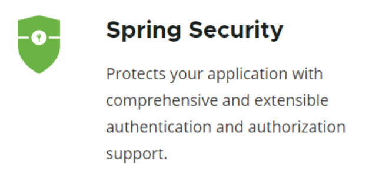

# 2. 安全技术方案对比

​		目前在整个Java开发的系统中，需要用于身份验证和访问控制框架的框架除了SpringSecurity，还有一个就是Apache shiro框架

1. Shiro

   Shiro是一个强大而灵活的开源安全框架，能够非常清晰的处理认证、授权、管理会话以及密码加密。如下是它所具有的特点：

   - 易于理解的Java Security API；
   - 简单的身份认证（登录），支持多种数据源（LDAP，JDBC，Kerberos，ActiveDirectory等）
   - 对角色的简单的鉴权（访问控制），支持细粒度的鉴权；
   - 支持一级缓存，以提升应用程序的性能；
   - 内置的基于POJO企业会话管理，适用于Web以及非Web的环境
   - 异构客户端会话访问
   - 非常简单的加密API
   - 不跟任何的框架或者容器绑定，可以独立运行

2. SpringSecurity

   除了不能脱离Spring，Shiro的功能它都有。而且SpringSecurity对OAuth、OpenID也有支持，Shiro则需要自己手动实现。SpringSecurity的权限粒度更高

   - OAuth在“客户端”与“服务提供商”之间，设置了一个授权层（authorization layer）。“客户端”不能直接登录“服务提供商”，只能登录授权层，以此将用户与客户端区分开来。“客户端”登录授权层所用的令牌（token），与用户的密码不同。用户可以在登录的时候，指定授权层令牌的权限范围和有效期

     “客户端”登录授权层以后，“服务提供商”根据令牌的权限范围和有效期，向“客户端”开放用户存储的资料

   - OpenID系统的第一部分是身份验证，即如何通过URI来认证用户身份。目前的网站都是依靠用户名和密码来登录认证，这就意味着大家在每个网站都需要注册用户名和密码，即便你使用的是同样的密码。如果使用OpenID，你的网站地址（URI）就是你的用户名，而你的密码安全的存储在一个OpenID服务网站上（你可以自己创建一个OpenID服务网站，也可以选择一个可信任的OpenID服务网站来完成注册）

     与OpenID同属性的身份识别服务商还有VIeID，ClaimID，CardSpace，Rapleaf，Trufina ID Card等，其中VIeID通用账户的应用最为广泛


# 3. SpringSecurity框架功能简介

1. 认证：用户登录，解决的是 “你是谁？”
2. 授权：判断用户拥有什么权限，可以访问什么资源，解决的是 “你能干什么？”
3. 安全防护，防止跨站请求，session攻击等


# 4. SpringSecurity应用场景

1. 用户登录，基于传统的web开发的项目的登录功能

   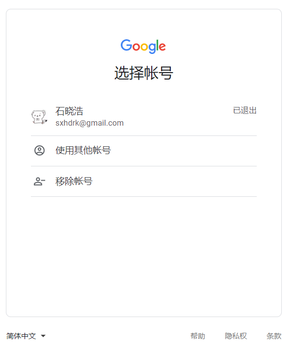

2. 用户授权，在系统中用户拥有哪些操作权限

   

3. 单一登录，一个账号只能在同一时间只能在一个地方进行登录，如果在其他地方进行第二次登录，则剔除之前登录操作

   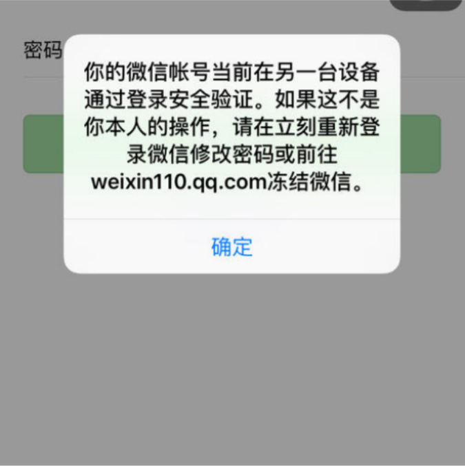

4. 集成CAS，做单点登录，即多个系统只需登录一次，无需重复登录

   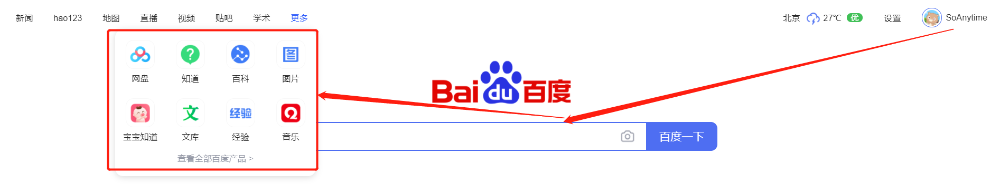

5. 集成OAuth2，做登录授权，可以用于APP登录和第三方登录（QQ，微信等），也可以实现CAS的功能

   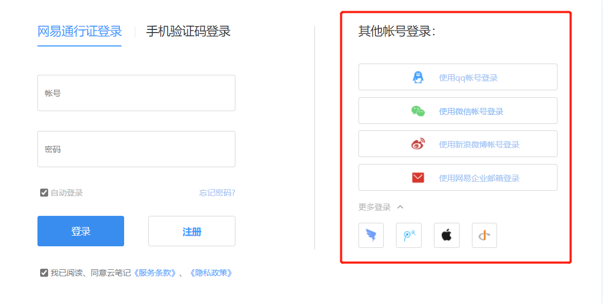


# 5. SpringSecurity入门案例

> 快速体验SpringSecurity功能

1. 创建SpringBoot工程

   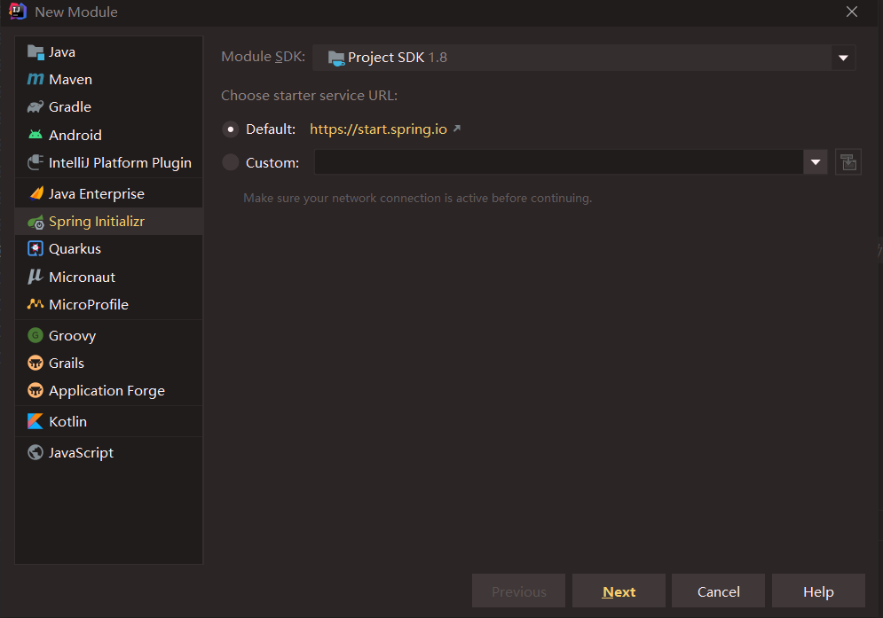

   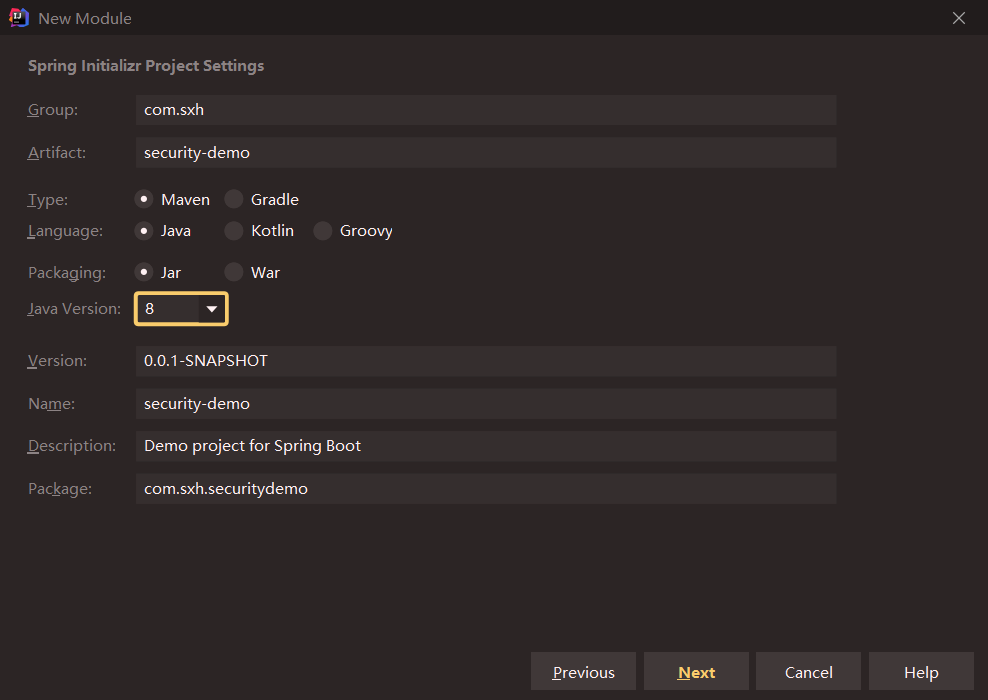

   

   

2. 编写Controller

   ```java
   package com.lagou.controller;
   import org.springframework.web.bind.annotation.RequestMapping;
   import org.springframework.web.bind.annotation.RestController;
   /**
   * security入门案例
   */
   @RestController
   public class HelloSecurityController {
       @RequestMapping("/hello")
       public String hello() {
           return "hello security";
       }
   }
   
   ```

3. 访问http://localhost:8080/hello

   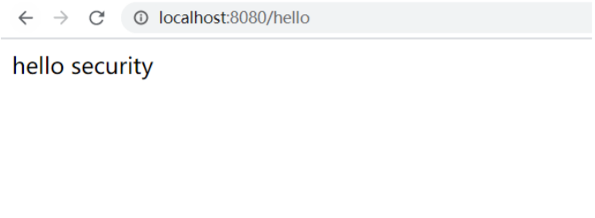

4. 添加SpringSecurity依赖

   ```xml
   <!--添加Spring Security 依赖 -->
   <dependency>
       <groupId>org.springframework.boot</groupId>
       <artifactId>spring-boot-starter-security</artifactId>
   </dependency>
   ```

5. 重启SpringBoot启动类，再次访问http://localhost:8080/hello

   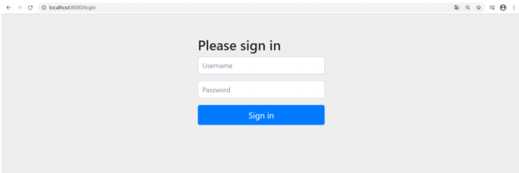

   观察下帮我们生成的表单页面

   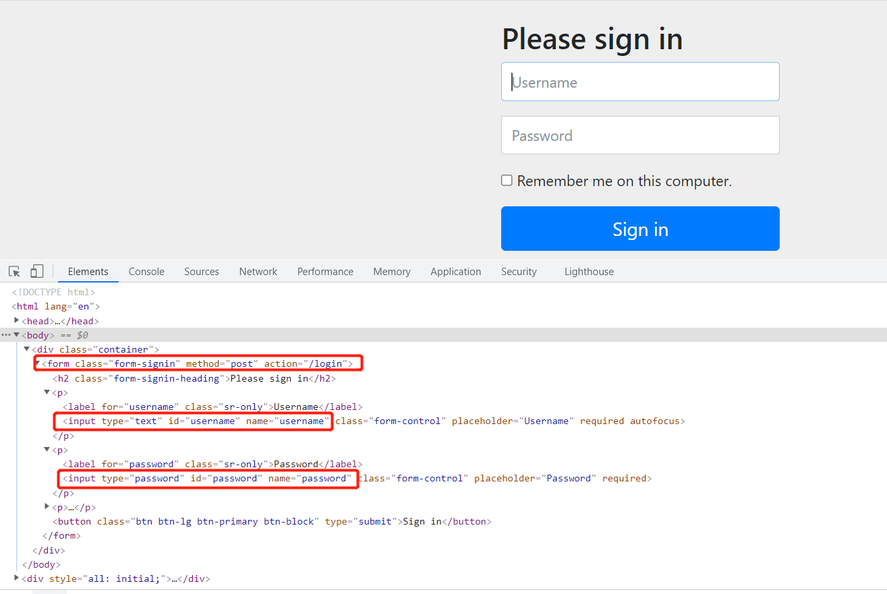

   

   观察页面源码，这里有三点需要注意下：

   - 表单的提交方式和路径：`post`,`/login`
   - input输入项的name值：`username`,`password`
   - 隐藏域input的name值：`_csrf` value值：`b56899ed-0ac7-40e2-b7cc-90ab349c46d6`


SpringBoot已经为SpringSecurity提供了默认配置，默认所有资源都必须认证通过才能访问。那么问题来了！此刻并没有连接数据库，也并未在内存中指定认证用户，如何认证呢？

其实SpringBoot已经提供了默认用户名User，密码在启动项目时随机生成，如图：

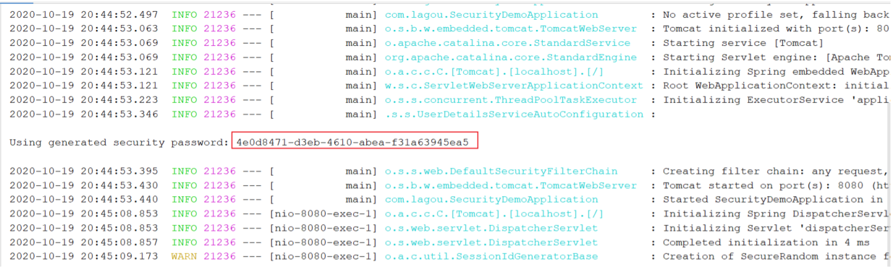

认证通过后可以继续访问处理器资源：


