[toc]

# 1. 案例介绍

> 说明：为了方便，事先准备了一个半成品的后台管理系统，而想要完善另一部分，就需要用到SpringSecurity了


## 1.1 案例效果图

1. 启动项目登录页面

   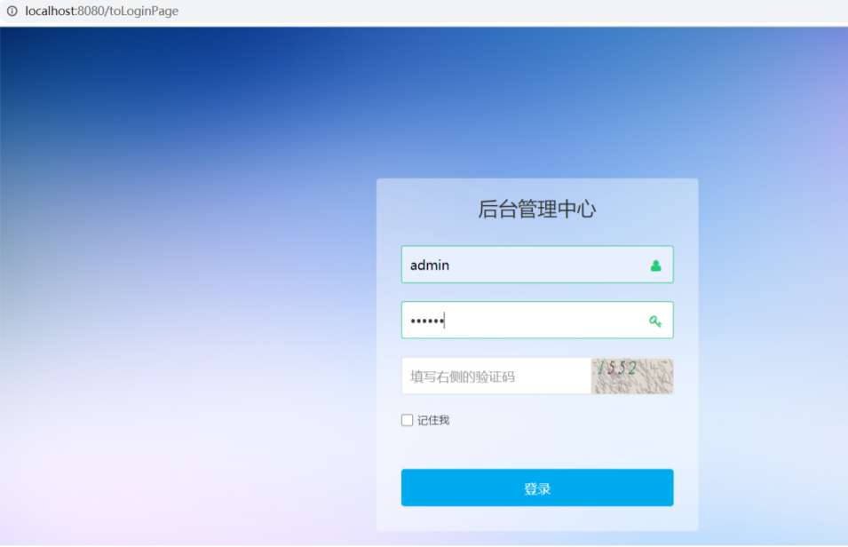

2. 启动项目进入首页

   

3. 系统管理界面

   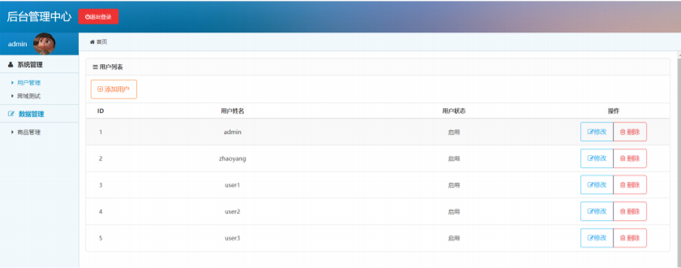

4. 基础数据界面

   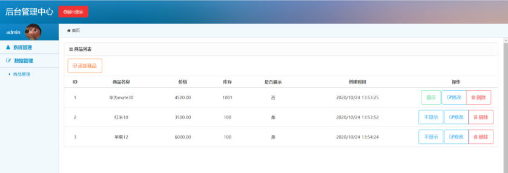

5. 项目最终目录结构

   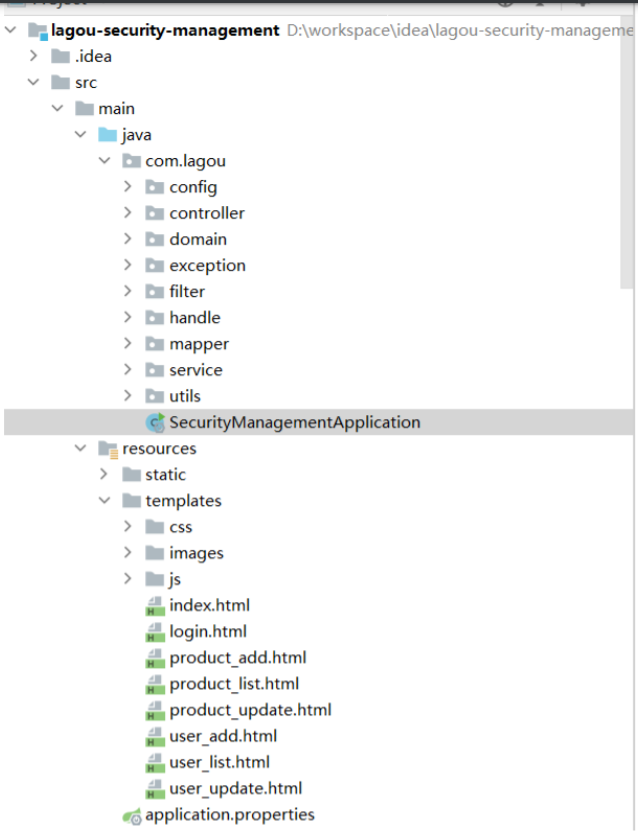

## 1.2 建表语句

```sql
/*
Navicat Premium Data Transfer
Source Server : localhost
Source Server Type : MySQL
Source Server Version : 50540
Source Host : localhost:3306
Source Schema : security_management
Target Server Type : MySQL
Target Server Version : 50540
File Encoding : 65001
Date: 31/10/2020 14:35:33
*/
SET NAMES utf8mb4;
SET FOREIGN_KEY_CHECKS = 0;
-- ----------------------------
-- Table structure for t_permission
-- ----------------------------
DROP TABLE IF EXISTS `t_permission`;
CREATE TABLE `t_permission` (
    `ID` int(11) NOT NULL AUTO_INCREMENT COMMENT '编号',
    `permission_name` varchar(30) CHARACTER SET utf8 COLLATE utf8_general_ci NULL
    DEFAULT NULL COMMENT '权限名称',
    `permission_tag` varchar(30) CHARACTER SET utf8 COLLATE utf8_general_ci NULL
    DEFAULT NULL COMMENT '权限标签',
    `permission_url` varchar(100) CHARACTER SET utf8 COLLATE utf8_general_ci NULL
    DEFAULT NULL COMMENT '权限地址',
    PRIMARY KEY (`ID`) USING BTREE
) ENGINE = InnoDB AUTO_INCREMENT = 9 CHARACTER SET = utf8 COLLATE =
utf8_general_ci ROW_FORMAT = Compact;
-- ----------------------------
-- Records of t_permission
-- ----------------------------
INSERT INTO `t_permission` VALUES (1, '查询所有用户', 'user:findAll',
                                   '/user/findAll');
INSERT INTO `t_permission` VALUES (2, '用户添加或修改', 'user:saveOrUpdate',
                                   '/user/saveOrUpadate');
INSERT INTO `t_permission` VALUES (3, '用户删除', 'user:delete', '/delete/{id}');
INSERT INTO `t_permission` VALUES (4, '根据ID查询用户', 'user:getById',
                                   '/user/{id}');
INSERT INTO `t_permission` VALUES (5, '查询所有商品', 'product:findAll',
                                   '/product/findAll');
INSERT INTO `t_permission` VALUES (6, '商品添加或修改', 'product:saveOrUpdate',
                                   '/product/saveOrUpadate');
INSERT INTO `t_permission` VALUES (7, '商品删除', 'product:delete',
                                   '/product//delete/{id}');
INSERT INTO `t_permission` VALUES (8, '商品是否显示', 'product:show',
                                   '/product/show/{id}/{isShow}');
-- ----------------------------
-- Table structure for t_product
-- ----------------------------
DROP TABLE IF EXISTS `t_product`;
CREATE TABLE `t_product` (
    `id` int(11) NOT NULL AUTO_INCREMENT COMMENT 'id',
    `name` varchar(50) CHARACTER SET utf8 COLLATE utf8_bin NULL DEFAULT NULL
    COMMENT '商品名称',
    `price` decimal(10, 2) NULL DEFAULT NULL COMMENT '商品价格',
    `stock` int(11) NULL DEFAULT NULL COMMENT '库存',
    `is_show` tinyint(4) NULL DEFAULT NULL COMMENT '是否展示',
    `create_time` datetime NULL DEFAULT NULL COMMENT '创建时间',
    PRIMARY KEY (`id`) USING BTREE
) ENGINE = InnoDB AUTO_INCREMENT = 4 CHARACTER SET = utf8 COLLATE = utf8_bin
ROW_FORMAT = Compact;
-- ----------------------------
-- Records of t_product
-- ----------------------------
INSERT INTO `t_product` VALUES (1, '华为mate30', 4500.00, 1001, 0, '2020-10-24
                                13:53:25');
INSERT INTO `t_product` VALUES (2, '红米10', 3500.00, 100, 1, '2020-10-24
                                13:53:52');
INSERT INTO `t_product` VALUES (3, '苹果12', 6000.00, 100, 1, '2020-10-24
                                13:54:24');
-- ----------------------------
-- Table structure for t_role
-- ----------------------------
DROP TABLE IF EXISTS `t_role`;
CREATE TABLE `t_role` (
    `ID` int(11) NOT NULL AUTO_INCREMENT COMMENT '编号',
    `ROLE_NAME` varchar(30) CHARACTER SET utf8 COLLATE utf8_general_ci NULL
    DEFAULT NULL COMMENT '角色名称',
    `ROLE_DESC` varchar(60) CHARACTER SET utf8 COLLATE utf8_general_ci NULL
    DEFAULT NULL COMMENT '角色描述',
    PRIMARY KEY (`ID`) USING BTREE
) ENGINE = InnoDB AUTO_INCREMENT = 6 CHARACTER SET = utf8 COLLATE =
utf8_general_ci ROW_FORMAT = Compact;
-- ----------------------------
-- Records of t_role
-- ----------------------------
INSERT INTO `t_role` VALUES (1, 'ADMIN', '超级管理员');
INSERT INTO `t_role` VALUES (2, 'USER', '用户管理');
INSERT INTO `t_role` VALUES (3, 'PRODUCT', '商品管理员');
INSERT INTO `t_role` VALUES (4, 'PRODUCT_INPUT', '商品录入员');
INSERT INTO `t_role` VALUES (5, 'PRODUCT_SHOW', '商品审核员');
-- ----------------------------
-- Table structure for t_role_permission
-- ----------------------------
DROP TABLE IF EXISTS `t_role_permission`;
CREATE TABLE `t_role_permission` (
    `RID` int(11) NOT NULL COMMENT '角色编号',
    `PID` int(11) NOT NULL COMMENT '权限编号',
    PRIMARY KEY (`RID`, `PID`) USING BTREE,
    INDEX `FK_Reference_12`(`PID`) USING BTREE,
    CONSTRAINT `FK_Reference_11` FOREIGN KEY (`RID`) REFERENCES `t_role` (`ID`) ON
    DELETE RESTRICT ON UPDATE RESTRICT,
    CONSTRAINT `FK_Reference_12` FOREIGN KEY (`PID`) REFERENCES `t_permission`
    (`ID`) ON DELETE RESTRICT ON UPDATE RESTRICT
) ENGINE = InnoDB CHARACTER SET = utf8 COLLATE = utf8_general_ci ROW_FORMAT =
Compact;
-- ----------------------------
-- Records of t_role_permission
-- ----------------------------
INSERT INTO `t_role_permission` VALUES (1, 1);
INSERT INTO `t_role_permission` VALUES (2, 1);
INSERT INTO `t_role_permission` VALUES (1, 2);
INSERT INTO `t_role_permission` VALUES (2, 2);
INSERT INTO `t_role_permission` VALUES (1, 3);
INSERT INTO `t_role_permission` VALUES (2, 3);
INSERT INTO `t_role_permission` VALUES (1, 4);
INSERT INTO `t_role_permission` VALUES (2, 4);
INSERT INTO `t_role_permission` VALUES (1, 5);
INSERT INTO `t_role_permission` VALUES (3, 5);
INSERT INTO `t_role_permission` VALUES (4, 5);
INSERT INTO `t_role_permission` VALUES (5, 5);
INSERT INTO `t_role_permission` VALUES (1, 6);
INSERT INTO `t_role_permission` VALUES (3, 6);
INSERT INTO `t_role_permission` VALUES (4, 6);
INSERT INTO `t_role_permission` VALUES (1, 7);
INSERT INTO `t_role_permission` VALUES (3, 7);
INSERT INTO `t_role_permission` VALUES (4, 7);
INSERT INTO `t_role_permission` VALUES (1, 8);
INSERT INTO `t_role_permission` VALUES (3, 8);
INSERT INTO `t_role_permission` VALUES (5, 8);
-- ----------------------------
-- Table structure for t_user
-- ----------------------------
DROP TABLE IF EXISTS `t_user`;
CREATE TABLE `t_user` (
    `id` int(11) NOT NULL AUTO_INCREMENT,
    `username` varchar(50) CHARACTER SET utf8 COLLATE utf8_bin NULL DEFAULT NULL,
    `password` varchar(100) CHARACTER SET utf8 COLLATE utf8_bin NULL DEFAULT NULL,
    `status` int(1) NULL DEFAULT NULL COMMENT '用户状态1-启用 0-关闭',
    PRIMARY KEY (`id`) USING BTREE
) ENGINE = InnoDB AUTO_INCREMENT = 6 CHARACTER SET = utf8 COLLATE = utf8_bin
ROW_FORMAT = Compact;
-- ----------------------------
-- Records of t_user
-- ----------------------------
INSERT INTO `t_user` VALUES (1, 'admin',
                             '$2a$10$m8WqgTzr0TO.XG.aR91.jegJJmDnGSvWs69aMWPR.WNvCzemHpLum', 1);
INSERT INTO `t_user` VALUES (2, 'zhaoyang',
                             '$2a$10$m8WqgTzr0TO.XG.aR91.jegJJmDnGSvWs69aMWPR.WNvCzemHpLum', 1);
INSERT INTO `t_user` VALUES (3, 'user1',
                             '$2a$10$m8WqgTzr0TO.XG.aR91.jegJJmDnGSvWs69aMWPR.WNvCzemHpLum', 1);
INSERT INTO `t_user` VALUES (4, 'user2',
                             '$2a$10$m8WqgTzr0TO.XG.aR91.jegJJmDnGSvWs69aMWPR.WNvCzemHpLum', 1);
INSERT INTO `t_user` VALUES (5, 'user3',
                             '$2a$10$Wk1jWJPoMQ5s7UIp0S/tu.WTcUZUspUUQH6K3BQpa8uHXWRUQc3/a', 1);
-- ----------------------------
-- Table structure for t_user_role
-- ----------------------------
DROP TABLE IF EXISTS `t_user_role`;
CREATE TABLE `t_user_role` (
    `UID` int(11) NOT NULL COMMENT '用户编号',
    `RID` int(11) NOT NULL COMMENT '角色编号',
    PRIMARY KEY (`UID`, `RID`) USING BTREE,
    INDEX `FK_Reference_10`(`RID`) USING BTREE,
    CONSTRAINT `FK_Reference_10` FOREIGN KEY (`RID`) REFERENCES `t_role` (`ID`) ON
    DELETE RESTRICT ON UPDATE RESTRICT,
    CONSTRAINT `FK_Reference_9` FOREIGN KEY (`UID`) REFERENCES `t_user` (`id`) ON
    DELETE RESTRICT ON UPDATE RESTRICT
) ENGINE = InnoDB CHARACTER SET = utf8 COLLATE = utf8_general_ci ROW_FORMAT =
Compact;
-- ----------------------------
-- Records of t_user_role
-- ----------------------------
INSERT INTO `t_user_role` VALUES (1, 1);
INSERT INTO `t_user_role` VALUES (2, 2);
INSERT INTO `t_user_role` VALUES (3, 4);
INSERT INTO `t_user_role` VALUES (4, 5);
SET FOREIGN_KEY_CHECKS = 1;

```


## 1.3 工程导入

> 将工程导入IDEA，配置Maven和POM文件即可启动

## 1.4 pom文件

```xml
<?xml version="1.0" encoding="UTF-8"?>
<project xmlns="http://maven.apache.org/POM/4.0.0"
         xmlns:xsi="http://www.w3.org/2001/XMLSchema-instance"
         xsi:schemaLocation="http://maven.apache.org/POM/4.0.0
                             https://maven.apache.org/xsd/maven-4.0.0.xsd">
    <modelVersion>4.0.0</modelVersion>
    <parent>
        <groupId>org.springframework.boot</groupId>
        <artifactId>spring-boot-starter-parent</artifactId>
        <version>2.3.4.RELEASE</version>
        <relativePath/> <!-- lookup parent from repository -->
    </parent>
    <groupId>com.lagou</groupId>
    <artifactId>lagou-security-management</artifactId>
    <version>0.0.1-SNAPSHOT</version>
    <name>lagou-security-management</name>
    <description>lagou-security-management</description>
    <properties>
        <java.version>11</java.version>
    </properties>
    <dependencies>
        <!--添加thymeleaf依赖 -->
        <dependency>
            <groupId>org.springframework.boot</groupId>
            <artifactId>spring-boot-starter-thymeleaf</artifactId>
        </dependency>
        <!--添加web依赖 -->
        <dependency>
            <groupId>org.springframework.boot</groupId>
            <artifactId>spring-boot-starter-web</artifactId>
        </dependency>
        <!--添加热部署依赖 -->
        <dependency>
            <groupId>org.springframework.boot</groupId>
            <artifactId>spring-boot-devtools</artifactId>
            <scope>runtime</scope>
            <optional>true</optional>
        </dependency>
        <!--添加lombok 依赖 -->
        <dependency>
            <groupId>org.projectlombok</groupId>
            <artifactId>lombok</artifactId>
            <optional>true</optional>
        </dependency>
        <!--添加mp 依赖 -->
        <dependency>
            <groupId>com.baomidou</groupId>
            <artifactId>mybatis-plus-boot-starter</artifactId>
            <version>3.3.2</version>
        </dependency>
        <!--添加mysql 依赖 -->
        <dependency>
            <groupId>mysql</groupId>
            <artifactId>mysql-connector-java</artifactId>
            <version>5.1.21</version>
        </dependency>
        <!--添加redis 依赖 -->
        <dependency>
            <groupId>org.springframework.boot</groupId>
            <artifactId>spring-boot-starter-data-redis</artifactId>
        </dependency>
    </dependencies>
    <build>
        <plugins>
            <plugin>
                <groupId>org.springframework.boot</groupId>
                <artifactId>spring-boot-maven-plugin</artifactId>
            </plugin>
        </plugins>
    </build>
</project>
```


# 2. SpringSecurity认证基本原理与认证2种方式

在已导入的工程中添加SpringSecurity的依赖

```xml
<!--添加Spring Security 依赖 -->
<dependency>
    <groupId>org.springframework.boot</groupId>
    <artifactId>spring-boot-starter-security</artifactId>
</dependency>
```

在使用SpringSecurity框架，改框架会默认自动地替我们将系统中的资源进行保护，每次访问资源的时候都必须经过一层身份的校验，如果通过了则重定向到我们输入的url中，否则访问是要被拒绝的。那么SpringSecurity框架是如何实现的呢？**SpringSecurity功能的实现主要是由一系列过滤器相互配合完成，也称之为过滤器链**

## 2.1 过滤器链介绍


过滤器是一种典型的AOP思想，下面简单了解下这些过滤器链，后续在源码剖析中再自习讲解

1. org.springframework.security.web.context.request.async.WebAsyncManagerIntegrationFilter

   > 根据请求封装获取WebAsyncManager，从WebAsyncManager获取/注册的安全上下文可调用处理拦截器

2. org.springframework.security.web.context.SecurityContextPersistenceFilter

   > SecurityContextPersistenceFilter主要是使用SecurityContextRepository在session中保存或更新一个SecurityContext，并将SecurityContext给以后的过滤器使用，来为后续filter建立所需的上下文。SecurityContext中存储了当前用户的认证以及权限信息

3. org.springframework.security.web.header.HeaderWriterFilter

   > 向请求的Header中添加相应的信息，可在http标签内部使用security:header来控制

4. . org.springframework.security.web.csrf.CsrfFilter

   > csrf又称跨域请求伪造，SpringSecurity会对所有post请求验证是否包含系统生成的csrf的token信息，如果不包含，则报错。起到防止csrf攻击的效果

5. org.springframework.security.web.authentication.logout.LogoutFilter

   > 匹配URL为/logout 的请求，实现用户退出，清除认证信息

6. org.springframework.security.web.authentication.UsernamePasswordAuthenticationFilter

   > 表单认证操作全靠这个过滤器，默认匹配URL为/login 且必须为POST请求

7. org.springframework.security.web.authentication.ui.DefaultLoginPageGeneratingFilter

   > 如果没有在配置文件中指定认证页面，则由改过滤器生成一个默认认证页面

8. org.springframework.security.web.authentication.ui.DefaultLogoutPageGeneratingFilter

   > 由此过滤器可以生产一个默认的退出登录页面

9. org.springframework.security.web.authentication.www.BasicAuthenticationFilter

   > 此过滤器会自动解析HTTP请求中拓头部名字为Authentication，且以Basic开头的头信息

10. org.springframework.security.web.savedrequest.RequestCacheAwareFilter

    > 通过HttpSessionRequestCache内部维护了一个RequestCache，用于缓存HttpServletRequest

11. org.springframework.security.web.servletapi.SecurityContextHolderAwareRequestFilter

    > 针对ServletRequest进行了一次包装，使得request具有更加丰富的API

12. org.springframework.security.web.authentication.AnonymousAuthenticationFilter

    > 当SecurityContextHolder中认证信息为空，则会创建一个匿名用户存入到SecurityContextHolder中，SpringSecurity为了兼容未登录的访问，也走了一套认证流程，只不过是一个匿名的身份

13. org.springframework.security.web.session.SessionManagementFilter

    > SecurityContextRepository 限制同一用户开启多个会话的数量

14. org.springframework.security.web.access.ExceptionTranslationFilter

    > 异常转换过滤器位于整个SpringSecurityFilterChain的后方，用来转换整个链路中出现的异常

15. org.springframework.security.web.access.intercept.FilterSecurityInterceptor

    > 获取所配置资源访问的授权信息，根据SecurityContextHolder中存储的用户信息来决定其是否有权限

SpringSecurity默认加载15个过滤器，但是随着配置可以增加或删除一些过滤器


## 2.3 认证方式

### 2.3.1 HttpBasic认证

​		HttpBasic登录验证模式是SpringSecurity实现登录验证最简单的一种方式，也可以说是最简陋的一种方式。它的目的并不是保障登录验证的绝对安全，而是提供一种“防君子不防小人”的登录验证。

​		在使用SpringBoot早期版本为1.x版本，依赖的Security 4.x 版本，那么就无需任何配置，启动项目访问则会弹出默认的HttpBasic认证。现在使用的是SpringBoot 2.0 以上版本（依赖Security 5.x版本），HttpBasic不再是默认的验证模式，在SpringSecurity 5.x 默认的验证模式已经是表单模式。

​		HttpBasic模式要求传输的用户名密码使用Base64模式进行加密，如果用户名是`admin`，密码是`admin`，则将字符串`admin:admin"`使用Base64编码算法加密。加密结果可能是`YWtaW46YWRtaW4=`。HttpBasic默认真的是非常简单又简陋的验证模式，Base64的加密算法是可逆的，想要破解并不难

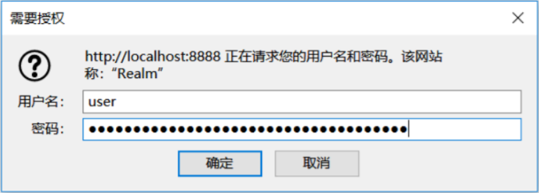


### 2.3.1 FormLogin 登录认证

​		SpringSecurity的HttpBasic模式，改模式比较简单，只进行了通过携带Http的Header进行简单的登录验证，而且没有定制的登录页面，所以使用场景比较窄。对于一个完整的应用系统，与登录验证相关的页面都是高度定制化的，非常美观而且提供了多种登录方式。这就需要SpringSecurity支持我们自己定制登录页面，SpringBoot2.x以上版本（依赖Security5.x版本）默认会生成一个登陆页面


# 3. 表单认证

## 3.1 自定义表单登录页面

在config包下编写SecurityConfig配置类

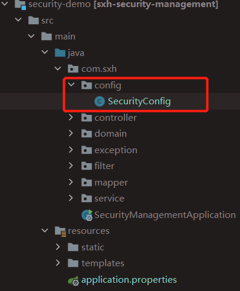

```java
package com.sxh.config;

import com.sxh.filter.ValidateCodeFilter;
import com.sxh.service.impl.MyAuthenticationService;
import com.sxh.service.impl.MyUserDetailsService;
import org.springframework.beans.factory.annotation.Autowired;
import org.springframework.context.annotation.Bean;
import org.springframework.context.annotation.Configuration;
import org.springframework.security.config.annotation.authentication.builders.AuthenticationManagerBuilder;
import org.springframework.security.config.annotation.web.builders.HttpSecurity;
import org.springframework.security.config.annotation.web.builders.WebSecurity;
import org.springframework.security.config.annotation.web.configuration.WebSecurityConfigurerAdapter;
import org.springframework.security.web.authentication.UsernamePasswordAuthenticationFilter;
import org.springframework.security.web.authentication.rememberme.JdbcTokenRepositoryImpl;
import org.springframework.security.web.authentication.rememberme.PersistentTokenRepository;

/**
* security配置类
*/
@Configuration
public class SecurityConfig extends WebSecurityConfigurerAdapter {


    /**
     * http 请求方法
     *
     * @param http
     * @throws Exception
     */
    @Override
    protected void configure(HttpSecurity http) throws Exception {

        /*http.httpBasic() // 开启HttpBasic认证
                .and().authorizeRequests()
                .anyRequest().authenticated();//所有请求都需要登录认证才能访问*/

        http.formLogin() // 开启表单认证
            .and().authorizeRequests()
            .anyRequest().authenticated();//所有请求都需要登录认证才能访问;
    }

}
```


**问题一：localhost将您重定向的次数过多**

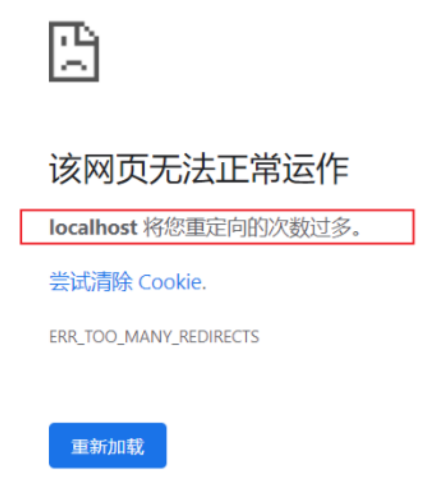

因为设置登录页面为login.html 后面配置的是多有请求都登陆认证，陷入了死循环，所以需要将login.html放行不需要登录认证

```java
http.formLogin().loginPage("/login.html")//开启表单认证
    .and().authorizeRequests()
    .antMatchers("/login.html").permitAll()//放行登录页面
    .anyRequest().authenticated();//所有请求都需要登录认证才能访问;
```


**问题二：访问login.html 报404错误**

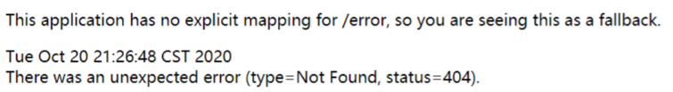

SpringBoot整合thymeleaf之后，所有的静态页面放在`resources/templates`下面，所以得通过请求访问到模板页面，将`/login.html`修改为`/toLoginPage`

```java
http.formLogin().loginPage("/toLoginPage")//开启表单认证
    .and().authorizeRequests()
    .antMatchers("/toLoginPage").permitAll()//放行登录页面
    .anyRequest().authenticated();//所有请求都需要登录认证才能访问;
```


**问题三：访问login.html 后发现页面没有相关样式**

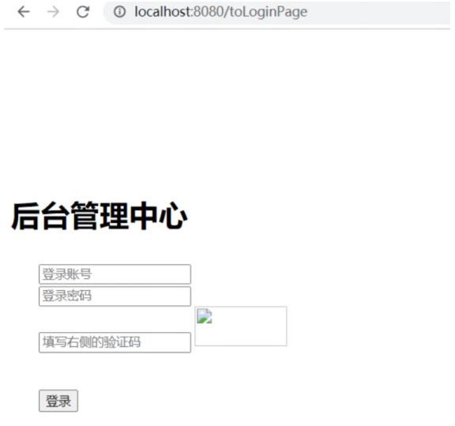

因为访问login.html 需要一些js，css，image等静态资源信息，所以需要将静态资源放行，不需要认证

```java
/**
* WebSecurity
*
* @param web
* @throws Exception
*/
@Override
public void configure(WebSecurity web) throws Exception {
    //解决静态资源被拦截的问题
    web.ignoring().antMatchers(
        "/css/**", 
        "/images/**", 
        "/js/**",
        "/favicon.ico"
    );
}

```

SpringSecurity中，安全构建器`HttpSecurity`和`webSecurity`的区别是：

1. `webSecurity`不仅通过`httpSecurity`定义某些请求的安全控制，也通过其他方式定义某些请求可以忽略安全控制
2. `httpSecurity`仅用于定义需要安全控制的请求（当然`httpSecurity`也可以指定某些请求不需要安全控制）
3. 可以人为`httpSecurity`是`webSecurity`的一部分，`webSecurity`是包含`httpSecurity`的更大的一个概念
4. 构建目标不同
   - webSecurity构建目标是整个SpringSecurity安全过滤器`FilterChainProxy`
   - httpSecurity的构建目标仅仅是`FilterChainProxy`中的一个`SecurityFilterChain`

## 3.2 表单登录

​		通过讲解过滤器链中我们知道有个过滤器UsernamePasswordAuthenticationFilter是处理表单登录的，观察源码了解改过滤器

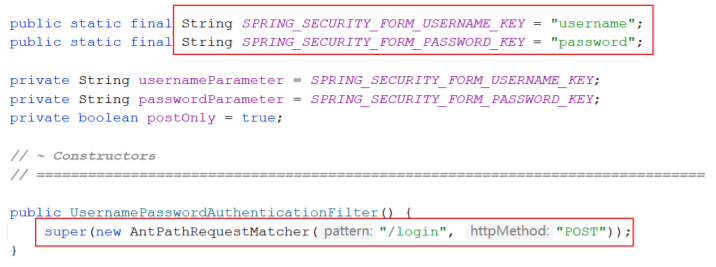

​		在源码中可以观察到，表单中的input的name值是username和password，并且表单提交的路径为`/login`，表单提交方式method为`post`，这些可以修改为自定义的值。

代码如下：

```java
/**
* http请求处理方法
*
* @param http
* @throws Exception
*/
@Override
protected void configure(HttpSecurity http) throws Exception {
    http.formLogin()//开启表单认证
        .loginPage("/toLoginPage")//自定义登录页面
        .loginProcessingUrl("/login")// 登录处理Url
        .usernameParameter("username").passwordParameter("password") //修改自定义表单name值
        .successForwardUrl("/")// 登录成功后跳转路径
        .and().authorizeRequests()
        .antMatchers("/toLoginPage").permitAll()//放行登录页面
        .anyRequest().authenticated();//所有请求都需要登录认证才能访问;


    http..csrf().disable(); // 关闭csrf防护
}
```

页面代码：

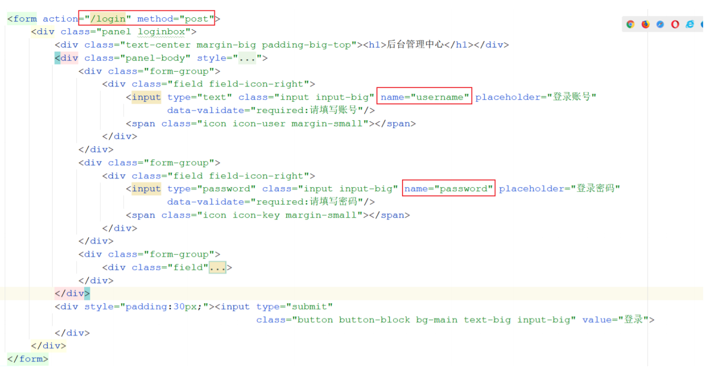

代码修改后重启完成登录：

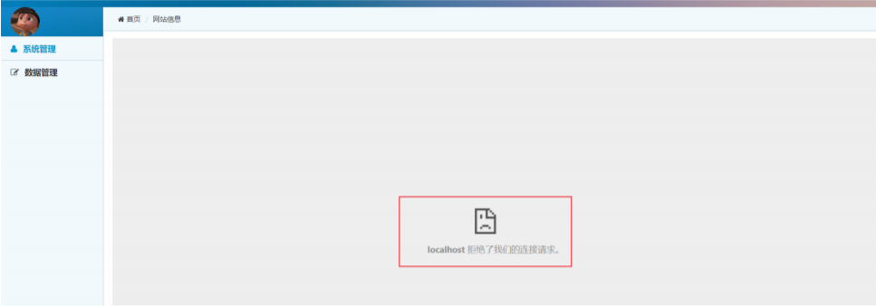

这个时候又出现新的问题，这个是什么原因呢？我们来看出现问题的据图是哪里？

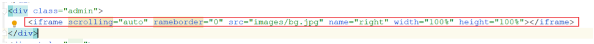

发现行内框架iframe这里出现问题了，SpringSecurity下，X-Frame-Options默认为DENY，非SpringSecurity环境下，X-Frame-Options的默认大多也是deny，这种情况下，浏览器拒绝当前页面加载任何Frame页面，设置含义如下：

- DENY：浏览器拒绝当前页面加载任何Frame页面，此选项是默认的
- SAMEORIGIN：Frame页面的地址只能为同源域名下的页面

允许iframe加载

```java
http.formLogin()//开启表单认证
    .loginPage("/toLoginPage")//自定义登录页面
    .loginProcessingUrl("/login")// 登录处理Url
    .usernameParameter("username").passwordParameter("password") //修改自定义表单name值.
    .successForwardUrl("/")// 登录成功后跳转路径
    .and().authorizeRequests()
    .antMatchers("/toLoginPage").permitAll()//放行登录页面与静态资源
    .anyRequest().authenticated();//所有请求都需要登录认证才能访问;

// 关闭csrf防护
http.csrf().disable();

// 允许iframe加载页面
http.headers().frameOptions().sameOrigin();
```


## 3.3 基于数据库实现认证功能

​		之前我们所使用的用户名和密码是来源于框架自动生成的，那么我们如何实现基于数据库中的用户名和密码功能呢？要实现这个得需要实现Security的一个UserDetailsService接口，重写这个接口里面loadUserByUsername即可

> 编写MyUserDetailsService并实现UserDetailsService接口，重写loadUserByUsername方法

```java
package com.sxh.service.impl;

import com.sxh.domain.User;
import com.sxh.service.UserService;
import org.springframework.beans.factory.annotation.Autowired;
import org.springframework.security.core.GrantedAuthority;
import org.springframework.security.core.userdetails.UserDetails;
import org.springframework.security.core.userdetails.UserDetailsService;
import org.springframework.security.core.userdetails.UsernameNotFoundException;
import org.springframework.security.crypto.bcrypt.BCryptPasswordEncoder;
import org.springframework.security.crypto.scrypt.SCryptPasswordEncoder;
import org.springframework.stereotype.Service;

import java.util.ArrayList;
import java.util.Collection;

/**
 * 基于数据库完成认证
 */

@Service
public class MyUserDetailsService implements UserDetailsService {


    @Autowired
    private UserService userService;

    /**
     * 根据用户名查询用户
     *
     * @param username 前端传入的用户名
     * @return
     * @throws UsernameNotFoundException
     */
    @Override
    public UserDetails loadUserByUsername(String username) throws UsernameNotFoundException {
        User user = userService.findByUsername(username);
        if (user == null) {
            // return null;
            throw new UsernameNotFoundException("用户没有找到，" + username);
        }
        Collection<? extends GrantedAuthority> authorities = new ArrayList<>();// 权限集合
        UserDetails userDetails = new org.springframework.security.core.userdetails.User
            (username,
             "{noop}" + user.getPassword(),// {noop} 不使用密码加密 {bcrypt}使用crypt算法
             true, // 用户是否启用
             true, // 用户是否过期 True：没有过期
             true, // 用户凭证是否过期 True：没有过期
             true, // 用户是否锁定 True：未锁定
             authorities
            );

        return userDetails;
    }
}
```

> 在SecurityConfig配置类中指定自定义用户认证

```java
@Autowired
private MyUserDetailsService myUserDetailsService;


/**
 * 身份安全管理器
 *
 * @param auth
 * @throws Exception
 */
@Override
protected void configure(AuthenticationManagerBuilder auth) throws Exception {
    auth.userDetailsService(myUserDetailsService);// 使用自定义用户认证
}
```


## 3.4 密码加密认证

​		在基于数据库完成用户登录的过程中，我们所使用的密码是明文，规则是通过密码明文添加`{noop}`前缀。那么下面SpringSecurity中的密码编码进行一些探讨

​		SpringSecurity中`PasswordEncoder`就是我们对密码进行编码的工具接口。该接口只有两个功能：一个是**匹配验证**，另一个是**密码编码**

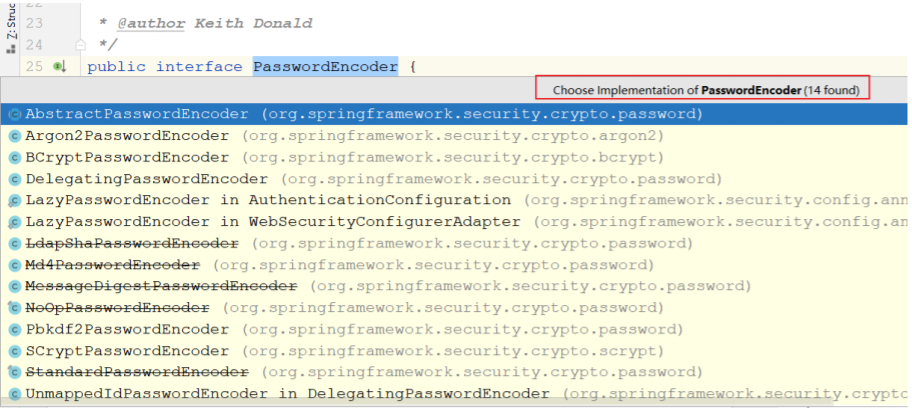


> BCrypt 算法介绍

​		任何应用考虑到安全，决不能明文的方式保存密码。密码应该通过哈希算法进行加密。有很多标准的算法比如SHA或者MD5，结合salt（盐）是一个不错的选择。SpringSecurity提供了BCrypPasswordEncoder类，实现Spring的PasswordEncoder接口使用BCrypt强哈希方法来加密密码。**BCrypt强哈希方法，每次加密的结果都不一样，所以更加的安全**

​		BCrypt算法相对来说是运算比较慢的算法，在密码学界有句常话：越慢的算法越安全。黑客破解成本越高，通过salt和const这两个值来减缓加密过程，它的加密时间（百ms级）远远超过md5（大概1ms左右）。对于计算机来说，BCrypt的计算速度很慢，但对于用户来说，这个过程不算慢。BCrypt是单向的，而且经过salt和const的处理，使其受攻击破解的概率大大降低，同时破解的难度也提升不少，相对于MD5等加密方式更加安全，而且使用也比较简单

**BCrypt加密后的字符串形如：**

`$2a$10$wouq9P/HNgvYj2jKtUN8rOJJNRVCWvn1XoWy55N3sCkEHZPo3lyWq`

> 其中$是分隔符，无意义
>
> 2a 是BCrypt加密版本号
>
> 10是const的值
>
> 后面22位是salt值；再然后的字符串就是密码的密文了
>
> 这里的const值即生成salt的迭代次数，默认值是10，推荐值12


### 在项目中使用BCrypt

首先看下PasswordEncoderFactories密码工厂

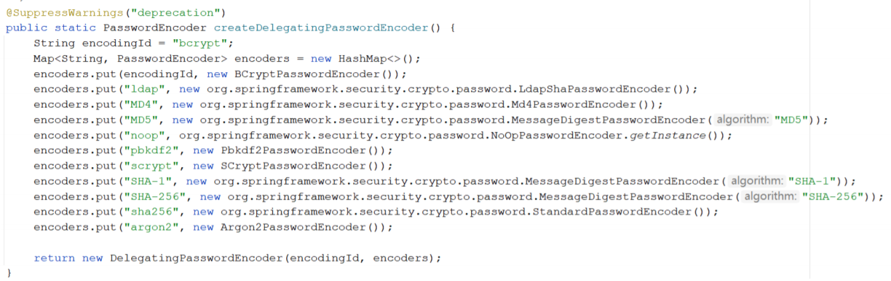

之前我们在项目中密码使用的是明文是`{noop}`，代表不加密使用明文密码，现在用BCrypt只需要将`{noop}`换成`{bcrypt}`即可

```java
package com.sxh.service.impl;

import com.sxh.domain.User;
import com.sxh.service.UserService;
import org.springframework.beans.factory.annotation.Autowired;
import org.springframework.security.core.GrantedAuthority;
import org.springframework.security.core.userdetails.UserDetails;
import org.springframework.security.core.userdetails.UserDetailsService;
import org.springframework.security.core.userdetails.UsernameNotFoundException;
import org.springframework.security.crypto.bcrypt.BCryptPasswordEncoder;
import org.springframework.security.crypto.scrypt.SCryptPasswordEncoder;
import org.springframework.stereotype.Service;

import java.util.ArrayList;
import java.util.Collection;

/**
 * 基于数据库完成认证
 */

@Service
public class MyUserDetailsService implements UserDetailsService {


    @Autowired
    private UserService userService;

    /**
     * 根据用户名查询用户
     *
     * @param username 前端传入的用户名
     * @return
     * @throws UsernameNotFoundException
     */
    @Override
    public UserDetails loadUserByUsername(String username) throws UsernameNotFoundException {
        User user = userService.findByUsername(username);
        if (user == null) {
            // return null;
            throw new UsernameNotFoundException("用户没有找到，" + username);
        }
        Collection<? extends GrantedAuthority> authorities = new ArrayList<>();// 权限集合
        UserDetails userDetails = new org.springframework.security.core.userdetails.User
            (username,
             "{bcrypt}" + user.getPassword(),// {noop} 不使用密码加密 {bcrypt}使用crypt算法
             true, // 用户是否启用
             true, // 用户是否过期 True：没有过期
             true, // 用户凭证是否过期 True：没有过期
             true, // 用户是否锁定 True：未锁定
             authorities
            );

        return userDetails;
    }
}
```

### 将数据库中明文的密码改为加密后的密码

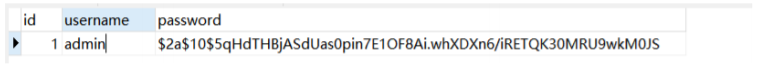

## 3.5 获取当前登录用户

​		在传统web系统中，我们将系统登录成功的用户放入session中，在需要的时候可以从session中获取用户，那么SpringSecurity中我们如何获取当前已经登录的用户呢？

- SecurityContextHolder

  保留系统当前的安全上下文SecurityContext，其中就包括当前使用系统的用户的信息

- SecurityContext

  安全上下文，获取当前经过身份验证的主体或身份验证请求令牌

**代码实现：**

```java
/**
* 获取当前登录用户
*/
@GetMapping("/loginUser1")
@ResponseBody
public UserDetails getCurrentUser1(){
    SecurityContext context = SecurityContextHolder.getContext();
    Authentication authentication = context.getAuthentication();
    UserDetails userDetails = (UserDetails) authentication.getPrincipal();// 获取认证信息
    return userDetails;
}
```

除了上述方法，SpringSecurity还提供了2中方式可以获取

```java
/**
     * 获取当前登录用户
     */
@GetMapping("/loginUser2")
@ResponseBody
public UserDetails getCurrentUser2(Authentication authentication){
    UserDetails userDetails = (UserDetails) authentication.getPrincipal();
    return userDetails;
}

/**
     * 获取当前登录用户
     */
@GetMapping("/loginUser3")
@ResponseBody
public UserDetails getCurrentUser3(@AuthenticationPrincipal UserDetails userDetails){
    return userDetails;
}

```


## 3.6 Remember me 记住我

​		在大多数网站中，都会实现RememberMe这个功能，方便用户在下一次登录时直接登录，避免再次输入用户名以及密码去登录，SpringSecurity针对这个功能已经帮我们实现。

### 3.6.1 简单的Token生成方法

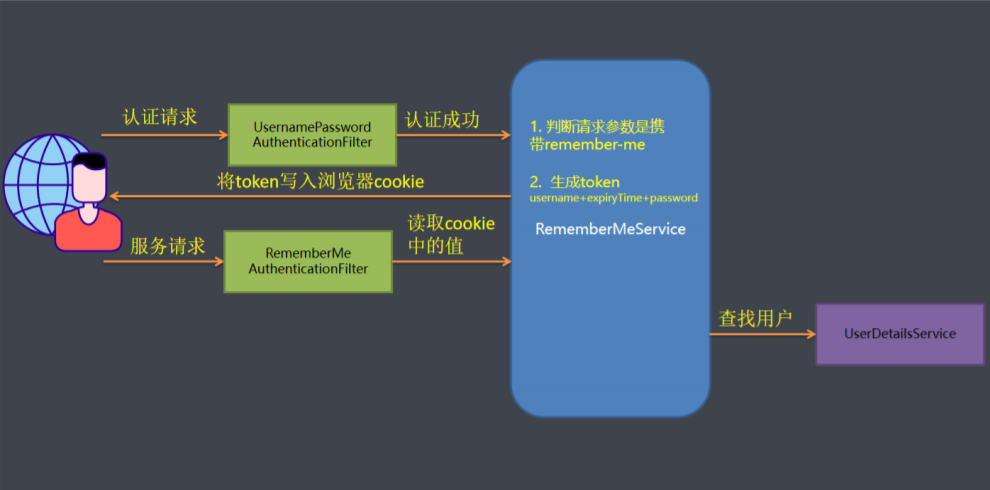

Token = MD5(username+分隔符+expiryTime+分隔符+password)

**注意：这种方式不推荐使用，有严重的安全问题，就是密码信息在前端浏览器的cookie中存放，如果cookie被盗取很容易被破解**

> 代码实现：

1. 前端页面需要增加remember-me复选框

   ```html
   <div class="form-group">
       <div >
           <!--记住我 name为remember-me value值可选true yes 1 on 都行-->
           <input type="checkbox" name="remember-me" value="true"/>记住我
       </div>
   </div>
   
   ```

   

2. 后台代码开启remember-me功能

   ```java
   http.formLogin() // 开启表单认证
       .loginPage("/toLoginPage") // 自定义登录页面
       .loginProcessingUrl("/login") //表单提交的路径
       .usernameParameter("username")
       .passwordParameter("password") // 自定义 input的name值
       .successForwardUrl("/") // 登录成功之后跳转的路径
       .and().rememberMe() // 开启记住我的功能
       .tokenValiditySeconds(1209600) // token 失效时间，默认：2周
       .rememberMeParameter("remember-me") // 表单中的name值，默认：remember-me
       .and().authorizeRequests().antMatchers("/toLoginPage").permitAll()// 放行登录页面
       .anyRequest().authenticated();
   
   http.csrf().disable();// 关闭csrf防护
   
   // 加载同源域名下iframe 页面
   http.headers().frameOptions().sameOrigin();
   ```

3. 登录成功后前台cookie

   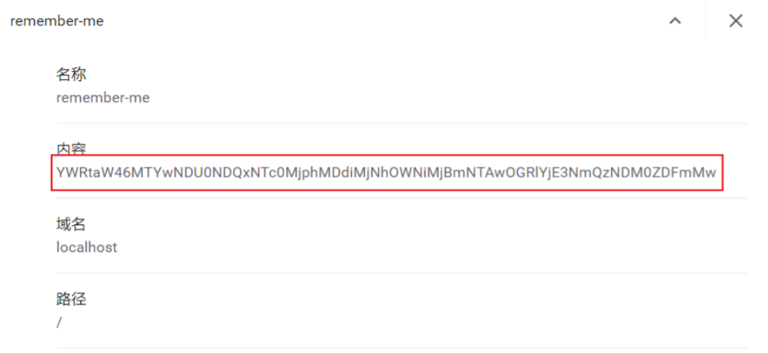

   


### 3.6.2 持久化Token生成方法

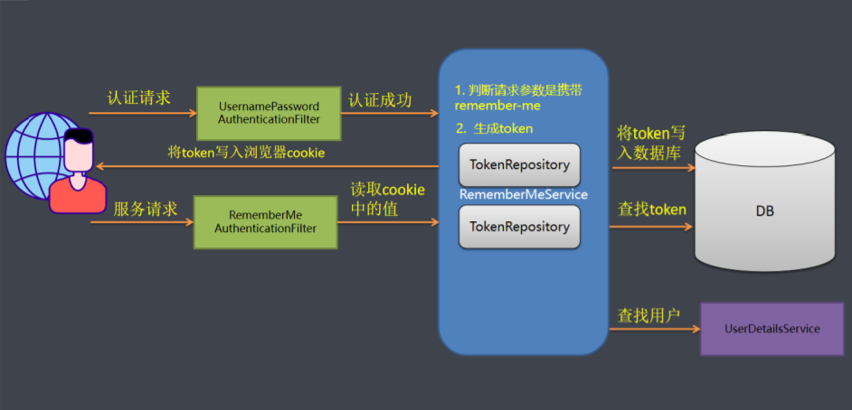

存入数据库Token包含：

- token：随机生成策略，每次访问都会重新生成
- series：登录序列号，随机生成策略。用户输入用户名和密码登录时，该值重新生成。使用remember-me功能，该值保持不变
- expiryTime：token过期时间

==CookieValue = encode（series+token）==

> 代码实现：

1. 后台代码

   ```java
   @Autowired
   private DataSource dataSource;
   
   http.formLogin() // 开启表单认证
       .loginPage("/toLoginPage") // 自定义登录页面
       .loginProcessingUrl("/login") //表单提交的路径
       .usernameParameter("username")
       .passwordParameter("password") // 自定义 input的name值
       .successForwardUrl("/") // 登录成功之后跳转的路径
       .and().rememberMe() // 开启记住我的功能
       .tokenValiditySeconds(1209600) // token 失效时间，默认：2周
       .rememberMeParameter("remember-me") // 表单中的name值，默认：remember-me
       .tokenRepository(getPersistentTokenRepository()) // 设置TokenRepository
       .and().authorizeRequests().antMatchers("/toLoginPage").permitAll()// 放行登录页面
       .anyRequest().authenticated();
   
   http.csrf().disable();// 关闭csrf防护
   
   // 加载同源域名下iframe 页面
   http.headers().frameOptions().sameOrigin();
   
   /**
        * token 持久化 （remember-me ）
        *
        * @return
        */
   @Bean
   public PersistentTokenRepository getPersistentTokenRepository() {
       JdbcTokenRepositoryImpl tokenRepository = new JdbcTokenRepositoryImpl();
       tokenRepository.setDataSource(dataSource);// 设置数据源
       //tokenRepository.setCreateTableOnStartup(Boolean.TRUE);// 启动时帮助我们自动创建一张表。存储token信息,第一次启动时设置为true，第二次启动设置false或者注释掉
       return tokenRepository;
   }
   ```

   项目启动成功后，观察数据库，会帮助我们创建persistent_logins表

   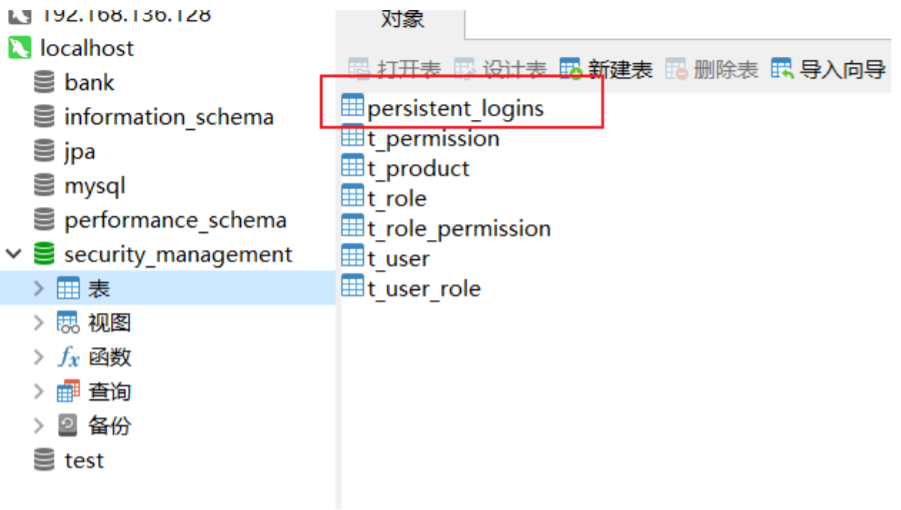

   

2. 再次完成登录功能

   观察数据库，会插入一条记录，说明持久化token方式已经生效

   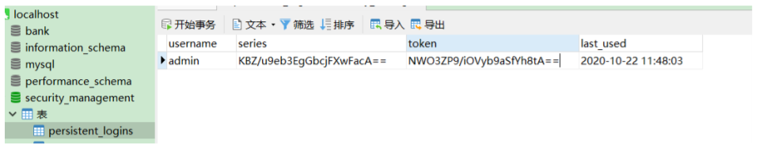

3. 观察cookie值

   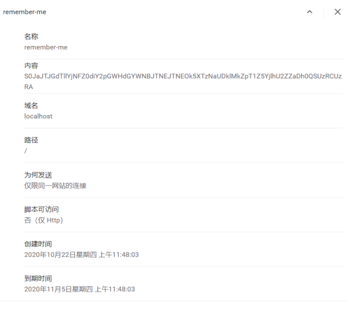

4. Cookie窃取伪造演示

   - 使用页面登录系统，记录remember-me的值

   - 使用postman伪造cookie

     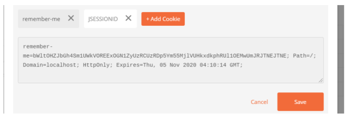

5. 安全验证

   ```java
   /**
        * 根据用户ID查询用户
        *
        * @return
        */
   @GetMapping("/{id}")
   @ResponseBody
   public User getById(@PathVariable Integer id) {
       // 获取认证的信息
       Authentication authentication = SecurityContextHolder.getContext().getAuthentication();
       if (RememberMeAuthenticationToken.class.isAssignableFrom(authentication.getClass())) {
           // 如果返回True，表示这个登录认证的信息来源于自动登录
           throw new RememberMeAuthenticationException("认证来源于remember-me");
       }
       User user = userService.getById(id);
       return user;
   }
   
   ```

   在重要操作步骤可以加以验证，True代表自动登录，则引导用户重新表单登录，False正常进行

## 3.7 自定义登录成功/失败/退出 处理器

​		在某些场景下，用户登录成功或失败的情况下用户需要执行一些后续操作，比如登陆日志的搜集，或者在现在的前后端分离的情况下用户登录成功和失败需要给前端页面返回对应的错误信息，由前台主导登录成功或者失败的页面跳转，这个时候需要用到AuthenticationSuccessHandler与AuthenticationFailureHandler

### 3.7.1 自定义登录成功/失败 处理器

**自定义成功处理：**

实现AuthenticationSuccessHandler接口，重写onAnthenticationSuccess()方法

**自定义失败处理：**

实现AuthenticationFailureHandler接口，重写onAuthenticationFailure()方法


**代码实现：**

> SecurityConfig类

```java
@Autowired
private MyAuthenticationService myAuthenticationService;


http.formLogin() // 开启表单认证
    .loginPage("/toLoginPage") // 自定义登录页面
    .loginProcessingUrl("/login") //表单提交的路径
    .usernameParameter("username")
    .passwordParameter("password") // 自定义 input的name值
    .successForwardUrl("/") // 登录成功之后跳转的路径
    .successHandler(myAuthenticationService) // 登录成功之后处理
    .failureHandler(myAuthenticationService) // 登录失败之后处理
    .and().rememberMe() // 开启记住我的功能
    .tokenValiditySeconds(1209600) // token 失效时间，默认：2周
    .rememberMeParameter("remember-me") // 表单中的name值，默认：remember-me
    .tokenRepository(getPersistentTokenRepository()) // 设置TokenRepository
    .and().authorizeRequests().antMatchers("/toLoginPage").permitAll()// 放行登录页面
    .anyRequest().authenticated();

http.csrf().disable();// 关闭csrf防护

// 加载同源域名下iframe 页面
http.headers().frameOptions().sameOrigin();
//deny();//拒接加载任何的iframe页面
```

> MyAuthenticationService类

```java
package com.sxh.service.impl;

import com.fasterxml.jackson.databind.ObjectMapper;
import org.springframework.beans.factory.annotation.Autowired;
import org.springframework.http.HttpStatus;
import org.springframework.security.core.Authentication;
import org.springframework.security.core.AuthenticationException;
import org.springframework.security.web.DefaultRedirectStrategy;
import org.springframework.security.web.RedirectStrategy;
import org.springframework.security.web.authentication.AuthenticationFailureHandler;
import org.springframework.security.web.authentication.AuthenticationSuccessHandler;
import org.springframework.security.web.authentication.logout.LogoutSuccessHandler;
import org.springframework.stereotype.Service;

import javax.servlet.FilterChain;
import javax.servlet.ServletException;
import javax.servlet.http.HttpServletRequest;
import javax.servlet.http.HttpServletResponse;
import java.io.IOException;
import java.util.HashMap;
import java.util.Map;

/**
 * 自定义登录成功或失败处理器
 */
@Service
public class MyAuthenticationService implements AuthenticationSuccessHandler, AuthenticationFailureHandler{

    private RedirectStrategy redirectStrategy = new DefaultRedirectStrategy();


    @Autowired
    private ObjectMapper objectMapper;

    /**
     * 登录失败之后的处理逻辑
     * @param httpServletRequest
     * @param httpServletResponse
     * @param e
     * @throws IOException
     * @throws ServletException
     */
    @Override
    public void onAuthenticationFailure(HttpServletRequest httpServletRequest, HttpServletResponse httpServletResponse, AuthenticationException e) throws IOException, ServletException {
        System.out.println("登录失败之后继续处理....");
        // 重定向login页面
        //redirectStrategy.sendRedirect(httpServletRequest, httpServletResponse, "/toLoginPage");

        // 前后端分离 异步请求的情况下
        Map result = new HashMap();
        result.put("code", HttpStatus.UNAUTHORIZED.value());// 401
        result.put("message", e.getMessage());
        httpServletResponse.setContentType("application/json; charset=UTF-8");
        httpServletResponse.getWriter().write(objectMapper.writeValueAsString(result));
    }


    /**
     * 登录成功之后的处理逻辑
     * @param request
     * @param response
     * @param chain
     * @param authentication
     * @throws IOException
     * @throws ServletException
     */
    @Override
    public void onAuthenticationSuccess(HttpServletRequest httpServletRequest, HttpServletResponse httpServletResponse, Authentication authentication) throws IOException, ServletException {
        System.out.println("登录成功之后继续处理....");
        // 重定向index页面
        //redirectStrategy.sendRedirect(httpServletRequest, httpServletResponse, "/");

        // 前后端分离 异步请求的情况下
        Map result = new HashMap();
        result.put("code", HttpStatus.OK.value()); // 200
        result.put("message", "登录成功");
        httpServletResponse.setContentType("application/json; charset=UTF-8");
        httpServletResponse.getWriter().write(objectMapper.writeValueAsString(result));

    }
}

```

> 前端异步请求

```html
<form id="formLogin" action="/login" method="post">
    <div class="panel loginbox">
        .....
        <div style="padding:30px;">
            <input type="button" onclick="login()"
                   class="button button-block bg-main textbig input-big" value="登录">
        </div>
    </div>
</form>
</div>
</div>
</div>
<script>
    function login() {
        $.ajax({
            type: "POST",//方法类型
            dataType: "json",//服务器预期返回类型
            url: "/login", // 登录url
            data: $("#formLogin").serialize(),
            success: function (data) {
                console.log(data)
                if (data.code == 200) {
                    window.location.href = "/";
                } else {
                    alert(data.message);
                }
            }
        });
    }
</script>
```

### 3.7.2 退出登录

用到的过滤器：

org.springframework.security.web.authentication.logout.LogoutFilter

> 匹配URL为/logout的请求，实现用户退出，清除认证信息

​		只需要发送请求，请求路径为/logout即可，当然这个路径可以自行在配置类中指定，同时退出操作也有对应的自定义处理LogoutSuccessHandler，退出登录成功后执行，退出的同时如果有remember-me的数据，同时一并删除

> 前端页面

```html
<a class="button button-little bg-red" href="/logout">
    <span class="icon-power-off"></span>退出登录</a></div>
```

> 后台代码

```java
package com.sxh.service.impl;

import com.fasterxml.jackson.databind.ObjectMapper;
import org.springframework.beans.factory.annotation.Autowired;
import org.springframework.http.HttpStatus;
import org.springframework.security.core.Authentication;
import org.springframework.security.core.AuthenticationException;
import org.springframework.security.web.DefaultRedirectStrategy;
import org.springframework.security.web.RedirectStrategy;
import org.springframework.security.web.authentication.AuthenticationFailureHandler;
import org.springframework.security.web.authentication.AuthenticationSuccessHandler;
import org.springframework.security.web.authentication.logout.LogoutSuccessHandler;
import org.springframework.stereotype.Service;

import javax.servlet.FilterChain;
import javax.servlet.ServletException;
import javax.servlet.http.HttpServletRequest;
import javax.servlet.http.HttpServletResponse;
import java.io.IOException;
import java.util.HashMap;
import java.util.Map;

/**
 * 自定义登录成功或失败处理器
 */
@Service
public class MyAuthenticationService implements AuthenticationSuccessHandler, AuthenticationFailureHandler, LogoutSuccessHandler {

    private RedirectStrategy redirectStrategy = new DefaultRedirectStrategy();


    @Autowired
    private ObjectMapper objectMapper;

    ...........

    /**
     * 退出登录 处理器
     * @param httpServletRequest
     * @param httpServletResponse
     * @param authentication
     * @throws IOException
     * @throws ServletException
     */
    @Override
    public void onLogoutSuccess(HttpServletRequest httpServletRequest, HttpServletResponse httpServletResponse, Authentication authentication) throws IOException, ServletException {
        System.out.println("退出之后继续处理...");

        redirectStrategy.sendRedirect(httpServletRequest, httpServletResponse, "/toLoginPage");

    }
}

```

> SecurityConfig类

```java
@Autowired
private MyAuthenticationService myAuthenticationService;


http.formLogin() // 开启表单认证
    .loginPage("/toLoginPage") // 自定义登录页面
    .loginProcessingUrl("/login") //表单提交的路径
    .usernameParameter("username")
    .passwordParameter("password") // 自定义 input的name值
    .successForwardUrl("/") // 登录成功之后跳转的路径
    .successHandler(myAuthenticationService) // 登录成功之后处理
    .failureHandler(myAuthenticationService) // 登录失败之后处理
    
    .and().logout().logoutUrl("/logout") // 退出登录url
    .logoutSuccessHandler(myAuthenticationService) // 退出成功处理类
    
    .and().rememberMe() // 开启记住我的功能
    .tokenValiditySeconds(1209600) // token 失效时间，默认：2周
    .rememberMeParameter("remember-me") // 表单中的name值，默认：remember-me
    .tokenRepository(getPersistentTokenRepository()) // 设置TokenRepository
    .and().authorizeRequests().antMatchers("/toLoginPage").permitAll()// 放行登录页面
    .anyRequest().authenticated();

http.csrf().disable();// 关闭csrf防护

// 加载同源域名下iframe 页面
http.headers().frameOptions().sameOrigin();
//deny();//拒接加载任何的iframe页面
```


# 4. 图形验证码验证

​	图形验证码一般是防止恶意操作。所谓验证码就是将一串随机产生的数字或符号，生成一副图片，图片里加上一些干扰。目前也有需要手动滑动的图形验证码，这种有专门的第三方平台去做，比如极验（https://www.geetest.com/）

**SpringSecurity添加验证码大致可以分为三个步骤：**

1. 根据随机数生成验证码图片
2. 将验证码图片显示到登录页面
3. 认证流程中加入验证码校验


SpringSecurity的认证校验是由UsernamePasswordAuthenticationFilter过滤器完成的，所以我们的验证码校验逻辑应该在这个过滤器之前，验证码之后才能到后续的操作，流程如下：

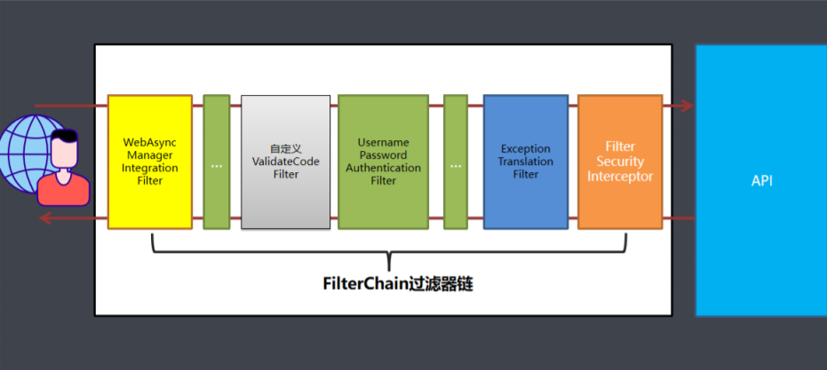


**代码实现：**

> 自定义验证码过滤器ValidateCodeFilter

```java
package com.sxh.filter;

import com.sxh.controller.ValidateCodeController;
import com.sxh.domain.ImageCode;
import com.sxh.exception.ValidateCodeException;
import com.sxh.service.impl.MyAuthenticationService;
import org.springframework.beans.factory.annotation.Autowired;
import org.springframework.data.redis.core.RedisTemplate;
import org.springframework.data.redis.core.StringRedisTemplate;
import org.springframework.stereotype.Service;
import org.springframework.util.StringUtils;
import org.springframework.web.filter.OncePerRequestFilter;

import javax.servlet.FilterChain;
import javax.servlet.ServletException;
import javax.servlet.http.HttpServletRequest;
import javax.servlet.http.HttpServletResponse;
import java.io.IOException;

/**
 * OncePerRequestFilter 一次请求只会经过一次过滤器
 */
@Service
public class ValidateCodeFilter extends OncePerRequestFilter {

    @Autowired
    private StringRedisTemplate stringRedisTemplate;
    @Autowired
    private MyAuthenticationService myAuthenticationService;

    @Override
    protected void doFilterInternal(HttpServletRequest httpServletRequest, HttpServletResponse httpServletResponse, FilterChain filterChain) throws ServletException, IOException {
        // 判断是否时登录请求
        if (httpServletRequest.getRequestURI().equals("/login") && httpServletRequest.getMethod().equalsIgnoreCase("post")) {
            String imageCode = httpServletRequest.getParameter("imageCode");
            System.out.println(imageCode);
            try {
                // 具体验证流程
                validate(httpServletRequest, imageCode);
            } catch (ValidateCodeException e) {
                e.printStackTrace();
                myAuthenticationService.onAuthenticationFailure(httpServletRequest,httpServletResponse,e);
                return;
            }

        }

        // 不是登录直接放行
        filterChain.doFilter(httpServletRequest, httpServletResponse);
    }

    /**
     * 验证 验证码
     * @param httpServletRequest
     * @param imageCode
     */
    private void validate(HttpServletRequest httpServletRequest, String imageCode) {
        String redisKey = ValidateCodeController.REDIS_KEY_IMAGE_CODE + "-" + httpServletRequest.getRemoteAddr();
        String redisImageCode = stringRedisTemplate.boundValueOps(redisKey).get();
        // 验证码判断
        // 验证码不为空
        if (!StringUtils.hasText(imageCode)) {
            throw new ValidateCodeException("验证码的值不能为空");
        }

        if (redisImageCode == null) {
            throw new ValidateCodeException("验证码已过期");
        }
        if (!redisImageCode.equals(imageCode)) {
            throw new ValidateCodeException("验证码不正确");
        }

        // 从redis中删除验证码
        stringRedisTemplate.delete(redisKey);
    }
}

```

> 自定义验证码异常类

```java
package com.sxh.exception;

import org.springframework.security.core.AuthenticationException;

/**
 * 验证码异常类
 */
public class ValidateCodeException extends AuthenticationException {

    public ValidateCodeException(String msg) {
        super(msg);
    }
}

```

> SecurityConfig类

```java
package com.sxh.config;

import com.sxh.filter.ValidateCodeFilter;
import com.sxh.service.impl.MyAuthenticationService;
import com.sxh.service.impl.MyUserDetailsService;
import org.springframework.beans.factory.annotation.Autowired;
import org.springframework.context.annotation.Bean;
import org.springframework.context.annotation.Configuration;
import org.springframework.security.config.annotation.authentication.builders.AuthenticationManagerBuilder;
import org.springframework.security.config.annotation.web.builders.HttpSecurity;
import org.springframework.security.config.annotation.web.builders.WebSecurity;
import org.springframework.security.config.annotation.web.configuration.WebSecurityConfigurerAdapter;
import org.springframework.security.web.authentication.UsernamePasswordAuthenticationFilter;
import org.springframework.security.web.authentication.rememberme.JdbcTokenRepositoryImpl;
import org.springframework.security.web.authentication.rememberme.PersistentTokenRepository;

import javax.sql.DataSource;

@Configuration
public class SecurityConfig extends WebSecurityConfigurerAdapter {

    @Autowired
    private MyUserDetailsService myUserDetailsService;

    @Autowired
    private DataSource dataSource;

    @Autowired
    private MyAuthenticationService myAuthenticationService;

    @Autowired
    private ValidateCodeFilter validateCodeFilter;

    /**
     * 身份安全管理器
     *
     * @param auth
     * @throws Exception
     */
    @Override
    protected void configure(AuthenticationManagerBuilder auth) throws Exception {
        auth.userDetailsService(myUserDetailsService);
    }

    @Override
    public void configure(WebSecurity web) throws Exception {
        // 解决静态资源被拦截的问题
        web.ignoring().antMatchers(
            "/css/**",
            "/images/**",
            "/js/**",
            "/code/**"
        );

    }

    /**
     * http 请求方法
     *
     * @param http
     * @throws Exception
     */
    @Override
    protected void configure(HttpSecurity http) throws Exception {

        /*http.httpBasic() // 开启HttpBasic认证
                .and().authorizeRequests()
                .anyRequest().authenticated();//所有请求都需要登录认证才能访问*/

        // 加入用户名密码验证过滤器前面
        http.addFilterBefore(validateCodeFilter, UsernamePasswordAuthenticationFilter.class);

        http.formLogin() // 开启表单认证
            .loginPage("/toLoginPage") // 自定义登录页面
            .loginProcessingUrl("/login") //表单提交的路径
            .usernameParameter("username")
            .passwordParameter("password") // 自定义 input的name值
            .successForwardUrl("/") // 登录成功之后跳转的路径
            .successHandler(myAuthenticationService) // 登录成功之后处理
            .failureHandler(myAuthenticationService) // 登录失败之后处理
            .and().logout().logoutUrl("/logout") // 退出登录url
            .logoutSuccessHandler(myAuthenticationService) // 退出成功处理类
            .and().rememberMe() // 开启记住我的功能
            .tokenValiditySeconds(1209600) // token 失效时间，默认：2周
            .rememberMeParameter("remember-me") // 表单中的name值，默认：remember-me
            .tokenRepository(getPersistentTokenRepository()) // 设置TokenRepository
            .and().authorizeRequests().antMatchers("/toLoginPage").permitAll()// 放行登录页面
            .anyRequest().authenticated();

        http.csrf().disable();// 关闭csrf防护

        // 加载同源域名下iframe 页面
        http.headers().frameOptions().sameOrigin();
        //deny();//拒接加载任何的iframe页面

    }

    /**
     * token 持久化 （remember-me ）
     *
     * @return
     */
    @Bean
    public PersistentTokenRepository getPersistentTokenRepository() {
        JdbcTokenRepositoryImpl tokenRepository = new JdbcTokenRepositoryImpl();
        tokenRepository.setDataSource(dataSource);// 设置数据源
        //tokenRepository.setCreateTableOnStartup(Boolean.TRUE);// 启动时帮助我们自动创建一张表。存储token信息,第一次启动时设置为true，第二次启动设置false或者注释掉
        return tokenRepository;
    }
}

```


# 5. Session 管理

​		SpringSecurity可以与SpringSession库配合使用，只需要做一些简单的配置就可以实现一些功能，如（会话过期、一个账号只能同时在线一个、集群session等）

## 5.1 会话超时

1. 配置Session会话超时时间，默认为30分钟，但是SpringBoot中的会话超时时间至少为60秒

   ```properties
   #session设置
   #配置session超时时间
   server.servlet.session.timeout=60
   ```

   当session超时后，默认跳转到登录页面

2. 自定义设置session超时后地址

   设置session管理和失效后跳转地址

   ```java
   http.sessionManagement()//设置session管理
       .invalidSessionUrl("/toLoginPage")// session无效后跳转的路径,默认是登录页面
   ```


## 5.2 并发控制

​		并发控制即同一个账号同时在线个数，同一个账号同时在线个数如果设置为1，该账号在同一时间只能有一个有效的登录，如果同一个账号又在其他地方登录，那么就将上次登录的会话过期，即后面的登录会踢掉前面的登录

1. 修改超时时间

   ```properties
   #session设置
   #配置session超时时间
   server.servlet.session.timeout=600
   ```

2. 设置最大会话数量

   ```java
   http.sessionManagement().//设置session管理
       invalidSessionUrl("/toLoginPage")// session无效后跳转的路径, 默认是登录页面
       .maximumSessions(1)//设置session最大会话数量 ,1同一时间只能有一个用户登录
       .expiredUrl("/toLoginPage");//设置session过期后跳转路径
   ```

3. 阻止用户第二次登陆

   sessionManagement也可以配置maxSessionPreventsLogin：Boolean值，当达到maximumSession这是的最大会话个数时就会阻止登录

   ```java
   http.sessionManagement().//设置session管理
       invalidSessionUrl("/toLoginPage")// session无效后跳转的路径, 默认是登录页面
       .maximumSessions(1)//设置session最大会话数量 ,1同一时间只能有一个用户登录
       .maxSessionsPreventsLogin(true)//当达到最大会话个数时阻止登录。
       .expiredUrl("/toLoginPage");//设置session过期后跳转路径
   ```


## 5.3 集群session

​	实际场景中一个服务会至少有两台服务器在提供服务，在服务器前面会有一个Nginx做负载均衡，用户访问nginx，nginx再决定去访问哪一台服务器。当一台服务器宕机之后，另一台服务器也可以继续提供服务，保证服务不中断。

​		如果我们将session保存在web容器（比如Tomcat）中，如果第一个用户第一次访问被分配到服务器1上面需要登录，当某些访问突然被分配到服务器2上，因为服务器2上没有用户在服务器1上登录的会话session信息，服务器2还会再次让用户登录，用户已经登录了还让登录就感觉不正常了

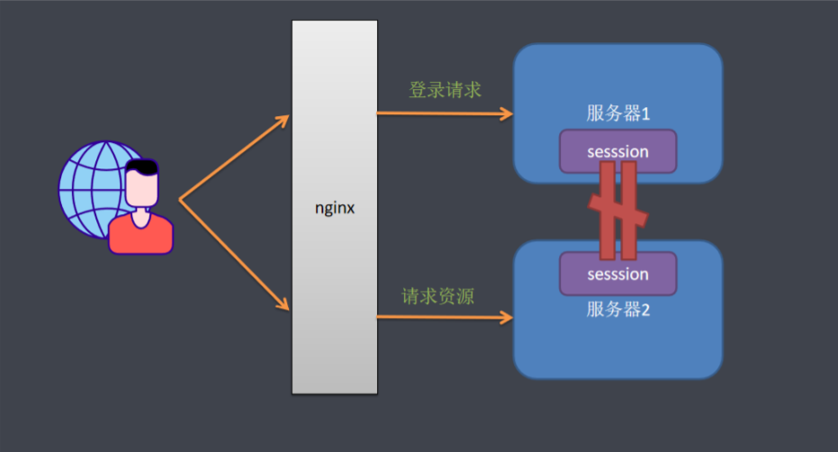

​		解决这个问题的思路是用户登录的会话信息不能再保存到web容器中，而是保存到一个单独的库（redis、MongoDB、JDBC等）中，所有服务器都能访问同一个库，都从同一个库来获取用户的session信息。如用户在服务器1登录，将会话信息保存到库中，用户的下次请求被分配到服务器2，服务器2从库中检索session是否存在，如果存在就不用再登录了，可以直接访问服务了

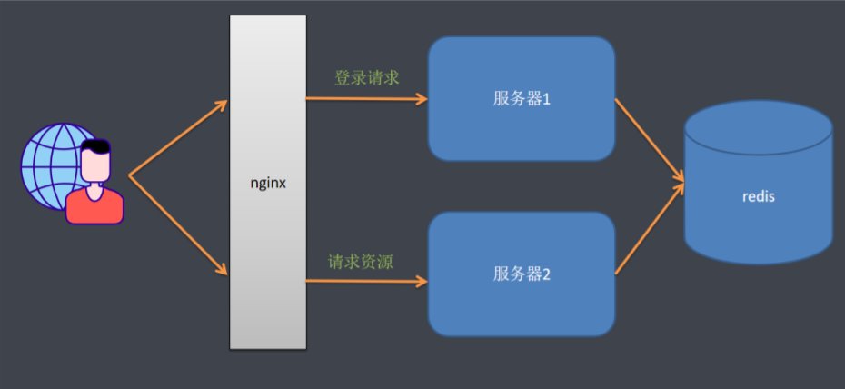


1. 引入依赖

   ```xml
   <!-- 基于redis实现session共享 -->
   <dependency>
       <groupId>org.springframework.session</groupId>
       <artifactId>spring-session-data-redis</artifactId>
   </dependency>
   ```

   

2. 设置session存储类型

   ```properties
   #使用redis共享session
   spring.session.store-type=redis
   ```

   

3. 测试

   - 使用其中一个服务去登录 http://localhost:8080/login
   - 使用另一个服务访问任意接口，则不需要再重新登录就可以直接访问


# 6. CSRF防护机制

## 6.1 什么是CSRF？

​		CSRF（cross-site request forgery），中文名称：跨站请求伪造

​		可以这么理解CSRF攻击：攻击者盗用了你的身份，以你的名义发送恶意请求。CSRF能够做的事情包括：以你的名义发送邮件，发消息，盗取你的账号，甚至于购买商品，虚拟货币转账……造成的问题包括：个人隐私泄漏以及财产安全

​		CSRF这种攻击方式在2000年已经被国外的安全人员提出，但在国内，知道06年才开始被关注，08年，国内外多个大型社区和交互网站分别爆出CSRF漏洞，如：NYTimes.com(纽约时报)、Metafilter（一个大型的BLOG网站）、YouTube和百度HI……而现在，互联网上的许多站点仍对此毫无防备，以至于安全业界称CSRF为“沉睡的巨人”。


## 6.2 CSRF的原理

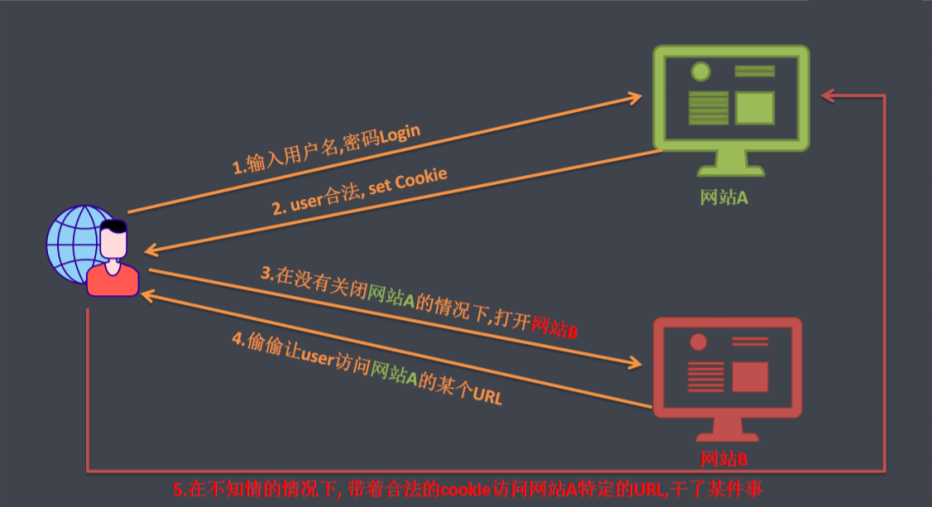

从上图可以看出，要完成一次CSRF攻击，受害者必须一次完成三个步骤

1. 登录受信任网站A,并在本地生成Cookie
2. 在不登出A的情况下，访问危险网站B
3. 触发网站B中的一些元素


## 6.3 CSRF的防御策略

​		在业界目前防御CSRF攻击主要有三种策略：验证HTTP Referer字段；在请求地址中添加token并验证；在HTTP头中自定义属性并验证

1. 验证HTTP Referer字段

   根据HTTP协议，在HTTP头中有一个字段叫Referer，它记录了该HTTP请求的来源地址。在通常情况下，访问一个安全受限页面的请求来自同一个网站，在后台请求验证其Referer值，如果以自身安全网站开头的域名，则说明该请求是合法的。如果Referer是其他网站的话，则有可能是黑客的CSRF攻击，拒绝该请求

2. 在请求地址中添加token并验证

   CSRF攻击之所以能够成功，是因为黑客可以完全伪造用户的请求，该请求中所有的用户验证信息都是存在于cookie中，因此黑客可以在不知道这些验证信息的情况下直接利用用户自己的cookie来通过安全验证。要抵御CSRF，关键在于在请求中放入黑客不能伪造的信息，并且该信息不存在与cookie中。可以在HTTP请求中以参数的形式加入一个随机产生的token，并在服务器端建立一个拦截器来验证这个token，如果请求中没有token或者token内容不正确，则认为可能是CSRF攻击而拒绝该请求

3. 在HTTP头中自定义属性并验证

   这种方式是使用token并进行验证，和上一种方法不同的是，这里并不是把token以参数的形势与HTTP请求之中，而是把它放在HTTP头中自定义的属性里                                                                                                                                                                                                                                                                                                                            

## 6.4 Security中的CSRF防御机制

org.springframework.security.web.csrf.CsrfFilter

> CSRF又称跨站请求伪造，SpringSecurity会对所有post请求验证是否包含系统生成的CSRF的token信息，如果不包含则报错。起到防止CSRF攻击的效果（1.生成token ；2.验证token）

1. 开启CSRF防护

   ```java
   //开启csrf防护, 可以设置哪些不需要防护
   http.csrf().ignoringAntMatchers("/user/save");
   ```

2. 页面需要添加token值

   ```html
   <input type="hidden" th:name="${_csrf.parameterName}"
          th:value="${_csrf.token}"/>
   ```

   


# 7. 跨域与CORS

## 7.1 跨域

​		跨域，实质上是浏览器的一种保护处理。如果产生了跨域，服务器在返回结果时就会被浏览器拦截（注意：此时请求是可以正常发起的，只是浏览器对其进行了拦截），导致响应的内容不可用，产生跨域的集中情况有以下：

| 当前页面URL             | 被请求页面URL                  | 是否跨域 | 原因                           |
| ----------------------- | ------------------------------ | -------- | ------------------------------ |
| http://www.sxh.com      | http://www.sxh.com/index.html  | 否       | 同源（协议，域名，端口号相同） |
| http://www.sxh.com      | https://www.sxh.com/index.html | 跨域     | 协议不同（http/https）         |
| http://www.sxh.com      | http://www.baidu.com/          | 跨域     | 主域名不同（sxh/baidu）        |
| http://www.sxh.com/     | http://kuaiwu.sxh.com          | 跨域     | 子域名不同（www/kuaiwu）       |
| http://www.sxh.com:8080 | http://www.sxh.com:8090        | 跨域     | 端口号不同（8080/8090）        |

## 7.2 解决跨域

1. JSONP

   浏览器允许一些带src属性的标签跨域，也就是在某些标签的src属性上写url地址是不会产生跨域问题的

2. CORS解决跨域

   CORS是一个W3C标准，全称是“跨域资源共享”（Cros-origin resource sharing）。CORS需要浏览器和服务器同时支持。目前，所有浏览器都支持该功能，IE浏览器不能低于IE10。浏览器在发起真正的请求前，会发起一个OPTIONS类型的预检请求，用于请求服务器是否允许跨域，在得到许可的情况下才会发起请求


## 7.3 基于SpringSecurity的CORS支持

> 声明跨域配置源

```java
/**
 * 跨域配置信息源
 */
public CorsConfigurationSource corsConfigurationSource(){
    CorsConfiguration corsConfiguration = new CorsConfiguration();
    // 配置允许跨域的站点
    corsConfiguration.addAllowedOrigin("*");
    // 允许跨域的HTTP 请求类型
    corsConfiguration.addAllowedMethod("*");
    // 允许跨域的请求头
    corsConfiguration.addAllowedHeader("*");
    // 允许带凭证
    //corsConfiguration.setAllowCredentials(Boolean.TRUE);

    UrlBasedCorsConfigurationSource urlBasedCorsConfigurationSource
        = new UrlBasedCorsConfigurationSource();
    // /** -> 对所有url都生效
    urlBasedCorsConfigurationSource.registerCorsConfiguration("/**", corsConfiguration);
    return urlBasedCorsConfigurationSource;
}
```


> 开启跨域支持

```java
// 允许跨域
http.cors().configurationSource(corsConfigurationSource());
```

> 前端跨域测试代码

打开本地页面，控制台用ajax直接请求，即可产生跨域

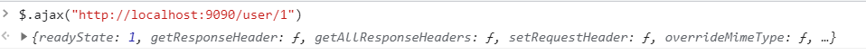

