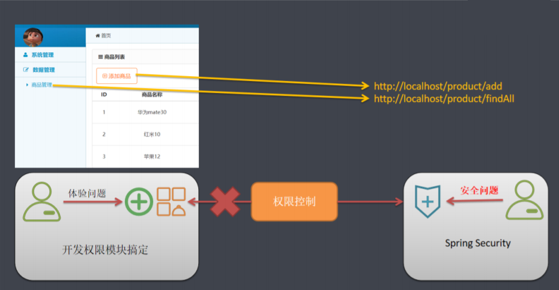
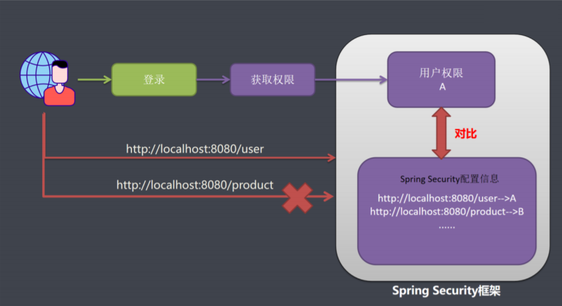
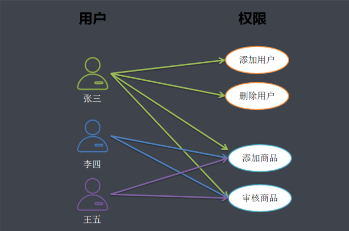
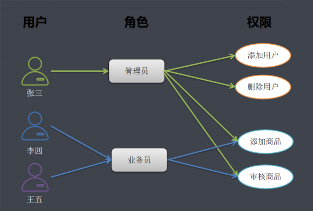
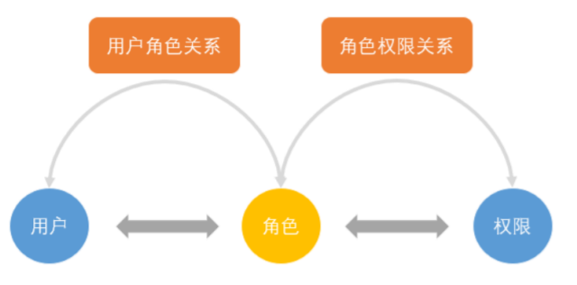
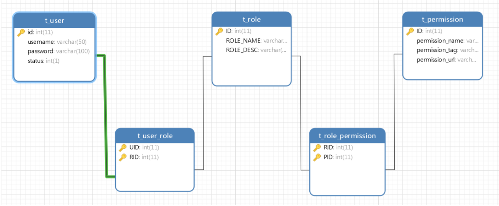

[toc]

# 1. 授权简介

## 1.1 SpringSecurity对授权的定义



**安全权限控制问题其实就是控制能否访问URL**


## 1.2 SpringSecurity授权原理



在应用系统里面，如果想要控制用户权限，需要有2部分数据

1. 系统配置信息数据：写着系统里面有哪些URL，每个URL拥有哪些权限才允许被访问

2. 另一份数据就是用户权限信息：请求用户拥有权限

   系统用户发送一个请求：系统配置信息和用户权限信息做比对，如果比对成功则允许访问

   当一个系统授权规则比较简单，基本不变的时候，系统的权限配置信息可以写在我们的代码里面去。比如前台门户网站等权限比较单一，可以使用简单的授权配置即可完成，如果权限负责，例如办公OA，电商后台管理系统等就不能使用写在代码里面了。需要RBAC权限模型设计


# 2. SpringSecurity 授权

## 2.1 内置权限表达式

​		Spring Security 使用Spring EL来支持，主要用于Web访问和方法安全上, 可以通过表达式来判断是 否具有访问权限. 下面是Spring Security常用的内置表达式. ExpressionUrlAuthorizationConfigurer定 义了所有的表达式

| 表达式                                 | 说明                                                         |
| -------------------------------------- | ------------------------------------------------------------ |
| permitAll                              | 指定任何人都允许访问。                                       |
| denyAll                                | 指定任何人都不允许访问                                       |
| anonymous                              | 指定匿名用户允许访问。                                       |
| rememberMe                             | 指定已记住的用户允许访问。                                   |
| authenticated                          | 指定任何经过身份验证的用户都允许访问,不包含 anonymous        |
| fullyAuthenticated                     | 指定由经过身份验证的用户允许访问,不包含 anonymous和rememberMe |
| hasRole(role)                          | 指定需要特定的角色的用户允许访问, 会自动在角色 前面插入'ROLE_' |
| hasAnyRole([role1,role2])              | 指定需要任意一个角色的用户允许访问, 会自动在角 色前面插入'ROLE_' |
| hasAuthority(authority)                | 指定需要特定的权限的用户允许访问                             |
| hasAnyAuthority([authority,authority]) | 指定需要任意一个权限的用户允许访问                           |
| hasIpAddress(ip)                       | 指定需要特定的IP地址可以访问                                 |


## 2.2 URL安全表达式

基于web访问使用表达式保护URL请求路径

1. 设置URL访问权限

   ```java
   
   
   // 设置/user/** 访问需要ADMIN角色
   http.authorizeRequests().antMatchers("/user/**").hasRole("ADMIN");
   // 设置/user/** 访问需要PRODUCT角色和IP地址为127.0.0.1. hasAnyRole("PRODUCT,ADMIN")
   
   http.authorizeRequests().antMatchers("/product/**")
       .access("hasAnyRole('ADMIN,PRODUCT') and hasIpAddress('127.0.0.1')");
   // 设置自定义权限不足信息.
   http.exceptionHandling().accessDeniedHandler(accessDeniedHandler);
   ```

2. MyAccessDeniedHandler自定义权限不足类

   ```java
   package com.sxh.handler;
   
   import org.springframework.security.access.AccessDeniedException;
   import org.springframework.security.web.access.AccessDeniedHandler;
   import org.springframework.stereotype.Component;
   
   import javax.servlet.ServletException;
   import javax.servlet.http.HttpServletRequest;
   import javax.servlet.http.HttpServletResponse;
   import java.io.IOException;
   
   /**
    * 自定义权限不足处理
    */
   @Component
   public class MyAccessDeniedHandler implements AccessDeniedHandler {
       @Override
       public void handle(HttpServletRequest httpServletRequest, HttpServletResponse httpServletResponse, AccessDeniedException e) throws IOException, ServletException {
           httpServletResponse.setContentType("text/html; charset=UTF-8");
           httpServletResponse.getWriter().write("权限不足，请联系管理员");
   
       }
   }
   
   ```

3. 设置用户对应的角色权限 - userDetailService

   ```java
   package com.sxh.service.impl;
   
   import com.sxh.domain.Permission;
   import com.sxh.domain.User;
   import com.sxh.service.UserService;
   import org.springframework.beans.factory.annotation.Autowired;
   import org.springframework.security.core.GrantedAuthority;
   import org.springframework.security.core.authority.SimpleGrantedAuthority;
   import org.springframework.security.core.parameters.P;
   import org.springframework.security.core.userdetails.UserDetails;
   import org.springframework.security.core.userdetails.UserDetailsService;
   import org.springframework.security.core.userdetails.UsernameNotFoundException;
   import org.springframework.security.crypto.bcrypt.BCryptPasswordEncoder;
   import org.springframework.security.crypto.scrypt.SCryptPasswordEncoder;
   import org.springframework.stereotype.Service;
   
   import java.util.ArrayList;
   import java.util.Collection;
   import java.util.List;
   
   /**
    * 基于数据库完成认证
    */
   
   @Service
   public class MyUserDetailsService implements UserDetailsService {
   
   
       @Autowired
       private UserService userService;
   
       /**
        * 根据用户名查询用户
        *
        * @param username 前端传入的用户名
        * @return
        * @throws UsernameNotFoundException
        */
       @Override
       public UserDetails loadUserByUsername(String username) throws UsernameNotFoundException {
           User user = userService.findByUsername(username);
           if (user == null) {
               // return null;
               throw new UsernameNotFoundException("用户没有找到，" + username);
           }
           Collection<GrantedAuthority> authorities = new ArrayList<>();// 权限集合
           
           // 手动设置用户权限
           if (username.equalsIgnoreCase("admin")) {
               authorities.add(new SimpleGrantedAuthority("ROLE_ADMIN"));
           }else {
               authorities.add(new SimpleGrantedAuthority("ROLE_PRODUCT"));
           }
   
           UserDetails userDetails = new org.springframework.security.core.userdetails.User
               (username,
                "{bcrypt}" + user.getPassword(),// {noop} 不使用密码加密 {bcrypt}使用crypt算法
                true, // 用户是否启用
                true, // 用户是否过期 True：没有过期
                true, // 用户凭证是否过期 True：没有过期
                true, // 用户是否锁定 True：未锁定
                authorities
               );
   
           return userDetails;
       }
   }
   ```


## 2.3 在Web安全表达式中引用自定义Bean授权

1. 定义自定义授权类

   ```java
   package com.sxh.service.impl;
   
   import org.springframework.security.core.Authentication;
   import org.springframework.security.core.GrantedAuthority;
   import org.springframework.security.core.userdetails.UserDetails;
   import org.springframework.stereotype.Component;
   
   import javax.servlet.http.HttpServletRequest;
   import java.util.Collection;
   
   /**
    * 自定义bean授权
    */
   @Component
   public class MyAuthorizationService {
   
   
       /**
        * 检查用户是否有权限
        * @param authentication 认证信息
        * @param request request请求对象
        * @return
        */
       public boolean check(Authentication authentication, HttpServletRequest request) {
           UserDetails userDetails = (UserDetails) authentication.getPrincipal();
           String username = userDetails.getUsername();
           // 权限集合
           Collection<GrantedAuthority> authorities = (Collection<GrantedAuthority>) userDetails.getAuthorities();
   
           // 如果用户名为admin，返回true
           if ("admin".equalsIgnoreCase(username)) {
               return Boolean.TRUE;
           }else {
               // 获取请求路径
               String requestURI = request.getRequestURI();
               if (requestURI.contains("/user")) {
                   // 循环判断用户权限集合是否包含ROLE_ADMIN
                   for (GrantedAuthority authority : authorities) {
                       if (authority.getAuthority().equals("ROLE_ADMIN")) {
                           return true;
                       }
                   }
               }
   
               if (requestURI.contains("/product")) {
                   // 循环判断用户权限集合是否包含ROLE_ADMIN
                   for (GrantedAuthority authority : authorities) {
                       if (authority.getAuthority().equals("ROLE_PRODUCT")) {
                           return true;
                       }
                   }
               }
   
           }
           return false;
       }
   }
   
   ```

2. 配置类 - 在`configure(HttpSecurity http)`方法中配置即可

   ```java
   //使用自定义Bean授权
   http.authorizeRequests().antMatchers("/user/**")
       .access("@myAuthorizationService.check(authentication,request)");
   ```

> 携带路径变量

1. 在自定义授权类中添加方法

   ```java
   /**
   * 检查用户是否有对应的访问权限
   *
   * @param authentication 登录用户
   * @param request 请求对象
   * @param id 参数ID
   * @return
   */
   public boolean check(Authentication authentication, HttpServletRequest
                        request, Integer id) {
       if (id > 10) {
           return false;
       }
       return true;
   }
   
   ```

2. 配置类 - 在`configure(HttpSecurity http)`方法中配置即可

   ```java
   //使用自定义Bean授权,并携带路径参数
   http.authorizeRequests().antMatchers("/user/delete/{id}")
       .access("@myAuthorizationService.check(authentication,request,#id)");
   ```

   


## 2.4 Method安全表达式

针对方法级别的访问控制比较复杂，`spring security`提供了4种注解分别是：

- `PreAuthorize`
- `PostAuthorize`
- `PreFilter`
- `PostFilter`


1. 开启方法级别的注解配置

   在SecurityConfig配置类中添加注解

   ```java
   /**
   * Security配置类
   */
   @Configuration
   @EnableGlobalMethodSecurity(prePostEnabled = true)//开启注解支持
   public class SecurityConfiguration extends WebSecurityConfigurerAdapter{
       .....
   }
   ```

2. 在方法上使用注解

   - PreAuthorize：适合进入方法前的权限验证

     ```java
     /**
     * 查询所有用户
     *
     * @return
     */
     @RequestMapping("/findAll")
     @PreAuthorize("hasRole('ADMIN')")//需要ADMIN权限
     public String findAll(Model model) {
         List<User> userList = userService.list();
         model.addAttribute("userList", userList);
         return "user_list";
     }
     /**
     * 用户修改页面跳转
     *
     * @return
     */
     @RequestMapping("/update/{id}")
     @PreAuthorize("#id<10")//针对参数权限限定 id<10可以访问
     public String update(@PathVariable Integer id, Model model) {
         User user = userService.getById(id);
         model.addAttribute("user", user);
         return "user_update";
     }
     
     ```

   - PostAuthorize：@PostAuthorize在方法执行后再进行权限验证，适合验证带有返回值的权限，`Spring EL` 提供返回对象能够在表达式语言中获取到返回对象的returnObject

     ```java
     /**
     * 根据ID查询用户
     *
     * @return
     */
     @GetMapping("/{id}")
     @ResponseBody
     @PostAuthorize("returnObject.username==authentication.principal.username")//判断查询用户信息是否是当前登录用户信息.否则没有权限
     public User getById(@PathVariable Integer id) {
         User user = userService.getById(id);
         return user;
     }
     ```

     > returnObject：代表return返回的值

   - PreFilter：可以用来对集合类型的参数进行过滤，将不符合条件的元素剔除集合

     ```java
     /**
     * 商品删除-多选删除
     *
     * @return
     */
     @GetMapping("/delByIds")
     @PreFilter(filterTarget = "ids", value = "filterObject%2==0")//剔除参数为基数的值
     public String delByIds(@RequestParam(value = "id") List<Integer> ids) {
         for (Integer id : ids) {
             System.out.println(id);
         }
         return "redirect:/user/findAll";
     }
     
     ```

   - PostFilter：可以用来对集合类型的返回值进行过滤，将不符合条件的元素剔除集合

     ```java
     /**
     * 查询所有用户-返回json数据
     *
     * @return
     */
     @RequestMapping("/findAllTOJson")
     @ResponseBody
     @PostFilter("filterObject.id%2==0")//剔除返回值ID为偶数的值
     public List<User> findAllTOJson() {
         List<User> userList = userService.list();
         return userList;
     }
     ```


# 3. 基于数据库的RBAC数据模型权限控制

​		开发一个系统，必然面临权限控制的问题，不同的用户具有不同的访问、操作、数据权限。形成理论的权限控制模型有：自主访问控制（DAC：Discretionary Access Control）、强制访问控制（MAC：Mandatory Access Control）、基于属性的权限验证（ABAC：Attribute-Based Access Control）等。最常被开发者使用也是相对易用、通用的就是**RBAC权限模型**（Role-Based Access Control）

## 3.1 RBAC权限模型简介

RBAC权限模型（Role-Based Access Control）即：基于角色的权限控制。模型中有几个关键的术语：

- 用户：系统接口及访问的操作者 
- 权限：能够访问某接口或者做某操作的授权资格
-  角色：具有一类相同操作权限的总称

RBAC权限模型核心授权逻辑如下：

- 某用户是什么角色？
- 某角色具有什么权限？
- 通过角色对应的权限推导出用户的权限

## 3.2 RBAC的演化进程

1. 用户与权限直接关联

   

   想到权限控制，人们最先想到的一定是用户与权限直接关联的模式，简单地说就是：某个用户 具有某些权限。如图：

   - 张三具有所有权限他可能是一个超级管理员.
   - 李四,王五 具有添加商品和审核商品的权限有可能是一个普通业务员

   这种模型能够清晰的表达用户与权限之间的关系，足够简单。但同时也存在问题：

   - 现在用户是张三、李四，王五以后随着人员增加，每一个用户都需要重新授权
   - 操作人员的他的权限发生变更后,需要对每个一个用户重新授予新的权限

2. 用户与角色关联

   

   这样只需要维护角色和权限之间的关系就可以了. 如果业务员的权限发生变更, 只需要变动业务员 角色和权限之前的关系进行维护就可以了. 用户和权限就分离开来了. 如下图

   

## 3.3 基于RBAC设计权限表结构

- 一个用户有一个或多个角色 
- 一个角色包含多个用户 
- 一个角色有多种权限 
- 一个权限属于多个角色



## 3.4 基于SpringSecurity实现RBAC权限管理

> 动态查询数据库中用户对应的权限

```java
package com.sxh.mapper;

import com.baomidou.mybatisplus.core.mapper.BaseMapper;
import com.sxh.domain.Permission;
import org.apache.ibatis.annotations.Select;

import java.util.List;


public interface PermissionMapper extends BaseMapper<Permission> {
    /**
     * 根据用户ID查询权限
     *
     * @param id
     * @return
     */
    @Select("SELECT p.*  FROM t_permission p,t_role_permission rp,t_role r,t_user_role ur,t_user u " +
            "WHERE p.id = rp.PID AND rp.RID = r.id AND r.id = ur.RID AND ur.UID = u.id AND u.id =#{id}")
    List<Permission> findByUserId(Integer id);
}

```

> 给登陆用户授权 - `MyUserDetailsService`类

```java
// 先声明一个权限集合, 因为构造方法里面不能传入null
Collection<GrantedAuthority> authorities = new ArrayList<>();
// 查询用户对应所有权限
List<Permission> permissions = permissionService.findByUserId(user.getId());
for (Permission permission : permissions) {
    // 授权
    authorities.add(new SimpleGrantedAuthority(permission.getPermissionTag()));
}

```

> 设置访问权限 - `SecurityConfig`类

```java
// 查询数据库所有权限列表
List<Permission> permissions = permissionService.list();
for (Permission permission : permissions) {
    //添加请求权限
    http.authorizeRequests().
        antMatchers(permission.getPermissionUrl())
        .hasAuthority(permission.getPermissionTag());
}

```


## 3.5 基于页面端标签的权限控制

在jsp页面或者thymeleaf模板页面中我们可以使用spring security提供的权限标签来进行权限控制.要 想使用thymeleaf为SpringSecurity提供的标签属性，首先需要引入thymeleaf-extras-springsecurity依 赖支持。

> 在pom文件中引入SpringSecurity的标签依赖thymeleaf-extras-springsecurity5

```xml
<!--添加thymeleaf为SpringSecurity提供的标签 依赖 -->
<dependency>
    <groupId>org.thymeleaf.extras</groupId>
    <artifactId>thymeleaf-extras-springsecurity5</artifactId>
    <version>3.0.4.RELEASE</version>
</dependency>
```

> 在html文件里面声明使用

```html
!DOCTYPE html>
<html xmlns:th="http://www.thymeleaf.org"
      xmlns:sec="http://www.thymeleaf.org/extras/spring-security">
```

### 3.5.1 常用SpringSecurity的标签属性介绍

判断用户是否已经登录验证，引号内的参数必须是isAuthenticated()

```html
sec:authorize="isAuthenticated()"
```

获得当前用户的用户名，引号内的参数必须是name

```
sec:authentication=“name”
```

判断当前用户是否拥有指定的权限。引号内的参数为权限的名称。

```
sec:authorize=“hasRole(‘role’)”
```

### 3.5.2 SpringSecurity标签的使用

```html
<div class="leftnav">
    <div class="leftnav-title">
        <div sec:authorize="isAuthenticated()">
            <span sec:authentication="name"></span>
            </div>
    </div>
    <div sec:authorize="hasAuthority('user:findAll')">
        <h2><span class="icon-user"></span>系统管理</h2>
        <ul style="display:block">
            <li><a href="/user/findAll" target="right"><span class="icon-caretright"></span>用户管理</a></li>
            <li><a href="javascript:void(0)" onclick="toCors()" target="right">
                <span
                      class="icon-caret-right"></span>跨域测试</a></li>
        </ul>
    </div>
    <div sec:authorize="hasAuthority('product:findAll')">
        <h2><span class="icon-pencil-square-o"></span>数据管理</h2>
        <ul>
            <li><a href="/product/findAll" target="right"><span class="iconcaret-right"></span>商品管理</a></li>
        </ul>
    </div>
</div>
```

