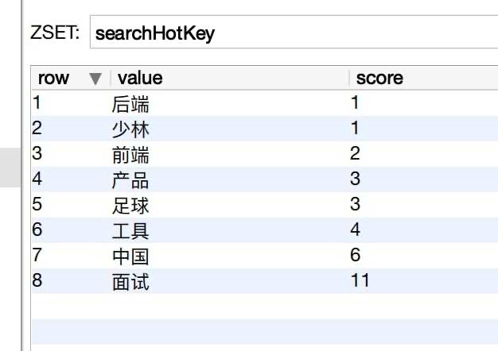

# 1. Redis搜索热词

## Service

```java
@Service
public class RedisServiceImpl implements RedisService {
  @Autowired
  private StringRedisTemplate redisTemplate;
  /**
  * 记录查询热词
  * zincrby命令，对于一个Sorted Set，存在的就把分数加x(x可自行设定)，不存在就创建一个分数为1的成员
  *
  * @param keyword 搜索关键词
  */
  @Override
  public void searchZincrby(String keyword) {
    redisTemplate.opsForZSet().incrementScore("searchHotKey", keyword, 1.0);
  }
  /**
  * zrevrange命令, 查询集合中指定顺序的值
  * 返回有序的sorted set中，score大的在前面
  *
  * @param start 查询范围开始位置
  * @param end 查询范围结束位置
  * @return
  */
  @Override
  public Set<ZSetOperations.TypedTuple<String>> queryTopSearchHotKey(Integer start, Integer end) {
    Set<ZSetOperations.TypedTuple<String>> resultSet = redisTemplate.opsForZSet().reverseRange("searchHotKey", start, end);
    return resultSet;
  }
}
```


## Controller

```java
@RestController
@RequestMapping("/team")
public class TeamController {
  @Autowired
  private RedisService redisService;
  /**
* 测试redis记录HotKey
*
* @param keyword 搜索关键词
* @return
*/
  @GetMapping("/test_hot_key")
  public ResultVO testHotKey(@RequestParam("keyword") String keyword) {
    redisService.searchZincrby(keyword);
    return ResultVOUtil.success(1, "test-return");
  }
  /**
* 测试redis查询指定范围的热词
*
* @param start 查询范围开始位置
* @param end 结束位置
* @return
*/
  @GetMapping("/test_query_top_hot_key")
  public ResultVO testQueryTopHotKey(@RequestParam("start") Integer start,
                                     @RequestParam("end") Integer end) {
    Set<ZSetOperations.TypedTuple<String>> resultSet = redisService.queryTopSearchHotKey(start, end);
    return ResultVOUtil.success(1, "success", resultSet);
  }
}

```

## Redis中已经存在的搜索热词



> 搜索热词查询结果

