[TOC]


# 介绍

Hash算法，比如说在安全加密领域MD5、SHA等加密算法，在数据存储和查找方面有Hash表等, 以上都应用到了Hash算法。

**为什么需要使用ash?**

Hash算法较多的应用在数据存储和查找领域，最经典的就是Hash表，它的查询效率非常之高，其中的 哈希算法如果设计的比较ok的话，那么Hash表的数据查询时间复杂度可以接近于O(1)

**示例：**

需求：提供⼀组数据 1,5,7,6,3,4,8，对这组数据进⾏存储，然后随便给定⼀个数n，请你判断n是否存在于刚才的数据集中？

```java
list:List[1,5,7,6,3,4,8]

// 通过循环判断来实现

for(int element: list) { if(element == n) {
	如果相等，说明n存在于数据集中s
}
```

以上这种方法叫做**顺序查找法** ：这种方式我们是通过循环来完成，比较原始，效率也不高

**二分查找：**排序之后折半查找，相对于顺序查找法会提高⼀些效率，但是效率也并不是特别好 我能否不循环！不⼆分！而是通过⼀次查询就把数据n从数据集中查询出来？？？可以！

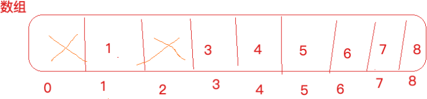

定义⼀个数组，数组⻓度⼤于等于数据集长度，此处长度为9，数据1就存储在下标为1的位置，3就存储 在下标为3的元素位置，，，依次类推。

这个时候，我想看下5存在与否，只需要判断list.get(5) array[5] 是否为空，如果为空，代表5不存在于数据集，如果不为空代表5在数据集当中，通过⼀次查找就达到了⽬的，时间复杂度为O(1)。

这种⽅式叫做“**直接寻址法**”：直接把数据和数组的下标绑定到⼀起，查找的时候，直接array[n]就取出了数据

**优点**：速度快，⼀次查找得到结果

**缺点**：

- 浪费空间，比如 1,5,7,6,3,4,8,12306 ，最⼤值12306 ，按照上述方式需要定义⼀个比如⻓度为12307的数组，但是只存储零星的几个数据，其他位置空间都浪费着
- 数据如：1,5,7,6,3,4,8,1,2,1,2,1,2,1,2,1,2,1,2,1,2,1,2,1,2,1,2,1,2最大值12，比如开辟13个空间，存储不了这么多内容

现在，换⼀种设计，如果数据是3，5，7，12306，⼀共4个数据，我们开辟任意个空间，比如5个，那 么具体数据存储到哪个位置呢，我们可以对数据进行求模（对空间位置数5），根据求模余数确定存储 位置的下标，比如3%5=3，就可以把3这个数据放到下标为3的位置上，12306%5=1，就把12306这个 数据存储到下标为1的位置上

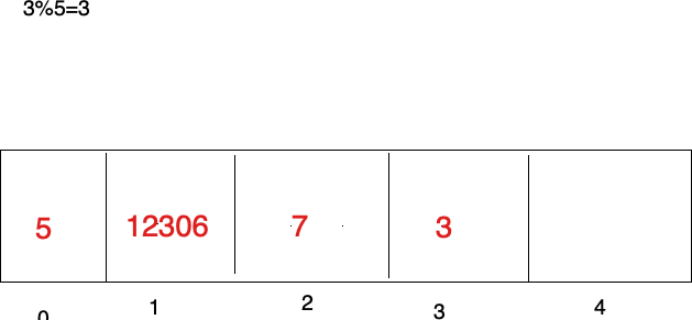

上面对数据求模（数据%空间位置数）他就是⼀个hash算法，只不过这是一种比较普通又简单的hash 算法，这种构造Hash算法的方式叫做除留余数法

如果数据是1，6，7，8，把这4个数据存储到上面的数组中

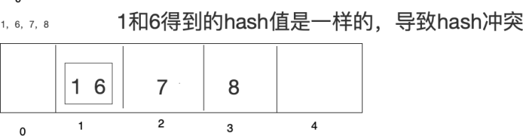

在此基础上采⽤开放寻址法（了解）

**开放寻址法：**1放进去了，6再来的时候，向前或者向后找空闲位置存放，不好的地方，如果数组长度定 义好了比如10，长度不能扩展，来了11个数据，不管Hash冲突不冲突，肯定存不下这么多数据

**拉链法**：数据长度定义好了，怎么存储更多内容呢，算好Hash值，在数组元素存储位置放了⼀个链表

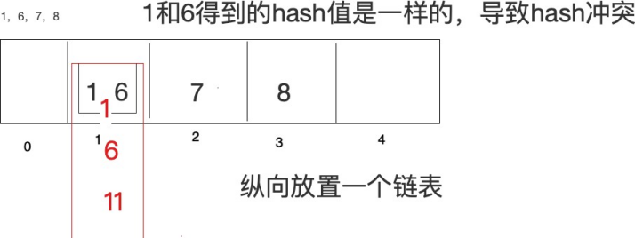

如果Hash算法设计的比较好的话，那么查询效率会更接近于O(1)，如果Hash算法设计的比较low，那么查询效率就会很低了


所以，Hash表的查询效率高不高取决于Hash算法，hash算法能够让数据平均分布，既能够节省空间又能提高查询效率。Hash算法的研究是很深的一门学问，比较复杂，长久以来，Hash表内部的Hash算法 也一直在更新，很多数学家也在研究。

- 除留余数法 3%5

- 线性构造Hash算法

- 直接寻址法也是⼀种构造Hash的⽅式，只不过更简单，表达式：H(key)=key

  比如H(key)=a*key + b(a,b是常量) 

  hashcode其实也是通过一个Hash算法得来的


# 第一节 Hash算法应用场景

> Hash算法在分布式集群架构中的应用场景

Hash算法在很多分布式集群产品中都有应用，比如分布式集群框架Redis，Hadoop，ElasticSearch，MySQL分库分表，Nginx负载均衡等

**主要的应用场景归纳起来两个：**

1. **请求的负载均衡（比如Nginx的ip_hash策略）**

   Nginx的ip_hash策略可以在客户端ip不变的情况下，将其发出的请求始终路由到同一个目标服务器上，实现回话粘滞，避免处理Session共享问题

   如果没有ip_hash策略，那么如何实现会话粘滞？

   ​	-> 可以维护一张映射表，存储客户端ip或者sessionid与具体目标服务器的映射关系

   **缺点**：

   - 在客户端很多的情况下，映射表非常大，浪费内存空间
   - 客户端上下线，目标服务器上下线，都会重新维护映射表，映射表维护成本很大

   如果使用哈希算法，事情就简单很多，我们可以对ip地址或者sessionid进行计算哈希值，哈希值与服务器数量进行取模计算，得到的值就是当前请求应该被路由到的服务器编号，如此，同一个客户端ip发送过来的请求就可以路由到同一个目标服务器，实现会话粘滞

2. **分布式存储**

   以分布式内存数据库Redis为例，集群中有redis1，redis2，redis3 三台Redis服务器

   那么，在进行数据存储时，<key1,value1>数据存储到哪个服务器当中呢？针对key进行hash处理

   hash(key1)%3=index，使用余数index锁定存储的具体服务器节点

# 第二节 普遍Hash算法存在的问题

普通Hash算法存在一个问题，以ip_hash为例，假定下载用户ip固定没有发生变化，现在Tomcat3出现了问题，宕机了，服务器数量从3个变成了2个，之前所有的求模都需要重新计算

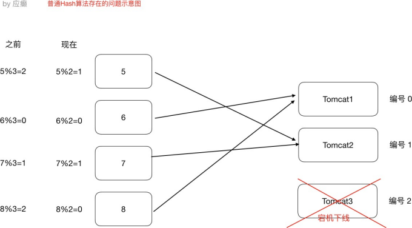

如果在真实生产环境下，后台服务器很多台，客户端也有很多，那么影响是很大的，缩容和扩容都会存在这样的问题，大量用户的请求会被路由到其他的目标服务器处理，用户在原来服务器中的会话都会丢失


# 第三节 一致性Hash算法

一致性Hash算法思路如下：

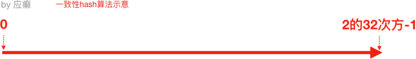

首先有一条直线，直线开头和结尾分别定位1和2^32-1，这相当于一个地址，，对于这样一条线，弯过来构成一个圆环形成闭环，这样的一个圆环称为hash环。我们把服务器的ip或者主机名求hash值然后对应到hash环上，那么针对客户端用户，也根据它的ip进行hash求值，对应到环上某个位置，然后如何确定一个客户端路由到哪个服务器处理呢？按照顺时针方向找最近的服务器节点

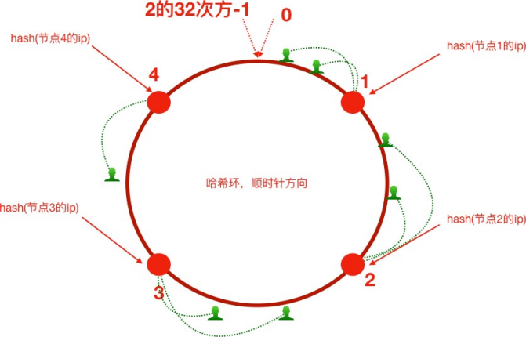


------

假如将服务器3下线，服务器3下线后，原来路由到3的客户端重新路由到服务器4
对于其他客户端没有影响，只是一小部分受影响（请求的迁移达到了最小，这样的算法对分布式集群来说非常的合适，避免了大量请求迁移）

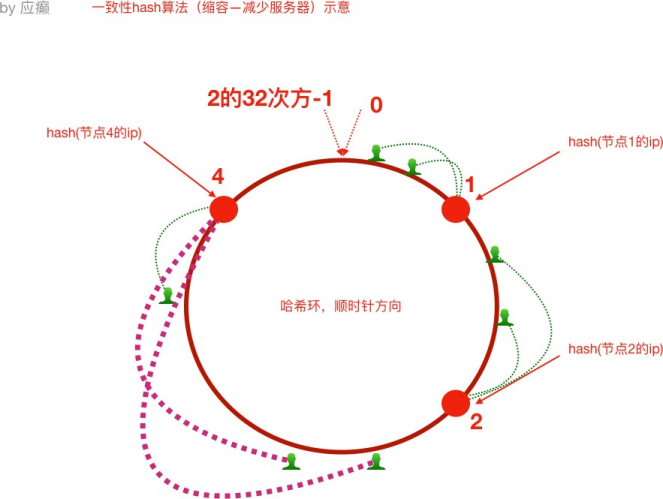


------

增加服务器5后，原来路由到3的部分客户端路由到新增的服务器5上，对于其他客户端没有影响，只是这一小部分受影响（请求的迁移达到了最小，这样的算法对分布式集群来说非常的合适，避免了大量请求迁移）

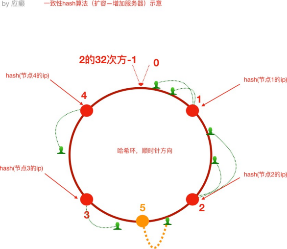


1）如前所述，每一台服务器负责一段，一致性Hash算法对于节点的增减都只需重新定位环空间中的一小部分数据，具有较好的容错性和扩展性。

但是，一致性Hash算法在服务节点太少时，容易因为**节点分布不均匀**而造成数据倾斜问题。例如系统中只有两台服务器，其环分布如下：

> 节点2只能负责非常小的一段，大量的客户端请求落在了节点1上，这就是数据（请求）倾斜问题

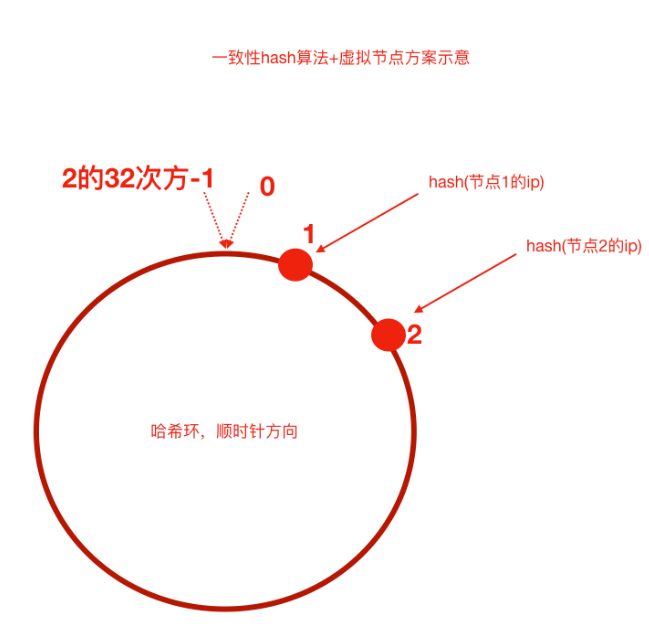

2）为了解决这种数据倾斜问题，一致性哈希算法引入了虚拟节点机制，即对每一个服务节点计算多个哈希，每个计算结果位置都放置一个此服务节点，称为虚拟节点。

具体做法可以在服务器ip或主机名的后面增加编号来实现。比如，可以为每台服务器计算三个虚拟节点，于是可以分别计算 “节点1的ip#1”、“节点1的ip#2”、“节点1的ip#3”、“节点2的ip#1”、“节点2的ip#2”、“节点2的ip#3”的哈希值，于是形成六个虚拟节点，当客户端被路由到虚拟节点的时候其实是被路由到该虚拟节点所对应的真实节点

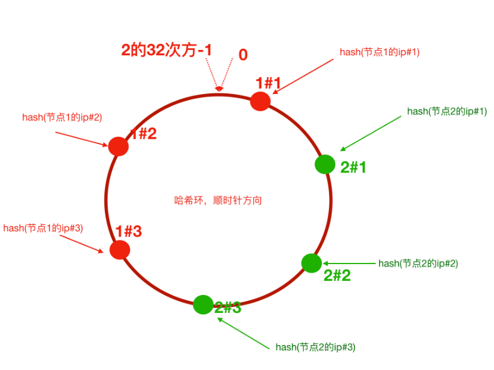


# 第四节 手写实现一致性Hash算法

## 4.1 普通Hash算法实现

```java
/**
* 普通Hash算法实现
*/
public class GeneralHash {
    public static void main(String[] args) {
        // 定义客户端IP
        String[] clients = new String[]{"10.78.12.3","113.25.63.1","126.12.3.8"};

        // 定义服务器数量
        int serverCount = 5;// (编号对应0，1，2)
        // hash(ip)%node_counts=index
        //根据index锁定应该路由到的tomcat服务器for(String client: clients) {
        int hash = Math.abs(client.hashCode()); int index = hash%serverCount;
        System.out.println("客户端：" + client + " 被路由到服务器编号为：" + index);
    }
}
}
```

## 4.2 一致性Hash算法实现-不含虚拟节点

```java
public class ConsistentHashNoVirtual {


    public static void main(String[] args) {
        //step1 初始化：把服务器节点IP的哈希值对应到哈希环上
        // 定义服务器ip
        String[] tomcatServers = new String[]
        {"123.111.0.0","123.101.3.1","111.20.35.2","123.98.26.3"};

        SortedMap<Integer,String> hashServerMap = new TreeMap<>();


        for(String tomcatServer: tomcatServers) {
            // 求出每⼀个ip的hash值，对应到hash环上，存储hash值与ip的对应关系
            int serverHash = Math.abs(tomcatServer.hashCode());
            // 存储hash值与ip的对应关系
            hashServerMap.put(serverHash,tomcatServer);
        }


        //step2 针对客户端IP求出hash值
        // 定义客户端IP
        String[] clients = new String[]
        {"10.78.12.3","113.25.63.1","126.12.3.8"};
        for(String client : clients) {
            int clientHash = Math.abs(client.hashCode());
            //step3 针对客户端,找到能够处理当前客户端请求的服务器（哈希环上顺时针最近）
            // 根据客户端ip的哈希值去找出哪⼀个服务器节点能够处理（）
            SortedMap<Integer, String> integerStringSortedMap =
                hashServerMap.tailMap(clientHash);
            if(integerStringSortedMap.isEmpty()) {
                // 取哈希环上的顺时针第⼀台服务器
                Integer firstKey = hashServerMap.firstKey();
                System.out.println("==========>>>>客户端：" + client + " 被路由到服务器：" + hashServerMap.get(firstKey));
            }else{
                Integer firstKey = integerStringSortedMap.firstKey();
                System.out.println("==========>>>>客户端：" + client + " 被路由到服务器：" + hashServerMap.get(firstKey));
            }
        }
    }


}

```


## 4.3 一致性Hash算法实现-含虚拟节点

```java
import java.util.SortedMap; import java.util.TreeMap;

public class ConsistentHashWithVirtual {


    public static void main(String[] args) {
        //step1 初始化：把服务器节点IP的哈希值对应到哈希环上
        // 定义服务器ip
        String[] tomcatServers = new String[]
        {"123.111.0.0","123.101.3.1","111.20.35.2","123.98.26.3"};


        SortedMap<Integer,String> hashServerMap = new TreeMap<>();

        // 定义针对每个真实服务器虚拟出来⼏个节点
        int virtaulCount = 3;

        for(String tomcatServer: tomcatServers) {
            // 求出每⼀个ip的hash值，对应到hash环上，存储hash值与ip的对应关系
            int serverHash = Math.abs(tomcatServer.hashCode());
            // 存储hash值与ip的对应关系
            hashServerMap.put(serverHash,tomcatServer);

            // 处理虚拟节点
            for(int i = 0; i < virtaulCount; i++) {
                int virtualHash = Math.abs((tomcatServer + "#" +i).hashCode());

                hashServerMap.put(virtualHash,"----由虚拟节点"+ i + "映射过来的请求："+ tomcatServer);
            }

        }


        //step2 针对客户端IP求出hash值
        // 定义客户端IP
        String[] clients = new String[]
        {"10.78.12.3","113.25.63.1","126.12.3.8"};
        for(String client : clients) {
            int clientHash = Math.abs(client.hashCode());
            //step3 针对客户端,找到能够处理当前客户端请求的服务器（哈希环上顺时针最近）
            // 根据客户端ip的哈希值去找出哪⼀个服务器节点能够处理（）
            SortedMap<Integer, String> integerStringSortedMap = hashServerMap.tailMap(clientHash);
            if(integerStringSortedMap.isEmpty()) {
                // 取哈希环上的顺时针第⼀台服务器
                Integer firstKey = hashServerMap.firstKey();
                System.out.println("==========>>>>客户端：" + client + " 被路由到服务器：" + hashServerMap.get(firstKey));
            }else{
                Integer firstKey = integerStringSortedMap.firstKey();
                System.out.println("==========>>>>客户端：" + client + " 被路由到服务器：" + hashServerMap.get(firstKey));
            }
        }
    }
}
```


# 第五节 Nginx配置一致性Hash负载均衡策略

ngx_http_upstream_consistent_hash模块是一个负载均衡器，使用一个内部一致性Hash算法来选择合适的后端节点

该模块可以根据配置参数采取不同的方式将请求均匀映射到后端机器

- consistent_hash $remote_addr ：可以根据客户端ip映射
- consistent_hash $request_uri ：根据客户端请求的uri映射
- consistent_hash $args ：根据客户端携带的参数进行映射

ngx_http_upstream_consistent_hash模块是一个第三方模块，需要我们下载安装后使用

1. GitHub下载nginx一致性Hash负载均衡模块

   > https://github.com/replay/ngx_http_consistent_hash

   

2. 将下载的压缩包上传到nginx服务器，并解压

3. 我们已经编译安装过nginx，此时进入当时nginx的源码目录，执行如下命令

   ```shell
   ./configure --add-module=/root/ngx_http_consistent_hash_master
   make
   make install
   ```

4. Nginx就可以使用了，在`nginx.conf`文件中配置

   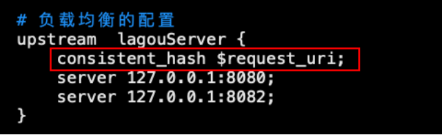
