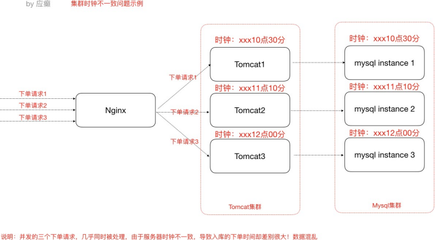
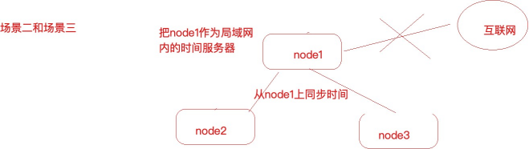

[TOC]

> 集群时钟同步问题

# 第一节 时钟不同步导致的问题

时钟此处指服务器时间，如果集群中各个服务器时钟不一致势必导致一系列问题，试想 “集群是各个服务器一起团队化作战，大家工作都不在一个点上，岂不乱了套！”

举一个例子，电商网站业务中，新增一条订单，那么势必会在订单表中增加了一条记录，该条记录中应该会有“下单时间”这样的字段，往往我们会在程序中获取当前系统时间插入到数据库或者直接从数据库服务器获取时间。那我们的订单子系统是集群化部署，或者我们的数据库也是分库分表的集群化部署，**然而他们的系统时钟缺不一致，比如有一台服务器的时间是昨天**，那么这个时候下单时间就成了昨天，那我们的数据将会混乱！如下




# 第二节 集群时钟同步配置

## 2.1 集群时钟同步思路

### 2.1.1 各个服务器节点都可以访问==互联网==

> 分布式集群中各个服务器节点都可以连接互联网

**思路：**


**操作方式：**

```shell
#使⽤ ntpdate ⽹络时间同步命令
ntpdate -u ntp.api.bz #从⼀个时间服务器同步时间
```

windows有计划任务，Linux也有定时任务 crond

可以使用Linux的定时任务，每隔10分钟执行一次ntpdate命令

### 2.1.2 只有某一个节点可以访问==互联网==

> 分布式集群中某一个服务器节点可以访问互联网或者所有节点都不能够访问互联网

**思路：**



**操作方式：**

1）选取集群中的一个服务器节点A(172.17.0.17)作为时间服务器（整个集群时间从这台服务器同步，如果这台服务器能够访问互联网，可以让这台服务器和网络时间保持同步，如果不能就手动设置一个时间）

- 首先设置好A的时间

- 把A配置为时间服务器（修改/etc/ntp.conf文件）

  ```shell
  #1、如果有 restrict default ignore，注释掉它
  #2、添加如下⼏⾏内容
  
  # 放开局域⽹同步功能,172.17.0.0是你的局域⽹⽹段
  restrict 172.17.0.0 mask 255.255.255.0 nomodify notrap 
  
  server 127.127.1.0 # local clock fudge 
  127.127.1.0 stratum 10
  
  
  #3、重启⽣效并配置ntpd服务开机⾃启动
  service ntpd restart chkconfig ntpd on
  ```

- 集群中其他节点就可以从A服务器同步时间了

  ```shell
  ntpdate 172.17.0.17
  ```

  


