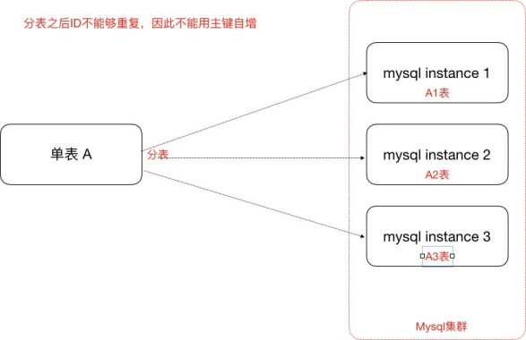
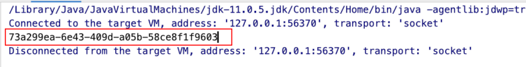
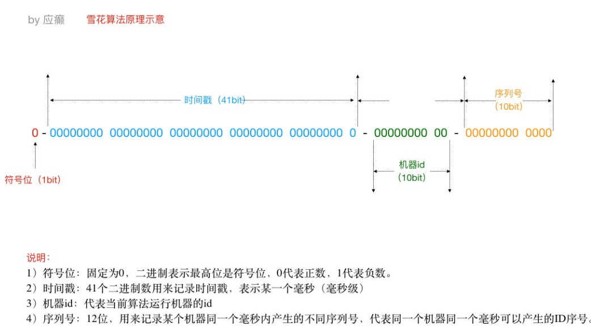
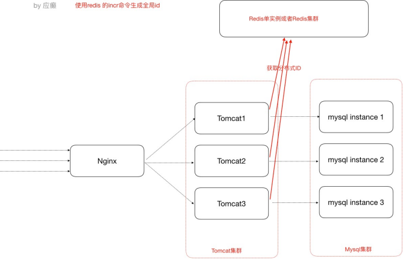

[TOC]

# 分布式ID解决方案

> 为什么需要分布式ID（分布式集群环境下的全局唯一ID）




## UUID - 可以用

**UUID** 是指Universally Unique Identifier，翻译为中文就是==通用唯一识别码==

产生重复UUID并造成错误的情况非常低，是大可不必考虑此问题的。

Java中得到一个UUID，可以使用java.util包提供的方法

```java
public class MyTest {
    public static void main(String[] args) { 
        System.out.println(java.util.UUID.randomUUID().toString());
    }
}
```




## 独立数据库的自增ID

比如A表分表为A1表和A2表，那么肯定不能让A1表和A2表的ID自增，那么ID怎么获取呢？我们可以单独的创建一个Mysql数据库，在这个数据库中创建一张表，这张表的ID设置为自增，其他地方需要全局唯一ID的时候，就模拟向这个Mysql数据库的这张表中模拟插入一条记录，此时ID会自增，然后我们可以通过Mysql的select last_insert_id() 获取到刚刚这张表中自增生成的ID。

比如，我们创建了一个数据库实例global_id_generator，在其中创建了一个数据表，表结构如下：

```sql
-- ------------------------------ 
-- Table structure for DISTRIBUTE_ID
-- ----------------------------
DROP TABLE IF EXISTS `DISTRIBUTE_ID`;
CREATE TABLE `DISTRIBUTE_ID` (
    `id` bigint(32) NOT NULL AUTO_INCREMENT COMMENT '主键',
    `createtime` datetime DEFAULT NULL,
    PRIMARY KEY (`id`)
) ENGINE=InnoDB DEFAULT CHARSET=utf8;
```

当分布式集群环境中哪个应用需要获取一个全局唯一的分布式ID的时候，就可以使用代码连接这个数据库实例，执行如下sql语句即可。

```sql
insert into DISTRIBUTE_ID(createtime) values(NOW());
select LAST_INSERT_ID()；
```

**注意：**

- 这里的createtime字段无实际意义，是为了随便插入一条数据以至于能够自增id。
- 使用独立的Mysql实例生成分布式id，虽然可行，但是性能和可靠性都不够好，因为你需要代码连接到数据库才能获取到id，性能无法保障，另外mysql数据库实例挂掉了，那么就无法获取分布式id了。
- 有一些开发者又针对上述的情况将用于生成分布式id的mysql数据库设计成了一个集群架构，那么其实这种方式现在基本不用，因为过于麻烦了


## SnowFlake雪花算法 - ==推荐使用==

雪花算法是Twitter推出的一个用于生成分布式ID的策略。

雪花算法是一个算法，基于这个算法可以生成ID，生成的ID是一个long型，那么在Java中一个long型是8个字节，算下来是64bit，如下是使用雪花算法生成的一个ID的二进制形式示意



另外，一切互联网公司也基于上述的方案封装了一些分布式ID生成器，比如

- 滴滴的tinyid（基于数据库实现）
- 百度的uidgenerator（基于SnowFlake）
- 美团的leaf（基于数据库和SnowFlake）等


## 借助Redis的Incr命令 - ==推荐==

> 借助Redis的Incr命令获取全局唯一ID（推荐）

Redis Incr 命令将 key 中储存的数字值增一。如果 key 不存在，那么 key 的值会先被初始化为 0，然后再执行 INCR 操作。




### 使用案例

1. 安装Redis

   参考Redis笔记

2. Java代码中使用Jedis客户端调用Reids的incr命令获得一个全局的id

   - 进入jedis客户端jar

     ```xml
     <dependency>
         <groupId>redis.clients</groupId>
         <artifactId>jedis</artifactId>
         <version>2.9.0</version>
     </dependency>
     ```

   - Java代码

     ```java
     
     Jedis jedis = new Jedis("127.0.0.1",6379); 
     try {
         long id = jedis.incr("id");
         System.out.println("从redis中获取的分布式id为：" + id);
     } finally {
         if (null != jedis) { 
             jedis.close();
         }
     }
     ```

     
