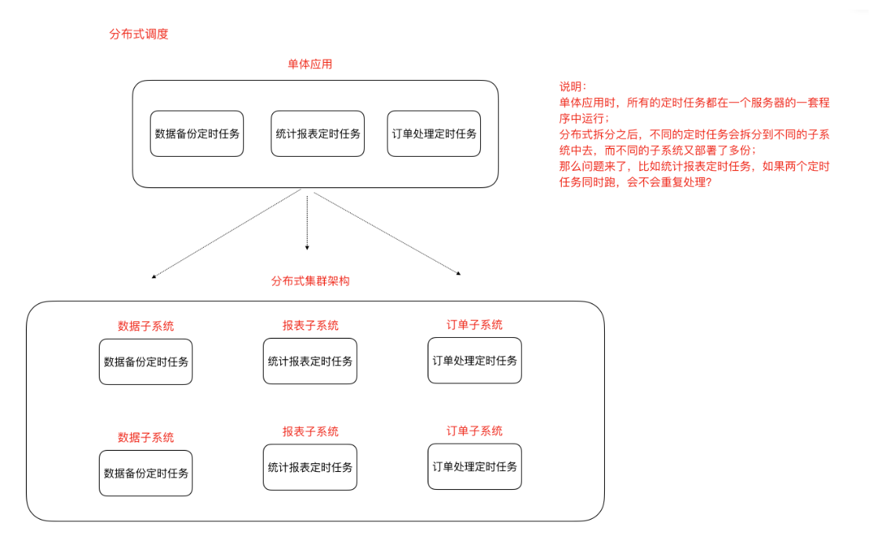

[TOC]

# 分布式调度问题

调度 —> 定时任务 , 分布式调度 —> 在分布式集群环境下的定时任务

Elastic-job（当当网开源的分布式调度框架）

## 1. 定时任务的场景

定时任务形式：每隔一段时间/特定某一时刻执行

例如：

- 订单审核、出库
- 订单超时自动去校、支付退款
- 礼券同步、生成、发放作业
- 物流信息推送、抓取作业、退换货处理作业
- 数据积压监控、日志监控、服务可用性探测作业
- 定时备份数据 
- ⾦融系统每天的定时结算 
- 数据归档、清理作业 
- 报表、离线数据分析作业

## 2. 什么是分布式调度

有两层含义

1. 运行在分布式集群环境下的调度任务（同一个定时任务程序部署多份，只应该有一个定时任务在执行）
2. 分布式调度—>定时任务的分布式—>定时任务的拆分（即为把一个大的作业任务拆分为多个小的作业任务，同时执行）

