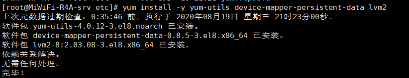
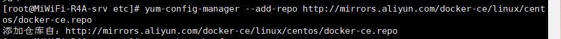
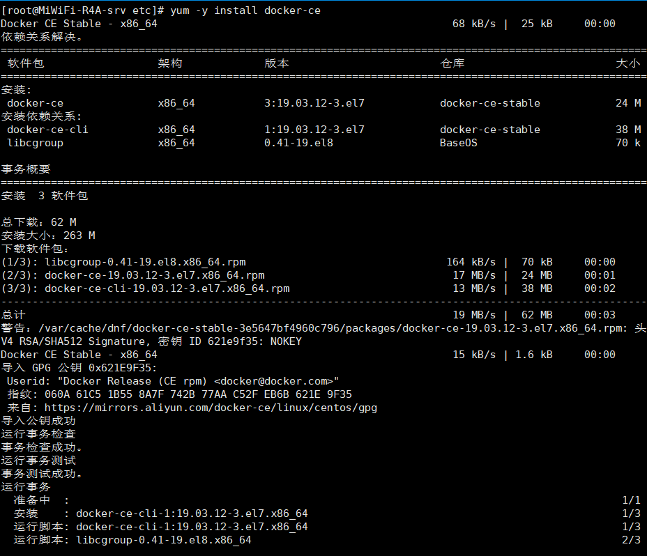
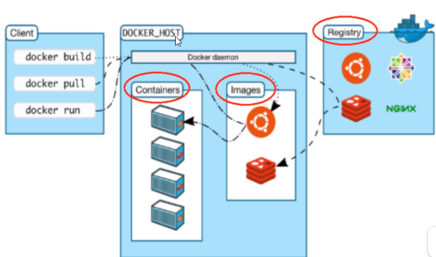
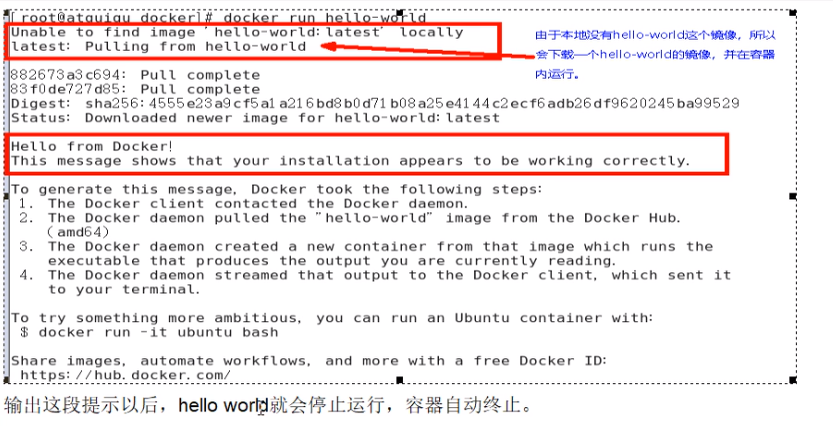
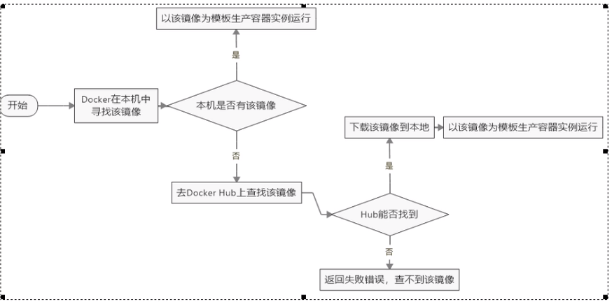
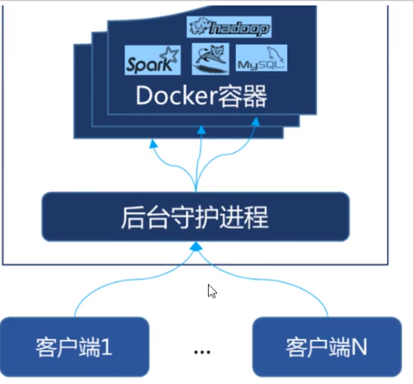
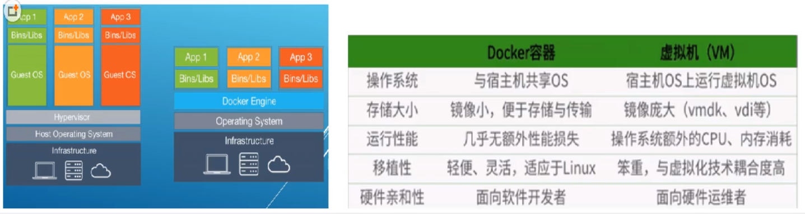

[TOC]

# Docker入门

## Docker CE 安装

> 通过阿里ECS安装

1. 安装必要的一些系统工具

   ```shell
   $ yum install -y yum-utils device-mapper-persistent-data lvm2
   ```

   

2. 添加软件源信息

   ```shell
   $ sudo yum-config-manager \
   	--add-repo http://mirrors.aliyun.com/docker-ce/linux/centos/docker-ce.repo
   ```

   

3. 更新并安装Docker CE

   ```shell
   $ yum makeache fast
   $ yum install docker-ce docker-ce-cli containerd.io
   ```

   

4. 开启Docker服务

   ```sh
   # CentOS <7
   $ service docker start
   
   #CentOS >=7
   $ systemctl start docker
   ```

5. 安装校验

   ```shell
   [root@MiWiFi-R4A-srv docker]# docker version
   Client: Docker Engine - Community
    Version:           19.03.12
    API version:       1.40
    Go version:        go1.13.10
    Git commit:        48a66213fe
    Built:             Mon Jun 22 15:46:54 2020
    OS/Arch:           linux/amd64
    Experimental:      false
   
   Server: Docker Engine - Community
    Engine:
     Version:          19.03.12
     API version:      1.40 (minimum version 1.12)
     Go version:       go1.13.10
     Git commit:       48a66213fe
     Built:            Mon Jun 22 15:45:28 2020
     OS/Arch:          linux/amd64
     Experimental:     false
    containerd:
     Version:          1.2.13
     GitCommit:        7ad184331fa3e55e52b890ea95e65ba581ae3429
    runc:
     Version:          1.0.0-rc10
     GitCommit:        dc9208a3303feef5b3839f4323d9beb36df0a9dd
    docker-init:
     Version:          0.18.0
     GitCommit:        fec3683
   ```

6. 更改阿里云镜像加速

   > https://4kfm6u95.mirror.aliyuncs.com   -->  账号专属的加速器地址

   

   ```shell
   $ cd /etc/docker
   $ tee /etc/docker/daemon.json <<-'EOF'
   >{"registry-mirrors":["https://4kfm6u95.mirror.aliyuncs.com"]}
   >EOF
   
   # 重新加载
   $ systemctl daemon-reload
   # 重启docker
   $ systemctl restart docker
   ```

7. 通过运行hello-world 映像验证是否正确安装了Docker Engine-Community

   ```shell
   $ docker run hello-world
   ```


## Docker卸载

1. `systemctl stop docker`
2. `yum -y remove docker-ce`
3. `rm -rf /var/lib/docker`

## Docker 图解






## run之后Docker做了什么




# Docker运行底层原理

## Docker是怎么工作的？

Docker是一个Client-Server结构的系统，Docker守护进程运行在主机上，然后通过Socket连接客户端访问，守护进程从客户端接受命令并管理运行在主机上的容器

> 容器：是一个运行时环境，就是一个一个的虚拟系统（鲸鱼上的集装箱）



## 为什么Docker比VM快

1. Docker有着比虚拟机更少的抽象层。由于Docker不需要Hypervisor实现硬件资源虚拟化，运行在Docker容器上的程序直接使用的都是实际物理机的硬件资源。因此在CPU、内存利用率上Docker将会在效率上有明显优势
2. Docker利用的是宿主机的内核，而不需要Guest OS。因此，当新建一个容器时，Docker不需要和虚拟机一样重新加载一个操作系统内核。从而避免引寻、加载操作系统内核这个比较费时费资源的过程，当新建一个虚拟机时，虚拟机软件需要加载Guest OS，这个新建过程是分钟级别的。而Docker由于直接利用宿主机的操作系统，则省略了繁琐过程，因此新建一个Docker容器只需要几秒钟。

