[TOC]

# 1、帮助命令

```shell
$ docker version
$ docker info
$ docker --help
```


# 2、镜像命令

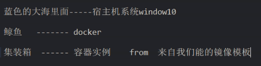

## 列出主机上的镜像

> `docker images` 

列出主机上镜像

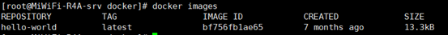

各个选项说明：

| 选项      | 说明             |
| --------- | ---------------- |
| REPOSITOR | 标识镜像的仓库源 |
| TAG       | 镜像的标签       |
| IMAGE ID  | 镜像ID           |
| CREATED   | 镜像创建时间     |
| SIZE      | 镜像大小         |

同一仓库源可以有多个TAG，代表这个仓库源的不同版本，我们使用`REPOSITORY:TAG` 来定义不同的镜像，如果你不指定一个镜像的版本标签，例如你只使用Ubuntu，Docker将默认使用`Ubuntu:latest`

`docker images`的常见参数说明：

| 参数       | 说明                               |
| ---------- | ---------------------------------- |
| -a         | 列出本地所有的镜像（含中间映射层） |
| -q         | 只显示镜像ID                       |
| --digests  | 显示镜像的摘要信息，类似于备注     |
| --no-trunc | 显示完整的镜像信息                 |

### 示例

1. `docker images -a`

   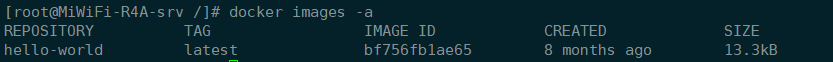

2. `docker images -q`

   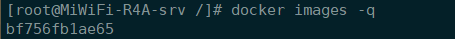

3. `docker images --digests`

   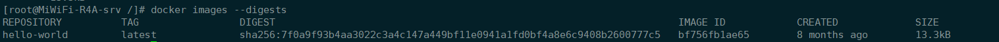

4. `docker --no-trunc`

   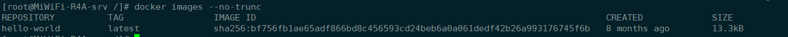

## 从仓库中查找镜像

> `docker search`

到仓库查找镜像，如果配置了阿里云镜像，查找依然在官方仓库查找，但是下载会去阿里云上下载

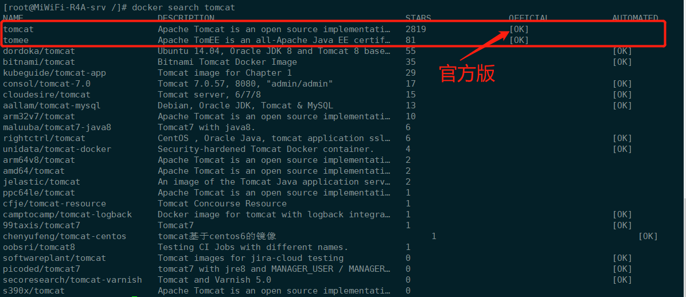

常见参数说明：

| 参数        | 说明                                         |
| ----------- | -------------------------------------------- |
| --no-trunc  | 显示完整的镜像描述                           |
| ==-s==      | 列出收藏数不小于指定值的镜像                 |
| --automated | 只列出 automated build (自动构建) 类型的镜像 |

### 示例

1. `docker search -s 30 tomact`

   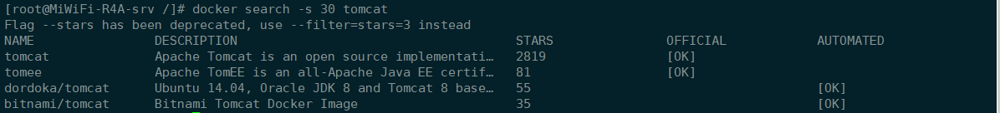

2. `docker search -s 30 --no-trunc tomcat`

   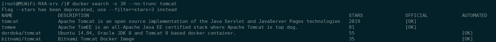

3. `docker search -s 30 --automated tomcat`

   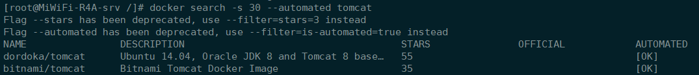

## 下载镜像

> `docker pull`

docker pull:[TAG]

docker pull tomcat 等价于 `docker pull tomcat:latest`

docker pull tomcat:3.2.2 相当于拉取指定版本的tomcat

### 示例

`docker pull tomcat`


通过查看本机镜像，可以看到下载好的镜像`docker images`

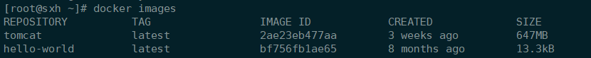


## 删除镜像

> `docker rmi`
>
> docker rmi hello-world 相当于`docker rmi hello-world:latest`

### 删除单个

> `docker rmi -f 镜像ID/唯一镜像名`

如果镜像使用过或者正在使用，会提示删除失败

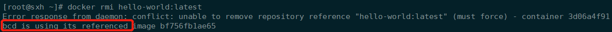

此时可以通过`-f`参数强制删除：`docker rmi -f hello-world`。也会将该镜像所依赖（中间映射）镜像删除掉。==如下图，有两个被删除了==

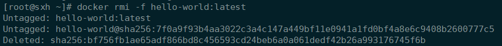

### 删除多个

> `docker rmi -f 镜像名 镜像名 ...`

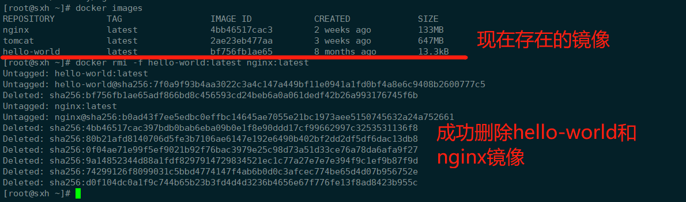

### 删除全部

> `docker rmi -f $(docker images -q)`


# 3、容器命令

> 有镜像才能创建容器，这是根本前提（以CentOS镜像演示）

`docker pull centos`

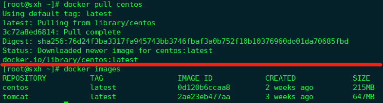


## 新建并启动容器

命令：**docker run [OPTIONS] IMAGE [COMMAND] [TAG...]**

OPTIONS说明（常用）：

| 参数   | 说明                                                         |
| ------ | ------------------------------------------------------------ |
| --name | 为容器指定一个名称                                           |
| -d     | 后台运行容器，并返回容器ID，也即启动守护式容器               |
| ==-i== | ==以交互式模式运行容器，通常与-t同时使用==                   |
| ==-t== | ==为容器重新分配一个伪输入终端，通常与-i同时使用==           |
| -P     | 随机端口映射                                                 |
| -p     | 指定端口映射，有以下四种格式：<br />ip:hostPort:containerPort<br />ip::containerPort<br />==hostPort:containerPort==<br />containerPort |

### 示例

1. 先查看本机所有镜像：`docker images`

   

2. 创建并启动容器：`docker run -it --name centos02 0d120b6ccaa8 `

   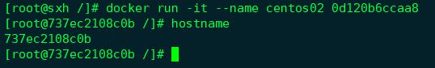

   

## 列出当前所有==正在运行==的容器

命令：**docker ps [OPTIONS]**

> 需要在宿主机上执行该命令

参数说明：

| 参数            | 说明                                              |
| --------------- | ------------------------------------------------- |
| -a              | 列出当前所有**正在运行**的容器+**历史上运行过**的 |
| -l*(注：小写l)* | 显示最近创建的容器                                |
| -n              | 显示最近n个创建的容器                             |
| ==-q==          | ==静默模式，只显示容器编号==                      |
| --no-trunc      | 不截断输                                          |

### 示例

1. 重新打开一个命令终端

2. 输入命令，查看正在运行的容器:`docker ps`

   

3. 查看所有运行过和正在运行的容器:`docker ps -a`

   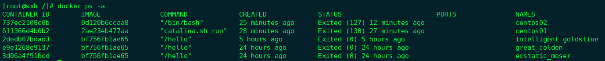

4. 之查看容器编号:`docker ps -aq`

   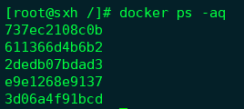

## 退出容器

> 有两种退出方式

1. 容器停止退出：exit

   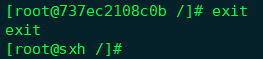

   通过`docker ps`查看正在运行容器，会发现容器已经停止

   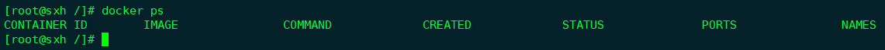

   通过`docker ps -l`查看运行过的容器

   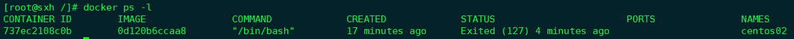

2. 容器不停止退出：Ctrl+P+Q

   通过`docker ps`查看正在运行的容器，会发现容器依然在运行

   

## 启动容器

命令：**docker start 容器ID/容器名**

> 启动成功后会返回容器ID

### 示例

1. 查看所有容器：`docker ps -a`

   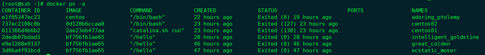

2. 启动上次停止的容器：`docker start xxxxxx`

   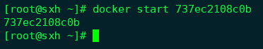


## 重启容器

命令：**docker restart 容器ID/容器名**

> 重启成功后，会返回容器编号

### 示例

1. 查看所有启动的容器：`docker ps`

   

2. 重启容器：`docker restart xxxxx`

   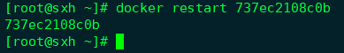


## 停止容器

命令：**docker stop 容器ID/容器名**

> 正常停止，比较慢

### 示例

1. 查看所有容器：`docker ps`

   

2. 停止一个容器：`docker stop xxxxx`


## 强制停止容器

命令：**docker kill 容器ID/容器名**

> 强制停止，会马上停止该容器

### 示例

1. 查看所有容器：`docker ps`

   

2. 强制停止一个容器：`docker kill xxxxxx`


## 删除已停止的容器

命令：

1. 一次删除一个容器：**docker rm 容器ID**
2. 一次删除多个容器：**docker rm -f $(docker ps -a -q)** 或者 **docker ps -a -q | xargs docker rm**

> 与删除镜像区分：`docker rmi xxx`


## ==重要的命令==

### ==启动守护式容器==

命令：**docker run -d 容器ID/容器名**

> 启动成功后，会返回一个ID，但是通过`docker ps`查不到，因为容器已经退出

很重要的一点：Docker容器后台运行，就必须有一个前台进程。容器运行的命令如果不是那些==一直挂起的命令==(比如top,tail)，就是自动退出的。

这个是docker的机制问题，比如你的web容器，我们以nginx为例，正常情况下，我们配置启动服务只需要启动响应的service即可。例如：service nginx start

但是，这样做，nginx为后台进程模式运行，就导致docker前台没有运行的应用，这样的容器后台启动后，会立即自杀，因为他觉得他没事可做了。所以，==最佳的解决方案是：将要运行的程序以前台进程的形式运行==


### 查看容器日志

命令：**docker logs -f -t --tail 容器ID**

参数说明：

| 参数        | 说明               |
| ----------- | ------------------ |
| -t          | 显示时间戳         |
| -f          | 动态打印最新的日志 |
| --tail 数字 | 显示最后多少条记录 |

1. 启动一个守护式容器，通过打印输出，不让容器自动退出

   ```shell
   $ docker run -d centos /bin/sh -c "while true;do echo hello sxh;sleep 2;done"
   ```

   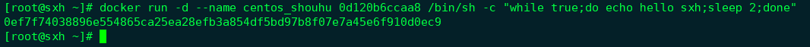

2. 通过`docker ps`查看正在运行的容器

   ```shell
   $ docker ps
   ```

   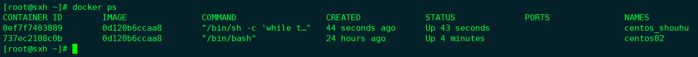

3. 查看守护容器的日志，发现有打印输出的内容

   ```shell
   $ docker logs -t -f 容器ID
   ```

   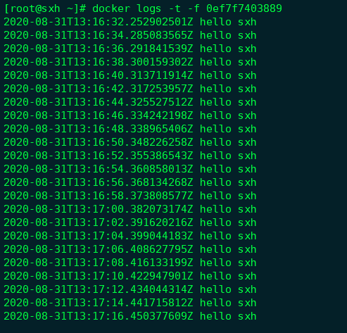


### 查看容器内运行的进程

命令：**docker top 容器ID**

> Linux命令：`top`查看Linxu进程

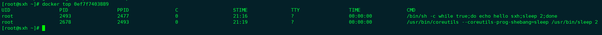


### 查看容器内部细节

命令：**docker inspect 容器ID**

> 会返回一个JSON串，包含了所有内容

```json
[root@sxh ~]# docker inspect 0ef7f7403889
[
    {
        "Id": "0ef7f74038896e554865ca25ea28efb3a854df5bd97b8f07e7a45e6f910d0ec9",
        "Created": "2020-08-31T13:16:31.915460343Z",
        "Path": "/bin/sh",
        "Args": [
            "-c",
            "while true;do echo hello sxh;sleep 2;done"
        ],
        "State": {
            "Status": "running",
            "Running": true,
            "Paused": false,
            "Restarting": false,
            "OOMKilled": false,
            "Dead": false,
            "Pid": 2493,
            "ExitCode": 0,
            "Error": "",
            "StartedAt": "2020-08-31T13:16:32.25137072Z",
            "FinishedAt": "0001-01-01T00:00:00Z"
        },
        "Image": "sha256:0d120b6ccaa8c5e149176798b3501d4dd1885f961922497cd0abef155c869566",
        "ResolvConfPath": "/var/lib/docker/containers/0ef7f74038896e554865ca25ea28efb3a854df5bd97b8f07e7a45e6f910d0ec9/resolv.conf",
        "HostnamePath": "/var/lib/docker/containers/0ef7f74038896e554865ca25ea28efb3a854df5bd97b8f07e7a45e6f910d0ec9/hostname",
        "HostsPath": "/var/lib/docker/containers/0ef7f74038896e554865ca25ea28efb3a854df5bd97b8f07e7a45e6f910d0ec9/hosts",
        "LogPath": "/var/lib/docker/containers/0ef7f74038896e554865ca25ea28efb3a854df5bd97b8f07e7a45e6f910d0ec9/0ef7f74038896e554865ca25ea28efb3a854df5bd97b8f07e7a45e6f910d0ec9-json.log",
        "Name": "/centos_shouhu",
        "RestartCount": 0,
        "Driver": "overlay2",
        "Platform": "linux",
        "MountLabel": "",
        "ProcessLabel": "",
        "AppArmorProfile": "",
        "ExecIDs": null,
        "HostConfig": {
            "Binds": null,
            "ContainerIDFile": "",
            "LogConfig": {
                "Type": "json-file",
                "Config": {}
            },
            "NetworkMode": "default",
            "PortBindings": {},
            "RestartPolicy": {
                "Name": "no",
                "MaximumRetryCount": 0
            },
            "AutoRemove": false,
            "VolumeDriver": "",
            "VolumesFrom": null,
            "CapAdd": null,
            "CapDrop": null,
            "Capabilities": null,
            "Dns": [],
            "DnsOptions": [],
            "DnsSearch": [],
            "ExtraHosts": null,
            "GroupAdd": null,
            "IpcMode": "private",
            "Cgroup": "",
            "Links": null,
            "OomScoreAdj": 0,
            "PidMode": "",
            "Privileged": false,
            "PublishAllPorts": false,
            "ReadonlyRootfs": false,
            "SecurityOpt": null,
            "UTSMode": "",
            "UsernsMode": "",
            "ShmSize": 67108864,
            "Runtime": "runc",
            "ConsoleSize": [
                0,
                0
            ],
            "Isolation": "",
            "CpuShares": 0,
            "Memory": 0,
            "NanoCpus": 0,
            "CgroupParent": "",
            "BlkioWeight": 0,
            "BlkioWeightDevice": [],
            "BlkioDeviceReadBps": null,
            "BlkioDeviceWriteBps": null,
            "BlkioDeviceReadIOps": null,
            "BlkioDeviceWriteIOps": null,
            "CpuPeriod": 0,
            "CpuQuota": 0,
            "CpuRealtimePeriod": 0,
            "CpuRealtimeRuntime": 0,
            "CpusetCpus": "",
            "CpusetMems": "",
            "Devices": [],
            "DeviceCgroupRules": null,
            "DeviceRequests": null,
            "KernelMemory": 0,
            "KernelMemoryTCP": 0,
            "MemoryReservation": 0,
            "MemorySwap": 0,
            "MemorySwappiness": null,
            "OomKillDisable": false,
            "PidsLimit": null,
            "Ulimits": null,
            "CpuCount": 0,
            "CpuPercent": 0,
            "IOMaximumIOps": 0,
            "IOMaximumBandwidth": 0,
            "MaskedPaths": [
                "/proc/asound",
                "/proc/acpi",
                "/proc/kcore",
                "/proc/keys",
                "/proc/latency_stats",
                "/proc/timer_list",
                "/proc/timer_stats",
                "/proc/sched_debug",
                "/proc/scsi",
                "/sys/firmware"
            ],
            "ReadonlyPaths": [
                "/proc/bus",
                "/proc/fs",
                "/proc/irq",
                "/proc/sys",
                "/proc/sysrq-trigger"
            ]
        },
        "GraphDriver": {
            "Data": {
                "LowerDir": "/var/lib/docker/overlay2/a374a6ae2abce4acb8436c0e519fa3917efd2b191fa9d304033682b3747c77c9-init/diff:/var/lib/docker/overlay2/51b67829e9dbf4d7daf851f9ce50a4134b3fab6dd6a5749bb13b9a3f8c85e28d/diff",
                "MergedDir": "/var/lib/docker/overlay2/a374a6ae2abce4acb8436c0e519fa3917efd2b191fa9d304033682b3747c77c9/merged",
                "UpperDir": "/var/lib/docker/overlay2/a374a6ae2abce4acb8436c0e519fa3917efd2b191fa9d304033682b3747c77c9/diff",
                "WorkDir": "/var/lib/docker/overlay2/a374a6ae2abce4acb8436c0e519fa3917efd2b191fa9d304033682b3747c77c9/work"
            },
            "Name": "overlay2"
        },
        "Mounts": [],
        "Config": {
            "Hostname": "0ef7f7403889",
            "Domainname": "",
            "User": "",
            "AttachStdin": false,
            "AttachStdout": false,
            "AttachStderr": false,
            "Tty": false,
            "OpenStdin": false,
            "StdinOnce": false,
            "Env": [
                "PATH=/usr/local/sbin:/usr/local/bin:/usr/sbin:/usr/bin:/sbin:/bin"
            ],
            "Cmd": [
                "/bin/sh",
                "-c",
                "while true;do echo hello sxh;sleep 2;done"
            ],
            "Image": "0d120b6ccaa8",
            "Volumes": null,
            "WorkingDir": "",
            "Entrypoint": null,
            "OnBuild": null,
            "Labels": {
                "org.label-schema.build-date": "20200809",
                "org.label-schema.license": "GPLv2",
                "org.label-schema.name": "CentOS Base Image",
                "org.label-schema.schema-version": "1.0",
                "org.label-schema.vendor": "CentOS"
            }
        },
        "NetworkSettings": {
            "Bridge": "",
            "SandboxID": "66444b7cc32692d6581e321b23e39fa5fdeca140c2385d734db342624c7d302d",
            "HairpinMode": false,
            "LinkLocalIPv6Address": "",
            "LinkLocalIPv6PrefixLen": 0,
            "Ports": {},
            "SandboxKey": "/var/run/docker/netns/66444b7cc326",
            "SecondaryIPAddresses": null,
            "SecondaryIPv6Addresses": null,
            "EndpointID": "b60d120d3a8fea831ea9a7272a25b7701202ff002628604c50270a7be0379736",
            "Gateway": "172.17.0.1",
            "GlobalIPv6Address": "",
            "GlobalIPv6PrefixLen": 0,
            "IPAddress": "172.17.0.3",
            "IPPrefixLen": 16,
            "IPv6Gateway": "",
            "MacAddress": "02:42:ac:11:00:03",
            "Networks": {
                "bridge": {
                    "IPAMConfig": null,
                    "Links": null,
                    "Aliases": null,
                    "NetworkID": "16c781d3b2b7ec5fa445a4d1e418102b9c61f856a04837a516912bace70b9ab9",
                    "EndpointID": "b60d120d3a8fea831ea9a7272a25b7701202ff002628604c50270a7be0379736",
                    "Gateway": "172.17.0.1",
                    "IPAddress": "172.17.0.3",
                    "IPPrefixLen": 16,
                    "IPv6Gateway": "",
                    "GlobalIPv6Address": "",
                    "GlobalIPv6PrefixLen": 0,
                    "MacAddress": "02:42:ac:11:00:03",
                    "DriverOpts": null
                }
            }
        }
    }
]

```


### 进入正在运行的容器并以命令行交互

1. 在宿主机上操作容器`docker exec -it 容器ID bashShell`

   > 在宿主机上查看容器中 `/tmp` 目录下的内容

   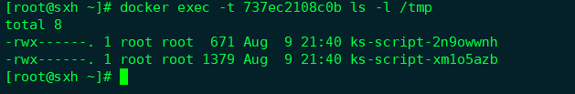

   > 也可重新进入容器

   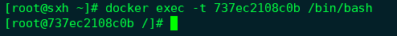

2. 重新进入`docker attach 容器ID`

   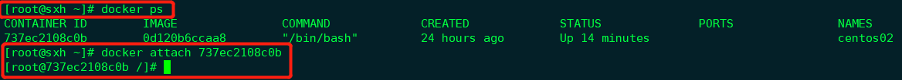

> 上述两个的区别：
>
> - exec：是在容器中打开新的终端，并且可以启动新的进程
>
> - attach：直接进入容器启动命令的终端，不会启动新的进程

### 从容器内拷贝文件到主机上

命令：**docker cp 容器ID:容器内路径 目的主机路径**

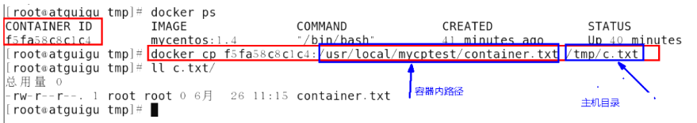

将容器`/tmp`下的文件拷贝到宿主机的`/home`下

```shell
$ docker cp 737ec2108c0b:/tmp/ks-script-2n9owwnh /home/
```

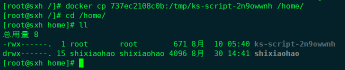


