[TOC]

# 1、Docker镜像是什么

> 镜像是一种轻量级、可执行的独立软件包，==用来打包软件运行环境和基于运行环境开发的软件==，它包含运行某个软件所需的所有内容，包括代码、运行时、库、环境变量和配置文件

## UnionFS（联合文件系统）

UnionFS（联合文件系统）：Union文件系统（UnionFS）是一种分层、轻量级并且高性能的文件系统，它支持==对文件系统的修改作为一次提交来一层层的叠加==，同时可以将不同目录挂载到同一个虚拟文件系统下（unite several directories into a single virtual filesystem）。Union文件系统是Docker镜像的基础。镜像可以通过分层来进行继承，基于基础镜像(没有父镜像)，可以制作各种具体的应用镜像。

特性：一次同时加载多个文件系统，但从外面看起来，只能看到一个文件系统，联合加载会把各层文件系统叠加起来，这样最终的文件系统会包含所有底层的文件和目录

## Docker镜像加载原理

Docker的镜像实际上由一层一层的文件系统组成，这种层级的文件系统是UnionFS

- bootfs(boot file system) 主要包含bootloader和kernel，bootloader主要是引导加载kernel，Linux刚启动时会加载bootfs文件系统，==在Docker镜像的最底层时bootfs==。这一层与我们典型的Linux/Unix系统是一样的，包含boot加载器和内核。当boot加载完成之后整个内核就都在内存中了，此时内存的使用权已由bootfs转交给内核，此时系统也会卸载bootfs。

- rootfs(root file system)，在bootfs之上。包含的就是典型Linux系统中的/dev,/proc,/bin,/etc等标准目录和文件。rootfs就是各种不同的操作系统发行版，比如Ubuntu，Centos等等

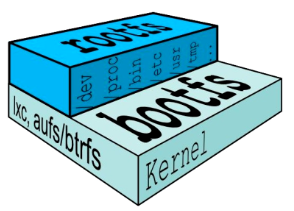

*平时我们安装进虚拟机的CentOS都是好几个G，为什么docker里的Centos才200MB？*

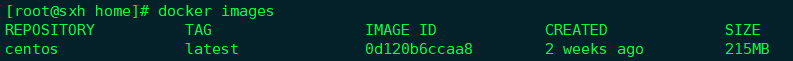

对于一个精简的OS，rootfs可以很小，只需要包括最基本的命令、工具和程序库就可以了，以为底层直接用Host和Kernel，自己只需要提供rootfs就行了。由此可见对于不同的Linux发行版，bootfs基本是一致的，rootfs会有差别，因此不同的发行版可以公用bootfs。

## 分层的镜像

以`docker pull`为例，在下载的过程中我们可以看到docker的镜像好像是在一层一层的在下载

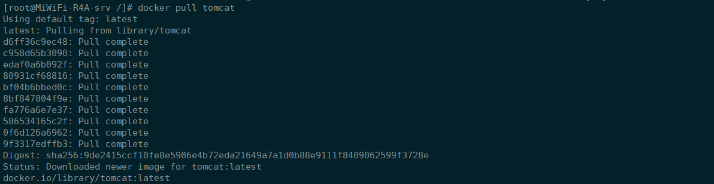

==图解tomcat为什么镜像特别大==（镜像是分层的）

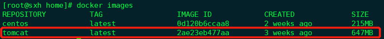

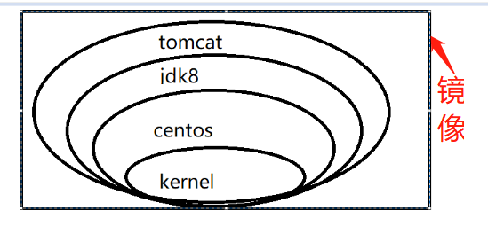

> Tomcat需要jdk8，需要运行在Centos上，需要Linux内核等等，一层一层的加起来，组成了一个镜像，提供使用

## 为什么Docker镜像要采用这种分层结构？

最大的一个好处就是：==共享资源==

比如：有多个镜像都从相同的base镜像构建而来，那么宿主机只需要在磁盘上保存一份base镜像，同时内存中也只需要加载一份base镜像，就可以为所有容器服务了。而且镜像的每一层都可以被共享。

# 2、Docker镜像的特点

Docker镜像都是只读的，当容器启动时，一个新的可写层被加载到镜像的顶部。这一层通常被称作“容器层”，“容器层”之下的都叫“镜像层”

# 3、Docker镜像commit操作

> 提交容器副本，使之成为一个新的镜像

命令：**docker commit**

`docker commit -m="提交的描述信息" -a="作者" 容器ID 要创建的目标镜像名:[标签名]`

## 案例演示

1. 从Hub上下载tomcat镜像到本地并成功运行

   > `docker run -it -p 8080:8080 tomcat`

   参数说明：

   | 参数 | 说明                     |
   | ---- | ------------------------ |
   | -p   | 主机端口：docker容器端口 |
   | -P   | 随机分配端口             |
   | -i   | 交互式启动               |
   | -t   | 打开终端                 |

   > `docker run -it -P tomcat`

   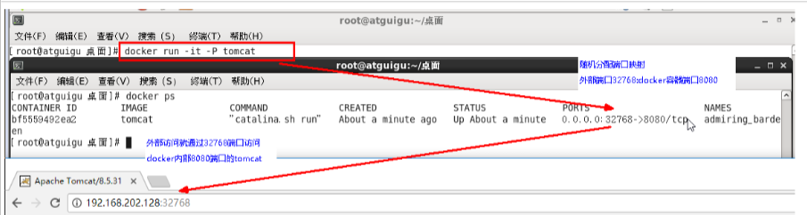

2. 删除上一步镜像生产tomcat容器中的文档(doc)

   - `docker ps`

     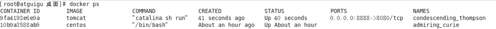

   - `docker exec -it xxxxx /bin/bash`

     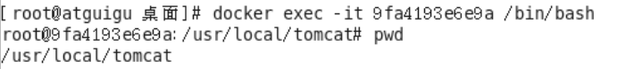

   - `ls -l`

     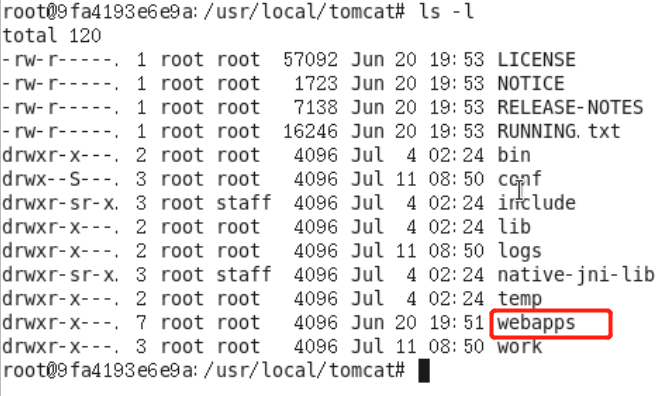

   - `rm -rf docs`

     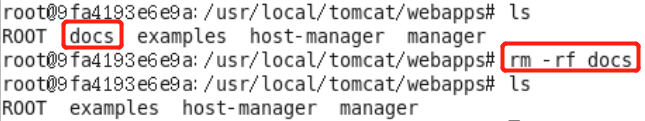

3. 也即当前的tomcat运行实例是一个没有文档内容的容器，以它为模板commit一个没有doc的tomcat新镜像sxh/tomcat02，指定版本1.2

   `docker commit -a="sxh" -m="tomcat without docs" xxxx sxh/tomcat:1.2`

   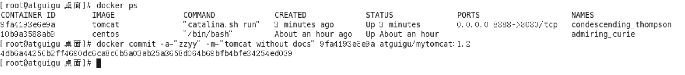

   > commit成功后，会返回新镜像的ID

4. 启动我们的新增镜像并和原来的对比

   - 启动`sxh/tomcat02:1.2`，他没有docs文档

     > `docker run -it -p 7777:8080 sxh/tomcat02:1.2 `

     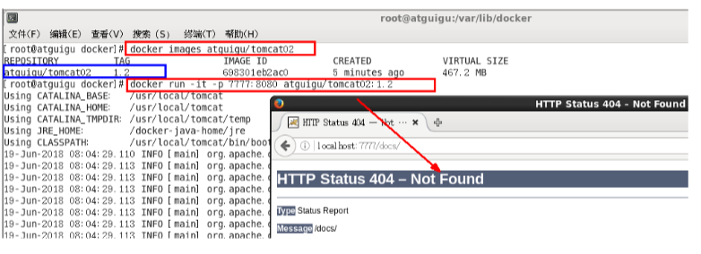

   - 启动原来pull下来的tomcat，有docs文档

     > `docker run -it -p 7788:8080 tomcat `

     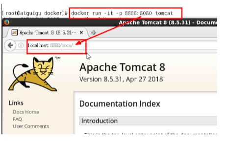

