[TOC]


# 1、概念

## 是什么？

> 一句话：有点类似Redis里面的rdb和aof文件

Docker的理念：

- 将运用与运行的环境打包形成容器运行，运行可以伴随着容器，但是我们对数据的要求希望是持久化的
- 容器之间希望有可能共享数据

Docker容器产生的数据，如果不通过docker commit生成新的镜像，使得数据做为镜像的一部分保存下来，那么当容器删除后，数据自然也就没有了。==为了能保证数据在docker中我们使用卷==

## 能干嘛？

1. ==容器的持久化==
2. ==容器间继承+共享数据==
3. ==宿主机和容器之间的数据共享==

卷就是目录或文件，存在于一个或多个容器中，由docker挂在到容器，但不属于联合文件系统，因此能够绕过Union File System提供一些用于持久存储或共享数据的特性；

卷的设计目的就是数据的持久化，完全独立于容器的生命周期，因此Docker不会在容器删除时删除其挂载的数据卷

**特点：**

- 数据卷可在容器之间共享或重用数据
- 卷中的更改可以直接生效 
- 数据卷中的更改不会包含在镜像的更新中
- 数据卷的生命周期一直持续到没有容器使用它为止

> 数据卷也可以完成   **宿主机->容器**；**容器->宿主机**   之间的文件拷贝


# 2、数据卷

> 容器内添加

## 直接命令添加

### 命令(不带权限)

> `docker run -it -v /宿主机绝对路径：/容器目录 镜像名`

```shell
$ docker run -it --name centos03 -v /myDataValue:/dataValue centos
```

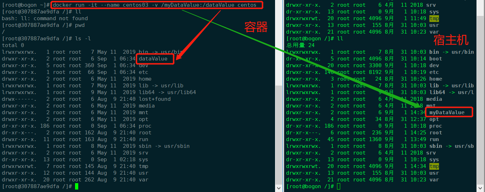

2. 查看数据卷是否挂在成功

   先通过`docker ps`找到当前容器ID

   通过`docker inspect 307887ae9dfa `查看细节，发现数据卷已绑定

   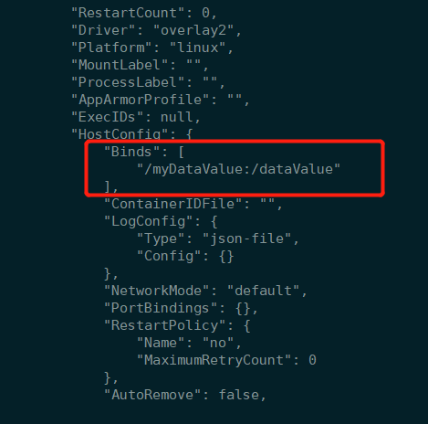

3. 容器和宿主机之间数据共享

   在宿主机中的数据卷中，==创建一个文件==

   再到容器中的数据卷中，会发现，容器已经同步下来这个文件

   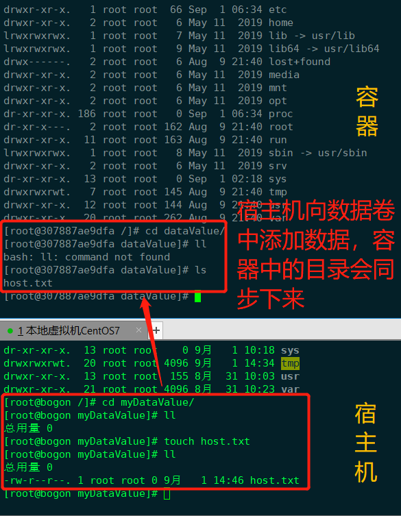

   在容器中==更新host.txt，再创建一个文件==

   回到宿主机，可以看到host.txt更新的内容，也可以看到新新创建的文件

   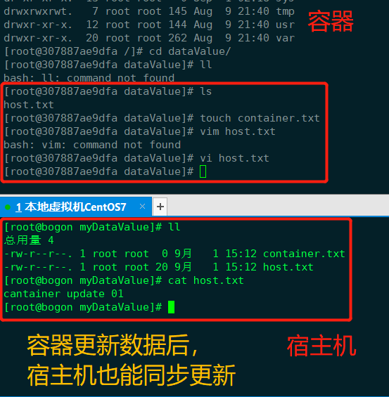

3. 容器停止退出后，主机修改后数据是否通同步

   容器停止`exit`后，更新数据卷目录：`/myDataValue`；然后重启容器，进入数据卷目录：`/dataValue`，会发现，依然可以同步更新

   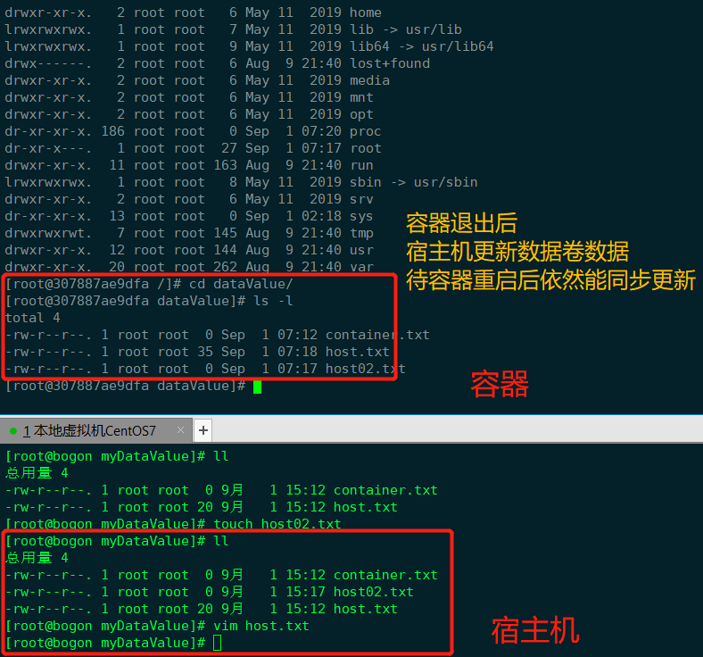

### **命令(带权限)**

> `docker run -it -v /宿主机绝对路径：/容器内目录：ro 镜像名`
>
> ro：read only——只读

```shell
$ docker run -it --name centos04 -v /myDataValue:/dataValue:ro centos
```

1. 在宿主机创建文件

   ```shell
   $ touch host.txt
   $ echo "host update 01" >> host.txt
   ```

2. 在容器中查看，并修改，发现无法修改

   ```shell
   $ cd /dataValue
   $ vi host.txt   
   ```

   进入vi后，编辑时，会提示：`readonly file`

   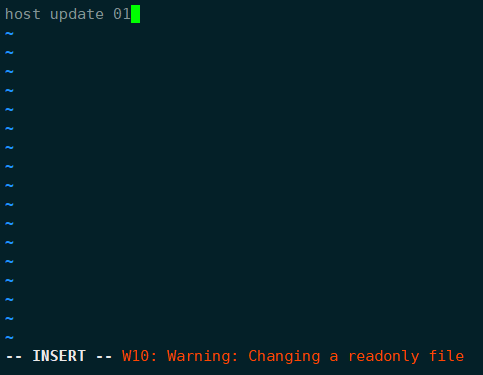

   通过`ls -s`查看文件详细信息，发现没有写权限

   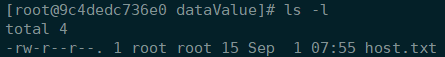

3. 在容器中进入数据卷目录，新建文件

   ```shell
   $ touch coantainer.txt
   touch: cannot touch 'coantainer.txt': Read-only file system
   ```

   会发现也是无法创建文件，提示：`Read-only file system`

4. 在宿主机查看容器细节：`docker inspect 9c4dedc736e0 `

   > "Mode"："ro"   ---   模式：只读

   ```json
   "Mounts": [
       {
           "Type": "bind",
           "Source": "/myDataValue",
           "Destination": "/dataValue",
           "Mode": "ro",
           "RW": false,
           "Propagation": "rprivate"
       }
   ]
   ```

   


## DockerFile添加

> 相当于Linux中的shell脚本，DockerFile是Docker的脚本

1. 根目录下新建mydocker文件夹进入

   ```shell
   $ cd /
   $ mkdir /mydocker
   $ cd /mydocker
   ```

2. 可在DockerFile中使用==VOLUME指令==来给镜像添加一个或多个数据卷

   ```shell
   VOLUME["/dataVolumeContainer","/dataVolumeContainer2","/dataVolumeContainer3"]
   ```

   **说明**：出于可移植和分享的考虑，==用`-v 主机目录：容器目录` 这种方法不能够直接在DockerFile中实现==。由于宿主机目录是依赖于特定宿主机的，并不能够保证在所有的宿主机上都存在这样的特定目录。

3. File构建

   ```shell
   $ vim Dockerfile
   
   # volume test
   FROM centos
   VOLUME ["/dataVolumeContainer","/dataVolumeContainer2"]
   CMD echo "finished,-----------------success1"
   CMD /bin/bash
   ```

4. Build后生成镜像

   > 获得一个新的镜像

   ```shell
   $ docker build -f /mydocker/Dockerfile -t sxh/centos .
   ```

   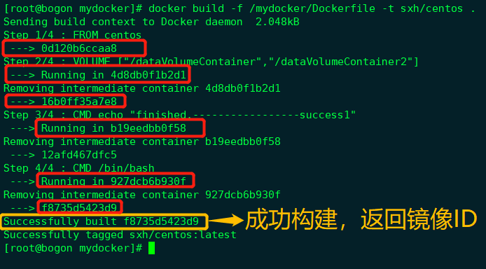

   > 通过`docker images`可以查看生成的镜像

   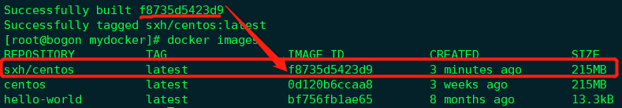

5. run容器

   ```shell
   $ docker run -it --name myselt_centos sxh/centos
   ```

   启动后，在容器的根目录下就已经存在了2个数据卷目录了

   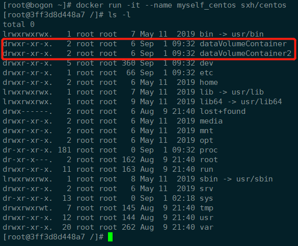

6. 通过上述步骤，容器内的卷目录地址已经知道。对应的主机目录地址在哪？

   >  通过查看容器的细节信息，可以发现docker默认生成了主机端的数据卷

   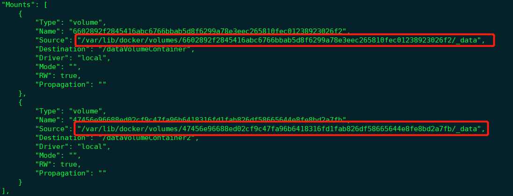

7. 主机对应默认地址

   `/var/lib/docker/volumes/`

8. 备注：

   > Docker挂载主机目录Docker访问出现：cannot open directory .: Permission denied
   >
   > 解决办法：在挂载目录后多加一个`--privileged=true`参数即可


# 3、数据卷容器

> **是什么？**

命名的容器挂载数据卷，其他容器通过挂载这个(父容器)实现数据共享，挂载数据卷的容器，称之为：==数据卷容器==

## 演示+介绍

> 上一步创建了一个数据卷镜像`sxh/centos`，已经具备了容器卷：
>
> - `/dataVolumeContainer1`
> - `/dataVolumeContainer2`
>
> 以它为模板并运行容器：`dc01`,`dc02`,`dc03`

**容器间传递共享：`--volumes-from`**


1. 先启动一个父容器`dc01`，在`/dataVolumeContainer2`中添加内容

   ```shell
   $ docker run -it --name dc01 sxh/centos
   ```

2. `dc02`,`dc03`继承自`dc01`

   ```shell
   $ docker run -it --name dc02 --volume-from dc01 sxh/centos
   
   $ docker run -it --name dc03 --volume-from dc01 sxh/centos
   ```

   分别在两个容器的数据卷`/dataVolumeContainer2`中添加内容

3. 回到`dc01`可以看到`dc02`,`dc03`各自添加的内容

4. 删除`dc01`容器，`dc02`容器中的数据卷修改后，`dc03`容器中的数据卷依然可以同步内容

5. 删除`dc02`容器，`dc03`容器的数据卷依然可以使用

6. 新建`dc04`容器，继承`dc03`，再删除`dc03`，`dc04`容器的数据卷依然可用

> 结论：容器之间配置信息的传递，数据卷的生命周期一直持续到没有容器使用它为止

