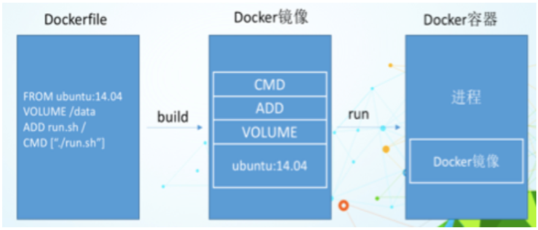
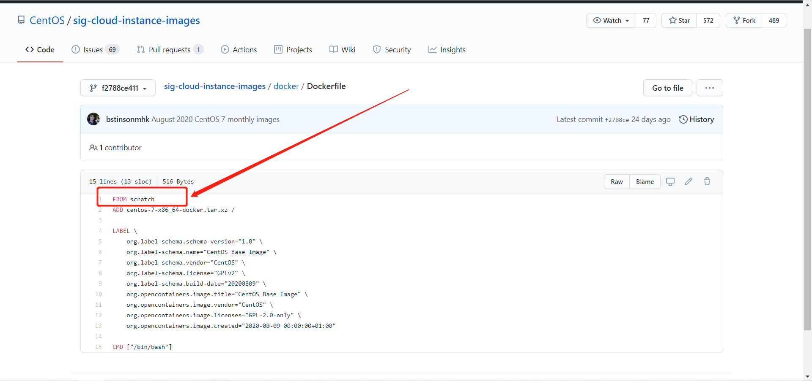
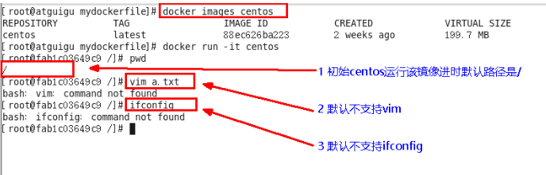
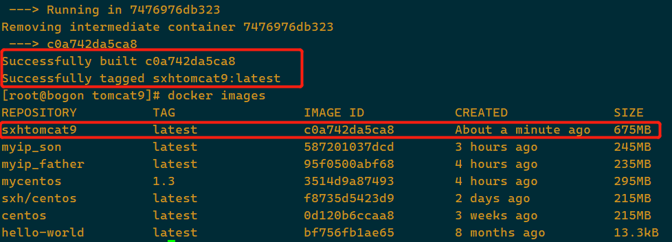
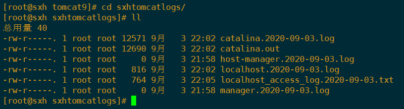
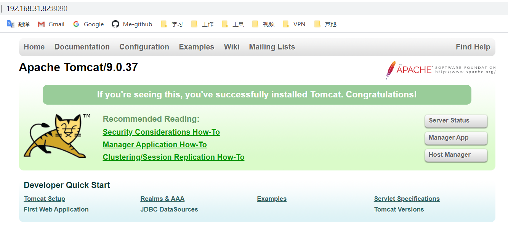
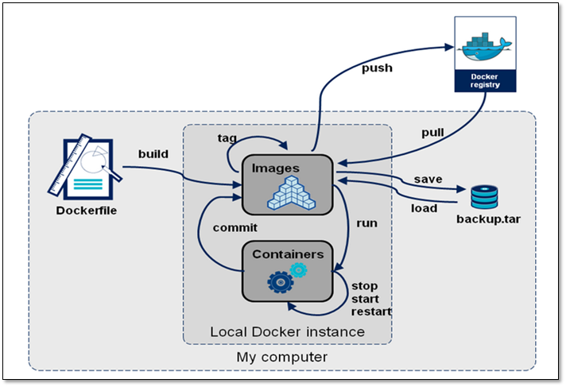

[TOC]

# 1、DockerFile是什么?

1. Dockerfile 是用来构建Docker镜像的构建文件，是由一系列命令和参数构建成的脚本

2. 构建三步骤：

   - 编写Dockerfile文件
   - docker build
   - docker run

3. 文件什么样？

   > 以centos为例

   ```dockerfile
   FROM scratch   # 相当于Java中的Object
   ADD centos-7-x86_64-docker.tar.xz / 
   
   LABEL \ # 标签，说明的意思
       org.label-schema.schema-version="1.0" \
       org.label-schema.name="CentOS Base Image" \
       org.label-schema.vendor="CentOS" \
       org.label-schema.license="GPLv2" \
       org.label-schema.build-date="20200809" \
       org.opencontainers.image.title="CentOS Base Image" \
       org.opencontainers.image.vendor="CentOS" \
       org.opencontainers.image.licenses="GPL-2.0-only" \
       org.opencontainers.image.created="2020-08-09 00:00:00+01:00"
   
   CMD ["/bin/bash"]
   ```

   

# 2、DockerFile构建过程解析

## Dockerfile 内容基础知识

1. 每条 保留字指令 都必须为大写字母，且后面跟随至少一个参数
2. 指令按照从上到下，顺序执行
3. `#`表示注释
4. 每条指令都会创建一个新的镜像层，并对镜像进行提交

## Docker执行Dockerfile的大致流程

1. docker从基础镜像运行一个容器
2. 执行一条指令并对容器作出修改
3. 执行类似`docker commit`的操作提交一个新的镜像层
4. docker再基于刚提交的镜像运行一个新容器
5. 执行dockerfile中的下一条指令直到所有的指令都执行完成

## 总结

从应用软件的角度来看，Dockerfile、Docker镜像与Docker容器分别代表软件的三个不同阶段

- Dockerfile是软件的原材料
- Docker镜像是软件的交付品
- Docker容器则可以认为是软件的运行态

Dockerfile面向开发，Docker镜像成为交付标准，Docker容器则涉及部署与运维，三者缺一不可，合力充当Docker体系的基石




1. Dockerfile

   需要定义一个Dockerfile，Dockerfile定义了进程需要的一切东西。Dockerfile涉及的内容包括执行代码或者是文件、环境变量、依赖包、运行时环境、动态链接库、操作系统的发行版、服务进程和内核进程（当应用进程需要和系统服务，和内核进程打交道，这时需要考虑如何设计namespace的权限控制）等等；

2. Docker镜像

   在用Dockerfile定义一个文件之后，docker build 会产生一个Dockers镜像，当运行Docker镜像时，会真正开始提供服务
   
3. Docker容器

   容器是直接提供服务的


# 3、DockerFile体系结构

> 保留字指令

1. FROM

   基础镜像，当前新镜像是基于哪个镜像的

2. MAINTAINER

   镜像维护者的姓名和邮箱地址

3. RUN

   容器构建的时候需要运行的命令

4. EXPOSE

   当前容器对外暴露出的端口

5. WORKDIR

   指定在创建容器后，终端默认登陆进来的工作目录，一个落脚点

6. ENV

   用来在构建镜像过程中设置环境变量

   ```dockerfile
   ENV MY_PATH /usr/mytest
   ```

   这个环境变量可以在后续的任何RUN指令中使用，这就如同在命令前面指定了环境变量前缀一样；也可以在其他指令中直接使用这些环境变量

   ```dockerfile
   WORKDIR $MY_PATH
   ```

7. ADD

   将宿主机目录下的文件拷贝进镜像且ADD命令会自动处理URL和解压tar压缩包

8. COPY

   类似于`ADD`，拷贝文件和目录到镜像中。将从构建上下文目录中<源路径>的文件/目录复制到新的一层的镜像内的<目标路径>位置

   > `COPY src dest`
   >
   > `COPY ["src","dest"]`

9. VLUME

   容器数据卷，用于数据保存和持久化工作

10. CMD

    > 指定一个容器启动时要运行的指令
    >
    > Dockerfile中可以有多个CMD指令，但==只有最后一个生效==，CMD会被 docke run 之后的参数替换

    `CMD`指令的格式和`RUN`相似，有两种格式：

    - `shell`格式：`CMD <指令>`
    - `exec`格式：`CMD ["可执行文件","参数1","参数2"...]`
    - 参数列表格式：`CMD ["参数1"，"参数2",...]`，在指定了`ENTRYPOINT`指令后，用`CMD`指定具体的参数

11. ENTRYPOINT

    > 指定一个容器启动时要运行的指令

    `ENTRYPONIT`的目的和`CMD`一样，都是在指定容器启动程序及参数

12. ONBUILD

    当构建一个被继承的Dockerfile时运行命令，父镜像在被子镜像继承后，父镜像的`onbuild`被触发

    

**总结**

| BUILD         | Both    | RUN        |
| ------------- | ------- | ---------- |
| FORM          | WORKDIR | CMD        |
| MAINTAINER    | USER    | ENV        |
| COYP          |         | EXPOSE     |
| ADD           |         | VOLUMN     |
| RUN           |         | ENTRYPOINT |
| ONBUILD       |         |            |
| .dockerignore |         |            |


# 4、案例

## 4.1、Base镜像 - scratch

> Docker Hub 中99%的镜像都是通过在 base镜像中安装和配置需要的软件构建出来的



## 4.2、自定义镜像 - mycentos

### 编写

1. Hub默认CentOS镜像登录后的情况

   

   自定义mycentos目的是我们自己的镜像具备如下：

   - 登陆后的默认路径
   - vim编辑器
   - 支持ifconfig查看网路配置

2. 准备编写DockerFile文件

   ```dockerfile
   FROM centos
   MAINTAINER sxh<531845606@qq.com> #作者和邮箱
   
   ENV MYPATH /usr/local  # 登陆后的默认路径
   WORKDIR $MYPATH
   
   RUN yum -y install vim # vim编辑器
   RUN yum -y install net-tools # 支持ifconfig查看网路配置
   EXPOSE 80
   
   CMD echo $MYPATH
   CMD echo "success-------ok"
   CMD /bin/bash
   ```

### 构建

> `$ docker build -f /mydocker/Dockerfile2 -t 新镜像名字:TAG .`

```shell
[root@localhost mydocker]# docker build -f ./Dockerfile2 -t mycentos:1.3 .
Sending build context to Docker daemon  3.072kB
Step 1/10 : FROM centos
 ---> 0d120b6ccaa8
Step 2/10 : MAINTAINER sxh<531845606@qq.com>
 ---> Running in 0fd32f7a31c4
Removing intermediate container 0fd32f7a31c4
 ---> b311790e7a85
Step 3/10 : ENV MYPATH /usr/local
 ---> Running in 733bfa5f3296
Removing intermediate container 733bfa5f3296
 ---> 3c016b010ebc
Step 4/10 : WORKDIR $MYPATH
 ---> Running in 1ff1692956dc
Removing intermediate container 1ff1692956dc
 ---> 88161cb60504
Step 5/10 : RUN yum -y install vim
 ---> Running in 97684139364c
CentOS-8 - AppStream                             24 kB/s | 5.8 MB     04:08    
CentOS-8 - Base                                  52 kB/s | 2.2 MB     00:43    
CentOS-8 - Extras                               898  B/s | 7.3 kB     00:08    
Dependencies resolved.
================================================================================
 Package             Arch        Version                   Repository      Size
================================================================================
Installing:
 vim-enhanced        x86_64      2:8.0.1763-13.el8         AppStream      1.4 M
Installing dependencies:
 gpm-libs            x86_64      1.20.7-15.el8             AppStream       39 k
 vim-common          x86_64      2:8.0.1763-13.el8         AppStream      6.3 M
 vim-filesystem      noarch      2:8.0.1763-13.el8         AppStream       48 k
 which               x86_64      2.21-12.el8               BaseOS          49 k

Transaction Summary
================================================================================
Install  5 Packages

Total download size: 7.8 M
Installed size: 31 M
Downloading Packages:
(1/5): gpm-libs-1.20.7-15.el8.x86_64.rpm         54 kB/s |  39 kB     00:00    
(2/5): vim-filesystem-8.0.1763-13.el8.noarch.rp  59 kB/s |  48 kB     00:00    
(3/5): which-2.21-12.el8.x86_64.rpm             5.8 kB/s |  49 kB     00:08    
(4/5): vim-enhanced-8.0.1763-13.el8.x86_64.rpm   42 kB/s | 1.4 MB     00:32    
(5/5): vim-common-8.0.1763-13.el8.x86_64.rpm     81 kB/s | 6.3 MB     01:19    
--------------------------------------------------------------------------------
Total                                            98 kB/s | 7.8 MB     01:21     
warning: /var/cache/dnf/AppStream-02e86d1c976ab532/packages/gpm-libs-1.20.7-15.el8.x86_64.rpm: Header V3 RSA/SHA256 Signature, key ID 8483c65d: NOKEY
CentOS-8 - AppStream                            1.6 MB/s | 1.6 kB     00:00    
Importing GPG key 0x8483C65D:
 Userid     : "CentOS (CentOS Official Signing Key) <security@centos.org>"
 Fingerprint: 99DB 70FA E1D7 CE22 7FB6 4882 05B5 55B3 8483 C65D
 From       : /etc/pki/rpm-gpg/RPM-GPG-KEY-centosofficial
Key imported successfully
Running transaction check
Transaction check succeeded.
Running transaction test
Transaction test succeeded.
Running transaction
  Preparing        :                                                        1/1 
  Installing       : which-2.21-12.el8.x86_64                               1/5 
  Installing       : vim-filesystem-2:8.0.1763-13.el8.noarch                2/5 
  Installing       : vim-common-2:8.0.1763-13.el8.x86_64                    3/5 
  Installing       : gpm-libs-1.20.7-15.el8.x86_64                          4/5 
  Running scriptlet: gpm-libs-1.20.7-15.el8.x86_64                          4/5 
  Installing       : vim-enhanced-2:8.0.1763-13.el8.x86_64                  5/5 
  Running scriptlet: vim-enhanced-2:8.0.1763-13.el8.x86_64                  5/5 
  Running scriptlet: vim-common-2:8.0.1763-13.el8.x86_64                    5/5 
  Verifying        : gpm-libs-1.20.7-15.el8.x86_64                          1/5 
  Verifying        : vim-common-2:8.0.1763-13.el8.x86_64                    2/5 
  Verifying        : vim-enhanced-2:8.0.1763-13.el8.x86_64                  3/5 
  Verifying        : vim-filesystem-2:8.0.1763-13.el8.noarch                4/5 
  Verifying        : which-2.21-12.el8.x86_64                               5/5 

Installed:
  gpm-libs-1.20.7-15.el8.x86_64         vim-common-2:8.0.1763-13.el8.x86_64    
  vim-enhanced-2:8.0.1763-13.el8.x86_64 vim-filesystem-2:8.0.1763-13.el8.noarch
  which-2.21-12.el8.x86_64             

Complete!
Removing intermediate container 97684139364c
 ---> 44c28a25439d
Step 6/10 : RUN yum -y install net-tools
 ---> Running in f5d9d8013e9c
Last metadata expiration check: 0:01:29 ago on Thu Sep  3 08:15:11 2020.
Dependencies resolved.
================================================================================
 Package         Architecture Version                        Repository    Size
================================================================================
Installing:
 net-tools       x86_64       2.0-0.51.20160912git.el8       BaseOS       323 k

Transaction Summary
================================================================================
Install  1 Package

Total download size: 323 k
Installed size: 1.0 M
Downloading Packages:
net-tools-2.0-0.51.20160912git.el8.x86_64.rpm   149 kB/s | 323 kB     00:02    
--------------------------------------------------------------------------------
Total                                           107 kB/s | 323 kB     00:03     
Running transaction check
Transaction check succeeded.
Running transaction test
Transaction test succeeded.
Running transaction
  Preparing        :                                                        1/1 
  Installing       : net-tools-2.0-0.51.20160912git.el8.x86_64              1/1 
  Running scriptlet: net-tools-2.0-0.51.20160912git.el8.x86_64              1/1 
  Verifying        : net-tools-2.0-0.51.20160912git.el8.x86_64              1/1 

Installed:
  net-tools-2.0-0.51.20160912git.el8.x86_64                                     

Complete!
Removing intermediate container f5d9d8013e9c
 ---> 9b10c1b8667e
Step 7/10 : EXPOSE 80
 ---> Running in bec70264a12b
Removing intermediate container bec70264a12b
 ---> e367619dad3e
Step 8/10 : CMD echo $MYPATH
 ---> Running in 74ebce4ef90c
Removing intermediate container 74ebce4ef90c
 ---> d460d3cdf975
Step 9/10 : CMD echo "success-------ok"
 ---> Running in cdda4b72f619
Removing intermediate container cdda4b72f619
 ---> a1c0a32fbb20
Step 10/10 : CMD /bin/bash
 ---> Running in 27e58865de53
Removing intermediate container 27e58865de53
 ---> 3514d9a87493
Successfully built 3514d9a87493
Successfully tagged mycentos:1.3
[root@localhost mydocker]# 

```

> 通过`docker images`查看新构建的镜像

```shell
[root@localhost ~]# docker images
REPOSITORY          TAG                 IMAGE ID            CREATED             SIZE
mycentos            1.3                 b2075ccbe763        23 minutes ago      295MB
```


### 运行

> 自定义的镜像生成的容器时可以用vim和ifconfig的

```shell
[root@localhost mydocker]# docker images
REPOSITORY          TAG                 IMAGE ID            CREATED             SIZE
mycentos            1.3                 3514d9a87493        15 minutes ago      295MB
sxh/centos          latest              f8735d5423d9        47 hours ago        215MB
centos              latest              0d120b6ccaa8        3 weeks ago         215MB
hello-world         latest              bf756fb1ae65        8 months ago        13.3kB
[root@localhost mydocker]# docker run -it mycentos:1.3 
[root@3dc13d133545 local]# pwd
/usr/local
[root@3dc13d133545 local]# ifconfig
eth0: flags=4163<UP,BROADCAST,RUNNING,MULTICAST>  mtu 1500
        inet 172.17.0.2  netmask 255.255.0.0  broadcast 172.17.255.255
        ether 02:42:ac:11:00:02  txqueuelen 0  (Ethernet)
        RX packets 8  bytes 656 (656.0 B)
        RX errors 0  dropped 0  overruns 0  frame 0
        TX packets 0  bytes 0 (0.0 B)
        TX errors 0  dropped 0 overruns 0  carrier 0  collisions 0

lo: flags=73<UP,LOOPBACK,RUNNING>  mtu 65536
        inet 127.0.0.1  netmask 255.0.0.0
        loop  txqueuelen 1000  (Local Loopback)
        RX packets 0  bytes 0 (0.0 B)
        RX errors 0  dropped 0  overruns 0  frame 0
        TX packets 0  bytes 0 (0.0 B)
        TX errors 0  dropped 0 overruns 0  carrier 0  collisions 0

[root@3dc13d133545 local]# 
```


### 列出镜像的变更历史

> `docker history 镜像名/镜像ID`
>
> 示例：`docker history mycentos:1.3 `

```shell
[root@localhost mydocker]# docker history mycentos:1.3
IMAGE               CREATED             CREATED BY                                      SIZE                COMMENT
3514d9a87493        24 minutes ago      /bin/sh -c #(nop)  CMD ["/bin/sh" "-c" "/bin…   0B                  
a1c0a32fbb20        24 minutes ago      /bin/sh -c #(nop)  CMD ["/bin/sh" "-c" "echo…   0B                  
d460d3cdf975        24 minutes ago      /bin/sh -c #(nop)  CMD ["/bin/sh" "-c" "echo…   0B                  
e367619dad3e        24 minutes ago      /bin/sh -c #(nop)  EXPOSE 80                    0B                  
9b10c1b8667e        24 minutes ago      /bin/sh -c yum -y install net-tools             22.8MB              
44c28a25439d        24 minutes ago      /bin/sh -c yum -y install vim                   57.2MB              
88161cb60504        30 minutes ago      /bin/sh -c #(nop) WORKDIR /usr/local            0B                  
3c016b010ebc        30 minutes ago      /bin/sh -c #(nop)  ENV MYPATH=/usr/local        0B                  
b311790e7a85        30 minutes ago      /bin/sh -c #(nop)  MAINTAINER sxh<531845606@…   0B                  
0d120b6ccaa8        3 weeks ago         /bin/sh -c #(nop)  CMD ["/bin/bash"]            0B                  
<missing>           3 weeks ago         /bin/sh -c #(nop)  LABEL org.label-schema.sc…   0B                  
<missing>           3 weeks ago         /bin/sh -c #(nop) ADD file:538afc0c5c964ce0d…   215MB               
[root@localhost mydocker]# 
```


## 4.3、ONBUILD指令

> 当构建一个被继承的Dockerfile时运行命令，父镜像在被子镜像继承后，父镜像的`onbuild`被触发

1. 自定义一个Dockerfile(名字：Dockerfile4)，编写DockerFile

   ```dockerfile
   FROM centos
   RUN yum install -y curl
   ENTRYPOINT ["curl","-s","http://ip.cn"]
   ONBUILD RUN echo "father image onbuild ---------- 886"
   ```

   当该DockerFile构建成镜像后，会打印`father image onbuild ---------- 886`

   ```shell
   [root@localhost mydocker]# docker build -f ./Dockerfile4 -t myip_father .
   Sending build context to Docker daemon  4.096kB
   Step 1/4 : FROM centos
    ---> 0d120b6ccaa8
   Step 2/4 : RUN yum install -y curl
    ---> Running in a164d5d0c457
   CentOS-8 - AppStream                             38 kB/s | 5.8 MB     02:37    
   CentOS-8 - Base                                 101 kB/s | 2.2 MB     00:22    
   CentOS-8 - Extras                               6.8 kB/s | 7.3 kB     00:01    
   Package curl-7.61.1-12.el8.x86_64 is already installed.
   Dependencies resolved.
   Nothing to do.
   Complete!
   Removing intermediate container a164d5d0c457
    ---> 009ca3aa8436
   Step 3/4 : ENTRYPOINT ["curl","-s","http://ip.cn"]
    ---> Running in 99cf55fd29e0
   Removing intermediate container 99cf55fd29e0
    ---> 9c74d924725c
   Step 4/4 : ONBUILD RUN echo "father image onbuild ---------- 886"
    ---> Running in 18d86df9387e
   Removing intermediate container 18d86df9387e
    ---> 95f0500abf68
   Successfully built 95f0500abf68
   Successfully tagged myip_father:latest
   ```

2. 再新建一个Dockerfile(名字：Dockerfile5)，继承上一个自定义的镜像

   ```dockerfile
   FROM myip_father
   RUN yum install -y curl
   ENTRYPOINT ["curl","-s","http://ip.cn"]
   ```

   当构建该镜像时，==会触发父类的触发器==（==第6行==）

   ```shell
   [root@localhost mydocker]# docker build -f ./Dockerfile5 -t myip_son .
   Sending build context to Docker daemon   5.12kB
   Step 1/3 : FROM myip_father
   # Executing 1 build trigger
    ---> Running in 31753d859012
   father image onbuild ---------- 886
   Removing intermediate container 31753d859012
    ---> 12d8678b6ae1
   Step 2/3 : RUN yum install -y curl
    ---> Running in 687b977586ca
   Last metadata expiration check: 0:25:45 ago on Thu Sep  3 08:54:32 2020.
   Package curl-7.61.1-12.el8.x86_64 is already installed.
   Dependencies resolved.
   Nothing to do.
   Complete!
   Removing intermediate container 687b977586ca
    ---> 0a237da8aa96
   Step 3/3 : ENTRYPOINT ["curl","-s","http://ip.cn"]
    ---> Running in 89e6ac3c96fb
   Removing intermediate container 89e6ac3c96fb
    ---> 587201037dcd
   Successfully built 587201037dcd
   Successfully tagged myip_son:latest
   [root@localhost mydocker]# 
   ```

   

## ~~4.4、CMD/ENTRYPOINT 镜像案例~~

## 4.5、自定义镜像 Tomcat 9

1. `mkdir -p /sxh/mydockerfile/tomcat9`

2. 在目录下创建文件

   ```shell
   $ touch c.txt
   ```

3. 将jdk和tomcat安装的压缩包拷贝到目录中

   - apache-tomcat-9.0.8.tar.gz

   - jdk-8u171-linux-x64.tar.gz

4. 在`/sxh/mydockerfile/tomcat9`目录下新建Dockerfile文件

   ```dockerfile
   FROM centos
   MAINTAINER sxh<531845606@qq.com>
   # 把宿主机当前上下文的c.txt拷贝到容器/usr/local路径下
   COPY c.txt /usr/local/cincontainer.txt
   # 把tomcat添加到容器中
   ADD apache-tomcat-9.0.37.tar.gz /usr/local/
   ADD jdk-8u171-linux-x64.tar.gz /usr/local/
   # 安装vim编辑器
   RUN yum -y install vim
   # 设置工作访问时候的WORKDIR路径，登录落脚点
   ENV MYPATH /usr/local
   WORKDIR $MYPATH
   # 配置Java与tomcat环境变量
   ENV JAVA_HOME /usr/local/jdk1.8.0.171
   ENV CLASSPATH $JAVA_HOME/lib/dt.jar:$JAVA_HOME/lib/tools.jar
   ENV CATALINA_HOME /usr/local/apache-tomcat-9.0.37
   ENV CATALINA_BASE /usr/local/apache-tomcat-9.0.37
   ENV PATH $PATH:$JAVA_HOME/bin:$CATALINA_HOME/lib:$CATALINA_HOME/bin
   # 容器运行时监听的端口
   EXPOSE 8080
   # 启动时运行tomcat
   CMD /usr/local/apache-tomcat-9.0.37/bin/startup.sh && tail -F /usr/local/apache-tomcat-9.0.37/bin/logs/catalina.out
   ```

5. 构建

   > 在当前目录下，执行镜像的构建
   >
   > `docker build -t sxhtomcat9`--->以前有`-f /Dockerfile`，不写的话，会自动在当前目录下查找`Dockerfile`

   ```shell
   $ docker build -t sxhtomcat9 .
   ```

   

6. run

   > 通过构建出来的镜像，运行一个tomcat容器

   ```shell
   $ docker run -d -p 8080:8080 --name mytom9 \
        -v /sxh/mydockerfile/tomcat9/test:/usr/local/apache-tomcat-9.0.37/webapps/test \
        -v /sxh/mydockerfile/tomcat9/tomcat9logs/:/usr/loacl/apache-tomcat-9.0.37/logs \
        --privileged=true sxhtomcat9
   ```

7. 验证

   1. 在宿主机的数据卷的logs文件中查看日志，查看是否启动成功

      

   2. 通过网页访问`ip:port`看是否能访问成功

      

8. 结合容器卷测试web服务发布

# 5、总结

