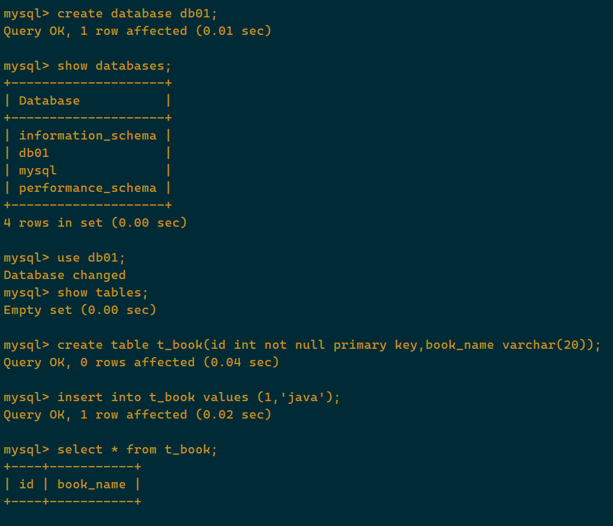
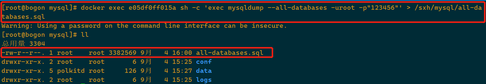
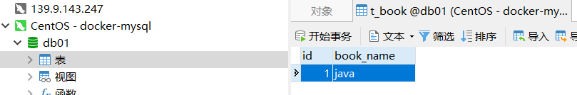
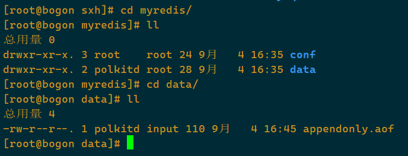

[TOC]

> 总体步骤

1. 搜索镜像
2. 拉取镜像
3. 查看镜像
4. 启动镜像
5. 停止容器
6. 移除容器


# 1. 安装Tomcat

1. docker hub 上查找tomcat镜像

   ```shell
   $ docker search tomcat
   ```

2. 从docker hub 上拉取tomcat镜像到本地

   ```shell
   $ docker pull tomcat
   ```

3. docker images 查看是否有拉取到的tomcat

   ```shell
   $ docker images
   ```

4. 使用tomcat镜像创建容器（也叫运行镜像）

   ```shell
   $ docker run -it -p 8080:8080 tomcat
   ```

   

# 2. 安装MySQL

1. docker hub 上面查找镜像

   

2. 从docker hub 上拉取MySQL镜像到本地，标签：5.6

3. 使用mysql5.6镜像创建容器（也叫运行镜像）

   ```shell
   $ docker run -p 12345:3306 --name mysql \
   	-v /sxh/mysql/conf:/etc/mysql/conf.d \
   	-v /sxh/mysql/logs:/logs \
   	-v /sxh/mysql/data:/var/lib/mysql \
       -e MYSQL_ROOT_PASSWORD=123456 \
   	-d mysql:5.6
   ```

   > 命令说明：
   >
   > - `-e MYSQL_ROOT_PASSWORD=123456` ：初始化root用户的密码

   进入docker的mysql中，创建库表，插入数据

   ```shell
   $ docker exec -it xxxxx /bin/bash
   $ mysql -u root -p
   > 123456
   > create database db01;
   > use db01;
   > create table t_book (id int not null primary key,book_name varchar(20));
   > insert into t_book values(1,'java');
   ```

   

   

   

   通过Windows10，使用navicat连接docker中的mysql

   

   

4. 通过Docker进行mysql数据备份

   ```shell
   $ docker exec 容器ID sh -c 'exec mysqldump --all-databases -uroot -p"123456"' \
   	> /sxh/all-databases.sql
   ```

   

# 3. 安装redis

1. 从docker hub上拉去redis镜像到本地，标签为：3.2

   ```shell
   $ docker pull redis:3.2
   ```

2. 使用redis3.2 镜像创建容器（也叫运行镜像）

   1. 使用镜像

      ```shell
      $ docker run -p 6379:6379 \
      	-v /sxh/myredis/data:/data/ \
      	-v /sxh/myredis/conf/redis.conf:/usr/local/etc/redis/redis.conf \
      	-d redis:3.2 redis-server /usr/local/etc/redis/redis.conf \
      	--appendonly yes
      ```

   2. 在主机`/sxh/myredis/conf/redis.conf`目录下新建`redis.conf`文件

      ```shell
      $ vim /sxh/myredis/conf/redis.conf/redis.conf
      ```

   3. 测试redis-cli连接

      ```shell
      $ docker exec -it 5bea98c63b48 redis-cli
      127.0.0.1:6379> set k1 v1
      OK
      127.0.0.1:6379> set k2 v2
      OK
      127.0.0.1:6379> set k3 v3
      OK
      127.0.0.1:6379> 
      ```

      

   4. 测试持久化文件生成

      > 进入`/sxh/myredis/data`下，会发现`appendonly.aof`持久化文件

      


# 4. 安装Zookeeper

1. 查看镜像

   ```
   docker search zookeeper
   ```

   

2. 拉取镜像

   ```
   docker pull zookeeper
   ```

   

3. 启动容器

   ```
   docker run -it -p 2181:2181
   ```

   


# 5. 安装kafka

启动命令

```sh
docker run  
-d --name kafka -p 9092:9092 
-e KAFKA_BROKER_ID=0 
-e KAFKA_ZOOKEEPER_CONNECT=10.9.44.11:2181 
-e KAFKA_ADVERTISED_LISTENERS=PLAINTEXT://10.9.44.11:9092 
-e KAFKA_LISTENERS=PLAINTEXT://0.0.0.0:9092 
-t wurstmeister/kafka
```

KAFKA_ZOOKEEPER_CONNECT： 配置zookeeper管理kafka的路径

KAFKA_ADVERTISED_LISTENERS：把kafka的地址端口注册给zookeeper

KAFKA_LISTENERS=PLAINTEXT： 配置kafka的监听端口 0.0.0.0 表示本机

## 安装管理页面

```shell
#1. 拉取
docker pull sheepkiller/kafka-manager
#2. 启动
docker run -d --name kfk-manager \
--restart always -p 9000:9000 \
-e ZK_HOSTS=<这里换成你的zookeeper地址和端口> \
sheepkiller/kafka-manager
#3. 配置
进入web页面点击cluster配置节点名称即可看到
```


# 6. 安装RabbitMQ

1. `docker search rabbitmq`

   ```sh
   [root@localhost ~]# docker search rabbitmq
   NAME                                        DESCRIPTION                                     STARS               OFFICIAL            AUTOMATED
   rabbitmq                                    RabbitMQ is an open source multi-protocol me…   4023                [OK]                
   tutum/rabbitmq                              Base docker image to run a RabbitMQ server      22                                      
   kbudde/rabbitmq-exporter                    rabbitmq_exporter for prometheus                17                                      [OK]
   frodenas/rabbitmq                           A Docker Image for RabbitMQ                     12                                      [OK]
   cyrilix/rabbitmq-mqtt                       RabbitMQ MQTT Adapter                           9                                       [OK]
   arm64v8/rabbitmq                            RabbitMQ is an open source multi-protocol me…   8                                       
   arm32v7/rabbitmq                            RabbitMQ is an open source multi-protocol me…   7                                       
   gonkulatorlabs/rabbitmq                     DEPRECATED: See maryville/rabbitmq              5                                       [OK]
   heidiks/rabbitmq-delayed-message-exchange   RabbitMQ with the compatible version of the …   4                                       [OK]
   pivotalrabbitmq/rabbitmq-server-buildenv    Image used to build and test RabbitMQ server…   4                                       
   pivotalrabbitmq/rabbitmq-autocluster        RabbitMQ with the rabbitmq-autocluster plugi…   3                                       
   deadtrickster/rabbitmq_prometheus           RabbitMQ + Prometheus RabbitMQ Exporter plug…   2                                       
   riftbit/rabbitmq                            RabbitMQ 3.x Container based on Alpine Linux…   2                                       
   henrylv206/rabbitmq-autocluster             RabbitMQ Cluster                                2                                       [OK]
   foxylion/rabbitmq                           Preconfigured RabbitMQ docker image with sup…   1                                       [OK]
   rabbitmqoperator/cluster-operator           The RabbitMQ Cluster Operator Docker Image      1                                       
   i386/rabbitmq                               RabbitMQ is an open source multi-protocol me…   1                                       
   activatedgeek/rabbitmqadmin                 A rabbitmqadmin docker image for administrat…   1                                       [OK]
   amd64/rabbitmq                              RabbitMQ is an open source multi-protocol me…   1                                       
   ekesken/rabbitmq                            docker image for rabbitmq that is configurab…   1                                       [OK]
   webhostingcoopteam/rabbitmq-conf            RabbitMQ Configurator for Rancher               1                                       [OK]
   s390x/rabbitmq                              RabbitMQ is an open source multi-protocol me…   0                                       
   ppc64le/rabbitmq                            RabbitMQ is an open source multi-protocol me…   0                                       
   pdffiller/rabbitmq                          Rabbitmq 3.7.3 with delayed_message plugin,c…   0                                       
   dubc/rabbitmq-alpine-all-plugins            Additions are that the following plugins are…   0                                       [OK]
   
   ```

   

2. `docker pull rabbitmq:management`

3. 创建容器并启动

   ```shell
   docker run -d \
   --name rabbitmq \
   -e RABBITMQ_DEFAULT_USER=admin \
   -e RABBITMQ_DEFAULT_PASS=admin \
   -p 15672:15672 -p 5672:5672
   ```

   RABBITMQ_DEFAULT_USER/PASS：RabbitMQ登录账号/密码

   15672：web管理端端口

   5672：服务端口

4. 进入rabbitmq开始管理页面权限(==如果pull的不是management才需要这一步==)

   `docker exec -it xxxx`

   `rabbitmq-plugins enable rabbitmq_management`

   ```sh
   root@068122284c43:/# rabbitmq-plugins enable rabbitmq_management
   Enabling plugins on node rabbit@068122284c43:
   rabbitmq_management
   The following plugins have been configured:
     rabbitmq_management
     rabbitmq_management_agent
     rabbitmq_prometheus
     rabbitmq_web_dispatch
   Applying plugin configuration to rabbit@068122284c43...
   The following plugins have been enabled:
     rabbitmq_management
   
   started 1 plugins.
   
   ```

   

# 7. 安装Elasticsearch

1. `docker search elasticsearch`

2. `docker pull elasticsearch:xxx`

   如果下载指定版本的在`:`后写对应版本即可；如果不写版本`docker pull elasticsearch`默认下载最新的

3. 配置环境

   ```shell
   mkdir -p /myfile/elasticsearch/config
   mkdir -p /myfile/elasticsearch/data
   chmod -R 777 /myfile/elasticsearch/
   echo "http.host: 0.0.0.0" >> /myfile/elasticsearch/config/elasticsearch.yml
   
   ```

4. 启动

   ```shell
   docker run \
   --name elasticsearch \
   -p 9200:9200 -p 9300:9300 \
   -e "discovey.type=single-node" -e ES_JAVA_OPTS="-Xms512m -Xmx512m" \
   -v /myfile/elasticsearch/config/elasticsearch.yml:/usr/share/elasticsearch/confg/elasticsearch.yml \
   -v /myfile/elasticsearch/data:/usr/share/elasticsearch/data -v /myfile/elasticsearch/plugins:/usr/share/elascitsearch/plugins \
   -d elasticsearch:2.4.0
   ```

# 8.安装Kibana

> ElasticSearch 前端管理页面

1. 查找

   ```shell
   $ docker search kibana
   ```

2. 拉取

   ```shell
   $ docker pull kibana
   ```

   不写版本好默认拉取最新版本

3. 配置

   ```shell
   $ mkdir -p /myfile/kibana
   $ chmod 777 /myfile/kibana
   $ echo "server.host: 0.0.0.0" >> /myfile/kibana/kibana.yml
   $ echo "elasticsearch.hosts: http://esip:9200" >> /myfile/kibana/kibana.yml
   ```

   \* esip 换为es服务ip即可，端口改为es服务端口

4. 启动

   ```shell
   $ docker run --name kibana \
   -v /myfile/kibana/kibana.yml:/usr/share/kibana/config/kinana.yml \
   -p 5601:5601 -d kibana
   ```

   

可以省略配置步骤（3），在启动的时候指定es服务也可以：

```shell
$ docker run --name kibana \
-p 5601:5601 \
--link elasticsearch -e "elasticsearch_url=172.10.6.37:9200" \
-d kibana
```

