[TOC]

# 1. 本地镜像发布到阿里云流程


# 2. 镜像的生成方法

1. 前面的DockerFile

2. 从==容器==创建一个==新的镜像==

   `docker commit [OPTIONS] 容器ID [REPOSITORY[:TAG]]`

   参数说明：

   | 参数 | 说明             |
   | ---- | ---------------- |
   | -a   | 提交的镜像作者   |
   | -m   | 提交时的说明文字 |

   > 示例：
   >
   > `docker commit -a sxh -m "new mycentos 1.4 from 1.3" 容器ID mycentos:1.4`

   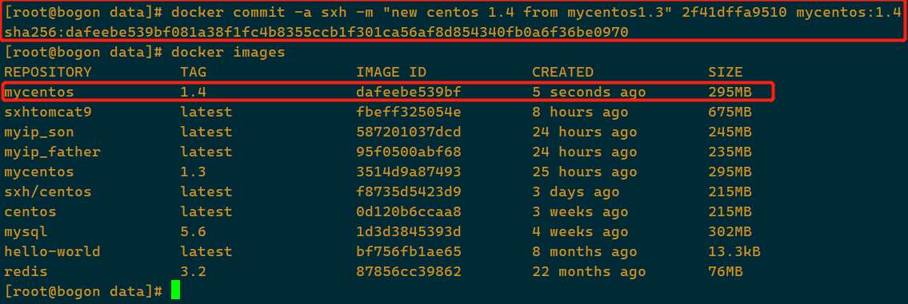

# 3. 将本地镜像推送到阿里云

## 本地镜像素材原型

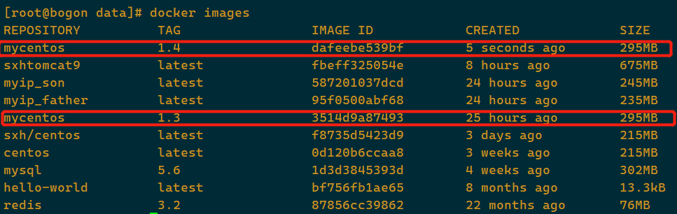

## 阿里云开发者平台

https://cr.console.aliyun.com/cn-hangzhou/instances/namespaces

## 创建仓库镜像

1. 命名空间

   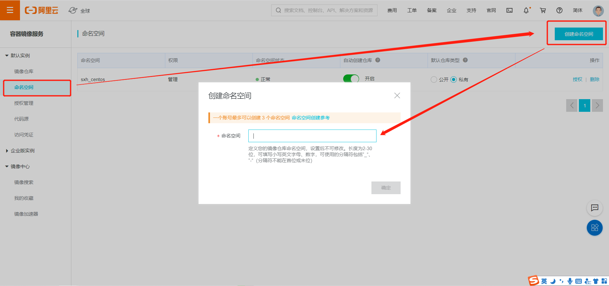

2. 仓库名称

   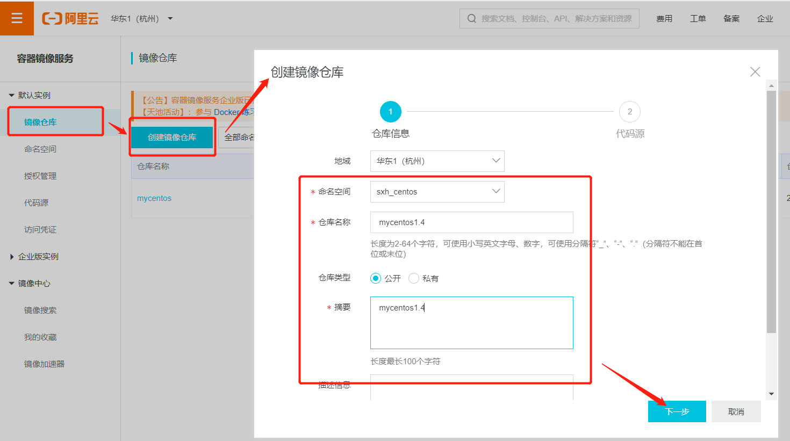

   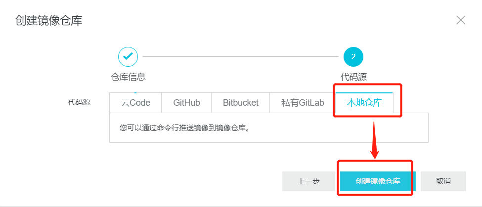

## 将仓库推送到registry

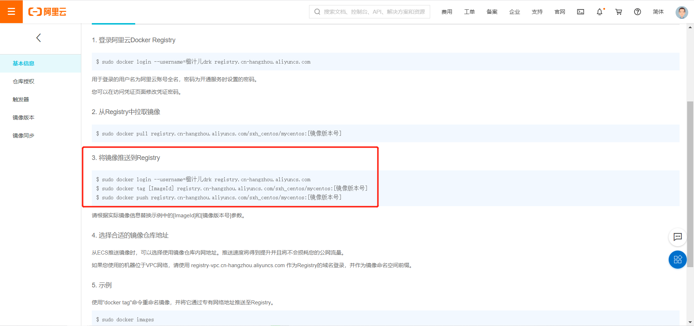

> $ sudo docker login --username=橙汁儿drk registry.cn-hangzhou.aliyuncs.com
> $ sudo docker tag [ImageId] registry.cn-hangzhou.aliyuncs.com/sxh_centos/mycentos:[镜像版本号]
> $ sudo docker push registry.cn-hangzhou.aliyuncs.com/sxh_centos/mycentos:[镜像版本号]

1. 登录

   ```shell
   $ sudo docker login --username=橙汁儿drk registry.cn-hangzhou.aliyuncs.com
   ```

   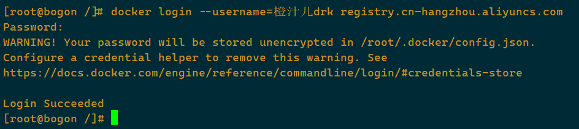

2. 设置推送的镜像和版本号

   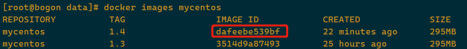

   ```shell
   $ sudo docker tag dafeebe539bf registry.cn-hangzhou.aliyuncs.com/sxh_centos/mycentos:1.4.1
   ```

3. 开始推送到阿里云

   ```shell
   $ sudo docker push registry.cn-hangzhou.aliyuncs.com/sxh_centos/mycentos:1.4.1
   ```

   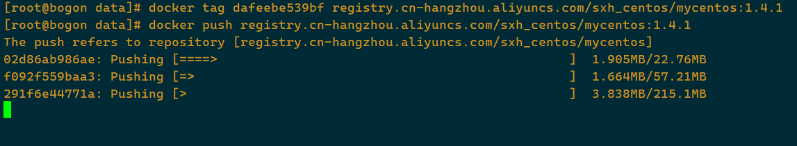

   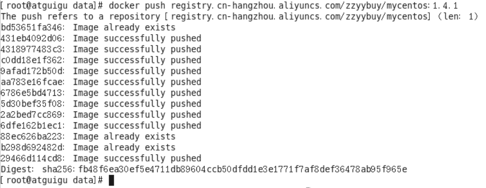

## 公有云可以查询到

> 可以在阿里云中搜索上传的镜像

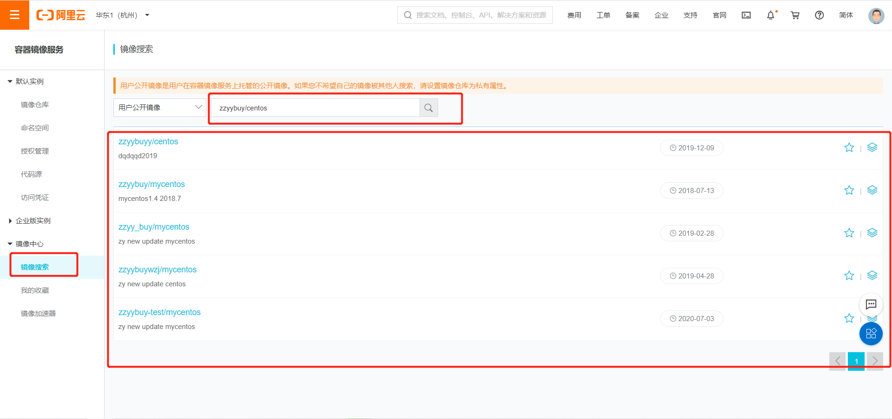

## 查看详情

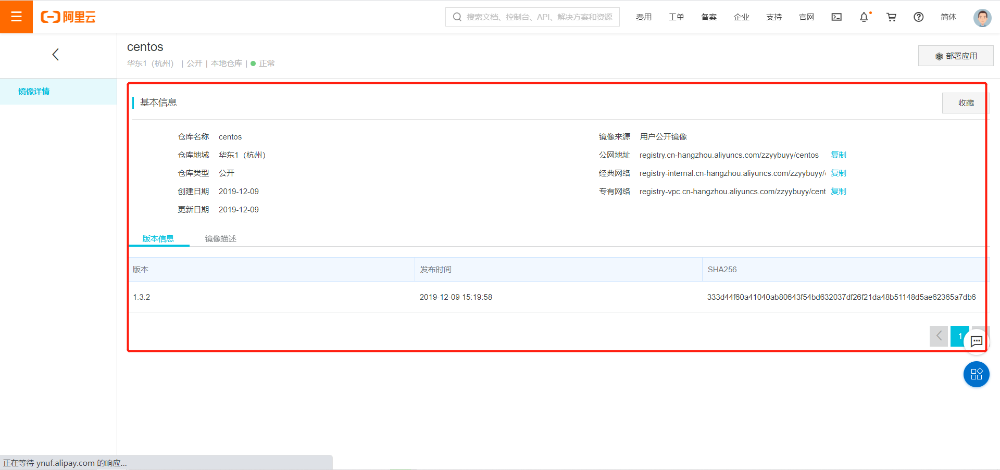

# 4. 将阿里云上的镜像下载到本地

> `docker pull 镜像详情中的地址:版本号`

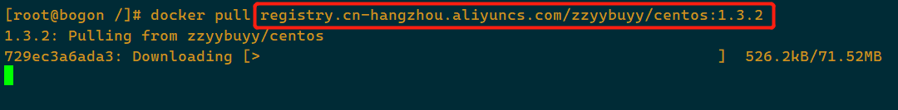