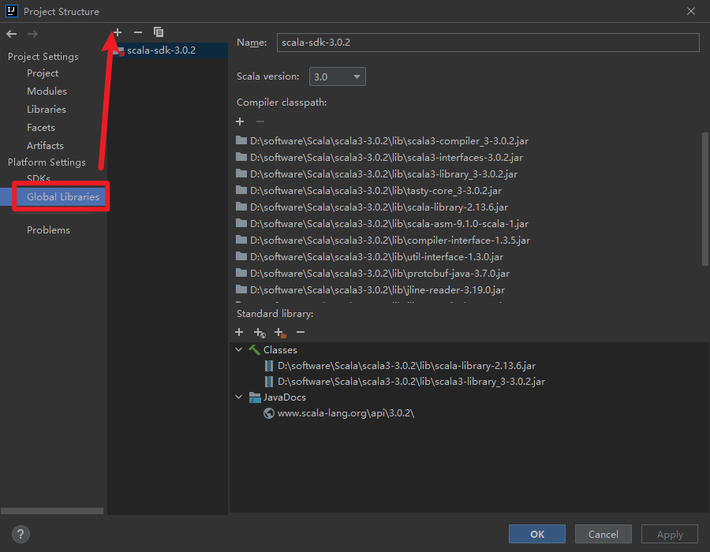
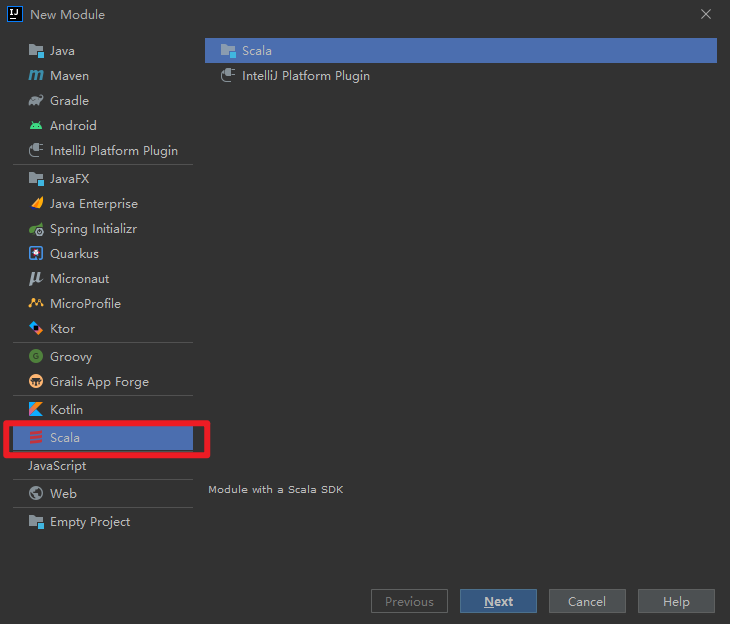

[toc]

# 1. 安装Scala 2.x

进入Scala官网，点击Scala 2下载；配置环境变量，通过`scala -version`判断是否安装成功

# 2. 安装Scala 3.x

进入Scala官网，点击Scala 3下载，页面最下发其他安装方式，选择GitHub 下载Scala二进制文件，下载后解压，配置环境变量，通过`scala -version`判断是否安装成功

Scala 3.x 只有在高版本的IDEA中可以识别，比如（IDEA2021.1.2）

IDEA需要安装Scala插件，在setting-plugins中搜索下载安装重启IDEA即可。在project Structure中添加Scala环境

配置完后在项目目录下右键`new -> module`，可以看到Scala选项

创建好Scala项目后，就可以写Scala代码了

