[toc]

> charles 抓包工具 可以将 页面请求转发到本地服务上
>
> ***用于开发调试***

# 1. 使用教程

## 1.1 设置Charles 代理服务

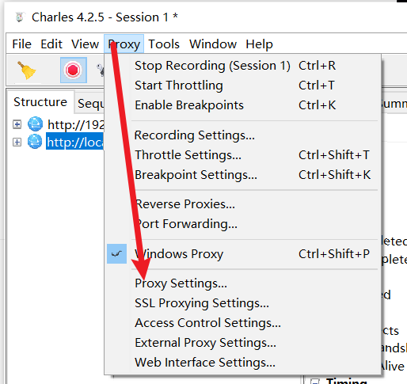

> 设置代理服务的端口ID，并开启`Enable transparent HTTP proxying`选项

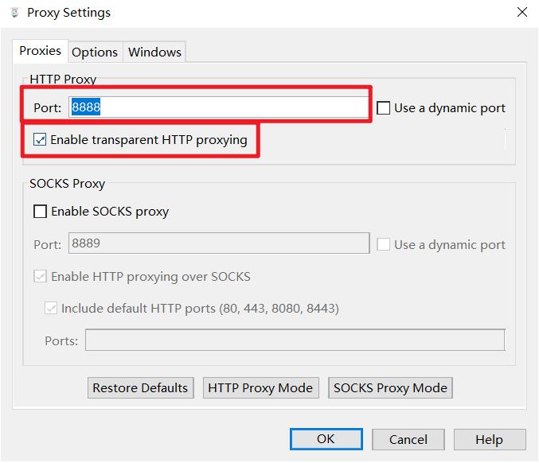

> 开启Windows代理

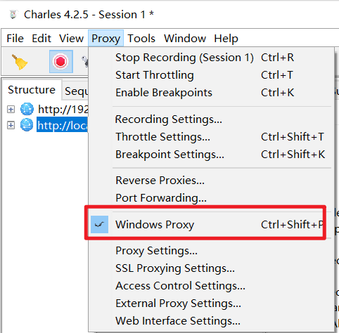

## 1.2 开启windows代理

在Windows设置中设置代理服务器的IP，端口。

并保存

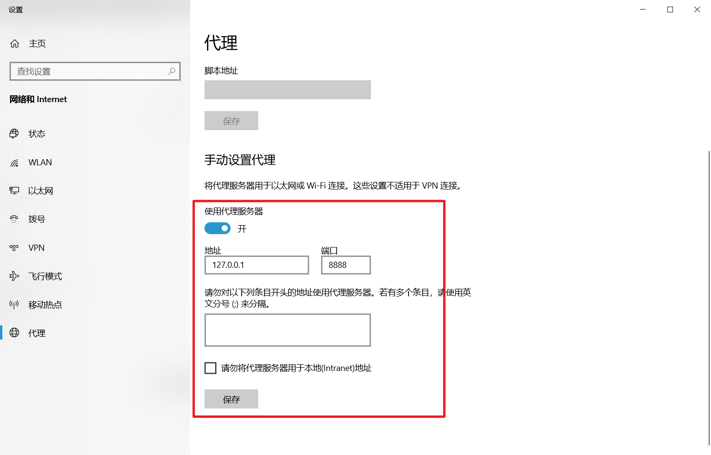

## 1.3 设置拦截请求

> 选择`Map Remote` 

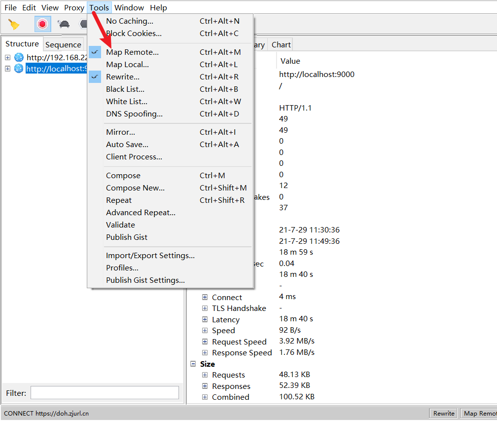

> 开启映射关系，并添加映射规则

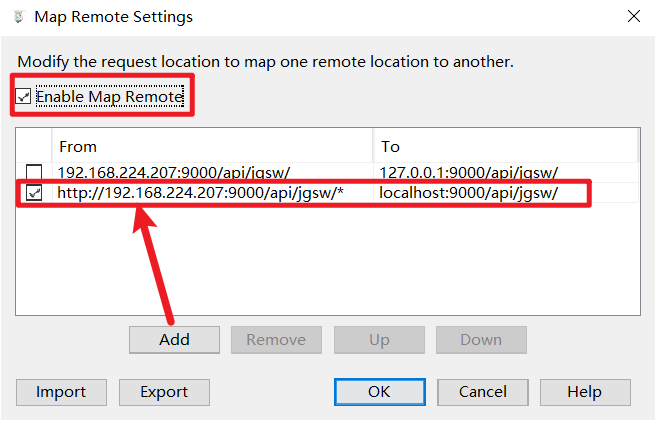

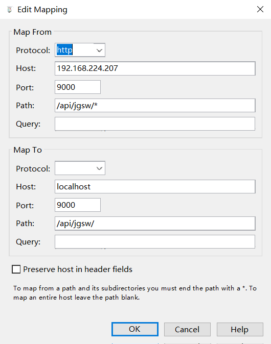

## 1.4 重写请求

> 部分请求需要登录，需要把请求中的Cookie重写，改成本地的Cookie，本地才能识别用户是登录的

选择Tools –> Rewrite

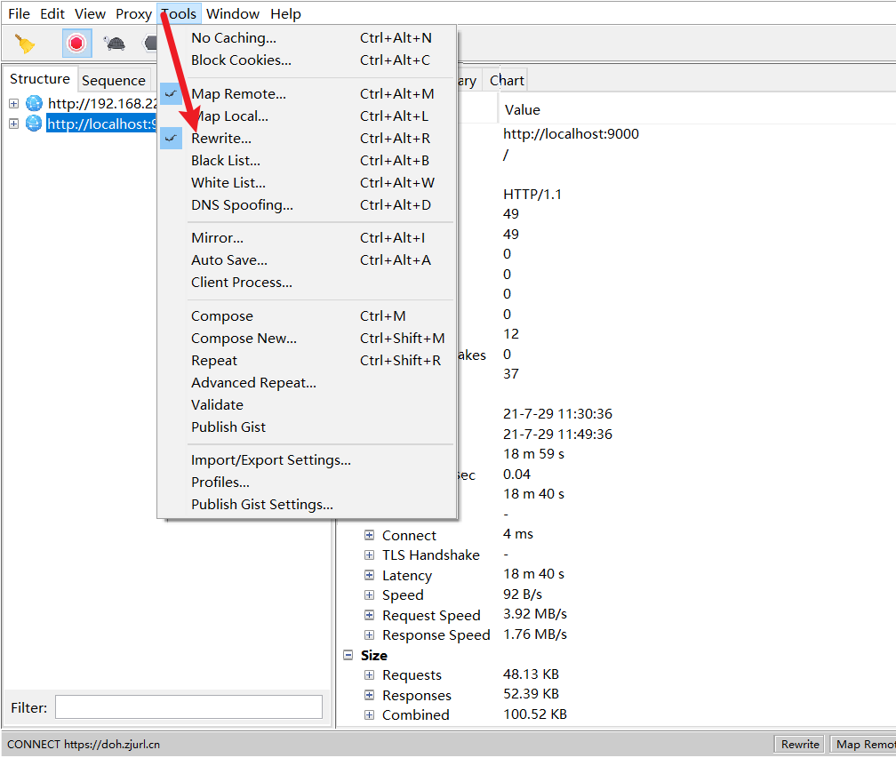

开启 重写

添加一个重写规则

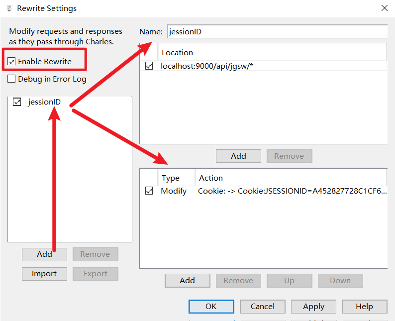

1. 右上角：添加需要拦截的请求

2. 右下角：添加一个规则，需要重写哪部分

   - 可以选择类型，要添加、修改、删除哪部分的数据

   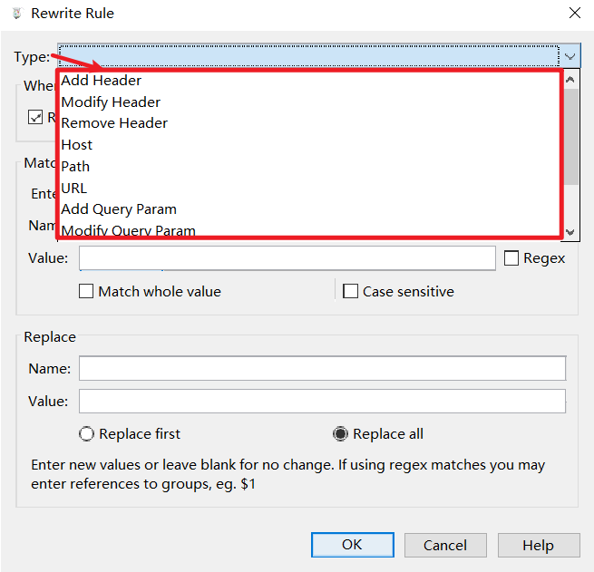

   - 中间配置规则

   - 下方配置需要修改成哪些内容

     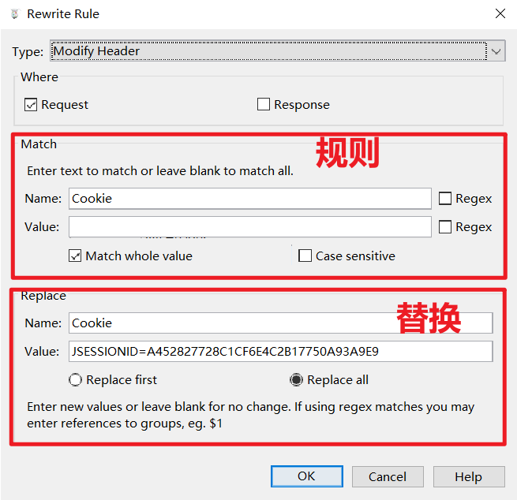

     > 上图表示吧拦截到的请求中的Cookie修改为：JSESSIONID=A4……..

## 1.5 过滤请求

> Charles 会拦截所有的Http请求，右侧列表会显示很多请求，我们只需要看想要看的，就需要过滤

选择`prox`

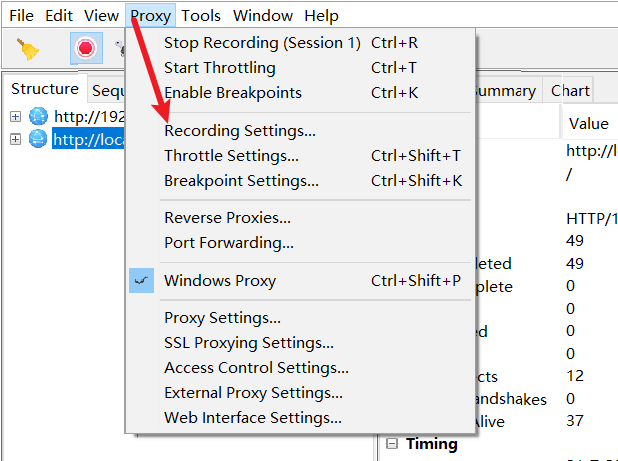

添加想要看到的请求

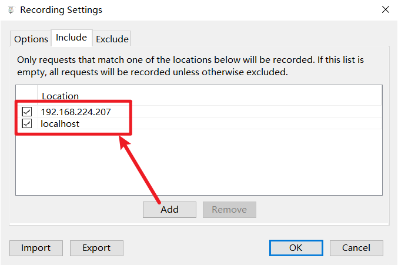

最后重启Charles就可以用了

# 2. 激活Charles

> 不激活也能用30天，但是没30分钟就需要重启一次

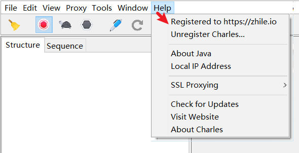

填入以下内容：

> Registered Name: https://zhile.io
> License Key: 48891cf209c6d32bf4