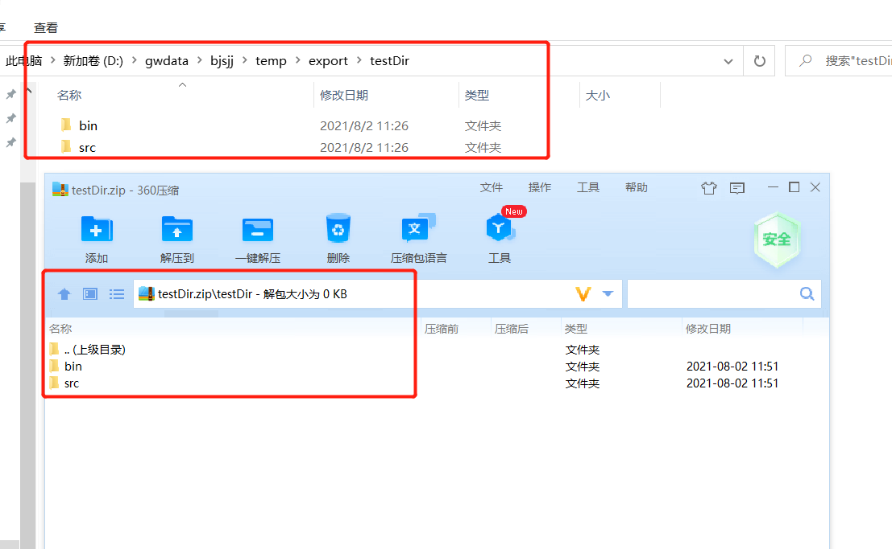

[toc]

# 1. MultipartFile

> Spring接收前端上传来的文件对象

## 1.1 transferTo

用法：`transferTo(new File("xxx"))`

作用：将上传来的文件 转移到 一个新文件中。用了此方法后不可以再用MultipartFile的`getInputStream()`方法，否则会报异常：

```java
java.lang.IllegalStateException: 
	File has been moved - cannot be read again;
```


# 2. 文件/文件夹 压缩/解压缩

> 包含空文件夹，打成压缩包，并保持原有的文件层次

```java
package org.example.utils;

import org.apache.commons.io.IOUtils;
import org.apache.tools.zip.ZipEntry;
import org.apache.tools.zip.ZipFile;
import org.apache.tools.zip.ZipOutputStream;

import java.io.File;
import java.io.FileInputStream;
import java.io.FileOutputStream;
import java.io.IOException;
import java.util.ArrayList;
import java.util.Enumeration;
import java.util.List;


/**
 *  <p>Description:压缩文件夹和文件</p>
 *  <p>@auther:lq</p>
 */
public class ZipUtil {

    private  static String  folderName="";
    /**
     *  压缩文件
     * @param src 要压缩的文件或目录的绝对路径
     * @param zipdSrc 输出的压缩文件的绝对路径
     */
    public static void  zip(String src, String zipdSrc) throws IOException{
        zip(new File(src), new File(zipdSrc));
    }

    /**
     *  压缩文件
     * @param src 要压缩的文件或目录的绝对路径
     * @param zipdSrc 输出的压缩文件
     */
    public static void  zip(String src, File zipdSrc) throws  IOException{
        zip(new File(src), zipdSrc);
    }

    /**
     *  压缩文件
     * @param src 要压缩的文件或目录
     * @param zipdSrc 输出的压缩文件的绝对路径
     */
    public static void  zip(File src, String zipdSrc) throws IOException{
        zip(src,new File(zipdSrc));
    }

    /**
     * 压缩文件
     * @param src 要压缩的文件或目录的绝对路径
     * @param zipdSrc 输出的压缩文件的绝对路径
     * @param folerName
     */
    public  static void zip(String src,String zipdSrc,String folerName){
        ZipUtil.folderName=folerName;

    }
    /**
     * @Description: 根据一个目录和一个子文件/目录得到File对象
     * @param src 要压缩的文件或目录
     * @param zipdSrc 输出的压缩文件
     * @update logs
     * @throws Exception
     */
    public static  void zip(File src,File zipdSrc,String folerName) throws IOException{
        // 通过输入文件目录遍历找出所有的文件
        List<ZipEntry> ziplist=foreach(src);
        // 创建zip的输出流，用来输出zip文件的
        ZipOutputStream out = new ZipOutputStream(zipdSrc);
        for(ZipEntry zip: ziplist){
            File file=new File(src.getParent(),folerName+File.separator+zip.getName());
            out.putNextEntry(zip);
            FileInputStream in=new FileInputStream(file);
            byte[] buffer = new byte[1024 * 8];
            for(int len=0; (len = in.read(buffer)) != -1;){
                out.write(buffer,0,len);
            }
            in.close();
            out.flush();
        }
        out.close();
    }

    /**
     Description: 压缩文件
     * @param src 要压缩的文件或目录
     * @param zipdSrc 输出的压缩文件
     * @throws IOException
     */
    public static  void  zip(File src,File zipdSrc)throws IOException{
        //获取文件目录下的所有文件
        List<ZipEntry> ziplist=foreach(src);
        //创建输出流
        ZipOutputStream out=new ZipOutputStream(zipdSrc);
        for(ZipEntry zip:ziplist){
            if (zip.isDirectory()) {
                out.putNextEntry(zip);
                continue;
            }
            File file=new File(src.getParent(),zip.getName());
            out.putNextEntry(zip);
            FileInputStream in=new FileInputStream(file);
            byte [] buffer=new byte[1024*8];
            //如果读到最后没有数据。则返回-1
            for(int len=0; (len = in.read(buffer)) !=-1;){
                out.write(buffer,0,len);
            }
            in.close();
            out.flush();
        }
        out.close();
    }

    /**
     * 递归查找文件
     * @param file
     * @return
     */
    private static List<ZipEntry> foreach(File file) {
        return foreach(file, "");
    }

    /**
     *  @Description: 解压缩
     * @param src 需要解压的压缩文件
     * @param out 解压到的目录
     */
    public static void unZip(File src,File out) throws IOException{
        // 先创建要解压的文件
        ZipFile zipFile=new ZipFile(src,"GB18030");
        //通过entries()循环读取来得到文件。  hasMoreElemerts() 用来判断是否有元素
        for(Enumeration<ZipEntry> entries = zipFile.getEntries(); entries.hasMoreElements();){
            //可以连续地调用nextElement()方法来得到 Enumeration枚举对象中的元素
            ZipEntry entry=entries.nextElement();
            File file = new  File(out,entry.getName());
            if(entry.isDirectory()){
                file.mkdirs();
            }else {
                File parent = file.getParentFile();
                if (!parent.exists()) {
                    parent.mkdirs();
                }
                IOUtils.copy(zipFile.getInputStream(entry), new FileOutputStream(file));
            }
        }
        zipFile.close();
    }

    /**
     * @Description: 解压缩
     * @param src 需要解压的压缩文件
     * @param out 解压到的目录
     * @create: 2019-07-27 9:54
     * @update logs
     * @throws Exception
     */
    public static  void  unZip(String src,String out) throws IOException{
        unZip(new File(src), new File(out));
    }
    /**
     * @Description: 解压缩
     * @param src 需要解压的压缩文件
     * @param out 解压到的目录
     * @create: 2019-07-27 9:54
     * @update logs
     * @throws Exception
     */
    public static  void  unZip(File src,String out) throws IOException{
        unZip(src, new File(out));
    }
    /**
     * @Description: 解压缩
     * @param src 需要解压的压缩文件
     * @param out 解压到的目录
     * @create: 2019-07-27 9:54
     * @update logs
     * @throws Exception
     */
    public static  void  unZip(String src,File out)throws IOException{
        unZip(new File(src), out);
    }

    /**
     * @Description: 递归获取指定路径下的所有压缩文件
     * @update logs
     * @throws Exception
     */
    private static List<ZipEntry> foreach(File file, String path) {
        List<ZipEntry> list = new ArrayList<ZipEntry>();
        if (file.isDirectory()) {
            path += file.getName() + File.separator;
            list.add(new ZipEntry(path));
            for (File fo : file.listFiles()) {
                list.addAll(foreach(fo, path));
            }
        } else if (file.isFile()) {
            list.add(new ZipEntry(path.replace(folderName, "")
                    + file.getName()));
        }
        return list;
    }

    //测试
    public static void main(String[] args) throws Exception {
        //ZipUtil.zip("D:\\office\\解压缩测试", "D:\\office\\解压缩测试.zip");
        //ZipUtil.unZip("D:\\office\\office.zip","D:\\office\\解压缩测试");

        File outFiles = new File("D:\\gwdata\\bjsjj\\temp\\export\\testDir.zip");
        //boolean newFile = outFiles.createNewFile();
        ZipUtil.zip("D:\\gwdata\\bjsjj\\temp\\export\\testDir",outFiles);
    }

}

```


