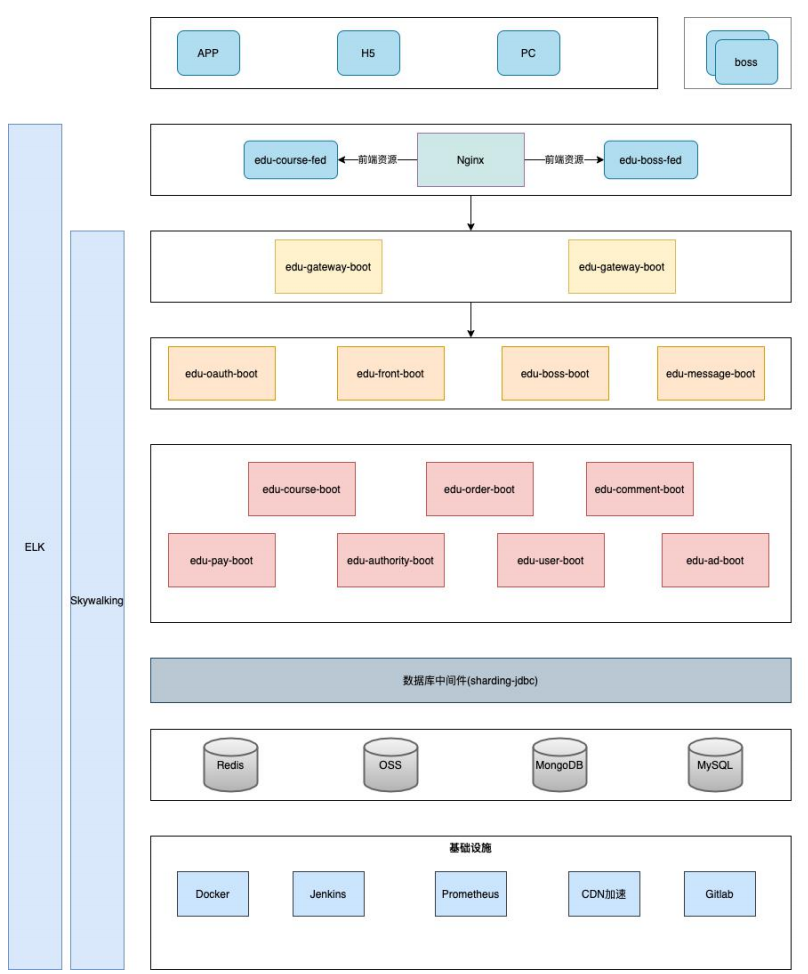

[toc]

# 1. 分页查询

每个表对象大部分对应了3个JavaBean

- 对应表结构的entity对象
- 对应传输的DTO对象（用于返回数据/接收前端请求）
- 对应筛选的DTO对象（可无）

现在有一个表`policy_info`

- entity对象：PolicyInfo
- 传输对象：PolicyInfoDTO
- 对应该表查询对象：policyInfoQueryDTO


## 1.1 接收分页基类

为了方便接收前端请求中的分页数据，现在新建一个分页基类：BasePageVo，在对应的查询对象中extend，即可获取前端传过来的分页参数

- page : 查询第几页
- rows：查询多少条

```java
package com.sxh.oa.common.page;


import org.apache.commons.lang3.builder.ReflectionToStringBuilder;

import java.io.Serializable;


public class BasePageVO implements Serializable {


    /**
	 */
	private static final long serialVersionUID = 5407112309847105354L;

	/**
     * 页数
     */
    private int page = 1;

    /**
     * 开始记录数
     */
    private int from;

    /**
     * 查询条数
     */
    private int rows = 10;

    /**
     * Description:构造方法
     */
    public BasePageVO() {
        super();
    }

    /**
     * Title:
     * Description:构造方法
     *
     * @param page
     * @param from
     * @param rows
     */
    public BasePageVO(int page, int from, int rows) {
        this.page = page;
        this.from = from;
        this.rows = rows;
    }

    public int getPage() {
        return page;
    }

    public void setPage(int page) {
        this.page = page;
    }

    public int getFrom() {
        from = (page - 1) * rows;
        return from;
    }

    public void setFrom(int from) {
        this.from = from;
    }

    public int getRows() {
        return rows;
    }

    public void setRows(int rows) {
        this.rows = rows;
    }

    @Override
    public String toString() {
        return ReflectionToStringBuilder.toString(this);
    }
}

```

现在需要对policy_info表分页查询。该对象中可以放置一些筛选条件

```java
package com.sxh.oa.policy.dto;

import com.sxh.oa.common.page.BasePageVO;
import lombok.AllArgsConstructor;
import lombok.Builder;
import lombok.Data;
import lombok.NoArgsConstructor;

/**
 * 政策查询对象
 */
@Data
@NoArgsConstructor
@AllArgsConstructor
@Builder
public class PolicyQueryDTO extends BasePageVO {

    private String name;
}

```

在service中就可以通过查询对象，获取对应参数

```java
package com.sxh.oa.policy.service.impl;

/**
 * <p>
 * policy management 服务实现类
 * </p>
 *
 * @author leo
 * @since 2021-08-25
 */
@Service
public class TPomPolicyinfoServiceImpl extends ServiceImpl<TPomPolicyinfoMapper, TPomPolicyinfo> implements ITPomPolicyinfoService {


    @Override
    public DataGrid<PolicyInfoDTO> getPageList(PolicyQueryDTO policyQueryDTO) {
        // 获取分页对象
        Page<TPomPolicyinfo> page = new Page<TPomPolicyinfo>(policyQueryDTO.getPage(), policyQueryDTO.getRows());
        // 获取筛选器
        QueryWrapper<TPomPolicyinfo> wrapper = new QueryWrapper<>();
        wrapper.like("POLICY_FILE_NAME", policyQueryDTO.getName());
        Page<TPomPolicyinfo> pageData = page(page, wrapper);
        // 初始化 调用传输对象
        DataGrid<PolicyInfoDTO> dataGrid = new DataGrid<>();
        dataGrid.setRows(ConvertUtils.convertList(pageData.getRecords(), PolicyInfoDTO.class));
        dataGrid.setTotal(pageData.getTotal());// 筛选条件下一共有多少条
        dataGrid.setCurrentPage(pageData.getCurrent());// 当前页数
        return dataGrid;
    }
}

```


## 1.2 返回分页基类

当分页查询时，返回数据时应该带上分页查询的页数结果。封装一个统一的类`DataGrid`用于返回分页数据

```java
package com.sxh.oa.common.page;

import lombok.AllArgsConstructor;
import lombok.Data;
import lombok.NoArgsConstructor;

import java.util.ArrayList;
import java.util.List;


@Data
@NoArgsConstructor
@AllArgsConstructor
public class DataGrid<T>{

    //总记录条数
    private Long total = 0L;
    
    // 总页数
    private Long totalPages = 0L;
    
    // 当前页数
    private Long currentPage = 0L;

    // 本页数据记录
    private List<T> rows = new ArrayList<>();
}

```

Service 中分页查询`policy_info`表数据

```java
package com.sxh.oa.policy.service.impl;

/**
 * <p>
 * policy management 服务实现类
 * </p>
 *
 * @author leo
 * @since 2021-08-25
 */
@Service
public class TPomPolicyinfoServiceImpl extends ServiceImpl<TPomPolicyinfoMapper, TPomPolicyinfo> implements ITPomPolicyinfoService {


    @Override
    public DataGrid<PolicyInfoDTO> getPageList(PolicyQueryDTO policyQueryDTO) {
        // 获取分页对象
        Page<TPomPolicyinfo> page = new Page<TPomPolicyinfo>(policyQueryDTO.getPage(), policyQueryDTO.getRows());
        // 获取筛选器
        QueryWrapper<TPomPolicyinfo> wrapper = new QueryWrapper<>();
        wrapper.like("POLICY_FILE_NAME", policyQueryDTO.getName());
        Page<TPomPolicyinfo> pageData = page(page, wrapper);
        
        // 初始化 调用传输对象
        DataGrid<PolicyInfoDTO> dataGrid = new DataGrid<>();
        dataGrid.setRows(ConvertUtils.convertList(pageData.getRecords(), PolicyInfoDTO.class));
        dataGrid.setTotal(pageData.getTotal());// 筛选条件下一共有多少条
        dataGrid.setCurrentPage(pageData.getCurrent());// 当前页数
        return dataGrid;
    }
}

```

Controller中需要通过统一的ResponseDTO返回数据

```java
@GetMapping("/list")
public ResponseDTO<DataGrid<PolicyInfoDTO>> list(PolicyQueryDTO queryDTO) {
    DataGrid<PolicyInfoDTO> pageList = tPomPolicyinfoService.getPageList(queryDTO);
    return ResponseDTO.success(pageList);
}
```


# 2. 微服务请求流向

一个系统有用户前台页面和后台管理页面，公用一个数据库

所以

- 用户请求的接口走一个服务(xxx.front.boot)
  - 该服务调用其他服务暴露的api，进行远程调用

- 后台管理走一个服务（xxx.boss.boot）
  - 该服务调用其他服务暴露的api，进行远程调用




# 3. jar包版本管理

1. 可以将所有微服务放到一个module下，该module的pom使用管理所有可能用到的jar包`<dependencyManagement>`，该module下所有的子module的parent都是父module，就可以管理jar包版本
2. 也可以提出来一个只有pom的module，在这里面管理所有的jar包版本，其他的module继承或者`<dependencyManagement>`依赖进来。如果该module是一个父module，使用`<dependencyManagement>`，子module就可以继承版本号了

